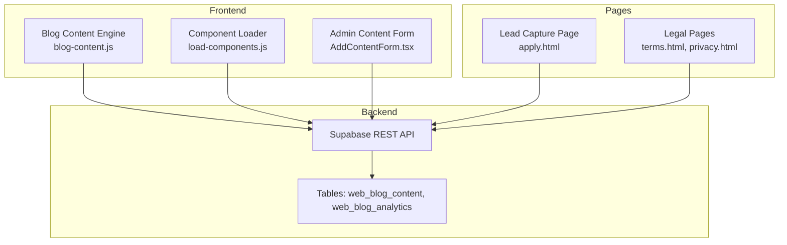
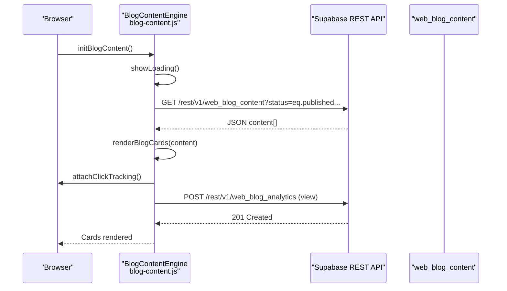
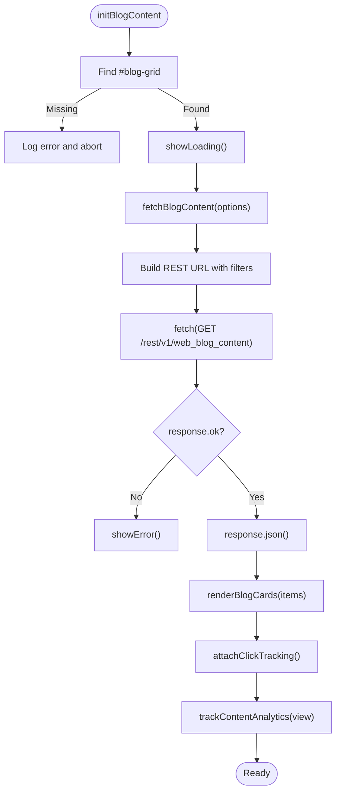
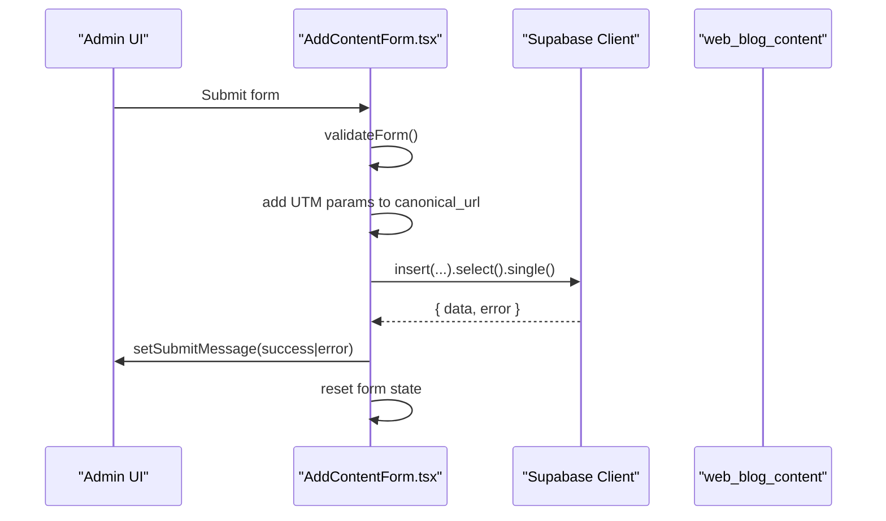
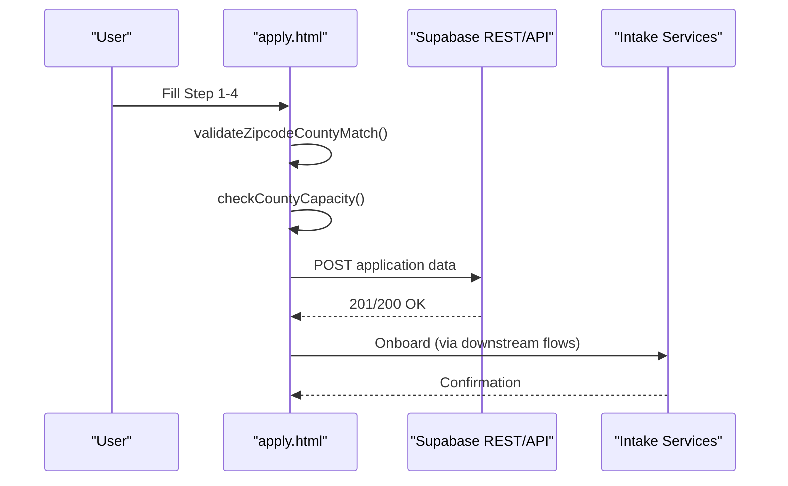
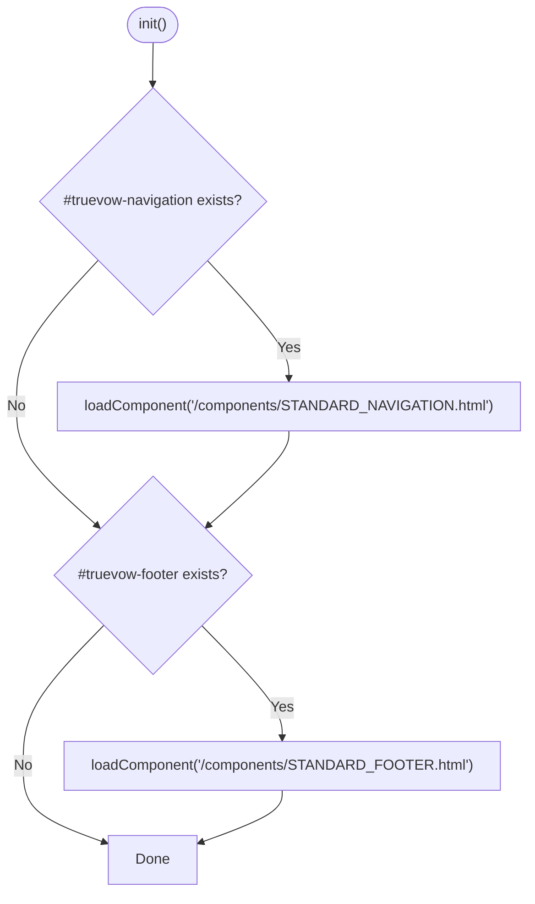
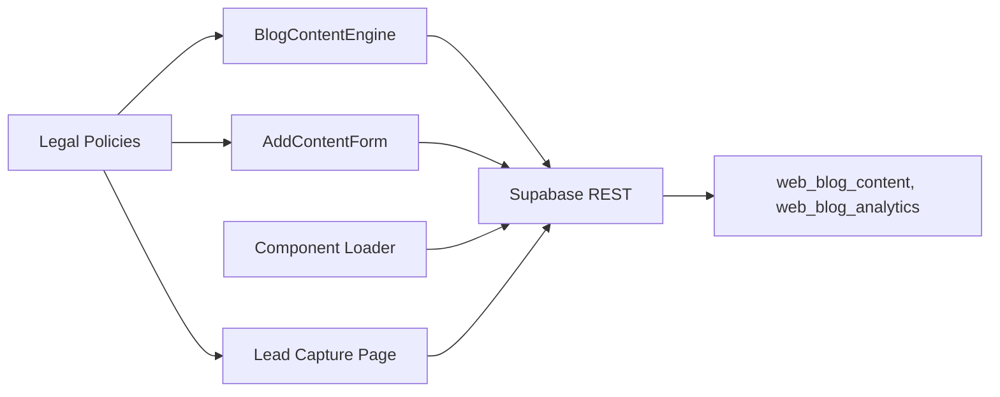

# API Integration Examples

<cite>
**Referenced Files in This Document**
- [blog-content.js](file://PRODUCTION_DEPLOY/js/blog-content.js)
- [blog-content.js](file://js/blog-content.js)
- [load-components.js](file://PRODUCTION_DEPLOY/js/load-components.js)
- [AddContentForm.tsx](file://components/admin/AddContentForm.tsx)
- [apply.html](file://PRODUCTION_DEPLOY/marketing/apply.html)
- [terms.html](file://PRODUCTION_DEPLOY/legal/terms.html)
- [privacy.html](file://PRODUCTION_DEPLOY/legal/privacy.html)
- [001_initial_blog_schema.sql](file://supabase/migrations/001_initial_blog_schema.sql)
</cite>

## Table of Contents
1. [Introduction](#introduction)
2. [Project Structure](#project-structure)
3. [Core Components](#core-components)
4. [Architecture Overview](#architecture-overview)
5. [Detailed Component Analysis](#detailed-component-analysis)
6. [Dependency Analysis](#dependency-analysis)
7. [Performance Considerations](#performance-considerations)
8. [Troubleshooting Guide](#troubleshooting-guide)
9. [Conclusion](#conclusion)
10. [Appendices](#appendices)

## Introduction
This document provides practical API integration examples and usage patterns for TrueVow’s REST API and Edge Functions. It focuses on:
- Blog content loading via Supabase REST API
- Form submission workflows for lead generation
- Analytics tracking for content engagement
- Widget integration patterns
- Error handling, debugging, and performance optimization
- API versioning, backward compatibility, and migration strategies

The examples are grounded in the repository’s actual implementation and aim to help developers integrate TrueVow’s services efficiently while maintaining robustness and compliance.

## Project Structure
The relevant integration surfaces are distributed across:
- Frontend JavaScript for dynamic content loading and component injection
- Admin React component for content management
- Marketing pages for lead capture and conversion
- Supabase schema and migrations for backend data structures

**Diagram sources**
- [blog-content.js](file://PRODUCTION_DEPLOY/js/blog-content.js#L26-L64)
- [load-components.js](file://PRODUCTION_DEPLOY/js/load-components.js#L14-L31)
- [AddContentForm.tsx](file://components/admin/AddContentForm.tsx#L96-L101)
- [apply.html](file://PRODUCTION_DEPLOY/marketing/apply.html#L536-L800)
- [terms.html](file://PRODUCTION_DEPLOY/legal/terms.html#L240-L500)
- [privacy.html](file://PRODUCTION_DEPLOY/legal/privacy.html#L254-L342)

**Section sources**
- [blog-content.js](file://PRODUCTION_DEPLOY/js/blog-content.js#L1-L424)
- [load-components.js](file://PRODUCTION_DEPLOY/js/load-components.js#L1-L58)
- [AddContentForm.tsx](file://components/admin/AddContentForm.tsx#L1-L357)
- [apply.html](file://PRODUCTION_DEPLOY/marketing/apply.html#L1-L800)
- [terms.html](file://PRODUCTION_DEPLOY/legal/terms.html#L1-L800)
- [privacy.html](file://PRODUCTION_DEPLOY/legal/privacy.html#L1-L800)
- [001_initial_blog_schema.sql](file://supabase/migrations/001_initial_blog_schema.sql#L1-L27)

## Core Components
- Blog Content Engine: Fetches published content, renders cards, and tracks analytics
- Component Loader: Injects reusable navigation/footer components
- Admin Content Form: Adds new articles/videos to the blog hub
- Lead Capture Page: Multi-step form for intake applications
- Legal Documents: Terms and Privacy policies governing data handling and API usage

Key integration points:
- Supabase REST endpoint for blog content retrieval and analytics posting
- Supabase client for admin content insertion
- Client-side analytics tracking with graceful error handling

**Section sources**
- [blog-content.js](file://PRODUCTION_DEPLOY/js/blog-content.js#L26-L102)
- [load-components.js](file://PRODUCTION_DEPLOY/js/load-components.js#L14-L31)
- [AddContentForm.tsx](file://components/admin/AddContentForm.tsx#L63-L141)
- [apply.html](file://PRODUCTION_DEPLOY/marketing/apply.html#L536-L800)
- [terms.html](file://PRODUCTION_DEPLOY/legal/terms.html#L240-L500)
- [privacy.html](file://PRODUCTION_DEPLOY/legal/privacy.html#L254-L342)

## Architecture Overview
The frontend integrates with Supabase via REST and client SDKs. The admin UI uses Supabase client to insert content, while the public site fetches content and tracks engagement.

**Diagram sources**
- [blog-content.js](file://PRODUCTION_DEPLOY/js/blog-content.js#L319-L350)
- [blog-content.js](file://PRODUCTION_DEPLOY/js/blog-content.js#L109-L219)
- [blog-content.js](file://PRODUCTION_DEPLOY/js/blog-content.js#L72-L102)

**Section sources**
- [blog-content.js](file://PRODUCTION_DEPLOY/js/blog-content.js#L26-L102)

## Detailed Component Analysis

### Blog Content Loading and Analytics Tracking
- Fetches published content with optional filters (type, featured, limit)
- Renders cards with platform-specific badges and links
- Tracks page views and clicks with metadata (IP, UA, referrer, UTM)
- Graceful error handling and retry UX

**Diagram sources**
- [blog-content.js](file://PRODUCTION_DEPLOY/js/blog-content.js#L319-L350)
- [blog-content.js](file://PRODUCTION_DEPLOY/js/blog-content.js#L26-L64)
- [blog-content.js](file://PRODUCTION_DEPLOY/js/blog-content.js#L109-L219)
- [blog-content.js](file://PRODUCTION_DEPLOY/js/blog-content.js#L72-L102)

**Section sources**
- [blog-content.js](file://PRODUCTION_DEPLOY/js/blog-content.js#L26-L102)
- [blog-content.js](file://PRODUCTION_DEPLOY/js/blog-content.js#L109-L219)
- [blog-content.js](file://PRODUCTION_DEPLOY/js/blog-content.js#L319-L350)

### Admin Content Submission Workflow
- Validates required fields and enriches canonical URLs with UTM parameters
- Inserts content into Supabase using the client SDK
- Provides success/error messaging and resets form state

**Diagram sources**
- [AddContentForm.tsx](file://components/admin/AddContentForm.tsx#L34-L60)
- [AddContentForm.tsx](file://components/admin/AddContentForm.tsx#L74-L141)
- [AddContentForm.tsx](file://components/admin/AddContentForm.tsx#L96-L101)

**Section sources**
- [AddContentForm.tsx](file://components/admin/AddContentForm.tsx#L34-L141)

### Lead Generation Form Integration
- Multi-step form with validation and progress indicators
- ZIP code lookup and county capacity checks
- Eligibility confirmation and bar license capture
- Submission pipeline aligned with intake services

**Diagram sources**
- [apply.html](file://PRODUCTION_DEPLOY/marketing/apply.html#L660-L721)
- [apply.html](file://PRODUCTION_DEPLOY/marketing/apply.html#L723-L782)
- [apply.html](file://PRODUCTION_DEPLOY/marketing/apply.html#L784-L800)

**Section sources**
- [apply.html](file://PRODUCTION_DEPLOY/marketing/apply.html#L536-L800)

### Component Injection Pattern
- Loads navigation and footer from static HTML files
- Robust error handling for missing files or targets

**Diagram sources**
- [load-components.js](file://PRODUCTION_DEPLOY/js/load-components.js#L36-L55)
- [load-components.js](file://PRODUCTION_DEPLOY/js/load-components.js#L14-L31)

**Section sources**
- [load-components.js](file://PRODUCTION_DEPLOY/js/load-components.js#L1-L58)

## Dependency Analysis
- Blog content engine depends on Supabase REST API and DOM manipulation
- Admin form depends on Supabase client SDK and React
- Lead capture page depends on client-side validation and Supabase REST API
- Legal pages define policies that govern data handling and API usage

**Diagram sources**
- [blog-content.js](file://PRODUCTION_DEPLOY/js/blog-content.js#L26-L64)
- [AddContentForm.tsx](file://components/admin/AddContentForm.tsx#L96-L101)
- [load-components.js](file://PRODUCTION_DEPLOY/js/load-components.js#L14-L31)
- [apply.html](file://PRODUCTION_DEPLOY/marketing/apply.html#L536-L800)
- [terms.html](file://PRODUCTION_DEPLOY/legal/terms.html#L240-L500)
- [privacy.html](file://PRODUCTION_DEPLOY/legal/privacy.html#L254-L342)

**Section sources**
- [blog-content.js](file://PRODUCTION_DEPLOY/js/blog-content.js#L26-L102)
- [AddContentForm.tsx](file://components/admin/AddContentForm.tsx#L96-L101)
- [load-components.js](file://PRODUCTION_DEPLOY/js/load-components.js#L14-L31)
- [apply.html](file://PRODUCTION_DEPLOY/marketing/apply.html#L536-L800)
- [terms.html](file://PRODUCTION_DEPLOY/legal/terms.html#L240-L500)
- [privacy.html](file://PRODUCTION_DEPLOY/legal/privacy.html#L254-L342)

## Performance Considerations
- Use selective column queries to reduce payload size
- Implement client-side caching for frequently accessed content
- Debounce analytics requests to avoid excessive network calls
- Lazy-load heavy components and defer non-critical scripts
- Monitor Supabase request latency and tune filters to minimize result sets

[No sources needed since this section provides general guidance]

## Troubleshooting Guide
Common issues and resolutions:
- Supabase API errors: Check credentials and CORS headers; verify table permissions and RLS policies
- Analytics tracking failures: Analytics are best-effort; ensure metadata is sanitized and network requests are not blocked
- Component loading failures: Verify file paths and target element IDs; check browser console for 404s
- Form validation errors: Ensure required fields are present and canonical URLs include UTM parameters when missing
- Legal compliance: Confirm adherence to Terms and Privacy policies for data handling and retention

**Section sources**
- [blog-content.js](file://PRODUCTION_DEPLOY/js/blog-content.js#L54-L63)
- [blog-content.js](file://PRODUCTION_DEPLOY/js/blog-content.js#L95-L101)
- [load-components.js](file://PRODUCTION_DEPLOY/js/load-components.js#L17-L29)
- [AddContentForm.tsx](file://components/admin/AddContentForm.tsx#L132-L140)
- [terms.html](file://PRODUCTION_DEPLOY/legal/terms.html#L240-L500)
- [privacy.html](file://PRODUCTION_DEPLOY/legal/privacy.html#L254-L342)

## Conclusion
TrueVow’s integration surface combines Supabase REST and client SDKs with straightforward frontend patterns. The examples demonstrate robust content loading, analytics tracking, admin workflows, and lead capture. Following the best practices and troubleshooting steps outlined here will help ensure reliable, secure, and performant integrations.

[No sources needed since this section summarizes without analyzing specific files]

## Appendices

### API Versioning and Migration Strategies
- Supabase REST API stability: Use documented endpoints and prefer selective column queries
- RLS and schema evolution: Review migration files and ensure backward-compatible changes
- Admin content insertion: Validate data types and constraints before insertions

**Section sources**
- [001_initial_blog_schema.sql](file://supabase/migrations/001_initial_blog_schema.sql#L1-L27)
- [AddContentForm.tsx](file://components/admin/AddContentForm.tsx#L81-L94)