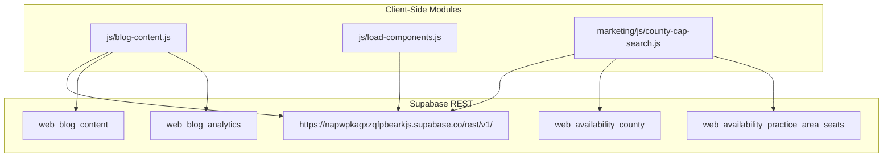
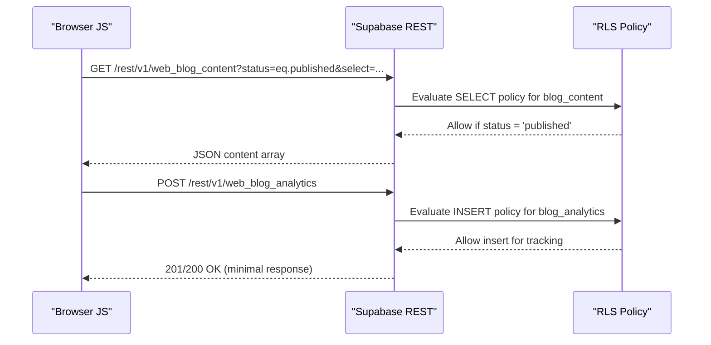
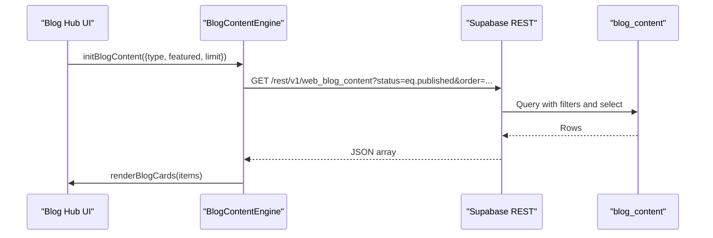
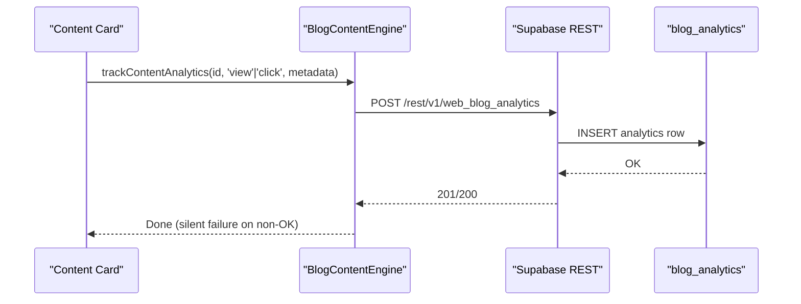
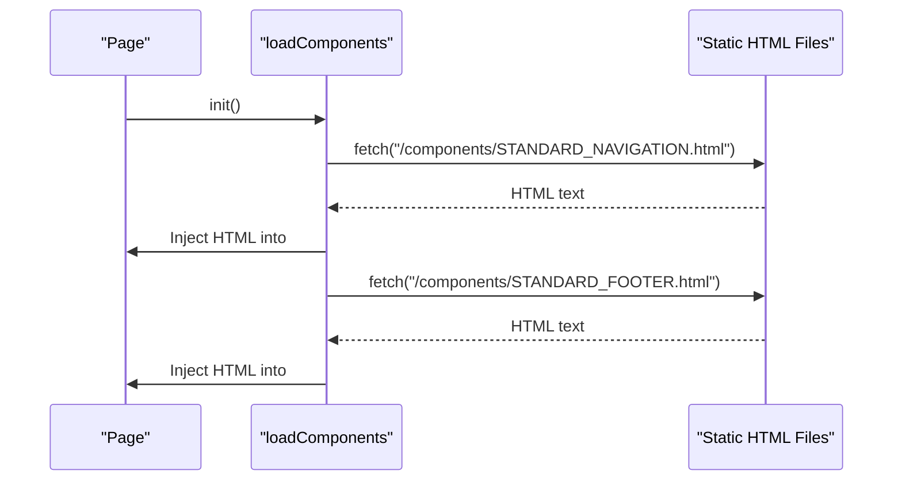
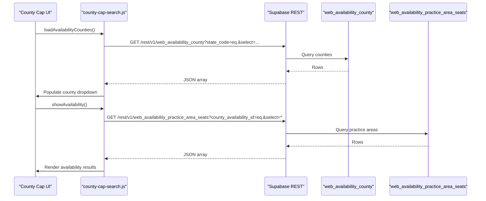
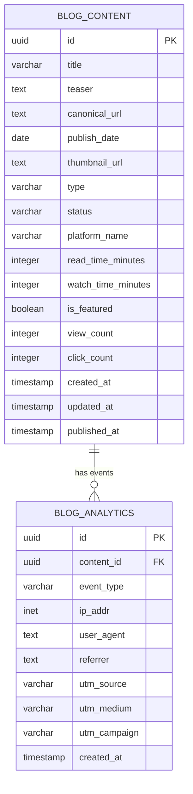
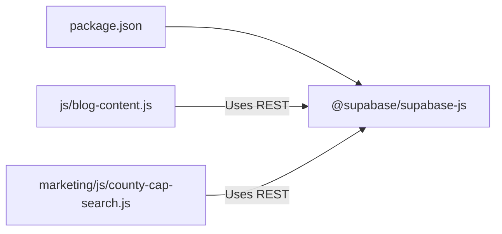

# API Reference

<cite>
**Referenced Files in This Document**
- [blog-content.js](file://js/blog-content.js)
- [blog-content.js](file://PRODUCTION_DEPLOY/js/blog-content.js)
- [load-components.js](file://js/load-components.js)
- [load-components.js](file://PRODUCTION_DEPLOY/js/load-components.js)
- [county-cap-search.js](file://marketing/js/county-cap-search.js)
- [DATABASE_SCHEMA_README.md](file://supabase/DATABASE_SCHEMA_README.md)
- [001_phase1_website_schema.sql](file://supabase/migrations/001_phase1_website_schema.sql)
- [001_initial_blog_schema.sql](file://supabase/migrations/001_initial_blog_schema.sql)
- [script-1-blog-content-policy.sql](file://supabase/script-1-blog-content-policy.sql)
- [package.json](file://package.json)
</cite>

## Table of Contents
1. [Introduction](#introduction)
2. [Project Structure](#project-structure)
3. [Core Components](#core-components)
4. [Architecture Overview](#architecture-overview)
5. [Detailed Component Analysis](#detailed-component-analysis)
6. [Dependency Analysis](#dependency-analysis)
7. [Performance Considerations](#performance-considerations)
8. [Troubleshooting Guide](#troubleshooting-guide)
9. [Conclusion](#conclusion)
10. [Appendices](#appendices)

## Introduction
This document provides comprehensive API documentation for the TrueVow Website REST API endpoints and Supabase integration. It covers:
- REST endpoints used by the client-side JavaScript modules for blog content retrieval, analytics tracking, and component loading.
- Supabase-backed data models and Row Level Security (RLS) policies.
- Practical usage examples, error handling strategies, response formats, rate limiting considerations, CORS configuration, and security best practices.
- Migration notes and backwards compatibility guidance derived from the repository’s Supabase schema documentation and migration placeholders.

## Project Structure
The API surface is primarily implemented in client-side JavaScript modules that call Supabase REST endpoints. The relevant files are organized as follows:
- Client-side modules: js/blog-content.js, js/load-components.js, marketing/js/county-cap-search.js
- Production-deployed client-side modules mirror the development versions under PRODUCTION_DEPLOY/js
- Supabase schema and migration artifacts under supabase/

**Diagram sources**
- [blog-content.js](file://js/blog-content.js#L26-L64)
- [blog-content.js](file://js/blog-content.js#L72-L102)
- [load-components.js](file://js/load-components.js#L14-L31)
- [county-cap-search.js](file://marketing/js/county-cap-search.js#L26-L89)
- [county-cap-search.js](file://marketing/js/county-cap-search.js#L94-L138)
- [county-cap-search.js](file://marketing/js/county-cap-search.js#L143-L187)

**Section sources**
- [blog-content.js](file://js/blog-content.js#L1-L424)
- [load-components.js](file://js/load-components.js#L1-L58)
- [county-cap-search.js](file://marketing/js/county-cap-search.js#L1-L520)

## Core Components
This section documents the primary client-side modules and their Supabase REST integrations.

- Blog Content Engine (js/blog-content.js)
  - Purpose: Fetch published blog content, render cards, and track analytics.
  - Key endpoints used:
    - GET /rest/v1/web_blog_content with filters and select projection
    - POST /rest/v1/web_blog_analytics for tracking views/clicks
  - Authentication: apikey and Authorization Bearer header using Supabase anonymous key
  - Headers: Content-Type application/json, Prefer return=representation or minimal

- Component Loader (js/load-components.js)
  - Purpose: Dynamically load navigation and footer components via fetch.
  - Behavior: On DOMContentLoaded, attempts to load components from static HTML files.

- County Availability Search (marketing/js/county-cap-search.js)
  - Purpose: Load state/counties, fetch county and practice area seat availability, and render results.
  - Key endpoints used:
    - GET /rest/v1/web_availability_county
    - GET /rest/v1/web_availability_practice_area_seats
  - Authentication: apikey and Authorization Bearer header using Supabase anonymous key

**Section sources**
- [blog-content.js](file://js/blog-content.js#L26-L64)
- [blog-content.js](file://js/blog-content.js#L72-L102)
- [load-components.js](file://js/load-components.js#L14-L31)
- [county-cap-search.js](file://marketing/js/county-cap-search.js#L26-L89)
- [county-cap-search.js](file://marketing/js/county-cap-search.js#L94-L138)
- [county-cap-search.js](file://marketing/js/county-cap-search.js#L143-L187)

## Architecture Overview
The client-side modules communicate with Supabase REST endpoints using the anonymous API key. Supabase enforces RLS policies per table to control access.

**Diagram sources**
- [blog-content.js](file://js/blog-content.js#L26-L64)
- [blog-content.js](file://js/blog-content.js#L72-L102)
- [DATABASE_SCHEMA_README.md](file://supabase/DATABASE_SCHEMA_README.md#L435-L449)
- [script-1-blog-content-policy.sql](file://supabase/script-1-blog-content-policy.sql#L14-L19)

## Detailed Component Analysis

### Blog Content API
- Endpoint: GET /rest/v1/web_blog_content
- Filters:
  - status=eq.published
  - type=eq.{article|video} (optional)
  - is_featured=eq.{true|false} (optional)
  - limit={n} (optional)
- Sorting: order=publish_date.desc
- Projection: select=id,title,teaser,canonical_url,publish_date,thumbnail_url,type,platform_name,read_time_minutes,watch_time_minutes,is_featured,view_count,click_count
- Authentication: apikey and Authorization: Bearer using Supabase anonymous key
- Headers: Content-Type application/json, Prefer return=representation
- Response: Array of content items; each item includes computed fields and counts as defined in the schema documentation
- Error handling: Non-OK responses throw an error; caller should display a user-friendly message

**Diagram sources**
- [blog-content.js](file://js/blog-content.js#L26-L64)
- [blog-content.js](file://js/blog-content.js#L319-L350)
- [DATABASE_SCHEMA_README.md](file://supabase/DATABASE_SCHEMA_README.md#L23-L68)

**Section sources**
- [blog-content.js](file://js/blog-content.js#L26-L64)
- [DATABASE_SCHEMA_README.md](file://supabase/DATABASE_SCHEMA_README.md#L23-L68)

### Analytics Tracking API
- Endpoint: POST /rest/v1/web_blog_analytics
- Request body fields:
  - content_id: UUID
  - event_type: 'view' | 'click' | 'share'
  - ip_addr: optional
  - user_agent: optional
  - referrer: optional
  - utm_source: optional
  - utm_medium: optional
  - utm_campaign: optional
  - created_at: timestamp
- Authentication: apikey and Authorization: Bearer using Supabase anonymous key
- Headers: Content-Type application/json, Prefer return=minimal
- Response: Typically 201/200 with minimal body; failures are logged silently to avoid breaking UX

**Diagram sources**
- [blog-content.js](file://js/blog-content.js#L72-L102)
- [DATABASE_SCHEMA_README.md](file://supabase/DATABASE_SCHEMA_README.md#L77-L129)

**Section sources**
- [blog-content.js](file://js/blog-content.js#L72-L102)
- [DATABASE_SCHEMA_README.md](file://supabase/DATABASE_SCHEMA_README.md#L77-L129)

### Component Loader API
- Purpose: Load navigation/footer components from static HTML files.
- Endpoint pattern: GET {static HTML file path}
- Behavior: On DOMContentLoaded, attempts to load components into placeholders with IDs truevow-navigation and truevow-footer.
- Notes: Uses standard fetch; no authentication required for static HTML.

**Diagram sources**
- [load-components.js](file://js/load-components.js#L14-L31)
- [load-components.js](file://js/load-components.js#L36-L48)

**Section sources**
- [load-components.js](file://js/load-components.js#L14-L31)
- [load-components.js](file://js/load-components.js#L36-L48)

### County Availability Search API
- Counties endpoint: GET /rest/v1/web_availability_county
  - Query params: state_code=eq.{state}, select=county_slug,county_name,total_seats,filled, order=county_name.asc
  - Response: Array of counties with capacity and fill stats
- Practice Areas endpoint: GET /rest/v1/web_availability_practice_area_seats
  - Query params: county_availability_id=eq.{id}, select=*, order=display_order.asc
  - Response: Object keyed by practice area slug with seat caps and remaining counts
- Authentication: apikey and Authorization: Bearer using Supabase anonymous key

**Diagram sources**
- [county-cap-search.js](file://marketing/js/county-cap-search.js#L26-L89)
- [county-cap-search.js](file://marketing/js/county-cap-search.js#L94-L138)
- [county-cap-search.js](file://marketing/js/county-cap-search.js#L143-L187)

**Section sources**
- [county-cap-search.js](file://marketing/js/county-cap-search.js#L26-L89)
- [county-cap-search.js](file://marketing/js/county-cap-search.js#L94-L138)
- [county-cap-search.js](file://marketing/js/county-cap-search.js#L143-L187)

### Supabase Data Models and RLS
- blog_content
  - Public SELECT allowed when status = 'published'
  - INSERT/UPDATE/DELETE restricted to authenticated users
- blog_analytics
  - Public INSERT allowed for tracking
  - SELECT restricted to authenticated users
- newsletter_subscribers
  - Public INSERT allowed for subscriptions
  - SELECT restricted to authenticated users
- firm_applications
  - Public INSERT allowed for form submissions
  - SELECT/UPDATE restricted to authenticated users

**Diagram sources**
- [DATABASE_SCHEMA_README.md](file://supabase/DATABASE_SCHEMA_README.md#L23-L68)
- [DATABASE_SCHEMA_README.md](file://supabase/DATABASE_SCHEMA_README.md#L77-L129)

**Section sources**
- [DATABASE_SCHEMA_README.md](file://supabase/DATABASE_SCHEMA_README.md#L431-L449)
- [script-1-blog-content-policy.sql](file://supabase/script-1-blog-content-policy.sql#L14-L19)

## Dependency Analysis
- Client-side modules depend on Supabase REST endpoints and RLS policies.
- The project’s package.json indicates a Supabase client library dependency, although the current client-side code uses REST endpoints directly with apikey headers.

**Diagram sources**
- [package.json](file://package.json#L24-L28)

**Section sources**
- [package.json](file://package.json#L24-L28)

## Performance Considerations
- Filtering and sorting: Use appropriate filters (status, type, is_featured) and order parameters to minimize payload sizes.
- Projections: Limit select fields to those needed by the UI to reduce bandwidth.
- Caching: The county availability module includes local caches; consider similar patterns for blog content to reduce repeated network requests.
- Batch analytics: Analytics tracking is designed to be lightweight and non-blocking; ensure metadata is minimal to avoid overhead.

## Troubleshooting Guide
- HTTP errors during content fetch:
  - Symptom: Network errors or non-OK status responses.
  - Action: Inspect response status and log messages; display a retry mechanism to the user.
- Analytics tracking failures:
  - Symptom: Silent failures when tracking events.
  - Action: Confirm endpoint availability and RLS policy allows inserts; verify headers and body shape.
- Component loading failures:
  - Symptom: Navigation/footer not injected.
  - Action: Verify static HTML file paths and that target placeholders exist in the DOM.

**Section sources**
- [blog-content.js](file://js/blog-content.js#L54-L63)
- [blog-content.js](file://js/blog-content.js#L95-L101)
- [load-components.js](file://js/load-components.js#L17-L20)

## Conclusion
The TrueVow Website integrates with Supabase via straightforward REST endpoints called from client-side JavaScript. The system leverages RLS policies to control access, supports analytics tracking, and loads reusable components dynamically. Following the documented patterns ensures reliable operation while maintaining security and performance.

## Appendices

### Authentication Methods
- Anonymous key usage:
  - apikey header set to the Supabase anonymous key
  - Authorization header set to Bearer {anonymous-key}
- Supabase client library:
  - The project includes the official Supabase client; however, current client-side code uses REST endpoints directly with apikey headers.

**Section sources**
- [blog-content.js](file://js/blog-content.js#L44-L51)
- [blog-content.js](file://js/blog-content.js#L76-L81)
- [package.json](file://package.json#L24-L28)

### CORS Configuration
- Supabase handles CORS server-side; ensure the origin domains are permitted in the Supabase project settings if cross-origin requests are made from browsers.

### Rate Limiting Considerations
- Supabase enforces quotas and rate limits at the platform level. Design client-side logic to:
  - Paginate or limit results
  - Debounce user interactions (e.g., filtering)
  - Cache responses locally where appropriate

### Backwards Compatibility and Migrations
- Migration placeholders indicate that original migration files were removed and need restoration from the Supabase dashboard export. Until restored, rely on the schema documentation for expected tables and columns.
- RLS policies:
  - Ensure policies remain aligned with intended access controls after schema changes.
  - Use the provided policy script as a reference to re-apply public SELECT policies for published content.

**Section sources**
- [001_phase1_website_schema.sql](file://supabase/migrations/001_phase1_website_schema.sql#L6-L27)
- [001_initial_blog_schema.sql](file://supabase/migrations/001_initial_blog_schema.sql#L6-L27)
- [script-1-blog-content-policy.sql](file://supabase/script-1-blog-content-policy.sql#L14-L19)
- [DATABASE_SCHEMA_README.md](file://supabase/DATABASE_SCHEMA_README.md#L499-L537)