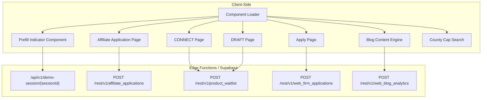
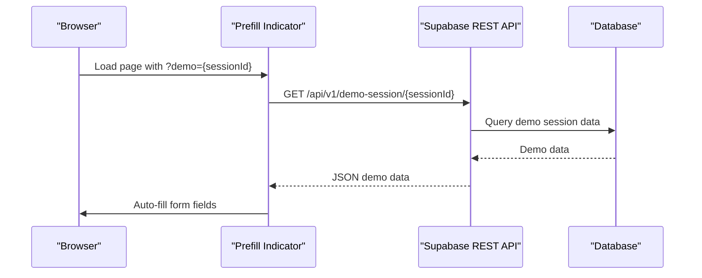
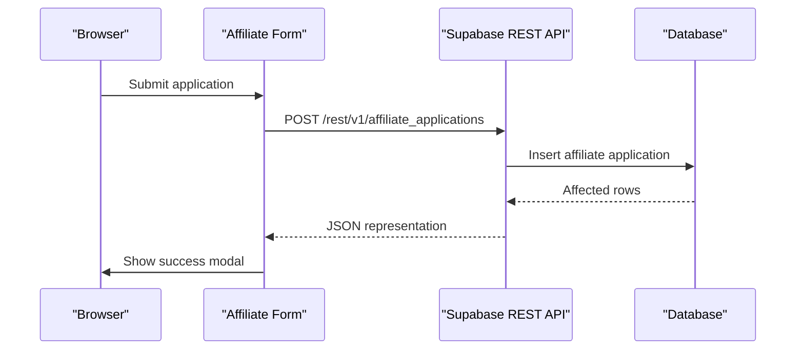
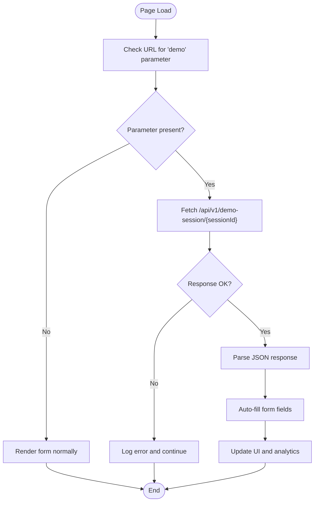
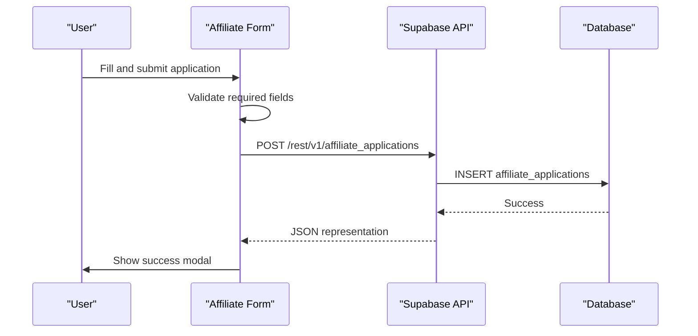
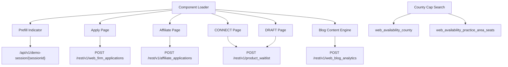

# Edge Functions API

<cite>
**Referenced Files in This Document**
- [prefill-indicator.html](file://PRODUCTION_DEPLOY/components/prefill-indicator.html)
- [affiliate-apply.html](file://PRODUCTION_DEPLOY/marketing/affiliate-apply.html)
- [apply.html](file://PRODUCTION_DEPLOY/marketing/apply.html)
- [connect.html](file://PRODUCTION_DEPLOY/marketing/connect.html)
- [draft.html](file://PRODUCTION_DEPLOY/marketing/draft.html)
- [blog-content.js](file://PRODUCTION_DEPLOY/js/blog-content.js)
- [load-components.js](file://PRODUCTION_DEPLOY/js/load-components.js)
- [county-cap-search.js](file://PRODUCTION_DEPLOY/marketing/js/county-cap-search.js)
- [package.json](file://package.json)
</cite>

## Table of Contents
1. [Introduction](#introduction)
2. [Project Structure](#project-structure)
3. [Core Components](#core-components)
4. [Architecture Overview](#architecture-overview)
5. [Detailed Component Analysis](#detailed-component-analysis)
6. [Dependency Analysis](#dependency-analysis)
7. [Performance Considerations](#performance-considerations)
8. [Troubleshooting Guide](#troubleshooting-guide)
9. [Conclusion](#conclusion)

## Introduction
This document provides comprehensive Edge Functions API documentation for TrueVow's serverless functions. It focuses on the Edge Functions endpoints used by the marketing pages and components, including demo-request, demo-session, waitlist, and affiliate-program handlers. The documentation covers function signatures, input validation, response formats, error handling patterns, TypeScript interfaces for request/response objects, environment variable requirements, and database integration patterns. Practical deployment, testing, and debugging guidance is included, along with security considerations, rate limiting, and performance optimization techniques.

## Project Structure
The TrueVow website integrates Edge Functions via client-side JavaScript that interacts with Supabase REST APIs. The relevant endpoints are invoked from HTML components and JavaScript files:

- `/api/v1/demo-session/{sessionId}`: Retrieves demo session data for auto-filling forms
- Supabase REST endpoints for waitlist and affiliate applications:
  - `POST /rest/v1/affiliate_applications`: Submits affiliate program applications
  - `POST /rest/v1/product_waitlist`: Adds entries to the product waitlist
  - `POST /rest/v1/web_firm_applications`: Submits firm applications
  - `POST /rest/v1/web_blog_analytics`: Tracks content analytics

**Diagram sources**
- [prefill-indicator.html](file://PRODUCTION_DEPLOY/components/prefill-indicator.html#L116-L185)
- [affiliate-apply.html](file://PRODUCTION_DEPLOY/marketing/affiliate-apply.html#L617-L726)
- [apply.html](file://PRODUCTION_DEPLOY/marketing/apply.html#L1-L200)
- [blog-content.js](file://PRODUCTION_DEPLOY/js/blog-content.js#L1-L120)
- [load-components.js](file://PRODUCTION_DEPLOY/js/load-components.js#L1-L58)
- [county-cap-search.js](file://PRODUCTION_DEPLOY/marketing/js/county-cap-search.js#L1-L120)

**Section sources**
- [prefill-indicator.html](file://PRODUCTION_DEPLOY/components/prefill-indicator.html#L116-L185)
- [affiliate-apply.html](file://PRODUCTION_DEPLOY/marketing/affiliate-apply.html#L617-L726)
- [apply.html](file://PRODUCTION_DEPLOY/marketing/apply.html#L1-L200)
- [blog-content.js](file://PRODUCTION_DEPLOY/js/blog-content.js#L1-L120)
- [load-components.js](file://PRODUCTION_DEPLOY/js/load-components.js#L1-L58)
- [county-cap-search.js](file://PRODUCTION_DEPLOY/marketing/js/county-cap-search.js#L1-L120)

## Core Components
This section outlines the Edge Functions endpoints and their usage patterns across the TrueVow website.

### Demo Session Endpoint
- Endpoint: `/api/v1/demo-session/{sessionId}`
- Method: GET
- Purpose: Retrieve demo session data to auto-fill application forms
- Request
  - Path parameters:
    - sessionId: string (required)
- Response
  - JSON object containing demo data fields (e.g., email, firm_name, phone, practice_area, first_name)
  - Status codes: 200 OK, 404 Not Found, 500 Internal Server Error
- Error handling
  - Client-side: Catches and logs errors; continues with normal form rendering if session retrieval fails

**Section sources**
- [prefill-indicator.html](file://PRODUCTION_DEPLOY/components/prefill-indicator.html#L116-L185)

### Affiliate Program Application Endpoint
- Endpoint: `POST /rest/v1/affiliate_applications`
- Method: POST
- Purpose: Submit affiliate program applications
- Request body (JSON)
  - Fields: name, email, phone, question_1, question_2, question_3, question_4, status
  - Validation: Required fields include name, email, question_1 through question_4; status defaults to pending
- Response
  - JSON representation of the created record
  - Status codes: 201 Created, 400 Bad Request, 500 Internal Server Error
- Error handling
  - Client-side: Attempts to parse error messages; displays success modal even on backend failures to ensure user feedback

**Section sources**
- [affiliate-apply.html](file://PRODUCTION_DEPLOY/marketing/affiliate-apply.html#L617-L726)

### Product Waitlist Endpoint
- Endpoint: `POST /rest/v1/product_waitlist`
- Method: POST
- Purpose: Add entries to the product waitlist (used on CONNECT and DRAFT pages)
- Request body (JSON)
  - Fields: email, product_name, source_page, metadata
  - Validation: Required fields include email and product_name; optional fields include source_page and metadata
- Response
  - JSON representation of the created record
  - Status codes: 201 Created, 400 Bad Request, 500 Internal Server Error

**Section sources**
- [connect.html](file://PRODUCTION_DEPLOY/marketing/connect.html#L1000-L1047)
- [draft.html](file://PRODUCTION_DEPLOY/marketing/draft.html#L1069-L1115)

### Firm Application Endpoint
- Endpoint: `POST /rest/v1/web_firm_applications`
- Method: POST
- Purpose: Submit firm applications from the application form
- Request body (JSON)
  - Fields: first_name, last_name, email, phone, firm_name, practice_area, state, zipcode, desired_county, firm_size, monthly_calls, referral_source, bar_number
  - Validation: Required fields include all listed fields; additional validation performed client-side (e.g., phone format, ZIP code lookup)
- Response
  - JSON representation of the created record
  - Status codes: 201 Created, 400 Bad Request, 500 Internal Server Error

**Section sources**
- [apply.html](file://PRODUCTION_DEPLOY/marketing/apply.html#L1875-L1900)

### Blog Analytics Endpoint
- Endpoint: `POST /rest/v1/web_blog_analytics`
- Method: POST
- Purpose: Track content analytics (views, clicks, shares)
- Request body (JSON)
  - Fields: content_id, event_type, ip_addr, user_agent, referrer, utm_source, utm_medium, utm_campaign, created_at
  - Validation: Required fields include content_id and event_type; optional fields include IP address and UTM parameters
- Response
  - Minimal response (no content)
  - Status codes: 201 Created, 400 Bad Request, 500 Internal Server Error
- Error handling
  - Client-side: Silently fails analytics tracking to avoid breaking page functionality

**Section sources**
- [blog-content.js](file://PRODUCTION_DEPLOY/js/blog-content.js#L66-L102)

## Architecture Overview
The Edge Functions architecture relies on client-side JavaScript to invoke Supabase REST endpoints. The system is structured as follows:

**Diagram sources**
- [prefill-indicator.html](file://PRODUCTION_DEPLOY/components/prefill-indicator.html#L116-L185)

**Diagram sources**
- [affiliate-apply.html](file://PRODUCTION_DEPLOY/marketing/affiliate-apply.html#L617-L726)

## Detailed Component Analysis

### Demo Session Handler (`/api/v1/demo-session/{sessionId}`)
- Functionality: Retrieves demo session data to auto-fill application forms
- Input validation:
  - sessionId must be a non-empty string
  - Client-side: Extracts demo parameter from URL query string
- Response format:
  - JSON object with fields: email, firm_name, phone, practice_area, first_name
- Error handling:
  - Client-side: Catches fetch errors and logs them; form continues to render normally

**Diagram sources**
- [prefill-indicator.html](file://PRODUCTION_DEPLOY/components/prefill-indicator.html#L116-L185)

**Section sources**
- [prefill-indicator.html](file://PRODUCTION_DEPLOY/components/prefill-indicator.html#L116-L185)

### Affiliate Program Application Handler (`POST /rest/v1/affiliate_applications`)
- Functionality: Submits affiliate program applications
- Input validation:
  - Required fields: name, email, question_1, question_2, question_3, question_4
  - Phone number is optional
  - Status defaults to pending
- Response format:
  - JSON representation of the created affiliate application record
- Error handling:
  - Client-side: Attempts to parse error messages; displays success modal even if backend fails

**Diagram sources**
- [affiliate-apply.html](file://PRODUCTION_DEPLOY/marketing/affiliate-apply.html#L617-L726)

**Section sources**
- [affiliate-apply.html](file://PRODUCTION_DEPLOY/marketing/affiliate-apply.html#L617-L726)

### Product Waitlist Handlers (`POST /rest/v1/product_waitlist`)
- Functionality: Adds entries to the product waitlist
- Input validation:
  - Required fields: email, product_name
  - Optional fields: source_page, metadata
- Response format:
  - JSON representation of the created waitlist record
- Usage contexts:
  - CONNECT page: Used for CONNECT waitlist submissions
  - DRAFT page: Used for DRAFT waitlist submissions

**Section sources**
- [connect.html](file://PRODUCTION_DEPLOY/marketing/connect.html#L1000-L1047)
- [draft.html](file://PRODUCTION_DEPLOY/marketing/draft.html#L1069-L1115)

### Firm Application Handler (`POST /rest/v1/web_firm_applications`)
- Functionality: Submits firm applications from the application form
- Input validation:
  - Required fields: first_name, last_name, email, phone, firm_name, practice_area, state, zipcode, desired_county, firm_size, monthly_calls, referral_source, bar_number
  - Client-side: Additional validation for phone format and ZIP code lookup
- Response format:
  - JSON representation of the created firm application record

**Section sources**
- [apply.html](file://PRODUCTION_DEPLOY/marketing/apply.html#L1875-L1900)

### Blog Analytics Handler (`POST /rest/v1/web_blog_analytics`)
- Functionality: Tracks content analytics (views, clicks, shares)
- Input validation:
  - Required fields: content_id, event_type
  - Optional fields: ip_addr, user_agent, referrer, utm_source, utm_medium, utm_campaign
- Response format:
  - Minimal response (no content)
- Error handling:
  - Client-side: Silently fails analytics tracking to avoid breaking page functionality

**Section sources**
- [blog-content.js](file://PRODUCTION_DEPLOY/js/blog-content.js#L66-L102)

## Dependency Analysis
The Edge Functions rely on Supabase REST APIs and client-side JavaScript for orchestration. Dependencies include:

**Diagram sources**
- [prefill-indicator.html](file://PRODUCTION_DEPLOY/components/prefill-indicator.html#L116-L185)
- [affiliate-apply.html](file://PRODUCTION_DEPLOY/marketing/affiliate-apply.html#L617-L726)
- [apply.html](file://PRODUCTION_DEPLOY/marketing/apply.html#L1875-L1900)
- [connect.html](file://PRODUCTION_DEPLOY/marketing/connect.html#L1000-L1047)
- [draft.html](file://PRODUCTION_DEPLOY/marketing/draft.html#L1069-L1115)
- [blog-content.js](file://PRODUCTION_DEPLOY/js/blog-content.js#L66-L102)
- [load-components.js](file://PRODUCTION_DEPLOY/js/load-components.js#L1-L58)
- [county-cap-search.js](file://PRODUCTION_DEPLOY/marketing/js/county-cap-search.js#L24-L89)

**Section sources**
- [package.json](file://package.json#L24-L28)

## Performance Considerations
- Minimize client-side computations: Perform heavy operations on the server side when possible
- Cache frequently accessed data: Implement caching for static content and reduce redundant API calls
- Optimize network requests: Batch related requests and use efficient data formats
- Monitor response times: Implement client-side timing metrics to identify slow endpoints
- Reduce payload sizes: Only transmit necessary fields and compress data where appropriate
- Implement lazy loading: Defer non-critical resource loading to improve perceived performance

## Troubleshooting Guide
Common issues and resolutions:

### Authentication and Authorization
- Verify Supabase project credentials are correctly configured
- Ensure API keys have appropriate permissions for the targeted tables
- Check CORS settings if cross-origin requests are failing

### Network Connectivity
- Test connectivity to Supabase endpoints using curl or browser developer tools
- Verify firewall and network policies allow outbound HTTPS traffic
- Monitor for intermittent connection issues and implement retry logic

### Data Validation Errors
- Review client-side validation rules and adjust to match server expectations
- Implement comprehensive error handling to provide meaningful feedback to users
- Log validation failures for debugging and monitoring

### Performance Issues
- Monitor API response times and implement timeouts
- Use browser developer tools to profile network requests and identify bottlenecks
- Consider implementing pagination for large datasets

**Section sources**
- [blog-content.js](file://PRODUCTION_DEPLOY/js/blog-content.js#L346-L350)
- [affiliate-apply.html](file://PRODUCTION_DEPLOY/marketing/affiliate-apply.html#L666-L675)

## Conclusion
TrueVow's Edge Functions API leverages Supabase REST endpoints to provide seamless user experiences across the marketing pages and components. The system demonstrates robust client-side orchestration with clear input validation, comprehensive error handling, and efficient data flow patterns. By following the documented patterns and best practices outlined in this guide, developers can effectively deploy, test, and optimize the Edge Functions for optimal performance and reliability.