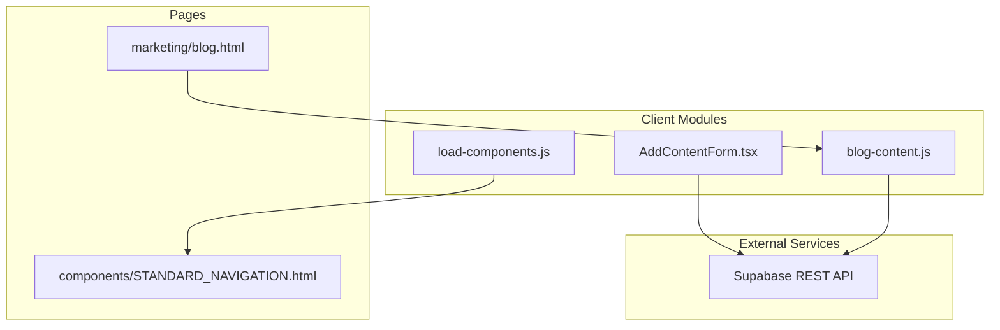
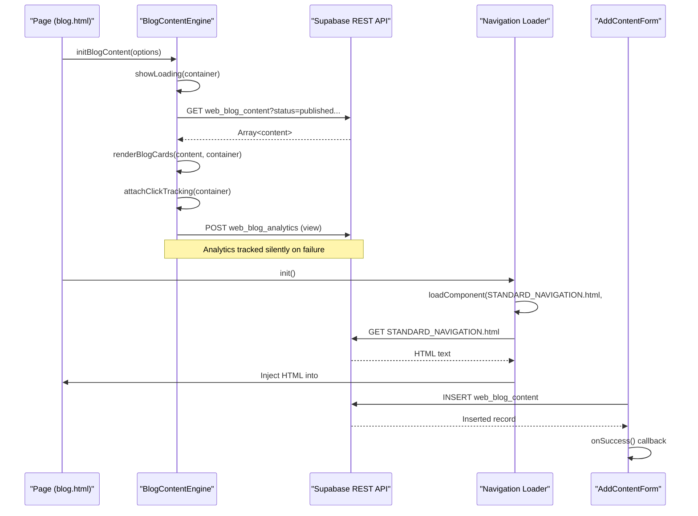
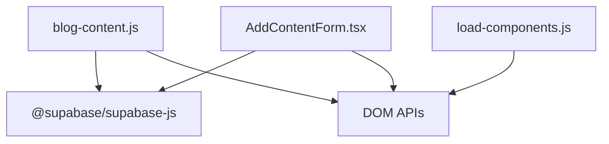

# JavaScript Client Interfaces

<cite>
**Referenced Files in This Document**
- [blog-content.js](file://js/blog-content.js)
- [load-components.js](file://js/load-components.js)
- [AddContentForm.tsx](file://components/admin/AddContentForm.tsx)
- [blog.html](file://marketing/blog.html)
- [STANDARD_NAVIGATION.html](file://components/STANDARD_NAVIGATION.html)
- [package.json](file://package.json)
</cite>

## Table of Contents
1. [Introduction](#introduction)
2. [Project Structure](#project-structure)
3. [Core Components](#core-components)
4. [Architecture Overview](#architecture-overview)
5. [Detailed Component Analysis](#detailed-component-analysis)
6. [Dependency Analysis](#dependency-analysis)
7. [Performance Considerations](#performance-considerations)
8. [Troubleshooting Guide](#troubleshooting-guide)
9. [Conclusion](#conclusion)
10. [Appendices](#appendices)

## Introduction
This document provides comprehensive JavaScript client interface documentation for TrueVow’s API communication modules focused on blog content delivery and component loading. It covers:
- Public APIs exposed by blog-content.js and load-components.js
- Utility methods for analytics, rendering, and lifecycle management
- TypeScript definitions for React components and their props
- Practical integration patterns for async/await, promises, and error propagation
- Component composition and state management strategies
- Integration touchpoints with Supabase REST endpoints

The documentation targets both frontend developers and technical writers who need to understand how to integrate, extend, and troubleshoot these client-side modules.

## Project Structure
The relevant client-side modules are organized as follows:
- js/blog-content.js: Blog content engine that fetches from Supabase, renders cards, tracks analytics, and manages filters
- js/load-components.js: Lightweight component loader that injects standardized HTML components into placeholders
- components/admin/AddContentForm.tsx: React admin form component for adding content to Supabase
- marketing/blog.html: Example page integrating the blog content engine
- components/STANDARD_NAVIGATION.html: Reusable navigation component injected by the loader
- package.json: Declares @supabase/supabase-js dependency used by React admin component

**Diagram sources**
- [blog-content.js](file://js/blog-content.js#L1-L424)
- [load-components.js](file://js/load-components.js#L1-L58)
- [AddContentForm.tsx](file://components/admin/AddContentForm.tsx#L1-L357)
- [blog.html](file://marketing/blog.html#L436-L476)
- [STANDARD_NAVIGATION.html](file://components/STANDARD_NAVIGATION.html#L1-L25)

**Section sources**
- [blog-content.js](file://js/blog-content.js#L1-L424)
- [load-components.js](file://js/load-components.js#L1-L58)
- [AddContentForm.tsx](file://components/admin/AddContentForm.tsx#L1-L357)
- [blog.html](file://marketing/blog.html#L436-L476)
- [STANDARD_NAVIGATION.html](file://components/STANDARD_NAVIGATION.html#L1-L25)
- [package.json](file://package.json#L24-L28)

## Core Components
This section documents the public APIs and utilities exposed by the client modules.

### Blog Content Engine (blog-content.js)
Exports a global namespace containing:
- fetchBlogContent(options): Asynchronous function to query published blog content from Supabase
- renderBlogCards(contentItems, container): Renders content cards into a DOM container
- trackContentAnalytics(contentId, eventType, metadata): Posts analytics events to Supabase
- initBlogContent(options): Initializes the blog content engine on page load with optional filters

Key utilities:
- attachClickTracking(container): Attaches click handlers to content links and triggers analytics
- escapeHtml(text): Sanitizes text to prevent XSS
- formatDate(dateString): Formats dates for display
- showLoading(container): Displays a loading spinner
- showError(container, message): Displays an error state with retry action
- updateActiveFilter(filterValue): Updates active state of filter buttons

Lifecycle and integration:
- Auto-initializes on DOMContentLoaded
- Supports dynamic filtering via filter buttons
- Tracks page views and clicks for analytics

**Section sources**
- [blog-content.js](file://js/blog-content.js#L18-L64)
- [blog-content.js](file://js/blog-content.js#L109-L219)
- [blog-content.js](file://js/blog-content.js#L225-L253)
- [blog-content.js](file://js/blog-content.js#L260-L278)
- [blog-content.js](file://js/blog-content.js#L284-L313)
- [blog-content.js](file://js/blog-content.js#L319-L350)
- [blog-content.js](file://js/blog-content.js#L356-L366)
- [blog-content.js](file://js/blog-content.js#L373-L379)
- [blog-content.js](file://js/blog-content.js#L390-L414)
- [blog-content.js](file://js/blog-content.js#L417-L422)

### Component Loader (load-components.js)
Exports a self-invoking IIFE that:
- loadComponent(filePath, targetId): Asynchronously fetches HTML from a file and injects it into a target element
- init(): Loads navigation and footer components if placeholders exist

Behavior:
- Graceful error logging on fetch failures
- Safe injection guarded by target element existence checks

**Section sources**
- [load-components.js](file://js/load-components.js#L14-L31)
- [load-components.js](file://js/load-components.js#L36-L55)

### React Admin Component (AddContentForm.tsx)
Exports a client-side React component with:
- Props interface AddContentFormProps:
  - onSuccess?: () => void
  - onCancel?: () => void
- State-managed form fields for content creation
- Async submission handler that inserts records into Supabase

Integration:
- Uses supabase client imported from '@/lib/supabaseClient'
- Validates required fields and enriches canonical URL with UTM parameters
- Handles errors and displays feedback messages

**Section sources**
- [AddContentForm.tsx](file://components/admin/AddContentForm.tsx#L11-L14)
- [AddContentForm.tsx](file://components/admin/AddContentForm.tsx#L16-L141)
- [AddContentForm.tsx](file://components/admin/AddContentForm.tsx#L96-L100)

## Architecture Overview
The blog content engine integrates with Supabase REST endpoints to fetch content, render cards, and track analytics. The component loader injects reusable navigation and footer components. The React admin form writes content into Supabase.

**Diagram sources**
- [blog-content.js](file://js/blog-content.js#L319-L350)
- [blog-content.js](file://js/blog-content.js#L417-L422)
- [load-components.js](file://js/load-components.js#L36-L47)
- [AddContentForm.tsx](file://components/admin/AddContentForm.tsx#L96-L100)

## Detailed Component Analysis

### Blog Content Engine API Reference
- fetchBlogContent(options)
  - Parameters:
    - options.type: 'article' | 'video' | null
    - options.featured: boolean | null
    - options.limit: number
  - Returns: Promise<Array> of content items
  - Behavior: Builds a REST URL with filters and selects specific columns; throws on HTTP errors
  - Error handling: Logs and rethrows errors

- renderBlogCards(contentItems, container)
  - Parameters:
    - contentItems: Array of content objects
    - container: HTMLElement
  - Behavior: Clears container, renders cards with gradient fallbacks and emoji badges, attaches click tracking, and logs page view analytics

- trackContentAnalytics(contentId, eventType, metadata)
  - Parameters:
    - contentId: string
    - eventType: 'view' | 'click' | 'share'
    - metadata: Object with optional ipAddr, userAgent, referrer, utmSource, utmMedium, utmCampaign
  - Behavior: Sends POST to analytics endpoint; warns on non-OK responses but does not break the page

- initBlogContent(options)
  - Parameters: options passed to fetchBlogContent
  - Behavior: Shows loading, fetches content, renders cards, updates active filter, and displays error state on failure

- Utility functions:
  - attachClickTracking(container): Adds click listeners to links and triggers analytics
  - escapeHtml(text): Prevents XSS by escaping HTML
  - formatDate(dateString): Formats dates for display
  - showLoading(container), showError(container, message): UI helpers for loading and error states
  - updateActiveFilter(filterValue): Updates active state of filter buttons

Usage patterns:
- Auto-initialization on DOMContentLoaded
- Dynamic filtering via filter buttons that trigger reloads
- Analytics-first rendering with graceful failure

**Section sources**
- [blog-content.js](file://js/blog-content.js#L26-L64)
- [blog-content.js](file://js/blog-content.js#L109-L219)
- [blog-content.js](file://js/blog-content.js#L72-L102)
- [blog-content.js](file://js/blog-content.js#L319-L350)
- [blog-content.js](file://js/blog-content.js#L225-L253)
- [blog-content.js](file://js/blog-content.js#L260-L278)
- [blog-content.js](file://js/blog-content.js#L284-L313)
- [blog-content.js](file://js/blog-content.js#L356-L366)
- [blog-content.js](file://js/blog-content.js#L373-L379)
- [blog-content.js](file://js/blog-content.js#L390-L414)

### Component Loader API Reference
- loadComponent(filePath, targetId)
  - Parameters:
    - filePath: string (relative path to HTML file)
    - targetId: string (DOM ID of target element)
  - Behavior: Fetches HTML text, validates response, and injects into target element if present

- init()
  - Behavior: Checks for placeholders and loads navigation/footer components

Integration:
- Called automatically on DOMContentLoaded
- Safe error handling with console warnings

**Section sources**
- [load-components.js](file://js/load-components.js#L14-L31)
- [load-components.js](file://js/load-components.js#L36-L55)

### React Admin Component API Reference
- Props (AddContentFormProps):
  - onSuccess?: () => void
  - onCancel?: () => void

- State:
  - formData: Structured form state for title, teaser, canonicalUrl, publishDate, thumbnailUrl, type, platformName, readTimeMinutes, watchTimeMinutes, isFeatured, status
  - isSubmitting: boolean
  - submitMessage: { type: 'success' | 'error'; text: string } | null

- Methods:
  - validateForm(): Returns boolean after validating required fields
  - handleSubmit(e): Async submission handler that:
    - Validates form
    - Ensures canonical URL has UTM parameters
    - Inserts into Supabase table web_blog_content
    - Resets form and invokes onSuccess after delay

- Integration:
  - Uses supabase client imported from '@/lib/supabaseClient'
  - Single-row selection after insert for feedback

**Section sources**
- [AddContentForm.tsx](file://components/admin/AddContentForm.tsx#L11-L14)
- [AddContentForm.tsx](file://components/admin/AddContentForm.tsx#L16-L141)
- [AddContentForm.tsx](file://components/admin/AddContentForm.tsx#L96-L100)

### Example Integration Patterns
- Blog page integration:
  - Include js/blog-content.js on the page
  - Provide a container with id "blog-grid"
  - Add filter buttons with data-filter attributes
  - The engine auto-initializes and handles filtering

- Component injection:
  - Place a placeholder with id "truevow-navigation" or "truevow-footer"
  - The loader will inject STANDARD_NAVIGATION.html or STANDARD_FOOTER.html

- Admin form integration:
  - Import AddContentForm into a page or modal
  - Pass onSuccess/onCancel callbacks to coordinate UI updates

**Section sources**
- [blog.html](file://marketing/blog.html#L436-L476)
- [STANDARD_NAVIGATION.html](file://components/STANDARD_NAVIGATION.html#L1-L25)
- [AddContentForm.tsx](file://components/admin/AddContentForm.tsx#L16-L141)

## Dependency Analysis
- blog-content.js depends on:
  - Supabase REST endpoints for content and analytics
  - DOM APIs for rendering and event handling
- load-components.js depends on:
  - fetch API for HTML retrieval
  - DOM APIs for injection
- AddContentForm.tsx depends on:
  - @supabase/supabase-js for database operations
  - React hooks for state management

**Diagram sources**
- [blog-content.js](file://js/blog-content.js#L1-L424)
- [load-components.js](file://js/load-components.js#L1-L58)
- [AddContentForm.tsx](file://components/admin/AddContentForm.tsx#L1-L357)
- [package.json](file://package.json#L24-L28)

**Section sources**
- [package.json](file://package.json#L24-L28)

## Performance Considerations
- Network efficiency:
  - Use limit options to constrain result sets
  - Prefer selective column queries to reduce payload sizes
- Rendering:
  - Avoid unnecessary re-renders by updating only changed content
  - Debounce filter interactions if extending with additional controls
- Analytics:
  - Analytics requests are fire-and-forget; ensure minimal overhead
- Component loading:
  - Cache injected HTML if repeated loads occur during navigation

[No sources needed since this section provides general guidance]

## Troubleshooting Guide
Common issues and resolutions:
- Supabase configuration errors:
  - Verify SUPABASE_URL and SUPABASE_ANON_KEY are set correctly
  - Check CORS and API key permissions in Supabase dashboard
- Content not appearing:
  - Ensure the container element exists and has the correct ID
  - Confirm content status is published and filters match expectations
- Analytics failures:
  - Analytics errors are logged but do not interrupt rendering
  - Verify endpoint availability and network connectivity
- Component injection failures:
  - Confirm target element exists and file paths are correct
  - Check browser console for fetch errors
- Admin form submission errors:
  - Validate required fields and canonical URL format
  - Inspect Supabase error messages and adjust accordingly

**Section sources**
- [blog-content.js](file://js/blog-content.js#L346-L349)
- [blog-content.js](file://js/blog-content.js#L72-L102)
- [load-components.js](file://js/load-components.js#L14-L31)
- [AddContentForm.tsx](file://components/admin/AddContentForm.tsx#L132-L141)

## Conclusion
The JavaScript client interfaces provide a robust foundation for delivering blog content, tracking engagement, and composing reusable components. The blog content engine offers flexible filtering, analytics integration, and resilient error handling. The component loader simplifies maintenance by centralizing navigation and footer templates. The React admin form streamlines content ingestion with validation and feedback. Together, these modules enable scalable, maintainable frontend integrations with Supabase.

[No sources needed since this section summarizes without analyzing specific files]

## Appendices

### API Definitions and Usage Notes
- Blog Content Engine
  - Exposed via window.BlogContentEngine
  - Typical usage: initialize on page load; extend with custom filters; track clicks and views
- Component Loader
  - Self-contained IIFE; call init() to load components
- React Admin Form
  - Use onSuccess/onCancel to refresh UI after successful submissions

**Section sources**
- [blog-content.js](file://js/blog-content.js#L417-L422)
- [load-components.js](file://js/load-components.js#L36-L55)
- [AddContentForm.tsx](file://components/admin/AddContentForm.tsx#L16-L141)