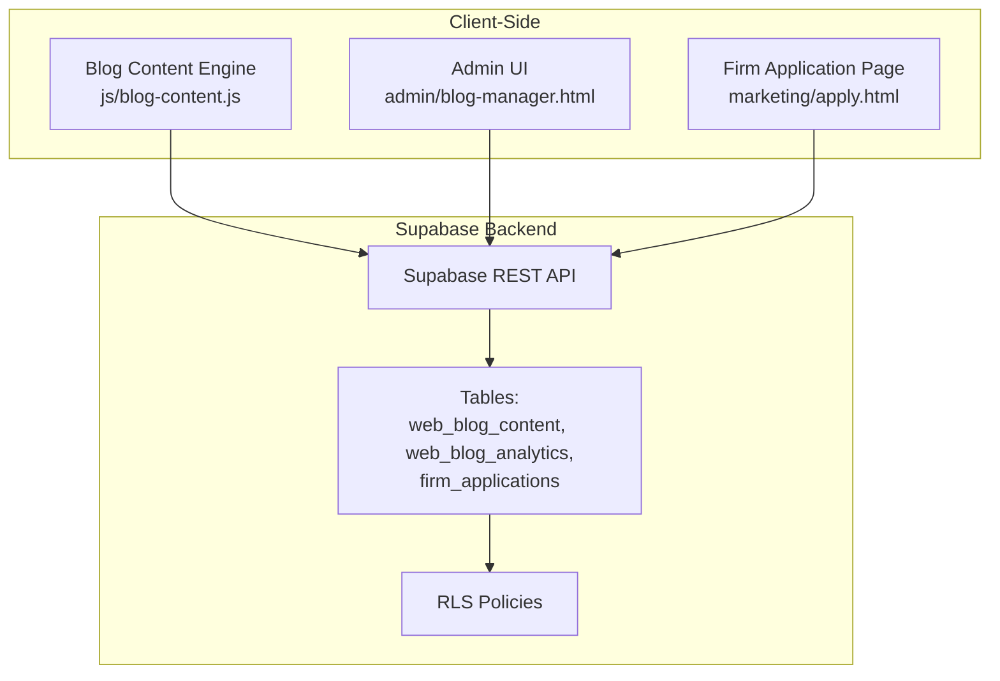
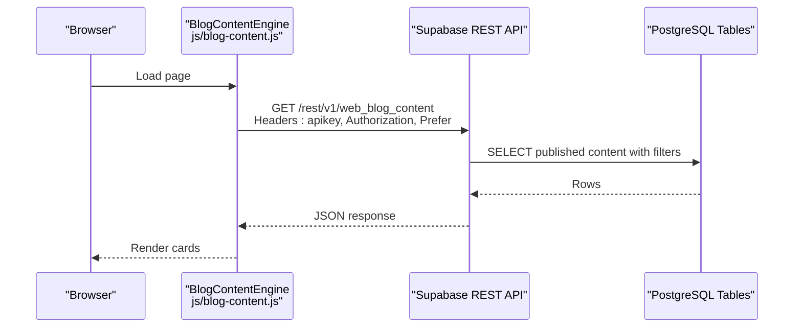
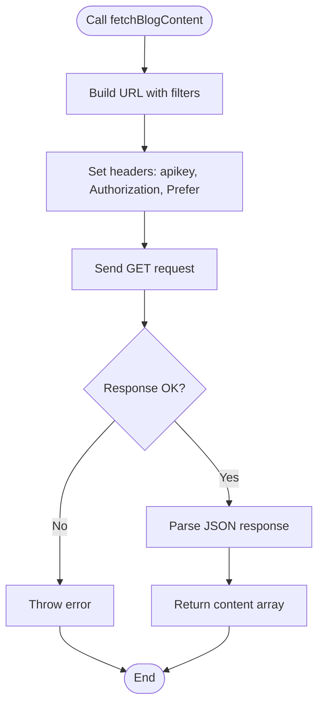
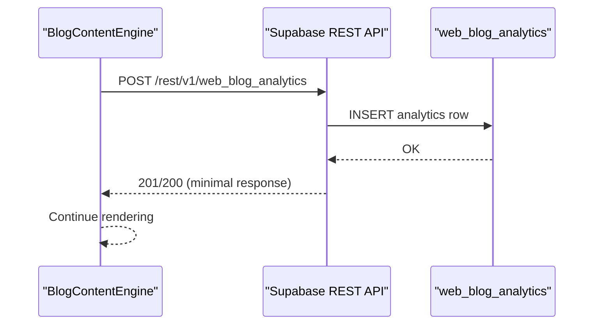
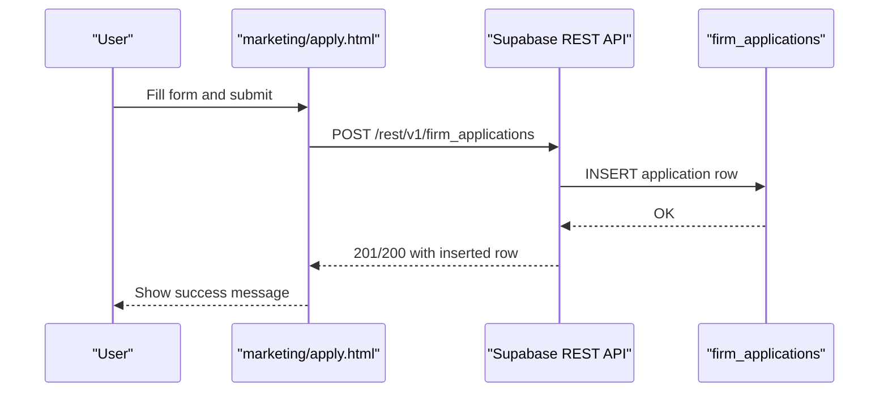
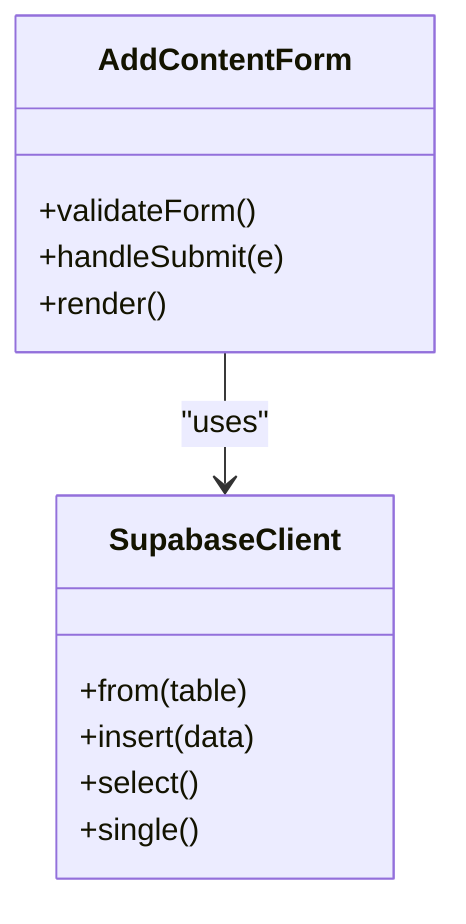
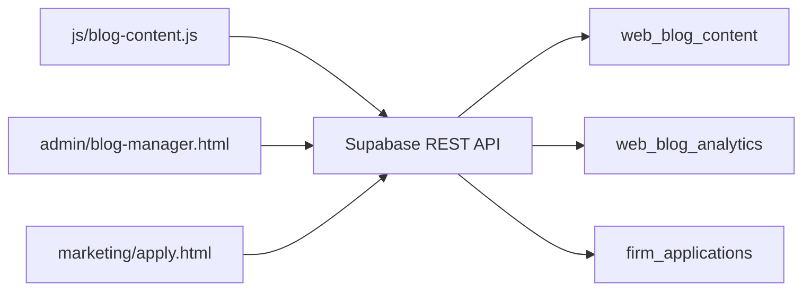

# REST API Endpoints

<cite>
**Referenced Files in This Document**
- [blog-content.js](file://js/blog-content.js)
- [blog-content.js](file://PRODUCTION_DEPLOY/js/blog-content.js)
- [AddContentForm.tsx](file://components/admin/AddContentForm.tsx)
- [blog-manager.html](file://admin/blog-manager.html)
- [apply.html](file://marketing/apply.html)
- [DATABASE_SCHEMA_README.md](file://supabase/DATABASE_SCHEMA_README.md)
- [script-1-blog-content-policy.sql](file://supabase/script-1-blog-content-policy.sql)
- [script-2-analytics-policy.sql](file://supabase/script-2-analytics-policy.sql)
- [create-form-submission-tables.sql](file://supabase/create-form-submission-tables.sql)
- [check-and-create-form-tables.sql](file://supabase/check-and-create-form-tables.sql)
</cite>

## Table of Contents
1. [Introduction](#introduction)
2. [Project Structure](#project-structure)
3. [Core Components](#core-components)
4. [Architecture Overview](#architecture-overview)
5. [Detailed Component Analysis](#detailed-component-analysis)
6. [Dependency Analysis](#dependency-analysis)
7. [Performance Considerations](#performance-considerations)
8. [Troubleshooting Guide](#troubleshooting-guide)
9. [Conclusion](#conclusion)
10. [Appendices](#appendices)

## Introduction
This document describes the Supabase REST API integration used by TrueVow’s marketing website. It covers:
- REST endpoints for blog content retrieval, analytics tracking, and form submissions
- Authentication and authorization via Supabase API keys and Row Level Security (RLS)
- Query parameters, filtering, and response schemas
- Practical client-side examples using browser fetch, and guidance for axios
- CORS, rate limiting, and security best practices for client-side API communication

## Project Structure
The Supabase-backed features are implemented across:
- Client-side JavaScript that calls Supabase REST endpoints for blog content and analytics
- Admin UI for adding content and managing entries
- Marketing pages for form submissions (e.g., firm applications)
- Supabase schema and RLS policies that define access control

**Diagram sources**
- [blog-content.js](file://js/blog-content.js#L26-L64)
- [blog-manager.html](file://admin/blog-manager.html#L1-L120)
- [apply.html](file://marketing/apply.html#L1-L120)
- [DATABASE_SCHEMA_README.md](file://supabase/DATABASE_SCHEMA_README.md#L23-L134)

**Section sources**
- [blog-content.js](file://js/blog-content.js#L1-L15)
- [DATABASE_SCHEMA_README.md](file://supabase/DATABASE_SCHEMA_README.md#L10-L18)

## Core Components
- Blog content retrieval: GET endpoint to fetch published content with optional filters and selection of columns
- Analytics tracking: POST endpoint to record view/click/share events
- Form submissions: POST endpoints to submit firm applications and other form data
- Admin content management: HTML form and logic to add/edit/delete content entries

Key Supabase endpoints used by the client:
- GET /rest/v1/web_blog_content
- POST /rest/v1/web_blog_analytics
- POST /rest/v1/firm_applications

Authentication:
- apikey header with Supabase Anonymous Key
- Authorization header with Bearer token set to the same anonymous key
- Prefer header controlling response format

**Section sources**
- [blog-content.js](file://js/blog-content.js#L26-L64)
- [blog-content.js](file://js/blog-content.js#L72-L102)
- [DATABASE_SCHEMA_README.md](file://supabase/DATABASE_SCHEMA_README.md#L431-L450)

## Architecture Overview
The client-side JavaScript performs REST calls to Supabase. Supabase enforces RLS policies to control access. Responses are returned to the client for rendering or further processing.

**Diagram sources**
- [blog-content.js](file://js/blog-content.js#L26-L64)
- [DATABASE_SCHEMA_README.md](file://supabase/DATABASE_SCHEMA_README.md#L435-L437)

## Detailed Component Analysis

### Blog Content Retrieval Endpoint
- Method: GET
- URL Pattern: /rest/v1/web_blog_content
- Query Parameters:
  - status=eq.published
  - order=publish_date.desc
  - type=eq.{article|video} (optional)
  - is_featured=eq.{true|false} (optional)
  - limit={number} (optional)
- Selected Columns: id,title,teaser,canonical_url,publish_date,thumbnail_url,type,platform_name,read_time_minutes,watch_time_minutes,is_featured,view_count,click_count
- Headers:
  - apikey: Supabase Anonymous Key
  - Authorization: Bearer {anonymous-key}
  - Content-Type: application/json
  - Prefer: return=representation
- Response: Array of content items matching schema
- Filtering and Sorting:
  - status filter ensures only published content is returned
  - sort by publish_date descending
  - optional type and featured filters
- Example Requests:
  - fetch('/rest/v1/web_blog_content?status=eq.published&order=publish_date.desc')
  - fetch('/rest/v1/web_blog_content?status=eq.published&type=eq.article&order=publish_date.desc')
  - fetch('/rest/v1/web_blog_content?status=eq.published&is_featured=eq.true&limit=6')

**Diagram sources**
- [blog-content.js](file://js/blog-content.js#L26-L64)

**Section sources**
- [blog-content.js](file://js/blog-content.js#L26-L64)
- [DATABASE_SCHEMA_README.md](file://supabase/DATABASE_SCHEMA_README.md#L23-L68)

### Analytics Tracking Endpoint
- Method: POST
- URL Pattern: /rest/v1/web_blog_analytics
- Body Fields:
  - content_id: UUID
  - event_type: 'view' | 'click' | 'share'
  - ip_addr: optional
  - user_agent: optional
  - referrer: optional
  - utm_source: optional
  - utm_medium: optional
  - utm_campaign: optional
  - created_at: timestamp
- Headers:
  - apikey: Supabase Anonymous Key
  - Authorization: Bearer {anonymous-key}
  - Content-Type: application/json
  - Prefer: return=minimal
- Behavior:
  - Attempts to insert analytics event
  - On failure, logs warning and continues (non-blocking)
- Example Requests:
  - POST /rest/v1/web_blog_analytics with event payload

**Diagram sources**
- [blog-content.js](file://js/blog-content.js#L72-L102)

**Section sources**
- [blog-content.js](file://js/blog-content.js#L72-L102)
- [DATABASE_SCHEMA_README.md](file://supabase/DATABASE_SCHEMA_README.md#L77-L134)

### Firm Application Submission
- Method: POST
- URL Pattern: /rest/v1/firm_applications
- Body Fields (selected):
  - first_name, last_name, email, phone
  - firm_name, practice_area, state, desired_county
  - firm_size, monthly_calls, referral_source
  - bar_number, eligibility booleans, founding_member_interest, settle_interest
  - terms_agree, consider_founding_member_future, early_access_settle
  - application_source, status, notes
- Headers:
  - apikey: Supabase Anonymous Key
  - Authorization: Bearer {anonymous-key}
  - Content-Type: application/json
  - Prefer: return=representation
- Notes:
  - The marketing page collects form data and submits to this endpoint
  - RLS allows public INSERT for firm_applications

**Diagram sources**
- [apply.html](file://marketing/apply.html#L536-L800)
- [create-form-submission-tables.sql](file://supabase/create-form-submission-tables.sql#L11-L39)
- [check-and-create-form-tables.sql](file://supabase/check-and-create-form-tables.sql#L18-L46)

**Section sources**
- [apply.html](file://marketing/apply.html#L536-L800)
- [create-form-submission-tables.sql](file://supabase/create-form-submission-tables.sql#L11-L39)
- [check-and-create-form-tables.sql](file://supabase/check-and-create-form-tables.sql#L18-L46)

### Admin Content Management
- Admin UI: Adds, edits, deletes content entries
- Uses Supabase client library to insert/update/delete records
- RLS policies restrict admin actions to authenticated users

**Diagram sources**
- [AddContentForm.tsx](file://components/admin/AddContentForm.tsx#L63-L141)

**Section sources**
- [AddContentForm.tsx](file://components/admin/AddContentForm.tsx#L16-L141)
- [blog-manager.html](file://admin/blog-manager.html#L1-L120)

## Dependency Analysis
- Client-side JavaScript depends on Supabase REST endpoints and headers
- Supabase enforces RLS policies to control access
- Tables involved:
  - web_blog_content (published content)
  - web_blog_analytics (events)
  - firm_applications (form submissions)

**Diagram sources**
- [blog-content.js](file://js/blog-content.js#L26-L64)
- [blog-manager.html](file://admin/blog-manager.html#L1-L120)
- [apply.html](file://marketing/apply.html#L536-L800)
- [DATABASE_SCHEMA_README.md](file://supabase/DATABASE_SCHEMA_README.md#L23-L134)

**Section sources**
- [DATABASE_SCHEMA_README.md](file://supabase/DATABASE_SCHEMA_README.md#L23-L134)

## Performance Considerations
- Filtering and Sorting:
  - Use status and publish_date filters to minimize result sets
  - Limit results with the limit parameter when rendering lists
- Column Selection:
  - Select only required columns to reduce payload size
- Caching:
  - Consider client-side caching for frequently accessed content
- Network:
  - Batch analytics events if sending many at once
- Supabase Indexes:
  - Ensure appropriate indexes exist on status, publish_date, type, platform_name, and created_at

[No sources needed since this section provides general guidance]

## Troubleshooting Guide
Common issues and resolutions:
- Authentication Failures:
  - Ensure apikey and Authorization headers match the Supabase Anonymous Key
  - Confirm Prefer header is set appropriately
- CORS Errors:
  - Configure Supabase project to allow requests from your domain
  - Verify that the API key is configured for the correct project
- Rate Limiting:
  - Implement client-side retry with exponential backoff
  - Reduce frequency of analytics events
- RLS Denials:
  - For public reads of published content, verify the “Public can view published content” policy
  - For public inserts of analytics and applications, verify the respective policies
- Error Handling:
  - Client-side code logs warnings for analytics failures and continues
  - For blog content, display a user-friendly error message and offer retry

**Section sources**
- [blog-content.js](file://js/blog-content.js#L54-L63)
- [blog-content.js](file://js/blog-content.js#L95-L101)
- [script-1-blog-content-policy.sql](file://supabase/script-1-blog-content-policy.sql#L14-L19)
- [script-2-analytics-policy.sql](file://supabase/script-2-analytics-policy.sql#L14-L19)

## Conclusion
TrueVow’s client integrates with Supabase REST endpoints to deliver blog content, capture analytics, and accept form submissions. The system relies on Supabase RLS to enforce access control and uses simple HTTP headers for authentication. Following the documented patterns and best practices will help ensure reliable, secure, and performant client-server communication.

[No sources needed since this section summarizes without analyzing specific files]

## Appendices

### Authentication Methods
- Anonymous Key:
  - apikey header with Supabase Anonymous Key
  - Authorization header with Bearer {anonymous-key}
  - Prefer header for response format control

**Section sources**
- [blog-content.js](file://js/blog-content.js#L44-L51)
- [blog-content.js](file://PRODUCTION_DEPLOY/js/blog-content.js#L44-L51)

### Practical Examples

- Using browser fetch:
  - GET blog content: [blog-content.js](file://js/blog-content.js#L26-L64)
  - POST analytics: [blog-content.js](file://js/blog-content.js#L72-L102)
  - POST firm application: [apply.html](file://marketing/apply.html#L536-L800)

- Using axios:
  - Set headers: apikey, Authorization, Content-Type, Prefer
  - Use baseURL pointing to your Supabase project URL
  - Send GET to /rest/v1/web_blog_content
  - Send POST to /rest/v1/web_blog_analytics
  - Send POST to /rest/v1/firm_applications

- Using curl:
  - GET: curl -H "apikey: YOUR_ANON_KEY" -H "Authorization: Bearer YOUR_ANON_KEY" https://your-project.supabase.co/rest/v1/web_blog_content?status=eq.published&order=publish_date.desc
  - POST analytics: curl -X POST -H "apikey: YOUR_ANON_KEY" -H "Authorization: Bearer YOUR_ANON_KEY" -H "Content-Type: application/json" -d '{"content_id":"...","event_type":"view"}' https://your-project.supabase.co/rest/v1/web_blog_analytics

[No sources needed since this section provides general guidance]

### Supabase RLS Policies Overview
- web_blog_content
  - Public SELECT allowed for status = 'published'
  - INSERT/UPDATE/DELETE restricted to authenticated users
- web_blog_analytics
  - Public INSERT allowed (for tracking)
  - SELECT restricted to authenticated users
- firm_applications
  - Public INSERT allowed (for form submissions)
  - SELECT/UPDATE restricted to authenticated users

**Section sources**
- [DATABASE_SCHEMA_README.md](file://supabase/DATABASE_SCHEMA_README.md#L431-L450)
- [script-1-blog-content-policy.sql](file://supabase/script-1-blog-content-policy.sql#L14-L19)
- [script-2-analytics-policy.sql](file://supabase/script-2-analytics-policy.sql#L14-L19)