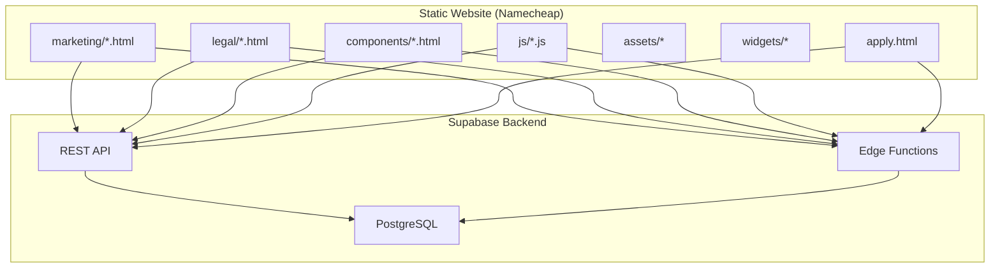
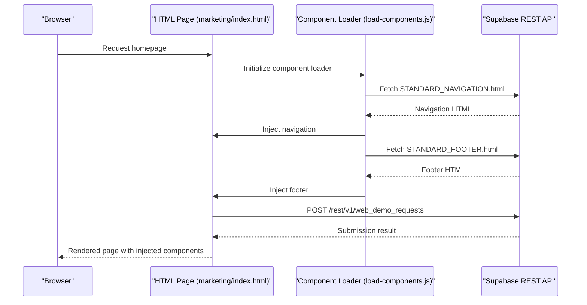
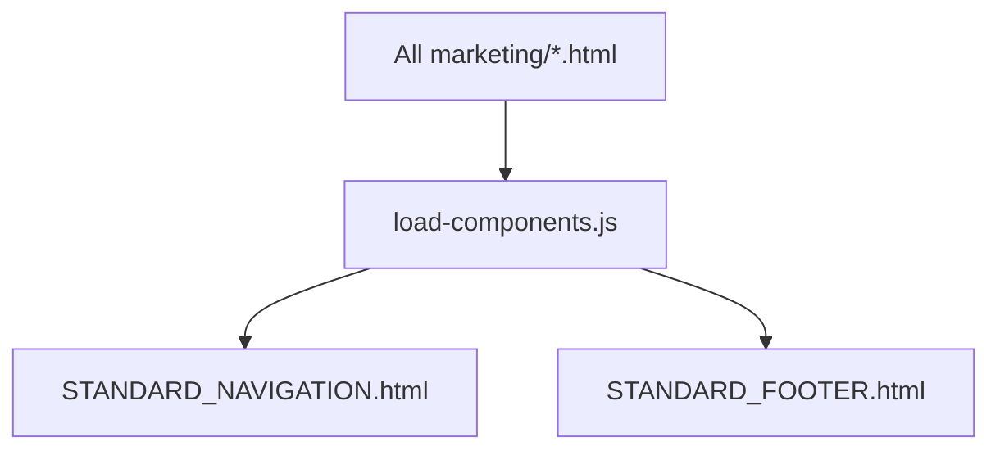
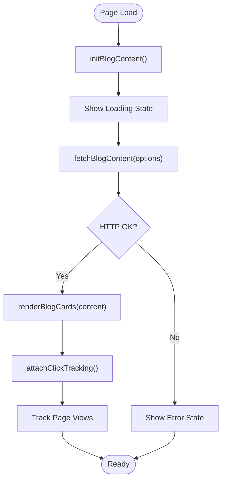
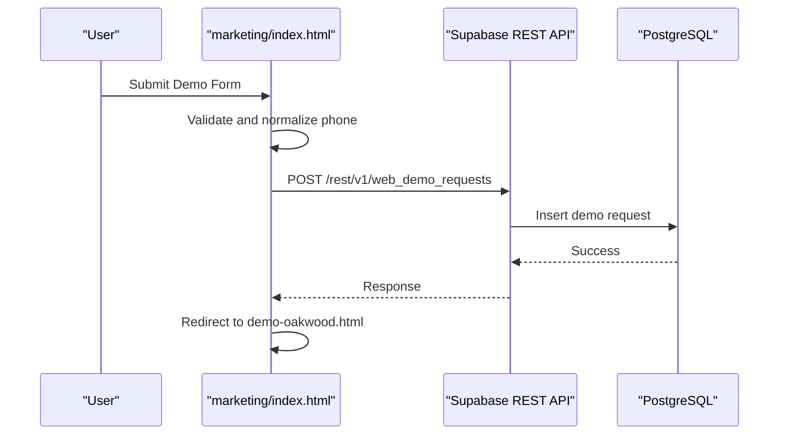
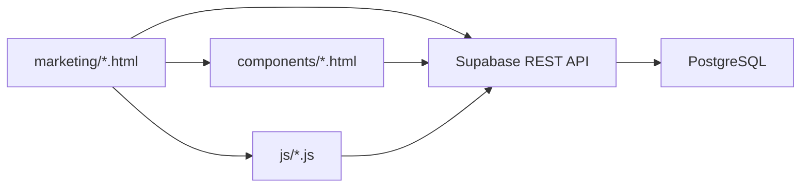
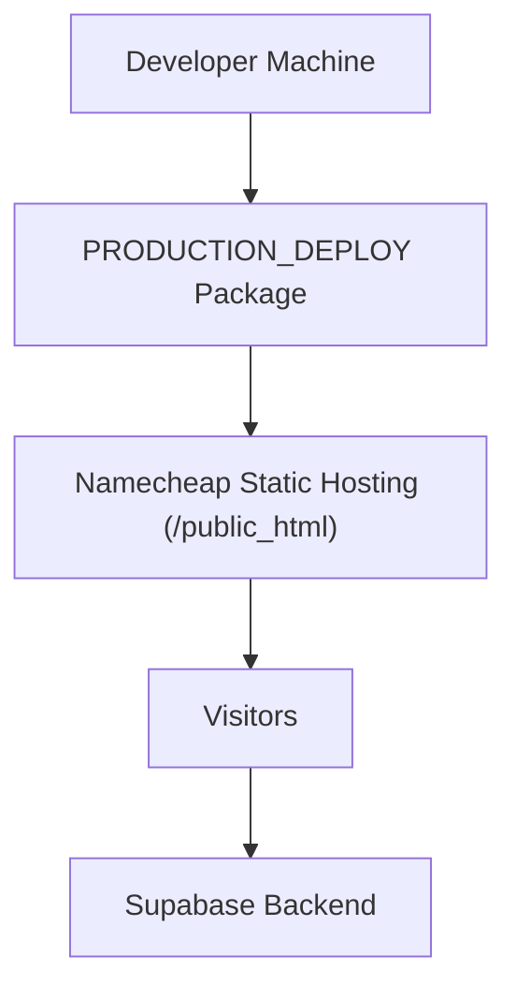

# Architecture & Design

<cite>
**Referenced Files in This Document**
- [README.md](file://README.md)
- [package.json](file://package.json)
- [DEPLOYMENT_GUIDE.txt](file://PRODUCTION_DEPLOY/DEPLOYMENT_GUIDE.txt)
- [README_FIRST.txt](file://PRODUCTION_DEPLOY/README_FIRST.txt)
- [STANDARD_NAVIGATION.html](file://PRODUCTION_DEPLOY/components/STANDARD_NAVIGATION.html)
- [STANDARD_FOOTER.html](file://PRODUCTION_DEPLOY/components/STANDARD_FOOTER.html)
- [load-components.js](file://PRODUCTION_DEPLOY/js/load-components.js)
- [blog-content.js](file://PRODUCTION_DEPLOY/js/blog-content.js)
- [index.html](file://PRODUCTION_DEPLOY/marketing/index.html)
- [apply.html](file://PRODUCTION_DEPLOY/apply.html)
- [privacy.html](file://PRODUCTION_DEPLOY/legal/privacy.html)
- [terms.html](file://PRODUCTION_DEPLOY/legal/terms.html)
- [msa.html](file://PRODUCTION_DEPLOY/legal/msa.html)
- [bar-compliance.html](file://PRODUCTION_DEPLOY/legal/bar-compliance.html)
- [subprocessors.html](file://PRODUCTION_DEPLOY/legal/subprocessors.html)
</cite>

## Table of Contents
1. [Introduction](#introduction)
2. [Project Structure](#project-structure)
3. [Core Components](#core-components)
4. [Architecture Overview](#architecture-overview)
5. [Detailed Component Analysis](#detailed-component-analysis)
6. [Dependency Analysis](#dependency-analysis)
7. [Performance Considerations](#performance-considerations)
8. [Security and Compliance](#security-and-compliance)
9. [Deployment Topology](#deployment-topology)
10. [Troubleshooting Guide](#troubleshooting-guide)
11. [Conclusion](#conclusion)

## Introduction
This document describes the TrueVow Website system design, focusing on the high-level static HTML architecture integrated with Supabase backend services. The website is built as a pure static HTML site hosted on Namecheap, with dynamic capabilities powered by Supabase REST API and Edge Functions. The system emphasizes zero-knowledge design principles, responsive user experience, and clear separation of concerns across marketing pages, legal documents, and blog content.

## Project Structure
The repository organizes content into three primary categories:
- Marketing pages: 19 HTML pages covering product explanation, pricing, blog hub, applications, and resources.
- Legal documents: 5 comprehensive legal pages (Privacy Policy, Terms of Service, MSA, Bar Compliance, Subprocessors).
- Components: Reusable HTML components (navigation, footer, widgets) and JavaScript loaders.

Production deployment is streamlined to a minimal set of files suitable for traditional static hosting, as documented in the deployment package.

**Diagram sources**
- [DEPLOYMENT_GUIDE.txt](file://PRODUCTION_DEPLOY/DEPLOYMENT_GUIDE.txt#L1-L209)
- [README.md](file://README.md#L1-L643)

**Section sources**
- [README.md](file://README.md#L46-L121)
- [DEPLOYMENT_GUIDE.txt](file://PRODUCTION_DEPLOY/DEPLOYMENT_GUIDE.txt#L1-L209)
- [README_FIRST.txt](file://PRODUCTION_DEPLOY/README_FIRST.txt#L1-L146)

## Core Components
- Reusable HTML components: Standardized navigation and footer are loaded via a lightweight loader to ensure consistency across pages.
- Blog content engine: Dynamically fetches and renders published content from Supabase, with filtering, analytics tracking, and error handling.
- Form integrations: Demo request and application forms submit data to Supabase via REST endpoints embedded in marketing pages.
- Legal document pages: Static HTML pages containing comprehensive legal content, organized for compliance and SEO.

Key implementation references:
- Component loader: [load-components.js](file://PRODUCTION_DEPLOY/js/load-components.js#L1-L58)
- Blog engine: [blog-content.js](file://PRODUCTION_DEPLOY/js/blog-content.js#L1-L424)
- Marketing homepage with embedded Supabase configuration and form handler: [index.html](file://PRODUCTION_DEPLOY/marketing/index.html#L1-L324)
- Legal pages: [privacy.html](file://PRODUCTION_DEPLOY/legal/privacy.html), [terms.html](file://PRODUCTION_DEPLOY/legal/terms.html), [msa.html](file://PRODUCTION_DEPLOY/legal/msa.html), [bar-compliance.html](file://PRODUCTION_DEPLOY/legal/bar-compliance.html), [subprocessors.html](file://PRODUCTION_DEPLOY/legal/subprocessors.html)

**Section sources**
- [load-components.js](file://PRODUCTION_DEPLOY/js/load-components.js#L1-L58)
- [blog-content.js](file://PRODUCTION_DEPLOY/js/blog-content.js#L1-L424)
- [index.html](file://PRODUCTION_DEPLOY/marketing/index.html#L1-L324)
- [STANDARD_NAVIGATION.html](file://PRODUCTION_DEPLOY/components/STANDARD_NAVIGATION.html#L1-L25)
- [STANDARD_FOOTER.html](file://PRODUCTION_DEPLOY/components/STANDARD_FOOTER.html#L1-L61)

## Architecture Overview
The system follows a static-first architecture with backend integration for dynamic content and form submissions:
- Frontend: Pure HTML/CSS/JavaScript (no build step) served from Namecheap static hosting.
- Backend: Supabase provides PostgreSQL database, REST API, and Edge Functions.
- Data flow: Pages fetch content and submit forms via REST endpoints; Edge Functions can be used for enhanced serverless logic.

**Diagram sources**
- [index.html](file://PRODUCTION_DEPLOY/marketing/index.html#L1-L324)
- [load-components.js](file://PRODUCTION_DEPLOY/js/load-components.js#L1-L58)
- [STANDARD_NAVIGATION.html](file://PRODUCTION_DEPLOY/components/STANDARD_NAVIGATION.html#L1-L25)
- [STANDARD_FOOTER.html](file://PRODUCTION_DEPLOY/components/STANDARD_FOOTER.html#L1-L61)

**Section sources**
- [README.md](file://README.md#L166-L222)
- [index.html](file://PRODUCTION_DEPLOY/marketing/index.html#L84-L243)

## Detailed Component Analysis

### Component-Based Architecture
The website uses a component-based approach to maintain consistency and reduce duplication:
- Navigation and footer are separate HTML files and injected at runtime.
- Widgets (exit intent, live chat, ROI calculator, etc.) are modular HTML/CSS/JS units.

**Diagram sources**
- [STANDARD_NAVIGATION.html](file://PRODUCTION_DEPLOY/components/STANDARD_NAVIGATION.html#L1-L25)
- [STANDARD_FOOTER.html](file://PRODUCTION_DEPLOY/components/STANDARD_FOOTER.html#L1-L61)
- [load-components.js](file://PRODUCTION_DEPLOY/js/load-components.js#L1-L58)

**Section sources**
- [STANDARD_NAVIGATION.html](file://PRODUCTION_DEPLOY/components/STANDARD_NAVIGATION.html#L1-L25)
- [STANDARD_FOOTER.html](file://PRODUCTION_DEPLOY/components/STANDARD_FOOTER.html#L1-L61)
- [load-components.js](file://PRODUCTION_DEPLOY/js/load-components.js#L1-L58)

### Blog Content Engine
The blog hub dynamically fetches published content from Supabase and renders cards with filtering and analytics:
- Fetches content via REST API with optional filters (type, featured, limit).
- Renders cards with platform badges, dates, and external links.
- Tracks views and clicks with analytics endpoint.
- Provides loading and error states.

**Diagram sources**
- [blog-content.js](file://PRODUCTION_DEPLOY/js/blog-content.js#L319-L350)
- [blog-content.js](file://PRODUCTION_DEPLOY/js/blog-content.js#L18-L64)
- [blog-content.js](file://PRODUCTION_DEPLOY/js/blog-content.js#L109-L219)

**Section sources**
- [blog-content.js](file://PRODUCTION_DEPLOY/js/blog-content.js#L1-L424)

### Form Submission Flow (Demo Request)
The homepage embeds Supabase configuration and a form handler that submits to the Supabase REST API:
- Validates phone input and normalizes to E.164.
- Posts to the demo requests table via REST endpoint.
- On success, redirects to a demo landing page.

**Diagram sources**
- [index.html](file://PRODUCTION_DEPLOY/marketing/index.html#L152-L242)
- [index.html](file://PRODUCTION_DEPLOY/marketing/index.html#L84-L86)

**Section sources**
- [index.html](file://PRODUCTION_DEPLOY/marketing/index.html#L152-L242)

### Legal Documents Separation
Legal pages are organized separately to ensure clarity, compliance, and SEO:
- Privacy Policy, Terms of Service, MSA, Bar Compliance, Subprocessors.
- Each page is a standalone HTML document optimized for legal readability and search visibility.

**Section sources**
- [privacy.html](file://PRODUCTION_DEPLOY/legal/privacy.html)
- [terms.html](file://PRODUCTION_DEPLOY/legal/terms.html)
- [msa.html](file://PRODUCTION_DEPLOY/legal/msa.html)
- [bar-compliance.html](file://PRODUCTION_DEPLOY/legal/bar-compliance.html)
- [subprocessors.html](file://PRODUCTION_DEPLOY/legal/subprocessors.html)

## Dependency Analysis
The system maintains low coupling between frontend and backend:
- Pages depend on Supabase REST endpoints for dynamic content and form submissions.
- Components are decoupled via file injection, enabling independent updates.
- No build-time transpilation or bundling is required, simplifying deployment.

**Diagram sources**
- [README.md](file://README.md#L166-L222)
- [DEPLOYMENT_GUIDE.txt](file://PRODUCTION_DEPLOY/DEPLOYMENT_GUIDE.txt#L1-L209)

**Section sources**
- [README.md](file://README.md#L166-L222)
- [package.json](file://package.json#L1-L35)

## Performance Considerations
- Static hosting reduces latency and eliminates server-side rendering overhead.
- Component injection occurs once per page load; caching headers on Namecheap can further improve performance.
- Blog engine includes loading and error states to maintain perceived performance.
- Minimizing third-party scripts and leveraging native browser APIs keeps bundle sizes small.

## Security and Compliance
- Zero-knowledge architecture: Client-side code only uses public keys; sensitive service role keys are never exposed.
- Row Level Security (RLS) policies restrict access to published content and enforce audit trails.
- Legal pages are static and reviewed for compliance; no dynamic content is processed client-side.
- Forms sanitize inputs and use HTTPS endpoints for secure transmission.

**Section sources**
- [README.md](file://README.md#L586-L613)
- [README.md](file://README.md#L166-L222)

## Deployment Topology
The production deployment package is optimized for Namecheap static hosting:
- Minimal file count and size for fast uploads and reliable delivery.
- Preconfigured Supabase credentials embedded in HTML for immediate functionality.
- Clear instructions for setting homepage and enabling SSL.

**Diagram sources**
- [DEPLOYMENT_GUIDE.txt](file://PRODUCTION_DEPLOY/DEPLOYMENT_GUIDE.txt#L60-L110)
- [README_FIRST.txt](file://PRODUCTION_DEPLOY/README_FIRST.txt#L45-L67)

**Section sources**
- [DEPLOYMENT_GUIDE.txt](file://PRODUCTION_DEPLOY/DEPLOYMENT_GUIDE.txt#L1-L209)
- [README_FIRST.txt](file://PRODUCTION_DEPLOY/README_FIRST.txt#L1-L146)

## Troubleshooting Guide
Common issues and resolutions:
- Blog content not loading: Verify Supabase URL/anon key, check published status, and confirm RLS policies allow public reads.
- Forms failing: Confirm REST endpoints are reachable, Edge Functions are deployed (if applicable), and CORS is enabled.
- Component injection errors: Ensure component placeholders exist and file paths are correct.
- Asset loading failures: Confirm asset paths are relative and files are uploaded to the correct directories.

**Section sources**
- [README.md](file://README.md#L502-L547)
- [DEPLOYMENT_GUIDE.txt](file://PRODUCTION_DEPLOY/DEPLOYMENT_GUIDE.txt#L179-L196)

## Conclusion
TrueVow’s architecture balances simplicity and scalability by combining a static HTML frontend with Supabase-powered backend services. The component-based design, modular widgets, and clear separation of marketing, legal, and blog content enable efficient maintenance and rapid iteration. With zero-knowledge principles, robust security measures, and straightforward deployment, the system supports reliable, compliant, and high-performance delivery of TrueVow’s messaging and services.