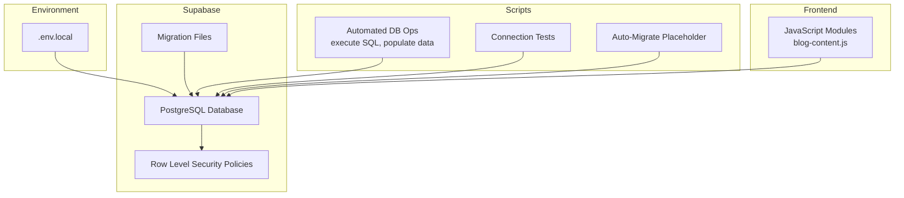
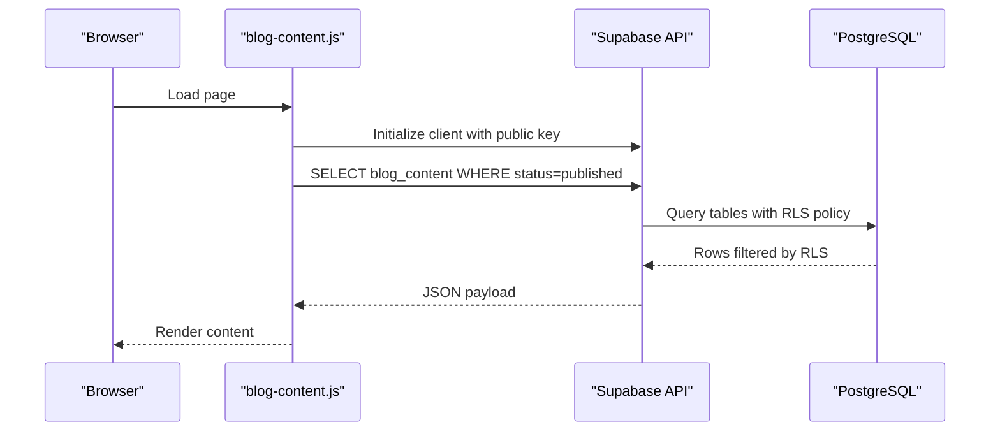
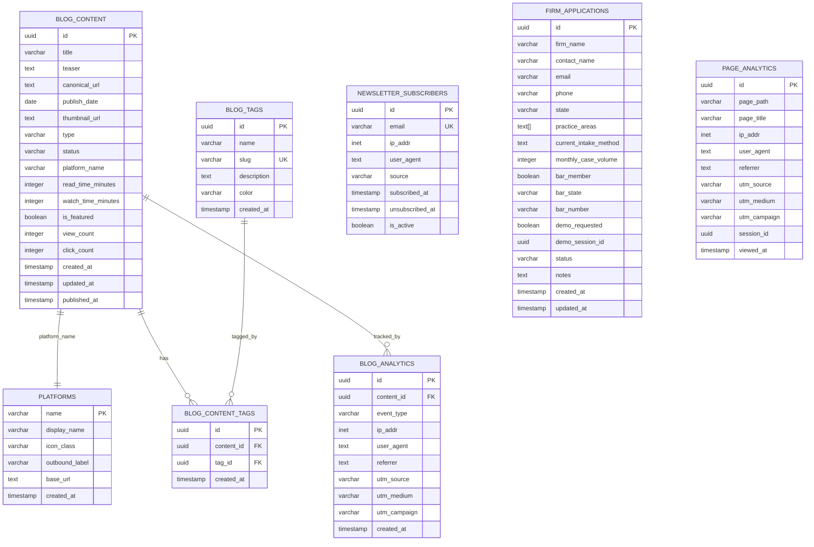
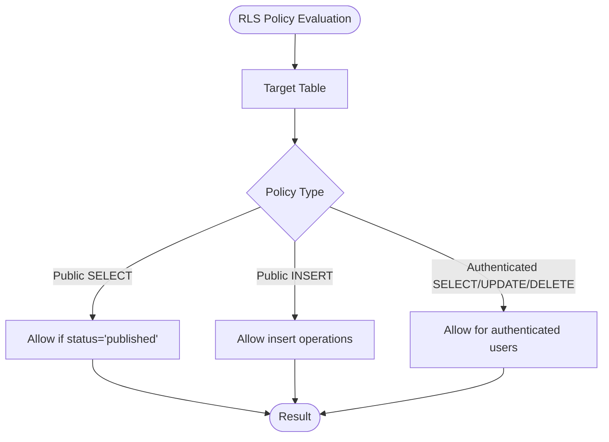
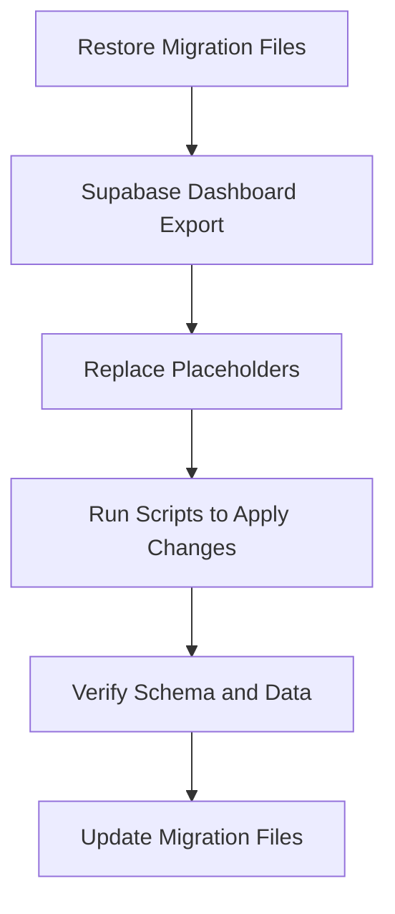
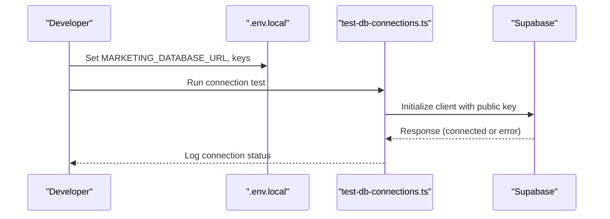
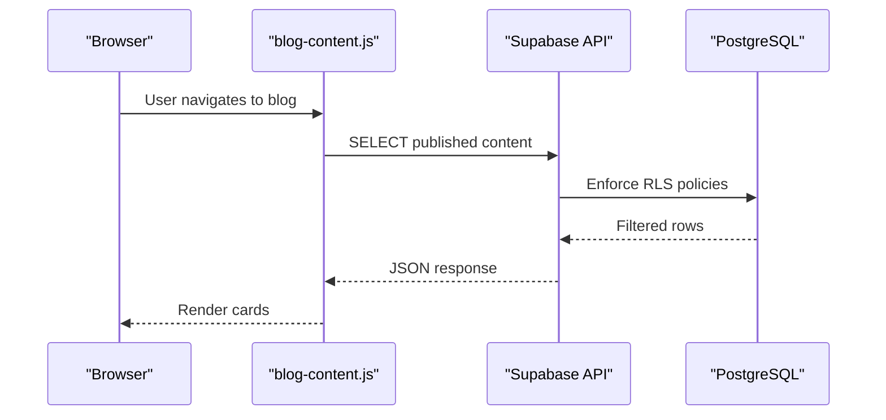
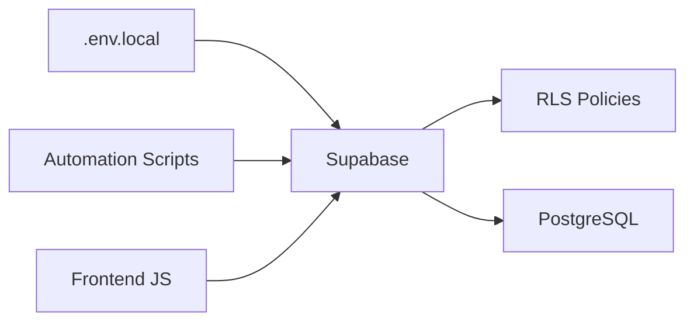

# Backend Architecture

<cite>
**Referenced Files in This Document**
- [.env.local](file://.env.local)
- [supabase/DATABASE_SCHEMA_README.md](file://supabase/DATABASE_SCHEMA_README.md)
- [supabase/migrations/README.md](file://supabase/migrations/README.md)
- [supabase/migrations/001_phase1_website_schema.sql](file://supabase/migrations/001_phase1_website_schema.sql)
- [supabase/migrations/001_initial_blog_schema.sql](file://supabase/migrations/001_initial_blog_schema.sql)
- [scripts/AUTOMATED_DB_OPERATIONS.md](file://scripts/AUTOMATED_DB_OPERATIONS.md)
- [scripts/README.md](file://scripts/README.md)
- [scripts/test-db-connections.ts](file://scripts/test-db-connections.ts)
- [scripts/auto-migrate-database.js](file://scripts/auto-migrate-database.js)
- [PRODUCTION_DEPLOY/js/blog-content.js](file://PRODUCTION_DEPLOY/js/blog-content.js)
- [js/blog-content.js](file://js/blog-content.js)
</cite>

## Table of Contents
1. [Introduction](#introduction)
2. [Project Structure](#project-structure)
3. [Core Components](#core-components)
4. [Architecture Overview](#architecture-overview)
5. [Detailed Component Analysis](#detailed-component-analysis)
6. [Dependency Analysis](#dependency-analysis)
7. [Performance Considerations](#performance-considerations)
8. [Troubleshooting Guide](#troubleshooting-guide)
9. [Conclusion](#conclusion)
10. [Appendices](#appendices)

## Introduction
This document explains the backend architecture for Supabase integration and database design powering the TrueVow marketing website. It covers the PostgreSQL schema, table relationships, constraints, and Row Level Security (RLS) policies. It documents the automated migration system, database initialization scripts, and schema evolution patterns. It also details Supabase client configuration, connection management, and security considerations including public versus service role keys. Practical examples of database operations, query patterns, and performance optimization strategies are included, along with backup and disaster recovery guidance, monitoring approaches, and the relationship between frontend JavaScript and backend services, including CORS and API endpoint patterns.

## Project Structure
The backend architecture centers around Supabase-managed PostgreSQL with:
- Supabase configuration and secrets stored in environment files
- Database schema documented in a dedicated schema readme
- Migration files (currently placeholders) intended to capture and evolve the schema
- Automated scripts for database operations, population, and connectivity testing
- Frontend JavaScript that interacts with Supabase-backed APIs and analytics

**Diagram sources**
- [.env.local](file://.env.local#L15-L38)
- [supabase/DATABASE_SCHEMA_README.md](file://supabase/DATABASE_SCHEMA_README.md#L1-L563)
- [supabase/migrations/README.md](file://supabase/migrations/README.md#L1-L37)
- [scripts/AUTOMATED_DB_OPERATIONS.md](file://scripts/AUTOMATED_DB_OPERATIONS.md#L1-L83)
- [scripts/test-db-connections.ts](file://scripts/test-db-connections.ts#L1-L65)
- [scripts/auto-migrate-database.js](file://scripts/auto-migrate-database.js#L1-L18)
- [PRODUCTION_DEPLOY/js/blog-content.js](file://PRODUCTION_DEPLOY/js/blog-content.js)
- [js/blog-content.js](file://js/blog-content.js)

**Section sources**
- [.env.local](file://.env.local#L15-L38)
- [supabase/DATABASE_SCHEMA_README.md](file://supabase/DATABASE_SCHEMA_README.md#L1-L563)
- [supabase/migrations/README.md](file://supabase/migrations/README.md#L1-L37)
- [scripts/AUTOMATED_DB_OPERATIONS.md](file://scripts/AUTOMATED_DB_OPERATIONS.md#L1-L83)
- [scripts/README.md](file://scripts/README.md#L1-L24)
- [scripts/test-db-connections.ts](file://scripts/test-db-connections.ts#L1-L65)
- [scripts/auto-migrate-database.js](file://scripts/auto-migrate-database.js#L1-L18)
- [PRODUCTION_DEPLOY/js/blog-content.js](file://PRODUCTION_DEPLOY/js/blog-content.js)
- [js/blog-content.js](file://js/blog-content.js)

## Core Components
- Supabase configuration and keys:
  - Service role connection string for migrations and administrative tasks
  - Public client keys for browser-side access
- Database schema and RLS:
  - Tables for blog content, analytics, newsletter subscribers, firm applications, platforms, tags, and page analytics
  - Views for dashboard and reporting
  - RLS policies enabling controlled access for public and authenticated users
- Automated migration and operational scripts:
  - Scripts to execute SQL files, populate data, and test connections
  - Placeholders for auto-migration and complete migration workflows
- Frontend integration:
  - JavaScript modules interacting with Supabase-backed APIs and analytics endpoints

**Section sources**
- [.env.local](file://.env.local#L15-L38)
- [supabase/DATABASE_SCHEMA_README.md](file://supabase/DATABASE_SCHEMA_README.md#L21-L451)
- [scripts/AUTOMATED_DB_OPERATIONS.md](file://scripts/AUTOMATED_DB_OPERATIONS.md#L16-L83)
- [scripts/README.md](file://scripts/README.md#L1-L24)

## Architecture Overview
The backend architecture follows a Supabase-first model:
- Supabase manages PostgreSQL, authentication, and edge functions
- Frontend JavaScript communicates with Supabase via public keys for read/write operations
- Administrative and migration tasks use service role keys from environment variables
- Operational scripts automate SQL execution, data population, and connectivity verification

**Diagram sources**
- [PRODUCTION_DEPLOY/js/blog-content.js](file://PRODUCTION_DEPLOY/js/blog-content.js)
- [js/blog-content.js](file://js/blog-content.js)
- [supabase/DATABASE_SCHEMA_README.md](file://supabase/DATABASE_SCHEMA_README.md#L56-L68)

## Detailed Component Analysis

### Database Schema and Relationships
The schema supports:
- Blog content hub with articles and videos
- Newsletter subscriptions
- Firm application forms
- Website analytics
- Platform and tagging reference tables
- Dashboard views for reporting

**Diagram sources**
- [supabase/DATABASE_SCHEMA_README.md](file://supabase/DATABASE_SCHEMA_README.md#L23-L374)

**Section sources**
- [supabase/DATABASE_SCHEMA_README.md](file://supabase/DATABASE_SCHEMA_README.md#L21-L451)

### Row Level Security (RLS) Policies
RLS is enabled across tables with tailored policies:
- blog_content: public select for published content; insert/update/delete for authenticated users
- blog_analytics: public insert for tracking; select for authenticated users
- newsletter_subscribers: public insert for subscriptions; select for authenticated users
- firm_applications: public insert for form submissions; select/update for authenticated users

**Diagram sources**
- [supabase/DATABASE_SCHEMA_README.md](file://supabase/DATABASE_SCHEMA_README.md#L431-L449)

**Section sources**
- [supabase/DATABASE_SCHEMA_README.md](file://supabase/DATABASE_SCHEMA_README.md#L56-L68)
- [supabase/DATABASE_SCHEMA_README.md](file://supabase/DATABASE_SCHEMA_README.md#L106-L110)
- [supabase/DATABASE_SCHEMA_README.md](file://supabase/DATABASE_SCHEMA_README.md#L160-L164)
- [supabase/DATABASE_SCHEMA_README.md](file://supabase/DATABASE_SCHEMA_README.md#L224-L228)
- [supabase/DATABASE_SCHEMA_README.md](file://supabase/DATABASE_SCHEMA_README.md#L431-L449)

### Automated Migration System and Schema Evolution
- Migration files currently serve as placeholders and must be restored from the Supabase dashboard exports
- The migration readme describes the intended schema evolution across phases
- Automated scripts support SQL execution and data population, while auto-migrate remains a placeholder to be restored

**Diagram sources**
- [supabase/migrations/README.md](file://supabase/migrations/README.md#L1-L37)
- [supabase/migrations/001_phase1_website_schema.sql](file://supabase/migrations/001_phase1_website_schema.sql#L6-L25)
- [supabase/migrations/001_initial_blog_schema.sql](file://supabase/migrations/001_initial_blog_schema.sql#L6-L21)
- [scripts/AUTOMATED_DB_OPERATIONS.md](file://scripts/AUTOMATED_DB_OPERATIONS.md#L18-L33)
- [scripts/README.md](file://scripts/README.md#L17-L22)

**Section sources**
- [supabase/migrations/README.md](file://supabase/migrations/README.md#L1-L37)
- [supabase/migrations/001_phase1_website_schema.sql](file://supabase/migrations/001_phase1_website_schema.sql#L6-L25)
- [supabase/migrations/001_initial_blog_schema.sql](file://supabase/migrations/001_initial_blog_schema.sql#L6-L21)
- [scripts/AUTOMATED_DB_OPERATIONS.md](file://scripts/AUTOMATED_DB_OPERATIONS.md#L18-L33)
- [scripts/README.md](file://scripts/README.md#L17-L22)
- [scripts/auto-migrate-database.js](file://scripts/auto-migrate-database.js#L5-L16)

### Supabase Client Configuration and Connection Management
- Service role connection string for migrations and administrative tasks is configured in environment variables
- Public client keys are exposed to the browser via Next.js public environment variables
- Connection tests validate reachability and basic access across databases

**Diagram sources**
- [.env.local](file://.env.local#L15-L38)
- [scripts/test-db-connections.ts](file://scripts/test-db-connections.ts#L11-L51)

**Section sources**
- [.env.local](file://.env.local#L15-L38)
- [scripts/test-db-connections.ts](file://scripts/test-db-connections.ts#L1-L65)

### Frontend JavaScript and Backend Services Integration
- JavaScript modules fetch blog content and track analytics via Supabase
- API endpoints are backed by Supabase, with RLS policies governing access
- CORS is implicitly handled by Supabase; ensure origin domains are permitted in the Supabase project settings

**Diagram sources**
- [PRODUCTION_DEPLOY/js/blog-content.js](file://PRODUCTION_DEPLOY/js/blog-content.js)
- [js/blog-content.js](file://js/blog-content.js)
- [supabase/DATABASE_SCHEMA_README.md](file://supabase/DATABASE_SCHEMA_README.md#L56-L68)

**Section sources**
- [PRODUCTION_DEPLOY/js/blog-content.js](file://PRODUCTION_DEPLOY/js/blog-content.js)
- [js/blog-content.js](file://js/blog-content.js)
- [supabase/DATABASE_SCHEMA_README.md](file://supabase/DATABASE_SCHEMA_README.md#L56-L68)

## Dependency Analysis
The backend depends on:
- Supabase for database, authentication, and edge functions
- Environment variables for secure configuration
- Scripts for automation and testing
- Frontend modules for API consumption

**Diagram sources**
- [.env.local](file://.env.local#L15-L38)
- [scripts/AUTOMATED_DB_OPERATIONS.md](file://scripts/AUTOMATED_DB_OPERATIONS.md#L1-L83)
- [PRODUCTION_DEPLOY/js/blog-content.js](file://PRODUCTION_DEPLOY/js/blog-content.js)
- [js/blog-content.js](file://js/blog-content.js)
- [supabase/DATABASE_SCHEMA_README.md](file://supabase/DATABASE_SCHEMA_README.md#L431-L449)

**Section sources**
- [.env.local](file://.env.local#L15-L38)
- [scripts/AUTOMATED_DB_OPERATIONS.md](file://scripts/AUTOMATED_DB_OPERATIONS.md#L1-L83)
- [PRODUCTION_DEPLOY/js/blog-content.js](file://PRODUCTION_DEPLOY/js/blog-content.js)
- [js/blog-content.js](file://js/blog-content.js)
- [supabase/DATABASE_SCHEMA_README.md](file://supabase/DATABASE_SCHEMA_README.md#L431-L449)

## Performance Considerations
- Indexes on frequently queried columns (status, publish_date, type, platform_name, email, created_at) improve query performance
- Views pre-aggregate data for dashboard reporting to reduce runtime computation
- Use LIMIT clauses and selective filters to constrain result sets
- Batch analytics inserts and avoid excessive writes during peak traffic
- Monitor slow queries via Supabase logs and adjust indexes or policies as needed

[No sources needed since this section provides general guidance]

## Troubleshooting Guide
- Connection failures:
  - Verify environment variables for Supabase URLs and keys
  - Use the connection test script to validate reachability
  - Confirm Supabase project allows requests from the configured origins
- Migration issues:
  - Restore migration files from Supabase dashboard exports
  - Use automated scripts to execute SQL and populate data safely
- RLS access problems:
  - Confirm roles and policies match intended access patterns
  - Test public vs authenticated access separately

**Section sources**
- [scripts/AUTOMATED_DB_OPERATIONS.md](file://scripts/AUTOMATED_DB_OPERATIONS.md#L71-L77)
- [scripts/README.md](file://scripts/README.md#L17-L22)
- [scripts/test-db-connections.ts](file://scripts/test-db-connections.ts#L23-L51)
- [supabase/DATABASE_SCHEMA_README.md](file://supabase/DATABASE_SCHEMA_README.md#L431-L449)

## Conclusion
The backend leverages Supabase to deliver a secure, scalable, and maintainable data layer for the TrueVow marketing website. The schema, RLS policies, and automated scripts provide a robust foundation for content management, analytics, and administration. By restoring migration files, validating connections, and adhering to security best practices, teams can confidently evolve the system while maintaining performance and reliability.

[No sources needed since this section summarizes without analyzing specific files]

## Appendices

### Appendix A: Practical Examples and Query Patterns
- Fetch published blog content:
  - See example query pattern in the schema documentation
- Track content views and clicks:
  - Use analytics insert and summary aggregation queries
- Manage newsletter subscriptions:
  - Insert subscriber records with conflict handling

**Section sources**
- [supabase/DATABASE_SCHEMA_README.md](file://supabase/DATABASE_SCHEMA_README.md#L61-L68)
- [supabase/DATABASE_SCHEMA_README.md](file://supabase/DATABASE_SCHEMA_README.md#L111-L129)
- [supabase/DATABASE_SCHEMA_README.md](file://supabase/DATABASE_SCHEMA_README.md#L165-L182)

### Appendix B: Backup and Disaster Recovery
- Regularly export database schemas from the Supabase dashboard
- Store migration files in version control after restoration
- Automate backups through Supabase’s built-in backup features
- Test restore procedures periodically and document steps

[No sources needed since this section provides general guidance]

### Appendix C: Monitoring Approaches
- Enable logging and monitor slow queries in Supabase
- Track analytics events and content performance via dashboard views
- Observe RLS policy effectiveness and access patterns
- Set up alerts for unusual spikes or failures

[No sources needed since this section provides general guidance]