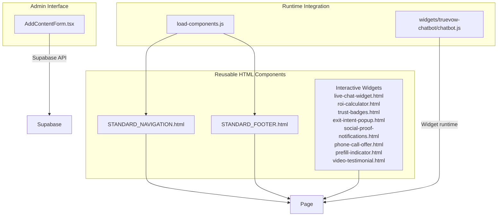
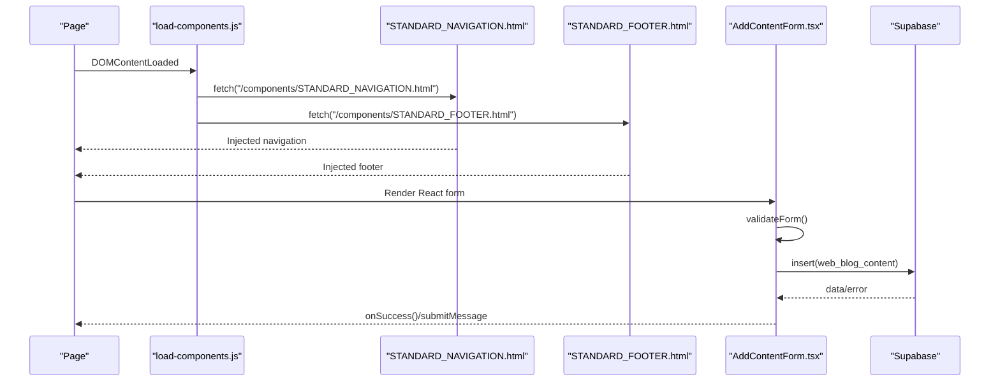
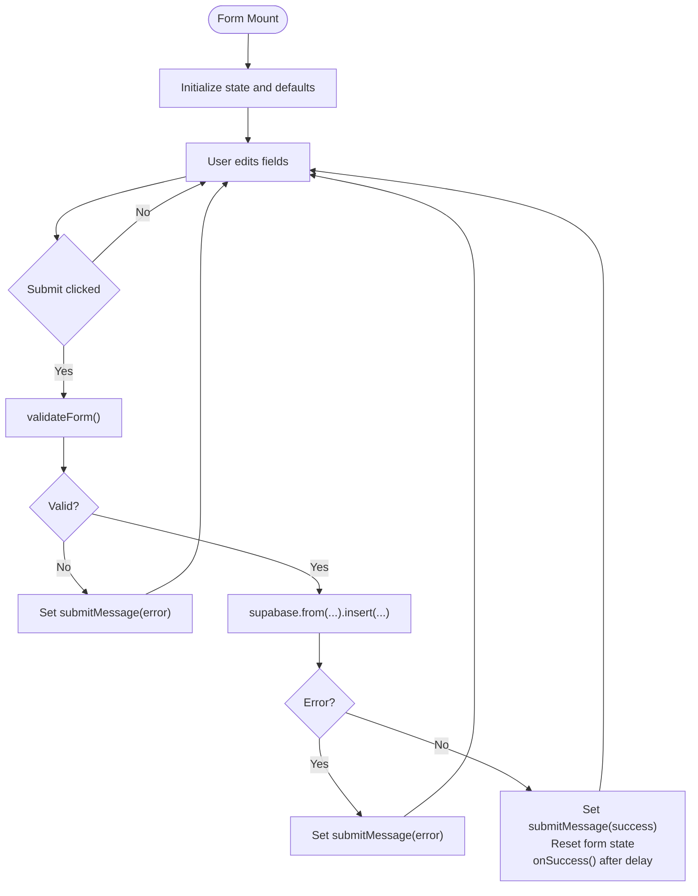
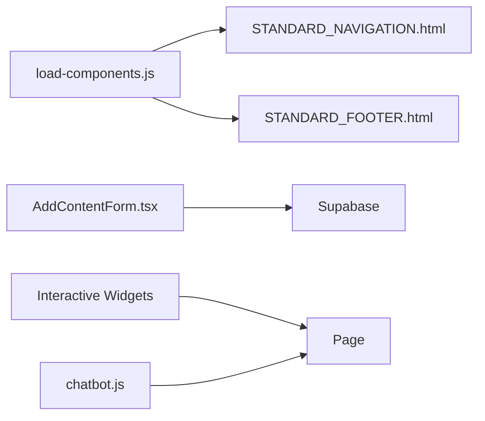

# Component Architecture

<cite>
**Referenced Files in This Document**
- [AddContentForm.tsx](file://components/admin/AddContentForm.tsx)
- [STANDARD_NAVIGATION.html](file://components/STANDARD_NAVIGATION.html)
- [STANDARD_FOOTER.html](file://components/STANDARD_FOOTER.html)
- [load-components.js](file://js/load-components.js)
- [live-chat-widget.html](file://components/live-chat-widget.html)
- [roi-calculator.html](file://components/roi-calculator.html)
- [trust-badges.html](file://components/trust-badges.html)
- [exit-intent-popup.html](file://components/exit-intent-popup.html)
- [social-proof-notifications.html](file://components/social-proof-notifications.html)
- [phone-call-offer.html](file://components/phone-call-offer.html)
- [prefill-indicator.html](file://components/prefill-indicator.html)
- [video-testimonial.html](file://components/video-testimonial.html)
- [chatbot.js](file://widgets/truevow-chatbot/chatbot.js)
</cite>

## Table of Contents
1. [Introduction](#introduction)
2. [Project Structure](#project-structure)
3. [Core Components](#core-components)
4. [Architecture Overview](#architecture-overview)
5. [Detailed Component Analysis](#detailed-component-analysis)
6. [Dependency Analysis](#dependency-analysis)
7. [Performance Considerations](#performance-considerations)
8. [Troubleshooting Guide](#troubleshooting-guide)
9. [Conclusion](#conclusion)

## Introduction
This document describes the component architecture for reusable HTML components and the React-based admin interface. It explains standardized navigation and footer components, interactive widgets for engagement, and the admin content management component. It covers component lifecycle, prop passing, event handling, form validation, state management, and API integration. Practical guidance is included for customization, styling, responsive behavior, composition patterns, dependency management, and testing strategies.

## Project Structure
The website organizes components into two primary categories:
- Reusable HTML components: Shared navigation, footer, and interactive widgets embedded via JavaScript loader.
- Admin React component: A client-side React form for content creation and publication.

**Diagram sources**
- [STANDARD_NAVIGATION.html](file://components/STANDARD_NAVIGATION.html#L1-L25)
- [STANDARD_FOOTER.html](file://components/STANDARD_FOOTER.html#L1-L61)
- [load-components.js](file://js/load-components.js#L1-L58)
- [AddContentForm.tsx](file://components/admin/AddContentForm.tsx#L1-L357)
- [live-chat-widget.html](file://components/live-chat-widget.html#L1-L515)
- [roi-calculator.html](file://components/roi-calculator.html#L1-L488)
- [trust-badges.html](file://components/trust-badges.html#L1-L240)
- [exit-intent-popup.html](file://components/exit-intent-popup.html#L1-L252)
- [social-proof-notifications.html](file://components/social-proof-notifications.html#L1-L209)
- [phone-call-offer.html](file://components/phone-call-offer.html#L1-L298)
- [prefill-indicator.html](file://components/prefill-indicator.html#L1-L187)
- [video-testimonial.html](file://components/video-testimonial.html#L1-L410)
- [chatbot.js](file://widgets/truevow-chatbot/chatbot.js#L1-L99)

**Section sources**
- [STANDARD_NAVIGATION.html](file://components/STANDARD_NAVIGATION.html#L1-L25)
- [STANDARD_FOOTER.html](file://components/STANDARD_FOOTER.html#L1-L61)
- [load-components.js](file://js/load-components.js#L1-L58)
- [AddContentForm.tsx](file://components/admin/AddContentForm.tsx#L1-L357)
- [live-chat-widget.html](file://components/live-chat-widget.html#L1-L515)
- [roi-calculator.html](file://components/roi-calculator.html#L1-L488)
- [trust-badges.html](file://components/trust-badges.html#L1-L240)
- [exit-intent-popup.html](file://components/exit-intent-popup.html#L1-L252)
- [social-proof-notifications.html](file://components/social-proof-notifications.html#L1-L209)
- [phone-call-offer.html](file://components/phone-call-offer.html#L1-L298)
- [prefill-indicator.html](file://components/prefill-indicator.html#L1-L187)
- [video-testimonial.html](file://components/video-testimonial.html#L1-L410)
- [chatbot.js](file://widgets/truevow-chatbot/chatbot.js#L1-L99)

## Core Components
- Standardized Navigation and Footer: Single-source HTML templates injected into pages via a lightweight loader. They define consistent branding, links, and CTAs across the site.
- Interactive Widgets: Self-contained HTML/CSS/JS modules providing engagement features such as live chat, ROI calculator, trust badges, exit-intent popup, social proof notifications, phone call offer, prefill indicator, and video testimonials.
- Admin Content Form (React): A client-side React component that validates inputs, manages local state, integrates with Supabase, and communicates success/error via callbacks.

Key design principles:
- Single source of truth for navigation and footer.
- Encapsulated widget behavior with minimal external dependencies.
- React component with explicit props for callbacks and controlled state.

**Section sources**
- [STANDARD_NAVIGATION.html](file://components/STANDARD_NAVIGATION.html#L1-L25)
- [STANDARD_FOOTER.html](file://components/STANDARD_FOOTER.html#L1-L61)
- [load-components.js](file://js/load-components.js#L1-L58)
- [AddContentForm.tsx](file://components/admin/AddContentForm.tsx#L1-L357)
- [live-chat-widget.html](file://components/live-chat-widget.html#L1-L515)
- [roi-calculator.html](file://components/roi-calculator.html#L1-L488)
- [trust-badges.html](file://components/trust-badges.html#L1-L240)
- [exit-intent-popup.html](file://components/exit-intent-popup.html#L1-L252)
- [social-proof-notifications.html](file://components/social-proof-notifications.html#L1-L209)
- [phone-call-offer.html](file://components/phone-call-offer.html#L1-L298)
- [prefill-indicator.html](file://components/prefill-indicator.html#L1-L187)
- [video-testimonial.html](file://components/video-testimonial.html#L1-L410)

## Architecture Overview
The architecture combines static HTML components with a React admin form and optional dynamic widgets.

**Diagram sources**
- [load-components.js](file://js/load-components.js#L1-L58)
- [STANDARD_NAVIGATION.html](file://components/STANDARD_NAVIGATION.html#L1-L25)
- [STANDARD_FOOTER.html](file://components/STANDARD_FOOTER.html#L1-L61)
- [AddContentForm.tsx](file://components/admin/AddContentForm.tsx#L1-L357)

## Detailed Component Analysis

### Standardized Navigation Component
- Purpose: Provide consistent header navigation across pages.
- Behavior: Uses inline styles and mouseover effects; includes logo, links, and a prominent CTA.
- Integration: Loaded via the component loader into a placeholder element.

Customization tips:
- Replace logo image path for alternate branding.
- Update link URLs to match new site structure.
- Adjust colors and typography via inline style overrides.

Responsive behavior:
- Flex layout adapts to screen width; center links and CTA stack vertically on small screens.

**Section sources**
- [STANDARD_NAVIGATION.html](file://components/STANDARD_NAVIGATION.html#L1-L25)
- [load-components.js](file://js/load-components.js#L1-L58)

### Standardized Footer Component
- Purpose: Provide consistent footer with product/resources/company links and legal disclaimers.
- Behavior: Grid layout for three-column links; centered disclaimer text.
- Integration: Loaded via the component loader into a placeholder element.

Customization tips:
- Modify grid template columns for different link counts.
- Update legal links and disclaimers to reflect policy changes.

Responsive behavior:
- Columns stack on smaller screens; legal links wrap for readability.

**Section sources**
- [STANDARD_FOOTER.html](file://components/STANDARD_FOOTER.html#L1-L61)
- [load-components.js](file://js/load-components.js#L1-L58)

### Admin Content Management Form (React)
- Purpose: Allow content creators to add articles or videos to the blog hub.
- Props:
  - onSuccess: Optional callback invoked after successful submission.
  - onCancel: Optional cancel handler.
- State:
  - Local form state for title, teaser, canonical URL, publish date, thumbnail, type, platform, read/watch time, featured flag, and status.
  - Submission state and message.
- Validation:
  - Required fields and type-specific validations.
- API Integration:
  - Inserts into Supabase table for web_blog_content.
  - Adds UTM parameters to canonical URL if missing.
- Lifecycle:
  - On mount: initializes state.
  - On submit: validates, sets submitting state, inserts data, resets form, invokes success callback after delay.
  - Error handling displays user-friendly messages.

**Diagram sources**
- [AddContentForm.tsx](file://components/admin/AddContentForm.tsx#L1-L357)

**Section sources**
- [AddContentForm.tsx](file://components/admin/AddContentForm.tsx#L1-L357)

### Interactive Widget: Live Chat
- Purpose: Provide instant answers and reduce friction via a persistent chat button.
- Features:
  - Animated chat button with pulse effect and badge.
  - Slide-up chat window with agent avatar, typing indicators, quick replies, and input area.
  - Keyword-based responses and analytics events.
- Styling:
  - Fixed-position widget with media queries for mobile.
- Events:
  - Toggle visibility, send messages, handle quick replies, track analytics.

Customization tips:
- Update response keywords and messages to reflect product updates.
- Adjust colors and animations to match brand guidelines.
- Configure analytics events for internal reporting.

**Section sources**
- [live-chat-widget.html](file://components/live-chat-widget.html#L1-L515)

### Interactive Widget: ROI Calculator
- Purpose: Demonstrate potential revenue gains with adjustable sliders.
- Features:
  - Sliders for inbound calls, conversion rate, and average case value.
  - Real-time calculations for “before” and “after” scenarios.
  - Impact summary and breakdown metrics.
- Styling:
  - Responsive grid layout with gradient backgrounds and cards.
- Events:
  - Slider input triggers recalculation; CTA tracks clicks.

Customization tips:
- Adjust assumptions for capture rate and conversion to reflect new data.
- Update color schemes and typography to match page themes.
- Add analytics events for deeper funnel insights.

**Section sources**
- [roi-calculator.html](file://components/roi-calculator.html#L1-L488)

### Interactive Widget: Trust Badges
- Purpose: Display security, compliance, and verification badges to build trust.
- Features:
  - Badge grid with hover effects and verified indicators.
  - Feature highlights with icons.
- Styling:
  - Responsive grid with hover transitions.
- Events:
  - Tracks badge click interactions.

Customization tips:
- Add or remove badges to reflect current certifications.
- Update feature descriptions to reflect service improvements.

**Section sources**
- [trust-badges.html](file://components/trust-badges.html#L1-L240)

### Interactive Widget: Exit-Intent Popup
- Purpose: Capture attention when users attempt to leave the page.
- Features:
  - Overlay with countdown timer and benefits list.
  - Analytics for show/close events.
- Events:
  - Mouseleave detection, timed fallback, close handlers.

Customization tips:
- Adjust copy to highlight current offers and seat availability.
- Tune timing and frequency to avoid user frustration.

**Section sources**
- [exit-intent-popup.html](file://components/exit-intent-popup.html#L1-L252)

### Interactive Widget: Social Proof Notifications
- Purpose: Show recent actions by other users to encourage conversions.
- Features:
  - Animated notification with avatar, name, city, and time.
  - Auto-cycle through sample data and pause near CTAs.
- Events:
  - Interval-based cycling and scroll-aware pause.

Customization tips:
- Integrate real-time data via API endpoint.
- Personalize messages based on user context.

**Section sources**
- [social-proof-notifications.html](file://components/social-proof-notifications.html#L1-L209)

### Interactive Widget: Phone Call Offer
- Purpose: Provide high-touch founder call to address objections.
- Features:
  - Benefits grid, CTA, availability indicator, and testimonial.
- Styling:
  - Responsive layout with animations and testimonials.
- Events:
  - Tracks CTA clicks.

Customization tips:
- Update benefit copy and testimonial content.
- Link to current Calendly availability.

**Section sources**
- [phone-call-offer.html](file://components/phone-call-offer.html#L1-L298)

### Interactive Widget: Prefill Indicator
- Purpose: Communicate pre-filled form state for demo sessions.
- Features:
  - Animated indicator with progress bar and stats.
  - Fetches demo session data and auto-fills fields.
- Events:
  - On load, detects demo parameter and updates UI.

Customization tips:
- Extend API endpoint to include additional fields.
- Update hero messaging to reflect user’s first name.

**Section sources**
- [prefill-indicator.html](file://components/prefill-indicator.html#L1-L187)

### Interactive Widget: Video Testimonials
- Purpose: Showcase real results via video testimonials.
- Features:
  - Grid of clickable thumbnails with overlay text.
  - Modal player with statistics and author info.
- Events:
  - Opens modal with autoplayed video; closes on outside click or escape.

Customization tips:
- Replace YouTube embed URLs with new testimonials.
- Update statistics and author details.

**Section sources**
- [video-testimonial.html](file://components/video-testimonial.html#L1-L410)

### TrueVow Chatbot (Widget Runtime)
- Purpose: Provide a configurable chat widget with launcher and theming.
- Features:
  - Template-driven widget creation.
  - Theme switcher and voice toggle controls.
- Integration:
  - Exposes a factory method to create and return widget elements.

Customization tips:
- Adjust default options and template structure for brand alignment.
- Add analytics hooks for internal tracking.

**Section sources**
- [chatbot.js](file://widgets/truevow-chatbot/chatbot.js#L1-L99)

## Dependency Analysis
- Component Loader depends on fetch and DOM readiness to inject HTML into placeholders.
- Admin Form depends on React and Supabase client for state and persistence.
- Widgets depend on inline styles and JavaScript for behavior; some integrate analytics via global functions.
- Chatbot widget depends on DOM elements and exposes a factory API.

**Diagram sources**
- [load-components.js](file://js/load-components.js#L1-L58)
- [AddContentForm.tsx](file://components/admin/AddContentForm.tsx#L1-L357)
- [STANDARD_NAVIGATION.html](file://components/STANDARD_NAVIGATION.html#L1-L25)
- [STANDARD_FOOTER.html](file://components/STANDARD_FOOTER.html#L1-L61)
- [chatbot.js](file://widgets/truevow-chatbot/chatbot.js#L1-L99)

**Section sources**
- [load-components.js](file://js/load-components.js#L1-L58)
- [AddContentForm.tsx](file://components/admin/AddContentForm.tsx#L1-L357)
- [STANDARD_NAVIGATION.html](file://components/STANDARD_NAVIGATION.html#L1-L25)
- [STANDARD_FOOTER.html](file://components/STANDARD_FOOTER.html#L1-L61)
- [chatbot.js](file://widgets/truevow-chatbot/chatbot.js#L1-L99)

## Performance Considerations
- Component Loader: Minimize repeated fetches by caching injected content and avoiding redundant initialization.
- Widgets: Defer non-critical scripts; lazy-load heavy widgets (e.g., video modal) until needed.
- Admin Form: Debounce form submissions and avoid unnecessary re-renders by using controlled components and stable initial state.
- Analytics: Batch or throttle analytics events to reduce overhead.

## Troubleshooting Guide
Common issues and resolutions:
- Navigation/Footer not appearing:
  - Verify placeholder IDs exist and loader runs after DOMContentLoaded.
  - Confirm file paths and network accessibility.
- Form submission errors:
  - Inspect Supabase error messages and ensure table permissions and policies are configured.
  - Validate canonical URL formatting and UTM parameter injection.
- Widget not responding:
  - Check for global analytics function availability before firing events.
  - Ensure required DOM elements exist before manipulating them.
- Chatbot not rendering:
  - Confirm target element exists and factory method is called with valid options.

**Section sources**
- [load-components.js](file://js/load-components.js#L1-L58)
- [AddContentForm.tsx](file://components/admin/AddContentForm.tsx#L1-L357)
- [live-chat-widget.html](file://components/live-chat-widget.html#L1-L515)
- [chatbot.js](file://widgets/truevow-chatbot/chatbot.js#L1-L99)

## Conclusion
The component architecture balances simplicity and scalability. Standardized HTML components ensure consistent UX across pages, while the React admin form centralizes content creation with robust validation and API integration. Interactive widgets enhance engagement and trust, each encapsulated with clear styling and event handling. Following the customization, styling, responsive, composition, dependency, and testing guidance ensures maintainable and performant implementations.