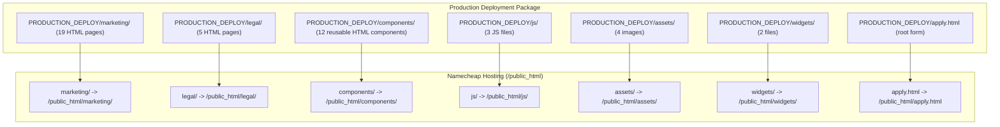
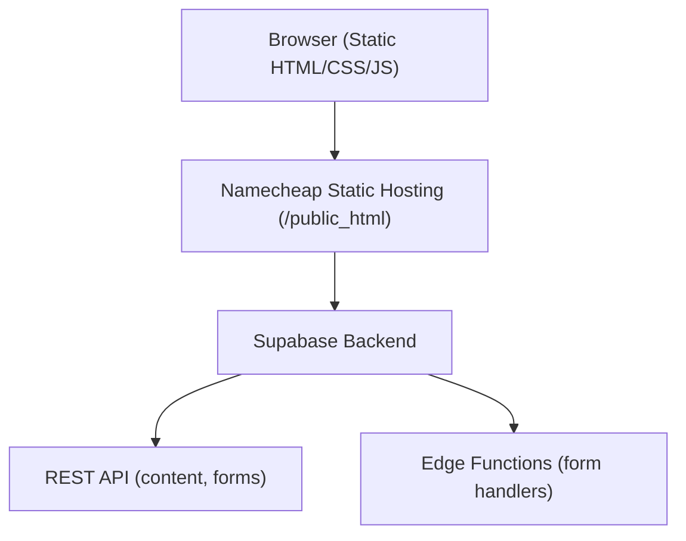
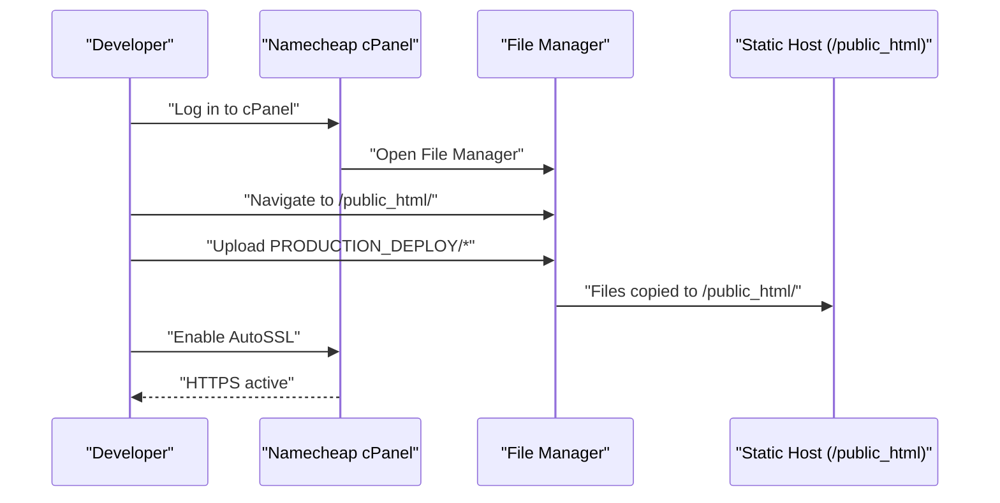
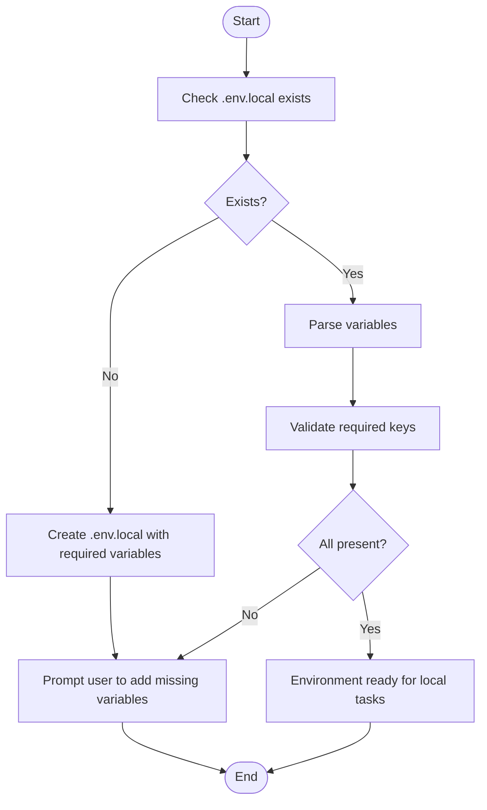
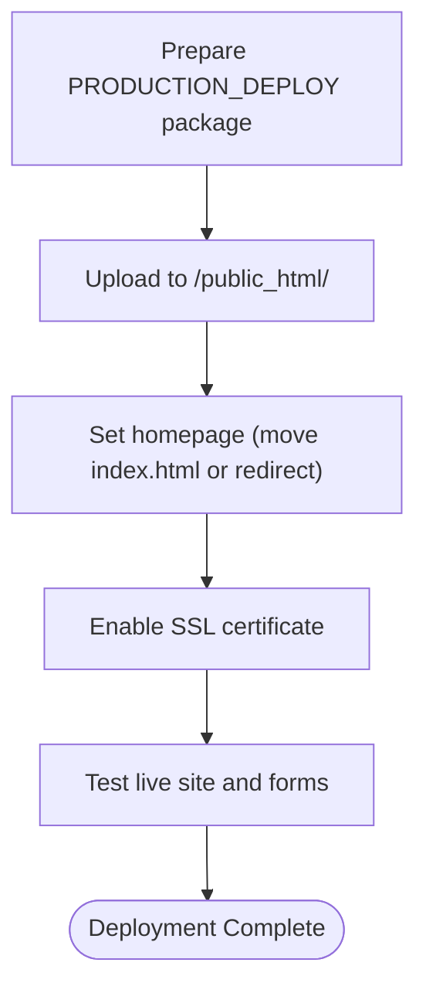
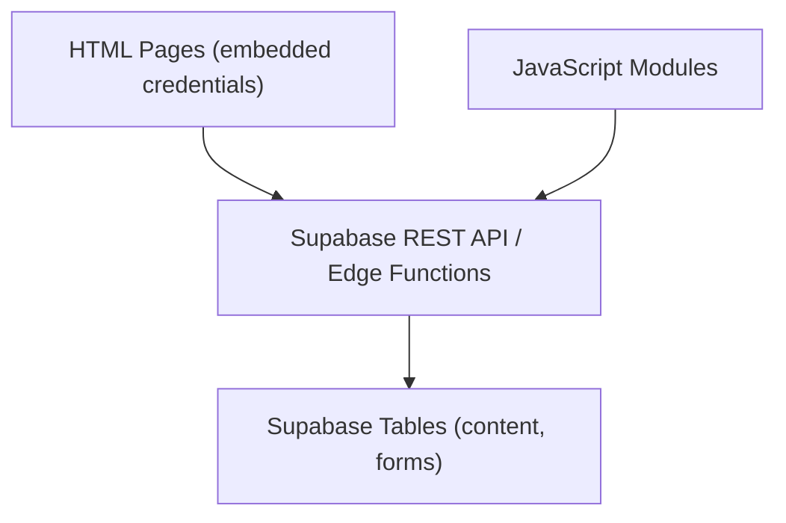

# Deployment Architecture

<cite>
**Referenced Files in This Document**
- [README.md](file://README.md)
- [DEPLOYMENT_GUIDE.txt](file://PRODUCTION_DEPLOY/DEPLOYMENT_GUIDE.txt)
- [README_FIRST.txt](file://PRODUCTION_DEPLOY/README_FIRST.txt)
- [TEST_REPORT.md](file://PRODUCTION_DEPLOY/TEST_REPORT.md)
- [.env.local](file://.env.local)
- [check_env_setup.js](file://scripts/check_env_setup.js)
- [rebuild-blog.yml](file://.github/workflows/rebuild-blog.yml)
- [FINAL_DEPLOYMENT_SUMMARY.md](file://rules/FINAL_DEPLOYMENT_SUMMARY.md)
- [LAUNCH_READY_SUMMARY.md](file://rules/LAUNCH_READY_SUMMARY.md)
- [index.html](file://PRODUCTION_DEPLOY/marketing/index.html)
- [load-components.js](file://PRODUCTION_DEPLOY/js/load-components.js)
- [STANDARD_NAVIGATION.html](file://PRODUCTION_DEPLOY/components/STANDARD_NAVIGATION.html)
- [package.json](file://package.json)
</cite>

## Table of Contents
1. [Introduction](#introduction)
2. [Project Structure](#project-structure)
3. [Core Components](#core-components)
4. [Architecture Overview](#architecture-overview)
5. [Detailed Component Analysis](#detailed-component-analysis)
6. [Dependency Analysis](#dependency-analysis)
7. [Performance Considerations](#performance-considerations)
8. [Troubleshooting Guide](#troubleshooting-guide)
9. [Conclusion](#conclusion)
10. [Appendices](#appendices)

## Introduction
This document describes the deployment architecture for the TrueVow marketing website, focusing on static hosting and production deployment. It explains the Namecheap static hosting setup, file organization, and upload procedures. It also documents environment configuration management with .env.local variables and Supabase credential handling, the deployment workflow including local development setup, testing procedures, and production release processes. Practical examples of deployment scripts, CI/CD considerations, and rollback procedures are included. Domain configuration, SSL setup, and DNS management are addressed along with monitoring and maintenance procedures, performance optimization for static hosting, and troubleshooting common deployment issues.

## Project Structure
The website is a pure static HTML/CSS/JavaScript site that integrates with Supabase for backend functionality. The production deployment package is streamlined to only the files needed to run the marketing website.

**Diagram sources**
- [DEPLOYMENT_GUIDE.txt](file://PRODUCTION_DEPLOY/DEPLOYMENT_GUIDE.txt#L60-L108)
- [README_FIRST.txt](file://PRODUCTION_DEPLOY/README_FIRST.txt#L45-L66)

**Section sources**
- [DEPLOYMENT_GUIDE.txt](file://PRODUCTION_DEPLOY/DEPLOYMENT_GUIDE.txt#L19-L58)
- [README_FIRST.txt](file://PRODUCTION_DEPLOY/README_FIRST.txt#L19-L43)

## Core Components
- Static HTML pages: marketing/, legal/, and root apply.html
- Reusable components: STANDARD_NAVIGATION.html, STANDARD_FOOTER.html, and others
- JavaScript modules: blog-content.js, load-components.js, and county-cap-search.js
- Assets: logo.svg and photos
- Widgets: truevow-chatbot (chatbot.js, chatbot.css)
- Supabase integration: embedded credentials and REST API calls in HTML/JS

Key Supabase configuration is embedded in the production HTML and JavaScript files. The environment configuration for local development is managed via .env.local.

**Section sources**
- [DEPLOYMENT_GUIDE.txt](file://PRODUCTION_DEPLOY/DEPLOYMENT_GUIDE.txt#L111-L124)
- [.env.local](file://.env.local#L15-L37)
- [index.html](file://PRODUCTION_DEPLOY/marketing/index.html#L84-L86)
- [load-components.js](file://PRODUCTION_DEPLOY/js/load-components.js#L14-L31)

## Architecture Overview
The architecture is a static HTML website hosted on Namecheap with backend services powered by Supabase. The frontend communicates with Supabase via REST API and Edge Functions for dynamic content and form submissions.

**Diagram sources**
- [README.md](file://README.md#L26-L33)
- [README.md](file://README.md#L166-L181)
- [README.md](file://README.md#L208-L222)

## Detailed Component Analysis

### Namecheap Static Hosting Setup
- Access cPanel and navigate to File Manager under /public_html/
- Upload the entire PRODUCTION_DEPLOY folder contents to /public_html/
- Set the homepage either by moving marketing/index.html to /public_html/index.html or by adding a redirect in .htaccess
- Enable SSL certificate via cPanel’s SSL/TLS Status

**Diagram sources**
- [DEPLOYMENT_GUIDE.txt](file://PRODUCTION_DEPLOY/DEPLOYMENT_GUIDE.txt#L60-L108)

**Section sources**
- [DEPLOYMENT_GUIDE.txt](file://PRODUCTION_DEPLOY/DEPLOYMENT_GUIDE.txt#L60-L108)
- [README_FIRST.txt](file://PRODUCTION_DEPLOY/README_FIRST.txt#L45-L66)

### File Organization and Upload Procedures
- Upload folders: marketing/, legal/, components/, js/, assets/, widgets/
- Place apply.html at the root level
- Verify file paths are case-sensitive and use .html extensions
- Ensure file permissions are appropriate (files 644, folders 755)

**Section sources**
- [DEPLOYMENT_GUIDE.txt](file://PRODUCTION_DEPLOY/DEPLOYMENT_GUIDE.txt#L69-L80)
- [README_FIRST.txt](file://PRODUCTION_DEPLOY/README_FIRST.txt#L49-L58)

### Environment Configuration Management
- Local development uses .env.local for Supabase credentials and tokens
- Production HTML embeds Supabase credentials directly; ensure they match the production Supabase project
- The scripts/check_env_setup.js validates .env.local presence and required variables for local DB tasks

**Diagram sources**
- [check_env_setup.js](file://scripts/check_env_setup.js#L9-L21)
- [check_env_setup.js](file://scripts/check_env_setup.js#L42-L61)

**Section sources**
- [.env.local](file://.env.local#L15-L37)
- [check_env_setup.js](file://scripts/check_env_setup.js#L1-L83)

### Supabase Credential Handling
- Credentials embedded in production HTML and JS
- Supabase URL and Anon Key are configured in the frontend code
- Required Supabase tables and RLS policies are documented for production readiness

**Section sources**
- [DEPLOYMENT_GUIDE.txt](file://PRODUCTION_DEPLOY/DEPLOYMENT_GUIDE.txt#L111-L124)
- [index.html](file://PRODUCTION_DEPLOY/marketing/index.html#L84-L86)

### Deployment Workflow
- Prepare production package from PRODUCTION_DEPLOY
- Upload to Namecheap cPanel /public_html/
- Configure homepage (move index.html or set redirect)
- Enable SSL certificate
- Test live site and forms

**Diagram sources**
- [DEPLOYMENT_GUIDE.txt](file://PRODUCTION_DEPLOY/DEPLOYMENT_GUIDE.txt#L60-L108)
- [FINAL_DEPLOYMENT_SUMMARY.md](file://rules/FINAL_DEPLOYMENT_SUMMARY.md#L195-L222)

**Section sources**
- [DEPLOYMENT_GUIDE.txt](file://PRODUCTION_DEPLOY/DEPLOYMENT_GUIDE.txt#L60-L108)
- [FINAL_DEPLOYMENT_SUMMARY.md](file://rules/FINAL_DEPLOYMENT_SUMMARY.md#L195-L222)

### CI/CD Considerations
- GitHub Actions workflow supports rebuilding and deploying the blog on content updates
- The workflow triggers on pushes to main, manual dispatch, scheduled runs, and repository dispatch
- Deployment step is environment-aware and can be adapted for various providers

**Section sources**
- [.github/workflows/rebuild-blog.yml](file://.github/workflows/rebuild-blog.yml#L1-L79)

### Rollback Procedures
- A full backup of the original project was created before cleanup
- Restore by extracting the backup ZIP and copying contents back to the project folder
- Use the backup for safe rollback if needed post-deployment

**Section sources**
- [FINAL_DEPLOYMENT_SUMMARY.md](file://rules/FINAL_DEPLOYMENT_SUMMARY.md#L151-L166)
- [LAUNCH_READY_SUMMARY.md](file://rules/LAUNCH_READY_SUMMARY.md#L10-L15)

### Domain Configuration, SSL, and DNS
- Domain truevow.law is served via Namecheap static hosting
- SSL certificate is enabled via cPanel AutoSSL
- DNS is managed by Namecheap; ensure A records and any redirects are configured appropriately

**Section sources**
- [DEPLOYMENT_GUIDE.txt](file://PRODUCTION_DEPLOY/DEPLOYMENT_GUIDE.txt#L103-L108)

### Monitoring and Maintenance
- Post-deployment tasks include verifying homepage, testing key pages, form submissions, and enabling optional analytics
- Monitor Supabase tables for form submissions and content updates

**Section sources**
- [DEPLOYMENT_GUIDE.txt](file://PRODUCTION_DEPLOY/DEPLOYMENT_GUIDE.txt#L126-L147)

### Performance Optimization for Static Hosting
- The production package is significantly reduced in size and file count
- Keep only production files on the server to minimize upload time and improve performance
- Ensure assets are optimized and paths are correct to avoid 404 errors

**Section sources**
- [TEST_REPORT.md](file://PRODUCTION_DEPLOY/TEST_REPORT.md#L1-L505)
- [FINAL_DEPLOYMENT_SUMMARY.md](file://rules/FINAL_DEPLOYMENT_SUMMARY.md#L273-L298)

## Dependency Analysis
The static site depends on Supabase for dynamic content and form submissions. The frontend code references Supabase endpoints and credentials.

**Diagram sources**
- [README.md](file://README.md#L208-L222)
- [README.md](file://README.md#L166-L181)

**Section sources**
- [README.md](file://README.md#L166-L181)
- [README.md](file://README.md#L208-L222)

## Performance Considerations
- Static hosting eliminates server-side processing overhead
- Minimize asset sizes and leverage browser caching
- Keep the deployment package lean to reduce upload and backup times
- Validate responsive design across devices to ensure optimal user experience

[No sources needed since this section provides general guidance]

## Troubleshooting Guide
Common issues and resolutions:
- Pages not loading: verify file paths, .html extensions, and case sensitivity; check file permissions
- Forms not working: inspect browser console for JavaScript errors; verify Supabase URL and anon key; confirm RLS policies allow public inserts
- Images not loading: verify assets folder upload and relative paths; check file permissions

**Section sources**
- [DEPLOYMENT_GUIDE.txt](file://PRODUCTION_DEPLOY/DEPLOYMENT_GUIDE.txt#L179-L196)

## Conclusion
The TrueVow marketing website is designed for straightforward static hosting deployment on Namecheap. The production package is clean, tested, and ready for immediate upload. Supabase integration is embedded in the frontend, enabling dynamic content and form submissions. With proper domain configuration, SSL setup, and post-deployment testing, the site can be launched quickly and maintained efficiently.

[No sources needed since this section summarizes without analyzing specific files]

## Appendices

### Appendix A: Local Development Setup
- Use a simple HTTP server to preview the site locally
- For development tasks requiring Supabase credentials, use .env.local and the provided scripts

**Section sources**
- [README.md](file://README.md#L466-L491)
- [.env.local](file://.env.local#L15-L37)
- [package.json](file://package.json#L5-L23)

### Appendix B: Component Loading Mechanism
- load-components.js fetches standardized navigation and footer from components/ and injects them into pages

**Section sources**
- [load-components.js](file://PRODUCTION_DEPLOY/js/load-components.js#L14-L48)
- [STANDARD_NAVIGATION.html](file://PRODUCTION_DEPLOY/components/STANDARD_NAVIGATION.html#L1-L25)