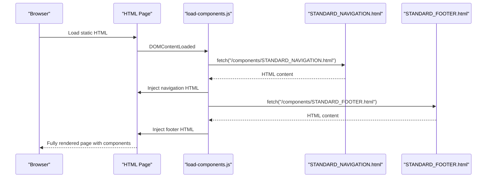
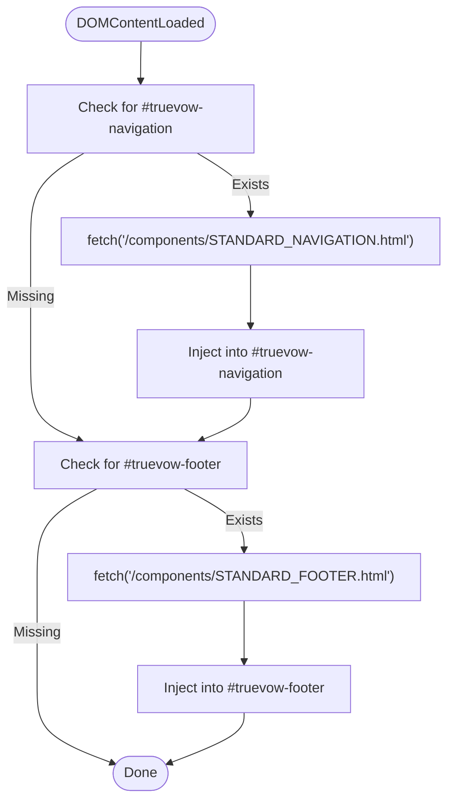
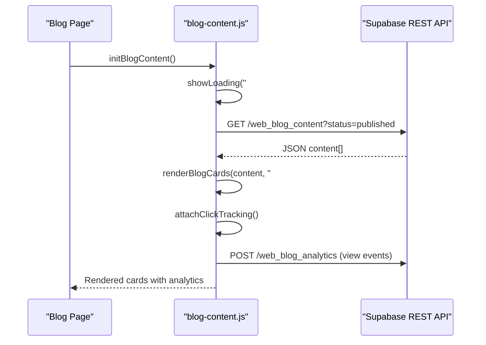
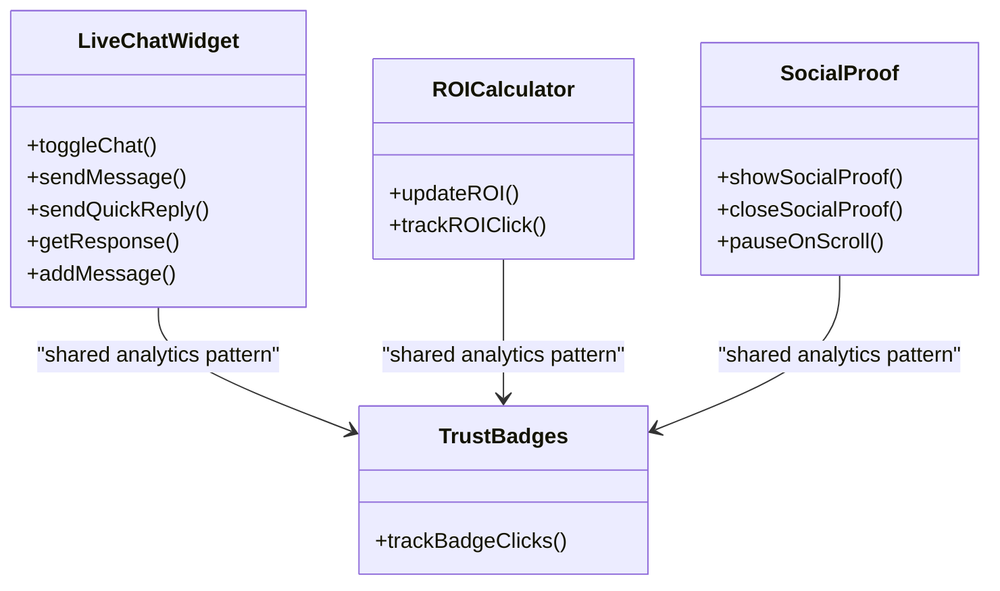
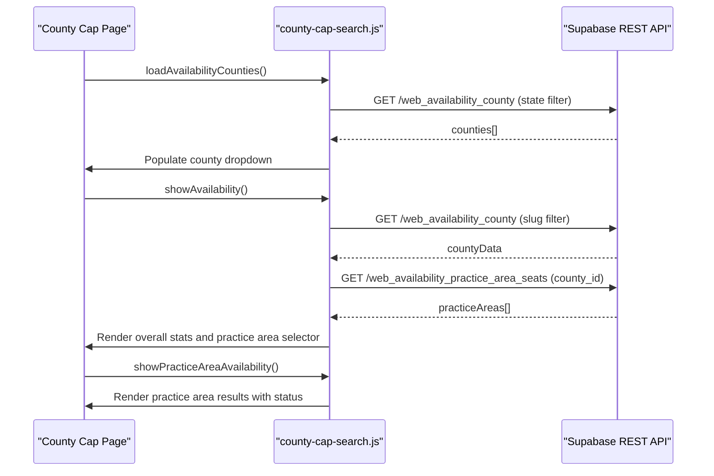
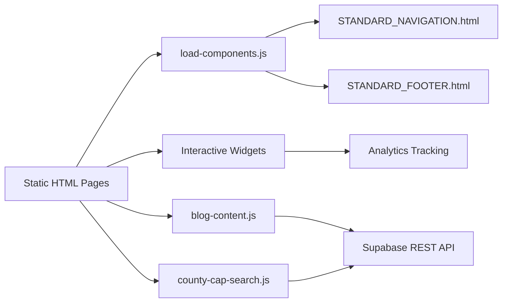

# Frontend Architecture

<cite>
**Referenced Files in This Document**
- [marketing/index.html](file://marketing/index.html)
- [js/load-components.js](file://js/load-components.js)
- [js/blog-content.js](file://js/blog-content.js)
- [components/STANDARD_NAVIGATION.html](file://components/STANDARD_NAVIGATION.html)
- [components/STANDARD_FOOTER.html](file://components/STANDARD_FOOTER.html)
- [marketing/blog.html](file://marketing/blog.html)
- [legal/privacy.html](file://legal/privacy.html)
- [marketing/js/county-cap-search.js](file://marketing/js/county-cap-search.js)
- [components/live-chat-widget.html](file://components/live-chat-widget.html)
- [components/roi-calculator.html](file://components/roi-calculator.html)
- [components/trust-badges.html](file://components/trust-badges.html)
- [components/social-proof-notifications.html](file://components/social-proof-notifications.html)
</cite>

## Table of Contents
1. [Introduction](#introduction)
2. [Project Structure](#project-structure)
3. [Core Components](#core-components)
4. [Architecture Overview](#architecture-overview)
5. [Detailed Component Analysis](#detailed-component-analysis)
6. [Dependency Analysis](#dependency-analysis)
7. [Performance Considerations](#performance-considerations)
8. [Troubleshooting Guide](#troubleshooting-guide)
9. [Conclusion](#conclusion)

## Introduction
This document explains the frontend architecture for the TrueVow website, focusing on the static HTML foundation and JavaScript integration. The site uses a pure HTML/CSS/JavaScript approach without build tools, emphasizing:
- Separation of concerns across marketing pages, legal documents, and reusable components
- Component-based architecture with standardized navigation, footer, and interactive widgets
- A dynamic blog content engine powered by Supabase
- Mobile-first responsive design and zero-knowledge architecture considerations
- Practical examples of component usage, event handling patterns, and cross-browser compatibility strategies
- Performance optimization techniques for static hosting and CDN delivery

## Project Structure
The frontend is organized into three primary areas:
- Marketing pages: Landing pages, product pages, and content hubs (e.g., blog)
- Legal documents: Privacy policy, terms, MSA, and compliance pages
- Components: Reusable UI blocks (navigation, footer, chat widget, ROI calculator, trust badges, social proof)

```mermaid
graph TB
subgraph "Static Pages"
MIndex["marketing/index.html"]
MBlog["marketing/blog.html"]
MPricing["marketing/pricing.html"]
MHowItWorks["marketing/how-it-works.html"]
LegalPrivacy["legal/privacy.html"]
end
subgraph "Reusable Components"
Nav["components/STANDARD_NAVIGATION.html"]
Footer["components/STANDARD_FOOTER.html"]
ChatWidget["components/live-chat-widget.html"]
ROICalc["components/roi-calculator.html"]
TrustBadges["components/trust-badges.html"]
SocialProof["components/social-proof-notifications.html"]
end
subgraph "JavaScript Layer"
LoadComponents["js/load-components.js"]
BlogEngine["js/blog-content.js"]
CountySearch["marketing/js/county-cap-search.js"]
end
MIndex --> Nav
MIndex --> Footer
MBlog --> Nav
MBlog --> Footer
MPricing --> Nav
MPricing --> Footer
MHowItWorks --> Nav
MHowItWorks --> Footer
LegalPrivacy --> Nav
LegalPrivacy --> Footer
MIndex --> LoadComponents
MBlog --> BlogEngine
MPricing --> ROICalc
MIndex --> ChatWidget
MIndex --> TrustBadges
MIndex --> SocialProof
MIndex --> CountySearch
```

**Diagram sources**
- [marketing/index.html](file://marketing/index.html#L1-L324)
- [marketing/blog.html](file://marketing/blog.html#L1-L200)
- [components/STANDARD_NAVIGATION.html](file://components/STANDARD_NAVIGATION.html#L1-L25)
- [components/STANDARD_FOOTER.html](file://components/STANDARD_FOOTER.html#L1-L61)
- [js/load-components.js](file://js/load-components.js#L1-L58)
- [js/blog-content.js](file://js/blog-content.js#L1-L424)
- [marketing/js/county-cap-search.js](file://marketing/js/county-cap-search.js#L1-L520)
- [components/live-chat-widget.html](file://components/live-chat-widget.html#L1-L515)
- [components/roi-calculator.html](file://components/roi-calculator.html#L1-L488)
- [components/trust-badges.html](file://components/trust-badges.html#L1-L240)
- [components/social-proof-notifications.html](file://components/social-proof-notifications.html#L1-L209)

**Section sources**
- [marketing/index.html](file://marketing/index.html#L1-L324)
- [components/STANDARD_NAVIGATION.html](file://components/STANDARD_NAVIGATION.html#L1-L25)
- [components/STANDARD_FOOTER.html](file://components/STANDARD_FOOTER.html#L1-L61)
- [js/load-components.js](file://js/load-components.js#L1-L58)

## Core Components
The frontend relies on lightweight, self-contained components and minimal JavaScript for interactivity. Key elements:
- Standardized navigation and footer: Embedded via a loader that fetches and injects component HTML at runtime
- Interactive widgets: Live chat, ROI calculator, trust badges, and social proof notifications
- Dynamic blog hub: Fetches and renders content from Supabase with analytics tracking
- County availability search: Fetches real-time seat availability and practice area details

Practical usage examples:
- Embedding components: Place placeholders with IDs (e.g., truevow-navigation, truevow-footer) and initialize the loader
- Event handling: Attach listeners to forms and interactive elements; use utility functions for validation and normalization
- Cross-browser compatibility: Avoid modern APIs without polyfills; use vanilla JS and CSS Grid/Flexbox with fallbacks

**Section sources**
- [js/load-components.js](file://js/load-components.js#L1-L58)
- [components/STANDARD_NAVIGATION.html](file://components/STANDARD_NAVIGATION.html#L1-L25)
- [components/STANDARD_FOOTER.html](file://components/STANDARD_FOOTER.html#L1-L61)
- [components/live-chat-widget.html](file://components/live-chat-widget.html#L1-L515)
- [components/roi-calculator.html](file://components/roi-calculator.html#L1-L488)
- [components/trust-badges.html](file://components/trust-badges.html#L1-L240)
- [components/social-proof-notifications.html](file://components/social-proof-notifications.html#L1-L209)
- [js/blog-content.js](file://js/blog-content.js#L1-L424)
- [marketing/js/county-cap-search.js](file://marketing/js/county-cap-search.js#L1-L520)

## Architecture Overview
The architecture follows a static-first, component-driven model with minimal runtime dependencies:
- Static HTML pages serve as entry points
- Component loader injects shared navigation and footer
- Widgets are embedded directly into pages for targeted interactivity
- Supabase powers dynamic content and analytics for the blog hub
- Mobile-first CSS ensures responsive behavior across devices

**Diagram sources**
- [js/load-components.js](file://js/load-components.js#L1-L58)
- [components/STANDARD_NAVIGATION.html](file://components/STANDARD_NAVIGATION.html#L1-L25)
- [components/STANDARD_FOOTER.html](file://components/STANDARD_FOOTER.html#L1-L61)

**Section sources**
- [marketing/index.html](file://marketing/index.html#L1-L324)
- [js/load-components.js](file://js/load-components.js#L1-L58)

## Detailed Component Analysis

### Component Loader
The loader initializes on DOM ready, conditionally loading navigation and footer components if placeholders exist. It uses fetch to retrieve component HTML and injects it into the page.

**Diagram sources**
- [js/load-components.js](file://js/load-components.js#L1-L58)

**Section sources**
- [js/load-components.js](file://js/load-components.js#L1-L58)
- [components/STANDARD_NAVIGATION.html](file://components/STANDARD_NAVIGATION.html#L1-L25)
- [components/STANDARD_FOOTER.html](file://components/STANDARD_FOOTER.html#L1-L61)

### Blog Content Engine
The blog hub dynamically fetches published content from Supabase, renders cards with type-specific badges and thumbnails, and tracks analytics for views and clicks. It supports filtering and responsive layouts.

**Diagram sources**
- [js/blog-content.js](file://js/blog-content.js#L1-L424)
- [marketing/blog.html](file://marketing/blog.html#L1-L200)

**Section sources**
- [js/blog-content.js](file://js/blog-content.js#L1-L424)
- [marketing/blog.html](file://marketing/blog.html#L1-L200)

### Interactive Widgets
- Live Chat Widget: Floating chat with simulated agent responses, quick replies, and analytics tracking
- ROI Calculator: Interactive sliders that compute potential gains and display results with animated breakdowns
- Trust Badges: Grid of verified badges with hover effects and click analytics
- Social Proof Notifications: Animated real-time alerts with dismissal and scroll pause behavior

**Diagram sources**
- [components/live-chat-widget.html](file://components/live-chat-widget.html#L1-L515)
- [components/roi-calculator.html](file://components/roi-calculator.html#L1-L488)
- [components/trust-badges.html](file://components/trust-badges.html#L1-L240)
- [components/social-proof-notifications.html](file://components/social-proof-notifications.html#L1-L209)

**Section sources**
- [components/live-chat-widget.html](file://components/live-chat-widget.html#L1-L515)
- [components/roi-calculator.html](file://components/roi-calculator.html#L1-L488)
- [components/trust-badges.html](file://components/trust-badges.html#L1-L240)
- [components/social-proof-notifications.html](file://components/social-proof-notifications.html#L1-L209)

### County Availability Search
The county cap search integrates with Supabase to fetch state/counties, practice area seats, and availability. It supports dynamic dropdown population and practice area-specific results with status indicators.

**Diagram sources**
- [marketing/js/county-cap-search.js](file://marketing/js/county-cap-search.js#L1-L520)

**Section sources**
- [marketing/js/county-cap-search.js](file://marketing/js/county-cap-search.js#L1-L520)

### Legal Documents and Zero-Knowledge Considerations
Legal pages (e.g., Privacy Policy) embed the standardized navigation and follow a consistent layout. The zero-knowledge architecture is emphasized through explicit statements and compliance badges across the site, reinforcing trust and regulatory adherence.

**Section sources**
- [legal/privacy.html](file://legal/privacy.html#L1-L200)
- [components/STANDARD_NAVIGATION.html](file://components/STANDARD_NAVIGATION.html#L1-L25)

## Dependency Analysis
The frontend maintains loose coupling among components and pages:
- Pages depend on the component loader for navigation/footer injection
- Widgets are self-contained and optionally embedded
- Blog engine depends on Supabase for content and analytics
- County search depends on Supabase for availability data

**Diagram sources**
- [js/load-components.js](file://js/load-components.js#L1-L58)
- [js/blog-content.js](file://js/blog-content.js#L1-L424)
- [marketing/js/county-cap-search.js](file://marketing/js/county-cap-search.js#L1-L520)
- [components/STANDARD_NAVIGATION.html](file://components/STANDARD_NAVIGATION.html#L1-L25)
- [components/STANDARD_FOOTER.html](file://components/STANDARD_FOOTER.html#L1-L61)

**Section sources**
- [js/load-components.js](file://js/load-components.js#L1-L58)
- [js/blog-content.js](file://js/blog-content.js#L1-L424)
- [marketing/js/county-cap-search.js](file://marketing/js/county-cap-search.js#L1-L520)

## Performance Considerations
Optimization strategies for static hosting and CDN delivery:
- Inline critical CSS and defer non-critical styles to reduce render-blocking resources
- Use CSS Grid and Flexbox with fallbacks for older browsers
- Minimize JavaScript payload by keeping components modular and loaded only when needed
- Leverage browser caching with appropriate cache headers for static assets
- Serve images via CDN with compression and responsive sizing
- Lazy-load heavy widgets (e.g., chat, social proof) until user interaction or near viewport
- Use efficient Supabase queries with selective columns and limits for the blog hub

[No sources needed since this section provides general guidance]

## Troubleshooting Guide
Common issues and resolutions:
- Component injection failures: Verify placeholder IDs exist and network fetch succeeds; check console errors for 404s or CORS issues
- Blog content not rendering: Confirm Supabase URL/anon key configuration and network connectivity; inspect response status and JSON parsing errors
- Form submissions: Validate phone normalization and required field checks; ensure proper headers and content types for Supabase requests
- Analytics tracking: Confirm global analytics function availability; handle silent failures gracefully to avoid breaking the page

**Section sources**
- [js/load-components.js](file://js/load-components.js#L1-L58)
- [js/blog-content.js](file://js/blog-content.js#L1-L424)
- [marketing/index.html](file://marketing/index.html#L84-L243)

## Conclusion
The TrueVow frontend employs a clean, static-first architecture with reusable components and targeted JavaScript for interactivity. The separation of concerns across marketing, legal, and component layers enables maintainability and scalability. The blog content engine and interactive widgets demonstrate robust patterns for dynamic content and user engagement, while mobile-first design and zero-knowledge messaging reinforce trust and performance.

[No sources needed since this section summarizes without analyzing specific files]