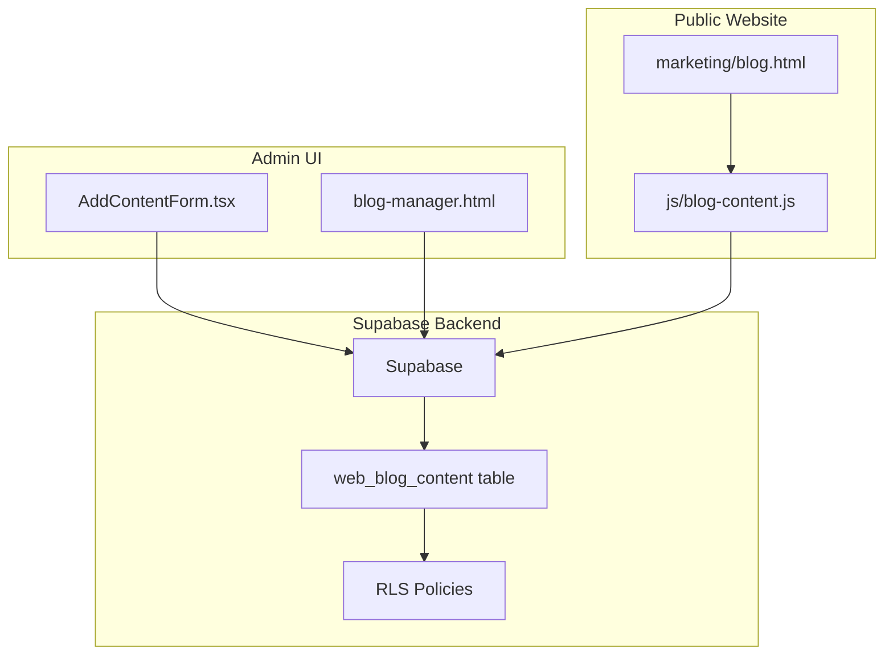
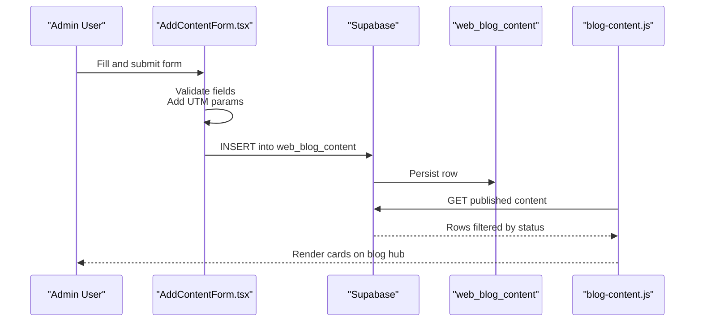
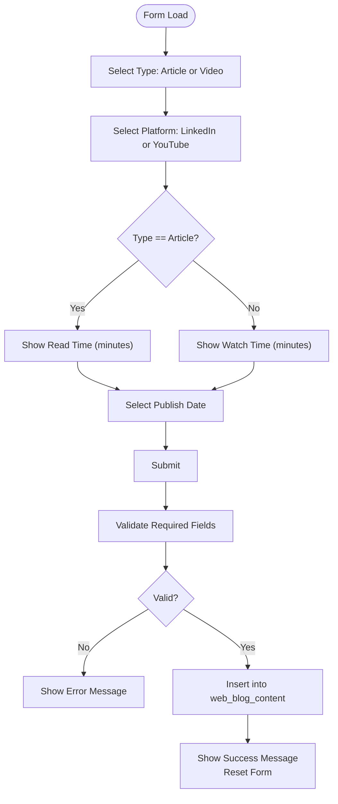
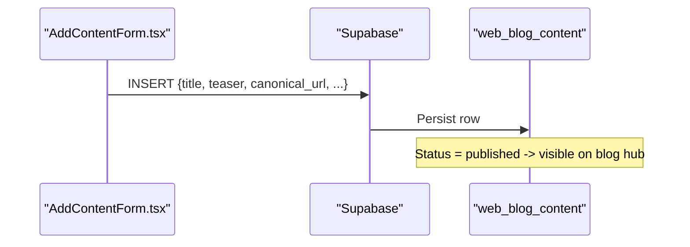
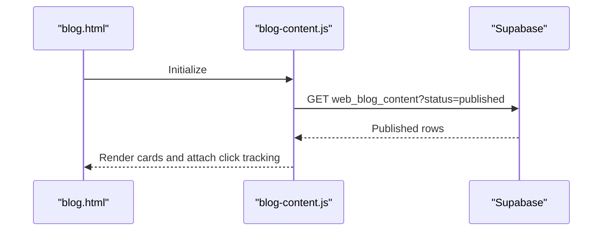
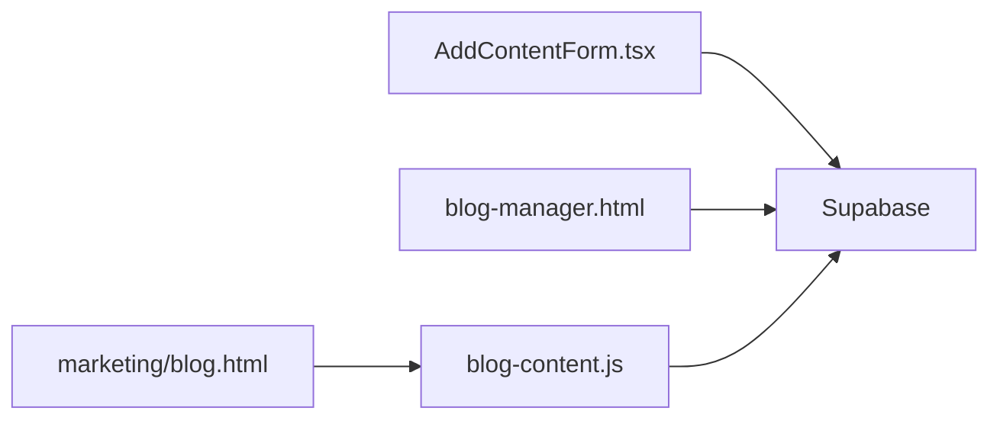

# Admin Components

<cite>
**Referenced Files in This Document**
- [AddContentForm.tsx](file://components/admin/AddContentForm.tsx)
- [AddContentForm.tsx (PRODUCTION_DEPLOY)](file://PRODUCTION_DEPLOY/components/admin/AddContentForm.tsx)
- [blog-manager.html](file://admin/blog-manager.html)
- [README.md (admin)](file://admin/README.md)
- [blog-content.js](file://js/blog-content.js)
- [blog.html](file://marketing/blog.html)
- [001_initial_blog_schema.sql](file://supabase/migrations/001_initial_blog_schema.sql)
- [rls-policies.sql](file://supabase/rls-policies.sql)
</cite>

## Table of Contents
1. [Introduction](#introduction)
2. [Project Structure](#project-structure)
3. [Core Components](#core-components)
4. [Architecture Overview](#architecture-overview)
5. [Detailed Component Analysis](#detailed-component-analysis)
6. [Dependency Analysis](#dependency-analysis)
7. [Performance Considerations](#performance-considerations)
8. [Troubleshooting Guide](#troubleshooting-guide)
9. [Conclusion](#conclusion)

## Introduction
This document explains the administrative components used to add and manage blog content in the TrueVow Website. It focuses on the AddContentForm.tsx React component, detailing its form structure, validation logic, state management, and integration with the Supabase backend. It also covers the broader content management system, including the blog hub rendering pipeline and security considerations for admin access.

## Project Structure
The administrative content management system spans:
- A React admin form component for adding content
- A legacy HTML admin manager for manual content directory
- A Supabase-backed blog hub that displays published content
- Supabase RLS policies securing data access

**Diagram sources**
- [AddContentForm.tsx](file://components/admin/AddContentForm.tsx#L1-L357)
- [blog-manager.html](file://admin/blog-manager.html#L1-L1876)
- [blog-content.js](file://js/blog-content.js#L1-L424)
- [blog.html](file://marketing/blog.html#L1-L554)
- [rls-policies.sql](file://supabase/rls-policies.sql#L1-L95)

**Section sources**
- [AddContentForm.tsx](file://components/admin/AddContentForm.tsx#L1-L357)
- [blog-manager.html](file://admin/blog-manager.html#L1-L1876)
- [blog-content.js](file://js/blog-content.js#L1-L424)
- [blog.html](file://marketing/blog.html#L1-L554)

## Core Components
- AddContentForm.tsx: A React client component that validates and submits content to Supabase for storage and eventual display on the blog hub.
- blog-manager.html: A legacy HTML admin interface for manual content directory management.
- blog-content.js: A client-side engine that fetches published content from Supabase and renders cards on the blog hub.
- Supabase RLS policies: Row-level security policies that restrict access to published content and analytics.

Key responsibilities:
- AddContentForm.tsx: Validates required fields, enriches canonical URLs with UTM parameters, and inserts records into the content table.
- blog-content.js: Queries published content, renders cards, and tracks analytics events.
- RLS policies: Enforce who can view published content and insert analytics.

**Section sources**
- [AddContentForm.tsx](file://components/admin/AddContentForm.tsx#L11-L141)
- [blog-manager.html](file://admin/blog-manager.html#L1-L1876)
- [blog-content.js](file://js/blog-content.js#L26-L102)
- [rls-policies.sql](file://supabase/rls-policies.sql#L8-L35)

## Architecture Overview
The admin workflow integrates a React form and an HTML manager to write content into Supabase. The public blog hub reads published content via REST and renders cards dynamically.

**Diagram sources**
- [AddContentForm.tsx](file://components/admin/AddContentForm.tsx#L63-L141)
- [blog-content.js](file://js/blog-content.js#L26-L64)

## Detailed Component Analysis

### AddContentForm.tsx
- Purpose: Admin React component to add articles and videos to the blog hub.
- Client directive: Uses the client directive to enable client-side interactivity.
- Props:
  - onSuccess: Optional callback invoked after successful submission.
  - onCancel: Optional callback invoked when cancel is pressed.
- State:
  - formData: Tracks form inputs including title, teaser, canonical URL, publish date, thumbnail URL, type, platform, read/watch time, featured flag, and status.
  - isSubmitting: Prevents duplicate submissions.
  - submitMessage: Displays success/error messages.
- Validation:
  - Ensures title, teaser, canonical URL, publish date are present.
  - Requires readTimeMinutes for articles and watchTimeMinutes for videos.
- Submission:
  - Adds UTM parameters to the canonical URL if missing.
  - Inserts a record into the Supabase table with mapped fields.
  - Resets form state and triggers onSuccess after a short delay.
- UI:
  - Responsive form with required indicators, character limits, and conditional fields based on content type.

Usage example (administrators):
- Fill the form with a LinkedIn article URL and metadata.
- Set status to published to make it appear on the blog hub.
- On success, the component resets and optionally triggers a parent refresh.

Security considerations:
- The component uses Supabase client-side initialization imported from a shared client module.
- RLS policies restrict public access to published content and analytics.

**Section sources**
- [AddContentForm.tsx](file://components/admin/AddContentForm.tsx#L11-L141)
- [AddContentForm.tsx (PRODUCTION_DEPLOY)](file://PRODUCTION_DEPLOY/components/admin/AddContentForm.tsx#L11-L141)

#### Form Structure and Conditional Fields

**Diagram sources**
- [AddContentForm.tsx](file://components/admin/AddContentForm.tsx#L17-L141)

### Integration with Supabase Backend
- Table: web_blog_content
- Insertion: The component inserts mapped fields including title, teaser, canonical_url, publish_date, thumbnail_url, type, platform_name, read_time_minutes, watch_time_minutes, is_featured, and status.
- Retrieval: The blog hub fetches published content via REST and renders cards.

**Diagram sources**
- [AddContentForm.tsx](file://components/admin/AddContentForm.tsx#L82-L100)
- [blog-content.js](file://js/blog-content.js#L26-L64)

### Relationship with the Blog Hub
- The blog hub queries published content from Supabase and renders cards dynamically.
- Analytics tracking is performed for views and clicks.

**Diagram sources**
- [blog-content.js](file://js/blog-content.js#L26-L102)
- [blog.html](file://marketing/blog.html#L1-L554)

**Section sources**
- [blog-content.js](file://js/blog-content.js#L26-L102)
- [blog.html](file://marketing/blog.html#L1-L554)

### Legacy Admin Manager (blog-manager.html)
- Provides a manual directory interface for adding and editing content.
- Includes character counters, UTM parameter injection, and filtering.
- Uses Supabase REST API for CRUD operations.

**Section sources**
- [blog-manager.html](file://admin/blog-manager.html#L1-L1876)
- [README.md (admin)](file://admin/README.md#L1-L214)

## Dependency Analysis
- AddContentForm.tsx depends on:
  - React state hooks for form state and submission lifecycle
  - Supabase client for database operations
  - Tailwind-like CSS classes for UI
- blog-content.js depends on:
  - Supabase REST API for fetching published content
  - DOM manipulation for rendering cards
  - Analytics tracking via POST requests

**Diagram sources**
- [AddContentForm.tsx](file://components/admin/AddContentForm.tsx#L8-L9)
- [blog-manager.html](file://admin/blog-manager.html#L1-L1876)
- [blog-content.js](file://js/blog-content.js#L11-L12)

**Section sources**
- [AddContentForm.tsx](file://components/admin/AddContentForm.tsx#L8-L9)
- [blog-content.js](file://js/blog-content.js#L11-L12)

## Performance Considerations
- Minimize re-renders by consolidating state updates in the form handler.
- Defer onSuccess callbacks slightly to allow UI transitions.
- Use Supabase’s selective column retrieval to reduce payload sizes.
- Keep analytics tracking asynchronous to avoid blocking UI.

## Troubleshooting Guide
Common issues and resolutions:
- Supabase configuration errors:
  - Verify Supabase URL and anon key are correctly configured in the admin manager and blog content engine.
- Content not appearing on the blog hub:
  - Confirm status is published in the database.
  - Ensure the blog hub script is loaded and initialized.
- Character limit warnings:
  - Monitor character counters and adjust content length accordingly.
- Analytics tracking failures:
  - Analytics are best-effort; failures are logged silently to avoid breaking the page.

**Section sources**
- [README.md (admin)](file://admin/README.md#L193-L209)
- [blog-content.js](file://js/blog-content.js#L72-L102)

## Conclusion
The AddContentForm.tsx component provides a focused, client-side admin interface for adding and publishing blog content. It integrates with Supabase to persist entries and works in tandem with the blog hub rendering engine to display published content. Security is enforced via RLS policies, and the system supports both React-based and legacy HTML-based admin experiences.