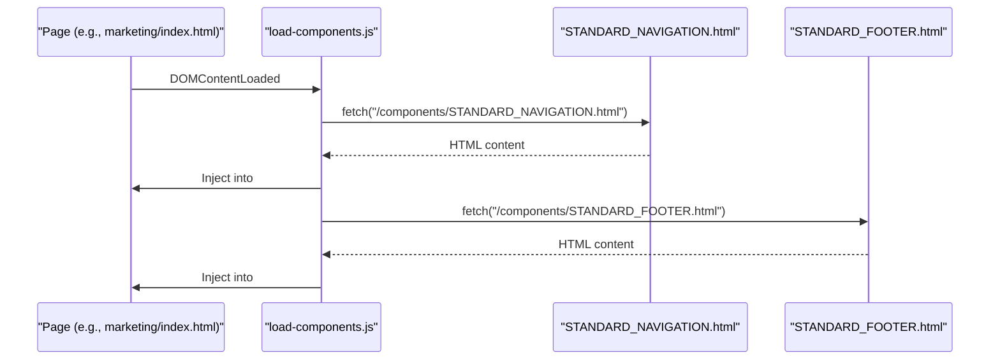
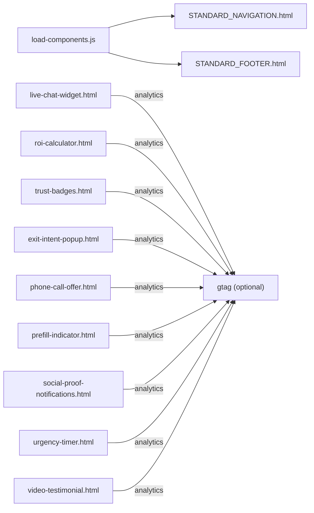

# Component Library

<cite>
**Referenced Files in This Document**
- [STANDARD_NAVIGATION.html](file://components/STANDARD_NAVIGATION.html)
- [STANDARD_FOOTER.html](file://components/STANDARD_FOOTER.html)
- [live-chat-widget.html](file://components/live-chat-widget.html)
- [roi-calculator.html](file://components/roi-calculator.html)
- [trust-badges.html](file://components/trust-badges.html)
- [exit-intent-popup.html](file://components/exit-intent-popup.html)
- [phone-call-offer.html](file://components/phone-call-offer.html)
- [prefill-indicator.html](file://components/prefill-indicator.html)
- [social-proof-notifications.html](file://components/social-proof-notifications.html)
- [urgency-timer.html](file://components/urgency-timer.html)
- [video-testimonial.html](file://components/video-testimonial.html)
- [load-components.js](file://js/load-components.js)
- [index.html](file://marketing/index.html)
</cite>

## Table of Contents
1. [Introduction](#introduction)
2. [Project Structure](#project-structure)
3. [Core Components](#core-components)
4. [Architecture Overview](#architecture-overview)
5. [Detailed Component Analysis](#detailed-component-analysis)
6. [Dependency Analysis](#dependency-analysis)
7. [Performance Considerations](#performance-considerations)
8. [Troubleshooting Guide](#troubleshooting-guide)
9. [Conclusion](#conclusion)
10. [Appendices](#appendices)

## Introduction
This document describes the TrueVow Website component library and how to embed and customize reusable HTML components across marketing pages. It covers STANDARD_NAVIGATION, STANDARD_FOOTER, live-chat-widget, roi-calculator, trust-badges, plus additional interactive elements such as exit-intent-popup, phone-call-offer, prefill-indicator, social-proof-notifications, urgency-timer, and video-testimonial. For each component, you will find visual appearance, behavior, user interaction patterns, customization options, and integration guidance. The guide also includes responsive design, accessibility, cross-browser compatibility, performance optimization, and composition patterns.

## Project Structure
The component library is organized as standalone HTML files under the components directory. Pages embed these components via a lightweight loader that fetches and injects component HTML into placeholder elements. Marketing pages include the loader script and place markers where navigation and footer should appear.

```mermaid
graph TB
subgraph "Pages"
Index["marketing/index.html"]
OtherPages["Other Marketing Pages"]
end
subgraph "Loader"
Loader["js/load-components.js"]
end
subgraph "Components"
Nav["components/STANDARD_NAVIGATION.html"]
Footer["components/STANDARD_FOOTER.html"]
Chat["components/live-chat-widget.html"]
ROI["components/roi-calculator.html"]
Trust["components/trust-badges.html"]
Exit["components/exit-intent-popup.html"]
Phone["components/phone-call-offer.html"]
Prefill["components/prefill-indicator.html"]
Social["components/social-proof-notifications.html"]
Urgency["components/urgency-timer.html"]
Video["components/video-testimonial.html"]
end
Index --> Loader
OtherPages --> Loader
Loader --> Nav
Loader --> Footer
Index --> Chat
Index --> ROI
Index --> Trust
Index --> Exit
Index --> Phone
Index --> Prefill
Index --> Social
Index --> Urgency
Index --> Video
```

**Diagram sources**
- [load-components.js](file://js/load-components.js#L36-L48)
- [STANDARD_NAVIGATION.html](file://components/STANDARD_NAVIGATION.html#L1-L25)
- [STANDARD_FOOTER.html](file://components/STANDARD_FOOTER.html#L1-L61)
- [live-chat-widget.html](file://components/live-chat-widget.html#L1-L515)
- [roi-calculator.html](file://components/roi-calculator.html#L1-L488)
- [trust-badges.html](file://components/trust-badges.html#L1-L240)
- [exit-intent-popup.html](file://components/exit-intent-popup.html#L1-L252)
- [phone-call-offer.html](file://components/phone-call-offer.html#L1-L298)
- [prefill-indicator.html](file://components/prefill-indicator.html#L1-L187)
- [social-proof-notifications.html](file://components/social-proof-notifications.html#L1-L209)
- [urgency-timer.html](file://components/urgency-timer.html#L1-L163)
- [video-testimonial.html](file://components/video-testimonial.html#L1-L410)

**Section sources**
- [load-components.js](file://js/load-components.js#L1-L58)
- [index.html](file://marketing/index.html#L1-L200)

## Core Components
- STANDARD_NAVIGATION: Sticky header with logo, links, and primary CTA.
- STANDARD_FOOTER: Grid-based footer with product/resources/company links, legal links, and disclaimers.
- live-chat-widget: Floating chat with animated button, message history, typing indicators, quick replies, and input.
- roi-calculator: Interactive calculator with sliders and dynamic results.
- trust-badges: Trust badges grid with hover effects and compliance features.
- Additional interactive components: exit-intent-popup, phone-call-offer, prefill-indicator, social-proof-notifications, urgency-timer, video-testimonial.

Each component is self-contained with its own styles and scripts, enabling easy reuse across pages.

**Section sources**
- [STANDARD_NAVIGATION.html](file://components/STANDARD_NAVIGATION.html#L1-L25)
- [STANDARD_FOOTER.html](file://components/STANDARD_FOOTER.html#L1-L61)
- [live-chat-widget.html](file://components/live-chat-widget.html#L1-L515)
- [roi-calculator.html](file://components/roi-calculator.html#L1-L488)
- [trust-badges.html](file://components/trust-badges.html#L1-L240)

## Architecture Overview
The component architecture relies on a simple loader pattern:
- Pages include the loader script.
- Placeholders with specific IDs signal where navigation and footer should be injected.
- The loader fetches component HTML and injects it into the DOM.



**Diagram sources**
- [load-components.js](file://js/load-components.js#L36-L48)
- [STANDARD_NAVIGATION.html](file://components/STANDARD_NAVIGATION.html#L1-L25)
- [STANDARD_FOOTER.html](file://components/STANDARD_FOOTER.html#L1-L61)

**Section sources**
- [load-components.js](file://js/load-components.js#L1-L58)
- [index.html](file://marketing/index.html#L1-L200)

## Detailed Component Analysis

### STANDARD_NAVIGATION
- Purpose: Consistent header across pages with branding, navigation links, and CTA.
- Behavior: Sticky positioning, hover effects on links and CTA, responsive layout.
- Customization: Edit links, CTAs, and styling within the component file.
- Integration: Place a div with ID truevow-navigation and include the loader.

Usage example (placeholder):
- Insert a div with ID truevow-navigation in the page body.
- Include the loader script to fetch and render the navigation.

**Section sources**
- [STANDARD_NAVIGATION.html](file://components/STANDARD_NAVIGATION.html#L1-L25)
- [load-components.js](file://js/load-components.js#L36-L41)
- [index.html](file://marketing/index.html#L1-L200)

### STANDARD_FOOTER
- Purpose: Consistent footer with three-column links, legal links, and disclaimer.
- Behavior: Responsive grid layout, hover effects, centered alignment.
- Customization: Modify links, titles, and styling inside the component.
- Integration: Place a div with ID truevow-footer and include the loader.

Usage example (placeholder):
- Insert a div with ID truevow-footer in the page body.
- Include the loader script to fetch and render the footer.

**Section sources**
- [STANDARD_FOOTER.html](file://components/STANDARD_FOOTER.html#L1-L61)
- [load-components.js](file://js/load-components.js#L43-L47)
- [index.html](file://marketing/index.html#L1-L200)

### live-chat-widget
- Purpose: In-app live chat to improve trust and conversions.
- Behavior: Floating chat button with pulse animation and badge; chat window slides up; quick replies, typing indicators, and message history; analytics events.
- Interaction patterns:
  - Click chat button to toggle window.
  - Enter key sends messages.
  - Quick replies pre-fill input.
  - Analytics tracked on open and send.
- Customization:
  - Update greeting message, agent avatar, quick reply buttons, and responses.
  - Adjust colors, sizes, and animations via CSS.
- Integration: Add before </body> tag.

Usage example (embedding):
- Copy the entire component near the closing body tag.

**Section sources**
- [live-chat-widget.html](file://components/live-chat-widget.html#L1-L515)

### roi-calculator
- Purpose: Demonstrates potential ROI by adjusting sliders for calls, conversion rate, and case value.
- Behavior: Real-time calculation updates before/after bookings, lost revenue, and ROI multiple; analytics events on adjustments and CTA clicks.
- Interaction patterns:
  - Drag sliders to adjust inputs.
  - Click CTA to track conversion.
- Customization:
  - Modify assumptions (e.g., conversion rate boost).
  - Adjust colors and typography via CSS.
- Integration: Place anywhere after hero or before FAQ.

Usage example (embedding):
- Copy the entire component into the desired location.

**Section sources**
- [roi-calculator.html](file://components/roi-calculator.html#L1-L488)

### trust-badges
- Purpose: Display trust signals (SOC 2, ABA, HIPAA, State Bar) and compliance features.
- Behavior: Hover animations, verified badges, grid layout; analytics on badge clicks.
- Interaction patterns:
  - Click badge to track engagement.
- Customization:
  - Add/remove badges and features.
  - Update icons, titles, and descriptions.
- Integration: Place before final CTA or in sidebar.

Usage example (embedding):
- Copy the entire component into the desired location.

**Section sources**
- [trust-badges.html](file://components/trust-badges.html#L1-L240)

### exit-intent-popup
- Purpose: Retarget visitors exiting the page with a countdown timer and benefits list.
- Behavior: Detects mouse leave viewport or waits 30 seconds; shows overlay with animated entrance; countdown timer; analytics on show/close.
- Interaction patterns:
  - Click close or outside to dismiss.
  - Press Escape to close.
- Customization:
  - Adjust copy, seat count, and benefits.
  - Modify timing and styling.
- Integration: Add before </body> tag on targeted pages (e.g., county cap).

Usage example (embedding):
- Copy the entire component near the closing body tag.

**Section sources**
- [exit-intent-popup.html](file://components/exit-intent-popup.html#L1-L252)

### phone-call-offer
- Purpose: Promote a high-touch founder call to reduce friction and increase conversions.
- Behavior: Animated phone icon, benefit cards, testimonial, and CTA; analytics on click.
- Interaction patterns:
  - Click CTA to track conversion.
- Customization:
  - Update benefits, testimonials, and availability messaging.
- Integration: Place before FAQ or above final CTA.

Usage example (embedding):
- Copy the entire component into the desired location.

**Section sources**
- [phone-call-offer.html](file://components/phone-call-offer.html#L1-L298)

### prefill-indicator
- Purpose: Show auto-filled form fields from demo sessions to reduce drop-off.
- Behavior: Appears with animated slide-down, progress bar, and stats; integrates with demo session API.
- Interaction patterns:
  - On page load, attempts to auto-fill fields and show indicator.
- Customization:
  - Adjust copy, stats, and progress bar visuals.
- Integration: Place at top of application form (after hero).

Usage example (embedding):
- Copy the entire component into the form section.

**Section sources**
- [prefill-indicator.html](file://components/prefill-indicator.html#L1-L187)

### social-proof-notifications
- Purpose: Display real-time social proof notifications to increase urgency and trust.
- Behavior: Slides in/out with animation; cycles through sample data; pauses near bottom of page; analytics on show.
- Interaction patterns:
  - Auto-shows after delay; user can close; pauses on scroll near CTA.
- Customization:
  - Replace sample data array with live API data.
- Integration: Add before </body> tag.

Usage example (embedding):
- Copy the entire component near the closing body tag.

**Section sources**
- [social-proof-notifications.html](file://components/social-proof-notifications.html#L1-L209)

### urgency-timer
- Purpose: Create urgency around application windows with a persistent countdown.
- Behavior: Sets expiry time in localStorage; updates countdown; changes color and adds pulse when under 12 hours; analytics on show.
- Interaction patterns:
  - Countdown persists across page reloads.
- Customization:
  - Adjust duration and styling.
- Integration: Place at top of application or county cap pages.

Usage example (embedding):
- Copy the entire component into the desired location.

**Section sources**
- [urgency-timer.html](file://components/urgency-timer.html#L1-L163)

### video-testimonial
- Purpose: Showcase real attorney testimonials to build trust.
- Behavior: Grid of video cards with play buttons; modal opens YouTube videos; analytics on open/close.
- Interaction patterns:
  - Click thumbnail to open modal; click outside or close button to dismiss; Escape to close.
- Customization:
  - Replace video URLs and author info.
- Integration: Place before FAQ or after ROI calculator.

Usage example (embedding):
- Copy the entire component into the desired location.

**Section sources**
- [video-testimonial.html](file://components/video-testimonial.html#L1-L410)

## Dependency Analysis
- Component coupling:
  - STANDARD_NAVIGATION and STANDARD_FOOTER are coupled to the loader via placeholder IDs.
  - Interactive components depend on global analytics (gtag) for tracking; if unavailable, events are skipped.
- External dependencies:
  - None for components themselves; analytics and APIs are optional.
- Potential circular dependencies:
  - None observed among components.



**Diagram sources**
- [load-components.js](file://js/load-components.js#L36-L48)
- [live-chat-widget.html](file://components/live-chat-widget.html#L420-L427)
- [roi-calculator.html](file://components/roi-calculator.html#L458-L467)
- [trust-badges.html](file://components/trust-badges.html#L230-L235)
- [exit-intent-popup.html](file://components/exit-intent-popup.html#L216-L222)
- [phone-call-offer.html](file://components/phone-call-offer.html#L284-L291)
- [prefill-indicator.html](file://components/prefill-indicator.html#L166-L173)
- [social-proof-notifications.html](file://components/social-proof-notifications.html#L160-L166)
- [urgency-timer.html](file://components/urgency-timer.html#L129-L136)
- [video-testimonial.html](file://components/video-testimonial.html#L371-L378)

**Section sources**
- [load-components.js](file://js/load-components.js#L1-L58)
- [live-chat-widget.html](file://components/live-chat-widget.html#L420-L427)
- [roi-calculator.html](file://components/roi-calculator.html#L458-L467)
- [trust-badges.html](file://components/trust-badges.html#L230-L235)
- [exit-intent-popup.html](file://components/exit-intent-popup.html#L216-L222)
- [phone-call-offer.html](file://components/phone-call-offer.html#L284-L291)
- [prefill-indicator.html](file://components/prefill-indicator.html#L166-L173)
- [social-proof-notifications.html](file://components/social-proof-notifications.html#L160-L166)
- [urgency-timer.html](file://components/urgency-timer.html#L129-L136)
- [video-testimonial.html](file://components/video-testimonial.html#L371-L378)

## Performance Considerations
- Minimize DOM manipulation: Components are static HTML with minimal JS; avoid frequent reflows.
- Lazy-load heavy components: Defer non-critical components (e.g., video-testimonial) until needed.
- Optimize images and fonts: Use modern formats and preload critical fonts.
- Reduce layout shifts: Reserve space for components using aspect ratios and fixed heights where possible.
- Analytics overhead: Optional gtag calls are gated; ensure analytics is initialized early to avoid missing events.
- LocalStorage usage: Components using localStorage (e.g., urgency-timer) should handle quota errors gracefully.

## Troubleshooting Guide
- Navigation/Footer not appearing:
  - Ensure placeholder divs exist with correct IDs and the loader script runs after DOMContentLoaded.
- Chat widget not responding:
  - Verify the component is placed before </body> and that there are no JS errors preventing script execution.
- Analytics events not firing:
  - Confirm gtag is loaded; components skip tracking if unavailable.
- Social proof or urgency timer not visible:
  - Check for ad blockers disabling animations or external resources.
- Prefill indicator not showing:
  - Ensure demo session ID is present in URL and the API endpoint is reachable.

**Section sources**
- [load-components.js](file://js/load-components.js#L14-L31)
- [live-chat-widget.html](file://components/live-chat-widget.html#L420-L427)
- [social-proof-notifications.html](file://components/social-proof-notifications.html#L184-L194)
- [urgency-timer.html](file://components/urgency-timer.html#L129-L136)
- [prefill-indicator.html](file://components/prefill-indicator.html#L117-L179)

## Conclusion
The TrueVow component library provides a scalable, consistent set of interactive UI elements designed for marketing pages. Components are self-contained, customizable, and integrated via a simple loader. Following the usage patterns and best practices outlined here ensures responsive design, accessibility, cross-browser compatibility, and strong performance across the website.

## Appendices

### Usage Examples (Embedding Components)
- STANDARD_NAVIGATION and STANDARD_FOOTER:
  - Insert placeholders with IDs truevow-navigation and truevow-footer.
  - Include the loader script to fetch and render components.
  - Reference: [index.html](file://marketing/index.html#L1-L200), [load-components.js](file://js/load-components.js#L36-L48)

- live-chat-widget:
  - Place before </body> tag.
  - Reference: [live-chat-widget.html](file://components/live-chat-widget.html#L1-L515)

- roi-calculator:
  - Place after hero or before FAQ.
  - Reference: [roi-calculator.html](file://components/roi-calculator.html#L1-L488)

- trust-badges:
  - Place before final CTA or in sidebar.
  - Reference: [trust-badges.html](file://components/trust-badges.html#L1-L240)

- exit-intent-popup:
  - Place before </body> on targeted pages.
  - Reference: [exit-intent-popup.html](file://components/exit-intent-popup.html#L1-L252)

- phone-call-offer:
  - Place before FAQ or above final CTA.
  - Reference: [phone-call-offer.html](file://components/phone-call-offer.html#L1-L298)

- prefill-indicator:
  - Place at top of application form (after hero).
  - Reference: [prefill-indicator.html](file://components/prefill-indicator.html#L1-L187)

- social-proof-notifications:
  - Place before </body>.
  - Reference: [social-proof-notifications.html](file://components/social-proof-notifications.html#L1-L209)

- urgency-timer:
  - Place at top of application or county cap pages.
  - Reference: [urgency-timer.html](file://components/urgency-timer.html#L1-L163)

- video-testimonial:
  - Place before FAQ or after ROI calculator.
  - Reference: [video-testimonial.html](file://components/video-testimonial.html#L1-L410)

### Accessibility and Cross-Browser Compatibility
- Accessibility:
  - Ensure sufficient color contrast for text and backgrounds.
  - Use semantic HTML and ARIA attributes where appropriate.
  - Provide keyboard navigation for modals and interactive elements.
- Cross-browser:
  - Test on latest Chrome, Firefox, Safari, Edge.
  - Use vendor prefixes for CSS where necessary.
  - Validate JavaScript polyfills for older browsers if needed.

### Composition Patterns
- Layer components vertically to guide user attention (e.g., trust badges above CTA).
- Pair urgency elements with social proof to reinforce scarcity and trust.
- Use video testimonials after ROI calculations to convert insights into emotion.
- Place prefill indicators early in forms to reduce cognitive load.