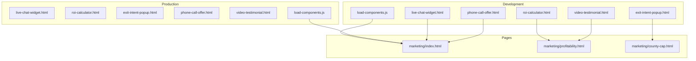
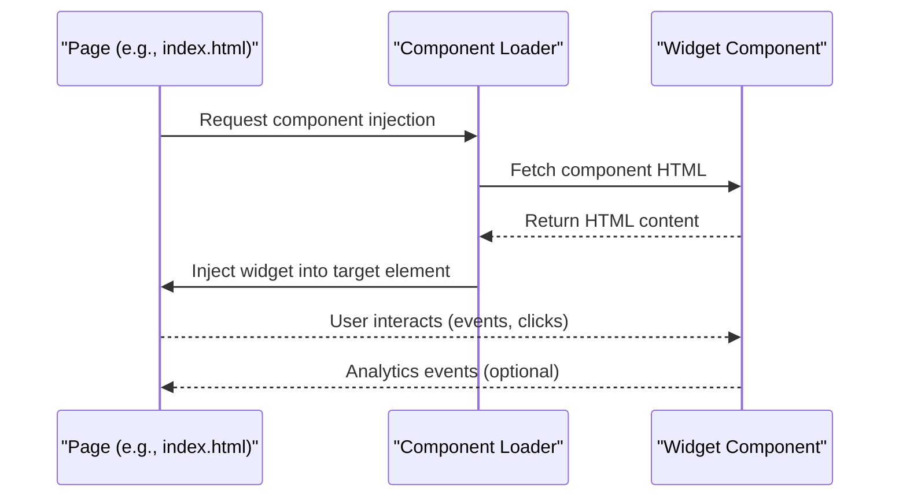
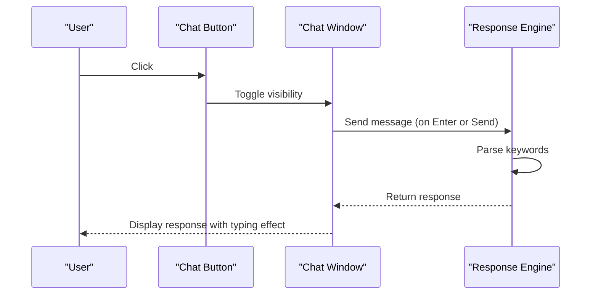
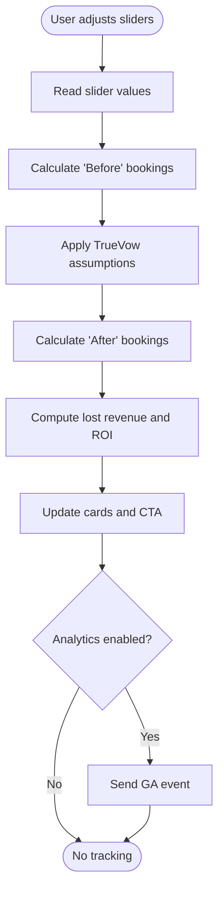
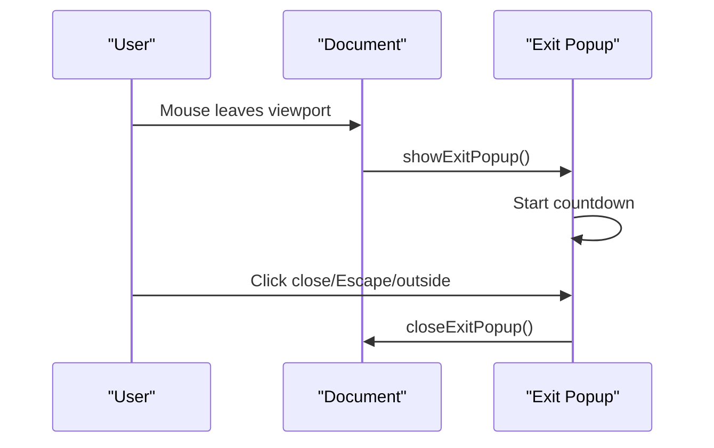
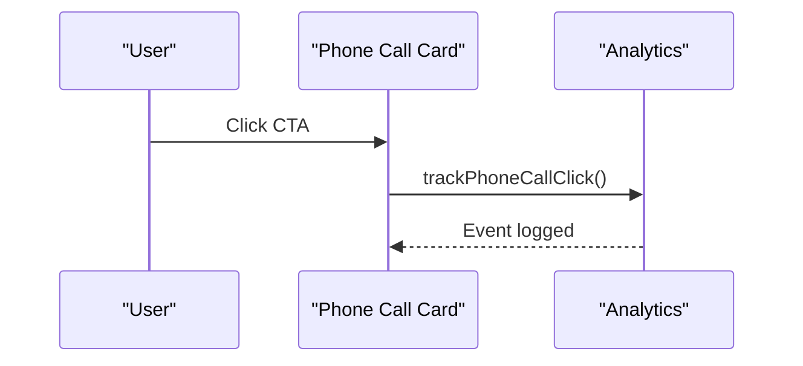
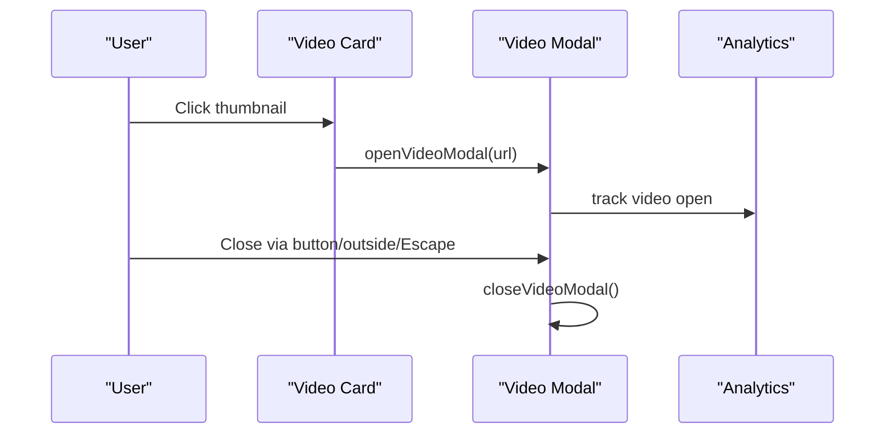
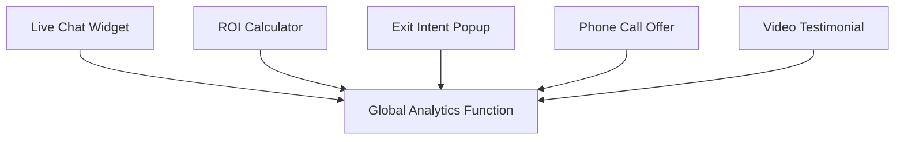

# Interactive Widgets

<cite>
**Referenced Files in This Document**
- [live-chat-widget.html](file://components/live-chat-widget.html)
- [roi-calculator.html](file://components/roi-calculator.html)
- [exit-intent-popup.html](file://components/exit-intent-popup.html)
- [phone-call-offer.html](file://components/phone-call-offer.html)
- [video-testimonial.html](file://components/video-testimonial.html)
- [load-components.js](file://js/load-components.js)
- [load-components.js](file://PRODUCTION_DEPLOY/js/load-components.js)
- [index.html](file://marketing/index.html)
- [profitability.html](file://marketing/profitability.html)
- [county-cap.html](file://marketing/county-cap.html)
</cite>

## Table of Contents
1. [Introduction](#introduction)
2. [Project Structure](#project-structure)
3. [Core Components](#core-components)
4. [Architecture Overview](#architecture-overview)
5. [Detailed Component Analysis](#detailed-component-analysis)
6. [Dependency Analysis](#dependency-analysis)
7. [Performance Considerations](#performance-considerations)
8. [Troubleshooting Guide](#troubleshooting-guide)
9. [Conclusion](#conclusion)

## Introduction
This document provides comprehensive documentation for the interactive widgets used throughout the TrueVow Website. It covers five key interactive components: live-chat-widget, roi-calculator, exit-intent-popup, phone-call-offer, and video-testimonial. For each component, we explain trigger mechanisms, styling, integration patterns, implementation examples, customization options, and performance considerations. The goal is to enable developers and marketers to effectively deploy, customize, and optimize these widgets for improved user engagement and conversion.

## Project Structure
The interactive widgets are implemented as standalone HTML components with embedded CSS and JavaScript. They are designed to be inserted into existing pages via manual placement or via a lightweight component loader. The production deployment mirrors the development structure, ensuring consistent behavior across environments.

**Diagram sources**
- [load-components.js](file://js/load-components.js#L1-L58)
- [load-components.js](file://PRODUCTION_DEPLOY/js/load-components.js#L1-L58)
- [live-chat-widget.html](file://components/live-chat-widget.html#L1-L515)
- [roi-calculator.html](file://components/roi-calculator.html#L1-L488)
- [exit-intent-popup.html](file://components/exit-intent-popup.html#L1-L252)
- [phone-call-offer.html](file://components/phone-call-offer.html#L1-L298)
- [video-testimonial.html](file://components/video-testimonial.html#L1-L410)
- [index.html](file://marketing/index.html#L1-L200)
- [profitability.html](file://marketing/profitability.html#L1-L200)
- [county-cap.html](file://marketing/county-cap.html#L1-L200)

**Section sources**
- [load-components.js](file://js/load-components.js#L1-L58)
- [load-components.js](file://PRODUCTION_DEPLOY/js/load-components.js#L1-L58)

## Core Components
This section summarizes the purpose, key features, and integration points for each widget.

- Live Chat Widget: Provides an embeddable floating chat interface with predefined responses, animated triggers, and analytics tracking.
- ROI Calculator: Interactive financial model that estimates lost revenue without TrueVow and demonstrates potential gains with TrueVow.
- Exit Intent Popup: Engagement tool triggered when users attempt to leave the page, displaying urgency messaging and countdown timers.
- Phone Call Offer: Prominent conversion component offering a free 15-minute founder call with trust-building testimonials.
- Video Testimonial: Media-rich showcase of real attorney testimonials with modal playback and analytics tracking.

**Section sources**
- [live-chat-widget.html](file://components/live-chat-widget.html#L1-L515)
- [roi-calculator.html](file://components/roi-calculator.html#L1-L488)
- [exit-intent-popup.html](file://components/exit-intent-popup.html#L1-L252)
- [phone-call-offer.html](file://components/phone-call-offer.html#L1-L298)
- [video-testimonial.html](file://components/video-testimonial.html#L1-L410)

## Architecture Overview
The widgets are self-contained units that rely on minimal external dependencies. They integrate with the main website through:
- Manual insertion: Place the component HTML directly into target pages.
- Component loader: Use the shared loader to dynamically inject navigation and footer placeholders; similar patterns can be adapted for widgets.

**Diagram sources**
- [load-components.js](file://js/load-components.js#L14-L31)
- [index.html](file://marketing/index.html#L1-L200)

**Section sources**
- [load-components.js](file://js/load-components.js#L14-L31)
- [load-components.js](file://PRODUCTION_DEPLOY/js/load-components.js#L14-L31)

## Detailed Component Analysis

### Live Chat Widget
Purpose: Deliver instant answers and build trust through a live chat interface. Includes predefined responses, animated triggers, and analytics.

Key Features:
- Floating chat button with pulsing animation and badge notification.
- Slide-up chat window with header, message history, typing indicators, quick replies, and input area.
- Keyword-based response engine with simulated typing delay.
- Analytics integration via global tracking function.

Integration Patterns:
- Place before the closing body tag for proper positioning and event binding.
- Ensure the global analytics function exists to avoid runtime errors.

Implementation Examples:
- Insert the entire component HTML into the desired page location.
- Customize avatar, agent name, and initial greeting by editing the HTML template.

Styling and Customization:
- Modify colors, sizes, and animations via the embedded CSS.
- Adjust quick reply buttons and initial message content to reflect brand tone.

Analytics Tracking:
- Tracks chat window open and message send events.

**Diagram sources**
- [live-chat-widget.html](file://components/live-chat-widget.html#L410-L470)

**Section sources**
- [live-chat-widget.html](file://components/live-chat-widget.html#L1-L515)

### ROI Calculator
Purpose: Demonstrate the financial impact of TrueVow by allowing users to adjust sliders and instantly see projected gains.

Key Features:
- Three adjustable sliders: Monthly Inbound Calls, Current Conversion Rate, Average Case Value.
- Real-time calculations for bookings before and after TrueVow adoption.
- Impact visualization with lost revenue projection and ROI multiplier.
- Conversion-focused CTA with analytics tracking.

Integration Patterns:
- Place after the hero section or before FAQ for optimal conversion flow.
- Ensure the page includes the global analytics function for tracking.

Implementation Examples:
- Copy the component HTML into the target page.
- Position near high-traffic sections like pricing or profitability pages.

Styling and Customization:
- Adjust colors, typography, and layout via the embedded CSS.
- Modify assumptions (e.g., conversion rate boost) by updating the calculation logic.

Analytics Tracking:
- Tracks slider adjustments and CTA clicks with contextual parameters.

**Diagram sources**
- [roi-calculator.html](file://components/roi-calculator.html#L419-L468)

**Section sources**
- [roi-calculator.html](file://components/roi-calculator.html#L1-L488)

### Exit Intent Popup
Purpose: Capture leads by displaying an urgency-driven popup when users attempt to exit the page or after a time delay.

Key Features:
- Overlay with centered popup containing benefits, countdown timer, and CTA.
- Exit intent detection via mouseleave event and backup timer.
- Close controls via button, outside click, and Escape key.
- Analytics integration for popup visibility and dismissal.

Integration Patterns:
- Place before the closing body tag on high-value pages (e.g., county capacity).
- Ensure the global analytics function exists to avoid runtime errors.

Implementation Examples:
- Insert the component HTML into the county-cap page.
- Customize copy and benefits to match current promotions.

Styling and Customization:
- Modify colors, typography, and layout via the embedded CSS.
- Adjust countdown duration and trigger timing as needed.

Analytics Tracking:
- Tracks popup shown and closed events.

**Diagram sources**
- [exit-intent-popup.html](file://components/exit-intent-popup.html#L184-L250)

**Section sources**
- [exit-intent-popup.html](file://components/exit-intent-popup.html#L1-L252)

### Phone Call Offer
Purpose: Enhance conversion by offering a free 15-minute founder call with trust-building elements.

Key Features:
- Prominent headline and subtitle explaining the call’s value.
- Benefit cards highlighting assessment, capacity clarity, and custom ROI analysis.
- Prominent CTA linking to scheduling platform.
- Trust section with testimonial carousel.
- Analytics tracking for CTA clicks.

Integration Patterns:
- Place before the FAQ section or above the final CTA for optimal flow.
- Ensure the global analytics function exists to avoid runtime errors.

Implementation Examples:
- Insert the component HTML into the homepage or landing pages.
- Update links and testimonials to reflect current offerings.

Styling and Customization:
- Adjust colors, spacing, and layout via the embedded CSS.
- Customize benefit icons and testimonials to match brand identity.

Analytics Tracking:
- Tracks CTA clicks with conversion category and label.

**Diagram sources**
- [phone-call-offer.html](file://components/phone-call-offer.html#L283-L296)

**Section sources**
- [phone-call-offer.html](file://components/phone-call-offer.html#L1-L298)

### Video Testimonial
Purpose: Build trust through authentic attorney testimonials with modal playback.

Key Features:
- Grid of video cards with thumbnails, play buttons, overlay text, and author info.
- Modal overlay with responsive iframe for video playback.
- Statistics section highlighting key metrics.
- Close controls via button, outside click, and Escape key.
- Analytics integration for video open events.

Integration Patterns:
- Place before the FAQ section or after the ROI calculator for persuasive flow.
- Ensure the global analytics function exists to avoid runtime errors.

Implementation Examples:
- Insert the component HTML into the profitability or homepage.
- Replace video URLs with actual YouTube embed links.

Styling and Customization:
- Adjust colors, spacing, and layout via the embedded CSS.
- Customize statistics and testimonials to reflect current results.

Analytics Tracking:
- Tracks video open events with URL parameter.

**Diagram sources**
- [video-testimonial.html](file://components/video-testimonial.html#L358-L408)

**Section sources**
- [video-testimonial.html](file://components/video-testimonial.html#L1-L410)

## Dependency Analysis
The widgets are largely self-contained with minimal external dependencies:
- Global analytics function for tracking (optional).
- Standard DOM APIs for event handling and DOM manipulation.
- Responsive design via CSS media queries.

Potential Dependencies and Coupling:
- Analytics function must be present; otherwise, widget functions gracefully without tracking.
- No cross-widget communication; each widget operates independently.
- Minimal coupling to page structure; primarily relies on element IDs and classes.

**Diagram sources**
- [live-chat-widget.html](file://components/live-chat-widget.html#L420-L427)
- [roi-calculator.html](file://components/roi-calculator.html#L458-L467)
- [exit-intent-popup.html](file://components/exit-intent-popup.html#L216-L222)
- [phone-call-offer.html](file://components/phone-call-offer.html#L284-L291)
- [video-testimonial.html](file://components/video-testimonial.html#L371-L378)

**Section sources**
- [live-chat-widget.html](file://components/live-chat-widget.html#L420-L427)
- [roi-calculator.html](file://components/roi-calculator.html#L458-L467)
- [exit-intent-popup.html](file://components/exit-intent-popup.html#L216-L222)
- [phone-call-offer.html](file://components/phone-call-offer.html#L284-L291)
- [video-testimonial.html](file://components/video-testimonial.html#L371-L378)

## Performance Considerations
- Minimize DOM manipulations: Batch updates where possible (e.g., update multiple values before inserting HTML).
- Debounce analytics events: Limit event frequency to reduce tracking overhead.
- Lazy initialization: Initialize heavy components only when visible (e.g., video modal).
- Optimize CSS animations: Prefer transform and opacity for smoother animations.
- Avoid layout thrashing: Read measurements before writes and batch DOM reads/writes.
- Use passive event listeners: For scroll and resize events to improve scrolling performance.
- Image and video optimization: Ensure thumbnails and videos are optimized for fast loading.

## Troubleshooting Guide
Common Issues and Resolutions:
- Analytics function not defined: Widgets include fallback checks; ensure the analytics library is loaded or remove tracking calls.
- Styling conflicts: Override conflicting styles by scoping widget CSS or using more specific selectors.
- Event binding failures: Verify that DOM elements exist before binding events; initialize widgets after DOMContentLoaded.
- Modal overlays not appearing: Confirm z-index stacking and ensure the modal container is appended to the body.
- Slider updates not reflected: Ensure event handlers are attached to the correct elements and values are parsed correctly.

Debugging Tips:
- Use browser developer tools to inspect element IDs and classes.
- Enable console logging for widget functions to trace execution.
- Validate event listener attachments and ensure no duplicate bindings.

**Section sources**
- [live-chat-widget.html](file://components/live-chat-widget.html#L420-L427)
- [roi-calculator.html](file://components/roi-calculator.html#L458-L467)
- [exit-intent-popup.html](file://components/exit-intent-popup.html#L216-L222)
- [phone-call-offer.html](file://components/phone-call-offer.html#L284-L291)
- [video-testimonial.html](file://components/video-testimonial.html#L371-L378)

## Conclusion
The TrueVow interactive widgets are robust, self-contained components designed to enhance user engagement and drive conversions. By understanding their trigger mechanisms, styling, and integration patterns, teams can confidently deploy and customize these widgets across the website. Following the performance and troubleshooting guidance ensures reliable operation and optimal user experience.