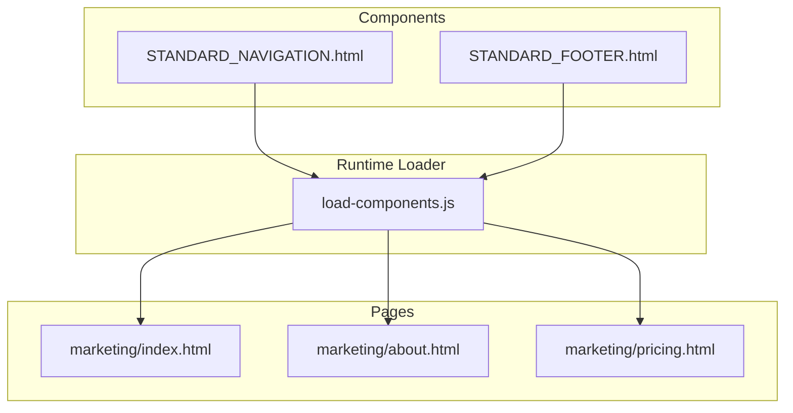
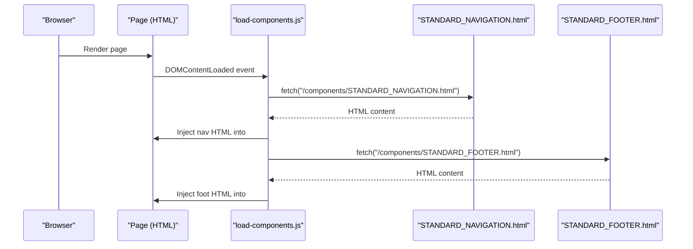
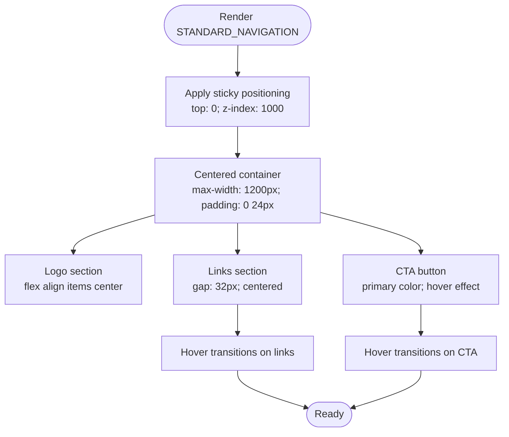
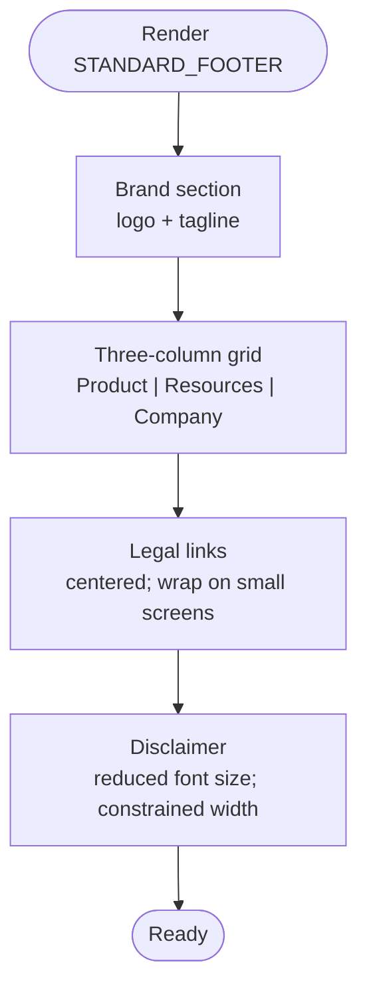
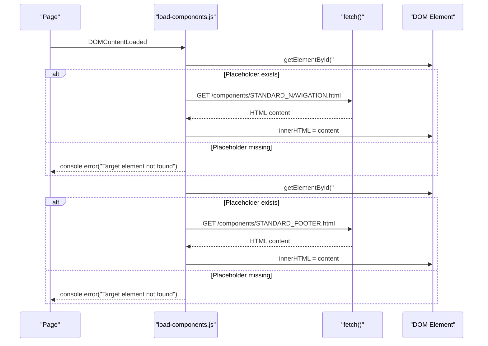
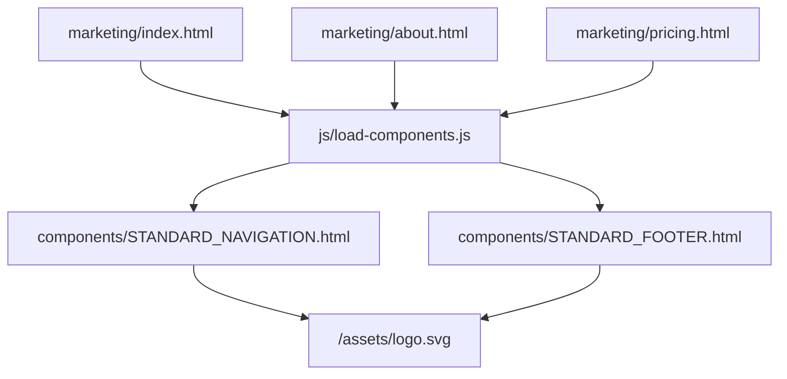

# Navigation Components

<cite>
**Referenced Files in This Document**
- [STANDARD_NAVIGATION.html](file://components/STANDARD_NAVIGATION.html)
- [STANDARD_FOOTER.html](file://components/STANDARD_FOOTER.html)
- [load-components.js](file://js/load-components.js)
- [index.html](file://marketing/index.html)
- [about.html](file://marketing/about.html)
- [pricing.html](file://marketing/pricing.html)
</cite>

## Table of Contents
1. [Introduction](#introduction)
2. [Project Structure](#project-structure)
3. [Core Components](#core-components)
4. [Architecture Overview](#architecture-overview)
5. [Detailed Component Analysis](#detailed-component-analysis)
6. [Dependency Analysis](#dependency-analysis)
7. [Performance Considerations](#performance-considerations)
8. [Troubleshooting Guide](#troubleshooting-guide)
9. [Conclusion](#conclusion)
10. [Appendices](#appendices)

## Introduction
This document provides comprehensive documentation for the navigation components used across the TrueVow Website. It focuses on two standardized components:
- STANDARD_NAVIGATION: The primary header navigation used consistently across marketing pages, including logo placement, navigation links structure, hover effects, and responsive behavior.
- STANDARD_FOOTER: The standardized footer layout, links organization, and footer content structure.

Additionally, it explains how these components are loaded into pages via the component loader, implementation details for sticky positioning and z-index management, cross-browser compatibility considerations, usage examples for embedding in marketing pages, customization options, and accessibility/mobile responsiveness patterns.

## Project Structure
The navigation components are authored as standalone HTML files and injected into marketing pages at runtime. The component loader script fetches these files and injects them into placeholders defined in each page.

**Diagram sources**
- [STANDARD_NAVIGATION.html](file://components/STANDARD_NAVIGATION.html#L1-L25)
- [STANDARD_FOOTER.html](file://components/STANDARD_FOOTER.html#L1-L61)
- [load-components.js](file://js/load-components.js#L1-L58)
- [index.html](file://marketing/index.html#L1-L324)
- [about.html](file://marketing/about.html#L1-L966)
- [pricing.html](file://marketing/pricing.html#L1-L506)

**Section sources**
- [STANDARD_NAVIGATION.html](file://components/STANDARD_NAVIGATION.html#L1-L25)
- [STANDARD_FOOTER.html](file://components/STANDARD_FOOTER.html#L1-L61)
- [load-components.js](file://js/load-components.js#L1-L58)
- [index.html](file://marketing/index.html#L1-L324)

## Core Components
This section documents the STANDARD_NAVIGATION and STANDARD_FOOTER components, including structure, styling, interactivity, and behavior.

### STANDARD_NAVIGATION
- Purpose: Provide a consistent header across all marketing pages with logo, navigation links, and a prominent call-to-action.
- Structure:
  - Outer container with sticky positioning, z-index, background, border, padding, and subtle shadow.
  - Inner container with max-width, centered horizontal layout, and vertical alignment.
  - Left section: Logo link containing an image element.
  - Center section: Navigation links aligned horizontally with spacing.
  - Right section: Primary CTA link styled as a button.
- Interactivity:
  - Hover effects on navigation links and CTA adjust color and background respectively.
- Responsive behavior:
  - The component itself uses a flex layout that adapts to viewport width.
  - Individual pages may override styles for smaller screens (see usage examples below).

Key implementation references:
- Sticky positioning and z-index: [STANDARD_NAVIGATION.html](file://components/STANDARD_NAVIGATION.html#L2-L2)
- Logo placement: [STANDARD_NAVIGATION.html](file://components/STANDARD_NAVIGATION.html#L5-L6)
- Navigation links: [STANDARD_NAVIGATION.html](file://components/STANDARD_NAVIGATION.html#L10-L16)
- CTA button: [STANDARD_NAVIGATION.html](file://components/STANDARD_NAVIGATION.html#L18-L21)
- Hover effects: [STANDARD_NAVIGATION.html](file://components/STANDARD_NAVIGATION.html#L11-L15)

**Section sources**
- [STANDARD_NAVIGATION.html](file://components/STANDARD_NAVIGATION.html#L1-L25)

### STANDARD_FOOTER
- Purpose: Provide a consistent footer across all pages with branding, value statement, three-column links, legal links, and disclaimer.
- Structure:
  - Outer container with dark background, centered text, and generous bottom padding.
  - Branding section with logo and tagline.
  - Three-column grid of links organized by categories (Product, Resources, Company).
  - Legal links with separators.
  - Disclaimer paragraph with reduced font size and constrained width.
- Interactivity:
  - Hover effects on footer links adjust color transitions.
- Responsive behavior:
  - Grid layout adapts to available width.
  - Legal links wrap on smaller screens.

Key implementation references:
- Footer container and background: [STANDARD_FOOTER.html](file://components/STANDARD_FOOTER.html#L2-L2)
- Logo and tagline: [STANDARD_FOOTER.html](file://components/STANDARD_FOOTER.html#L4-L10)
- Three-column links grid: [STANDARD_FOOTER.html](file://components/STANDARD_FOOTER.html#L12-L41)
- Legal links: [STANDARD_FOOTER.html](file://components/STANDARD_FOOTER.html#L43-L52)
- Disclaimer: [STANDARD_FOOTER.html](file://components/STANDARD_FOOTER.html#L54-L58)

**Section sources**
- [STANDARD_FOOTER.html](file://components/STANDARD_FOOTER.html#L1-L61)

## Architecture Overview
The navigation components are loaded into pages at runtime using a lightweight JavaScript loader. Pages define placeholders where the components are injected.

**Diagram sources**
- [load-components.js](file://js/load-components.js#L14-L31)
- [load-components.js](file://js/load-components.js#L36-L47)
- [STANDARD_NAVIGATION.html](file://components/STANDARD_NAVIGATION.html#L1-L25)
- [STANDARD_FOOTER.html](file://components/STANDARD_FOOTER.html#L1-L61)

**Section sources**
- [load-components.js](file://js/load-components.js#L1-L58)

## Detailed Component Analysis

### STANDARD_NAVIGATION Analysis
- Sticky positioning and z-index:
  - The navigation uses position: sticky with top: 0 and a high z-index to ensure it overlays page content when scrolling.
  - Background color and subtle shadow provide visual separation from content.
- Logo placement:
  - The logo is placed on the left side and includes an image element sized appropriately for the header.
- Navigation links:
  - Centered links are spaced horizontally and styled with hover transitions.
- CTA button:
  - Positioned on the right with prominent styling and hover effect.
- Cross-browser compatibility:
  - Uses widely supported CSS properties and inline styles; hover effects rely on onmouseover/onmouseout attributes.
- Accessibility considerations:
  - Links are focusable and keyboard navigable by default; consider adding ARIA roles or labels if needed.
- Mobile responsiveness:
  - The component uses a flex layout suitable for responsive design; individual pages may add media queries to hide/show links on small screens.

**Diagram sources**
- [STANDARD_NAVIGATION.html](file://components/STANDARD_NAVIGATION.html#L2-L21)

**Section sources**
- [STANDARD_NAVIGATION.html](file://components/STANDARD_NAVIGATION.html#L1-L25)

### STANDARD_FOOTER Analysis
- Layout:
  - Dark-themed footer with centered content and generous bottom padding.
- Links organization:
  - Three-column grid for Product, Resources, and Company sections.
- Legal links:
  - Horizontal list with separators and hover transitions.
- Disclaimer:
  - Constrained width and reduced font size for readability.
- Cross-browser compatibility:
  - Uses standard CSS grid and flexbox; hover effects rely on onmouseover/onmouseout.
- Accessibility considerations:
  - Ensure sufficient color contrast and consider adding skip links or landmarks.
- Mobile responsiveness:
  - Grid layout and wrapping legal links adapt to smaller screens.

**Diagram sources**
- [STANDARD_FOOTER.html](file://components/STANDARD_FOOTER.html#L2-L58)

**Section sources**
- [STANDARD_FOOTER.html](file://components/STANDARD_FOOTER.html#L1-L61)

### Component Loading Workflow
- Placeholder injection:
  - Pages include empty elements with IDs that match the loader’s targets.
- Runtime loading:
  - The loader checks for placeholders and fetches component HTML files.
- Error handling:
  - Logs failures to load files and missing targets to the console.

**Diagram sources**
- [load-components.js](file://js/load-components.js#L14-L31)
- [load-components.js](file://js/load-components.js#L36-L47)

**Section sources**
- [load-components.js](file://js/load-components.js#L1-L58)

## Dependency Analysis
- Component dependencies:
  - STANDARD_NAVIGATION depends on the logo asset path and internal page links.
  - STANDARD_FOOTER depends on the logo asset path and internal page links.
- Runtime dependencies:
  - load-components.js depends on the presence of placeholder elements and the availability of component files.
- Coupling:
  - Pages are loosely coupled to components via placeholders and the loader.
  - Changes to component files propagate automatically to pages that include placeholders.

**Diagram sources**
- [index.html](file://marketing/index.html#L1-L324)
- [about.html](file://marketing/about.html#L1-L966)
- [pricing.html](file://marketing/pricing.html#L1-L506)
- [load-components.js](file://js/load-components.js#L1-L58)
- [STANDARD_NAVIGATION.html](file://components/STANDARD_NAVIGATION.html#L1-L25)
- [STANDARD_FOOTER.html](file://components/STANDARD_FOOTER.html#L1-L61)

**Section sources**
- [index.html](file://marketing/index.html#L1-L324)
- [about.html](file://marketing/about.html#L1-L966)
- [pricing.html](file://marketing/pricing.html#L1-L506)
- [load-components.js](file://js/load-components.js#L1-L58)

## Performance Considerations
- Component loading:
  - The loader performs synchronous fetch calls; consider asynchronous loading to avoid blocking render.
- Asset delivery:
  - Ensure the logo asset is optimized and cached.
- Inline vs external styles:
  - Components use inline styles; consider extracting styles to CSS for better caching and maintainability.
- Scroll performance:
  - Sticky navigation relies on scroll events; ensure minimal layout thrashing by avoiding heavy computations in scroll handlers.

[No sources needed since this section provides general guidance]

## Troubleshooting Guide
- Component not appearing:
  - Verify placeholder elements exist with the expected IDs.
  - Check browser console for fetch errors indicating missing component files.
- Incorrect styling:
  - Confirm that page-specific styles do not override component styles unintentionally.
- Hover effects not working:
  - Ensure onmouseover/onmouseout attributes are present and not overridden by page styles.
- Logo not displaying:
  - Verify the logo asset path is correct and accessible.

**Section sources**
- [load-components.js](file://js/load-components.js#L14-L31)
- [load-components.js](file://js/load-components.js#L36-L47)

## Conclusion
The STANDARD_NAVIGATION and STANDARD_FOOTER components provide a consistent, reusable foundation for TrueVow’s marketing pages. Their runtime injection via the component loader simplifies maintenance and ensures uniform branding and navigation across the site. By understanding their structure, interactivity, and integration points, teams can confidently customize and extend these components while maintaining performance and accessibility standards.

[No sources needed since this section summarizes without analyzing specific files]

## Appendices

### Usage Examples: Embedding Components in Marketing Pages
To embed the standardized navigation and footer in a marketing page:
- Add a placeholder element with the ID matching the loader’s target for navigation.
- Add a placeholder element with the ID matching the loader’s target for the footer.
- Ensure the page includes the component loader script.

Example references:
- Navigation placeholder and loader usage: [index.html](file://marketing/index.html#L1-L324)
- Footer placeholder and loader usage: [index.html](file://marketing/index.html#L245-L317)

**Section sources**
- [index.html](file://marketing/index.html#L1-L324)

### Customization Options
- Colors:
  - Adjust background, border, and text colors in the component files or override via page-specific styles.
- Spacing:
  - Modify padding, margins, and gaps to fit brand guidelines.
- Typography:
  - Update font sizes, weights, and line heights to align with brand fonts and hierarchy.
- Layout:
  - Adjust max-width, container padding, and grid layouts as needed.

Implementation references:
- Navigation colors and spacing: [STANDARD_NAVIGATION.html](file://components/STANDARD_NAVIGATION.html#L2-L2)
- Footer colors and spacing: [STANDARD_FOOTER.html](file://components/STANDARD_FOOTER.html#L2-L2)
- Page-specific overrides (examples): [index.html](file://marketing/index.html#L1-L324), [about.html](file://marketing/about.html#L1-L966), [pricing.html](file://marketing/pricing.html#L1-L506)

**Section sources**
- [STANDARD_NAVIGATION.html](file://components/STANDARD_NAVIGATION.html#L1-L25)
- [STANDARD_FOOTER.html](file://components/STANDARD_FOOTER.html#L1-L61)
- [index.html](file://marketing/index.html#L1-L324)
- [about.html](file://marketing/about.html#L1-L966)
- [pricing.html](file://marketing/pricing.html#L1-L506)

### Accessibility and Mobile Responsiveness Patterns
- Accessibility:
  - Ensure links are keyboard focusable and provide meaningful text alternatives for images.
  - Consider ARIA roles and labels for complex navigation structures.
- Mobile responsiveness:
  - The components use flexible layouts; pages may add media queries to adapt navigation for small screens.
  - Example page-level responsive adjustments: [index.html](file://marketing/index.html#L1-L324), [about.html](file://marketing/about.html#L1-L966), [pricing.html](file://marketing/pricing.html#L1-L506)

**Section sources**
- [index.html](file://marketing/index.html#L1-L324)
- [about.html](file://marketing/about.html#L1-L966)
- [pricing.html](file://marketing/pricing.html#L1-L506)