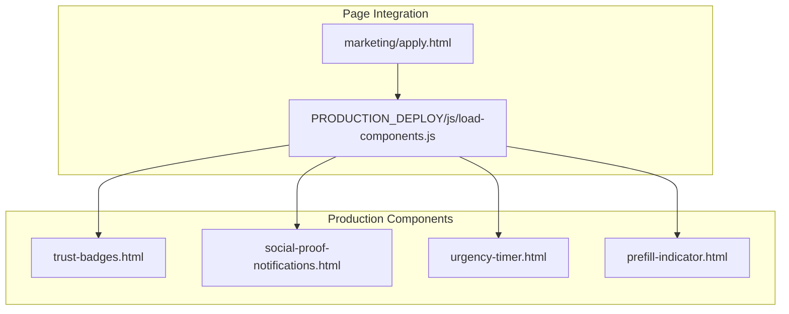
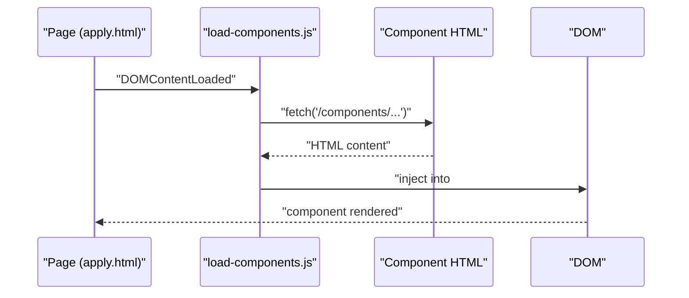
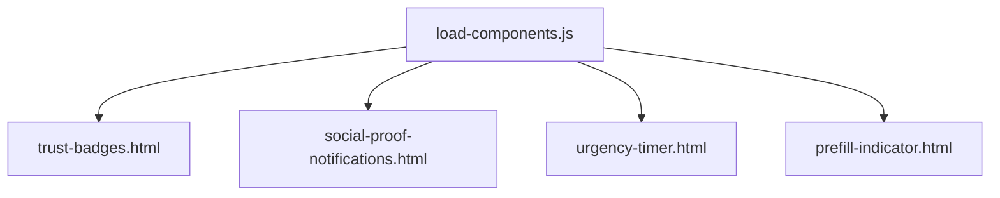

# Promotional Elements

<cite>
**Referenced Files in This Document**
- [trust-badges.html](file://PRODUCTION_DEPLOY/components/trust-badges.html)
- [social-proof-notifications.html](file://PRODUCTION_DEPLOY/components/social-proof-notifications.html)
- [urgency-timer.html](file://PRODUCTION_DEPLOY/components/urgency-timer.html)
- [prefill-indicator.html](file://PRODUCTION_DEPLOY/components/prefill-indicator.html)
- [load-components.js](file://PRODUCTION_DEPLOY/js/load-components.js)
- [apply.html](file://marketing/apply.html)
</cite>

## Table of Contents
1. [Introduction](#introduction)
2. [Project Structure](#project-structure)
3. [Core Components](#core-components)
4. [Architecture Overview](#architecture-overview)
5. [Detailed Component Analysis](#detailed-component-analysis)
6. [Dependency Analysis](#dependency-analysis)
7. [Performance Considerations](#performance-considerations)
8. [Troubleshooting Guide](#troubleshooting-guide)
9. [Conclusion](#conclusion)
10. [Appendices](#appendices)

## Introduction
This document explains the promotional and trust-building elements used on the TrueVow Website to increase conversions and reduce friction. It focuses on four interactive components:
- Trust badges: showcase certifications, compliance, and service guarantees to build credibility.
- Social proof notifications: display real-time testimonials and actions to encourage immediate action.
- Urgency timer: create time-sensitive pressure to prompt faster decisions.
- Prefill indicator: optimize forms by showing pre-filled data and reducing completion time.

Each component includes implementation details, customization options, integration patterns, and behavioral psychology insights designed to improve conversion rates.

## Project Structure
The promotional components are self-contained HTML/CSS/JavaScript modules located under PRODUCTION_DEPLOY/components. They can be embedded directly into marketing pages or loaded dynamically via the component loader.

**Diagram sources**
- [trust-badges.html](file://PRODUCTION_DEPLOY/components/trust-badges.html#L1-L240)
- [social-proof-notifications.html](file://PRODUCTION_DEPLOY/components/social-proof-notifications.html#L1-L209)
- [urgency-timer.html](file://PRODUCTION_DEPLOY/components/urgency-timer.html#L1-L163)
- [prefill-indicator.html](file://PRODUCTION_DEPLOY/components/prefill-indicator.html#L1-L187)
- [load-components.js](file://PRODUCTION_DEPLOY/js/load-components.js#L1-L58)
- [apply.html](file://marketing/apply.html#L1-L2129)

**Section sources**
- [load-components.js](file://PRODUCTION_DEPLOY/js/load-components.js#L1-L58)
- [apply.html](file://marketing/apply.html#L1-L2129)

## Core Components
This section summarizes each component’s purpose, behavior, and conversion-focused design.

- Trust badges
  - Purpose: Display verified credentials and guarantees to reduce perceived risk.
  - Behavior: Grid layout with hover effects; tracks click events for engagement.
  - Psychology: Social proof and authority cues increase trust and perceived safety.
  - Placement: Before final CTA or in sidebar.

- Social proof notifications
  - Purpose: Show recent user actions to reduce uncertainty and accelerate decision-making.
  - Behavior: Auto-rotating floating notification with close control; pauses near CTAs.
  - Psychology: Scarcity and bandwagon effect drive urgency.
  - Placement: Near bottom-left of viewport before closing.

- Urgency timer
  - Purpose: Create time pressure to prevent procrastination.
  - Behavior: Countdown with color change and expiration messaging; persists across sessions.
  - Psychology: Loss aversion and time scarcity increase conversion speed.
  - Placement: Top of application or county-cap pages.

- Prefill indicator
  - Purpose: Reduce friction by highlighting pre-filled data and estimated completion time.
  - Behavior: Auto-detects demo session and pre-fills form fields; shows progress.
  - Psychology: Reduces effort and cognitive load; leverages commitment bias.
  - Placement: Above the application form.

**Section sources**
- [trust-badges.html](file://PRODUCTION_DEPLOY/components/trust-badges.html#L1-L240)
- [social-proof-notifications.html](file://PRODUCTION_DEPLOY/components/social-proof-notifications.html#L1-L209)
- [urgency-timer.html](file://PRODUCTION_DEPLOY/components/urgency-timer.html#L1-L163)
- [prefill-indicator.html](file://PRODUCTION_DEPLOY/components/prefill-indicator.html#L1-L187)

## Architecture Overview
The components are standalone modules that can be included directly into pages or loaded via the component loader. The loader fetches component HTML and injects it into placeholders defined in the page.

**Diagram sources**
- [load-components.js](file://PRODUCTION_DEPLOY/js/load-components.js#L14-L31)
- [apply.html](file://marketing/apply.html#L1-L2129)

## Detailed Component Analysis

### Trust Badges
Trust badges communicate verifiable credentials and guarantees to reduce risk perception and increase conversions.

Key behaviors:
- Responsive grid layout with hover animations.
- Verified badges emphasize authenticity.
- Feature cards highlight privacy, payment security, uptime, and support.
- Tracks clicks for engagement measurement.

Implementation highlights:
- Uses CSS Grid for responsive badge layout.
- Hover effects and transitions improve interactivity.
- Analytics event tracking for badge interactions.

Customization options:
- Replace icons and text with your own certifications.
- Adjust colors to match brand palette.
- Add/remove features to reflect service differentiators.

Integration pattern:
- Place near hero or above final CTA.
- Keep visible during scrolling to maintain trust cues.

Psychology and conversion strategies:
- Authority and trust signals reduce objections.
- Verified badges lower perceived risk.
- Feature cards address common concerns (privacy, uptime, support).

**Section sources**
- [trust-badges.html](file://PRODUCTION_DEPLOY/components/trust-badges.html#L1-L240)

### Social Proof Notifications
Real-time notifications show recent user actions to encourage immediate engagement and reduce hesitation.

Key behaviors:
- Floating notification with slide-in/out animations.
- Rotates through a curated list of recent actions.
- Pauses when user scrolls near the bottom of the page.
- Tracks impressions for analytics.

Implementation highlights:
- CSS animations for entrance/exit timing.
- Interval scheduling with pause-on-scroll logic.
- Close button to maintain user control.

Customization options:
- Modify the sample data array to reflect your audience and actions.
- Adjust timing (delay, interval, duration).
- Change avatar initials and colors.

Integration pattern:
- Insert before the closing body tag.
- Ensure sufficient spacing from CTAs to avoid overlap.

Psychology and conversion strategies:
- Bandwagon effect: people follow others’ actions.
- Scarcity: recent activity implies limited availability.
- Urgency: encourages faster decision-making.

**Section sources**
- [social-proof-notifications.html](file://PRODUCTION_DEPLOY/components/social-proof-notifications.html#L1-L209)

### Urgency Timer
The urgency timer creates time pressure to prompt faster submissions and reduce decision latency.

Key behaviors:
- Countdown timer set to expire after a fixed duration.
- Color changes and subtle pulsing when time is low.
- Persists expiry time across browser sessions using local storage.
- Changes messaging and styling upon expiration.

Implementation highlights:
- Real-time updates every second.
- Local storage ensures continuity across page reloads.
- Dynamic styling and analytics event on initialization.

Customization options:
- Adjust expiry duration and threshold for color change.
- Modify messaging to reflect your offer lifecycle.
- Change colors and typography to match brand.

Integration pattern:
- Place prominently at the top of application or county-cap pages.
- Pair with clear benefit statements and next steps.

Psychology and conversion strategies:
- Loss aversion: fear of missing out increases action.
- Time scarcity: limited windows boost perceived value.
- Commitment: early decisions feel harder to reverse.

**Section sources**
- [urgency-timer.html](file://PRODUCTION_DEPLOY/components/urgency-timer.html#L1-L163)

### Prefill Indicator
The prefill indicator reduces friction by showing pre-filled data and estimated completion time, encouraging faster form completion.

Key behaviors:
- Detects demo session via URL parameter and loads data.
- Pre-fills relevant form fields and updates indicator stats.
- Animates into view with a slide-down effect.
- Updates hero messaging and progress visuals.

Implementation highlights:
- Fetches demo session data from an API endpoint.
- Progress bar reflects completion percentage.
- Analytics event captures prefill detection and field counts.

Customization options:
- Extend prefillable fields to match your form schema.
- Adjust estimated completion time and free offer messaging.
- Customize colors and animation timing.

Integration pattern:
- Place immediately after the hero section and above the form.
- Ensure URL parameter naming matches your demo flow.

Psychology and conversion strategies:
- Reduces effort and cognitive load.
- Leverages commitment bias: partial completion increases finishing.
- Social proof: “21 FREE bookings waiting” reinforces value.

**Section sources**
- [prefill-indicator.html](file://PRODUCTION_DEPLOY/components/prefill-indicator.html#L1-L187)

## Dependency Analysis
The components are self-contained and depend only on the presence of required DOM elements and optional analytics hooks. The loader enables dynamic injection of components into pages.

**Diagram sources**
- [load-components.js](file://PRODUCTION_DEPLOY/js/load-components.js#L1-L58)
- [trust-badges.html](file://PRODUCTION_DEPLOY/components/trust-badges.html#L1-L240)
- [social-proof-notifications.html](file://PRODUCTION_DEPLOY/components/social-proof-notifications.html#L1-L209)
- [urgency-timer.html](file://PRODUCTION_DEPLOY/components/urgency-timer.html#L1-L163)
- [prefill-indicator.html](file://PRODUCTION_DEPLOY/components/prefill-indicator.html#L1-L187)

**Section sources**
- [load-components.js](file://PRODUCTION_DEPLOY/js/load-components.js#L1-L58)

## Performance Considerations
- Lazy loading: Load social proof and urgency timer after initial page load to minimize render-blocking.
- Animation thresholds: Use media queries to disable heavy animations on lower-end devices.
- Analytics overhead: Ensure analytics calls are lightweight and debounced where appropriate.
- Storage persistence: Local storage usage is minimal; cache expiry logic avoids repeated calculations.
- Network requests: Prefill indicator relies on a single API call; cache responses when feasible.

## Troubleshooting Guide
Common issues and resolutions:
- Component not rendering
  - Verify the placeholder element exists and the loader is initialized.
  - Confirm the component file path is correct and accessible.

- Social proof not appearing
  - Check that the notification element exists and the interval is not paused by scroll proximity.
  - Ensure the page is not blocking animations or JavaScript execution.

- Urgency timer not counting down
  - Confirm the DOM element ID matches the selector and the initialization runs after DOMContentLoaded.
  - Verify local storage is enabled and not blocked by the browser.

- Prefill indicator not showing
  - Ensure the URL parameter for demo session is present and the API endpoint returns expected data.
  - Check that the targeted form fields exist and are accessible.

Analytics tracking
- If analytics events are not recorded, confirm the analytics library is loaded before component scripts.
- Validate event categories and labels align with your analytics configuration.

**Section sources**
- [social-proof-notifications.html](file://PRODUCTION_DEPLOY/components/social-proof-notifications.html#L196-L206)
- [urgency-timer.html](file://PRODUCTION_DEPLOY/components/urgency-timer.html#L155-L160)
- [prefill-indicator.html](file://PRODUCTION_DEPLOY/components/prefill-indicator.html#L182-L184)

## Conclusion
These four components—trust badges, social proof notifications, urgency timer, and prefill indicator—are powerful psychological triggers designed to reduce friction, build trust, and accelerate conversions. By integrating them strategically and customizing messaging and visuals to reflect your brand and offer, you can significantly improve user confidence and completion rates across key marketing pages.

## Appendices
- Integration checklist
  - Place trust badges near CTAs and in sidebars.
  - Add social proof notifications before the closing body tag.
  - Position urgency timer at the top of application pages.
  - Insert prefill indicator above the form and ensure demo parameter handling.
  - Confirm analytics hooks are present and validated.

- Customization templates
  - Trust badges: swap icons and descriptions to reflect your certifications.
  - Social proof: tailor actions to your funnel and audience.
  - Urgency timer: adjust expiry and messaging to match campaign goals.
  - Prefill indicator: expand prefillable fields and free offer messaging.