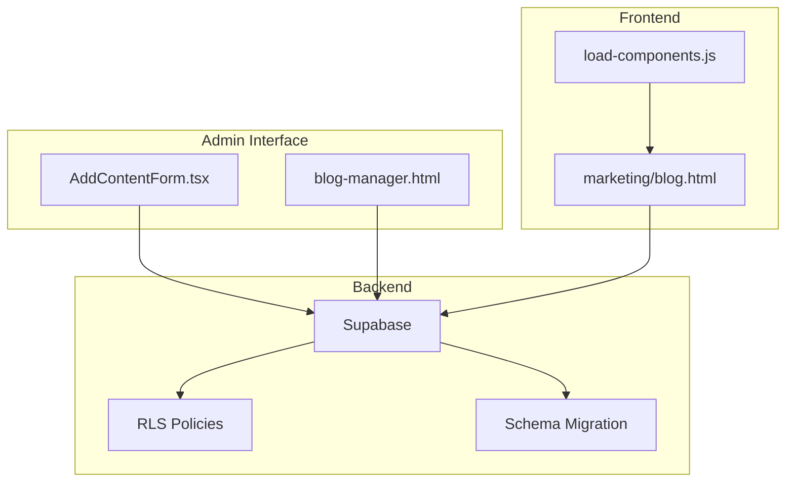
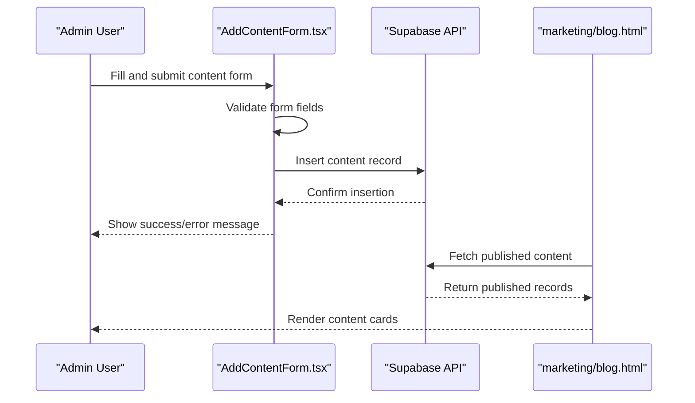
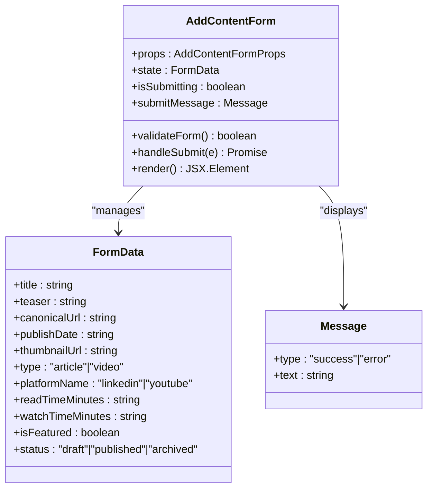
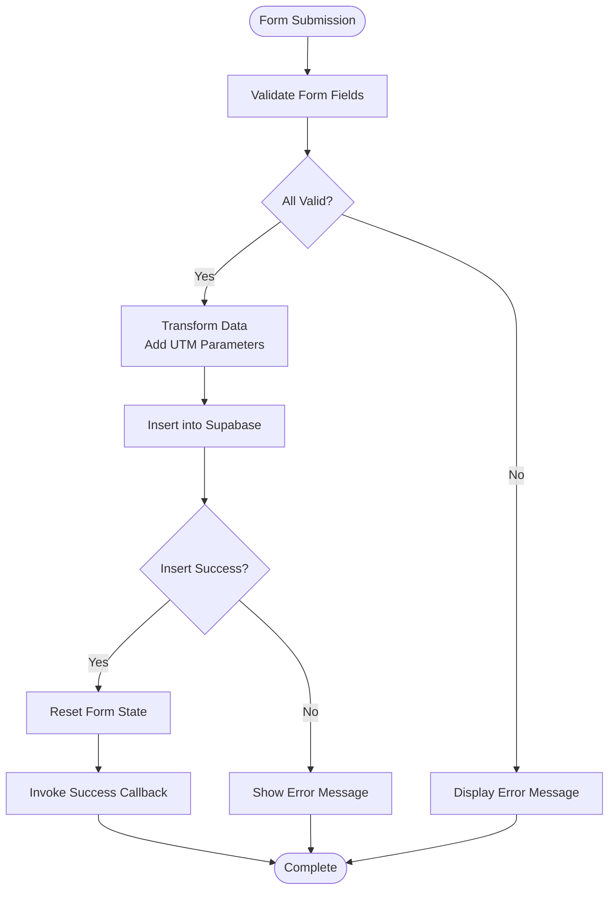
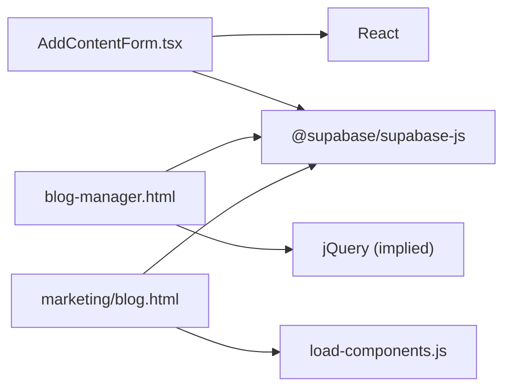

# Admin Content Management Interface

<cite>
**Referenced Files in This Document**
- [AddContentForm.tsx](file://components/admin/AddContentForm.tsx)
- [blog-manager.html](file://admin/blog-manager.html)
- [README.md](file://admin/README.md)
- [package.json](file://package.json)
- [rls-policies.sql](file://supabase/rls-policies.sql)
- [001_initial_blog_schema.sql](file://supabase/migrations/001_initial_blog_schema.sql)
- [blog.html](file://marketing/blog.html)
- [load-components.js](file://js/load-components.js)
</cite>

## Table of Contents
1. [Introduction](#introduction)
2. [Project Structure](#project-structure)
3. [Core Components](#core-components)
4. [Architecture Overview](#architecture-overview)
5. [Detailed Component Analysis](#detailed-component-analysis)
6. [Dependency Analysis](#dependency-analysis)
7. [Performance Considerations](#performance-considerations)
8. [Troubleshooting Guide](#troubleshooting-guide)
9. [Conclusion](#conclusion)
10. [Appendices](#appendices)

## Introduction
This document provides comprehensive documentation for the Admin Content Management Interface built with React. It focuses on the AddContentForm.tsx component that enables administrators to create and edit blog content, detailing form validation, data submission workflows, and integration with Supabase backend services. It also covers the admin authentication system, content approval workflows, bulk content management features, React component lifecycle and state management, error handling patterns, and practical examples for customizing form fields, implementing content scheduling, and extending administrative capabilities.

## Project Structure
The Admin Content Management Interface spans multiple areas of the repository:
- React-based admin form component located under components/admin/AddContentForm.tsx
- Legacy HTML-based admin manager under admin/blog-manager.html
- Supabase schema and RLS policies under supabase/
- Frontend blog hub page under marketing/blog.html
- Shared component loader under js/load-components.js
- Package configuration for Supabase client under package.json

**Diagram sources**
- [AddContentForm.tsx](file://components/admin/AddContentForm.tsx#L1-L357)
- [blog-manager.html](file://admin/blog-manager.html#L1-L800)
- [marketing/blog.html](file://marketing/blog.html#L1-L200)
- [load-components.js](file://js/load-components.js#L1-L58)
- [rls-policies.sql](file://supabase/rls-policies.sql#L1-L95)
- [001_initial_blog_schema.sql](file://supabase/migrations/001_initial_blog_schema.sql#L1-L27)

**Section sources**
- [AddContentForm.tsx](file://components/admin/AddContentForm.tsx#L1-L357)
- [blog-manager.html](file://admin/blog-manager.html#L1-L800)
- [marketing/blog.html](file://marketing/blog.html#L1-L200)
- [load-components.js](file://js/load-components.js#L1-L58)
- [rls-policies.sql](file://supabase/rls-policies.sql#L1-L95)
- [001_initial_blog_schema.sql](file://supabase/migrations/001_initial_blog_schema.sql#L1-L27)

## Core Components
This section outlines the primary components involved in the Admin Content Management Interface and their responsibilities:
- AddContentForm.tsx: React component that renders a form for adding blog content, manages form state, validates inputs, and submits data to Supabase.
- blog-manager.html: Legacy HTML-based admin manager that provides a comprehensive interface for content creation, editing, filtering, and deletion.
- marketing/blog.html: Frontend page that displays published blog content fetched from Supabase.
- Supabase integration: RLS policies and schema migrations define access control and data structure for content storage.

Key responsibilities:
- Form rendering and user interaction
- Real-time validation and error messaging
- Data transformation and submission to Supabase
- Content display and filtering on the blog hub
- Access control via Row Level Security

**Section sources**
- [AddContentForm.tsx](file://components/admin/AddContentForm.tsx#L16-L141)
- [blog-manager.html](file://admin/blog-manager.html#L518-L771)
- [marketing/blog.html](file://marketing/blog.html#L144-L200)
- [rls-policies.sql](file://supabase/rls-policies.sql#L8-L36)

## Architecture Overview
The Admin Content Management Interface follows a client-server architecture:
- Client-side forms (React and HTML) collect content metadata and submit to Supabase.
- Supabase enforces Row Level Security policies to control access to content.
- The blog hub page queries published content and renders it to users.

**Diagram sources**
- [AddContentForm.tsx](file://components/admin/AddContentForm.tsx#L34-L141)
- [marketing/blog.html](file://marketing/blog.html#L144-L200)
- [rls-policies.sql](file://supabase/rls-policies.sql#L18-L23)

## Detailed Component Analysis

### AddContentForm.tsx Analysis
AddContentForm.tsx is a React component responsible for creating and editing blog content. It manages form state, performs validation, transforms data, and submits to Supabase.

Key implementation patterns:
- Client-side state management using useState for form data and submission state
- Inline validation with immediate feedback
- Dynamic field rendering based on content type
- UTM parameter injection for tracking
- Success and error messaging

**Diagram sources**
- [AddContentForm.tsx](file://components/admin/AddContentForm.tsx#L11-L32)

Form validation logic:
- Required fields: title, teaser, canonicalUrl, publishDate
- Type-specific validation: readTimeMinutes for articles, watchTimeMinutes for videos
- URL format validation via HTML input type=url
- Character limits enforced via maxLength attributes

Data submission workflow:
- UTM parameter injection if missing
- Transformation of form data to match Supabase column names
- Insert operation with single-row selection
- Success callback invocation after delay

**Diagram sources**
- [AddContentForm.tsx](file://components/admin/AddContentForm.tsx#L34-L141)

**Section sources**
- [AddContentForm.tsx](file://components/admin/AddContentForm.tsx#L16-L141)

### Admin Authentication System
The current admin interface uses a simple password-protected HTML page approach:
- Password input field with masked entry
- Client-side validation before enabling admin content
- Error messaging for incorrect passwords
- Conditional display of login screen versus main content

Security considerations:
- Password protection via .htaccess or private hosting
- Supabase anonymous key usage for client-side operations
- Row Level Security policies restricting access

**Section sources**
- [blog-manager.html](file://admin/blog-manager.html#L499-L506)
- [README.md](file://admin/README.md#L134-L142)

### Content Approval Workflows
The system supports a simple approval workflow through status management:
- Draft: Unpublished content for review
- Published: Immediately visible on blog hub
- Archived: Hidden content for historical reference

Future enhancements:
- Moderation queue for pending approvals
- Multi-stage approval process
- Audit trail for changes
- Automated notifications for reviewers

**Section sources**
- [AddContentForm.tsx](file://components/admin/AddContentForm.tsx#L28-L29)
- [blog-manager.html](file://admin/blog-manager.html#L683-L687)

### Bulk Content Management Features
Current capabilities:
- Individual content addition via forms
- Filtering and search in admin manager
- Pagination for content lists

Planned enhancements:
- CSV import for batch content creation
- Bulk status updates
- Mass deletion with confirmation
- Content duplication and cloning

**Section sources**
- [blog-manager.html](file://admin/blog-manager.html#L735-L771)
- [README.md](file://admin/README.md#L179-L189)

### React Component Lifecycle and State Management
AddContentForm.tsx follows React functional component patterns:
- Initialization: Form state initialized with default values
- Rendering: Dynamic field rendering based on content type
- Event handling: Controlled components with onChange handlers
- Side effects: Supabase API calls during submission
- Cleanup: Success callback invoked after successful submission

State management patterns:
- Local component state for form data and UI state
- Validation state separate from form data
- Submission state to prevent duplicate submissions

**Section sources**
- [AddContentForm.tsx](file://components/admin/AddContentForm.tsx#L16-L32)
- [AddContentForm.tsx](file://components/admin/AddContentForm.tsx#L143-L355)

### Error Handling Patterns
Error handling encompasses multiple layers:
- Form validation errors with immediate feedback
- Network errors during Supabase API calls
- Database constraint violations
- User experience improvements through clear messaging

Error handling strategies:
- Validation errors displayed as inline messages
- Network errors caught and shown to users
- Fallback mechanisms for failed submissions
- Console logging for debugging

**Section sources**
- [AddContentForm.tsx](file://components/admin/AddContentForm.tsx#L34-L60)
- [AddContentForm.tsx](file://components/admin/AddContentForm.tsx#L132-L141)

### Supabase Backend Integration
Supabase integration involves:
- Client initialization via @supabase/supabase-js
- Row Level Security policies for access control
- Schema migration for table structure
- Real-time data synchronization

RLS policies:
- Public can view published content only
- Public can insert analytics events
- Restrictive policies for data integrity

**Section sources**
- [package.json](file://package.json#L24-L27)
- [rls-policies.sql](file://supabase/rls-policies.sql#L8-L36)
- [001_initial_blog_schema.sql](file://supabase/migrations/001_initial_blog_schema.sql#L1-L27)

### Frontend Blog Hub Integration
The blog hub page consumes published content:
- Grid layout for content cards
- Filtering and sorting capabilities
- Responsive design for mobile devices
- Component loading via shared loader

**Section sources**
- [marketing/blog.html](file://marketing/blog.html#L144-L200)
- [load-components.js](file://js/load-components.js#L14-L31)

## Dependency Analysis
The Admin Content Management Interface has the following dependencies:
- React for component rendering and state management
- Supabase client library for database operations
- Tailwind CSS classes for styling (inherited from shared components)
- Browser APIs for form handling and validation

**Diagram sources**
- [AddContentForm.tsx](file://components/admin/AddContentForm.tsx#L8-L9)
- [package.json](file://package.json#L24-L27)
- [marketing/blog.html](file://marketing/blog.html#L1-L200)
- [load-components.js](file://js/load-components.js#L1-L58)

**Section sources**
- [package.json](file://package.json#L24-L27)
- [AddContentForm.tsx](file://components/admin/AddContentForm.tsx#L8-L9)

## Performance Considerations
Performance considerations for the Admin Content Management Interface:
- Minimize re-renders by using controlled components
- Debounce network requests during validation
- Optimize database queries with appropriate filters
- Cache frequently accessed data where possible
- Use pagination for large content lists

## Troubleshooting Guide
Common issues and resolutions:
- "Failed to add content" error: Verify Supabase URL and key configuration, check table existence, and confirm RLS policies allow INSERT
- Content not appearing on blog hub: Ensure status is set to "published" in Supabase and verify frontend credentials
- Character counter not working: Check JavaScript console for errors and verify form field IDs
- Authentication failures: Confirm password protection method and ensure proper .htaccess configuration

**Section sources**
- [README.md](file://admin/README.md#L193-L208)

## Conclusion
The Admin Content Management Interface provides a robust foundation for managing blog content through both React and HTML-based interfaces. The AddContentForm.tsx component offers a modern, React-based solution with comprehensive validation and Supabase integration. The legacy blog-manager.html provides extensive administrative capabilities including filtering, search, and bulk operations. With proper authentication, RLS policies, and planned enhancements, this system can support efficient content management workflows while maintaining security and scalability.

## Appendices

### Customizing Form Fields
Examples of customizing form fields:
- Adding new required fields: Extend the FormData interface and add validation logic
- Modifying field constraints: Adjust maxLength attributes and validation rules
- Extending content types: Add new platform options and corresponding validation
- Implementing conditional fields: Use dynamic rendering based on content type

### Implementing Content Scheduling
Content scheduling can be implemented by:
- Adding scheduledDate field to form state
- Implementing publishDate vs scheduledDate logic
- Creating background job for publishing scheduled content
- Adding scheduling UI elements and validation

### Extending Administrative Capabilities
Administrative extensions can include:
- Content editing interface for modifying existing entries
- Bulk import functionality for CSV uploads
- Analytics dashboard for content performance metrics
- Approval workflow with moderation queue
- Content versioning and audit trails