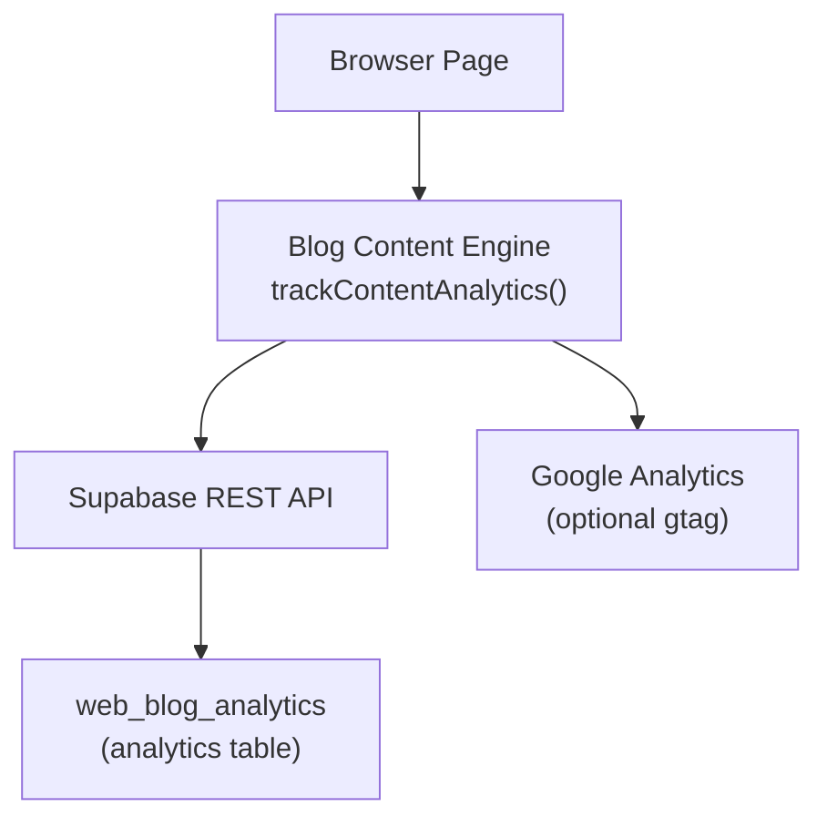
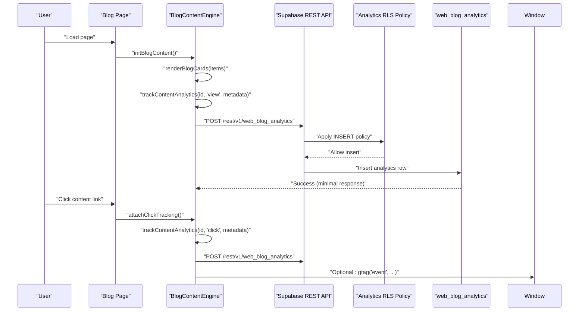
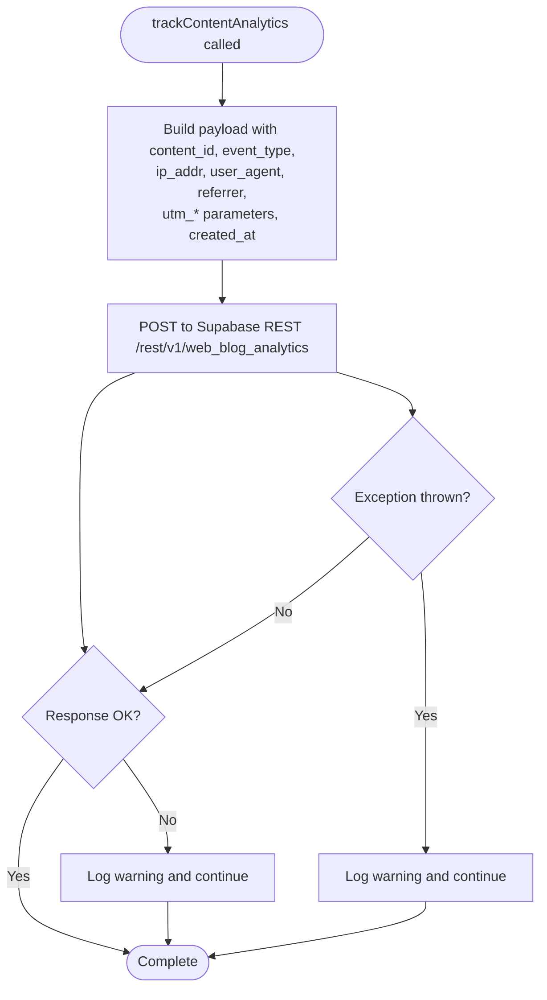
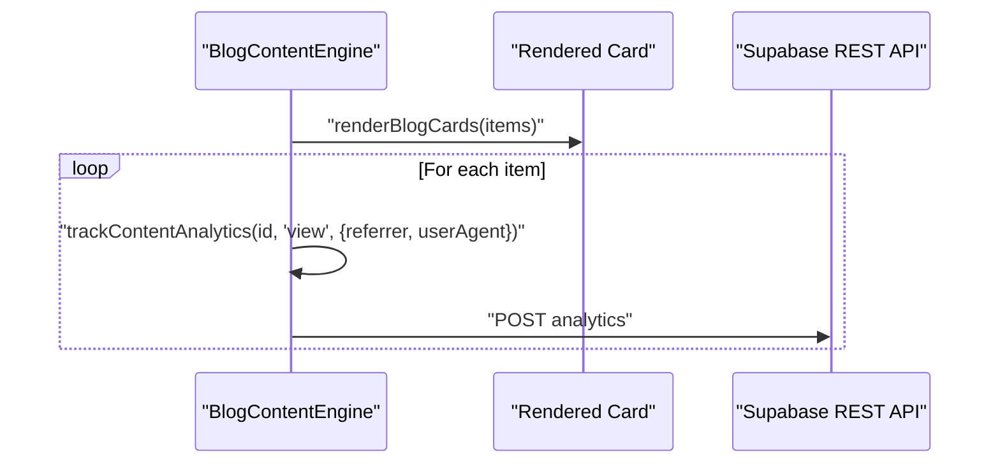
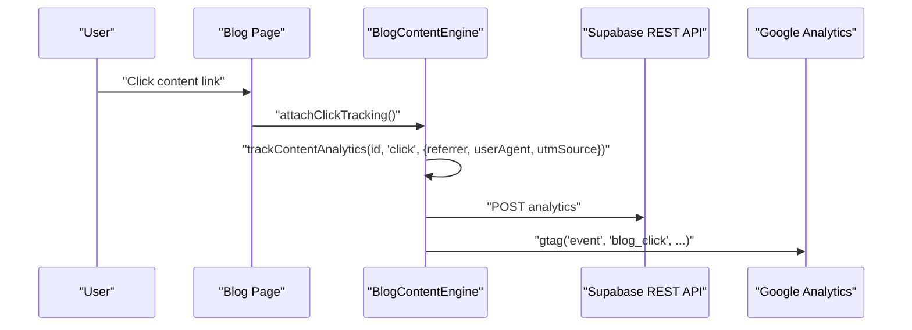
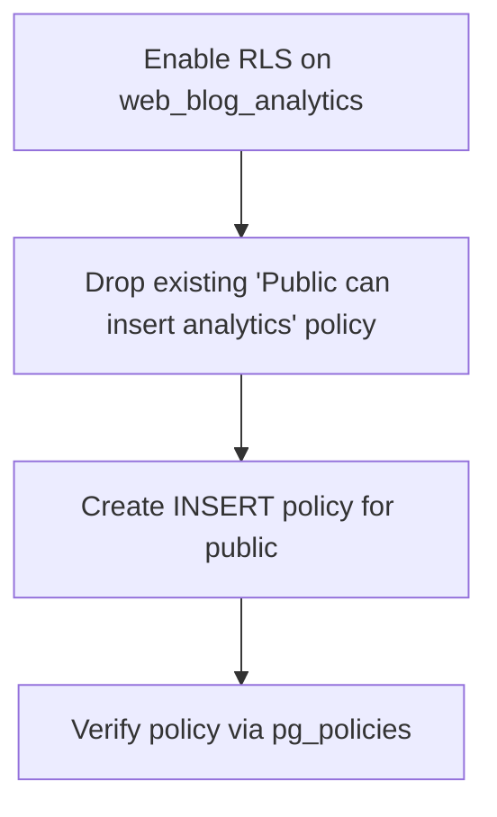
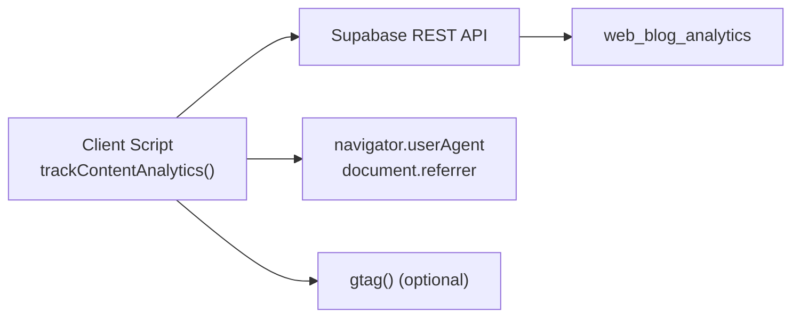

# Analytics Tracking System

<cite>
**Referenced Files in This Document**
- [blog-content.js](file://js/blog-content.js)
- [blog-content.js](file://PRODUCTION_DEPLOY/js/blog-content.js)
- [script-2-analytics-policy.sql](file://supabase/script-2-analytics-policy.sql)
- [001_phase1_website_schema.sql](file://supabase/migrations/001_phase1_website_schema.sql)
- [RENAME_ALL_TABLES_TO_WEB_PREFIX.sql](file://supabase/RENAME_ALL_TABLES_TO_WEB_PREFIX.sql)
</cite>

## Table of Contents
1. [Introduction](#introduction)
2. [Project Structure](#project-structure)
3. [Core Components](#core-components)
4. [Architecture Overview](#architecture-overview)
5. [Detailed Component Analysis](#detailed-component-analysis)
6. [Dependency Analysis](#dependency-analysis)
7. [Performance Considerations](#performance-considerations)
8. [Troubleshooting Guide](#troubleshooting-guide)
9. [Conclusion](#conclusion)
10. [Appendices](#appendices)

## Introduction
This document describes the Analytics Tracking System used by the TrueVow website to record content views, clicks, and shares. It focuses on the trackContentAnalytics() function, which posts analytics events to Supabase tables while collecting metadata such as IP addresses, user agents, referrers, and UTM parameters. The system is designed to handle failures silently so that analytics errors do not interrupt page functionality. It also integrates with Google Analytics via the global gtag() function when present, enabling enhanced cross-platform tracking.

## Project Structure
The analytics tracking logic is implemented in the blog content JavaScript module. Supporting Supabase policies and schema migrations define the backend storage and permissions for analytics data.

**Diagram sources**
- [blog-content.js](file://js/blog-content.js#L71-L102)
- [blog-content.js](file://js/blog-content.js#L213-L250)
- [script-2-analytics-policy.sql](file://supabase/script-2-analytics-policy.sql#L8-L19)
- [RENAME_ALL_TABLES_TO_WEB_PREFIX.sql](file://supabase/RENAME_ALL_TABLES_TO_WEB_PREFIX.sql#L33-L38)

**Section sources**
- [blog-content.js](file://js/blog-content.js#L71-L102)
- [blog-content.js](file://js/blog-content.js#L213-L250)
- [script-2-analytics-policy.sql](file://supabase/script-2-analytics-policy.sql#L8-L19)

## Core Components
- trackContentAnalytics(contentId, eventType, metadata): Asynchronous function that posts analytics events to the Supabase analytics table. It collects metadata such as IP address, user agent, referrer, and UTM parameters, and handles errors silently.
- renderBlogCards(contentItems, container): Renders content cards and triggers view events automatically for each visible item.
- attachClickTracking(container): Attaches click listeners to content links and records click events, optionally integrating with Google Analytics via gtag().

Key behaviors:
- Metadata collection: IP address, user agent, referrer, and UTM parameters are captured when provided or derived from browser APIs.
- Silent failure handling: Network or server errors during analytics posting are caught and logged without interrupting page functionality.
- Google Analytics integration: When gtag() is available, click events are forwarded to Google Analytics for enhanced reporting.

**Section sources**
- [blog-content.js](file://js/blog-content.js#L71-L102)
- [blog-content.js](file://js/blog-content.js#L109-L219)
- [blog-content.js](file://js/blog-content.js#L225-L253)

## Architecture Overview
The analytics pipeline consists of client-side event generation and server-side persistence. The client posts events to Supabase using the REST API, and Supabase applies Row Level Security (RLS) policies to permit public insertion for analytics.

**Diagram sources**
- [blog-content.js](file://js/blog-content.js#L319-L350)
- [blog-content.js](file://js/blog-content.js#L109-L219)
- [blog-content.js](file://js/blog-content.js#L225-L253)
- [blog-content.js](file://js/blog-content.js#L71-L102)
- [script-2-analytics-policy.sql](file://supabase/script-2-analytics-policy.sql#L8-L19)

## Detailed Component Analysis

### trackContentAnalytics Function
Purpose:
- Record content interactions (view, click, share) with associated metadata.

Processing logic:
- Constructs a POST request to the Supabase REST endpoint for web_blog_analytics.
- Sends content_id, event_type, and optional metadata fields: ip_addr, user_agent, referrer, utm_source, utm_medium, utm_campaign, created_at.
- Uses Prefer: return=minimal to minimize response payload.
- Handles non-OK responses by logging a warning and continues execution.
- Catches exceptions silently to avoid blocking page rendering.

Metadata collection:
- IP address: Provided via metadata.ipAddr.
- User agent: Provided via metadata.userAgent or defaults to navigator.userAgent.
- Referrer: Provided via metadata.referrer or defaults to document.referrer.
- UTM parameters: utm_source, utm_medium, utm_campaign provided via metadata.

Silent failure handling:
- Non-OK HTTP responses trigger console warnings but do not throw errors.
- Exceptions are caught and logged, ensuring page functionality remains unaffected.

Integration with Google Analytics:
- When gtag() is defined, click events are forwarded to Google Analytics with content_type, content_title, and destination_platform.

**Diagram sources**
- [blog-content.js](file://js/blog-content.js#L71-L102)

**Section sources**
- [blog-content.js](file://js/blog-content.js#L71-L102)

### View Event Flow (Automatic)
Behavior:
- When cards are rendered, a view event is automatically tracked for each visible content item.
- Metadata includes referrer and user agent.

**Diagram sources**
- [blog-content.js](file://js/blog-content.js#L109-L219)

**Section sources**
- [blog-content.js](file://js/blog-content.js#L109-L219)

### Click Event Flow (Manual)
Behavior:
- Click listeners are attached to content links.
- On click, a click event is tracked with referrer, user agent, and utmSource set to "blog_hub".
- Optionally emits a gtag event with content_type, content_title, and destination_platform.

**Diagram sources**
- [blog-content.js](file://js/blog-content.js#L225-L253)

**Section sources**
- [blog-content.js](file://js/blog-content.js#L225-L253)

### Data Schema for Analytics Tables
Based on the client-side payload and Supabase migration expectations, the analytics table stores the following fields:

- content_id: Identifier linking to the content item
- event_type: Type of event ("view", "click", "share")
- ip_addr: Client IP address (optional)
- user_agent: Browser user agent string
- referrer: Referring URL (optional)
- utm_source: Campaign source (optional)
- utm_medium: Campaign medium (optional)
- utm_campaign: Campaign name (optional)
- created_at: Timestamp of event capture

Note: The actual database schema is defined by Supabase migrations and policies. The client posts fields that match the expected table structure.

**Section sources**
- [blog-content.js](file://js/blog-content.js#L82-L92)
- [001_phase1_website_schema.sql](file://supabase/migrations/001_phase1_website_schema.sql#L14-L22)

### Supabase Permissions and Policies
- Row Level Security (RLS) is enabled on the analytics table.
- A policy allows public INSERT for analytics events, enabling client-side tracking without requiring user authentication.
- Verification queries confirm the policy is applied.

**Diagram sources**
- [script-2-analytics-policy.sql](file://supabase/script-2-analytics-policy.sql#L8-L27)

**Section sources**
- [script-2-analytics-policy.sql](file://supabase/script-2-analytics-policy.sql#L8-L27)

### Table Renaming Context
The analytics table was renamed from blog_analytics to web_blog_analytics as part of schema updates. The client code targets the renamed table name.

**Section sources**
- [RENAME_ALL_TABLES_TO_WEB_PREFIX.sql](file://supabase/RENAME_ALL_TABLES_TO_WEB_PREFIX.sql#L33-L38)
- [RENAME_ALL_TABLES_TO_WEB_PREFIX.sql](file://supabase/RENAME_ALL_TABLES_TO_WEB_PREFIX.sql#L197-L211)

## Dependency Analysis
Client-side dependencies:
- trackContentAnalytics depends on:
  - Supabase REST endpoint for web_blog_analytics
  - Browser APIs: navigator.userAgent, document.referrer
  - Optional: gtag() for Google Analytics integration

Server-side dependencies:
- Supabase REST API for analytics ingestion
- RLS policy permitting public INSERT for analytics

**Diagram sources**
- [blog-content.js](file://js/blog-content.js#L71-L102)
- [blog-content.js](file://js/blog-content.js#L244-L250)
- [script-2-analytics-policy.sql](file://supabase/script-2-analytics-policy.sql#L8-L19)

**Section sources**
- [blog-content.js](file://js/blog-content.js#L71-L102)
- [blog-content.js](file://js/blog-content.js#L244-L250)
- [script-2-analytics-policy.sql](file://supabase/script-2-analytics-policy.sql#L8-L19)

## Performance Considerations
- Minimal response handling: The client uses Prefer: return=minimal to reduce bandwidth and processing overhead on analytics requests.
- Silent failure: Errors are caught and logged without blocking the main UI thread, preserving responsiveness.
- Optional Google Analytics: gtag integration is conditional; absence of gtag does not impact performance or functionality.

## Troubleshooting Guide
Common issues and resolutions:
- Analytics events not appearing in database:
  - Verify Supabase RLS policy for public INSERT on web_blog_analytics is active.
  - Confirm the client posts to /rest/v1/web_blog_analytics.
- Missing metadata (user agent, referrer):
  - Ensure metadata.userAgent and metadata.referrer are passed; otherwise, defaults are used from browser APIs.
- Google Analytics events not recorded:
  - Confirm gtag() is loaded and initialized before click events occur.
- Network or server errors:
  - The client logs warnings for non-OK responses but does not throw; inspect browser network tab for details.

**Section sources**
- [blog-content.js](file://js/blog-content.js#L95-L101)
- [blog-content.js](file://js/blog-content.js#L244-L250)
- [script-2-analytics-policy.sql](file://supabase/script-2-analytics-policy.sql#L8-L19)

## Conclusion
The Analytics Tracking System provides robust, non-intrusive content analytics by posting events to Supabase with minimal overhead. It captures essential metadata, handles errors silently, and optionally integrates with Google Analytics. The Supabase policy ensures secure, permissioned ingestion of analytics data.

## Appendices

### Privacy Considerations for Data Collection
- IP addresses: Collected when provided; consider anonymization or aggregation to protect user privacy.
- User agents: Captured for device and browser insights; avoid storing sensitive personal data.
- Referrers: Useful for traffic source analysis; ensure compliance with privacy regulations.
- UTM parameters: Used for campaign attribution; only collect what is necessary for analytics goals.
- Consent and transparency: Implement cookie consent mechanisms and provide clear privacy notices for analytics tracking.