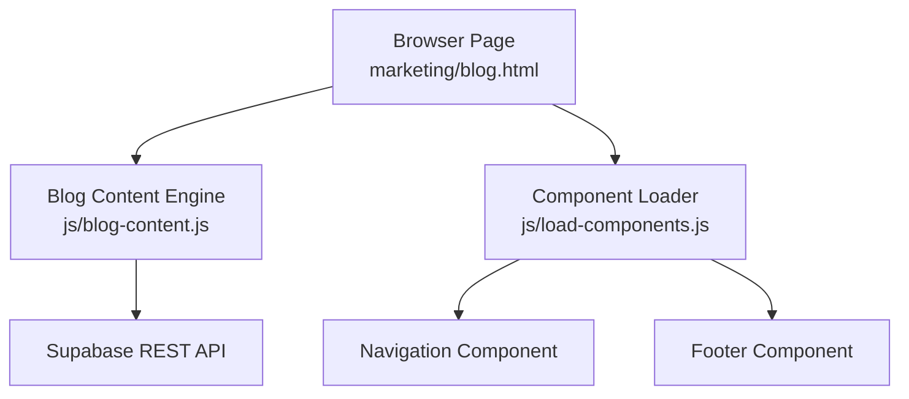
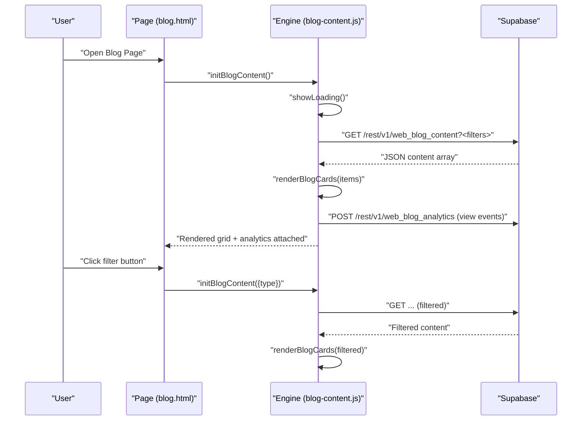
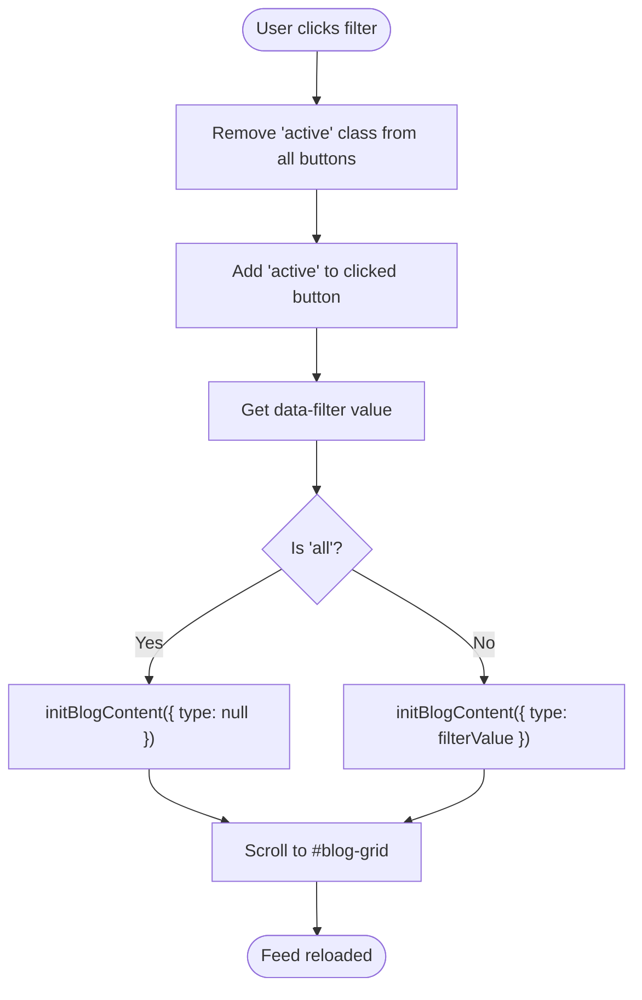
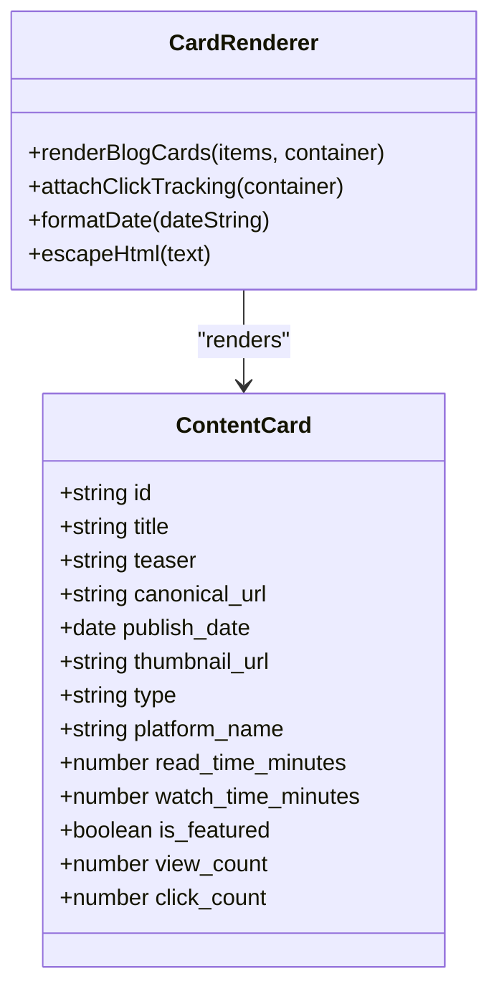
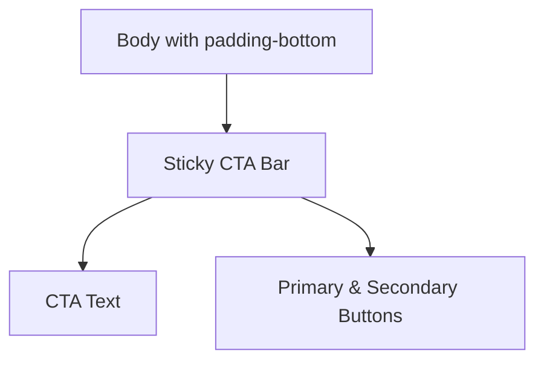
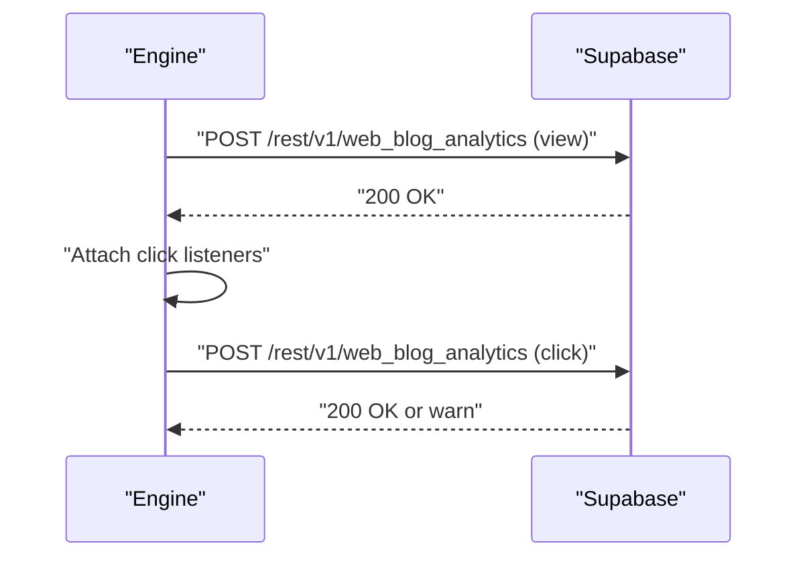
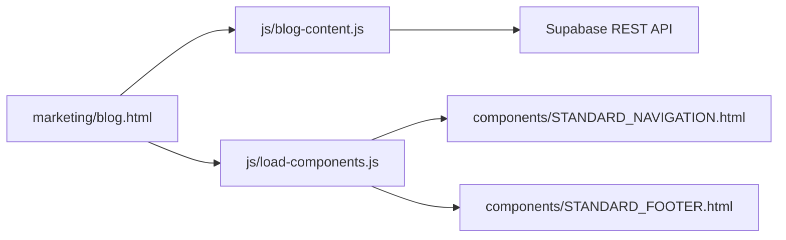

# Blog Content Management System

<cite>
**Referenced Files in This Document**
- [blog-content.js](file://js/blog-content.js)
- [blog.html](file://marketing/blog.html)
- [.env.local](file://.env.local)
- [load-components.js](file://js/load-components.js)
- [001_initial_blog_schema.sql](file://supabase/migrations/001_initial_blog_schema.sql)
</cite>

## Table of Contents
1. [Introduction](#introduction)
2. [Project Structure](#project-structure)
3. [Core Components](#core-components)
4. [Architecture Overview](#architecture-overview)
5. [Detailed Component Analysis](#detailed-component-analysis)
6. [Dependency Analysis](#dependency-analysis)
7. [Performance Considerations](#performance-considerations)
8. [Troubleshooting Guide](#troubleshooting-guide)
9. [Conclusion](#conclusion)

## Introduction
This document describes the Blog Content Management System that powers the TrueVow Blog & Media Hub. It explains how the frontend dynamically fetches content from Supabase, renders content cards with responsive layouts, enables filtering by content type (articles vs videos), tracks engagement analytics, and integrates a sticky CTA bar. It also documents configuration options, error handling, and performance optimization techniques.

## Project Structure
The system consists of:
- A static marketing page that hosts the blog feed and UI controls
- A JavaScript engine that fetches content from Supabase, renders cards, and manages analytics
- Environment configuration for Supabase credentials
- Optional component loader for standardized navigation and footer injection

**Diagram sources**
- [blog.html](file://marketing/blog.html#L437-L440)
- [blog-content.js](file://js/blog-content.js#L319-L350)
- [load-components.js](file://js/load-components.js#L36-L55)

**Section sources**
- [blog.html](file://marketing/blog.html#L427-L440)
- [blog-content.js](file://js/blog-content.js#L1-L424)
- [.env.local](file://.env.local#L15-L28)
- [load-components.js](file://js/load-components.js#L1-L58)

## Core Components
- Supabase configuration constants for URL and anonymous key
- Content fetcher with optional filters (type, featured, limit)
- Analytics tracker for views and clicks
- Dynamic card renderer with image placeholders and metadata
- Loading and error UI states
- Auto-initialization and filter button handlers
- Sticky CTA bar integrated into the marketing page

Key responsibilities:
- Fetch published content ordered by publish date
- Render cards with gradient placeholders or thumbnails
- Track page views and outbound clicks with analytics
- Provide filtering by content type with smooth scroll to content grid
- Graceful error handling with retry option

**Section sources**
- [blog-content.js](file://js/blog-content.js#L11-L12)
- [blog-content.js](file://js/blog-content.js#L26-L64)
- [blog-content.js](file://js/blog-content.js#L109-L219)
- [blog-content.js](file://js/blog-content.js#L319-L350)
- [blog-content.js](file://js/blog-content.js#L386-L414)

## Architecture Overview
The system follows a client-side rendering pattern:
- On page load, the engine initializes and requests published content from Supabase
- The server responds with structured content items
- The engine renders cards, attaches analytics listeners, and updates filter UI
- Users can filter content by type, triggering a reload of the feed

**Diagram sources**
- [blog.html](file://marketing/blog.html#L437-L440)
- [blog-content.js](file://js/blog-content.js#L319-L350)
- [blog-content.js](file://js/blog-content.js#L26-L64)
- [blog-content.js](file://js/blog-content.js#L109-L219)

## Detailed Component Analysis

### Supabase Configuration and Content Fetching
- Configuration constants define the Supabase project URL and anonymous key used for REST API access
- The fetcher builds a URL with filters for status, type, featured flag, and limit
- It selects a curated set of columns to minimize payload size
- Uses both apikey and Authorization headers as required by Supabase REST v1

Practical example paths:
- [Configuration constants](file://js/blog-content.js#L11-L12)
- [Fetch URL construction and headers](file://js/blog-content.js#L26-L64)

**Section sources**
- [blog-content.js](file://js/blog-content.js#L11-L12)
- [blog-content.js](file://js/blog-content.js#L26-L64)

### Filtering System (Articles vs Videos)
- Filter buttons are labeled "All Content", "Articles (LinkedIn)", and "Videos (YouTube)"
- Clicking a filter removes active class from all buttons, sets the clicked button active, and reloads content with the selected type
- Smooth scroll brings the content grid back into view after filtering

**Diagram sources**
- [blog.html](file://marketing/blog.html#L428-L434)
- [blog-content.js](file://js/blog-content.js#L386-L414)

**Section sources**
- [blog.html](file://marketing/blog.html#L428-L434)
- [blog-content.js](file://js/blog-content.js#L386-L414)

### Content Card Rendering System
- Cards display either a thumbnail image or a gradient placeholder with an emoji derived from the title keywords
- Each card includes:
  - Type badge ("LinkedIn Article" or "YouTube Video")
  - Title and teaser
  - Publish date
  - Link to canonical URL with appropriate icon and label
- Responsive grid layout adapts to screen size
- Hover effects and transitions enhance UX

**Diagram sources**
- [blog-content.js](file://js/blog-content.js#L109-L219)

**Section sources**
- [blog-content.js](file://js/blog-content.js#L109-L219)
- [blog.html](file://marketing/blog.html#L144-L256)

### Sticky CTA Bar Integration
- The marketing page includes a sticky CTA bar fixed at the bottom of the viewport
- The body padding-bottom reserves space for the CTA
- Buttons are styled for primary and secondary actions with hover effects
- Responsive adjustments stack buttons vertically on small screens

**Diagram sources**
- [blog.html](file://marketing/blog.html#L78-L79)
- [blog.html](file://marketing/blog.html#L258-L330)

**Section sources**
- [blog.html](file://marketing/blog.html#L258-L330)

### Analytics and Tracking
- View events are tracked immediately upon successful render
- Click events capture referrer, user agent, and UTM parameters
- Analytics are sent to the web_blog_analytics endpoint
- Analytics failures are logged but do not block page rendering

**Diagram sources**
- [blog-content.js](file://js/blog-content.js#L72-L102)
- [blog-content.js](file://js/blog-content.js#L225-L253)

**Section sources**
- [blog-content.js](file://js/blog-content.js#L72-L102)
- [blog-content.js](file://js/blog-content.js#L225-L253)

### Component Loader (Optional)
- Loads standardized navigation and footer components into placeholders
- Initializes on DOM ready and logs errors if targets are missing

**Section sources**
- [load-components.js](file://js/load-components.js#L14-L31)
- [load-components.js](file://js/load-components.js#L36-L55)

## Dependency Analysis
- The blog page depends on the engine script for dynamic content
- The engine depends on Supabase REST endpoints for content and analytics
- The component loader optionally depends on static HTML component files

**Diagram sources**
- [blog.html](file://marketing/blog.html#L469-L476)
- [blog-content.js](file://js/blog-content.js#L1-L424)
- [load-components.js](file://js/load-components.js#L36-L55)

**Section sources**
- [blog.html](file://marketing/blog.html#L469-L476)
- [blog-content.js](file://js/blog-content.js#L1-L424)
- [load-components.js](file://js/load-components.js#L1-L58)

## Performance Considerations
- Minimize payload: The fetcher explicitly selects only required columns
- Lazy initialization: Engine waits for DOMContentLoaded before fetching
- Efficient rendering: Cards are appended once per item; analytics listeners are attached after render
- Graceful fallbacks: Placeholders avoid broken image states; error UI provides retry
- Responsive grid: CSS grid adapts to screen size, reducing layout thrashing
- Analytics resilience: Analytics calls are fire-and-forget and do not block rendering

[No sources needed since this section provides general guidance]

## Troubleshooting Guide
Common issues and resolutions:
- Missing container: If the #blog-grid element is absent, initialization logs an error and stops
- Supabase credentials: Ensure SUPABASE_URL and SUPABASE_ANON_KEY are correctly configured
- Network errors: The fetcher throws on non-OK responses; error UI displays with a retry button
- Analytics failures: Analytics POSTs log warnings but do not crash the page
- Component loading: Component loader logs errors if target placeholders are missing

**Section sources**
- [blog-content.js](file://js/blog-content.js#L320-L325)
- [blog-content.js](file://js/blog-content.js#L54-L63)
- [blog-content.js](file://js/blog-content.js#L95-L101)
- [load-components.js](file://js/load-components.js#L17-L27)

## Conclusion
The Blog Content Management System provides a robust, client-rendered solution for displaying and filtering TrueVow’s blog content. It integrates seamlessly with Supabase, offers responsive presentation, and captures valuable engagement metrics. The modular design allows easy customization of content types, styling, and analytics while maintaining reliability through error handling and graceful degradation.