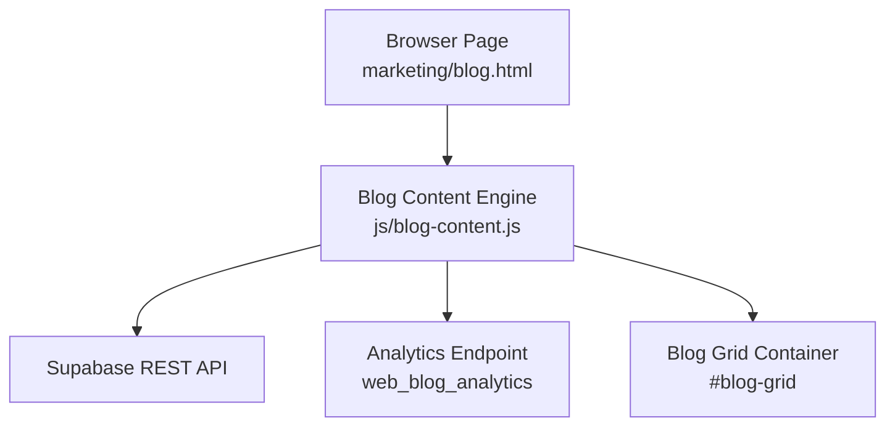
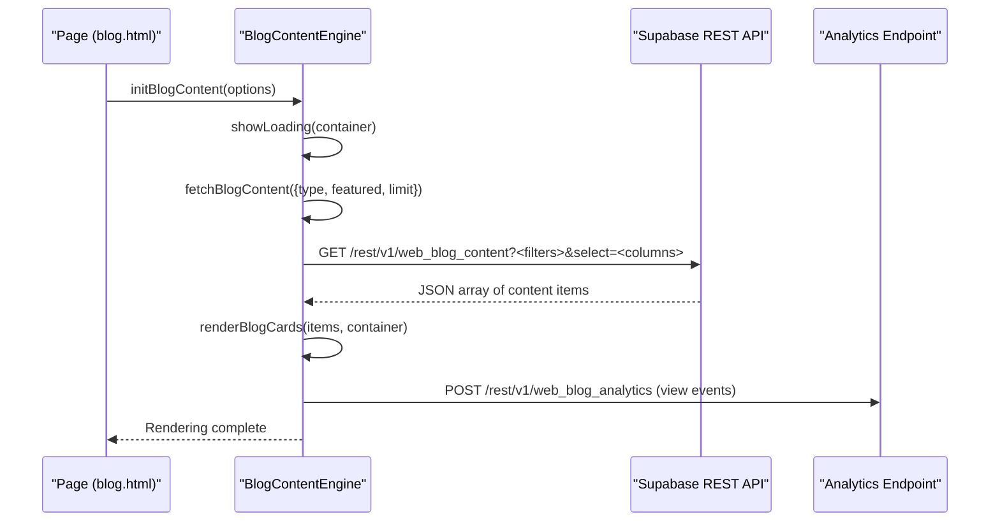
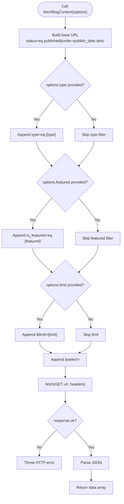
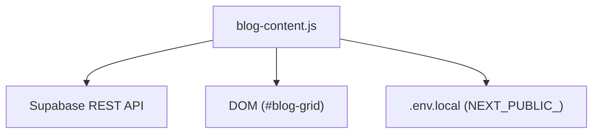

# Content Fetching Engine

<cite>
**Referenced Files in This Document**
- [blog-content.js](file://js/blog-content.js)
- [.env.local](file://.env.local)
- [blog.html](file://marketing/blog.html)
- [AddContentForm.tsx](file://PRODUCTION_DEPLOY/components/admin/AddContentForm.tsx)
- [README.md](file://README.md)
</cite>

## Table of Contents
1. [Introduction](#introduction)
2. [Project Structure](#project-structure)
3. [Core Components](#core-components)
4. [Architecture Overview](#architecture-overview)
5. [Detailed Component Analysis](#detailed-component-analysis)
6. [Dependency Analysis](#dependency-analysis)
7. [Performance Considerations](#performance-considerations)
8. [Troubleshooting Guide](#troubleshooting-guide)
9. [Conclusion](#conclusion)

## Introduction
This document explains the Content Fetching Engine responsible for retrieving published blog content from Supabase and rendering it on the marketing website. It focuses on the fetchBlogContent() function, covering URL construction for dynamic filtering (content type and featured status), pagination limits, Supabase authentication via API keys and Bearer tokens, column selection strategy, error handling, and practical usage patterns.

## Project Structure
The Content Fetching Engine is implemented in a single client-side JavaScript module and integrated into the marketing blog page. The module exposes initialization, content fetching, rendering, and analytics tracking capabilities.

**Diagram sources**
- [blog.html](file://marketing/blog.html#L470-L472)
- [blog-content.js](file://js/blog-content.js#L1-L424)

**Section sources**
- [blog.html](file://marketing/blog.html#L470-L472)
- [blog-content.js](file://js/blog-content.js#L1-L424)

## Core Components
- fetchBlogContent(options): Builds and executes a Supabase REST API query with optional filters and returns content items.
- trackContentAnalytics(contentId, eventType, metadata): Sends analytics events to Supabase.
- renderBlogCards(contentItems, container): Renders content cards and attaches click tracking.
- initBlogContent(options): Orchestrates loading state, fetching, rendering, and error handling.
- Utility helpers: showLoading(), showError(), escapeHtml(), formatDate(), updateActiveFilter(), attachClickTracking().

Key implementation highlights:
- URL construction appends status, ordering, and optional filters.
- Authentication uses both apikey and Authorization headers with the same anonymous key.
- Column selection optimizes payload size by requesting only necessary fields.
- Error handling distinguishes between network errors and analytics failures.

**Section sources**
- [blog-content.js](file://js/blog-content.js#L26-L64)
- [blog-content.js](file://js/blog-content.js#L72-L102)
- [blog-content.js](file://js/blog-content.js#L109-L219)
- [blog-content.js](file://js/blog-content.js#L319-L350)

## Architecture Overview
The engine follows a straightforward pipeline: initialize → build URL with filters → call Supabase REST endpoint → parse JSON → render → track views.

**Diagram sources**
- [blog.html](file://marketing/blog.html#L470-L472)
- [blog-content.js](file://js/blog-content.js#L319-L350)
- [blog-content.js](file://js/blog-content.js#L26-L64)
- [blog-content.js](file://js/blog-content.js#L72-L102)

## Detailed Component Analysis

### fetchBlogContent(options) Implementation
Purpose: Query published content from Supabase with optional filters and pagination.

- Base URL and ordering:
  - Starts with the base REST endpoint and applies a default status filter and descending order by publish date.
- Dynamic filtering:
  - Type filter: conditionally appends a type equality filter when options.type is provided.
  - Featured filter: conditionally appends an is_featured equality filter when options.featured is not null/undefined.
  - Limit: conditionally appends a limit parameter when options.limit is provided.
- Column selection:
  - Explicitly requests only the fields needed for rendering and analytics to minimize payload size.
- Authentication:
  - Uses both apikey and Authorization: Bearer headers set to the anonymous key.
- Response handling:
  - Validates response.ok and throws on non-OK status.
  - Parses JSON and returns the array of content items.

**Diagram sources**
- [blog-content.js](file://js/blog-content.js#L26-L64)

**Section sources**
- [blog-content.js](file://js/blog-content.js#L26-L64)

### URL Construction Logic
- Base query: status=eq.published&order=publish_date.desc
- Type filtering: type=eq.{value} where value is 'article' or 'video'
- Featured filtering: is_featured=eq.{true|false}
- Pagination: limit={count}
- Column selection: optimized subset of fields for rendering and analytics

Practical filter combinations:
- Published articles only: { type: 'article', featured: null, limit: 8 }
- Featured videos only: { type: null, featured: true, limit: 4 }
- All published content: { type: null, featured: null, limit: 12 }

**Section sources**
- [blog-content.js](file://js/blog-content.js#L28-L42)

### Supabase Authentication
- Both apikey and Authorization: Bearer headers are set to the anonymous key.
- The anonymous key is configured in two places:
  - Client-side constants for the blog engine.
  - Environment variables for local development and admin components.

Security considerations:
- Anonymous keys are intended for client-side use but should be rotated regularly.
- Prefer server-side proxying in production for sensitive operations.

**Section sources**
- [blog-content.js](file://js/blog-content.js#L44-L51)
- [.env.local](file://.env.local#L20-L22)
- [AddContentForm.tsx](file://PRODUCTION_DEPLOY/components/admin/AddContentForm.tsx#L90-L100)

### Column Selection Strategy
Selected fields include identifiers, titles, teasers, canonical URLs, dates, thumbnails, content type, platform, timing metrics, featured flag, and analytics counters. This minimizes bandwidth and simplifies rendering logic while preserving all UI requirements.

Optimization benefits:
- Reduced payload size improves initial load performance.
- Limits risk of exposing unnecessary data.

**Section sources**
- [blog-content.js](file://js/blog-content.js#L42-L42)
- [README.md](file://README.md#L404-L404)

### Error Handling Mechanisms
- Network failures: fetchBlogContent() throws on non-OK responses; initBlogContent() catches and displays a user-friendly error state.
- Analytics failures: trackContentAnalytics() logs warnings and silently fails to avoid breaking the page.
- UI fallbacks: showLoading() and showError() manage user feedback during transitions.

**Section sources**
- [blog-content.js](file://js/blog-content.js#L54-L63)
- [blog-content.js](file://js/blog-content.js#L346-L349)
- [blog-content.js](file://js/blog-content.js#L95-L101)

### Practical Examples and Usage Patterns
- Basic initialization: loads all published content ordered by publish date.
- Filtering by type: pass { type: 'article' } or { type: 'video' }.
- Featured content: pass { featured: true } to show only featured items.
- Combined filters: pass { type: 'article', featured: true, limit: 6 }.
- Analytics: view events are tracked automatically; click events are tracked per link.

Integration points:
- The marketing blog page includes the engine script and expects a #blog-grid container.

**Section sources**
- [blog-content.js](file://js/blog-content.js#L319-L350)
- [blog.html](file://marketing/blog.html#L470-L472)

## Dependency Analysis
The engine depends on:
- Supabase REST API endpoints for content and analytics.
- Client-side DOM for rendering and event handling.
- Environment configuration for credentials.

**Diagram sources**
- [blog-content.js](file://js/blog-content.js#L1-L424)
- [.env.local](file://.env.local#L25-L28)

**Section sources**
- [blog-content.js](file://js/blog-content.js#L1-L424)
- [.env.local](file://.env.local#L25-L28)

## Performance Considerations
- Minimize payload: the select clause limits returned fields to those required for rendering.
- Use limits: set options.limit to cap the number of items fetched and rendered.
- Conditional filters: only append filters that are truthy to reduce query complexity.
- Defer analytics: analytics POSTs occur after successful rendering to avoid blocking.
- Caching: consider browser caching headers and CDN for static assets; note that API responses are filtered and thus not cacheable.

[No sources needed since this section provides general guidance]

## Troubleshooting Guide
Common issues and resolutions:
- Credentials mismatch:
  - Verify SUPABASE_URL and SUPABASE_ANON_KEY in both client constants and environment variables.
  - Confirm the anonymous key matches the project URL.
- CORS or authentication errors:
  - Ensure both apikey and Authorization headers are present with the same anonymous key.
  - Rotate keys if unauthorized errors persist.
- Empty or missing content:
  - Confirm the web_blog_content table has published items with proper status and dates.
  - Check that the select columns match the actual table schema.
- Analytics tracking failures:
  - Inspect network tab for POST failures to web_blog_analytics.
  - Analytics failures are logged but do not block rendering.
- DOM container not found:
  - Ensure the page includes a #blog-grid element for rendering.

Debugging steps:
- Open browser DevTools Network tab and filter by the Supabase domain.
- Log the constructed URL in fetchBlogContent() to verify filters and select clause.
- Temporarily disable analytics to isolate content retrieval issues.

**Section sources**
- [blog-content.js](file://js/blog-content.js#L44-L51)
- [blog-content.js](file://js/blog-content.js#L320-L325)
- [blog-content.js](file://js/blog-content.js#L72-L102)

## Conclusion
The Content Fetching Engine provides a focused, efficient mechanism to retrieve and render published blog content from Supabase. Its URL construction supports flexible filtering, authentication is straightforward using anonymous keys, and column selection reduces payload size. Robust error handling ensures resilient user experiences, while analytics tracking enables insights without impacting performance.