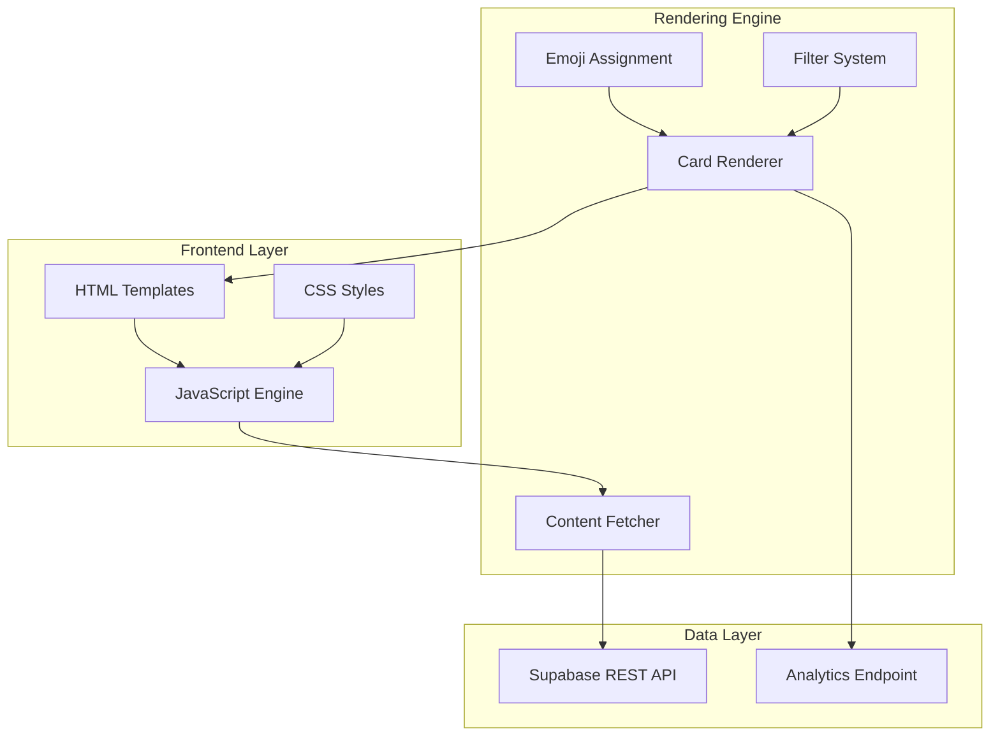
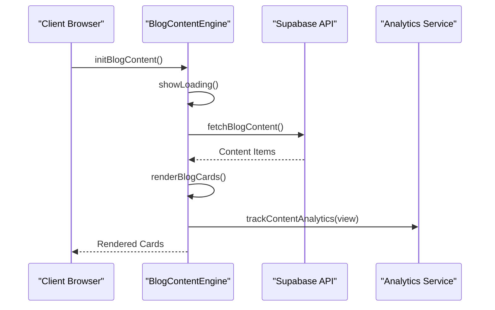
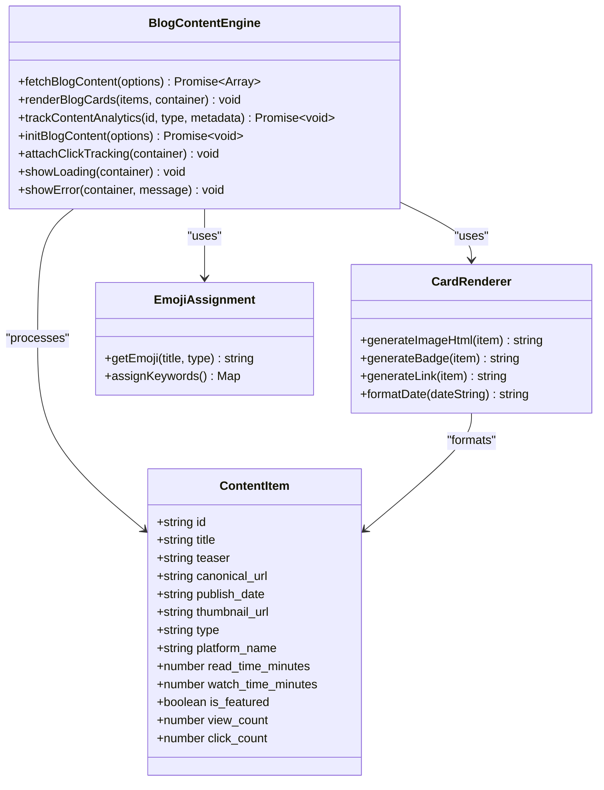
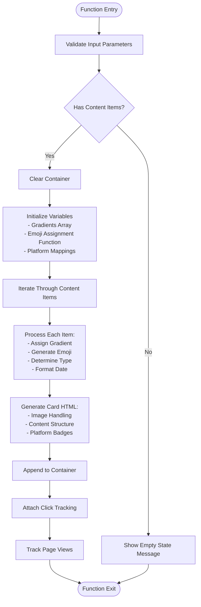
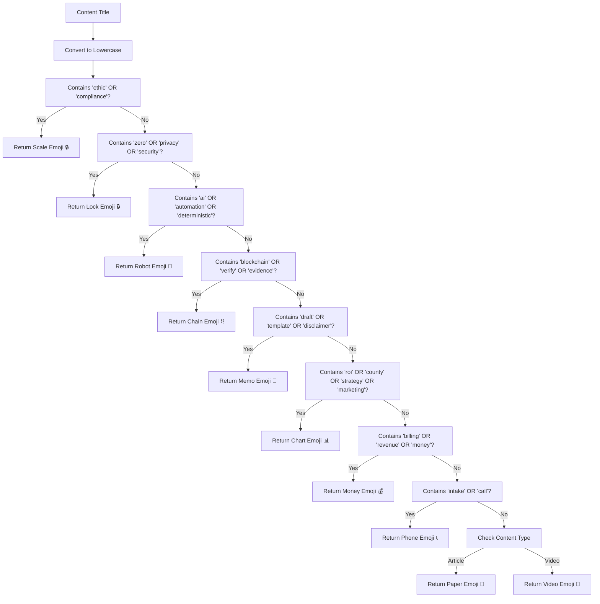
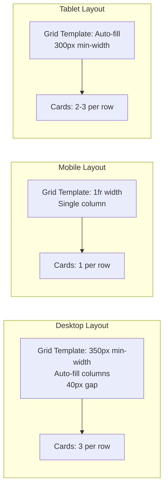

# Content Rendering Engine

<cite>
**Referenced Files in This Document**
- [blog-content.js](file://js/blog-content.js)
- [blog-content.js](file://PRODUCTION_DEPLOY/js/blog-content.js)
- [blog.html](file://marketing/blog.html)
- [blog.html](file://PRODUCTION_DEPLOY/marketing/blog.html)
- [load-components.js](file://js/load-components.js)
- [001_initial_blog_schema.sql](file://supabase/migrations/001_initial_blog_schema.sql)
</cite>

## Table of Contents
1. [Introduction](#introduction)
2. [Project Structure](#project-structure)
3. [Core Components](#core-components)
4. [Architecture Overview](#architecture-overview)
5. [Detailed Component Analysis](#detailed-component-analysis)
6. [Responsive Grid System](#responsive-grid-system)
7. [Accessibility Features](#accessibility-features)
8. [Performance Optimizations](#performance-optimizations)
9. [Customization Guide](#customization-guide)
10. [Troubleshooting Guide](#troubleshooting-guide)
11. [Conclusion](#conclusion)

## Introduction

The Content Rendering Engine is a sophisticated JavaScript system designed to transform Supabase data into interactive, responsive HTML cards for the TrueVow Blog & Media Hub. This engine serves as the backbone for displaying articles and videos from LinkedIn and YouTube platforms, providing users with an adaptive, visually appealing content discovery experience.

The system integrates seamlessly with Supabase REST API to fetch published content, applies intelligent emoji assignment based on content keywords, and renders responsive cards with platform-specific badges. It includes comprehensive analytics tracking, error handling, and performance optimizations for large content lists.

## Project Structure

The Content Rendering Engine follows a modular architecture with clear separation of concerns:

**Diagram sources**
- [blog-content.js](file://js/blog-content.js#L109-L219)
- [blog.html](file://marketing/blog.html#L144-L151)

**Section sources**
- [blog-content.js](file://js/blog-content.js#L1-L50)
- [blog.html](file://marketing/blog.html#L436-L440)

## Core Components

### Supabase Integration Layer

The engine establishes secure connections to Supabase using environment-specific credentials and implements robust error handling:

**Diagram sources**
- [blog-content.js](file://js/blog-content.js#L319-L350)
- [blog-content.js](file://js/blog-content.js#L26-L64)

### Content Card Generation System

Each content item is transformed into a responsive card with adaptive layouts:

**Section sources**
- [blog-content.js](file://js/blog-content.js#L109-L219)
- [blog.html](file://marketing/blog.html#L153-L227)

## Architecture Overview

The Content Rendering Engine implements a multi-layered architecture with clear separation between data fetching, processing, and presentation:

**Diagram sources**
- [blog-content.js](file://js/blog-content.js#L109-L219)
- [blog-content.js](file://js/blog-content.js#L133-L145)

## Detailed Component Analysis

### renderBlogCards() Function

The `renderBlogCards()` function serves as the core rendering mechanism, transforming Supabase content items into interactive HTML cards:

#### Function Signature and Parameters
- **Parameters**: `contentItems` (Array), `container` (HTMLElement)
- **Return**: void
- **Purpose**: Generate responsive content cards with adaptive layouts

#### Rendering Pipeline

**Diagram sources**
- [blog-content.js](file://js/blog-content.js#L109-L219)

#### Dynamic Content Card Structure

Each card follows a standardized structure with adaptive components:

**Section sources**
- [blog-content.js](file://js/blog-content.js#L168-L204)

### Image Handling System

The engine implements intelligent image handling with fallback mechanisms:

#### Thumbnail vs Gradient Logic
- **Thumbnail Priority**: Uses `thumbnail_url` when available
- **Gradient Fallback**: Generates unique gradient backgrounds with emojis
- **Emoji Assignment**: Intelligent emoji selection based on content keywords

#### Gradient Generation
The system creates six distinct gradient variations using CSS linear gradients with predefined color combinations.

**Section sources**
- [blog-content.js](file://js/blog-content.js#L123-L131)
- [blog-content.js](file://js/blog-content.js#L173-L176)

### Metadata Display System

Content cards present essential metadata in a structured format:

#### Date Formatting
- **Display Format**: Month Day, Year (e.g., "Jan 15, 2025")
- **Machine Format**: ISO date string for accessibility
- **Localization**: Uses browser locale settings

#### Platform-Specific Badges
- **LinkedIn Articles**: "LinkedIn Article" badge with blue styling
- **YouTube Videos**: "YouTube Video" badge with red styling
- **Dynamic Text**: "Read on LinkedIn" vs "Watch on YouTube"

**Section sources**
- [blog-content.js](file://js/blog-content.js#L158-L165)
- [blog-content.js](file://js/blog-content.js#L151-L156)

### Emoji Assignment Algorithm

The emoji assignment system uses keyword-based detection for intelligent visual representation:

**Diagram sources**
- [blog-content.js](file://js/blog-content.js#L133-L145)

**Section sources**
- [blog-content.js](file://js/blog-content.js#L133-L145)

### Analytics and Tracking System

The engine implements comprehensive analytics tracking for content performance:

#### Event Types
- **View Events**: Track content page views
- **Click Events**: Monitor external link clicks
- **Share Events**: Future extensibility for sharing actions

#### Tracking Implementation
- **Non-blocking**: Analytics failures don't affect page functionality
- **Metadata Collection**: IP address, user agent, referrer tracking
- **UTM Parameter Support**: Campaign tracking integration

**Section sources**
- [blog-content.js](file://js/blog-content.js#L72-L102)
- [blog-content.js](file://js/blog-content.js#L225-L253)

## Responsive Grid System

The Content Rendering Engine implements a sophisticated responsive grid system that adapts to various screen sizes:

**Diagram sources**
- [blog.html](file://marketing/blog.html#L148-L151)

### Grid Configuration

The responsive grid utilizes CSS Grid with the following specifications:

- **Minimum Card Width**: 350px (desktop)
- **Column Count**: Auto-filling based on available space
- **Gap Size**: 40px between cards
- **Maximum Width**: 1200px container constraint

### Breakpoint Behavior

The system implements media queries for optimal mobile experience:

- **Mobile Breakpoint**: 768px viewport width
- **Single Column Layout**: Automatic adaptation to mobile screens
- **Flexible Spacing**: Maintains visual consistency across devices

**Section sources**
- [blog.html](file://marketing/blog.html#L366-L383)

## Accessibility Features

The Content Rendering Engine incorporates several accessibility best practices:

### Semantic HTML Structure
- **Article Elements**: Each card uses semantic `<article>` tags
- **Proper Headings**: Hierarchical heading structure maintained
- **Time Elements**: Semantic `<time>` elements for publish dates

### Screen Reader Support
- **Alt Text**: Comprehensive alt attributes for images
- **ARIA Labels**: Descriptive labels for interactive elements
- **Keyboard Navigation**: Full keyboard accessibility support

### Color Contrast and Visual Design
- **High Contrast**: Sufficient color contrast ratios maintained
- **Visual Hierarchy**: Clear typographic hierarchy established
- **Focus States**: Visible focus indicators for interactive elements

### Internationalization
- **Locale-Aware Formatting**: Date formatting respects user locale
- **Flexible Typography**: Responsive font sizing across devices

**Section sources**
- [blog-content.js](file://js/blog-content.js#L168-L171)
- [blog.html](file://marketing/blog.html#L229-L232)

## Performance Optimizations

The Content Rendering Engine implements multiple performance optimization strategies:

### Efficient DOM Manipulation
- **Single Container Update**: Minimizes DOM reflows during rendering
- **Batch Operations**: Groups DOM updates for optimal performance
- **Memory Management**: Proper cleanup of event listeners and references

### Lazy Loading Strategies
- **Image Lazy Loading**: Thumbnails implement native lazy loading
- **Intersection Observer**: Future implementation for viewport-based loading
- **Virtual Scrolling**: Consideration for large content lists

### Network Optimization
- **Selective Column Fetching**: Only retrieves necessary data fields
- **Error Caching**: Prevents repeated failed requests
- **Connection Reuse**: Leverages HTTP connection pooling

### Analytics Efficiency
- **Debounced Events**: Prevents excessive analytics calls
- **Batch Processing**: Consolidates tracking events
- **Conditional Logging**: Analytics only when available

**Section sources**
- [blog-content.js](file://js/blog-content.js#L42-L42)
- [blog-content.js](file://js/blog-content.js#L284-L296)

## Customization Guide

### Adding New Content Types

To extend the system for new content types:

1. **Update Emoji Assignment**: Add keyword detection in the emoji function
2. **Modify Badge Logic**: Extend badge generation for new types
3. **Update Analytics**: Add new event types in tracking system
4. **Style Updates**: Add CSS classes for new content type styling

### Customizing Card Appearance

#### Color Scheme Modifications
- **Gradient Variations**: Add new gradient arrays in the gradients constant
- **Badge Styling**: Update CSS classes for new badge types
- **Hover Effects**: Modify transition animations in CSS

#### Layout Customization
- **Grid Configuration**: Adjust min-width and gap values
- **Typography**: Modify font sizes and weights
- **Spacing**: Update padding and margin values

### Extending Analytics

#### Additional Metrics
- **Engagement Tracking**: Implement scroll depth monitoring
- **Time-on-Page**: Add session duration tracking
- **Conversion Funnel**: Track user journey through content

#### Data Collection
- **Enhanced Metadata**: Add custom field collection
- **Event Parameters**: Expand tracking parameter set
- **Privacy Controls**: Implement opt-out mechanisms

**Section sources**
- [blog-content.js](file://js/blog-content.js#L133-L145)
- [blog.html](file://marketing/blog.html#L195-L203)

## Troubleshooting Guide

### Common Issues and Solutions

#### Content Not Loading
**Symptoms**: Blank content grid with loading spinner
**Causes**: 
- Incorrect Supabase credentials
- Network connectivity issues
- CORS configuration problems

**Solutions**:
1. Verify SUPABASE_URL and SUPABASE_ANON_KEY values
2. Check browser console for network errors
3. Validate Supabase project configuration

#### Cards Not Appearing
**Symptoms**: Empty grid despite successful API calls
**Causes**:
- Missing blog-grid container element
- CSS styling conflicts
- JavaScript execution errors

**Solutions**:
1. Ensure `

` exists in HTML
2. Check for CSS specificity conflicts
3. Validate JavaScript console for errors

#### Analytics Tracking Failures
**Symptoms**: Content loads but analytics not recorded
**Causes**:
- Analytics endpoint unavailability
- Cross-origin restrictions
- Missing API keys

**Solutions**:
1. Verify analytics endpoint URL
2. Check browser security console
3. Confirm API key permissions

### Debugging Tools

#### Console Commands
- **Content Inspection**: `console.log(document.querySelectorAll('.content-card'))`
- **Network Monitoring**: Use browser developer tools Network tab
- **Performance Profiling**: Analyze rendering performance metrics

#### Error Handling
The system implements comprehensive error handling:
- **Graceful Degradation**: Falls back to static content on failure
- **User Feedback**: Provides meaningful error messages
- **Logging**: Detailed console logging for debugging

**Section sources**
- [blog-content.js](file://js/blog-content.js#L346-L350)
- [blog-content.js](file://js/blog-content.js#L303-L313)

## Conclusion

The Content Rendering Engine represents a robust, scalable solution for transforming Supabase data into interactive, responsive content cards. Its modular architecture, comprehensive feature set, and performance optimizations make it an ideal foundation for content-heavy websites.

Key strengths include:
- **Adaptive Layout System**: Seamless responsive design across all devices
- **Intelligent Content Presentation**: Keyword-driven emoji assignment enhances user experience
- **Comprehensive Analytics**: Detailed tracking without impacting performance
- **Accessibility Compliance**: Built-in accessibility features and semantic markup
- **Extensible Architecture**: Easy customization for new content types and styling

The engine successfully bridges the gap between data storage and user interface, providing law firm owners with an intuitive platform for discovering ethical automation, zero-knowledge security, and profitability insights across multiple content formats.

Future enhancements could include virtual scrolling for large datasets, advanced analytics capabilities, and expanded content type support, building upon the solid foundation established by this comprehensive rendering system.