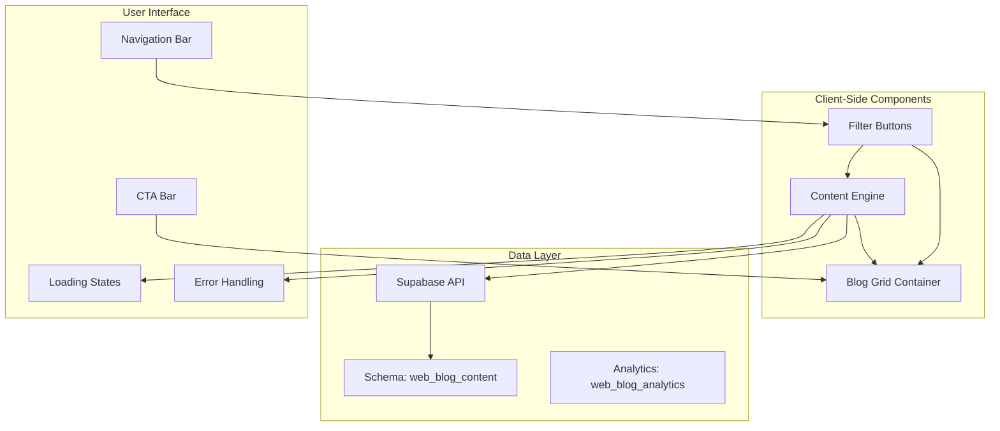
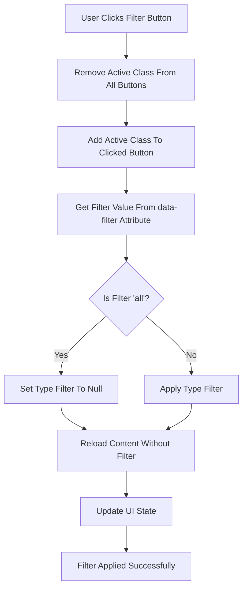
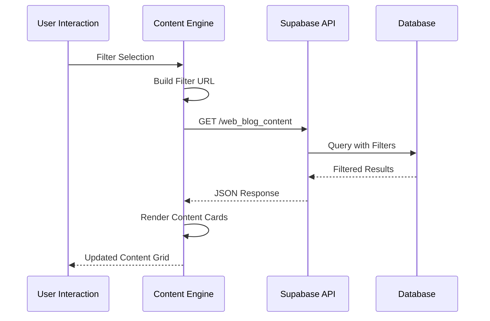
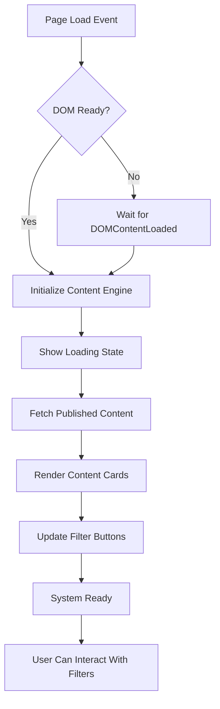
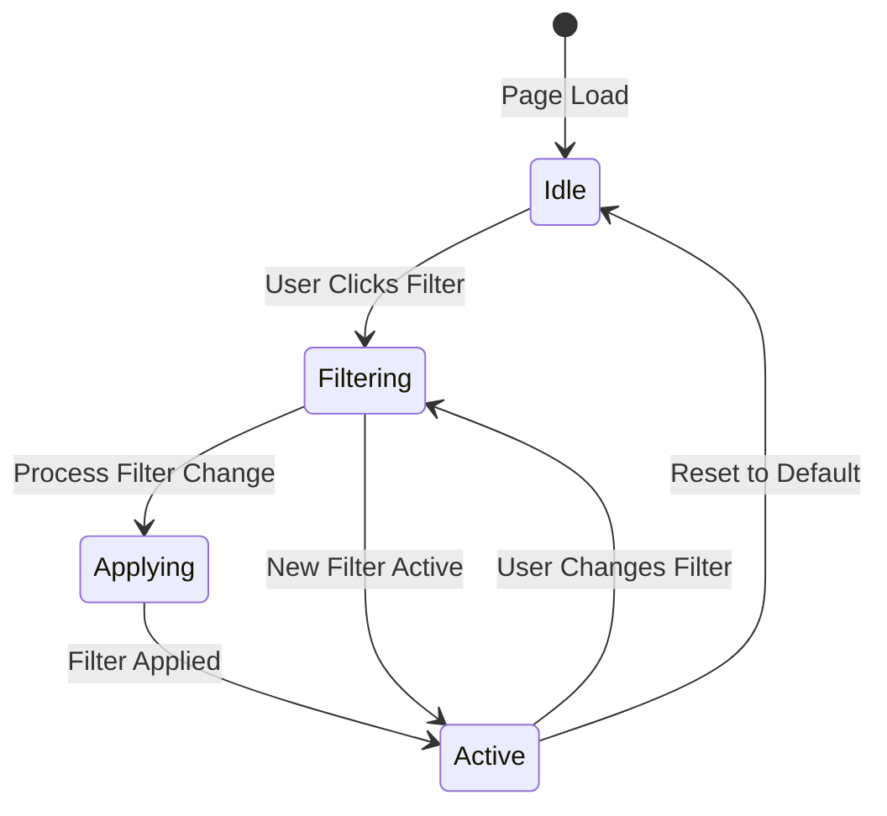
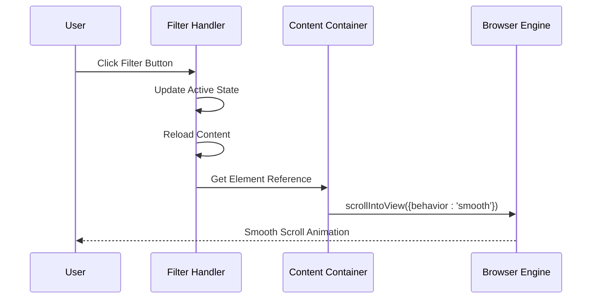
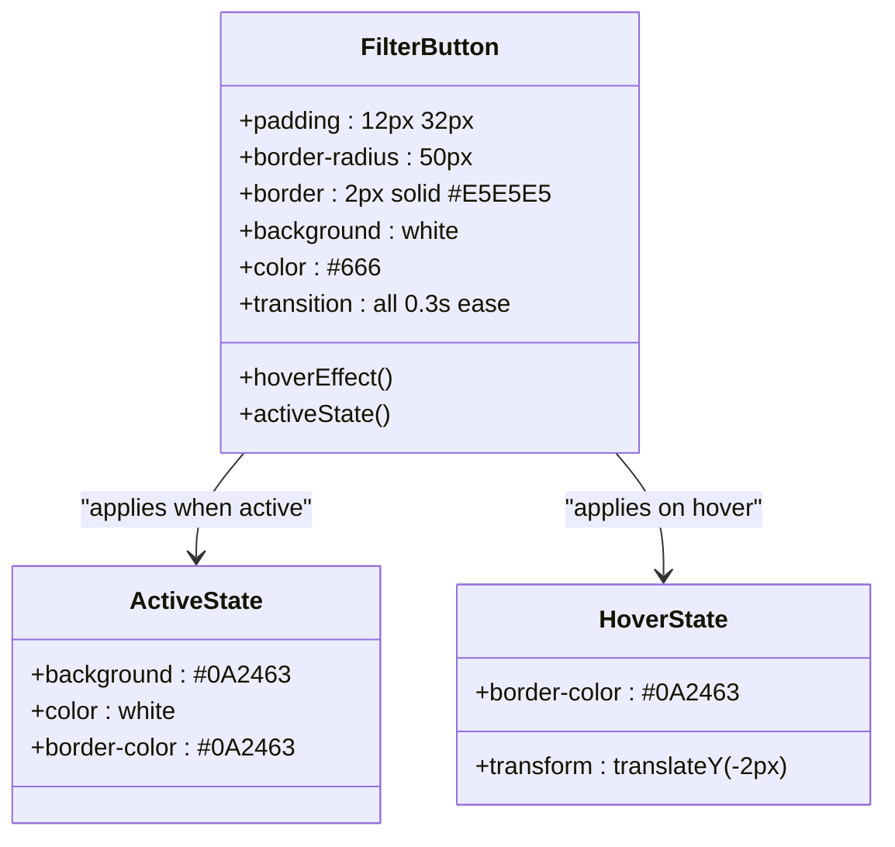
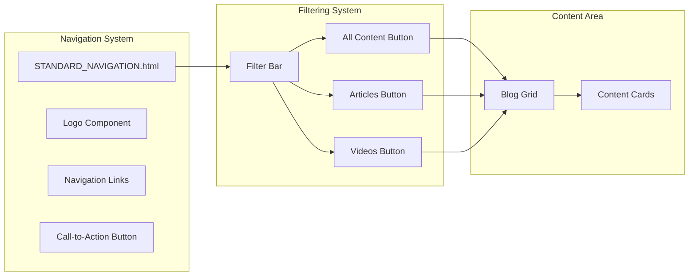

# Filtering & Navigation System

<cite>
**Referenced Files in This Document**
- [blog.html](file://marketing/blog.html)
- [blog-content.js](file://js/blog-content.js)
- [load-components.js](file://js/load-components.js)
- [STANDARD_NAVIGATION.html](file://components/STANDARD_NAVIGATION.html)
- [001_initial_blog_schema.sql](file://supabase/migrations/001_initial_blog_schema.sql)
</cite>

## Table of Contents
1. [Introduction](#introduction)
2. [System Architecture](#system-architecture)
3. [Filter Button Implementation](#filter-button-implementation)
4. [Dynamic Content Loading](#dynamic-content-loading)
5. [Initialization Process](#initialization-process)
6. [Filter State Management](#filter-state-management)
7. [Smooth Scrolling Behavior](#smooth-scrolling-behavior)
8. [Styling and User Experience](#styling-and-user-experience)
9. [Integration with Blog Hub Interface](#integration-with-blog-hub-interface)
10. [Extending Filter Options](#extending-filter-options)
11. [Customizing Filter Behavior](#customizing-filter-behavior)
12. [Performance Considerations](#performance-considerations)
13. [Troubleshooting Guide](#troubleshooting-guide)
14. [Conclusion](#conclusion)

## Introduction

The Filtering & Navigation System is a sophisticated client-side solution that enables users to categorize and navigate TrueVow's blog content by type and featured status. Built with modern JavaScript and integrated with Supabase for data management, this system provides seamless filtering capabilities with smooth user interactions and responsive design.

The system consists of three primary components: filter buttons with active state management, dynamic content reloading mechanisms, and smooth scrolling behavior. These components work together to create an intuitive user experience for browsing blog content across multiple platforms including LinkedIn articles and YouTube videos.

## System Architecture

The filtering system follows a modular architecture with clear separation of concerns:

**Diagram sources**
- [blog-content.js](file://js/blog-content.js#L1-L424)
- [blog.html](file://marketing/blog.html#L427-L440)

The architecture ensures that filter interactions trigger immediate content updates without page reloads, providing instant feedback to users while maintaining optimal performance.

**Section sources**
- [blog-content.js](file://js/blog-content.js#L1-L424)
- [blog.html](file://marketing/blog.html#L427-L440)

## Filter Button Implementation

The filter button system consists of three primary filter categories with distinct styling and behavior:

### Filter Button Structure

Each filter button is implemented as a styled HTML button with the following attributes:
- `class="filter-btn"` for base styling
- `data-filter` attribute containing the filter value (`all`, `article`, `video`)
- `active` class for currently selected state

### Active State Management

The active state management system operates through a centralized function that handles button state transitions:

**Diagram sources**
- [blog-content.js](file://js/blog-content.js#L390-L414)

### Filter Categories

The system supports three distinct filter categories:

| Filter Value | Display Text | Data Type | Platform |
|-------------|--------------|-----------|----------|
| `all` | All Content | Mixed | Both LinkedIn & YouTube |
| `article` | 📄 Articles (LinkedIn) | Text | LinkedIn |
| `video` | 🎥 Videos (YouTube) | Video | YouTube |

**Section sources**
- [blog.html](file://marketing/blog.html#L429-L434)
- [blog-content.js](file://js/blog-content.js#L356-L366)

## Dynamic Content Loading

The dynamic content loading system is built around a comprehensive content engine that handles data fetching, rendering, and state management:

### Content Fetching Mechanism

The `fetchBlogContent` function implements intelligent filtering with support for multiple criteria:

**Diagram sources**
- [blog-content.js](file://js/blog-content.js#L26-L64)

### Filter Criteria Support

The content engine supports multiple filter criteria through URL parameter construction:

| Parameter | Type | Description | Example |
|-----------|------|-------------|---------|
| `type` | String | Content type filter | `type=eq.article` |
| `is_featured` | Boolean | Featured content filter | `is_featured=eq.true` |
| `status` | String | Content status filter | `status=eq.published` |
| `limit` | Number | Result count limit | `limit=12` |

### Content Rendering Pipeline

The rendering pipeline processes fetched content through several stages:

1. **Container Preparation**: Validates and prepares the target container
2. **Content Processing**: Transforms raw data into structured content items
3. **Card Generation**: Creates individual content cards with platform-specific styling
4. **Analytics Attachment**: Adds click tracking to all content links
5. **State Updates**: Updates filter button states and UI feedback

**Section sources**
- [blog-content.js](file://js/blog-content.js#L109-L219)

## Initialization Process

The initialization process ensures that the filtering system is fully functional upon page load:

### Auto-Initialization Sequence

**Diagram sources**
- [blog-content.js](file://js/blog-content.js#L372-L379)

### Filter State Persistence

The initialization process includes automatic filter state detection and restoration:

- **Default State**: When no filter is specified, all content is displayed
- **State Detection**: The system checks for existing filter parameters
- **State Restoration**: Previously applied filters are reapplied on page load
- **Visual Feedback**: Active filter buttons are automatically highlighted

**Section sources**
- [blog-content.js](file://js/blog-content.js#L319-L350)

## Filter State Management

The filter state management system ensures consistent user experience across filter interactions:

### State Tracking Mechanism

The system maintains filter state through a combination of DOM manipulation and internal state tracking:

**Diagram sources**
- [blog-content.js](file://js/blog-content.js#L356-L366)

### State Synchronization

The state management system synchronizes multiple aspects of the filtering interface:

- **Button States**: Active/inactive visual indicators
- **Content Visibility**: Dynamic content grid updates
- **URL State**: Browser history integration
- **Analytics Tracking**: Filter usage metrics collection

### Cross-Browser Compatibility

The state management system includes fallback mechanisms for different browser environments:

- **Modern Browsers**: Full ES6+ support with async/await
- **Legacy Support**: Polyfills for older browser environments
- **Graceful Degradation**: Basic functionality without JavaScript

**Section sources**
- [blog-content.js](file://js/blog-content.js#L356-L366)

## Smooth Scrolling Behavior

The smooth scrolling system provides enhanced user experience during filter interactions:

### Scroll Position Management

**Diagram sources**
- [blog-content.js](file://js/blog-content.js#L408-L412)

### Scroll Configuration

The smooth scrolling behavior is configured with the following parameters:

| Parameter | Value | Purpose |
|-----------|-------|---------|
| `behavior` | `'smooth'` | Enables smooth animation |
| `block` | `'start'` | Positions container at viewport start |
| `inline` | `'nearest'` | Maintains horizontal alignment |

### User Experience Enhancements

The scrolling system provides several user experience benefits:

- **Visual Continuity**: Content appears to move smoothly during updates
- **Context Preservation**: Users maintain visual connection to content
- **Accessibility**: Screen readers and assistive technologies handle scroll events
- **Performance**: Optimized animation timing for smooth performance

**Section sources**
- [blog-content.js](file://js/blog-content.js#L408-L412)

## Styling and User Experience

The filtering system implements comprehensive styling and user experience enhancements:

### Filter Button Styling

The filter buttons utilize a sophisticated styling system with hover effects and state transitions:

**Diagram sources**
- [blog.html](file://marketing/blog.html#L119-L141)

### Responsive Design Integration

The filtering system adapts to various screen sizes and device orientations:

- **Mobile Optimization**: Filter buttons stack vertically on small screens
- **Touch Targets**: Sufficient button size for mobile interaction
- **Viewport Awareness**: Proper positioning relative to viewport boundaries
- **Orientation Handling**: Adapts to landscape and portrait modes

### Accessibility Features

The system includes comprehensive accessibility support:

- **Keyboard Navigation**: Full keyboard support for filter interaction
- **Screen Reader Compatibility**: ARIA labels and semantic markup
- **Color Contrast**: Sufficient contrast ratios for visual accessibility
- **Focus Management**: Logical tab order and focus indicators

**Section sources**
- [blog.html](file://marketing/blog.html#L119-L141)

## Integration with Blog Hub Interface

The filtering system integrates seamlessly with the broader blog hub interface:

### Navigation Integration

The filtering system works in conjunction with the standardized navigation component:

**Diagram sources**
- [blog.html](file://marketing/blog.html#L419-L440)
- [STANDARD_NAVIGATION.html](file://components/STANDARD_NAVIGATION.html#L1-L25)

### Component Loading Integration

The filtering system integrates with the component loading system:

- **Dynamic Component Loading**: Navigation and footer components are loaded asynchronously
- **Filter Button Placement**: Filter buttons are positioned within the main content area
- **Responsive Layout**: Filter system adapts to component loading completion
- **Fallback Handling**: Graceful degradation when components fail to load

### Content Grid Integration

The filtering system manages the content grid layout:

- **Grid Container**: Centralized container for all content cards
- **Responsive Grid**: CSS Grid layout with automatic column sizing
- **Content Card Templates**: Consistent card structure for all content types
- **Loading States**: Visual feedback during content updates

**Section sources**
- [blog.html](file://marketing/blog.html#L436-L440)
- [load-components.js](file://js/load-components.js#L36-L48)

## Extending Filter Options

The filtering system is designed for extensibility, allowing easy addition of new filter criteria:

### Adding New Filter Types

To implement additional filter types, follow these steps:

1. **HTML Button Creation**: Add new filter button with appropriate `data-filter` attribute
2. **JavaScript Handler Update**: Extend the filter event handler to support new criteria
3. **Content Engine Modification**: Update the `fetchBlogContent` function to handle new parameters
4. **Styling Integration**: Add appropriate CSS classes for new filter states

### Custom Filter Criteria

The system supports various types of filter criteria:

| Filter Type | Implementation Method | Use Case |
|-------------|----------------------|----------|
| Text Search | URL parameter filtering | Keyword-based content discovery |
| Date Range | Temporal filtering | Content age and recency |
| Category Tags | Multi-value filtering | Content categorization |
| Author Filtering | User-based filtering | Content creator identification |
| Platform Selection | Platform-specific filtering | Content source identification |

### Advanced Filtering Patterns

The system can accommodate complex filtering scenarios:

- **Multi-Criteria Filtering**: Combine multiple filter conditions simultaneously
- **Hierarchical Filters**: Nested filter categories with parent-child relationships
- **Dynamic Filter Lists**: Filters that change based on content availability
- **Saved Filter Presets**: Predefined filter combinations for common use cases

**Section sources**
- [blog-content.js](file://js/blog-content.js#L26-L64)
- [blog-content.js](file://js/blog-content.js#L386-L414)

## Customizing Filter Behavior

The filtering system provides extensive customization options for different deployment scenarios:

### Configuration Parameters

Several configuration parameters can be customized:

| Parameter | Default Value | Customization Options |
|-----------|---------------|----------------------|
| `SUPABASE_URL` | Production endpoint | Development/test endpoints |
| `SUPABASE_ANON_KEY` | Production key | Environment-specific keys |
| `MAX_CONTENT_LIMIT` | No limit | Performance optimization |
| `LOADING_ANIMATION` | Spinner animation | Custom loading indicators |
| `ERROR_HANDLING` | User-friendly messages | Custom error pages |

### Styling Customization

The system allows for comprehensive styling customization:

- **Color Scheme**: Complete color palette customization
- **Typography**: Font family and size adjustments
- **Layout**: Grid spacing and container dimensions
- **Animations**: Custom transition effects and timing
- **Responsive Breakpoints**: Device-specific styling adjustments

### Behavioral Customization

Filter behavior can be customized through various parameters:

- **Filter Delay**: Debouncing for rapid filter changes
- **Animation Duration**: Timing for smooth transitions
- **Scroll Behavior**: Different scroll positioning strategies
- **Loading States**: Custom loading indicators and messages
- **Error Recovery**: Automatic retry mechanisms

**Section sources**
- [blog-content.js](file://js/blog-content.js#L11-L12)
- [blog-content.js](file://js/blog-content.js#L284-L313)

## Performance Considerations

The filtering system is optimized for performance across various scenarios:

### Loading Optimization

The system implements several performance optimization strategies:

- **Lazy Loading**: Content is loaded only when needed
- **Debounced Requests**: Rapid filter changes are batched
- **Efficient DOM Manipulation**: Minimal DOM updates during filter changes
- **Image Optimization**: Lazy loading for content thumbnails
- **Memory Management**: Proper cleanup of event listeners and timers

### Network Performance

Network requests are optimized for speed and reliability:

- **Connection Pooling**: Reused connections for multiple requests
- **Compression**: Gzip compression for reduced payload sizes
- **Caching**: Strategic caching of frequently accessed content
- **Error Recovery**: Automatic retry with exponential backoff
- **Timeout Handling**: Configurable timeout values for different scenarios

### Rendering Performance

The rendering system is optimized for smooth user interactions:

- **Virtual Scrolling**: Large content sets are efficiently managed
- **CSS Animations**: Hardware-accelerated animations for smooth transitions
- **Layout Thrashing Prevention**: Batched DOM operations to minimize reflows
- **Event Delegation**: Efficient event handling for large content sets
- **Resource Loading**: Optimized loading order for critical resources

**Section sources**
- [blog-content.js](file://js/blog-content.js#L284-L313)
- [blog-content.js](file://js/blog-content.js#L386-L414)

## Troubleshooting Guide

Common issues and their solutions:

### Filter Buttons Not Responding

**Symptoms**: Filter buttons appear but don't change content
**Causes**: 
- JavaScript disabled or blocked
- DOM not fully loaded
- Event listener conflicts

**Solutions**:
- Verify JavaScript is enabled in the browser
- Check for console errors in browser developer tools
- Ensure proper DOM structure with correct element IDs
- Test with minimal JavaScript environment

### Content Loading Failures

**Symptoms**: Loading spinner appears indefinitely
**Causes**:
- Network connectivity issues
- Supabase API configuration errors
- CORS policy violations
- Authentication failures

**Solutions**:
- Verify network connectivity and firewall settings
- Check Supabase project credentials and API keys
- Review browser console for CORS-related errors
- Validate API key permissions and expiration

### Filter State Issues

**Symptoms**: Active filter state not maintained
**Causes**:
- Browser cache interference
- JavaScript execution errors
- DOM structure changes
- Session storage limitations

**Solutions**:
- Clear browser cache and cookies
- Disable ad blockers and script blockers
- Check for JavaScript errors in console
- Verify local storage availability

### Performance Problems

**Symptoms**: Slow filtering or content loading
**Causes**:
- Large content sets without pagination
- Insufficient hardware resources
- Network latency issues
- Memory leaks in JavaScript

**Solutions**:
- Implement content pagination or virtual scrolling
- Optimize images and media assets
- Use CDN for static content delivery
- Monitor memory usage and fix leaks

**Section sources**
- [blog-content.js](file://js/blog-content.js#L346-L350)
- [blog-content.js](file://js/blog-content.js#L303-L313)

## Conclusion

The Filtering & Navigation System represents a comprehensive solution for content categorization and user experience enhancement. Built with modern web standards and integrated with Supabase for robust data management, the system provides:

- **Seamless User Experience**: Instant filter interactions with smooth transitions
- **Scalable Architecture**: Modular design supporting future feature additions
- **Performance Optimization**: Efficient loading and rendering mechanisms
- **Accessibility Compliance**: Comprehensive support for diverse user needs
- **Cross-Browser Compatibility**: Reliable operation across different browser environments

The system successfully balances functionality with performance, providing users with intuitive content discovery while maintaining optimal loading speeds and responsive interactions. Its extensible design ensures that additional filtering criteria and customization options can be easily integrated as requirements evolve.

Through careful attention to user experience, technical implementation, and performance optimization, this filtering system serves as a foundation for scalable content management solutions in modern web applications.