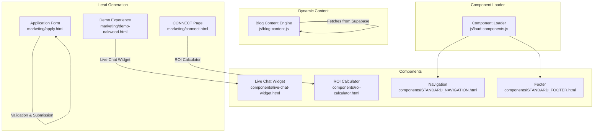
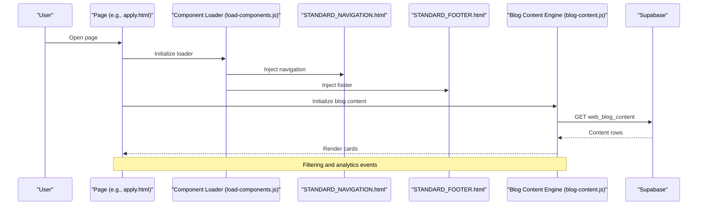
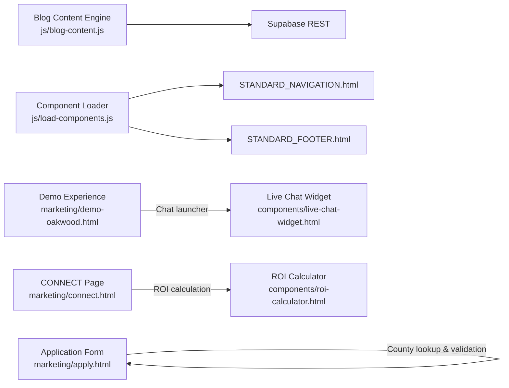

# Core Features

<cite>
**Referenced Files in This Document**
- [blog-content.js](file://js/blog-content.js)
- [load-components.js](file://js/load-components.js)
- [live-chat-widget.html](file://components/live-chat-widget.html)
- [roi-calculator.html](file://components/roi-calculator.html)
- [apply.html](file://marketing/apply.html)
- [connect.html](file://marketing/connect.html)
- [demo-oakwood.html](file://marketing/demo-oakwood.html)
- [STANDARD_NAVIGATION.html](file://components/STANDARD_NAVIGATION.html)
- [STANDARD_FOOTER.html](file://components/STANDARD_FOOTER.html)
</cite>

## Table of Contents
1. [Introduction](#introduction)
2. [Project Structure](#project-structure)
3. [Core Components](#core-components)
4. [Architecture Overview](#architecture-overview)
5. [Detailed Component Analysis](#detailed-component-analysis)
6. [Dependency Analysis](#dependency-analysis)
7. [Performance Considerations](#performance-considerations)
8. [Troubleshooting Guide](#troubleshooting-guide)
9. [Conclusion](#conclusion)

## Introduction
This document explains the TrueVow Website’s core features with a focus on:
- Automated blog content management (dynamic fetching, filtering, analytics)
- Lead generation (demo requests, applications, newsletter)
- Interactive widgets (live chat, ROI calculator, trust indicators)
- Form submission architecture (validation, processing, UX)
- Component-based design system (navigation, footer, promotions)

Each feature is documented with implementation details, configuration options, usage patterns, and practical examples drawn from the codebase.

## Project Structure
The website organizes features across:
- Dynamic content engine for blogs
- Component library for reusable UI parts
- Marketing pages for lead gen and demos
- Widgets for engagement and conversions
- Shared navigation and footer components

**Diagram sources**
- [blog-content.js](file://js/blog-content.js#L1-L424)
- [load-components.js](file://js/load-components.js#L1-L58)
- [live-chat-widget.html](file://components/live-chat-widget.html#L1-L515)
- [roi-calculator.html](file://components/roi-calculator.html#L1-L488)
- [apply.html](file://marketing/apply.html#L1-L800)
- [connect.html](file://marketing/connect.html#L1-L800)
- [demo-oakwood.html](file://marketing/demo-oakwood.html#L1-L800)

**Section sources**
- [blog-content.js](file://js/blog-content.js#L1-L424)
- [load-components.js](file://js/load-components.js#L1-L58)

## Core Components
- Blog Content Engine: Fetches published content from Supabase, renders cards, supports filtering, and tracks analytics.
- Component Loader: Injects standardized navigation and footer into pages.
- Live Chat Widget: On-page chat assistant with quick replies and analytics.
- ROI Calculator: Interactive calculator to quantify lost revenue and drive conversions.
- Application Form: Multi-step form for intake applications with validation and county lookup.
- CONNECT Page: Educational page with calculator and messaging to drive referrals.
- Demo Experience: Enhanced demo page integrating live chat and launcher.

**Section sources**
- [blog-content.js](file://js/blog-content.js#L1-L424)
- [load-components.js](file://js/load-components.js#L1-L58)
- [live-chat-widget.html](file://components/live-chat-widget.html#L1-L515)
- [roi-calculator.html](file://components/roi-calculator.html#L1-L488)
- [apply.html](file://marketing/apply.html#L1-L800)
- [connect.html](file://marketing/connect.html#L1-L800)
- [demo-oakwood.html](file://marketing/demo-oakwood.html#L1-L800)

## Architecture Overview
The system integrates client-side JavaScript with Supabase-backed data and reusable HTML components. The flow below shows how pages consume shared components and dynamic content.

**Diagram sources**
- [load-components.js](file://js/load-components.js#L1-L58)
- [STANDARD_NAVIGATION.html](file://components/STANDARD_NAVIGATION.html)
- [STANDARD_FOOTER.html](file://components/STANDARD_FOOTER.html)
- [blog-content.js](file://js/blog-content.js#L1-L424)

## Detailed Component Analysis

### Automated Blog Content Management System
- Purpose: Dynamically fetch, filter, and render published blog content; track views and clicks.
- Data source: Supabase REST endpoint for web_blog_content and web_blog_analytics.
- Rendering: Grid of cards with type badges, thumbnails or fallback gradients, and external links.
- Filtering: By type (article/video/all) and featured flag; updates active filter UI.
- Analytics: Tracks page views and clicks with optional Google Analytics forwarding.

Implementation highlights:
- Fetch function builds URL with filters and selects specific columns.
- Render function creates cards, attaches click handlers, and logs analytics.
- Filter buttons trigger reloads and smooth scroll to content grid.
- Utility functions for escaping HTML, formatting dates, and loading/error states.

Usage patterns:
- Place a container with id “blog-grid” to render content.
- Call initialization or use exported window.BlogContentEngine methods externally.

Configuration options:
- Supabase URL and anonymous key are configured at the top of the script.
- Select columns and filter parameters are adjustable via options passed to fetchBlogContent.

Practical examples:
- Initialize on page load with automatic DOM selection.
- Programmatically call initBlogContent with type/featured/limit options.
- Exported window.BlogContentEngine exposes fetchBlogContent, renderBlogCards, trackContentAnalytics, and initBlogContent.

**Section sources**
- [blog-content.js](file://js/blog-content.js#L1-L424)

### Component-Based Design System (Navigation & Footer)
- Purpose: Centralized navigation and footer injection for consistency across pages.
- Mechanism: Fetches HTML from single source files and injects into placeholders.
- Usage: Placeholders with ids “truevow-navigation” and “truevow-footer” are replaced with component HTML.

Implementation highlights:
- Asynchronous fetch and innerHTML injection.
- Graceful logging for missing targets or failed loads.
- Initialization on DOM ready.

Practical examples:
- Include the loader script on pages needing navigation/footer.
- Ensure placeholder elements exist for injection.

**Section sources**
- [load-components.js](file://js/load-components.js#L1-L58)
- [STANDARD_NAVIGATION.html](file://components/STANDARD_NAVIGATION.html)
- [STANDARD_FOOTER.html](file://components/STANDARD_FOOTER.html)

### Interactive Widget System

#### Live Chat Assistant
- Purpose: Provide instant answers and improve conversion through on-page chat.
- Features: Floating launcher, chat window with agent bubbles, quick replies, typing indicators, and voice toggle.
- Analytics: Tracks open and message sent events.

Implementation highlights:
- Inline styles and script define UI, state, and behavior.
- Quick reply responses keyed by keyword detection in user messages.
- Voice toggle and theme switcher included for enhanced UX.

Practical examples:
- Add the component HTML before closing body tag.
- Customize responses and styling via embedded variables and CSS variables.

**Section sources**
- [live-chat-widget.html](file://components/live-chat-widget.html#L1-L515)

#### ROI Calculator
- Purpose: Quantify lost revenue without TrueVow to drive conversions.
- Features: Sliders for calls, conversion rate, and case value; real-time calculations; visual breakdown and CTA.

Implementation highlights:
- Calculates “before” and “after” bookings, lost revenue, and ROI multiplier.
- Updates UI on slider change and logs occasional analytics events.
- Includes a CTA click tracker.

Practical examples:
- Embed the component near hero or FAQ sections.
- Link the CTA to application page for conversion.

**Section sources**
- [roi-calculator.html](file://components/roi-calculator.html#L1-L488)

### Form Submission Architecture
- Application Form (Intake):
  - Multi-step form with progress indicators.
  - Validation for phone format and ZIP-to-county lookup.
  - Eligibility checkboxes and bar license requirement.
  - Review summary and modal confirmation.

- CONNECT Page:
  - Educational page with ROI calculator for referral losses.
  - Pricing cards and testimonials.
  - Objections and FAQ sections.

- Demo Experience:
  - Enhanced demo page integrating live chat and launcher.
  - Styling and animations for engagement.

Implementation highlights:
- Phone formatting and validation helpers.
- ZIP code to county resolution and capacity alerts.
- Eligibility messaging and bar license prompt.
- Modal overlays and responsive design.

Practical examples:
- Use the multi-step form pattern for complex lead capture.
- Combine ROI calculator with CTAs to application page.
- Integrate live chat launcher for demo pages.

**Section sources**
- [apply.html](file://marketing/apply.html#L1-L800)
- [connect.html](file://marketing/connect.html#L1-L800)
- [demo-oakwood.html](file://marketing/demo-oakwood.html#L1-L800)

### Lead Generation System
- Demo Request Forms:
  - Demo landing pages with integrated chat and CTAs.
  - Streamlined flows to capture interest and schedule demos.

- Application Forms:
  - Comprehensive intake application with practice details, eligibility, and review.
  - County selection with capacity checks and ZIP lookup.

- Newsletter Subscriptions:
  - While not explicitly shown in the referenced files, newsletter integration can be added via standard form patterns and analytics tagging.

Implementation highlights:
- Progressive disclosure and validation at each step.
- County capacity messaging and eligibility confirmation.
- Review step with editable summary.

Practical examples:
- Use the multi-step form pattern for demo and application flows.
- Add analytics events for form steps and submissions.

**Section sources**
- [apply.html](file://marketing/apply.html#L1-L800)
- [demo-oakwood.html](file://marketing/demo-oakwood.html#L1-L800)

## Dependency Analysis
Key dependencies and relationships:
- Blog Content Engine depends on Supabase REST endpoints and browser fetch API.
- Component Loader depends on presence of placeholder elements and static HTML files.
- Live Chat Widget is self-contained with inline styles and scripts.
- ROI Calculator is self-contained with inline styles and scripts.
- Application and CONNECT pages depend on component loader for navigation/footer and on blog content engine for hub pages.

**Diagram sources**
- [blog-content.js](file://js/blog-content.js#L1-L424)
- [load-components.js](file://js/load-components.js#L1-L58)
- [live-chat-widget.html](file://components/live-chat-widget.html#L1-L515)
- [roi-calculator.html](file://components/roi-calculator.html#L1-L488)
- [apply.html](file://marketing/apply.html#L1-L800)
- [connect.html](file://marketing/connect.html#L1-L800)
- [demo-oakwood.html](file://marketing/demo-oakwood.html#L1-L800)

**Section sources**
- [blog-content.js](file://js/blog-content.js#L1-L424)
- [load-components.js](file://js/load-components.js#L1-L58)

## Performance Considerations
- Lazy loading: Consider deferring non-critical components (e.g., chat widget) until user interaction.
- CDN assets: Serve static components and fonts via CDN to reduce latency.
- Minimize reflows: Batch DOM updates in blog rendering and form steps.
- Analytics throttling: The ROI calculator logs analytics occasionally to avoid frequent calls.
- Image optimization: Prefer modern formats and lazy-loading for blog thumbnails.

## Troubleshooting Guide
Common issues and resolutions:
- Blog content not loading:
  - Verify Supabase URL and anonymous key configuration.
  - Check network tab for REST errors and CORS policies.
  - Confirm container id “blog-grid” exists.

- Component loader errors:
  - Ensure placeholder elements exist and are not removed by server-side rendering.
  - Check console for fetch failures and 404s for component files.

- Form validation problems:
  - Phone format validation triggers on blur; ensure proper input masks.
  - ZIP-to-county resolution requires valid US ZIP codes.

- Live Chat analytics:
  - Analytics rely on global gtag; ensure Google Analytics is loaded.

**Section sources**
- [blog-content.js](file://js/blog-content.js#L1-L424)
- [load-components.js](file://js/load-components.js#L1-L58)
- [apply.html](file://marketing/apply.html#L1-L800)
- [live-chat-widget.html](file://components/live-chat-widget.html#L1-L515)

## Conclusion
TrueVow’s core features combine a robust dynamic content engine, reusable component system, interactive widgets, and a well-structured form architecture. These components work together to deliver a consistent, engaging, and conversion-focused user experience across marketing and application pages. The modular design enables easy maintenance and extension, while built-in analytics and filtering enhance operational insights.