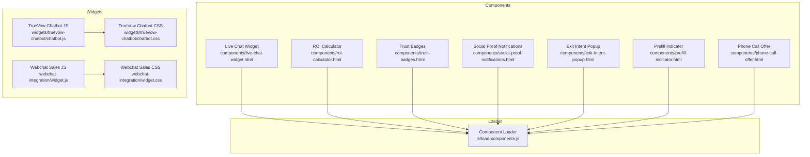
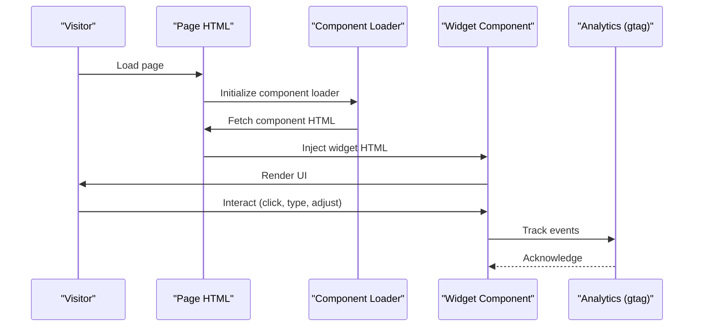
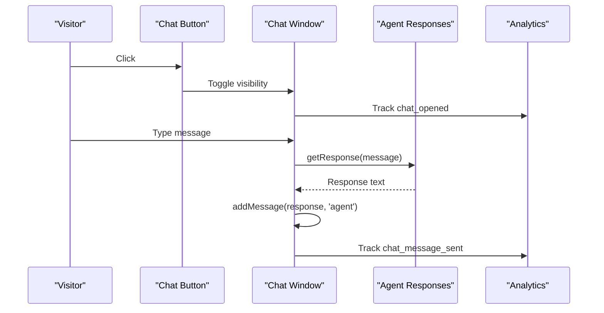
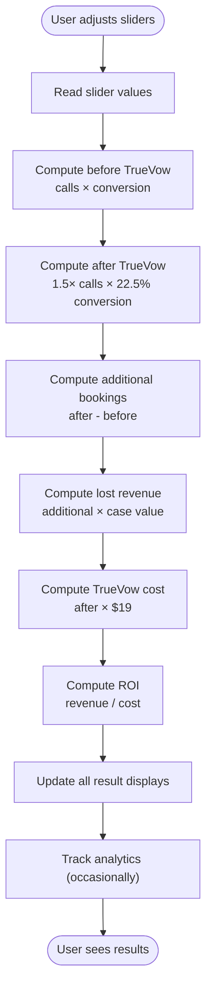
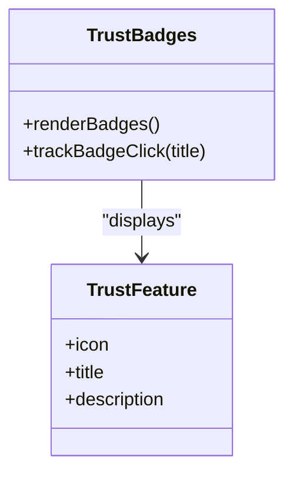
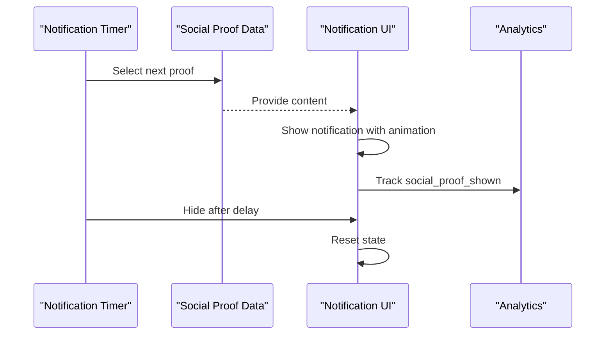
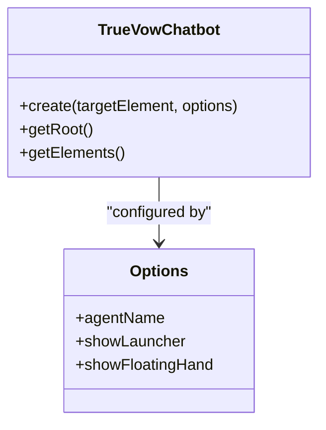
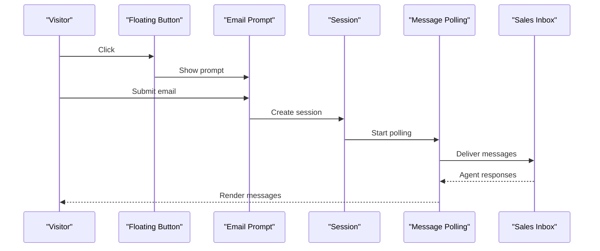
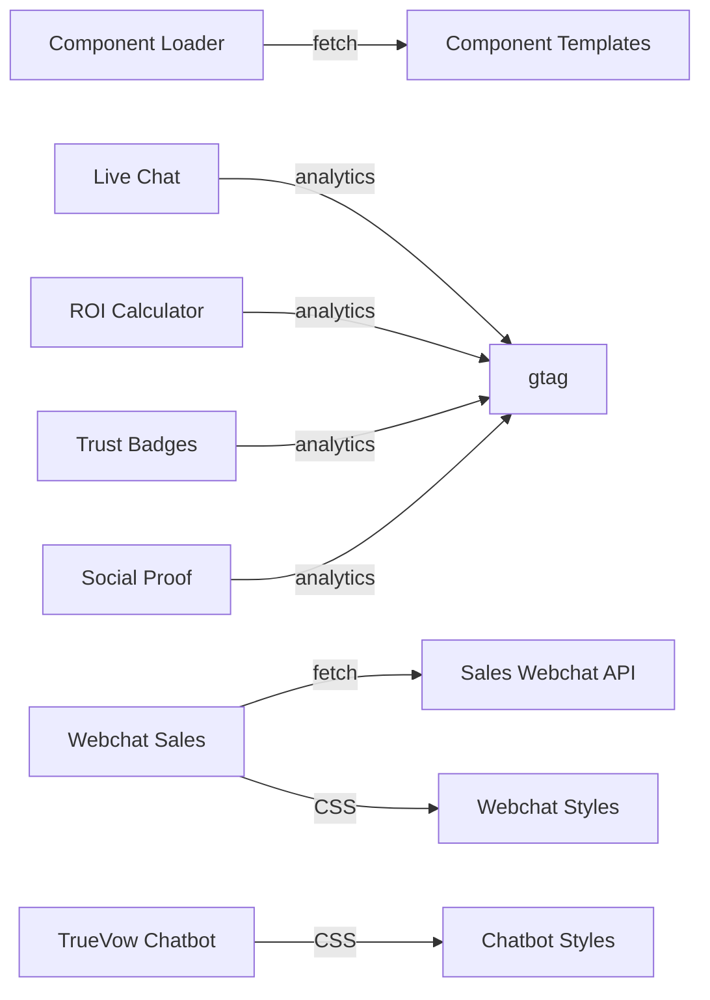

# Interactive Widget System

<cite>
**Referenced Files in This Document**
- [live-chat-widget.html](file://components/live-chat-widget.html)
- [roi-calculator.html](file://components/roi-calculator.html)
- [trust-badges.html](file://components/trust-badges.html)
- [social-proof-notifications.html](file://components/social-proof-notifications.html)
- [chatbot.js](file://widgets/truevow-chatbot/chatbot.js)
- [chatbot.css](file://widgets/truevow-chatbot/chatbot.css)
- [widget.js](file://webchat-integration/widget.js)
- [widget.css](file://webchat-integration/widget.css)
- [integration-example.html](file://webchat-integration/integration-example.html)
- [load-components.js](file://js/load-components.js)
- [exit-intent-popup.html](file://components/exit-intent-popup.html)
- [prefill-indicator.html](file://components/prefill-indicator.html)
- [phone-call-offer.html](file://components/phone-call-offer.html)
</cite>

## Table of Contents
1. [Introduction](#introduction)
2. [Project Structure](#project-structure)
3. [Core Components](#core-components)
4. [Architecture Overview](#architecture-overview)
5. [Detailed Component Analysis](#detailed-component-analysis)
6. [Dependency Analysis](#dependency-analysis)
7. [Performance Considerations](#performance-considerations)
8. [Troubleshooting Guide](#troubleshooting-guide)
9. [Conclusion](#conclusion)
10. [Appendices](#appendices)

## Introduction
This document describes the Interactive Widget System used to enhance user engagement and conversion on the TrueVow website. It covers four primary interactive elements:
- Live chat assistance with intelligent keyword-based responses
- ROI calculator with dynamic input validation and result presentation
- Trust badges showcasing security and compliance credentials
- Social proof notifications highlighting recent user actions

Additionally, it documents two specialized chatbot implementations:
- A lightweight, embeddable sales-focused chat widget
- A customizable, themeable chatbot framework with launcher and voice capabilities

The system emphasizes independent deployment, customization, responsive design, and integration patterns suitable for embedding across the website.

## Project Structure
The widget system is organized into reusable HTML components and modular JavaScript/CSS assets. Key locations:
- Components: HTML templates for each widget placed under components/
- Widgets: Specialized chatbot implementations under widgets/truevow-chatbot and webchat-integration
- Scripts: Dynamic component loader under js/load-components.js
- Assets: Shared styling and animations under widgets/truevow-chatbot and webchat-integration

**Diagram sources**
- [live-chat-widget.html](file://components/live-chat-widget.html#L1-L515)
- [roi-calculator.html](file://components/roi-calculator.html#L1-L488)
- [trust-badges.html](file://components/trust-badges.html#L1-L240)
- [social-proof-notifications.html](file://components/social-proof-notifications.html#L1-L209)
- [chatbot.js](file://widgets/truevow-chatbot/chatbot.js#L1-L99)
- [chatbot.css](file://widgets/truevow-chatbot/chatbot.css#L1-L614)
- [widget.js](file://webchat-integration/widget.js#L1-L358)
- [widget.css](file://webchat-integration/widget.css#L1-L346)
- [load-components.js](file://js/load-components.js#L1-L58)

**Section sources**
- [load-components.js](file://js/load-components.js#L1-L58)

## Core Components
This section outlines the four primary interactive widgets and their roles.

- Live Chat Widget
  - Provides immediate assistance with animated button, typing indicators, and quick replies
  - Implements keyword-based responses and basic analytics tracking
  - Responsive layout adapts to mobile screens

- ROI Calculator
  - Interactive sliders for inbound calls, conversion rate, and average case value
  - Computes before/after scenarios and presents financial impact
  - Tracks adjustments and CTA clicks for analytics

- Trust Badges
  - Displays verified security and compliance credentials
  - Highlights privacy, payment security, uptime, and support quality
  - Tracks badge interactions

- Social Proof Notifications
  - Rotating notifications showing recent user actions
  - Pauses near the bottom of the page to encourage conversions
  - Tracks impressions and dismissals

**Section sources**
- [live-chat-widget.html](file://components/live-chat-widget.html#L1-L515)
- [roi-calculator.html](file://components/roi-calculator.html#L1-L488)
- [trust-badges.html](file://components/trust-badges.html#L1-L240)
- [social-proof-notifications.html](file://components/social-proof-notifications.html#L1-L209)

## Architecture Overview
The system follows a modular, component-based architecture:
- Each widget is a self-contained HTML template with embedded CSS and JavaScript
- A central component loader fetches and injects navigation/footer components
- Two distinct chatbot implementations serve different use cases:
  - Lightweight sales-focused chat for marketing pages
  - Feature-rich, themeable chatbot with launcher and voice controls

**Diagram sources**
- [load-components.js](file://js/load-components.js#L14-L31)
- [live-chat-widget.html](file://components/live-chat-widget.html#L420-L427)
- [roi-calculator.html](file://components/roi-calculator.html#L458-L467)
- [trust-badges.html](file://components/trust-badges.html#L225-L237)
- [social-proof-notifications.html](file://components/social-proof-notifications.html#L160-L166)

## Detailed Component Analysis

### Live Chat Widget Implementation
The live chat widget provides a floating button that toggles a full chat interface. It includes:
- Animated floating button with pulse effect and badge indicator
- Chat header with avatar and online status
- Message history with user and agent bubbles
- Quick replies for common questions
- Typing indicators and simulated agent responses
- Analytics events for opening and sending messages

**Diagram sources**
- [live-chat-widget.html](file://components/live-chat-widget.html#L410-L470)

Key implementation patterns:
- DOM manipulation for toggling visibility and updating content
- Keyword-based response routing with a simple lookup table
- Simulated typing delay using timeouts
- Event-driven analytics integration

Responsive design:
- Adapts chat window size on smaller screens
- Maintains readability and usability on mobile devices

**Section sources**
- [live-chat-widget.html](file://components/live-chat-widget.html#L1-L515)

### ROI Calculator Functionality
The ROI calculator computes potential revenue loss and benefits:
- Inputs: Monthly inbound calls, current conversion rate, average case value
- Calculations: Before/after booking counts, additional revenue, ROI multiplier
- Presentation: Clear before/after cards, impact summary, breakdown metrics
- Analytics: Periodic tracking of adjustments and CTA clicks

**Diagram sources**
- [roi-calculator.html](file://components/roi-calculator.html#L419-L468)

Validation and UX:
- Real-time updates as users adjust sliders
- Clear formatting for currency and percentages
- Responsive grid layout for results and breakdown

**Section sources**
- [roi-calculator.html](file://components/roi-calculator.html#L1-L488)

### Trust Badge Components
Trust badges communicate security and compliance credentials:
- SOC 2 Type II certification
- ABA compliance
- HIPAA compliance
- State bar verification
- Additional trust features: privacy, secure payments, uptime, support quality

**Diagram sources**
- [trust-badges.html](file://components/trust-badges.html#L141-L222)

Interaction:
- Click tracking for each badge
- Hover effects and visual feedback
- Responsive grid layout

**Section sources**
- [trust-badges.html](file://components/trust-badges.html#L1-L240)

### Social Proof Notifications
Real-time notifications highlight recent user actions to increase trust and urgency:
- Rotating notification carousel with avatar, name, city, and action
- Automatic cycling with pause near the bottom of the page
- Analytics tracking for impressions and dismissals

**Diagram sources**
- [social-proof-notifications.html](file://components/social-proof-notifications.html#L145-L194)

Behavior:
- Starts after a delay, cycles every 30 seconds
- Pauses when user scrolls near the bottom
- Supports manual dismissal

**Section sources**
- [social-proof-notifications.html](file://components/social-proof-notifications.html#L1-L209)

### TrueVow Chatbot Framework
The TrueVow Chatbot provides a flexible, themeable chat experience with:
- Configurable launcher and floating hand
- Voice toggle and theme switcher
- Animated UI with multiple themes
- Accessible controls and keyboard support

**Diagram sources**
- [chatbot.js](file://widgets/truevow-chatbot/chatbot.js#L69-L95)

Integration:
- Self-contained module exposing a factory function
- Generates templated HTML with configurable options
- Provides element accessors for advanced customization

**Section sources**
- [chatbot.js](file://widgets/truevow-chatbot/chatbot.js#L1-L99)
- [chatbot.css](file://widgets/truevow-chatbot/chatbot.css#L1-L614)

### Webchat Sales Widget
The sales-focused webchat integrates seamlessly into marketing pages:
- Minimal footprint with floating button
- Email prompt to distinguish customers vs. prospects
- Session-based messaging with polling
- Customer redirect flow for existing customers

**Diagram sources**
- [widget.js](file://webchat-integration/widget.js#L175-L341)

Security and UX:
- Escapes HTML to prevent XSS
- Disabled states during loading/sending
- Mobile-responsive layout

**Section sources**
- [widget.js](file://webchat-integration/widget.js#L1-L358)
- [widget.css](file://webchat-integration/widget.css#L1-L346)
- [integration-example.html](file://webchat-integration/integration-example.html#L1-L84)

## Dependency Analysis
The system exhibits loose coupling among components:
- Components are self-contained with internal state and DOM manipulation
- The component loader depends on fetch APIs and DOM injection
- Chatbots are independent modules with minimal external dependencies
- Analytics integration is optional and gated behind feature detection

**Diagram sources**
- [load-components.js](file://js/load-components.js#L14-L31)
- [live-chat-widget.html](file://components/live-chat-widget.html#L420-L427)
- [roi-calculator.html](file://components/roi-calculator.html#L458-L467)
- [trust-badges.html](file://components/trust-badges.html#L225-L237)
- [social-proof-notifications.html](file://components/social-proof-notifications.html#L160-L166)
- [widget.js](file://webchat-integration/widget.js#L223-L243)

**Section sources**
- [load-components.js](file://js/load-components.js#L1-L58)
- [widget.js](file://webchat-integration/widget.js#L1-L358)

## Performance Considerations
- Lazy initialization: Widgets initialize on demand to minimize initial load
- Debounced analytics: ROI calculator tracks changes infrequently to reduce overhead
- Efficient DOM updates: Components update only changed elements
- CSS animations: Use hardware-accelerated properties where possible
- Mobile-first design: Media queries optimize rendering on smaller screens
- Resource bundling: Keep widget assets minimal and cacheable

## Troubleshooting Guide
Common issues and resolutions:
- Analytics not firing: Verify gtag is loaded before widget initialization
- Chat not responding: Check network connectivity and API endpoints
- Sliders not updating: Confirm event handlers are attached and values are parsed correctly
- Styling conflicts: Inspect z-index and CSS specificity around widget containers
- Mobile layout problems: Test media queries and ensure viewport meta tag is present

Debugging tips:
- Use browser developer tools to inspect widget DOM and event listeners
- Monitor network tab for failed fetch requests
- Check console for JavaScript errors
- Validate widget initialization order relative to page load

**Section sources**
- [live-chat-widget.html](file://components/live-chat-widget.html#L420-L427)
- [roi-calculator.html](file://components/roi-calculator.html#L458-L467)
- [widget.js](file://webchat-integration/widget.js#L223-L243)

## Conclusion
The Interactive Widget System delivers a cohesive set of engagement tools designed for independent deployment and customization. The modular architecture ensures each widget can be integrated separately while maintaining consistent behavior and analytics tracking. The dual chatbot implementations serve distinct use cases—sales-focused and feature-rich—while the trust and social proof elements reinforce credibility and urgency. With responsive design and performance-conscious implementation, the system scales effectively across device sizes and traffic loads.

## Appendices

### Integration Patterns
- Embed components before the closing body tag for optimal performance
- Use the component loader to dynamically inject navigation and footer components
- For chatbots, include CSS and JS assets and initialize with appropriate options
- Ensure analytics library is available before widget initialization

### Configuration Examples
- Live Chat: Customize agent name and quick replies by editing the response table
- ROI Calculator: Adjust slider ranges and assumptions in the calculation logic
- Trust Badges: Add or modify badge entries and descriptions
- Social Proof: Extend the data array with new entries and adjust timing intervals
- TrueVow Chatbot: Configure agent name and visibility options during creation
- Webchat Sales: Set API base URL and positioning options during initialization

### Event Handling
- All widgets support analytics events for engagement and conversion tracking
- Chat widgets implement keyboard shortcuts and accessibility attributes
- Social proof notifications pause on scroll near conversion points