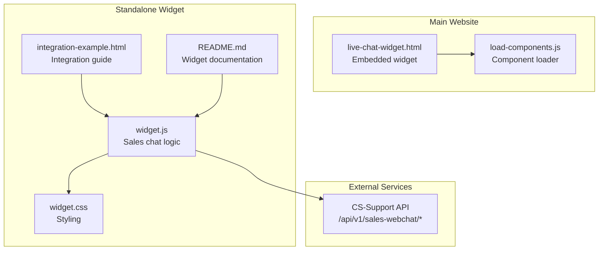
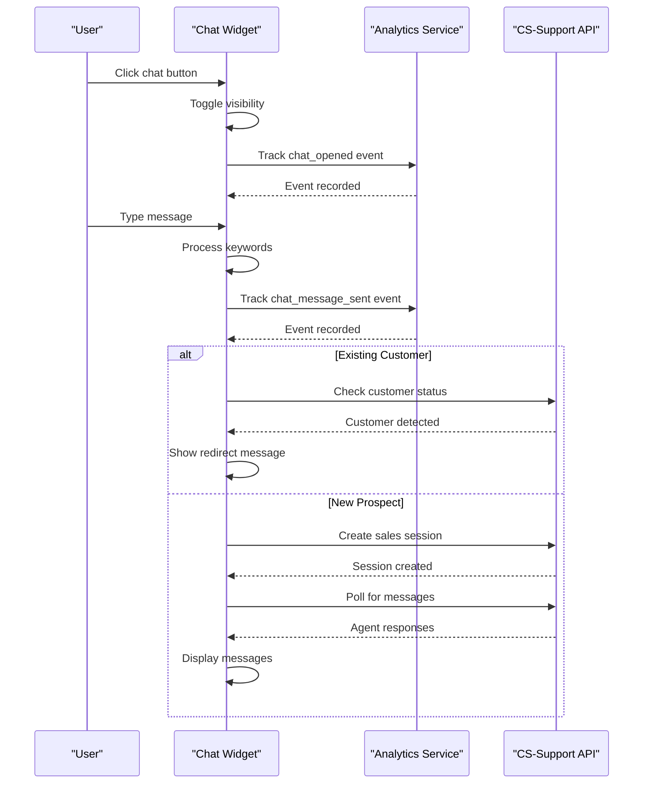
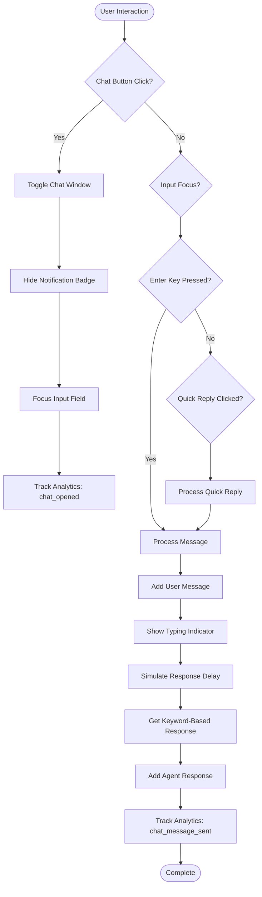
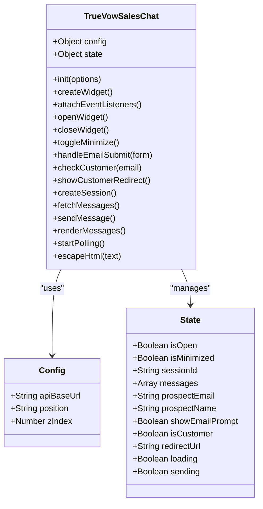
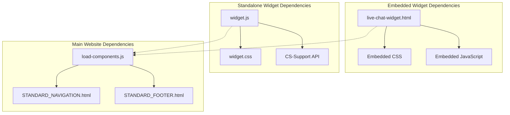

# Live Chat Widget

<cite>
**Referenced Files in This Document**
- [live-chat-widget.html](file://PRODUCTION_DEPLOY/components/live-chat-widget.html)
- [widget.js](file://webchat-integration/widget.js)
- [widget.css](file://webchat-integration/widget.css)
- [integration-example.html](file://webchat-integration/integration-example.html)
- [README.md](file://webchat-integration/README.md)
- [load-components.js](file://PRODUCTION_DEPLOY/js/load-components.js)
</cite>

## Table of Contents
1. [Introduction](#introduction)
2. [Project Structure](#project-structure)
3. [Core Components](#core-components)
4. [Architecture Overview](#architecture-overview)
5. [Detailed Component Analysis](#detailed-component-analysis)
6. [Dependency Analysis](#dependency-analysis)
7. [Performance Considerations](#performance-considerations)
8. [Troubleshooting Guide](#troubleshooting-guide)
9. [Conclusion](#conclusion)

## Introduction
This document provides comprehensive documentation for the Live Chat Widget components used in the TrueVow marketing website. It covers two distinct implementations:
- A lightweight, self-contained HTML/CSS/JavaScript widget embedded directly into pages
- A standalone JavaScript widget with customer detection and sales-focused messaging

Both implementations deliver a modern, responsive chat interface with animated elements, typing indicators, and analytics integration. The documentation explains the interactive chat interface, JavaScript functionality, responsive design, customization options, integration patterns, and troubleshooting guidance.

## Project Structure
The chat widget functionality is distributed across several files:
- A self-contained HTML widget with embedded CSS and JavaScript
- A standalone JavaScript widget with separate CSS styling
- Integration examples and documentation
- A component loader for the main website

**Diagram sources**
- [live-chat-widget.html](file://PRODUCTION_DEPLOY/components/live-chat-widget.html#L1-L515)
- [widget.js](file://webchat-integration/widget.js#L1-L358)
- [widget.css](file://webchat-integration/widget.css#L1-L346)
- [integration-example.html](file://webchat-integration/integration-example.html#L1-L84)
- [README.md](file://webchat-integration/README.md#L1-L251)

**Section sources**
- [live-chat-widget.html](file://PRODUCTION_DEPLOY/components/live-chat-widget.html#L1-L515)
- [widget.js](file://webchat-integration/widget.js#L1-L358)
- [widget.css](file://webchat-integration/widget.css#L1-L346)
- [integration-example.html](file://webchat-integration/integration-example.html#L1-L84)
- [README.md](file://webchat-integration/README.md#L1-L251)

## Core Components
The chat widget ecosystem consists of three primary components:

### Embedded Chat Widget (Self-Contained)
A complete chat interface packaged as a single HTML file with embedded CSS and JavaScript:
- Floating chat button with animated pulse effect and notification badge
- Chat window with header, message history display, typing indicators
- Quick reply buttons and input area with keyword-based response matching
- Analytics tracking integration using Google Analytics gtag
- Mobile-responsive design with media queries

### Standalone Sales Chat Widget
A JavaScript-driven widget with advanced features:
- Customer detection against external service
- Sales-focused conversation routing
- Real-time polling for message updates
- Email prompt and session management
- Mobile-responsive layout with touch-friendly controls

### Component Loader
A utility script that dynamically loads navigation and footer components from separate HTML files, supporting the main website's modular architecture.

**Section sources**
- [live-chat-widget.html](file://PRODUCTION_DEPLOY/components/live-chat-widget.html#L1-L515)
- [widget.js](file://webchat-integration/widget.js#L1-L358)
- [load-components.js](file://PRODUCTION_DEPLOY/js/load-components.js#L1-L58)

## Architecture Overview
The chat widget architecture follows a modular design pattern with clear separation of concerns:

**Diagram sources**
- [widget.js](file://webchat-integration/widget.js#L175-L221)
- [widget.js](file://webchat-integration/widget.js#L223-L243)
- [widget.js](file://webchat-integration/widget.js#L252-L273)
- [widget.js](file://webchat-integration/widget.js#L275-L288)

**Section sources**
- [widget.js](file://webchat-integration/widget.js#L1-L358)
- [README.md](file://webchat-integration/README.md#L90-L140)

## Detailed Component Analysis

### Embedded Chat Widget Implementation
The embedded widget provides a lightweight, self-contained solution perfect for quick integration:

#### Interactive Interface Elements
The widget features a comprehensive set of interactive elements:
- **Floating Chat Button**: Circular button with gradient background, animated pulse effect, and notification badge
- **Chat Window**: Fixed-position window with slide-up animation when opened
- **Header Section**: Professional header with avatar, agent name, online status indicator
- **Message History**: Scrollable message container with user and agent differentiation
- **Typing Indicators**: Animated dots showing when the agent is responding
- **Quick Reply Buttons**: Predefined responses for common questions
- **Input Area**: Text input with send button and Enter key support

#### Animation System
The widget implements sophisticated CSS animations:
- **Pulse Animation**: Subtle scaling and opacity animation for the floating button
- **Slide-Up Effect**: Smooth entrance animation for the chat window
- **Message Appearances**: Staggered animations for new messages
- **Typing Dots**: Synchronized bouncing animation for typing indicators
- **Online Status**: Blinking animation for connection status

#### JavaScript Functionality
The embedded widget includes robust JavaScript functionality:
- **Message Handling**: Real-time message addition with automatic scrolling
- **Keyword-Based Responses**: Intelligent response matching using keyword detection
- **Analytics Integration**: Automatic tracking of user interactions
- **Timing Animations**: Simulated response delays for realistic interaction
- **Quick Reply System**: Predefined responses triggered by button clicks

**Diagram sources**
- [live-chat-widget.html](file://PRODUCTION_DEPLOY/components/live-chat-widget.html#L410-L470)
- [live-chat-widget.html](file://PRODUCTION_DEPLOY/components/live-chat-widget.html#L472-L490)

**Section sources**
- [live-chat-widget.html](file://PRODUCTION_DEPLOY/components/live-chat-widget.html#L1-L515)

### Standalone Sales Chat Widget
The standalone widget offers advanced features for sales-focused conversations:

#### Customer Detection System
The widget implements intelligent customer detection:
- **Email Validation**: Form validation for prospect email collection
- **API Integration**: Communication with CS-Support service for customer verification
- **Redirect Logic**: Automatic redirection for existing customers to customer portal
- **Session Management**: Creation and maintenance of sales chat sessions

#### Real-Time Communication
Advanced real-time messaging capabilities:
- **Polling Mechanism**: 3-second intervals for message synchronization
- **Message Rendering**: Dynamic message display with timestamps
- **Loading States**: Visual feedback during API operations
- **Error Handling**: Graceful handling of network failures

#### Mobile Responsiveness
Comprehensive mobile support:
- **Responsive Layout**: Adapts to various screen sizes and orientations
- **Touch-Friendly Controls**: Large buttons and input areas for mobile use
- **Keyboard Support**: Full keyboard navigation compatibility
- **Accessibility Features**: Screen reader support and ARIA labels

**Diagram sources**
- [widget.js](file://webchat-integration/widget.js#L11-L31)
- [widget.js](file://webchat-integration/widget.js#L32-L43)

**Section sources**
- [widget.js](file://webchat-integration/widget.js#L1-L358)
- [widget.css](file://webchat-integration/widget.css#L1-L346)

### Component Loader System
The component loader enables dynamic loading of website components:

#### Modular Architecture
The loader supports:
- **Navigation Loading**: Dynamic loading of standardized navigation components
- **Footer Loading**: Automatic footer injection across pages
- **Error Handling**: Graceful failure handling for missing components
- **Asynchronous Loading**: Non-blocking component loading

#### Integration Pattern
The loader follows a simple integration pattern:
- Place placeholder elements with specific IDs
- Include the loader script in the main HTML
- The loader automatically replaces placeholders with component content

**Section sources**
- [load-components.js](file://PRODUCTION_DEPLOY/js/load-components.js#L1-L58)

## Dependency Analysis
The chat widget system exhibits clear dependency relationships:

**Diagram sources**
- [live-chat-widget.html](file://PRODUCTION_DEPLOY/components/live-chat-widget.html#L1-L515)
- [widget.js](file://webchat-integration/widget.js#L1-L358)
- [load-components.js](file://PRODUCTION_DEPLOY/js/load-components.js#L1-L58)

### Coupling and Cohesion
- **Embedded Widget**: High internal cohesion with all functionality in a single file
- **Standalone Widget**: Well-separated concerns with clear API boundaries
- **Component Loader**: Low coupling with website components through ID-based placeholders

### External Dependencies
- **CS-Support Service**: Required for standalone widget functionality
- **Google Analytics**: Optional analytics integration for embedded widget
- **Browser APIs**: Modern JavaScript features for smooth operation

**Section sources**
- [widget.js](file://webchat-integration/widget.js#L12-L16)
- [README.md](file://webchat-integration/README.md#L121-L140)

## Performance Considerations
Both widget implementations are optimized for performance:

### Embedded Widget Optimizations
- **Single File Delivery**: Reduced HTTP requests through embedded resources
- **Efficient Animations**: CSS-based animations for smooth performance
- **Minimal DOM Manipulation**: Optimized message rendering and updates
- **Lazy Loading**: Notification badge appears after initial delay to avoid blocking

### Standalone Widget Optimizations
- **Lazy Initialization**: Widget loads only when needed
- **Efficient Polling**: 3-second intervals balance responsiveness with performance
- **Memory Management**: Proper cleanup of event listeners and timers
- **Conditional Loading**: Stylesheets loaded only when widget is used

### Mobile Performance
- **Touch Events**: Optimized touch handling for mobile devices
- **Reduced Animations**: Simplified animations on lower-powered devices
- **Efficient Layout**: CSS Grid and Flexbox for optimal rendering
- **Battery Optimization**: Minimal background activity when idle

## Troubleshooting Guide

### Common Issues and Solutions

#### Widget Not Appearing
**Symptoms**: Chat button does not display on page
**Causes and Solutions**:
- Verify HTML file inclusion before closing `</body>` tag
- Check for JavaScript errors in browser console
- Ensure proper file paths to CSS and JS resources
- Confirm CSS specificity is not overridden by parent styles

#### Customer Detection Failures
**Symptoms**: Customer detection not working properly
**Causes and Solutions**:
- Verify `apiBaseUrl` configuration matches CS-Support service
- Check CORS settings on the API server
- Validate email format in the detection request
- Review network tab for API error responses

#### Message Sending Issues
**Symptoms**: Messages not being sent or received
**Causes and Solutions**:
- Check session creation success in browser console
- Verify API endpoint accessibility
- Ensure proper authentication headers
- Test with different network connections

#### Animation Problems
**Symptoms**: Animations not playing smoothly
**Causes and Solutions**:
- Check browser compatibility for CSS animations
- Verify hardware acceleration is enabled
- Reduce animation complexity on older devices
- Clear browser cache for updated styles

#### Mobile Responsiveness Issues
**Symptoms**: Widget not displaying correctly on mobile devices
**Causes and Solutions**:
- Verify viewport meta tag is present
- Check media query breakpoints
- Test with different screen sizes and orientations
- Ensure touch targets meet minimum size requirements

### Debugging Tools
- **Browser Developer Tools**: Network tab for API debugging, Console for JavaScript errors
- **Performance Profiling**: Timeline tab for animation performance analysis
- **Device Emulation**: Responsive design testing across device sizes
- **Network Throttling**: Simulate slower connections for testing

**Section sources**
- [README.md](file://webchat-integration/README.md#L186-L204)
- [widget.js](file://webchat-integration/widget.js#L223-L243)

## Conclusion
The TrueVow Live Chat Widget system provides two complementary solutions for different use cases:

### Embedded Widget Advantages
- **Simplicity**: Single-file integration with minimal setup
- **Performance**: Optimized for fast loading and smooth animations
- **Flexibility**: Easy customization through CSS overrides
- **Analytics**: Built-in tracking integration for user behavior insights

### Standalone Widget Advantages
- **Advanced Features**: Customer detection and sales-focused routing
- **Professional Design**: Sophisticated UI with advanced animations
- **Real-Time Communication**: Seamless messaging with polling mechanism
- **Mobile Optimization**: Comprehensive responsive design support

Both implementations demonstrate modern web development practices with clean code architecture, comprehensive error handling, and extensive customization options. The choice between embedded and standalone widgets depends on specific requirements for functionality, performance, and integration complexity.

The modular design ensures easy maintenance and updates, while the responsive architecture guarantees optimal user experience across all device types. The integration examples and documentation provide clear guidance for deployment and customization needs.