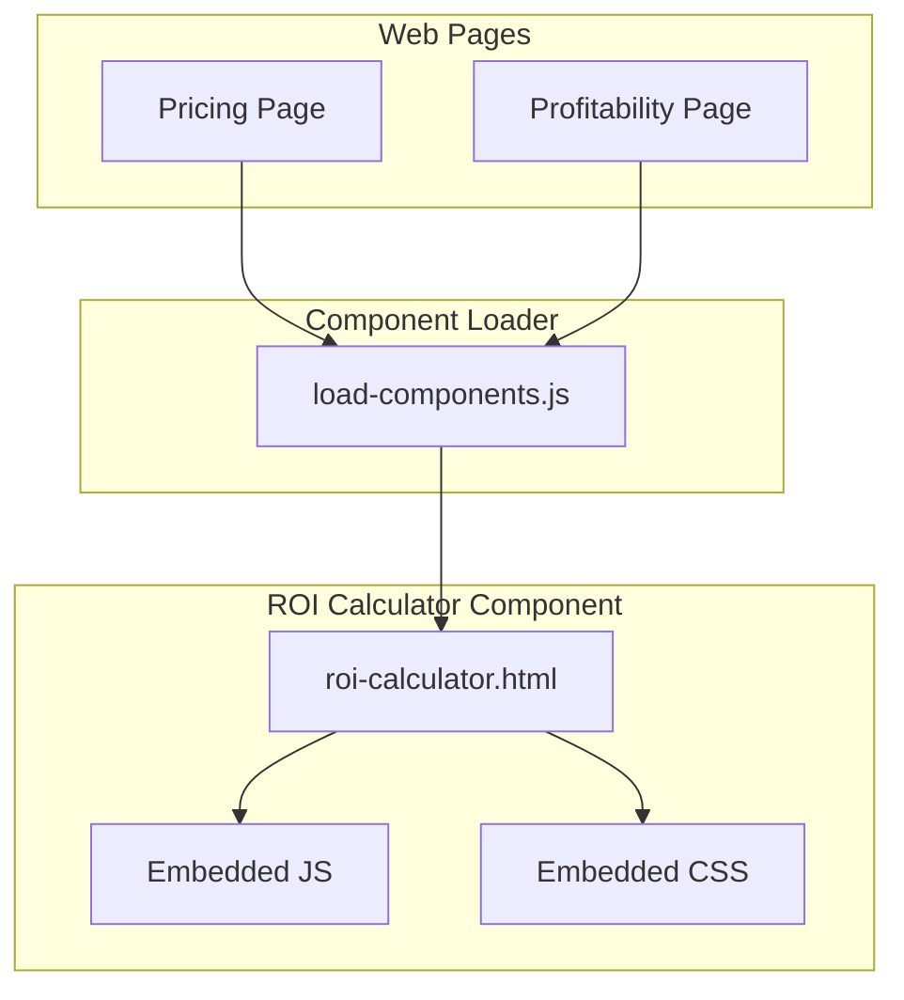
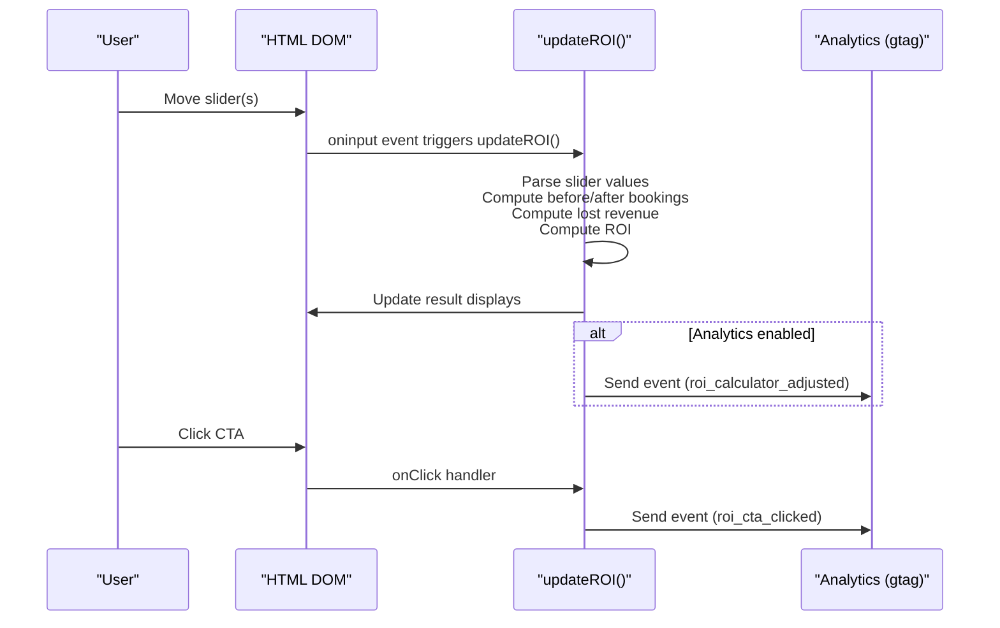
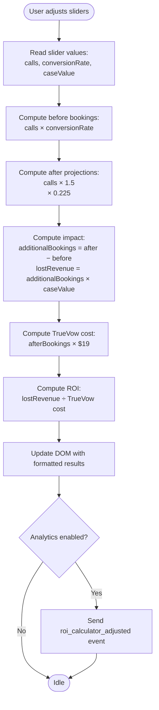
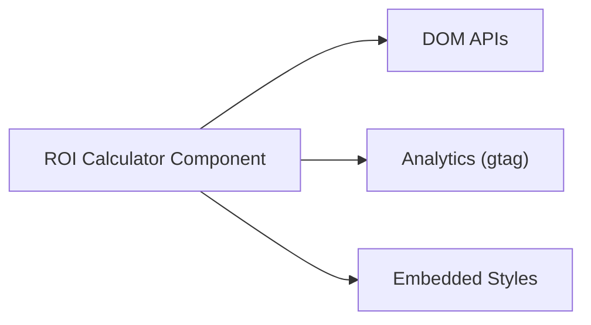

# ROI Calculator Widget

<cite>
**Referenced Files in This Document**
- [roi-calculator.html](file://components/roi-calculator.html)
- [roi-calculator.html](file://PRODUCTION_DEPLOY/components/roi-calculator.html)
- [load-components.js](file://js/load-components.js)
- [load-components.js](file://PRODUCTION_DEPLOY/js/load-components.js)
- [pricing.html](file://marketing/pricing.html)
- [profitability.html](file://marketing/profitability.html)
- [CALCULATION_FORMULA_DOCUMENTATION.md](file://scripts/CALCULATION_FORMULA_DOCUMENTATION.md)
</cite>

## Table of Contents
1. [Introduction](#introduction)
2. [Project Structure](#project-structure)
3. [Core Components](#core-components)
4. [Architecture Overview](#architecture-overview)
5. [Detailed Component Analysis](#detailed-component-analysis)
6. [Dependency Analysis](#dependency-analysis)
7. [Performance Considerations](#performance-considerations)
8. [Troubleshooting Guide](#troubleshooting-guide)
9. [Conclusion](#conclusion)

## Introduction
This document provides comprehensive technical and user-focused documentation for the ROI Calculator widget used to demonstrate the financial impact of TrueVow’s legal intake automation for solo and small law firms. It explains the calculation logic, input validation, formula implementation, result presentation, and integration points with the broader website. It also covers customization options, external data integration possibilities, and performance optimization techniques for real-time calculations.

## Project Structure
The ROI Calculator is implemented as a self-contained HTML component with embedded styles and JavaScript. It is designed to be injected into pages via a lightweight component loader and integrates with marketing pages that explain TrueVow’s pricing model and profitability.

**Diagram sources**
- [load-components.js](file://js/load-components.js#L14-L31)
- [roi-calculator.html](file://components/roi-calculator.html#L418-L486)

**Section sources**
- [roi-calculator.html](file://components/roi-calculator.html#L289-L486)
- [load-components.js](file://js/load-components.js#L14-L31)

## Core Components
- ROI Calculator HTML component: Provides interactive sliders for monthly inbound calls, current conversion rate, and average case value, displays before/after booking projections, lost revenue, and ROI metrics, and includes a call-to-action button with event tracking.
- Embedded JavaScript: Implements real-time calculation logic, updates the UI dynamically, and sends analytics events.
- Embedded CSS: Defines responsive styling for the calculator, result cards, and visual feedback.

Key UI elements:
- Sliders for user inputs with immediate recalculation on change.
- Before/After result cards showing projected bookings per month.
- Impact panel showing estimated monthly lost revenue.
- Breakdown cards for captured calls increase, conversion rate boost, additional bookings, and ROI multiple.
- CTA button linking to the application page with dynamic value display.

**Section sources**
- [roi-calculator.html](file://components/roi-calculator.html#L302-L416)
- [roi-calculator.html](file://components/roi-calculator.html#L418-L486)

## Architecture Overview
The ROI Calculator operates as a standalone interactive module. It relies on:
- DOM manipulation to read slider values and update result displays.
- Pure JavaScript calculations for projections and metrics.
- Optional analytics integration via Google Analytics (gtag) for engagement and conversion tracking.

**Diagram sources**
- [roi-calculator.html](file://components/roi-calculator.html#L418-L486)

## Detailed Component Analysis

### Calculation Logic and Formulas
The calculator implements a straightforward projection model:
- Current state (without TrueVow):
  - Current bookings = Monthly inbound calls × Current conversion rate
- Future state (with TrueVow):
  - Additional calls captured = +50% due to 24/7 availability
  - New call volume = Current calls × 1.5
  - Improved conversion rate = 22.5%
  - New bookings = New call volume × Improved conversion rate
- Impact metrics:
  - Additional bookings = New bookings − Current bookings
  - Lost revenue = Additional bookings × Average case value
  - TrueVow cost = New bookings × Founding Member rate ($19/bookings)
  - ROI multiple = Lost revenue ÷ TrueVow cost

Validation and normalization:
- Slider values are parsed as integers and normalized to percentages for conversion rate.
- Display formatting includes thousand separators and “K” notation for large values.

**Diagram sources**
- [roi-calculator.html](file://components/roi-calculator.html#L418-L468)

**Section sources**
- [roi-calculator.html](file://components/roi-calculator.html#L418-L468)

### User Interface Elements and Visual Feedback
- Input controls:
  - Three sliders with labeled values and hints.
  - Real-time display of current values for calls, conversion rate, and case value.
- Results display:
  - Before/After cards with large, bold values and color-coded labels.
  - Impact panel with prominent lost revenue figure and explanatory text.
  - Breakdown cards for captured calls (+50%), conversion rate boost (22.5%), additional bookings, and ROI multiple.
- CTA:
  - Prominent button linking to the application page with dynamic value display reflecting current lost revenue.

Accessibility and responsiveness:
- Responsive grid layout adapts to mobile devices.
- Clear typography hierarchy and color coding enhance readability.

**Section sources**
- [roi-calculator.html](file://components/roi-calculator.html#L302-L416)

### Integration with External Data and Pricing Context
- Pricing context:
  - The calculator references TrueVow’s Founding Member rate of $19 per booking, aligning with the pricing page’s “$19/booking Founding Member rate.”
- Marketing alignment:
  - The profitability page reinforces the economic benefits and provides supporting benchmarks for revenue lift.

**Section sources**
- [pricing.html](file://marketing/pricing.html#L289-L300)
- [profitability.html](file://marketing/profitability.html#L754-L761)

### Component Loading and Placement
- The component is loaded via a generic component loader that injects HTML content into placeholders on demand.
- This enables flexible placement on various pages (e.g., pricing, profitability) without duplicating markup.

**Section sources**
- [load-components.js](file://js/load-components.js#L14-L31)
- [load-components.js](file://PRODUCTION_DEPLOY/js/load-components.js#L14-L31)

## Dependency Analysis
The ROI Calculator has minimal external dependencies:
- DOM APIs for reading inputs and updating the UI.
- Optional analytics library (gtag) for event tracking.
- No third-party frameworks or libraries.

**Diagram sources**
- [roi-calculator.html](file://components/roi-calculator.html#L418-L486)

**Section sources**
- [roi-calculator.html](file://components/roi-calculator.html#L418-L486)

## Performance Considerations
- Real-time recalculation:
  - Uses oninput handlers for immediate feedback; keep computations lightweight to avoid jank on low-end devices.
- Event throttling:
  - Analytics events are probabilistically sent (random threshold) to reduce overhead.
- DOM updates:
  - Batched updates via innerHTML for result containers; ensure minimal reflow by updating only changed nodes.
- Optimization suggestions:
  - Debounce analytics events if frequency becomes excessive.
  - Consider requestAnimationFrame for heavy UI updates.
  - Cache DOM references to sliders and result elements to avoid repeated queries.

[No sources needed since this section provides general guidance]

## Troubleshooting Guide
Common issues and resolutions:
- Sliders not updating results:
  - Verify oninput handlers are attached to all three sliders.
  - Confirm the updateROI function is defined and accessible in the global scope.
- Incorrect values or formatting:
  - Ensure numeric parsing handles edge cases (e.g., empty values).
  - Validate percentage conversion for conversion rate and thousand separators for currency.
- Analytics not firing:
  - Check that gtag is available and the probabilistic gating condition is met.
- Placement issues:
  - Confirm the component loader targets the correct placeholder IDs and that the component file is accessible.

**Section sources**
- [roi-calculator.html](file://components/roi-calculator.html#L314-L354)
- [roi-calculator.html](file://components/roi-calculator.html#L418-L486)

## Conclusion
The ROI Calculator widget provides a clear, real-time demonstration of TrueVow’s potential financial impact for legal practices. Its simple yet effective calculation model, responsive UI, and optional analytics integration make it a valuable tool for converting visitors into qualified leads. With minor enhancements—such as debounced analytics and improved input validation—the component can offer an even smoother user experience while maintaining its educational and persuasive goals.