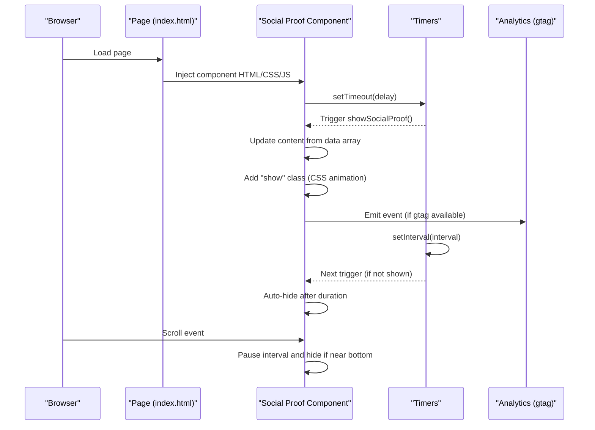
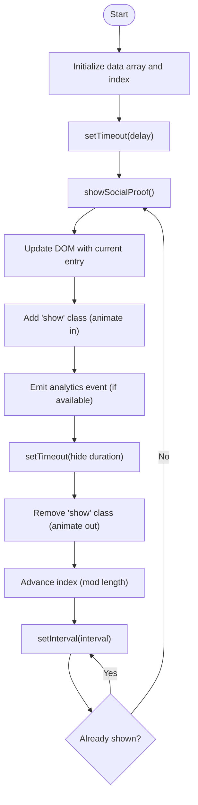
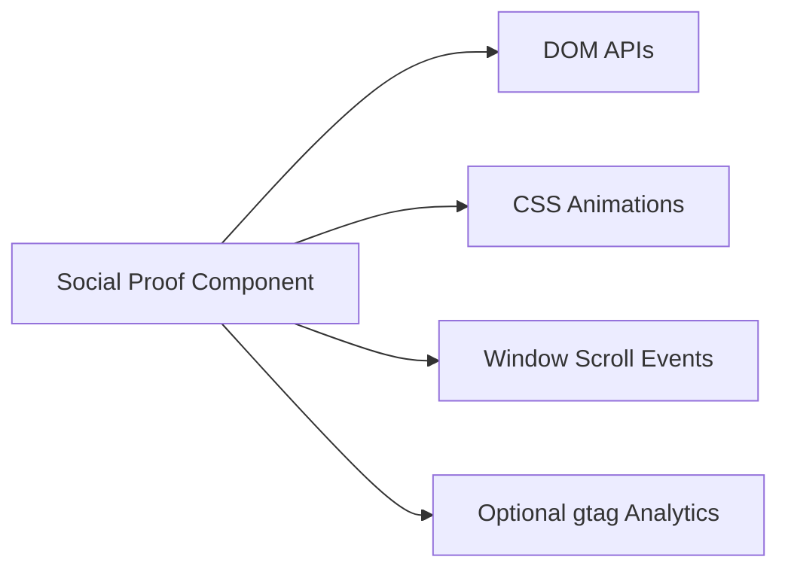

# Social Proof Notifications

<cite>
**Referenced Files in This Document**
- [social-proof-notifications.html](file://components/social-proof-notifications.html)
- [social-proof-notifications.html](file://PRODUCTION_DEPLOY/components/social-proof-notifications.html)
- [index.html](file://marketing/index.html)
- [index.html](file://PRODUCTION_DEPLOY/marketing/index.html)
- [load-components.js](file://js/load-components.js)
- [blog-content.js](file://js/blog-content.js)
- [blog-content.js](file://PRODUCTION_DEPLOY/js/blog-content.js)
</cite>

## Table of Contents
1. [Introduction](#introduction)
2. [Project Structure](#project-structure)
3. [Core Components](#core-components)
4. [Architecture Overview](#architecture-overview)
5. [Detailed Component Analysis](#detailed-component-analysis)
6. [Dependency Analysis](#dependency-analysis)
7. [Performance Considerations](#performance-considerations)
8. [Troubleshooting Guide](#troubleshooting-guide)
9. [Conclusion](#conclusion)

## Introduction
This document describes the Social Proof Notifications component system used to display real-time visitor behavior indicators, recent activity, and engagement signals on the TrueVow website. The system presents dynamic, rotating notifications that simulate recent user actions (e.g., applications, demos, bookings) to increase trust and encourage conversions. It includes:
- Visitor behavior indicators (recent sign-ups, demos, bookings)
- Recent activity displays with timestamps
- Engagement signals (celebratory icons and concise action phrases)
- Notification triggering mechanisms (delayed start, periodic intervals, scroll-based pausing)
- Timing controls and user interaction patterns
- Data sources and rotation logic
- Real-time analytics integration
- Configuration options for frequency, content types, and display positioning

## Project Structure
The Social Proof Notifications component is implemented as a self-contained HTML+JS module with embedded CSS and JavaScript. It is designed to be included near the bottom of web pages to avoid blocking rendering and to minimize interference with page-specific scripts.

Key locations:
- Development: components/social-proof-notifications.html
- Production: PRODUCTION_DEPLOY/components/social-proof-notifications.html
- Integration examples: marketing/index.html and PRODUCTION_DEPLOY/marketing/index.html
- Component loader: js/load-components.js
- Analytics patterns: js/blog-content.js (for comparison with analytics integration)

```mermaid
graph TB
subgraph "Page"
PageHTML["marketing/index.html"]
ProdHTML["PRODUCTION_DEPLOY/marketing/index.html"]
end
subgraph "Component"
Comp["components/social-proof-notifications.html"]
ProdComp["PRODUCTION_DEPLOY/components/social-proof-notifications.html"]
end
subgraph "Loader"
Loader["js/load-components.js"]
end
PageHTML --> Comp
ProdHTML --> ProdComp
Loader --> Comp
Loader --> ProdComp
```

**Diagram sources**
- [index.html](file://marketing/index.html#L1-L324)
- [index.html](file://PRODUCTION_DEPLOY/marketing/index.html#L1-L324)
- [social-proof-notifications.html](file://components/social-proof-notifications.html#L1-L209)
- [social-proof-notifications.html](file://PRODUCTION_DEPLOY/components/social-proof-notifications.html#L1-L209)
- [load-components.js](file://js/load-components.js#L1-L58)

**Section sources**
- [social-proof-notifications.html](file://components/social-proof-notifications.html#L1-L209)
- [social-proof-notifications.html](file://PRODUCTION_DEPLOY/components/social-proof-notifications.html#L1-L209)
- [index.html](file://marketing/index.html#L1-L324)
- [index.html](file://PRODUCTION_DEPLOY/marketing/index.html#L1-L324)
- [load-components.js](file://js/load-components.js#L1-L58)

## Core Components
The Social Proof Notifications component consists of:
- A styled notification panel with avatar, name, action text, timestamp, and icon
- Inline CSS for layout, animations, and responsive behavior
- Inline JavaScript for data rotation, timing controls, scroll-based pausing, and analytics tracking

Key behaviors:
- Initial delay before first notification appears
- Periodic rotation of notifications at configurable intervals
- Auto-hide after a fixed duration
- Scroll-triggered pause near the bottom of the page
- Optional manual close via X button
- Analytics event emission when a notification is shown

**Section sources**
- [social-proof-notifications.html](file://components/social-proof-notifications.html#L5-L124)
- [social-proof-notifications.html](file://components/social-proof-notifications.html#L126-L207)
- [social-proof-notifications.html](file://PRODUCTION_DEPLOY/components/social-proof-notifications.html#L5-L124)
- [social-proof-notifications.html](file://PRODUCTION_DEPLOY/components/social-proof-notifications.html#L126-L207)

## Architecture Overview
The component architecture is a self-contained module that integrates into page layouts. It uses:
- Fixed-positioned notification panel
- CSS animations for entrance/exit
- JavaScript timers for scheduling
- Scroll event listener for contextual pausing
- Optional analytics integration via global gtag function



**Diagram sources**
- [social-proof-notifications.html](file://components/social-proof-notifications.html#L126-L207)
- [social-proof-notifications.html](file://PRODUCTION_DEPLOY/components/social-proof-notifications.html#L126-L207)
- [index.html](file://marketing/index.html#L1-L324)
- [index.html](file://PRODUCTION_DEPLOY/marketing/index.html#L1-L324)

## Detailed Component Analysis

### Notification Panel Structure
The notification panel includes:
- Avatar placeholder with initials
- Name and city
- Action phrase describing recent activity
- Timestamp
- Celebration icon
- Close button

Layout and responsiveness are handled via CSS media queries and fixed positioning.

**Section sources**
- [social-proof-notifications.html](file://components/social-proof-notifications.html#L113-L124)
- [social-proof-notifications.html](file://components/social-proof-notifications.html#L5-L111)

### Data Model and Rotation Logic
The component maintains an internal array of social proof entries. Each entry contains:
- name
- city
- initials
- action
- time

Rotation logic:
- Index advances cyclically
- Current entry is rendered when a show cycle begins
- New entries appear only when a previous notification is not currently visible



**Diagram sources**
- [social-proof-notifications.html](file://components/social-proof-notifications.html#L128-L176)
- [social-proof-notifications.html](file://components/social-proof-notifications.html#L184-L194)

**Section sources**
- [social-proof-notifications.html](file://components/social-proof-notifications.html#L128-L176)
- [social-proof-notifications.html](file://components/social-proof-notifications.html#L184-L194)

### Timing Controls and Triggers
- Initial delay: 10 seconds before first notification
- Rotation interval: 30 seconds between notifications
- Auto-hide: 7 seconds after appearing
- Scroll pause: Pauses when user scrolls within 500px of page bottom

These controls are implemented using setTimeout and setInterval for scheduling and a scroll event handler for pausing.

**Section sources**
- [social-proof-notifications.html](file://components/social-proof-notifications.html#L184-L194)
- [social-proof-notifications.html](file://components/social-proof-notifications.html#L196-L206)

### User Interaction Patterns
- Manual close: Clicking the X button immediately hides the notification
- Auto-close: Notification disappears after the configured duration
- Scroll pause: When the user approaches the bottom of the page, ongoing notifications are hidden and the timer is cleared until the user scrolls away

**Section sources**
- [social-proof-notifications.html](file://components/social-proof-notifications.html#L178-L182)
- [social-proof-notifications.html](file://components/social-proof-notifications.html#L196-L206)

### Data Sources and Content Types
- Current implementation uses a static, inlined data array suitable for development and staging
- Production-ready guidance indicates fetching data from an API endpoint (commented in the component)
- Content types supported by the data model include:
  - Application completion
  - Demo initiation
  - Booking confirmation
  - Membership acquisition
  - Referral rewards
  - Availability checks

To switch to dynamic content, replace the inlined array with an asynchronous fetch to a backend endpoint and adapt the DOM update logic accordingly.

**Section sources**
- [social-proof-notifications.html](file://components/social-proof-notifications.html#L127-L139)
- [social-proof-notifications.html](file://components/social-proof-notifications.html#L145-L154)

### Real-Time Updates and Analytics Integration
- Analytics: When a notification is shown, the component emits an event using the global gtag function if available
- Event category: engagement
- Event label: concatenation of name and city
- This pattern mirrors analytics practices used elsewhere in the site (e.g., blog content analytics)

Note: The analytics integration is optional and depends on the presence of the gtag function.

**Section sources**
- [social-proof-notifications.html](file://components/social-proof-notifications.html#L160-L166)
- [blog-content.js](file://js/blog-content.js#L244-L250)

### Configuration Options
The component exposes several configuration points via inline constants and parameters:
- Initial delay before first notification (currently 10 seconds)
- Interval between notifications (currently 30 seconds)
- Auto-hide duration (currently 7 seconds)
- Scroll threshold for pausing (currently 500px from bottom)
- Display position and sizing (bottom-left fixed position with responsive adjustments)

These values are defined as inline constants and can be adjusted directly in the component file.

**Section sources**
- [social-proof-notifications.html](file://components/social-proof-notifications.html#L184-L194)
- [social-proof-notifications.html](file://components/social-proof-notifications.html#L196-L206)
- [social-proof-notifications.html](file://components/social-proof-notifications.html#L7-L20)

### Integration with Page Layouts
The component is intended to be included near the bottom of pages (before the closing body tag) to avoid blocking rendering and to ensure proper viewport calculations. Example integrations are present in:
- marketing/index.html
- PRODUCTION_DEPLOY/marketing/index.html

The component loader (load-components.js) demonstrates a pattern for injecting standardized components into placeholders, though the Social Proof Notifications component is typically included directly.

**Section sources**
- [index.html](file://marketing/index.html#L1-L324)
- [index.html](file://PRODUCTION_DEPLOY/marketing/index.html#L1-L324)
- [load-components.js](file://js/load-components.js#L34-L47)

## Dependency Analysis
The Social Proof Notifications component has minimal external dependencies:
- DOM APIs for element selection and manipulation
- CSS animations for entrance/exit effects
- Optional analytics library (gtag) for event tracking
- Window scroll events for contextual pausing

Potential coupling points:
- Assumes a global gtag function for analytics
- Relies on CSS class toggling for animations
- Uses fixed positioning and viewport-aware thresholds



**Diagram sources**
- [social-proof-notifications.html](file://components/social-proof-notifications.html#L126-L207)

**Section sources**
- [social-proof-notifications.html](file://components/social-proof-notifications.html#L126-L207)

## Performance Considerations
- Animation efficiency: CSS transforms and opacity changes are hardware-accelerated; keep the number of animated elements minimal
- Timer management: Ensure intervals are cleared when the user is near the bottom to prevent unnecessary CPU usage
- DOM updates: Batch updates and avoid layout thrashing by updating text content rather than restructuring the DOM
- Scroll handling: Debounce scroll events if extending functionality to reduce reflow frequency
- Network requests: If switching to dynamic data, implement caching and request deduplication to avoid redundant API calls

[No sources needed since this section provides general guidance]

## Troubleshooting Guide
Common issues and resolutions:
- Notifications not appearing
  - Verify the component is included before the closing body tag
  - Confirm initial delay and interval values are appropriate for the page lifecycle
- Notifications overlap or flicker
  - Ensure only one notification is shown at a time (the component tracks visibility)
  - Check for conflicting CSS animations or z-index stacking
- Analytics events not recorded
  - Confirm the gtag function is available globally
  - Verify event category and label formatting
- Scroll pause not working
  - Validate scroll threshold calculation and event binding
  - Ensure the page height and scroll position are computed correctly

**Section sources**
- [social-proof-notifications.html](file://components/social-proof-notifications.html#L160-L166)
- [social-proof-notifications.html](file://components/social-proof-notifications.html#L196-L206)

## Conclusion
The Social Proof Notifications component provides a lightweight, self-contained mechanism to display real-time visitor behavior indicators and engagement signals. Its modular design allows easy integration into existing page layouts, while its configurable timing and scroll-aware behavior ensures a non-intrusive user experience. With optional analytics integration and straightforward paths to dynamic content sourcing, the component supports iterative improvements and A/B testing of notification variants.