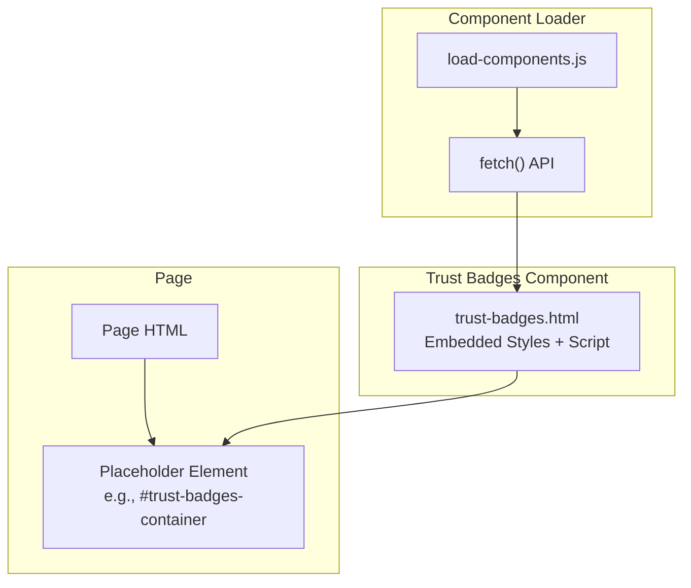
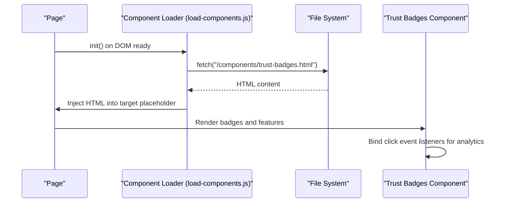
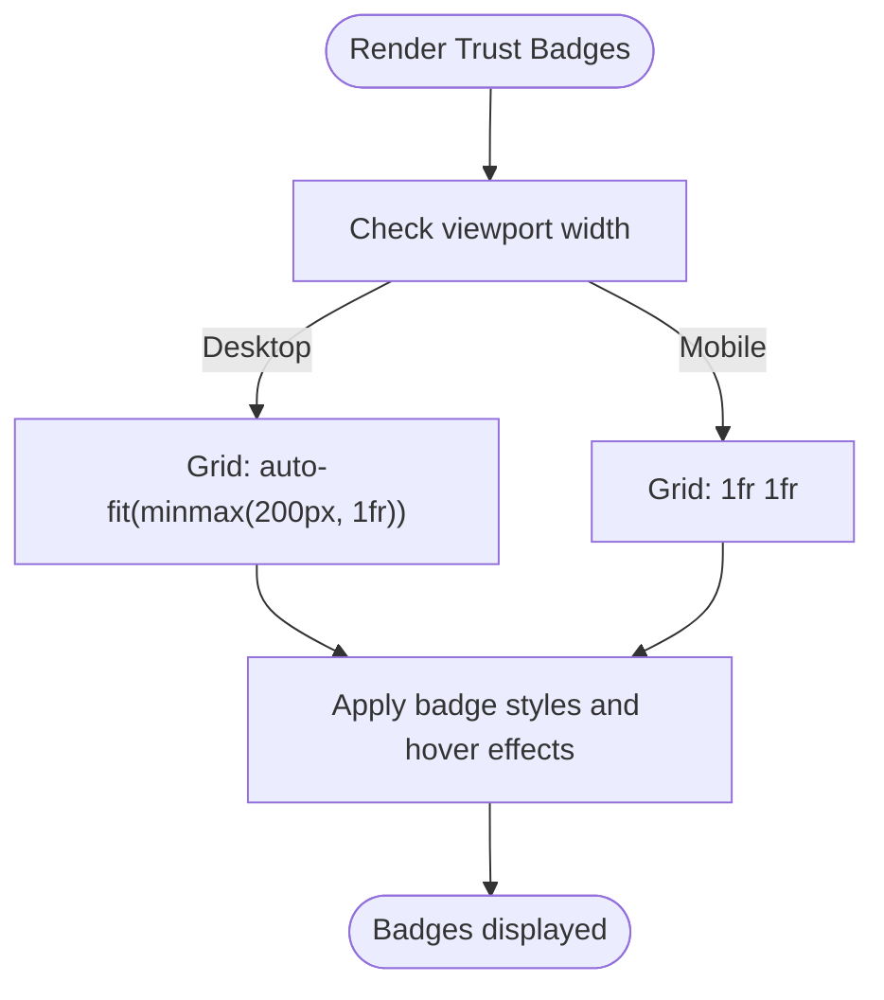
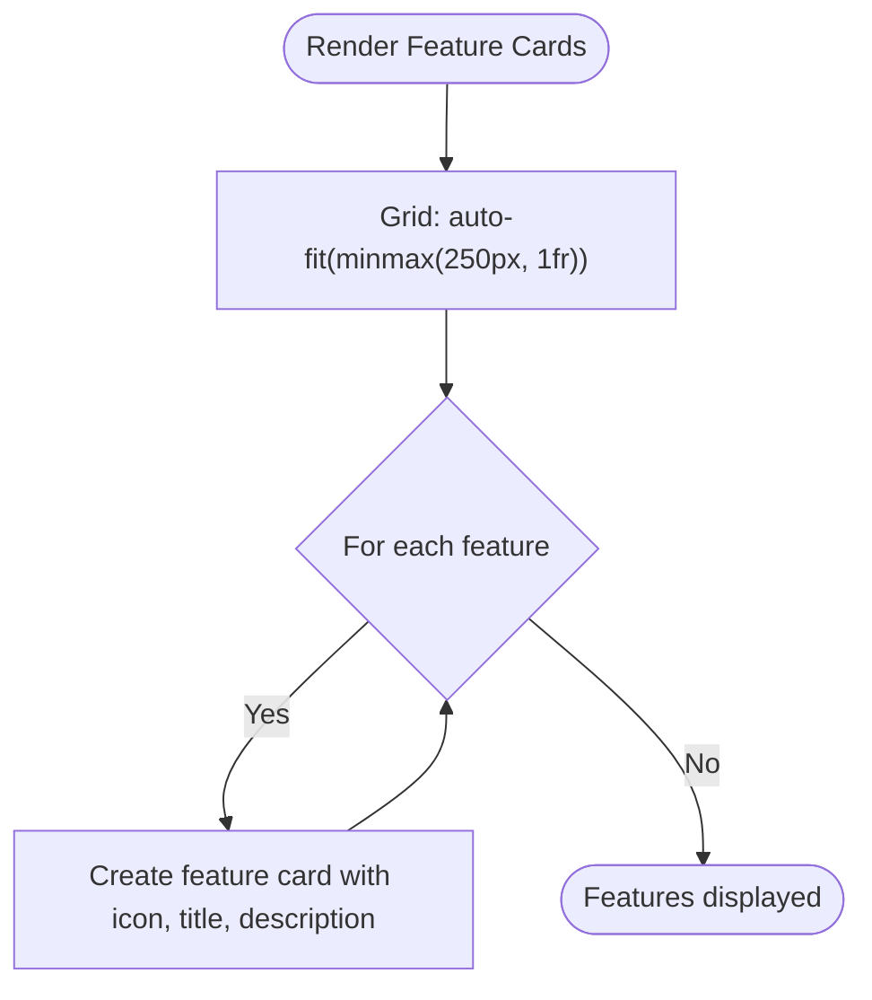
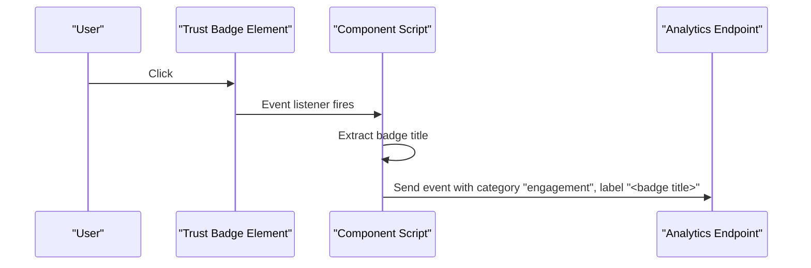
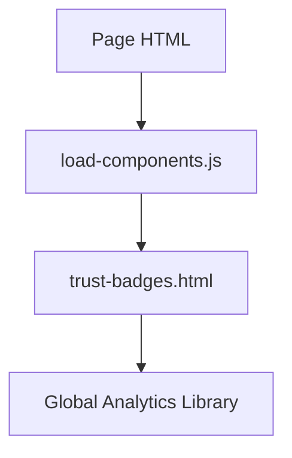

# Trust Badge System

<cite>
**Referenced Files in This Document**
- [trust-badges.html](file://components/trust-badges.html)
- [trust-badges.html](file://PRODUCTION_DEPLOY/components/trust-badges.html)
- [load-components.js](file://js/load-components.js)
- [load-components.js](file://PRODUCTION_DEPLOY/js/load-components.js)
- [blog-content.js](file://js/blog-content.js)
- [blog-content.js](file://PRODUCTION_DEPLOY/js/blog-content.js)
- [TEST_REPORT.md](file://PRODUCTION_DEPLOY/TEST_REPORT.md)
</cite>

## Table of Contents
1. [Introduction](#introduction)
2. [Project Structure](#project-structure)
3. [Core Components](#core-components)
4. [Architecture Overview](#architecture-overview)
5. [Detailed Component Analysis](#detailed-component-analysis)
6. [Dependency Analysis](#dependency-analysis)
7. [Performance Considerations](#performance-considerations)
8. [Troubleshooting Guide](#troubleshooting-guide)
9. [Conclusion](#conclusion)

## Introduction
The Trust Badge System is a reusable HTML component designed to showcase third-party validations and assurances that build credibility with visitors. It presents security certifications, legal compliance badges, verification marks, and service guarantees in a responsive grid layout. The component includes basic analytics tracking for engagement events and is integrated into pages via a lightweight component loader.

Key capabilities:
- Displays trust indicators such as SOC 2 Type II certification, ABA compliance, HIPAA compliance, and state bar verification
- Provides feature highlights like client data privacy, secure payments, uptime SLA, and award-winning support
- Includes hover effects and responsive grid layout for optimal viewing across devices
- Tracks user interactions with analytics hooks for engagement measurement

## Project Structure
The Trust Badge component is delivered as a standalone HTML file containing embedded styles and minimal JavaScript. It can be included in any page by injecting it into a designated placeholder element using the component loader.

**Diagram sources**
- [load-components.js](file://js/load-components.js#L14-L31)
- [trust-badges.html](file://components/trust-badges.html#L135-L222)

**Section sources**
- [trust-badges.html](file://components/trust-badges.html#L1-L240)
- [load-components.js](file://js/load-components.js#L1-L58)

## Core Components
The Trust Badge component consists of:
- A section wrapper with centered content and subtle borders
- A responsive grid of trust badges, each featuring an icon, title, description, and a verified indicator
- A secondary grid of feature highlights that explain service benefits
- Embedded CSS for styling and hover interactions
- A small analytics script that tracks clicks on individual trust badges

Badge categories currently represented:
- Security and Compliance: SOC 2 Type II Certified, HIPAA Compliant
- Legal Compliance: ABA Compliant
- Verification: State Bar Verified
- Service Features: Client Data Privacy, Secure Payments, Uptime SLA, Award-Winning Support

**Section sources**
- [trust-badges.html](file://components/trust-badges.html#L135-L222)
- [trust-badges.html](file://components/trust-badges.html#L5-L133)

## Architecture Overview
The Trust Badge component is static HTML with embedded styles and a small event handler. It is dynamically injected into pages using a component loader that fetches the component file and inserts it into a target element. There is no backend integration or external verification service invoked by the component itself.

**Diagram sources**
- [load-components.js](file://js/load-components.js#L36-L48)
- [load-components.js](file://js/load-components.js#L14-L31)
- [trust-badges.html](file://components/trust-badges.html#L224-L238)

## Detailed Component Analysis

### Trust Badge Grid Layout
The component uses CSS Grid to arrange badges responsively. On larger screens, badges are laid out as a flexible grid with a minimum width per item. On tablets and phones, the grid adjusts to two columns for better readability.

**Diagram sources**
- [trust-badges.html](file://components/trust-badges.html#L29-L35)
- [trust-badges.html](file://components/trust-badges.html#L124-L132)

**Section sources**
- [trust-badges.html](file://components/trust-badges.html#L29-L35)
- [trust-badges.html](file://components/trust-badges.html#L124-L132)

### Feature Highlights Section
Below the badge grid, the component displays four feature cards that emphasize service benefits. Each card includes an icon, title, and description, arranged in a responsive grid that stacks on smaller screens.

**Diagram sources**
- [trust-badges.html](file://components/trust-badges.html#L85-L122)

**Section sources**
- [trust-badges.html](file://components/trust-badges.html#L85-L122)

### Analytics Integration
The component includes a small script that listens for click events on trust badge containers and sends an analytics event. The event payload includes the badge title as a label, enabling segmentation by badge type.

**Diagram sources**
- [trust-badges.html](file://components/trust-badges.html#L224-L238)

**Section sources**
- [trust-badges.html](file://components/trust-badges.html#L224-L238)

### Conditional Rendering and Dynamic Updates
- The current Trust Badge component is static and does not implement conditional rendering based on verification status or dynamic content updates.
- Dynamic content updates would require integrating with an external verification service or CMS, which is not present in the current implementation.
- The component loader supports injecting the component into pages but does not modify the component’s content at runtime.

**Section sources**
- [trust-badges.html](file://components/trust-badges.html#L1-L240)
- [load-components.js](file://js/load-components.js#L14-L31)

### Styling Customization Options
The component exposes several CSS hooks for customization:
- Section container: adjust background, padding, and borders
- Grid containers: change column count and spacing
- Individual badge: customize background, radius, hover transforms, and verified tag appearance
- Typography: adjust sizes, weights, and colors for titles and descriptions
- Feature cards: modify layout, spacing, and icon sizing

Responsive breakpoints:
- Mobile breakpoint at 768px adjusts grid columns for better readability

**Section sources**
- [trust-badges.html](file://components/trust-badges.html#L5-L133)
- [trust-badges.html](file://components/trust-badges.html#L124-L132)

### Accessibility Considerations
- The component uses semantic HTML with headings and paragraphs for titles and descriptions.
- Focus order follows the natural tab order of interactive elements.
- Hover effects are purely visual; keyboard navigation remains functional.
- No explicit ARIA attributes are present in the component.

Recommendations for enhancement:
- Add ARIA roles and labels for interactive elements
- Ensure sufficient color contrast for text and verified indicators
- Provide focus-visible styles for keyboard navigation
- Consider adding skip links for screen reader users

**Section sources**
- [trust-badges.html](file://components/trust-badges.html#L135-L222)

## Dependency Analysis
The Trust Badge component depends on:
- The component loader to fetch and inject the HTML into a target placeholder
- The global analytics library (when present) for event tracking

**Diagram sources**
- [load-components.js](file://js/load-components.js#L36-L48)
- [trust-badges.html](file://components/trust-badges.html#L224-L238)

**Section sources**
- [load-components.js](file://js/load-components.js#L1-L58)
- [trust-badges.html](file://components/trust-badges.html#L224-L238)

## Performance Considerations
- The component is lightweight with minimal JavaScript and inline styles.
- CSS Grid ensures efficient layout calculations across modern browsers.
- Analytics events are sent asynchronously when the global analytics library is available.
- The component loader uses a simple fetch operation with error handling.

[No sources needed since this section provides general guidance]

## Troubleshooting Guide
Common issues and resolutions:
- Component not appearing on page
  - Ensure the target placeholder element exists and has the correct ID
  - Confirm the component loader runs after DOM ready
  - Verify the component file path is correct

- Analytics events not recorded
  - Ensure the global analytics library is loaded before user interaction
  - Check browser console for errors related to analytics initialization

- Styling conflicts
  - Override CSS selectors with higher specificity if needed
  - Inspect computed styles to identify conflicting declarations

- Mobile layout issues
  - Adjust media query breakpoints or grid template columns as needed
  - Test on actual devices to confirm responsiveness

**Section sources**
- [load-components.js](file://js/load-components.js#L14-L31)
- [trust-badges.html](file://components/trust-badges.html#L224-L238)

## Conclusion
The Trust Badge System provides a straightforward, visually appealing way to communicate trust signals to visitors. Its modular design allows easy integration across pages, while its embedded analytics support enables measurement of user engagement with trust elements. While the current implementation is static, the component’s structure supports future enhancements such as dynamic content updates and deeper integration with external verification services.