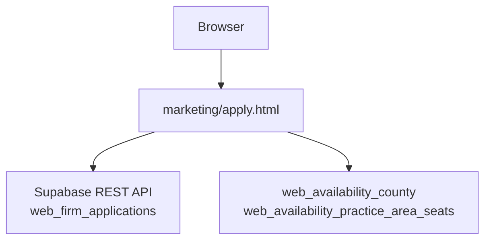
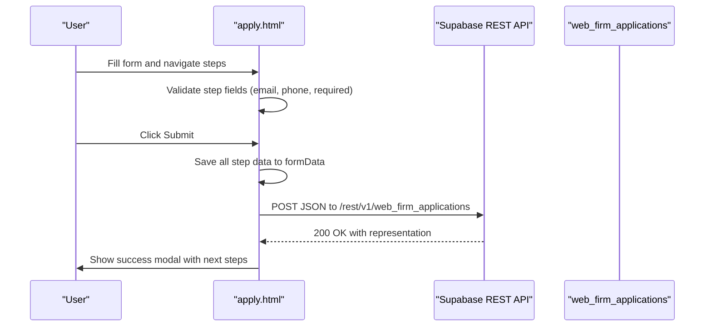
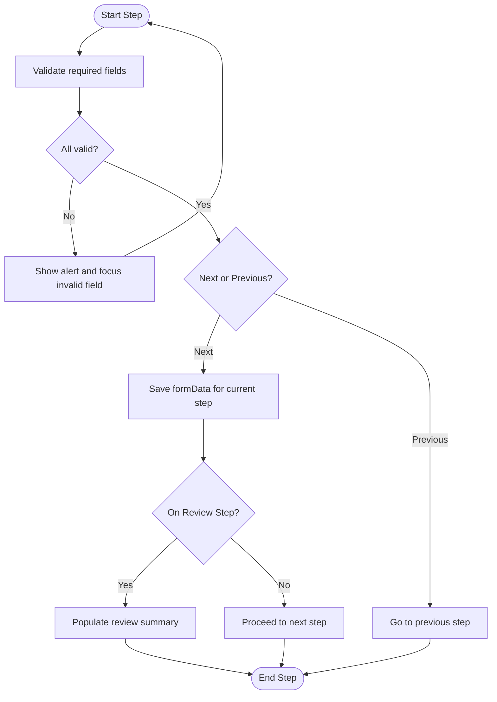
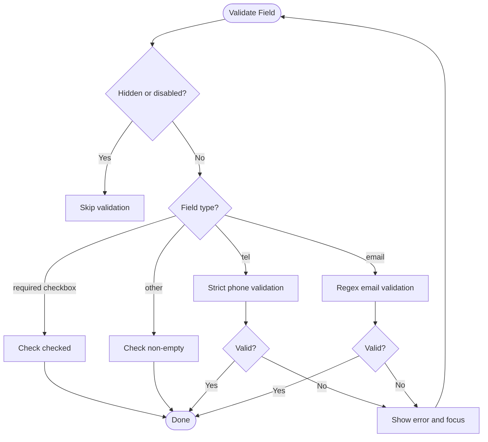
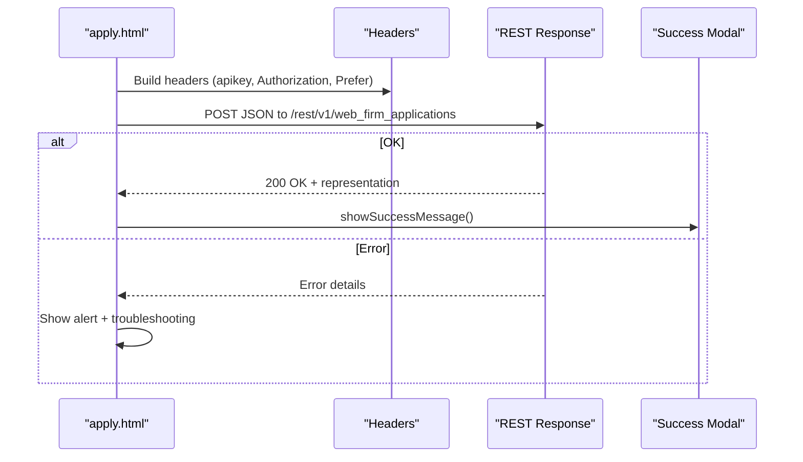
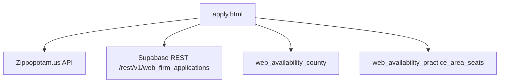

# Application Form

<cite>
**Referenced Files in This Document**
- [apply.html](file://marketing/apply.html)
- [apply.html](file://PRODUCTION_DEPLOY/marketing/apply.html)
- [DATABASE_SCHEMA_README.md](file://supabase/DATABASE_SCHEMA_README.md)
- [CREATE_COUNTY_AVAILABILITY_TABLES.sql](file://supabase/CREATE_COUNTY_AVAILABILITY_TABLES.sql)
- [ADD_ZIPCODE_TO_FIRM_APPLICATIONS.sql](file://supabase/ADD_ZIPCODE_TO_FIRM_APPLICATIONS.sql)
- [RENAME_WEB_APPLICATIONS_TO_WEB_FIRM_APPLICATIONS.sql](file://supabase/RENAME_WEB_APPLICATIONS_TO_WEB_FIRM_APPLICATIONS.sql)
- [rename_web_applications.js](file://scripts/rename_web_applications.js)
</cite>

## Table of Contents
1. [Introduction](#introduction)
2. [Project Structure](#project-structure)
3. [Core Components](#core-components)
4. [Architecture Overview](#architecture-overview)
5. [Detailed Component Analysis](#detailed-component-analysis)
6. [Dependency Analysis](#dependency-analysis)
7. [Performance Considerations](#performance-considerations)
8. [Troubleshooting Guide](#troubleshooting-guide)
9. [Conclusion](#conclusion)
10. [Appendices](#appendices)

## Introduction
This document describes the Application Form used by law firms to apply for TrueVow’s intake services. It covers the form architecture, field definitions, validation patterns, integration with Supabase for the web_firm_applications table, submission workflow, confirmation behavior, and security/compliance considerations. It also provides guidance for customization, styling, and troubleshooting.

## Project Structure
The application form is implemented as a single-page HTML file with embedded CSS and JavaScript. It is served from the marketing directory and integrates with Supabase for persistence.

**Diagram sources**
- [apply.html](file://marketing/apply.html#L1688-L1875)
- [DATABASE_SCHEMA_README.md](file://supabase/DATABASE_SCHEMA_README.md#L191-L255)
- [CREATE_COUNTY_AVAILABILITY_TABLES.sql](file://supabase/CREATE_COUNTY_AVAILABILITY_TABLES.sql#L12-L72)

**Section sources**
- [apply.html](file://marketing/apply.html#L1-L2129)
- [apply.html](file://PRODUCTION_DEPLOY/marketing/apply.html#L1-L2129)

## Core Components
- Multi-step form with four sections: Your Information, Practice Details, Eligibility, Review & Submit.
- Client-side validation for required fields, phone format, email format, and county capacity checks.
- Dynamic population of county options based on state selection and ZIP code lookup.
- Submission to Supabase REST endpoint for web_firm_applications.
- Success modal and user feedback messages.

Key fields include:
- Personal contact: first_name, last_name, email, phone
- Firm information: firm_name, firm_website, practice_area, firm_size, monthly_calls, referral_source
- Location: state, zipcode, desired_county
- Eligibility: checkboxes for license status, inbound calls, firm size, and bar number
- Interests and consent: free_chatbot_only, founding_member_interest, settle_interest, terms_agree
- Metadata: application_source, status

**Section sources**
- [apply.html](file://marketing/apply.html#L538-L912)
- [apply.html](file://marketing/apply.html#L1655-L1686)
- [apply.html](file://marketing/apply.html#L1816-L1860)

## Architecture Overview
The form uses a hybrid client-side rendering and server-side persistence model:
- The form is rendered statically with embedded styles and JavaScript.
- Validation and navigation are handled client-side.
- Submission posts raw JSON to Supabase’s REST v1 endpoint for web_firm_applications.
- ZIP code to county resolution uses an external API with fallback logic.
- County capacity alerts are generated client-side from static data.

**Diagram sources**
- [apply.html](file://marketing/apply.html#L1762-L1953)
- [apply.html](file://marketing/apply.html#L1875-L1885)

## Detailed Component Analysis

### Form Sections and Fields
- Step 1: Your Information
  - Fields: first_name, last_name, email, phone, firm_name
  - Validation: required, phone strict format, email regex
- Step 2: Practice Details
  - Fields: practice_area, firm_website, state, zipcode, desired_county, firm_size, monthly_calls, referral_source
  - Validation: required, zipcode pattern, county capacity alert, zipcode/county match
- Step 3: Eligibility
  - Fields: four checkboxes (eligibility_1..4), bar_number
  - Behavior: auto-check “21 or fewer” for solo firm; conditional message display
- Step 4: Review & Submit
  - Summary display populated from formData
  - Terms agreement checkbox required
  - Interests and consent fields

**Diagram sources**
- [apply.html](file://marketing/apply.html#L1267-L1318)
- [apply.html](file://marketing/apply.html#L1360-L1415)
- [apply.html](file://marketing/apply.html#L1655-L1686)

**Section sources**
- [apply.html](file://marketing/apply.html#L538-L912)

### Validation Patterns and Error Messaging
- Required fields enforced per step; hidden/disabled fields excluded from validation.
- Phone validation:
  - Accepts 10 digits or 11 digits starting with “1”
  - Real-time formatting and error messaging
- Email validation uses a simple regex.
- County capacity:
  - Computes remaining seats and displays info/alert based on percentage filled.
- ZIP code to county:
  - Uses external API; logs and continues on failure.
  - Validates format and ensures match with selected county.

**Diagram sources**
- [apply.html](file://marketing/apply.html#L1360-L1415)
- [apply.html](file://marketing/apply.html#L1468-L1499)
- [apply.html](file://marketing/apply.html#L1417-L1419)

**Section sources**
- [apply.html](file://marketing/apply.html#L1267-L1499)

### Supabase Integration and Data Transformation
- Endpoint: REST v1 endpoint for web_firm_applications
- Headers: Content-Type, apikey, Authorization, Prefer: return=representation
- Submission payload includes all form fields mapped to table columns plus metadata (application_source, status)
- On success, parses response and shows success modal; on error, displays user-friendly message with troubleshooting hints

**Diagram sources**
- [apply.html](file://marketing/apply.html#L1875-L1885)
- [apply.html](file://marketing/apply.html#L1891-L1952)

**Section sources**
- [apply.html](file://marketing/apply.html#L1688-L1953)

### Field Mapping to web_firm_applications
The form maps client-side field names to Supabase columns. The payload builder assigns values for all fields, including optional ones, and sets defaults for metadata.

- Required: email
- Contact: first_name, last_name, phone
- Firm: firm_name, practice_area, state, zipcode, desired_county, firm_size, monthly_calls, referral_source, firm_website
- Eligibility: eligibility_1..4, bar_number
- Interests: free_chatbot_only, founding_member_interest, settle_interest, terms_agree, consider_founding_member_future, early_access_settle
- Metadata: application_source, status

Note: The schema documentation lists a different table (firm_applications) with different columns. The form targets web_firm_applications, which is the renamed version with additional columns (e.g., zipcode).

**Section sources**
- [apply.html](file://marketing/apply.html#L1816-L1860)
- [DATABASE_SCHEMA_README.md](file://supabase/DATABASE_SCHEMA_README.md#L191-L255)
- [ADD_ZIPCODE_TO_FIRM_APPLICATIONS.sql](file://supabase/ADD_ZIPCODE_TO_FIRM_APPLICATIONS.sql#L1-L30)
- [RENAME_WEB_APPLICATIONS_TO_WEB_FIRM_APPLICATIONS.sql](file://supabase/RENAME_WEB_APPLICATIONS_TO_WEB_FIRM_APPLICATIONS.sql#L1-L70)

### Confirmation Handling and Redirect Behavior
- The page includes a redirect to the marketing directory; the main form itself resides under marketing.
- On successful submission, the form displays a success modal with next steps and disables the submit button.
- No client-side redirect is performed after submission; the modal communicates the post-submission workflow.

**Section sources**
- [apply.html](file://apply.html#L1-L17)
- [apply.html](file://marketing/apply.html#L1693-L1738)
- [apply.html](file://marketing/apply.html#L1793-L1905)

### Analytics Tracking Integration
- The schema documentation describes page_analytics and blog_analytics tables for tracking page views and engagement.
- The form page does not include explicit analytics tracking code in the provided file.
- If analytics is required, consider integrating page_analytics inserts similar to other tracked pages.

**Section sources**
- [DATABASE_SCHEMA_README.md](file://supabase/DATABASE_SCHEMA_README.md#L346-L374)

## Dependency Analysis
- External API: Zippopotam.us for ZIP code to county lookup
- Supabase: REST endpoint for web_firm_applications
- Static county data: client-side mapping for supported states/counties
- Availability tables: web_availability_county and web_availability_practice_area_seats for marketing use

**Diagram sources**
- [apply.html](file://marketing/apply.html#L1153-L1225)
- [apply.html](file://marketing/apply.html#L1688-L1875)
- [CREATE_COUNTY_AVAILABILITY_TABLES.sql](file://supabase/CREATE_COUNTY_AVAILABILITY_TABLES.sql#L12-L72)

**Section sources**
- [apply.html](file://marketing/apply.html#L981-L1265)
- [apply.html](file://marketing/apply.html#L1688-L1875)
- [CREATE_COUNTY_AVAILABILITY_TABLES.sql](file://supabase/CREATE_COUNTY_AVAILABILITY_TABLES.sql#L1-L228)

## Performance Considerations
- Client-side validation reduces server round trips and improves perceived responsiveness.
- County capacity alerts are computed locally from static data, avoiding extra requests.
- ZIP code lookup is asynchronous and does not block submission; failures are logged and ignored to preserve UX.
- The form disables submit button during submission to prevent duplicate submissions.

[No sources needed since this section provides general guidance]

## Troubleshooting Guide
Common issues and resolutions:
- Submission fails with Supabase error:
  - Check browser console for detailed error messages
  - Verify Supabase table web_firm_applications exists and is reachable
  - Inspect Network tab for API response and status
  - Ensure required fields are filled and formatted correctly
- Phone number validation errors:
  - Confirm 10 digits or 11 digits starting with “1”
  - Use accepted formats: (555) 123-4567 or 555-123-4567 or 5551234567
- Email validation errors:
  - Ensure valid email format (contains @ and domain)
- ZIP code to county mismatch:
  - Verify ZIP code format (12345 or 12345-6789)
  - Ensure state is selected before ZIP code lookup
  - If county not found, select “County not listed” option

**Section sources**
- [apply.html](file://marketing/apply.html#L1937-L1952)
- [apply.html](file://marketing/apply.html#L1468-L1499)
- [apply.html](file://marketing/apply.html#L1406-L1411)
- [apply.html](file://marketing/apply.html#L1600-L1609)

## Conclusion
The Application Form provides a robust, client-side validated, multi-step experience that submits data to Supabase for web_firm_applications. It includes dynamic county selection, capacity awareness, and clear post-submission feedback. The integration leverages Supabase’s RLS and REST capabilities, while maintaining a responsive user experience through client-side logic.

[No sources needed since this section summarizes without analyzing specific files]

## Appendices

### Customization Examples
- Adding new fields:
  - Extend the appropriate step section with required attributes
  - Update the payload builder to include the new field
  - Ensure validation rules are added to validateStep
- Modifying styling:
  - Adjust CSS in the style block for layout and colors
  - Keep responsive breakpoints aligned with mobile-first design
- Extending eligibility logic:
  - Add new checkboxes and update conditional message visibility
  - Consider auto-checking based on other selections

**Section sources**
- [apply.html](file://marketing/apply.html#L1514-L1582)
- [apply.html](file://marketing/apply.html#L1816-L1860)

### Security and Compliance Considerations
- Data handling:
  - The form collects sensitive information (bar number, contact details). Ensure PCI and privacy best practices are followed.
  - Minimize data retention and only collect what is necessary for the application process.
- Legal technology compliance:
  - Bar admission verification is requested; ensure compliance with jurisdictional rules and ethical obligations.
  - Terms and bar compliance links are included; ensure users acknowledge and agree to them.
- Access control:
  - Supabase RLS policies restrict public access to application data; ensure policies remain intact.
  - Limit exposure of administrative endpoints and keys.

**Section sources**
- [apply.html](file://marketing/apply.html#L892-L897)
- [DATABASE_SCHEMA_README.md](file://supabase/DATABASE_SCHEMA_README.md#L447-L449)