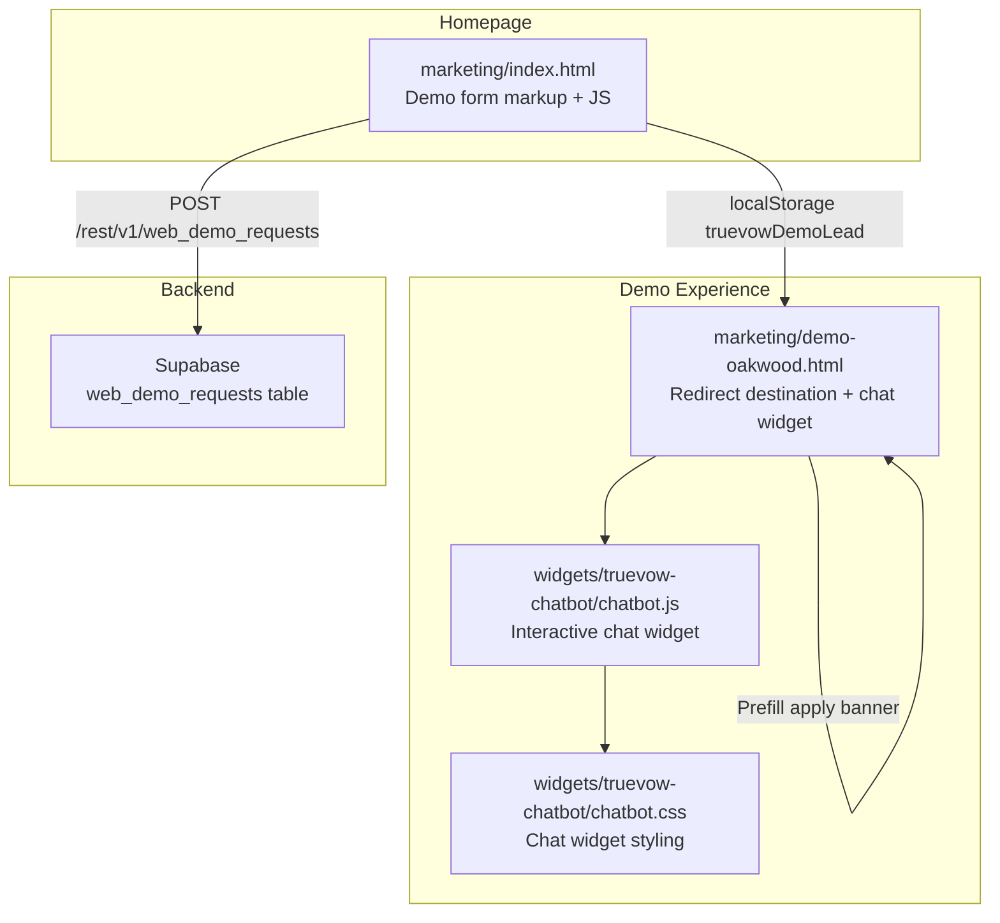
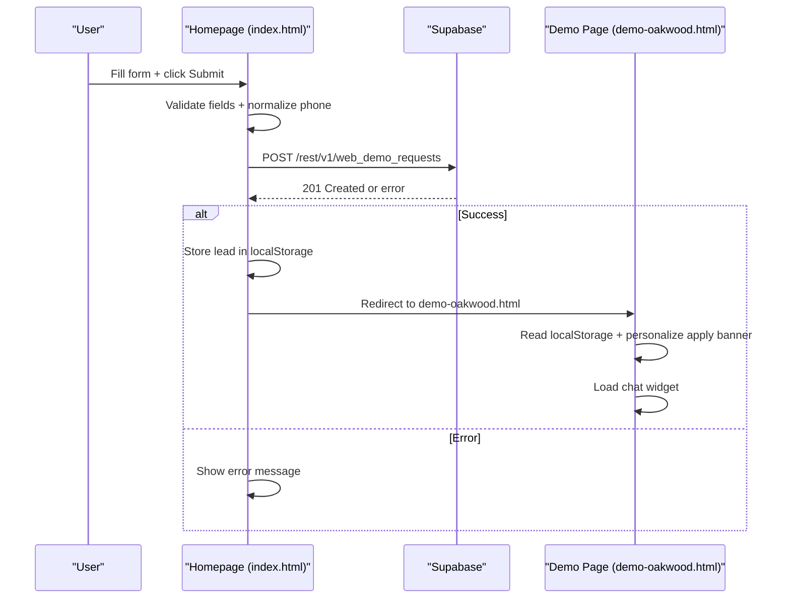
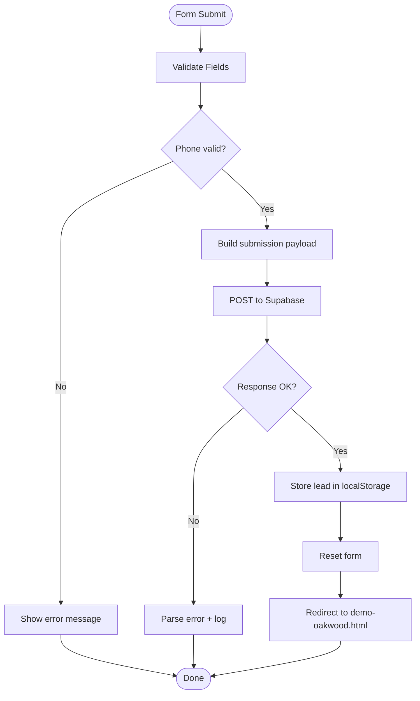
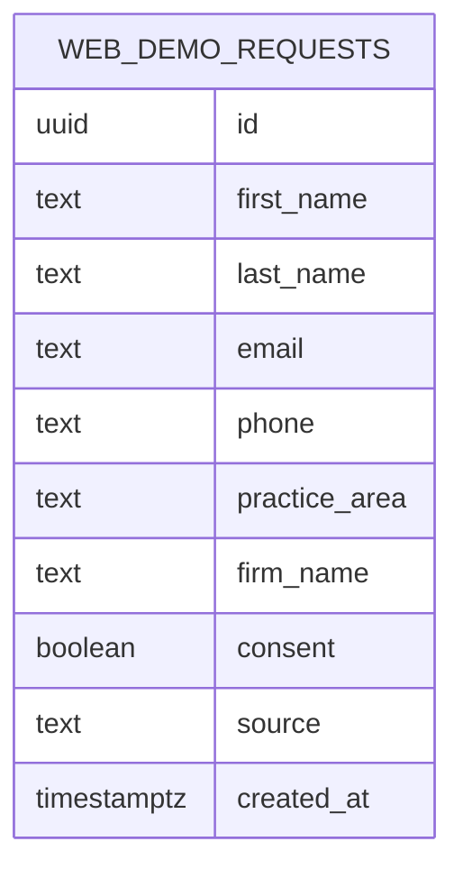
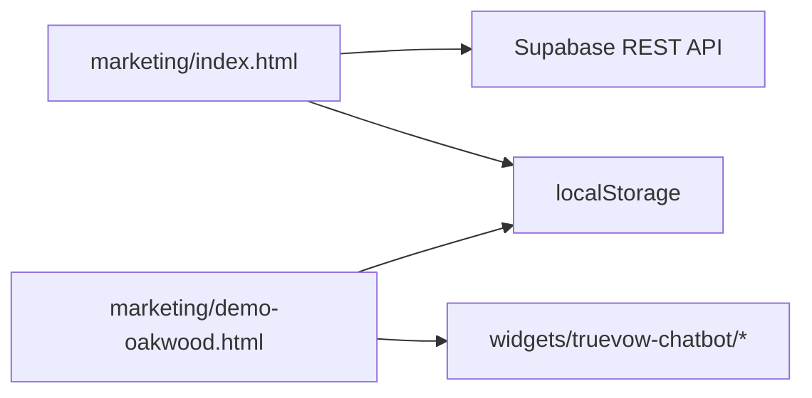

# Demo Request Form

<cite>
**Referenced Files in This Document**
- [index.html](file://marketing/index.html)
- [demo-oakwood.html](file://marketing/demo-oakwood.html)
- [chatbot.js](file://widgets/truevow-chatbot/chatbot.js)
- [chatbot.css](file://widgets/truevow-chatbot/chatbot.css)
- [CREATE_DEMO_REQUESTS_TABLE.sql](file://supabase/CREATE_DEMO_REQUESTS_TABLE.sql)
</cite>

## Table of Contents
1. [Introduction](#introduction)
2. [Project Structure](#project-structure)
3. [Core Components](#core-components)
4. [Architecture Overview](#architecture-overview)
5. [Detailed Component Analysis](#detailed-component-analysis)
6. [Dependency Analysis](#dependency-analysis)
7. [Performance Considerations](#performance-considerations)
8. [Troubleshooting Guide](#troubleshooting-guide)
9. [Conclusion](#conclusion)

## Introduction
This document provides comprehensive documentation for the Demo Request Form system used on the TrueVow marketing website. The system captures prospective attorney demo requests on the homepage, validates the input, normalizes US phone numbers, submits data to Supabase, and redirects users to a dedicated demo experience page. It also integrates local storage to persist lead data for downstream conversion flows and includes a companion web chat experience.

## Project Structure
The Demo Request Form spans three primary locations:
- Homepage form and validation logic
- Demo experience page with local storage integration
- Web chat widget for additional engagement

**Diagram sources**
- [index.html](file://marketing/index.html#L84-L242)
- [demo-oakwood.html](file://marketing/demo-oakwood.html#L1408-L2109)
- [chatbot.js](file://widgets/truevow-chatbot/chatbot.js#L1-L99)
- [chatbot.css](file://widgets/truevow-chatbot/chatbot.css#L1-L614)

**Section sources**
- [index.html](file://marketing/index.html#L56-L243)
- [demo-oakwood.html](file://marketing/demo-oakwood.html#L1335-L2109)
- [chatbot.js](file://widgets/truevow-chatbot/chatbot.js#L1-L99)
- [chatbot.css](file://widgets/truevow-chatbot/chatbot.css#L1-L614)

## Core Components
- Form fields: first_name, last_name, phone, email, practice_area, firm_name, consent
- Phone normalization and formatting functions
- Supabase integration for web_demo_requests table
- Redirect workflow to demo-oakwood.html
- Local storage integration for lead persistence
- Web chat widget for enhanced demo experience

**Section sources**
- [index.html](file://marketing/index.html#L56-L243)
- [demo-oakwood.html](file://marketing/demo-oakwood.html#L2072-L2098)
- [chatbot.js](file://widgets/truevow-chatbot/chatbot.js#L1-L99)

## Architecture Overview
The Demo Request Form follows a straightforward frontend-to-backend flow:
1. User submits the homepage form
2. Client-side validation and phone normalization occur
3. Form data is posted to Supabase via REST API
4. On success, lead data is persisted to localStorage
5. User is redirected to demo-oakwood.html
6. The demo page reads localStorage to personalize the apply experience and displays the chat widget

**Diagram sources**
- [index.html](file://marketing/index.html#L152-L238)
- [demo-oakwood.html](file://marketing/demo-oakwood.html#L2072-L2098)

## Detailed Component Analysis

### Homepage Demo Form
The homepage form collects the required fields and applies real-time phone formatting/validation. Submission is handled via a fetch POST to Supabase with appropriate headers.

Key behaviors:
- Real-time phone formatting: formats input as (XXX) XXX-XXXX during typing
- Validation: ensures a valid 10-digit US phone number before submission
- Supabase POST: sends normalized data plus source metadata
- Success: clears form, stores lead in localStorage, and redirects to demo page

**Diagram sources**
- [index.html](file://marketing/index.html#L152-L238)

**Section sources**
- [index.html](file://marketing/index.html#L56-L243)

### Phone Number Normalization and Formatting
The system includes two complementary functions:
- normalizePhone: extracts 10 digits, accepts optional leading 1
- formatDemoPhoneInput: formats digits as the user types

Validation pattern:
- Accepts 10 digits or 11 digits starting with 1
- Rejects international numbers or partial inputs

**Section sources**
- [index.html](file://marketing/index.html#L118-L150)

### Supabase Integration
The form posts to the web_demo_requests table using Supabase's REST API:
- Endpoint: /rest/v1/web_demo_requests
- Headers: Content-Type, apikey, Authorization (Bearer), Prefer: return=representation
- Table schema: includes id, timestamps, and all form fields plus source

**Diagram sources**
- [CREATE_DEMO_REQUESTS_TABLE.sql](file://supabase/CREATE_DEMO_REQUESTS_TABLE.sql#L7-L18)

**Section sources**
- [index.html](file://marketing/index.html#L188-L198)
- [CREATE_DEMO_REQUESTS_TABLE.sql](file://supabase/CREATE_DEMO_REQUESTS_TABLE.sql#L1-L63)

### Redirect Workflow and Lead Persistence
On successful submission:
- Form resets and user is redirected to demo-oakwood.html
- Lead data is stored in localStorage under truevowDemoLead with a stored_at timestamp
- The demo page reads this data to personalize the apply banner

**Section sources**
- [index.html](file://marketing/index.html#L214-L220)
- [demo-oakwood.html](file://marketing/demo-oakwood.html#L2072-L2098)

### Web Chat Widget Integration
The demo page loads a reusable chat widget that provides:
- Interactive chat and voice capabilities
- Multiple theme presets
- Persistent launcher and floating hand indicators

**Section sources**
- [demo-oakwood.html](file://marketing/demo-oakwood.html#L1408-L1414)
- [chatbot.js](file://widgets/truevow-chatbot/chatbot.js#L1-L99)
- [chatbot.css](file://widgets/truevow-chatbot/chatbot.css#L1-L614)

## Dependency Analysis
- Frontend dependencies:
  - Supabase REST API for form submissions
  - localStorage for cross-page lead persistence
  - Third-party chat widget library
- Backend dependency:
  - Supabase web_demo_requests table with appropriate policies

**Diagram sources**
- [index.html](file://marketing/index.html#L84-L242)
- [demo-oakwood.html](file://marketing/demo-oakwood.html#L1408-L2109)
- [chatbot.js](file://widgets/truevow-chatbot/chatbot.js#L1-L99)

**Section sources**
- [index.html](file://marketing/index.html#L84-L242)
- [demo-oakwood.html](file://marketing/demo-oakwood.html#L1408-L2109)

## Performance Considerations
- Client-side validation reduces unnecessary network requests
- Minimal DOM manipulation during phone formatting improves responsiveness
- localStorage usage avoids repeated server round-trips for demo page personalization
- Chat widget is lazy-loaded and conditionally shown to reduce initial payload

## Troubleshooting Guide
Common validation errors and resolutions:
- Invalid phone number: Ensure 10-digit US number or 11-digit with leading 1; the formatter will guide proper input
- Missing required fields: All fields except practice_area are required; consent checkbox must be checked
- Network errors: Verify Supabase endpoint availability and API keys; check browser console for detailed error messages
- Redirect issues: Confirm localStorage is enabled and demo-oakwood.html is accessible

**Section sources**
- [index.html](file://marketing/index.html#L142-L150)
- [index.html](file://marketing/index.html#L188-L238)

## Conclusion
The Demo Request Form system provides a streamlined, validated, and reliable pathway for capturing attorney demo requests. Its combination of client-side validation, robust phone normalization, Supabase integration, and localStorage-based lead persistence creates a seamless user experience that transitions smoothly into the demo experience and chat engagement.