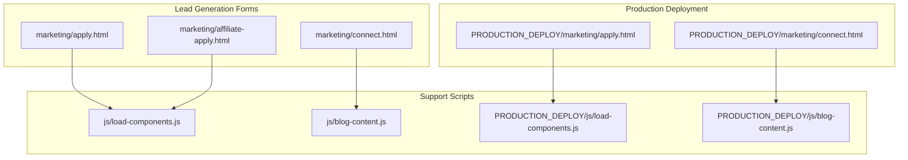
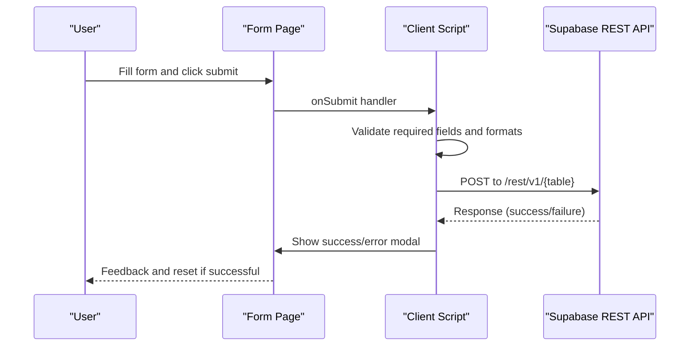
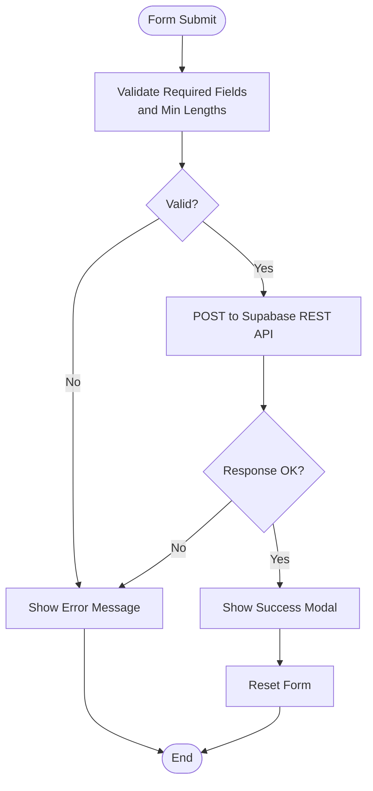
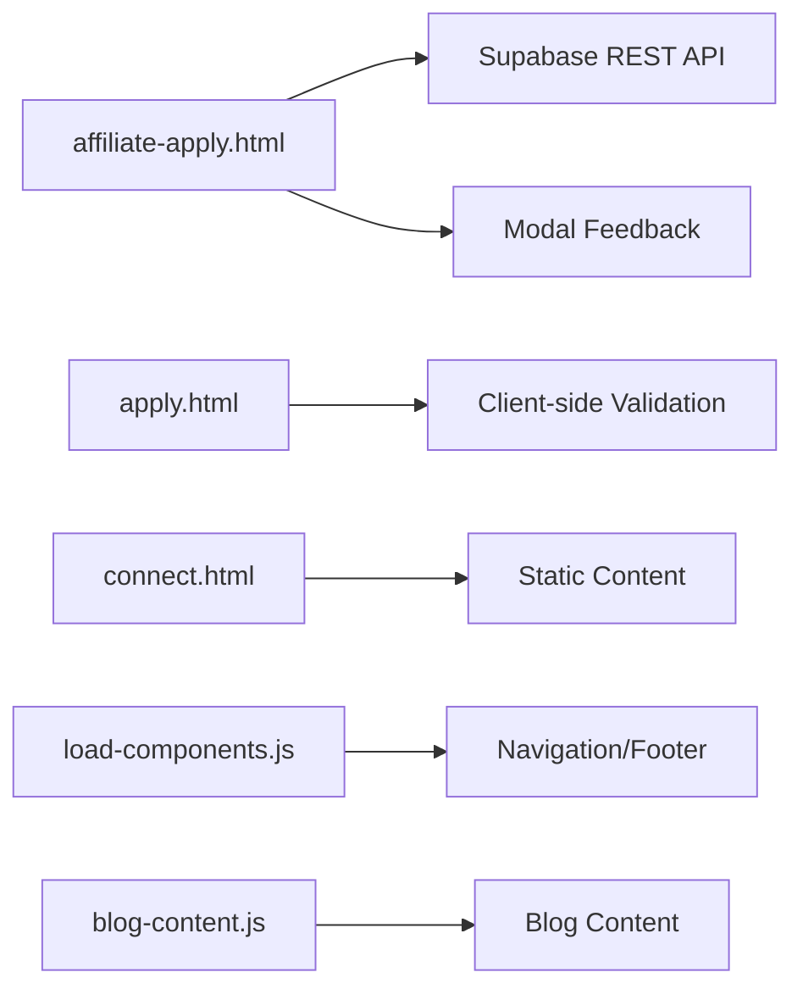

# Form Validation & Security

<cite>
**Referenced Files in This Document**
- [apply.html](file://marketing/apply.html)
- [apply.html](file://PRODUCTION_DEPLOY/marketing/apply.html)
- [connect.html](file://marketing/connect.html)
- [connect.html](file://PRODUCTION_DEPLOY/marketing/connect.html)
- [affiliate-apply.html](file://marketing/affiliate-apply.html)
- [apply.html](file://apply.html)
- [load-components.js](file://js/load-components.js)
- [blog-content.js](file://js/blog-content.js)
- [load-components.js](file://PRODUCTION_DEPLOY/js/load-components.js)
- [blog-content.js](file://PRODUCTION_DEPLOY/js/blog-content.js)
</cite>

## Table of Contents
1. [Introduction](#introduction)
2. [Project Structure](#project-structure)
3. [Core Components](#core-components)
4. [Architecture Overview](#architecture-overview)
5. [Detailed Component Analysis](#detailed-component-analysis)
6. [Dependency Analysis](#dependency-analysis)
7. [Performance Considerations](#performance-considerations)
8. [Troubleshooting Guide](#troubleshooting-guide)
9. [Conclusion](#conclusion)
10. [Appendices](#appendices)

## Introduction
This document provides comprehensive guidance on form validation and security across lead generation forms in the TrueVow website. It focuses on:
- Phone number normalization and US phone validation patterns
- Input sanitization and client-side validation for required fields, email format, and practice area selection
- Security measures including CORS configuration, API key management, and data transmission protocols
- Error handling strategies, user feedback mechanisms, and accessibility considerations
- Extending validation rules, implementing additional security measures, and debugging validation issues
- Compliance considerations for legal technology services and data protection regulations

## Project Structure
Lead generation forms are primarily implemented in static HTML pages under the marketing directory, with embedded client-side JavaScript for validation and submission. Supporting scripts manage component loading and blog content.

**Diagram sources**
- [apply.html](file://marketing/apply.html#L1-L2129)
- [connect.html](file://marketing/connect.html#L1-L1047)
- [affiliate-apply.html](file://marketing/affiliate-apply.html#L1-L831)
- [load-components.js](file://js/load-components.js)
- [blog-content.js](file://js/blog-content.js)
- [load-components.js](file://PRODUCTION_DEPLOY/js/load-components.js)
- [blog-content.js](file://PRODUCTION_DEPLOY/js/blog-content.js)

**Section sources**
- [apply.html](file://marketing/apply.html#L1-L2129)
- [connect.html](file://marketing/connect.html#L1-L1047)
- [affiliate-apply.html](file://marketing/affiliate-apply.html#L1-L831)
- [apply.html](file://apply.html#L1-L17)

## Core Components
- Lead generation forms:
  - Application form for intake services with multi-step validation and state/counties integration
  - CONNECT waitlist and informational page
  - Affiliate program application form with country/state/city cascading and submission via REST API
- Supporting scripts:
  - Component loader and blog content scripts for dynamic content injection

Key validation and security highlights:
- Required field enforcement via HTML attributes
- Email format validation via HTML input type
- ZIP code pattern validation via HTML pattern attribute
- Phone number formatting/validation via inline event handlers
- Submission to external REST endpoint with API key management
- Modal-based user feedback and error handling

**Section sources**
- [apply.html](file://marketing/apply.html#L536-L800)
- [affiliate-apply.html](file://marketing/affiliate-apply.html#L617-L749)

## Architecture Overview
The forms rely on client-side validation and direct REST submissions. The affiliate application form demonstrates explicit API key usage and modal-based feedback.

**Diagram sources**
- [affiliate-apply.html](file://marketing/affiliate-apply.html#L617-L749)

## Detailed Component Analysis

### Application Form (Intake Services)
- Purpose: Collects attorney and firm information, practice details, eligibility confirmation, and submission review.
- Validation:
  - Required fields enforced via HTML required attribute
  - Email format validated via input type=email
  - ZIP code validated via pattern attribute [0-9]{5}(-[0-9]{4})?
  - Phone number formatting/validation via onblur/oninput handlers
  - Practice area selection required
  - Eligibility checkboxes required
- Data Transmission:
  - Multi-step form with progress indicators
  - State/counties integration and capacity checks
  - Review summary generation prior to submission

Security considerations:
- Client-side validation only; server-side validation recommended for production
- No explicit CORS configuration observed in the form
- No API key management demonstrated in this form

Accessibility:
- Clear labels and required indicators
- Progress steps aid navigation
- Focus styles applied to interactive elements

**Section sources**
- [apply.html](file://marketing/apply.html#L536-L800)
- [apply.html](file://PRODUCTION_DEPLOY/marketing/apply.html#L536-L800)

### CONNECT Page
- Purpose: Informational page for the CONNECT referral network service.
- Validation:
  - No form-specific validation logic present
  - Focus on educational content and waitlist messaging
- Data Transmission:
  - No client-side form submission observed
  - Waitlist messaging and links to application

Security considerations:
- No form submissions; minimal exposure surface
- Educational content with compliance messaging

**Section sources**
- [connect.html](file://marketing/connect.html#L1-L1047)
- [connect.html](file://PRODUCTION_DEPLOY/marketing/connect.html#L1-L1047)

### Affiliate Application Form
- Purpose: Collects candidate information and responses to behavioral questions.
- Validation:
  - Required fields enforced via HTML required attribute
  - Minimum length enforced via minlength on textareas
  - Country/state/city cascading logic for location selection
- Data Transmission:
  - Submits directly to Supabase REST API
  - Uses API key via Authorization header and Prefer header
  - Modal-based success/error feedback

Security considerations:
- API key exposed in client-side code; consider server-side proxy
- Minimal input sanitization; sanitize and validate on server
- CORS policy managed by Supabase; ensure appropriate origin policies

**Diagram sources**
- [affiliate-apply.html](file://marketing/affiliate-apply.html#L617-L749)

**Section sources**
- [affiliate-apply.html](file://marketing/affiliate-apply.html#L1-L831)

### Support Scripts
- Component Loader:
  - Dynamically loads reusable components (navigation, footer, widgets)
  - Ensures consistent branding and navigation across pages
- Blog Content:
  - Loads and injects blog content into pages
  - Supports dynamic content updates

Security considerations:
- Ensure proper CSP and origin controls for loaded components
- Validate and sanitize injected content

**Section sources**
- [load-components.js](file://js/load-components.js)
- [blog-content.js](file://js/blog-content.js)
- [load-components.js](file://PRODUCTION_DEPLOY/js/load-components.js)
- [blog-content.js](file://PRODUCTION_DEPLOY/js/blog-content.js)

## Dependency Analysis
- Forms depend on embedded JavaScript for validation and submission
- Affiliate form depends on Supabase REST API for persistence
- Support scripts provide cross-page functionality and content injection

**Diagram sources**
- [affiliate-apply.html](file://marketing/affiliate-apply.html#L617-L749)
- [apply.html](file://marketing/apply.html#L536-L800)
- [connect.html](file://marketing/connect.html#L1-L1047)
- [load-components.js](file://js/load-components.js)
- [blog-content.js](file://js/blog-content.js)

**Section sources**
- [affiliate-apply.html](file://marketing/affiliate-apply.html#L617-L749)
- [apply.html](file://marketing/apply.html#L536-L800)
- [connect.html](file://marketing/connect.html#L1-L1047)
- [load-components.js](file://js/load-components.js)
- [blog-content.js](file://js/blog-content.js)

## Performance Considerations
- Client-side validation reduces server load but does not replace server-side validation
- Modal feedback avoids page reloads, improving perceived performance
- Consider lazy-loading heavy components and deferring non-critical scripts
- Optimize form rendering and minimize DOM manipulations during validation

## Troubleshooting Guide
Common issues and resolutions:
- Phone number validation fails:
  - Ensure input follows accepted formats: (XXX) XXX-XXXX, XXX-XXX-XXXX, XXXXXXXXXX
  - Verify onblur/oninput handlers are firing and updating error messages
- ZIP code validation fails:
  - Confirm pattern attribute matches [0-9]{5}(-[0-9]{4})?
  - Check maxlength and lookupCountyFromZipcode function
- Email validation fails:
  - Verify input type=email and required attribute
- Affiliate submission errors:
  - Check API key validity and endpoint URL
  - Inspect browser console for CORS or network errors
  - Ensure Prefer header and Authorization header are correctly set
- Modal not appearing:
  - Verify modal overlay and content elements exist
  - Check event listeners for closing modals

Debugging tips:
- Use browser developer tools to inspect network requests and responses
- Log validation results and error messages to console
- Test edge cases: empty fields, invalid formats, maximum lengths

**Section sources**
- [affiliate-apply.html](file://marketing/affiliate-apply.html#L617-L749)
- [apply.html](file://marketing/apply.html#L536-L800)

## Conclusion
The lead generation forms implement essential client-side validation and user feedback mechanisms. The affiliate application form demonstrates direct REST API submission with explicit API key usage. To strengthen security and compliance:
- Implement server-side validation and sanitization
- Move API keys to server-side configuration
- Establish robust CORS policies and Content Security Policies
- Enhance error handling and logging
- Conduct regular security audits and penetration testing

## Appendices

### Phone Number Normalization and Validation Patterns
- Accepted formats:
  - (XXX) XXX-XXXX
  - XXX-XXX-XXXX
  - XXXXXXXXXX
- Validation approach:
  - onblur handler validates format and displays error message
  - oninput handler formats input in real-time
- Recommendation:
  - Normalize to E.164 format on submission
  - Implement server-side validation against recognized US patterns

**Section sources**
- [apply.html](file://marketing/apply.html#L562-L565)

### Input Sanitization Techniques
- HTML required attribute for mandatory fields
- HTML pattern attribute for ZIP code validation
- HTML input type=email for email format validation
- minlength attribute for textarea content length
- Cascading selects for location data integrity

Recommendations:
- Sanitize all inputs on server-side
- Implement rate limiting and CAPTCHA for forms
- Use CSP headers to mitigate XSS risks

**Section sources**
- [apply.html](file://marketing/apply.html#L663-L667)
- [affiliate-apply.html](file://marketing/affiliate-apply.html#L544-L590)

### Security Measures and Compliance
- CORS configuration:
  - Supabase manages CORS; ensure origins are restricted to production domains
- API key management:
  - API keys exposed in client-side code; move to server-side proxy
- Data transmission:
  - HTTPS required for all form submissions
  - Consider end-to-end encryption for sensitive legal data
- Legal technology compliance:
  - Bar compliance and zero-knowledge architecture for CONNECT
  - Ensure data retention and deletion policies align with state regulations
  - Implement audit trails for data access and modifications

**Section sources**
- [affiliate-apply.html](file://marketing/affiliate-apply.html#L617-L749)
- [connect.html](file://marketing/connect.html#L416-L449)

### Extending Validation Rules
- Add custom validators for practice area selection and capacity checks
- Implement real-time validation with debouncing for ZIP code and phone number
- Extend affiliate form with additional behavioral validation
- Integrate third-party validation libraries for enhanced security

### Accessibility Considerations
- Ensure all form controls have associated labels
- Provide visible focus indicators and keyboard navigation
- Use ARIA attributes for dynamic content and error messages
- Test with screen readers and assistive technologies