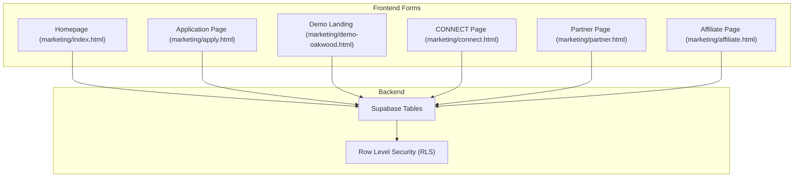
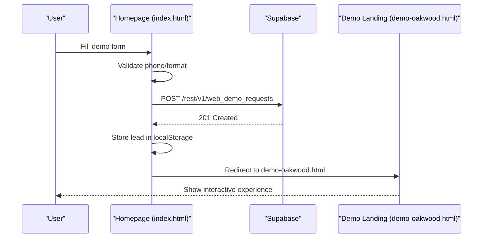
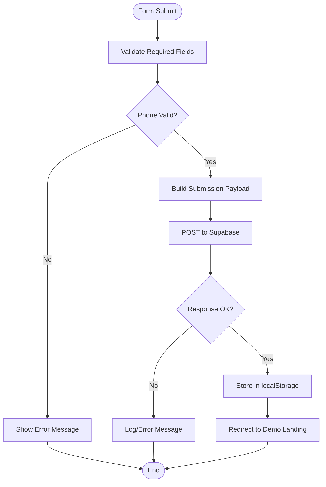
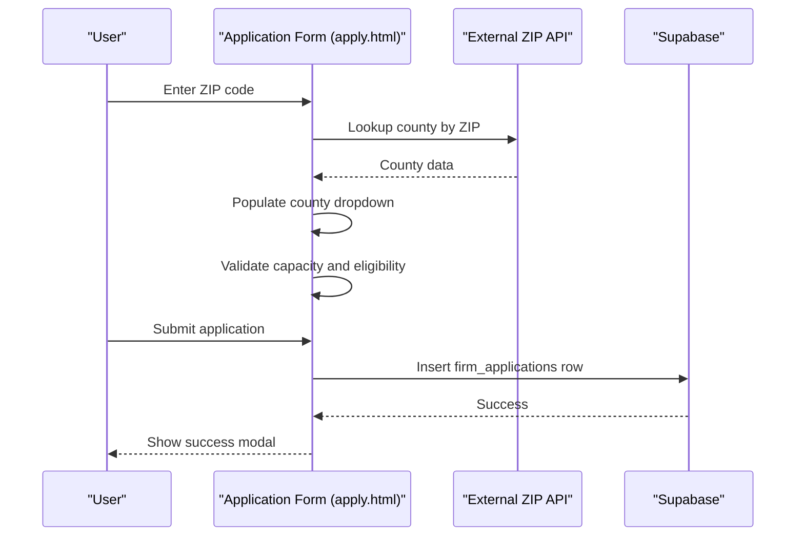
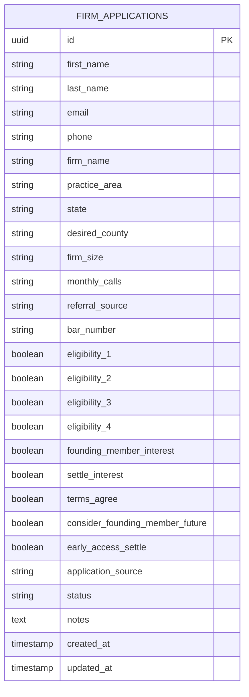
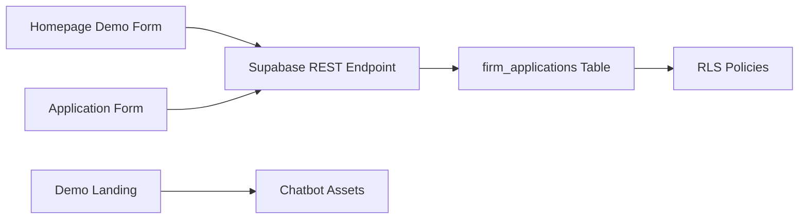

# Lead Generation System

<cite>
**Referenced Files in This Document**
- [marketing/index.html](file://marketing/index.html)
- [marketing/apply.html](file://marketing/apply.html)
- [marketing/demo-oakwood.html](file://marketing/demo-oakwood.html)
- [supabase/create-form-submission-tables.sql](file://supabase/create-form-submission-tables.sql)
- [supabase/check-and-create-form-tables.sql](file://supabase/check-and-create-form-tables.sql)
- [marketing/connect.html](file://marketing/connect.html)
- [marketing/partner.html](file://marketing/partner.html)
- [marketing/affiliate.html](file://marketing/affiliate.html)
</cite>

## Table of Contents
1. [Introduction](#introduction)
2. [Project Structure](#project-structure)
3. [Core Components](#core-components)
4. [Architecture Overview](#architecture-overview)
5. [Detailed Component Analysis](#detailed-component-analysis)
6. [Dependency Analysis](#dependency-analysis)
7. [Performance Considerations](#performance-considerations)
8. [Troubleshooting Guide](#troubleshooting-guide)
9. [Security and Compliance](#security-and-compliance)
10. [Conclusion](#conclusion)

## Introduction
This document describes the Lead Generation System that powers demo requests, application submissions, and newsletter sign-ups across TrueVow's website. It explains the form architecture, validation patterns, submission workflows, and data processing pipeline. It also covers the integration between homepage demo requests and dedicated application pages, along with field configurations, error handling, success messaging, redirects, and the relationship to Supabase database tables. Practical guidance is provided for customization, styling integration, and analytics tracking for conversion optimization, alongside security considerations, spam prevention, and compliance requirements for legal technology services.

## Project Structure
The Lead Generation System spans several marketing pages and backend database schemas:
- Homepage demo request form and embedded chatbot experience
- Dedicated application form for firm onboarding
- Demo landing page with interactive experience and chatbot
- Supabase schema for storing form submissions
- Additional conversion-focused pages (CONNECT, Partner, Affiliate)

**Diagram sources**
- [marketing/index.html](file://marketing/index.html#L63-L243)
- [marketing/apply.html](file://marketing/apply.html#L536-L914)
- [marketing/demo-oakwood.html](file://marketing/demo-oakwood.html#L1-L1200)
- [supabase/create-form-submission-tables.sql](file://supabase/create-form-submission-tables.sql#L11-L39)

**Section sources**
- [marketing/index.html](file://marketing/index.html#L63-L243)
- [marketing/apply.html](file://marketing/apply.html#L536-L914)
- [marketing/demo-oakwood.html](file://marketing/demo-oakwood.html#L1-L1200)
- [supabase/create-form-submission-tables.sql](file://supabase/create-form-submission-tables.sql#L11-L39)

## Core Components
- Homepage Demo Request Form: Collects contact and practice details, performs client-side validation, submits to Supabase, and redirects to demo landing page.
- Application Form (apply.html): Multi-step form collecting firm details, eligibility, and preferences, with ZIP code-to-county lookup and capacity validation.
- Demo Landing Page (demo-oakwood.html): Provides interactive Benjamin experience, embedded chatbot, and conversion-focused messaging.
- Supabase Schema: Defines firm_applications table with RLS policies enabling public inserts and indexing for performance.
- Additional Conversion Pages: CONNECT, Partner, and Affiliate pages that complement lead generation with complementary offerings.

Key implementation highlights:
- Client-side validation for phone formatting and required fields
- Local storage caching of demo lead data for session continuity
- Redirect-based success flow to demo landing page
- ZIP code lookup via external API with county mapping
- Eligibility checkboxes and terms agreement for legal compliance

**Section sources**
- [marketing/index.html](file://marketing/index.html#L63-L243)
- [marketing/apply.html](file://marketing/apply.html#L536-L914)
- [marketing/demo-oakwood.html](file://marketing/demo-oakwood.html#L1-L1200)
- [supabase/create-form-submission-tables.sql](file://supabase/create-form-submission-tables.sql#L11-L39)

## Architecture Overview
The system integrates frontend forms with Supabase for persistence and RLS enforcement. The homepage demo form posts to a Supabase endpoint, caches lead data locally, and redirects to the demo landing page. The application form posts to the same Supabase table with additional fields and validation.

**Diagram sources**
- [marketing/index.html](file://marketing/index.html#L152-L238)
- [marketing/demo-oakwood.html](file://marketing/demo-oakwood.html#L1-L1200)

## Detailed Component Analysis

### Homepage Demo Request Form
- Purpose: Capture initial demo interest with minimal friction
- Fields: First name, last name, phone, email, practice area, firm name, consent checkbox
- Validation: Phone normalization/formatting, required fields, US phone validation
- Submission: Uses Supabase REST endpoint with Authorization and API Key headers
- Success flow: Resets form, stores lead payload in localStorage, redirects to demo landing page

**Diagram sources**
- [marketing/index.html](file://marketing/index.html#L152-L238)

**Section sources**
- [marketing/index.html](file://marketing/index.html#L63-L243)
- [marketing/index.html](file://marketing/index.html#L152-L238)

### Application Form (apply.html)
- Purpose: Comprehensive firm application with multi-step wizard
- Steps: Personal info → Practice details → Eligibility → Review & submit
- Advanced features:
  - ZIP code to county lookup via external API
  - County capacity validation and alerts
  - Eligibility checkboxes with dynamic messaging
  - Terms and conditions, founding member interest, and settlement interest toggles
- Submission: Posts to firm_applications table with extensive metadata

**Diagram sources**
- [marketing/apply.html](file://marketing/apply.html#L1154-L1200)
- [marketing/apply.html](file://marketing/apply.html#L536-L914)

**Section sources**
- [marketing/apply.html](file://marketing/apply.html#L536-L914)
- [marketing/apply.html](file://marketing/apply.html#L1154-L1200)

### Demo Landing Page (demo-oakwood.html)
- Purpose: Deliver interactive Benjamin experience and embedded chatbot
- Features: Floating chat launcher, animated chat widget, theme switching, voice overlays
- Integration: Loads chatbot CSS and JS, provides immersive demo experience

**Section sources**
- [marketing/demo-oakwood.html](file://marketing/demo-oakwood.html#L1-L1200)

### Supabase Schema and Data Model
The system persists form submissions in a structured schema with RLS policies for secure access.

**Diagram sources**
- [supabase/create-form-submission-tables.sql](file://supabase/create-form-submission-tables.sql#L11-L39)

**Section sources**
- [supabase/create-form-submission-tables.sql](file://supabase/create-form-submission-tables.sql#L11-L39)
- [supabase/check-and-create-form-tables.sql](file://supabase/check-and-create-form-tables.sql#L18-L46)

### Additional Conversion Pages
- CONNECT: Referral network for attorneys with bar-compliant architecture and ROI calculator
- Partner: Partner referral program with earning potential and guidelines
- Affiliate: Commission-based affiliate program with clear disclaimers and fair policies

**Section sources**
- [marketing/connect.html](file://marketing/connect.html#L1-L1047)
- [marketing/partner.html](file://marketing/partner.html#L1-L1678)
- [marketing/affiliate.html](file://marketing/affiliate.html#L1-L975)

## Dependency Analysis
The system exhibits clear separation of concerns:
- Frontend forms depend on Supabase REST endpoints for persistence
- Application form depends on external ZIP code API for geolocation
- Demo landing page depends on embedded chatbot assets
- Database schema enforces access control via RLS policies

**Diagram sources**
- [marketing/index.html](file://marketing/index.html#L188-L198)
- [marketing/apply.html](file://marketing/apply.html#L1177-L1182)
- [supabase/create-form-submission-tables.sql](file://supabase/create-form-submission-tables.sql#L46-L54)

**Section sources**
- [marketing/index.html](file://marketing/index.html#L188-L198)
- [marketing/apply.html](file://marketing/apply.html#L1177-L1182)
- [supabase/create-form-submission-tables.sql](file://supabase/create-form-submission-tables.sql#L46-L54)

## Performance Considerations
- Client-side validation reduces server load and improves UX
- Local storage caching minimizes repeated network requests for demo sessions
- ZIP code lookup occurs only on demand to avoid unnecessary API calls
- Supabase indexing on frequently queried columns (email, status, timestamps) supports efficient queries
- Embedded chatbot assets are loaded conditionally to minimize initial page weight

## Troubleshooting Guide
Common issues and resolutions:
- Demo form submission failures:
  - Verify Supabase endpoint URL and API key configuration
  - Check browser console for CORS or network errors
  - Confirm localStorage availability for lead caching
- ZIP code lookup failures:
  - Ensure external API is reachable and returning expected JSON
  - Validate state selection before ZIP lookup
  - Handle API rate limits gracefully
- County capacity warnings:
  - Implement retry logic for capacity checks
  - Provide fallback options when capacity is exceeded
- RLS policy errors:
  - Confirm Row Level Security is enabled on firm_applications
  - Verify public insert policy allows anonymous submissions

**Section sources**
- [marketing/index.html](file://marketing/index.html#L221-L237)
- [marketing/apply.html](file://marketing/apply.html#L1177-L1182)
- [supabase/create-form-submission-tables.sql](file://supabase/create-form-submission-tables.sql#L46-L54)

## Security and Compliance
- Data Protection:
  - Supabase RLS policies restrict access to form submissions
  - Public insert policy enables anonymous submissions while maintaining security
  - No sensitive data stored in frontend localStorage beyond demo session identifiers
- Legal Technology Requirements:
  - Application form collects bar license information for eligibility verification
  - Terms and compliance checkboxes ensure user acknowledgment of legal obligations
  - CONNECT page emphasizes bar-compliant architecture and zero-knowledge design
- Privacy and Consent:
  - Explicit consent checkboxes for marketing communications
  - Clear opt-out mechanisms and data handling disclosures
  - GDPR-aligned data collection practices reflected in form fields

**Section sources**
- [supabase/create-form-submission-tables.sql](file://supabase/create-form-submission-tables.sql#L46-L54)
- [marketing/apply.html](file://marketing/apply.html#L726-L782)
- [marketing/connect.html](file://marketing/connect.html#L416-L449)

## Conclusion
The Lead Generation System provides a robust, scalable foundation for capturing high-quality leads across multiple touchpoints. Its modular design, client-side validation, and Supabase-backed persistence enable seamless user experiences while maintaining security and compliance. The integration between homepage demos, application forms, and conversion-focused pages creates a cohesive funnel optimized for legal technology services. Future enhancements should focus on analytics integration, A/B testing capabilities, and expanded compliance automation.