# Reusable Component Library

<cite>
**Referenced Files in This Document**
- [STANDARD_NAVIGATION.html](file://components/STANDARD_NAVIGATION.html)
- [STANDARD_FOOTER.html](file://components/STANDARD_FOOTER.html)
- [prefill-indicator.html](file://components/prefill-indicator.html)
- [exit-intent-popup.html](file://components/exit-intent-popup.html)
- [load-components.js](file://js/load-components.js)
- [live-chat-widget.html](file://components/live-chat-widget.html)
- [trust-badges.html](file://components/trust-badges.html)
- [roi-calculator.html](file://components/roi-calculator.html)
- [social-proof-notifications.html](file://components/social-proof-notifications.html)
- [urgency-timer.html](file://components/urgency-timer.html)
- [video-testimonial.html](file://components/video-testimonial.html)
- [phone-call-offer.html](file://components/phone-call-offer.html)
- [README.md](file://README.md)
</cite>

## Table of Contents
1. [Introduction](#introduction)
2. [Project Structure](#project-structure)
3. [Core Components](#core-components)
4. [Architecture Overview](#architecture-overview)
5. [Detailed Component Analysis](#detailed-component-analysis)
6. [Dependency Analysis](#dependency-analysis)
7. [Performance Considerations](#performance-considerations)
8. [Troubleshooting Guide](#troubleshooting-guide)
9. [Conclusion](#conclusion)
10. [Appendices](#appendices)

## Introduction
This document describes the Reusable Component Library that standardizes navigation, footers, and promotional elements across the TrueVow website. The library follows a component-based architecture to ensure consistent branding, reduce maintenance overhead, and accelerate development. It includes:
- Standardized navigation and footer components
- Promotional components such as prefill indicators, exit-intent popups, ROI calculators, urgency timers, trust badges, social proof notifications, video testimonials, and phone call offers
- A lightweight loader that injects components into pages
- Guidance for customization, styling integration, and deployment

## Project Structure
The component library is organized under the components directory and loaded via a small JavaScript module. The README outlines the overall project layout and backend integration.

```mermaid
graph TB
subgraph "Website Pages"
Pages["Marketing & Legal Pages<br/>and Blog"]
end
subgraph "Component Library"
Nav["STANDARD_NAVIGATION.html"]
Footer["STANDARD_FOOTER.html"]
Prefill["prefill-indicator.html"]
ExitPopup["exit-intent-popup.html"]
ROI["roi-calculator.html"]
Urgency["urgency-timer.html"]
Trust["trust-badges.html"]
Social["social-proof-notifications.html"]
Chat["live-chat-widget.html"]
Video["video-testimonial.html"]
Phone["phone-call-offer.html"]
end
subgraph "Loader"
Loader["load-components.js"]
end
Pages --> Loader
Loader --> Nav
Loader --> Footer
Pages --> Prefill
Pages --> ExitPopup
Pages --> ROI
Pages --> Urgency
Pages --> Trust
Pages --> Social
Pages --> Chat
Pages --> Video
Pages --> Phone
```

**Diagram sources**
- [STANDARD_NAVIGATION.html](file://components/STANDARD_NAVIGATION.html#L1-L25)
- [STANDARD_FOOTER.html](file://components/STANDARD_FOOTER.html#L1-L61)
- [prefill-indicator.html](file://components/prefill-indicator.html#L1-L187)
- [exit-intent-popup.html](file://components/exit-intent-popup.html#L1-L252)
- [roi-calculator.html](file://components/roi-calculator.html#L1-L488)
- [urgency-timer.html](file://components/urgency-timer.html#L1-L163)
- [trust-badges.html](file://components/trust-badges.html#L1-L240)
- [social-proof-notifications.html](file://components/social-proof-notifications.html#L1-L209)
- [live-chat-widget.html](file://components/live-chat-widget.html#L1-L515)
- [video-testimonial.html](file://components/video-testimonial.html#L1-L410)
- [phone-call-offer.html](file://components/phone-call-offer.html#L1-L298)
- [load-components.js](file://js/load-components.js#L1-L58)

**Section sources**
- [README.md](file://README.md#L46-L121)
- [load-components.js](file://js/load-components.js#L1-L58)

## Core Components
This section highlights the core reusable components and their roles in maintaining consistency and driving conversions.

- STANDARD_NAVIGATION.html: Provides a sticky, responsive navigation bar with logo, menu items, and a prominent CTA.
- STANDARD_FOOTER.html: Offers a three-column sitemap, legal links, and a comprehensive disclaimer.
- Additional promotional components: prefill-indicator, exit-intent-popup, roi-calculator, urgency-timer, trust-badges, social-proof-notifications, live-chat-widget, video-testimonial, phone-call-offer.

These components are designed to be dropped into any page via the loader or manually embedded, ensuring uniform branding and behavior.

**Section sources**
- [STANDARD_NAVIGATION.html](file://components/STANDARD_NAVIGATION.html#L1-L25)
- [STANDARD_FOOTER.html](file://components/STANDARD_FOOTER.html#L1-L61)
- [prefill-indicator.html](file://components/prefill-indicator.html#L1-L187)
- [exit-intent-popup.html](file://components/exit-intent-popup.html#L1-L252)
- [roi-calculator.html](file://components/roi-calculator.html#L1-L488)
- [urgency-timer.html](file://components/urgency-timer.html#L1-L163)
- [trust-badges.html](file://components/trust-badges.html#L1-L240)
- [social-proof-notifications.html](file://components/social-proof-notifications.html#L1-L209)
- [live-chat-widget.html](file://components/live-chat-widget.html#L1-L515)
- [video-testimonial.html](file://components/video-testimonial.html#L1-L410)
- [phone-call-offer.html](file://components/phone-call-offer.html#L1-L298)

## Architecture Overview
The component architecture relies on:
- Single source-of-truth components stored in components/
- A loader that injects components into placeholders on pages
- Inline styles and scripts within components for portability
- Optional analytics hooks for tracking engagement and conversions

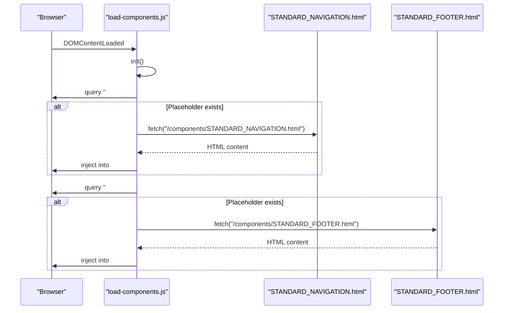

**Diagram sources**
- [load-components.js](file://js/load-components.js#L36-L47)
- [STANDARD_NAVIGATION.html](file://components/STANDARD_NAVIGATION.html#L1-L25)
- [STANDARD_FOOTER.html](file://components/STANDARD_FOOTER.html#L1-L61)

## Detailed Component Analysis

### Navigation Component
The navigation component provides:
- Sticky positioning at the top of the viewport
- Center-aligned menu items with hover effects
- Prominent CTA aligned to the right
- Responsive layout using flexbox

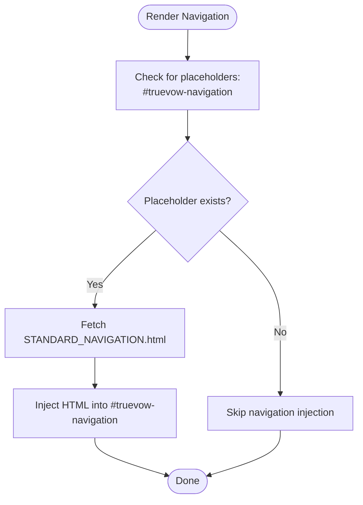

**Diagram sources**
- [load-components.js](file://js/load-components.js#L37-L41)
- [STANDARD_NAVIGATION.html](file://components/STANDARD_NAVIGATION.html#L1-L25)

**Section sources**
- [STANDARD_NAVIGATION.html](file://components/STANDARD_NAVIGATION.html#L1-L25)
- [load-components.js](file://js/load-components.js#L36-L47)

### Footer Component
The footer component organizes:
- Brand logo and tagline
- Three-column sitemap (Product, Resources, Company)
- Legal links with separators
- Copyright and disclaimers

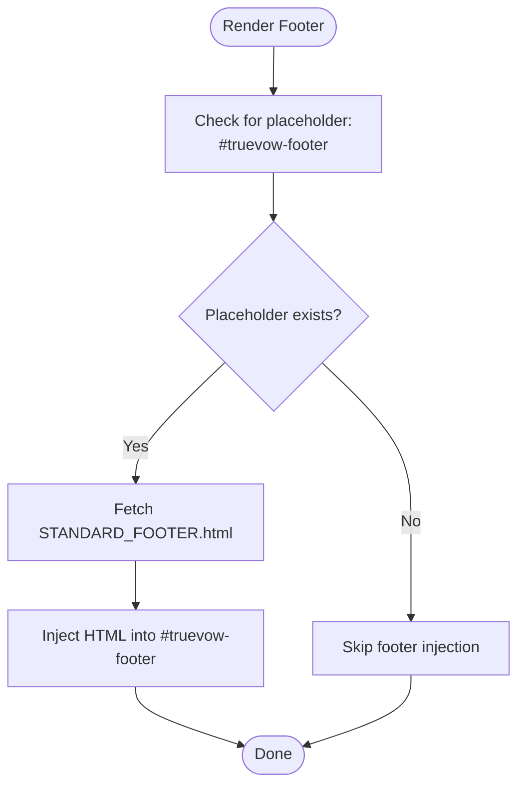

**Diagram sources**
- [load-components.js](file://js/load-components.js#L43-L47)
- [STANDARD_FOOTER.html](file://components/STANDARD_FOOTER.html#L1-L61)

**Section sources**
- [STANDARD_FOOTER.html](file://components/STANDARD_FOOTER.html#L1-L61)
- [load-components.js](file://js/load-components.js#L43-L47)

### Prefill Indicator Component
The prefill indicator:
- Displays a friendly message when a demo session parameter is present
- Pre-fills specific form fields and updates counts
- Animates into view and shows progress
- Integrates with analytics

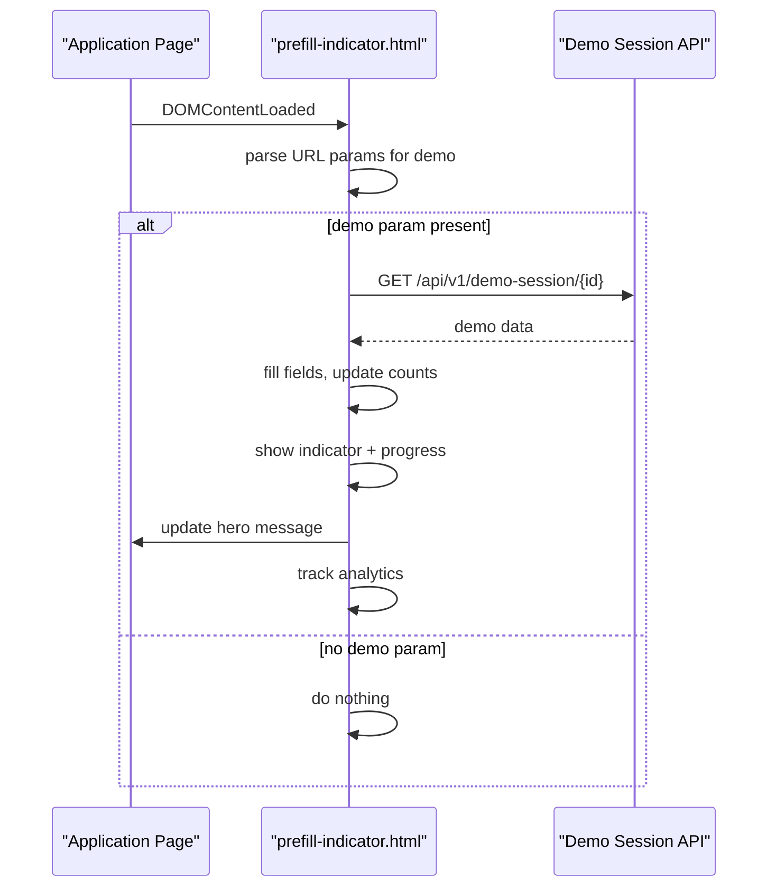

**Diagram sources**
- [prefill-indicator.html](file://components/prefill-indicator.html#L116-L185)

**Section sources**
- [prefill-indicator.html](file://components/prefill-indicator.html#L1-L187)

### Exit-Intent Popup Component
The exit-intent popup:
- Triggers on mouse leave or after a delay
- Shows benefits and a countdown timer
- Tracks analytics on show/close
- Supports closing via overlay click or Escape key

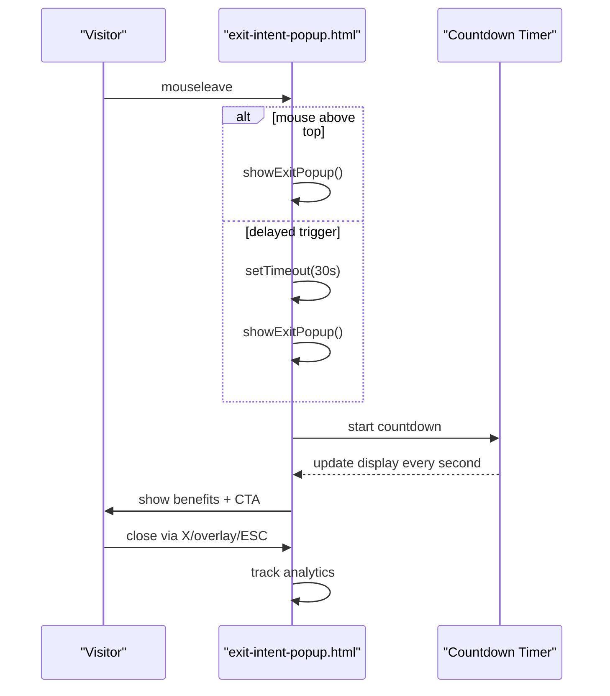

**Diagram sources**
- [exit-intent-popup.html](file://components/exit-intent-popup.html#L180-L250)

**Section sources**
- [exit-intent-popup.html](file://components/exit-intent-popup.html#L1-L252)

### ROI Calculator Component
The ROI calculator:
- Interactive sliders for inbound calls, conversion rate, and case value
- Real-time computation of “before” and “after” bookings and lost revenue
- CTA button with analytics tracking

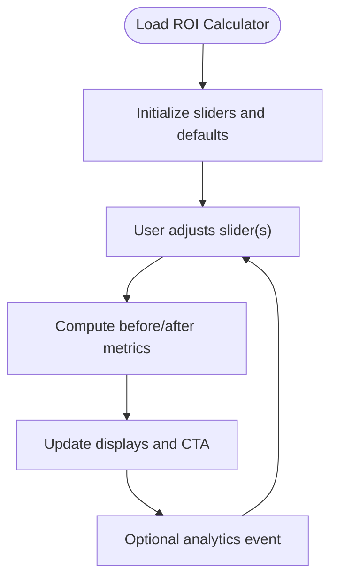

**Diagram sources**
- [roi-calculator.html](file://components/roi-calculator.html#L418-L487)

**Section sources**
- [roi-calculator.html](file://components/roi-calculator.html#L1-L488)

### Urgency Timer Component
The urgency timer:
- Sets an expiry time (e.g., 48 hours) and persists it in local storage
- Updates countdown display and changes color when time is low
- Shows an expired state with messaging

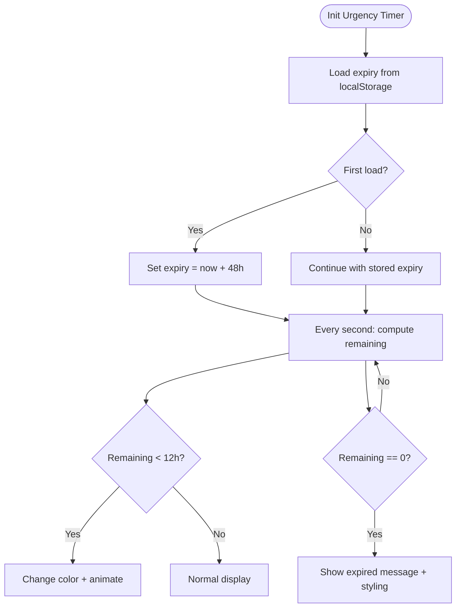

**Diagram sources**
- [urgency-timer.html](file://components/urgency-timer.html#L79-L161)

**Section sources**
- [urgency-timer.html](file://components/urgency-timer.html#L1-L163)

### Trust Badges Component
Trust badges:
- Grid of verified badges with hover effects
- Feature cards highlighting security and service guarantees
- Click-tracking analytics

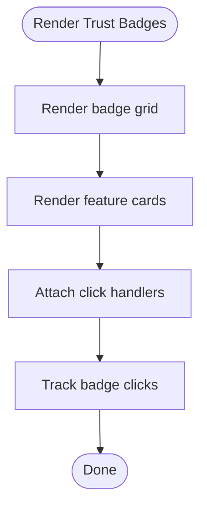

**Diagram sources**
- [trust-badges.html](file://components/trust-badges.html#L134-L240)

**Section sources**
- [trust-badges.html](file://components/trust-badges.html#L1-L240)

### Social Proof Notifications Component
Social proof notifications:
- Rotating real-time notifications with avatar, name, city, and action
- Auto-show after delay and pause near the bottom of the page

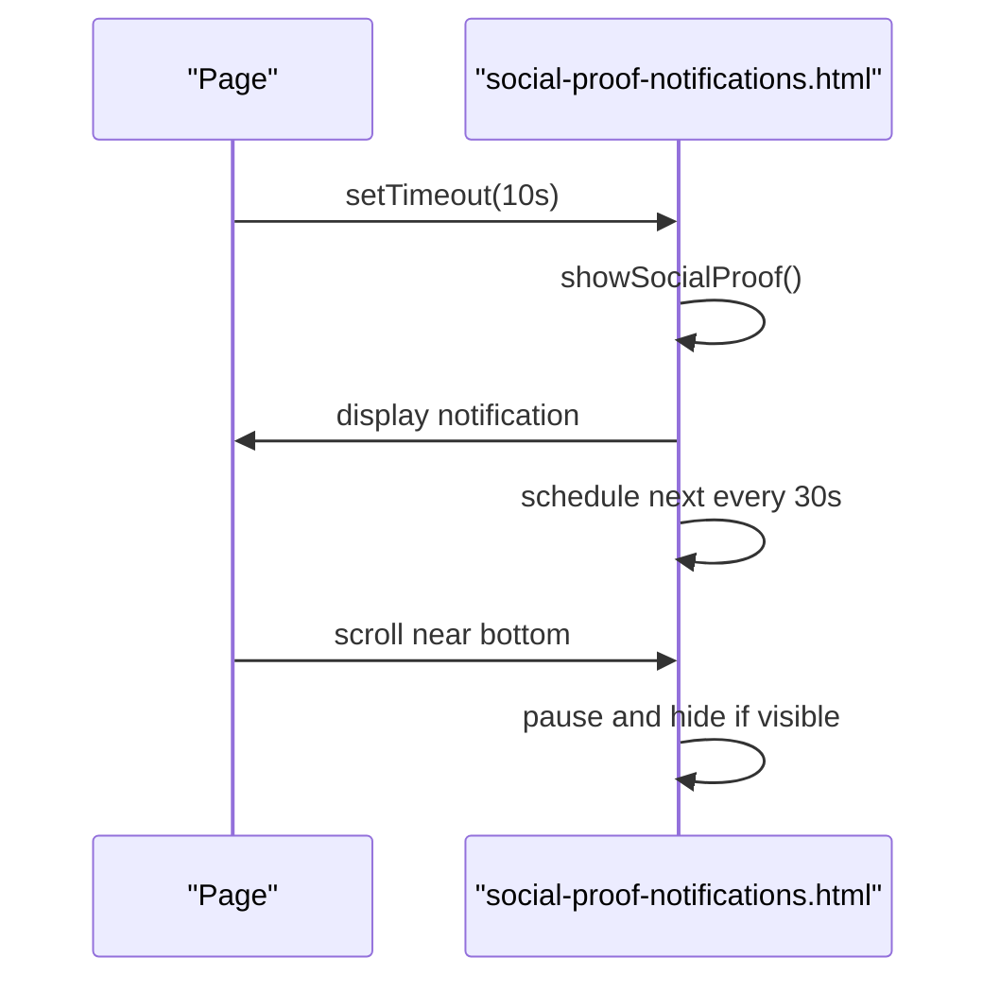

**Diagram sources**
- [social-proof-notifications.html](file://components/social-proof-notifications.html#L126-L207)

**Section sources**
- [social-proof-notifications.html](file://components/social-proof-notifications.html#L1-L209)

### Live Chat Widget Component
Live chat widget:
- Floating chat button with pulsing effect and badge
- Collapsible chat window with agent avatar and typing indicators
- Quick replies and keyword-based responses
- Analytics on open and message send

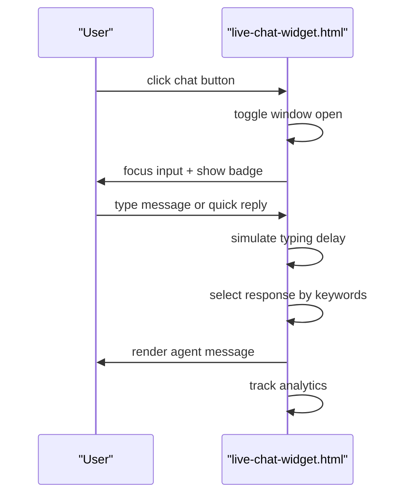

**Diagram sources**
- [live-chat-widget.html](file://components/live-chat-widget.html#L399-L514)

**Section sources**
- [live-chat-widget.html](file://components/live-chat-widget.html#L1-L515)

### Video Testimonial Component
Video testimonials:
- Two-column grid of clickable thumbnails with play buttons
- Modal overlay with YouTube embed and statistics
- Analytics on open/close

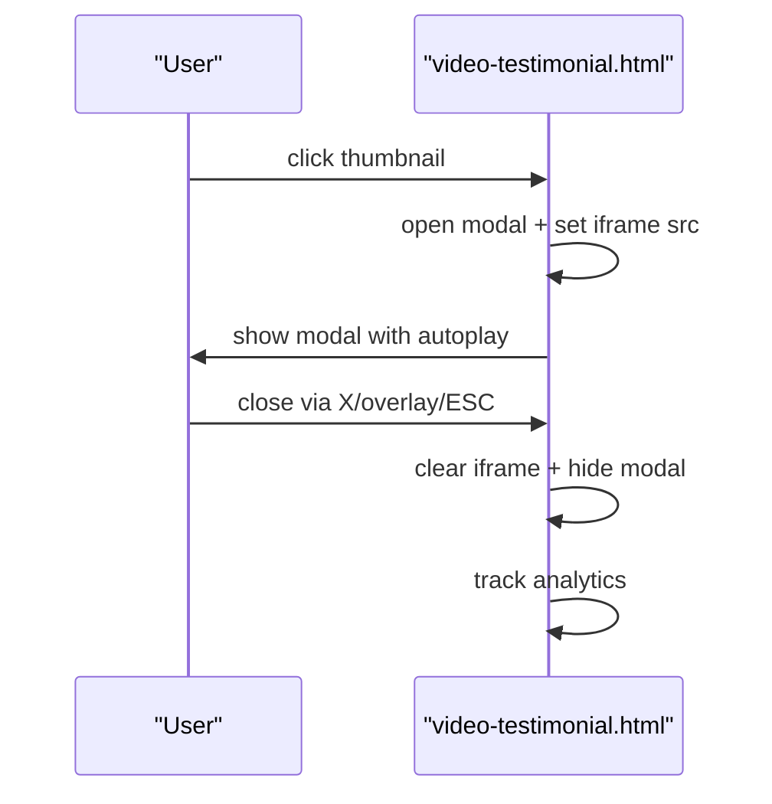

**Diagram sources**
- [video-testimonial.html](file://components/video-testimonial.html#L357-L408)

**Section sources**
- [video-testimonial.html](file://components/video-testimonial.html#L1-L410)

### Phone Call Offer Component
Phone call offer:
- Benefit-focused CTA with animated phone icon
- Testimonial quote and availability indicator
- Analytics on click

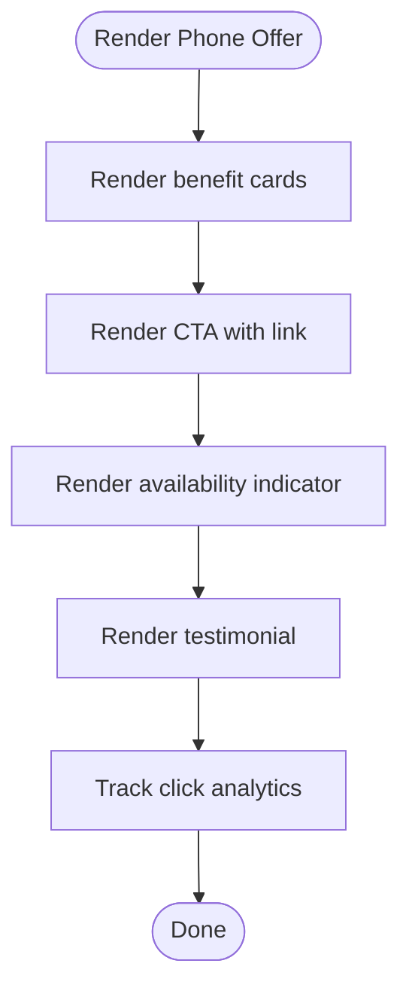

**Diagram sources**
- [phone-call-offer.html](file://components/phone-call-offer.html#L212-L298)

**Section sources**
- [phone-call-offer.html](file://components/phone-call-offer.html#L1-L298)

## Dependency Analysis
The loader depends on:
- Presence of placeholders (#truevow-navigation, #truevow-footer)
- Accessible component files at /components/*
- Optional analytics (gtag) availability

Promotional components depend on:
- Optional analytics (gtag)
- Browser APIs (localStorage, fetch)
- DOM-ready lifecycle

```mermaid
graph TB
Loader["load-components.js"] --> Nav["STANDARD_NAVIGATION.html"]
Loader --> Footer["STANDARD_FOOTER.html"]
Prefill["prefill-indicator.html"] --> API["Demo Session API"]
ExitPopup["exit-intent-popup.html"] --> Analytics["Analytics (gtag)"]
ROI["roi-calculator.html"] --> Analytics
Urgency["urgency-timer.html"] --> Analytics
Trust["trust-badges.html"] --> Analytics
Social["social-proof-notifications.html"] --> Analytics
Chat["live-chat-widget.html"] --> Analytics
Video["video-testimonial.html"] --> Analytics
Phone["phone-call-offer.html"] --> Analytics
Prefill --> DOM["DOM Ready"]
ExitPopup --> DOM
ROI --> DOM
Urgency --> DOM
Trust --> DOM
Social --> DOM
Chat --> DOM
Video --> DOM
Phone --> DOM
```

**Diagram sources**
- [load-components.js](file://js/load-components.js#L1-L58)
- [prefill-indicator.html](file://components/prefill-indicator.html#L116-L185)
- [exit-intent-popup.html](file://components/exit-intent-popup.html#L180-L250)
- [roi-calculator.html](file://components/roi-calculator.html#L418-L487)
- [urgency-timer.html](file://components/urgency-timer.html#L79-L161)
- [trust-badges.html](file://components/trust-badges.html#L224-L240)
- [social-proof-notifications.html](file://components/social-proof-notifications.html#L126-L207)
- [live-chat-widget.html](file://components/live-chat-widget.html#L399-L514)
- [video-testimonial.html](file://components/video-testimonial.html#L357-L408)
- [phone-call-offer.html](file://components/phone-call-offer.html#L282-L298)

**Section sources**
- [load-components.js](file://js/load-components.js#L1-L58)
- [prefill-indicator.html](file://components/prefill-indicator.html#L116-L185)
- [exit-intent-popup.html](file://components/exit-intent-popup.html#L180-L250)
- [roi-calculator.html](file://components/roi-calculator.html#L418-L487)
- [urgency-timer.html](file://components/urgency-timer.html#L79-L161)
- [trust-badges.html](file://components/trust-badges.html#L224-L240)
- [social-proof-notifications.html](file://components/social-proof-notifications.html#L126-L207)
- [live-chat-widget.html](file://components/live-chat-widget.html#L399-L514)
- [video-testimonial.html](file://components/video-testimonial.html#L357-L408)
- [phone-call-offer.html](file://components/phone-call-offer.html#L282-L298)

## Performance Considerations
- Minimize component size: Keep inline styles and scripts concise; avoid heavy libraries.
- Defer non-critical components: Load navigation/footer early; defer popups and chat until after initial render.
- Optimize analytics: Batch or probabilistically log events to reduce overhead.
- Use lazy loading: For modals and videos, initialize only on user interaction.
- Cache components: Ensure CDN caching for static components to reduce latency.

## Troubleshooting Guide
Common issues and resolutions:
- Navigation/Footer not appearing
  - Ensure placeholders exist (#truevow-navigation, #truevow-footer)
  - Confirm component files are reachable at /components/*
- Analytics not firing
  - Verify gtag is available or replace with your analytics library
- Prefill indicator not working
  - Confirm demo session API endpoint and parameters
  - Check console for fetch errors
- Exit-intent popup not triggering
  - Validate mouseleave detection and delay logic
  - Ensure overlay click and Escape key handlers are attached
- Chat widget not responding
  - Check keyword matching logic and response array
  - Verify DOM elements for messages and input exist
- Modals not closing
  - Confirm click-outside and Escape handlers
  - Ensure iframe is cleared on close

**Section sources**
- [load-components.js](file://js/load-components.js#L14-L31)
- [prefill-indicator.html](file://components/prefill-indicator.html#L116-L185)
- [exit-intent-popup.html](file://components/exit-intent-popup.html#L180-L250)
- [live-chat-widget.html](file://components/live-chat-widget.html#L399-L514)
- [video-testimonial.html](file://components/video-testimonial.html#L357-L408)

## Conclusion
The Reusable Component Library provides a scalable, consistent foundation for TrueVow’s marketing and legal pages. By centralizing navigation, footers, and promotional components, teams can maintain branding coherence, reduce duplication, and improve conversion outcomes through proven UX patterns. The loader simplifies integration, while inline analytics enable continuous optimization.

## Appendices

### Component Customization Options
- Navigation/Footer
  - Modify links and CTAs by editing the component files
  - Update colors and typography via inline styles
- Prefill Indicator
  - Adjust fields to prefill and hero message content
  - Customize progress bar and stats display
- Exit-Intent Popup
  - Edit benefits list, CTA, and countdown timing
  - Adjust animations and triggers
- ROI Calculator
  - Tune assumptions and thresholds
  - Customize styling and breakpoints
- Urgency Timer
  - Change expiry duration and expiry persistence
  - Adjust color thresholds and messaging
- Trust Badges
  - Add or modify badge entries and feature cards
- Social Proof Notifications
  - Update data source and intervals
- Live Chat Widget
  - Extend keyword responses and quick replies
  - Customize styling and animations
- Video Testimonials
  - Swap video URLs and metadata
- Phone Call Offer
  - Update benefits, testimonials, and CTA link

### Styling Integration Patterns
- Prefer inline styles within components for portability
- Use CSS variables or a shared stylesheet if integrating across many pages
- Maintain consistent spacing and typography tokens
- Ensure responsive breakpoints align with existing design system

### Deployment Strategies
- Host components and assets on the same domain to avoid CORS issues
- Use the loader to inject components server-side or via a simple script
- For static hosting, ensure component paths match deployment structure
- Version components to prevent cache conflicts during updates