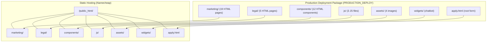
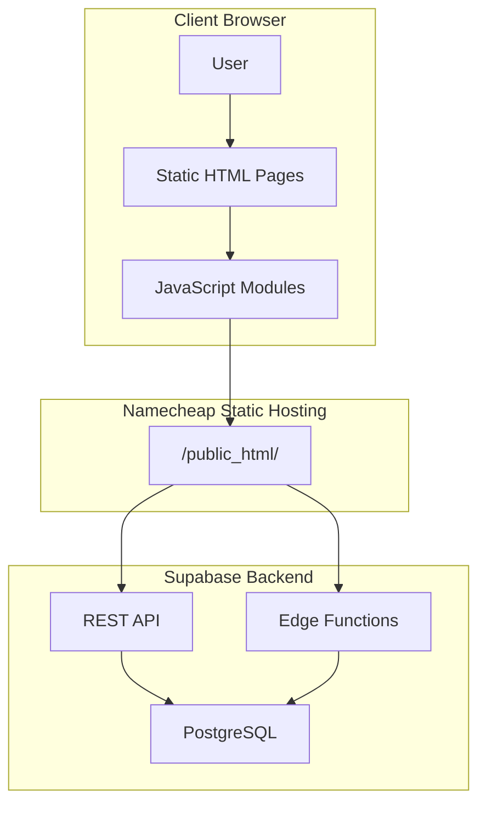
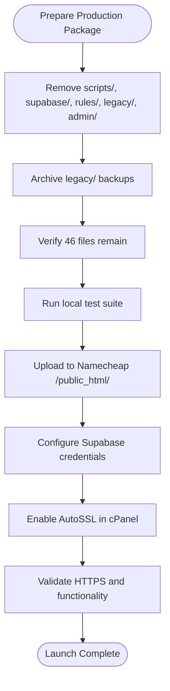
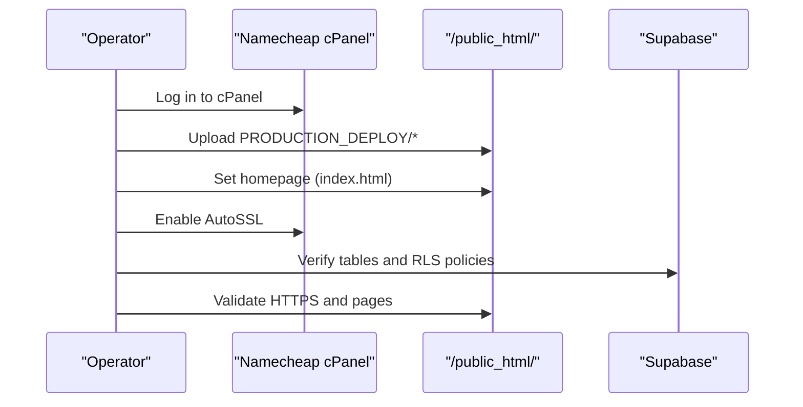
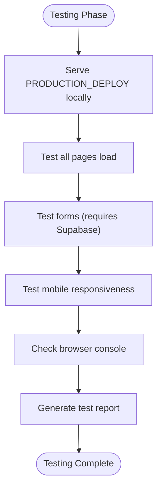
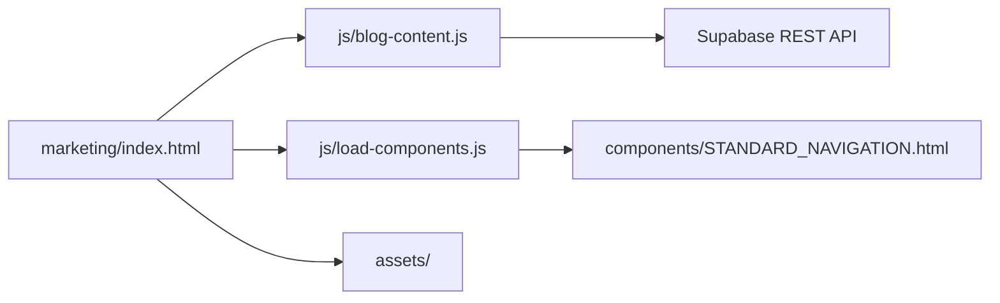

# Deployment & Operations

<cite>
**Referenced Files in This Document**
- [DEPLOYMENT_GUIDE.txt](file://PRODUCTION_DEPLOY/DEPLOYMENT_GUIDE.txt)
- [README_FIRST.txt](file://PRODUCTION_DEPLOY/README_FIRST.txt)
- [TEST_REPORT.md](file://PRODUCTION_DEPLOY/TEST_REPORT.md)
- [FINAL_DEPLOYMENT_SUMMARY.md](file://rules/FINAL_DEPLOYMENT_SUMMARY.md)
- [LAUNCH_READY_SUMMARY.md](file://rules/LAUNCH_READY_SUMMARY.md)
- [PRE_LAUNCH_CHECKLIST.md](file://rules/PRE_LAUNCH_CHECKLIST.md)
- [PRODUCTION_CLEANUP_REPORT.md](file://rules/PRODUCTION_CLEANUP_REPORT.md)
- [PRODUCTION_TESTING_COMPLETE.md](file://rules/PRODUCTION_TESTING_COMPLETE.md)
- [README.md](file://README.md)
- [package.json](file://package.json)
- [index.html](file://marketing/index.html)
- [blog-content.js](file://js/blog-content.js)
- [load-components.js](file://js/load-components.js)
- [STANDARD_NAVIGATION.html](file://components/STANDARD_NAVIGATION.html)
</cite>

## Table of Contents
1. [Introduction](#introduction)
2. [Project Structure](#project-structure)
3. [Core Components](#core-components)
4. [Architecture Overview](#architecture-overview)
5. [Detailed Component Analysis](#detailed-component-analysis)
6. [Dependency Analysis](#dependency-analysis)
7. [Performance Considerations](#performance-considerations)
8. [Troubleshooting Guide](#troubleshooting-guide)
9. [Conclusion](#conclusion)
10. [Appendices](#appendices)

## Introduction
This document provides comprehensive deployment and operational procedures for the TrueVow Website to Namecheap static hosting. It covers the production deployment workflow, environment configuration, testing strategies, monitoring and maintenance, performance optimization, troubleshooting, backup and recovery, version control integration, rollback strategies, operational security, SSL certificate management, DNS/domain configuration, production cleanup, and quality assurance testing.

## Project Structure
The TrueVow Website is a static HTML site with embedded JavaScript and reusable components. The production deployment package is curated and minimized for fast upload and operation.

**Diagram sources**
- [DEPLOYMENT_GUIDE.txt](file://PRODUCTION_DEPLOY/DEPLOYMENT_GUIDE.txt#L22-L57)
- [README_FIRST.txt](file://PRODUCTION_DEPLOY/README_FIRST.txt#L23-L29)

**Section sources**
- [DEPLOYMENT_GUIDE.txt](file://PRODUCTION_DEPLOY/DEPLOYMENT_GUIDE.txt#L1-L209)
- [README_FIRST.txt](file://PRODUCTION_DEPLOY/README_FIRST.txt#L1-L146)

## Core Components
- Static HTML pages (marketing and legal) with standardized navigation and footer components
- JavaScript modules for blog content fetching and component loading
- Reusable HTML components for navigation and footer
- Assets (logo, images)
- Chatbot widget
- Root application form

Key configuration points:
- Supabase integration for blog content and demo form submissions
- Component loading via JavaScript
- Relative asset paths for portability

**Section sources**
- [blog-content.js](file://js/blog-content.js#L11-L12)
- [load-components.js](file://js/load-components.js#L14-L47)
- [STANDARD_NAVIGATION.html](file://components/STANDARD_NAVIGATION.html#L1-L25)
- [README.md](file://README.md#L166-L205)

## Architecture Overview
The website architecture is static HTML served from Namecheap with backend functionality powered by Supabase (REST API and Edge Functions). The static site embeds Supabase configuration and performs client-side fetches to Supabase for dynamic content and form submissions.

**Diagram sources**
- [README.md](file://README.md#L166-L205)
- [blog-content.js](file://js/blog-content.js#L26-L64)
- [index.html](file://marketing/index.html#L189-L200)

## Detailed Component Analysis

### Production Deployment Package
The production package excludes development artifacts and contains only the files needed to run the website.

**Diagram sources**
- [PRODUCTION_CLEANUP_REPORT.md](file://rules/PRODUCTION_CLEANUP_REPORT.md#L19-L60)
- [FINAL_DEPLOYMENT_SUMMARY.md](file://rules/FINAL_DEPLOYMENT_SUMMARY.md#L66-L148)
- [DEPLOYMENT_GUIDE.txt](file://PRODUCTION_DEPLOYMENT_GUIDE.txt#L69-L108)

**Section sources**
- [PRODUCTION_CLEANUP_REPORT.md](file://rules/PRODUCTION_CLEANUP_REPORT.md#L1-L247)
- [FINAL_DEPLOYMENT_SUMMARY.md](file://rules/FINAL_DEPLOYMENT_SUMMARY.md#L1-L410)
- [README_FIRST.txt](file://PRODUCTION_DEPLOY/README_FIRST.txt#L19-L43)

### Build and Deployment Workflow
- Preparation: Use the curated PRODUCTION_DEPLOY package
- Upload: Transfer all folders to Namecheap /public_html/
- Configuration: Confirm Supabase credentials and table existence
- SSL: Enable AutoSSL in cPanel
- Validation: Test all pages and functionality

**Diagram sources**
- [DEPLOYMENT_GUIDE.txt](file://PRODUCTION_DEPLOY/DEPLOYMENT_GUIDE.txt#L63-L108)
- [README_FIRST.txt](file://PRODUCTION_DEPLOY/README_FIRST.txt#L48-L66)

**Section sources**
- [DEPLOYMENT_GUIDE.txt](file://PRODUCTION_DEPLOY/DEPLOYMENT_GUIDE.txt#L60-L108)
- [README_FIRST.txt](file://PRODUCTION_DEPLOY/README_FIRST.txt#L32-L66)

### Environment Configuration
- Supabase URL and Anon Key are embedded in HTML/JS
- Required Supabase tables: web_demo_requests, web_blog_content
- RLS policies should allow public read access for blog content

**Section sources**
- [DEPLOYMENT_GUIDE.txt](file://PRODUCTION_DEPLOY/DEPLOYMENT_GUIDE.txt#L114-L123)
- [blog-content.js](file://js/blog-content.js#L11-L12)
- [README.md](file://README.md#L187-L193)

### Testing Strategies
- Local testing with a simple HTTP server
- Automated browser testing with visual verification and console checks
- Mobile responsiveness validation
- Form submission testing (requires Supabase connectivity)

**Diagram sources**
- [TEST_REPORT.md](file://PRODUCTION_DEPLOY/TEST_REPORT.md#L377-L396)
- [PRODUCTION_TESTING_COMPLETE.md](file://rules/PRODUCTION_TESTING_COMPLETE.md#L67-L80)

**Section sources**
- [TEST_REPORT.md](file://PRODUCTION_DEPLOY/TEST_REPORT.md#L1-L505)
- [PRODUCTION_TESTING_COMPLETE.md](file://rules/PRODUCTION_TESTING_COMPLETE.md#L1-L192)

### Monitoring and Maintenance Procedures
- Monitor traffic via HTTPS
- Verify blog content updates via Supabase dashboard
- Check form submissions in Supabase tables
- Perform periodic health checks on key pages

**Section sources**
- [DEPLOYMENT_GUIDE.txt](file://PRODUCTION_DEPLOY/DEPLOYMENT_GUIDE.txt#L126-L146)

### Performance Optimization Techniques
- Minimized file count and size (46 files, 2.26 MB)
- Relative asset paths for efficient loading
- Lightweight JavaScript with minimal dependencies
- CDN-friendly static assets

**Section sources**
- [FINAL_DEPLOYMENT_SUMMARY.md](file://rules/FINAL_DEPLOYMENT_SUMMARY.md#L343-L352)
- [PRODUCTION_CLEANUP_REPORT.md](file://rules/PRODUCTION_CLEANUP_REPORT.md#L180-L201)

### Operational Security Considerations
- Public keys exposure is acceptable for client-side use
- RLS policies should be enabled on all tables
- Avoid exposing service_role keys or database credentials
- Regular security reviews of Supabase policies

**Section sources**
- [README.md](file://README.md#L586-L612)
- [DEPLOYMENT_GUIDE.txt](file://PRODUCTION_DEPLOY/DEPLOYMENT_GUIDE.txt#L114-L123)

### SSL Certificate Management
- Enable AutoSSL in Namecheap cPanel
- Wait 5-10 minutes for certificate activation
- Verify HTTPS works on https://truevow.law

**Section sources**
- [DEPLOYMENT_GUIDE.txt](file://PRODUCTION_DEPLOY/DEPLOYMENT_GUIDE.txt#L103-L108)

### Domain DNS Configuration
- Point domain to Namecheap hosting
- Configure root domain to redirect to /marketing/index.html or move index.html to root
- Ensure HTTPS is enabled via AutoSSL

**Section sources**
- [DEPLOYMENT_GUIDE.txt](file://PRODUCTION_DEPLOY/DEPLOYMENT_GUIDE.txt#L81-L91)
- [LAUNCH_READY_SUMMARY.md](file://rules/LAUNCH_READY_SUMMARY.md#L105-L112)

### Production Cleanup Process
- Remove development scripts, migrations, documentation, and legacy backups
- Archive backup files to legacy/marketing/
- Create full backup before any cleanup
- Verify production package integrity

**Section sources**
- [PRE_LAUNCH_CHECKLIST.md](file://rules/PRE_LAUNCH_CHECKLIST.md#L112-L129)
- [PRODUCTION_CLEANUP_REPORT.md](file://rules/PRODUCTION_CLEANUP_REPORT.md#L19-L60)
- [FINAL_DEPLOYMENT_SUMMARY.md](file://rules/FINAL_DEPLOYMENT_SUMMARY.md#L151-L167)

### Quality Assurance Testing Procedures
- Pre-deployment checklist verification
- Browser compatibility testing
- Responsive design validation
- Form functionality testing
- Asset loading verification

**Section sources**
- [TEST_REPORT.md](file://PRODUCTION_DEPLOY/TEST_REPORT.md#L311-L343)
- [PRODUCTION_TESTING_COMPLETE.md](file://rules/PRODUCTION_TESTING_COMPLETE.md#L141-L156)

## Dependency Analysis
The website has minimal runtime dependencies, relying on:
- Supabase REST API for blog content and form submissions
- Static assets hosted on the same domain
- Client-side JavaScript for dynamic content and component loading

**Diagram sources**
- [index.html](file://marketing/index.html#L84-L200)
- [blog-content.js](file://js/blog-content.js#L11-L12)
- [load-components.js](file://js/load-components.js#L14-L47)
- [STANDARD_NAVIGATION.html](file://components/STANDARD_NAVIGATION.html#L1-L25)

**Section sources**
- [README.md](file://README.md#L208-L332)
- [package.json](file://package.json#L5-L23)

## Performance Considerations
- Fast upload times due to reduced file size
- Efficient asset delivery via relative paths
- Minimal JavaScript with lazy initialization
- Optimized for static hosting performance

**Section sources**
- [FINAL_DEPLOYMENT_SUMMARY.md](file://rules/FINAL_DEPLOYMENT_SUMMARY.md#L343-L352)
- [TEST_REPORT.md](file://PRODUCTION_DEPLOY/TEST_REPORT.md#L377-L396)

## Troubleshooting Guide
Common deployment issues and resolutions:
- Pages not loading: verify file paths and permissions
- Forms not working: check Supabase URL/anon key and RLS policies
- Images not displaying: verify assets folder upload and relative paths
- SSL issues: confirm AutoSSL completion and certificate status

**Section sources**
- [DEPLOYMENT_GUIDE.txt](file://PRODUCTION_DEPLOY/DEPLOYMENT_GUIDE.txt#L179-L196)

## Conclusion
The TrueVow Website is production-ready with a streamlined deployment package, comprehensive testing, and clear operational procedures. The static architecture with Supabase backend provides a robust foundation for reliable, scalable operation on Namecheap static hosting.

## Appendices

### Backup and Recovery Procedures
- Full backup created before cleanup: TrueVow-Website-FULL-BACKUP_2025-12-23_03-50-58.zip
- Restore procedure: extract backup and copy contents to project folder
- Keep full backup for 30+ days as safety measure

**Section sources**
- [PRODUCTION_CLEANUP_REPORT.md](file://rules/PRODUCTION_CLEANUP_REPORT.md#L142-L154)
- [FINAL_DEPLOYMENT_SUMMARY.md](file://rules/FINAL_DEPLOYMENT_SUMMARY.md#L151-L167)

### Rollback Strategies
- Immediate rollback: restore from full backup ZIP
- Incremental recovery: redeploy previous production package
- Version control integration: use Git to track changes and tag releases

**Section sources**
- [PRODUCTION_CLEANUP_REPORT.md](file://rules/PRODUCTION_CLEANUP_REPORT.md#L150-L154)
- [package.json](file://package.json#L1-L35)