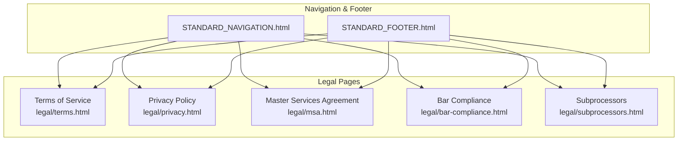
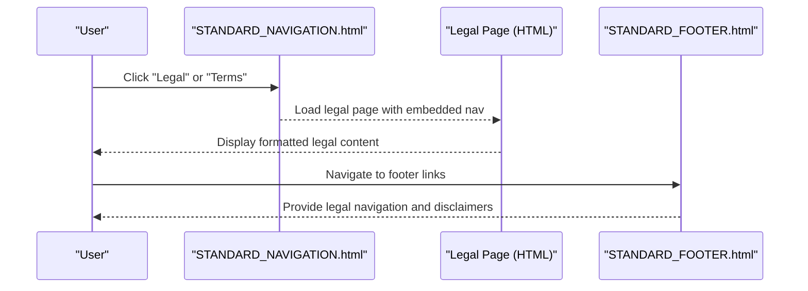
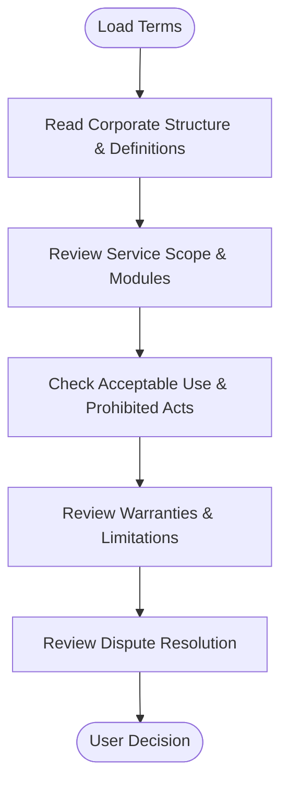
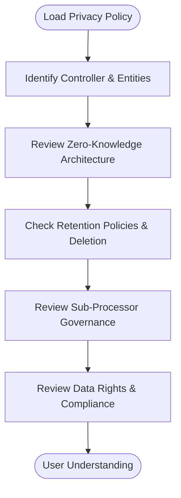
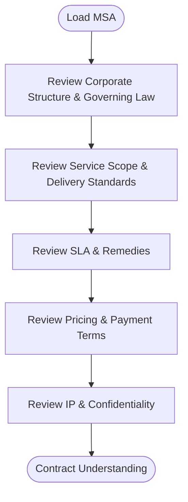
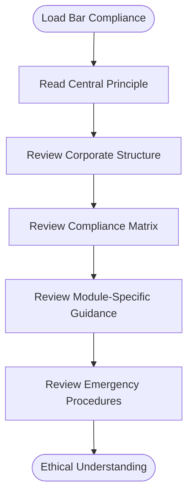
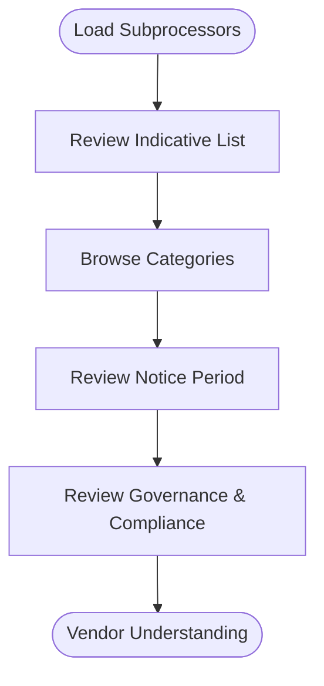
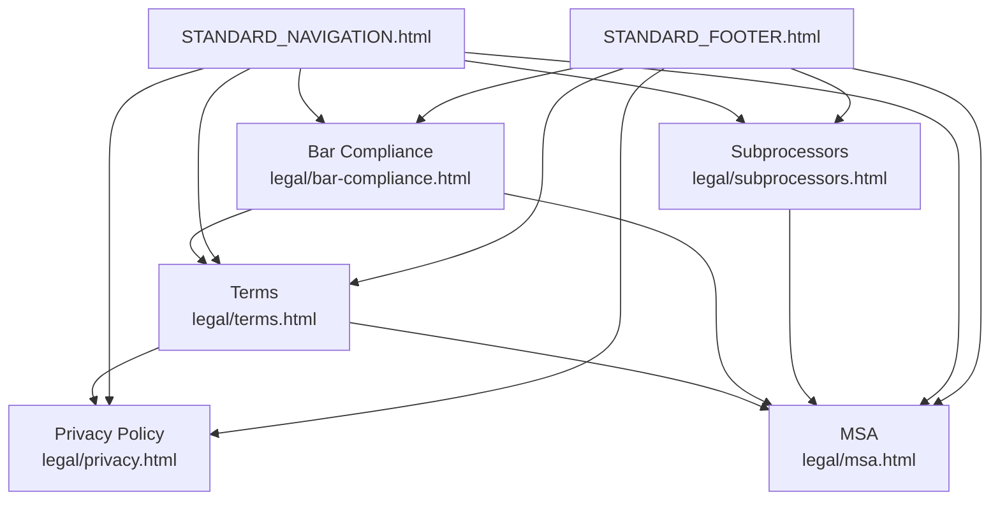

# Legal Pages Development

<cite>
**Referenced Files in This Document**
- [terms.html](file://legal/terms.html)
- [privacy.html](file://legal/privacy.html)
- [msa.html](file://legal/msa.html)
- [bar-compliance.html](file://legal/bar-compliance.html)
- [subprocessors.html](file://legal/subprocessors.html)
- [STANDARD_NAVIGATION.html](file://components/STANDARD_NAVIGATION.html)
- [STANDARD_FOOTER.html](file://components/STANDARD_FOOTER.html)
</cite>

## Table of Contents
1. [Introduction](#introduction)
2. [Project Structure](#project-structure)
3. [Core Components](#core-components)
4. [Architecture Overview](#architecture-overview)
5. [Detailed Component Analysis](#detailed-component-analysis)
6. [Dependency Analysis](#dependency-analysis)
7. [Performance Considerations](#performance-considerations)
8. [Troubleshooting Guide](#troubleshooting-guide)
9. [Conclusion](#conclusion)

## Introduction
This document provides comprehensive guidance for developing and maintaining TrueVow legal compliance pages. It covers the five core legal documents—Terms of Service, Privacy Policy, Master Services Agreement, Bar Compliance, and Subprocessors—detailing their content structure, compliance requirements, and regulatory considerations. It also outlines standardized formatting approaches, integration with navigation and footer systems, legal review processes, content updates, compliance tracking, and best practices for maintaining legal accuracy and handling sensitive information responsibly.

## Project Structure
The legal pages are organized under the `/legal` directory and share a standardized HTML structure with embedded navigation and consistent styling. Each page follows a clear hierarchy of headings, numbered sections, versioning, and effective dates. The pages integrate with the global navigation and footer components to ensure consistent branding and accessibility.

**Diagram sources**
- [terms.html](file://legal/terms.html#L183-L200)
- [privacy.html](file://legal/privacy.html#L38-L55)
- [msa.html](file://legal/msa.html#L162-L179)
- [bar-compliance.html](file://legal/bar-compliance.html#L274-L291)
- [subprocessors.html](file://legal/subprocessors.html#L213-L218)
- [STANDARD_NAVIGATION.html](file://components/STANDARD_NAVIGATION.html)
- [STANDARD_FOOTER.html](file://components/STANDARD_FOOTER.html)

**Section sources**
- [terms.html](file://legal/terms.html#L1-L200)
- [privacy.html](file://legal/privacy.html#L1-L120)
- [msa.html](file://legal/msa.html#L1-L180)
- [bar-compliance.html](file://legal/bar-compliance.html#L1-L120)
- [subprocessors.html](file://legal/subprocessors.html#L1-L120)

## Core Components
- Terms of Service: Establishes binding legal agreements, defines corporate structure, service scope, acceptable use, warranties, liability, and dispute resolution.
- Privacy Policy: Details data controller roles, zero-knowledge architecture, retention policies, sub-processor governance, and privacy rights.
- Master Services Agreement: Outlines service delivery, SLA, pricing, intellectual property, confidentiality, and governing law.
- Bar Compliance: Provides ethical guidance for licensed attorneys, emphasizing supervision responsibilities and compliance matrices.
- Subprocessors: Lists third-party vendors used for operational and infrastructure purposes, with governance and change notification procedures.

**Section sources**
- [terms.html](file://legal/terms.html#L240-L320)
- [privacy.html](file://legal/privacy.html#L93-L174)
- [msa.html](file://legal/msa.html#L251-L275)
- [bar-compliance.html](file://legal/bar-compliance.html#L340-L387)
- [subprocessors.html](file://legal/subprocessors.html#L226-L249)

## Architecture Overview
The legal pages follow a consistent architecture:
- Shared navigation and footer components ensure uniform branding and easy access to related legal resources.
- Each page includes standardized formatting: clear headings, numbered sections, version badges, effective dates, and warning/info boxes.
- Integration with the main navigation allows users to access legal pages from the primary site menu.

**Diagram sources**
- [STANDARD_NAVIGATION.html](file://components/STANDARD_NAVIGATION.html)
- [terms.html](file://legal/terms.html#L183-L200)
- [STANDARD_FOOTER.html](file://components/STANDARD_FOOTER.html)

**Section sources**
- [STANDARD_NAVIGATION.html](file://components/STANDARD_NAVIGATION.html)
- [STANDARD_FOOTER.html](file://components/STANDARD_FOOTER.html)

## Detailed Component Analysis

### Terms of Service
- Purpose: Establishes the legal framework governing TrueVow's services, including corporate structure, definitions, service scope, acceptable use, warranties, and dispute resolution.
- Key Elements:
  - Corporate structure clarifies the roles of UAE, Nevis, and Wyoming entities.
  - Definitions section establishes terminology for services, data, and legal obligations.
  - Service scope emphasizes deterministic, non-AI-driven operations and outlines modules (Intake, Draft, Settle, Verify, Connect).
  - Acceptable use prohibits sensitive data uploads and outlines fair-use caps.
  - Warranties and limitations clarify service guarantees and liability caps.
  - Dispute resolution specifies Swiss law and arbitration in Zurich.
- Formatting Standards:
  - Clear headings and numbered sections.
  - Version badge and effective date prominently displayed.
  - Warning/info boxes highlight critical obligations and limitations.

**Diagram sources**
- [terms.html](file://legal/terms.html#L309-L320)
- [terms.html](file://legal/terms.html#L338-L410)
- [terms.html](file://legal/terms.html#L713-L734)
- [terms.html](file://legal/terms.html#L11-L18)

**Section sources**
- [terms.html](file://legal/terms.html#L240-L320)
- [terms.html](file://legal/terms.html#L338-L410)
- [terms.html](file://legal/terms.html#L713-L734)
- [terms.html](file://legal/terms.html#L11-L18)

### Privacy Policy
- Purpose: Details data processing practices, controller roles, zero-knowledge architecture, retention policies, and sub-processor governance.
- Key Elements:
  - Controller identification and entity structure.
  - Zero-knowledge defaults and optional retention with encryption and deletion.
  - Sub-processor categories and governance with notice periods.
  - Data rights and compliance with privacy laws.
- Formatting Standards:
  - Version badge, effective date, and controller information.
  - Plain-English summary and critical notices.
  - Structured tables for controller/processor roles and retention schedules.

**Diagram sources**
- [privacy.html](file://legal/privacy.html#L93-L174)
- [privacy.html](file://legal/privacy.html#L204-L253)
- [privacy.html](file://legal/privacy.html#L506-L562)
- [privacy.html](file://legal/privacy.html#L463-L496)

**Section sources**
- [privacy.html](file://legal/privacy.html#L93-L174)
- [privacy.html](file://legal/privacy.html#L204-L253)
- [privacy.html](file://legal/privacy.html#L506-L562)
- [privacy.html](file://legal/privacy.html#L463-L496)

### Master Services Agreement
- Purpose: Establishes the contractual relationship, service delivery standards, SLA, pricing, and governing law.
- Key Elements:
  - Corporate structure and governing law (Swiss law).
  - Service scope and delivery standards with exclusions.
  - SLA with remedies and limitations.
  - Pricing schedule and payment terms.
  - Intellectual property and confidentiality obligations.
- Formatting Standards:
  - Version badge and effective date.
  - Clear headings and numbered sections.
  - Warning/info boxes for critical acknowledgments.

**Diagram sources**
- [msa.html](file://legal/msa.html#L251-L275)
- [msa.html](file://legal/msa.html#L276-L410)
- [msa.html](file://legal/msa.html#L354-L391)
- [msa.html](file://legal/msa.html#L650-L752)

**Section sources**
- [msa.html](file://legal/msa.html#L251-L275)
- [msa.html](file://legal/msa.html#L276-L410)
- [msa.html](file://legal/msa.html#L354-L391)
- [msa.html](file://legal/msa.html#L650-L752)

### Bar Compliance
- Purpose: Guides licensed attorneys on ethical obligations, supervision responsibilities, and compliance with state bar rules.
- Key Elements:
  - Central principle: attorney retains full responsibility.
  - Corporate structure and jurisdictional clarity.
  - Compliance matrix for key rules (e.g., Rule 5.3, 7.1-7.3, 1.6, 1.7).
  - Module-specific guidance for Intake, Draft, Settle, Connect, and Verify.
  - Emergency procedures and indemnification.
- Formatting Standards:
  - Critical warning banners and indemnification boxes.
  - Table of contents for easy navigation.
  - State-specific compliance reminders.

**Diagram sources**
- [bar-compliance.html](file://legal/bar-compliance.html#L340-L387)
- [bar-compliance.html](file://legal/bar-compliance.html#L390-L418)
- [bar-compliance.html](file://legal/bar-compliance.html#L420-L498)
- [bar-compliance.html](file://legal/bar-compliance.html#L554-L619)

**Section sources**
- [bar-compliance.html](file://legal/bar-compliance.html#L340-L387)
- [bar-compliance.html](file://legal/bar-compliance.html#L390-L418)
- [bar-compliance.html](file://legal/bar-compliance.html#L420-L498)
- [bar-compliance.html](file://legal/bar-compliance.html#L554-L619)

### Subprocessors
- Purpose: Disclose third-party vendors used for operational and infrastructure purposes, with governance and change notification procedures.
- Key Elements:
  - Indicative and non-exhaustive list of sub-processors.
  - Categories: Speech AI, Telephony, Authentication, Database, Cloud Infrastructure, CDN/Edge, Monitoring.
  - Change notification and operational flexibility.
  - Vendor pass-through terms and liability limitations.
- Formatting Standards:
  - Category-based tables with provider, function, data processed, jurisdiction, and legal links.
  - Notice period and disclaimer sections.

**Diagram sources**
- [subprocessors.html](file://legal/subprocessors.html#L226-L249)
- [subprocessors.html](file://legal/subprocessors.html#L251-L326)
- [subprocessors.html](file://legal/subprocessors.html#L561-L574)
- [subprocessors.html](file://legal/subprocessors.html#L576-L605)

**Section sources**
- [subprocessors.html](file://legal/subprocessors.html#L226-L249)
- [subprocessors.html](file://legal/subprocessors.html#L251-L326)
- [subprocessors.html](file://legal/subprocessors.html#L561-L574)
- [subprocessors.html](file://legal/subprocessors.html#L576-L605)

## Dependency Analysis
The legal pages depend on shared navigation and footer components for consistent branding and access. The Terms of Service references the Privacy Policy and Master Services Agreement, while the Bar Compliance integrates with all modules. The Subprocessors page references the Master Services Agreement for governance and compliance.

**Diagram sources**
- [terms.html](file://legal/terms.html#L246-L247)
- [bar-compliance.html](file://legal/bar-compliance.html#L316-L338)
- [subprocessors.html](file://legal/subprocessors.html#L607-L609)
- [STANDARD_NAVIGATION.html](file://components/STANDARD_NAVIGATION.html)
- [STANDARD_FOOTER.html](file://components/STANDARD_FOOTER.html)

**Section sources**
- [terms.html](file://legal/terms.html#L246-L247)
- [bar-compliance.html](file://legal/bar-compliance.html#L316-L338)
- [subprocessors.html](file://legal/subprocessors.html#L607-L609)
- [STANDARD_NAVIGATION.html](file://components/STANDARD_NAVIGATION.html)
- [STANDARD_FOOTER.html](file://components/STANDARD_FOOTER.html)

## Performance Considerations
- Page load performance: Legal pages use embedded styles and minimal JavaScript, optimizing for fast loading.
- Mobile responsiveness: Styles adapt to smaller screens, ensuring readability across devices.
- Navigation consistency: Embedded navigation avoids external dependencies, reducing potential bottlenecks.

[No sources needed since this section provides general guidance]

## Troubleshooting Guide
- Version and effective date discrepancies: Verify version badges and effective dates match the latest updates.
- Navigation issues: Confirm navigation components are properly embedded and functional.
- Sub-processor list updates: Ensure the Subprocessors page reflects current vendor categories and notice periods.
- Compliance matrix accuracy: Cross-check state-specific requirements with the Bar Compliance guide.
- Content synchronization: Align Terms, Privacy Policy, and MSA references to maintain consistency.

**Section sources**
- [terms.html](file://legal/terms.html#L206-L207)
- [privacy.html](file://legal/privacy.html#L60-L66)
- [subprocessors.html](file://legal/subprocessors.html#L220-L222)
- [bar-compliance.html](file://legal/bar-compliance.html#L420-L498)

## Conclusion
The TrueVow legal pages provide a comprehensive, standardized framework for legal compliance, ethical guidance, and transparency. By adhering to the outlined formatting standards, integration requirements, and review processes, stakeholders can maintain accurate, up-to-date legal documentation that supports regulatory compliance and protects both TrueVow and its customers.