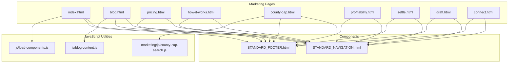
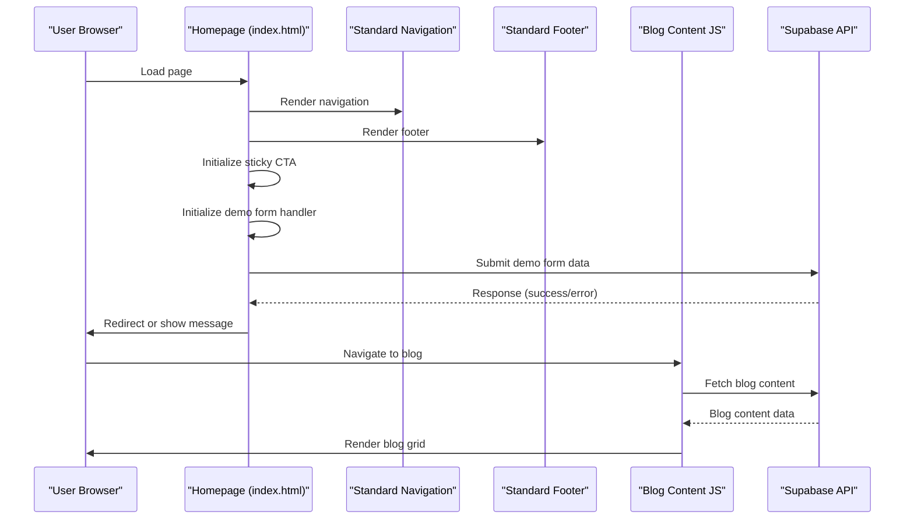
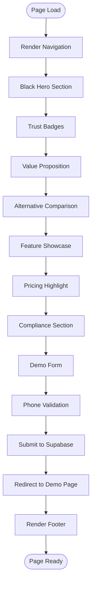
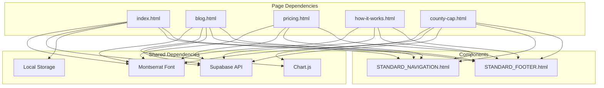

# Marketing Pages Development

<cite>
**Referenced Files in This Document**
- [index.html](file://marketing/index.html)
- [blog.html](file://marketing/blog.html)
- [pricing.html](file://marketing/pricing.html)
- [how-it-works.html](file://marketing/how-it-works.html)
- [county-cap.html](file://marketing/county-cap.html)
- [profitability.html](file://marketing/profitability.html)
- [settle.html](file://marketing/settle.html)
- [draft.html](file://marketing/draft.html)
- [connect.html](file://marketing/connect.html)
- [STANDARD_NAVIGATION.html](file://components/STANDARD_NAVIGATION.html)
- [STANDARD_FOOTER.html](file://components/STANDARD_FOOTER.html)
- [blog-content.js](file://js/blog-content.js)
- [county-cap-search.js](file://marketing/js/county-cap-search.js)
- [load-components.js](file://js/load-components.js)
</cite>

## Table of Contents
1. [Introduction](#introduction)
2. [Project Structure](#project-structure)
3. [Core Components](#core-components)
4. [Architecture Overview](#architecture-overview)
5. [Detailed Component Analysis](#detailed-component-analysis)
6. [Dependency Analysis](#dependency-analysis)
7. [Performance Considerations](#performance-considerations)
8. [Troubleshooting Guide](#troubleshooting-guide)
9. [Conclusion](#conclusion)
10. [Appendices](#appendices)

## Introduction
This document provides comprehensive guidance for developing and maintaining TrueVow marketing pages. It covers the 13 marketing pages (homepage, blog hub, pricing page, product pages for how-it-works, county-cap, profitability, and feature pages for settle, draft, connect), the standardized theme implementation with black hero backgrounds and consistent navigation, responsive design patterns, HTML structure, CSS styling with the Montserrat font family, JavaScript integration for form handling and interactive elements, SEO optimization techniques, meta tags, schema.org markup, semantic HTML, cross-linking strategy, internal linking patterns, best practices for responsive design, mobile-first approach, performance optimization, guidelines for adding new marketing pages, maintaining consistency, updating existing content, and standardized footer implementation with legal compliance links.

## Project Structure
The marketing pages are organized under the `marketing/` directory with supporting components in `components/` and JavaScript utilities in `js/`. Each page follows a consistent structure with embedded navigation and footer components, standardized styling, and modular JavaScript for dynamic content and interactions.

**Diagram sources**
- [index.html](file://marketing/index.html#L1-L324)
- [blog.html](file://marketing/blog.html#L1-L554)
- [pricing.html](file://marketing/pricing.html#L1-L506)
- [how-it-works.html](file://marketing/how-it-works.html#L1-L1583)
- [county-cap.html](file://marketing/county-cap.html#L1-L523)
- [STANDARD_NAVIGATION.html](file://components/STANDARD_NAVIGATION.html)
- [STANDARD_FOOTER.html](file://components/STANDARD_FOOTER.html)
- [blog-content.js](file://js/blog-content.js)
- [county-cap-search.js](file://marketing/js/county-cap-search.js)

**Section sources**
- [index.html](file://marketing/index.html#L1-L324)
- [blog.html](file://marketing/blog.html#L1-L554)
- [pricing.html](file://marketing/pricing.html#L1-L506)
- [how-it-works.html](file://marketing/how-it-works.html#L1-L1583)
- [county-cap.html](file://marketing/county-cap.html#L1-L523)

## Core Components
- Standardized Navigation: Embedded navigation with consistent branding, menu items, and call-to-action links across all pages.
- Standardized Footer: Embedded footer with logo, tagline, three-column links (Product, Resources, Company), legal links, and comprehensive disclaimer.
- Dynamic Content Loading: JavaScript modules for loading blog content and performing county capacity searches.
- Form Handling: Integrated form handling for demo requests with validation, normalization, and submission to Supabase.

Key implementation patterns:
- Inline styles for navigation and footer to ensure consistent appearance when pages are opened directly.
- CSS-inlined styles for responsive design and component-specific styling.
- JavaScript modules for dynamic interactions and data fetching.

**Section sources**
- [index.html](file://marketing/index.html#L8-L31)
- [STANDARD_NAVIGATION.html](file://components/STANDARD_NAVIGATION.html)
- [STANDARD_FOOTER.html](file://components/STANDARD_FOOTER.html)
- [blog-content.js](file://js/blog-content.js)
- [county-cap-search.js](file://marketing/js/county-cap-search.js)

## Architecture Overview
The marketing pages follow a modular architecture with shared components and dynamic content loading. The homepage demonstrates the complete marketing funnel, while specialized pages target specific conversion goals.

**Diagram sources**
- [index.html](file://marketing/index.html#L71-L243)
- [blog.html](file://marketing/blog.html#L470-L476)
- [blog-content.js](file://js/blog-content.js)

**Section sources**
- [index.html](file://marketing/index.html#L71-L243)
- [blog.html](file://marketing/blog.html#L470-L476)

## Detailed Component Analysis

### Homepage (index.html)
The homepage implements a comprehensive marketing funnel with:
- Black hero section with compelling headline and value proposition
- Trust badges highlighting performance-based pricing
- Value proposition box with emotional appeal
- Comparative analysis of alternatives
- Detailed feature showcase with micro-movie storytelling
- Pricing highlight section with savings calculations
- Compliance and ROI sections
- Interactive demo form with validation and submission
- Sticky CTA that appears after 50% scroll

Key technical elements:
- Smooth scrolling behavior and form section positioning
- Comprehensive CSS styling with Montserrat font family
- JavaScript form validation with phone number normalization
- Supabase integration for form submissions
- Modal overlay for success feedback

**Diagram sources**
- [index.html](file://marketing/index.html#L1-L324)

**Section sources**
- [index.html](file://marketing/index.html#L1-L324)

### Blog Hub (blog.html)
The blog hub implements:
- Black-themed hero section with gradient background
- Filterable content grid for articles and videos
- Dynamic content loading from Supabase
- Sticky CTA bar for continued engagement
- Legal disclaimer for external links
- Responsive grid layout with 3-column footer links

SEO optimization features:
- Open Graph meta tags for social sharing
- Twitter Card meta tags
- JSON-LD schema markup for structured data
- Semantic HTML structure with proper headings

**Section sources**
- [blog.html](file://marketing/blog.html#L1-L554)

### Pricing Page (pricing.html)
The pricing page focuses on:
- Black hero with urgency messaging
- Trust indicators (Bar-compliant, Zero-knowledge, Blockchain-verified)
- Comparative analysis of alternatives
- Tiered pricing cards with hover effects
- Founding Member discount program
- Comprehensive FAQ section organized by categories
- Sticky floating CTA button for mobile accessibility

Responsive design patterns:
- Grid layouts that adapt to mobile screens
- Flexible pricing cards with equal height columns
- Mobile-first typography scaling

**Section sources**
- [pricing.html](file://marketing/pricing.html#L1-L506)

### How It Works (how-it-works.html)
The how-it-works page emphasizes:
- Black hero with clear value proposition
- Micro-movie storytelling across practice areas
- Tier comparison (Free vs Paid)
- Detailed workflow explanation
- Interactive script explorer with dropdown selectors
- Practice area coverage matrix
- Guarantee and assurance messaging

Interactive elements:
- Practice area dropdown with dependent sub-area selection
- Dynamic script display based on selections
- State-based workflow mode toggles

**Section sources**
- [how-it-works.html](file://marketing/how-it-works.html#L1-L1583)

### County Capacity (county-cap.html)
The county-cap page implements:
- Black hero with capacity policy messaging
- Live statistics dashboard with metric cards
- Mathematical explanation with Chart.js visualization
- Capacity table with progress bars
- Four strategic options when counties are full
- Interactive county availability checker
- Founding Member program details
- Transparency commitments and FAQs

Technical features:
- Chart.js integration for capacity visualization
- Intersection Observer for animated progress bars
- FAQ accordion functionality
- State/county selection with dynamic availability display

**Section sources**
- [county-cap.html](file://marketing/county-cap.html#L1-L523)

### Profitability (profitability.html)
The profitability page focuses on:
- Financial impact calculations
- Revenue opportunity analysis
- ROI projections and savings estimates
- Industry benchmark comparisons
- Case study integration
- Call-to-action for deeper engagement

### Feature Pages (settle.html, draft.html, connect.html)
These pages implement:
- Consistent black hero sections with feature-specific messaging
- Benefit-focused content with quantifiable results
- Integration previews and workflow demonstrations
- Pricing and availability information
- Roadmap visibility for future launches

**Section sources**
- [settle.html](file://marketing/settle.html)
- [draft.html](file://marketing/draft.html)
- [connect.html](file://marketing/connect.html)

## Dependency Analysis
The marketing pages share common dependencies and patterns:

**Diagram sources**
- [index.html](file://marketing/index.html#L1-L324)
- [blog.html](file://marketing/blog.html#L1-L554)
- [pricing.html](file://marketing/pricing.html#L1-L506)
- [how-it-works.html](file://marketing/how-it-works.html#L1-L1583)
- [county-cap.html](file://marketing/county-cap.html#L1-L523)

**Section sources**
- [index.html](file://marketing/index.html#L1-L324)
- [blog.html](file://marketing/blog.html#L1-L554)
- [pricing.html](file://marketing/pricing.html#L1-L506)
- [how-it-works.html](file://marketing/how-it-works.html#L1-L1583)
- [county-cap.html](file://marketing/county-cap.html#L1-L523)

## Performance Considerations
- Font loading optimization: Preconnect to Google Fonts for improved loading performance
- CSS delivery: Inline critical CSS for above-the-fold content
- JavaScript bundling: Modular scripts loaded only when needed
- Image optimization: SVG logos and vector graphics for scalability
- Lazy loading: Intersection Observer for animated elements
- Minimized DOM manipulation: Efficient event handling and DOM updates
- Local storage usage: Reduced server requests for user preferences

Best practices:
- Defer non-critical JavaScript until after initial render
- Use CSS transforms for animations instead of layout-affecting properties
- Implement proper caching headers for static assets
- Optimize images and use appropriate formats (SVG for logos, modern formats for content)

## Troubleshooting Guide
Common issues and solutions:

Form Submission Issues:
- Verify Supabase URL and API key configuration
- Check CORS settings for form submissions
- Validate phone number normalization logic
- Monitor network requests for error responses

Dynamic Content Loading:
- Ensure Chart.js is properly loaded before initialization
- Verify Supabase credentials and table permissions
- Check browser console for JavaScript errors
- Validate JSON-LD schema markup syntax

SEO and Meta Tags:
- Confirm meta tag placement in head section
- Validate Open Graph and Twitter Card properties
- Test schema.org markup with Google Rich Results Test
- Verify canonical URLs and hreflang attributes

Responsive Design:
- Test breakpoint adjustments in media queries
- Validate touch-friendly button sizing
- Check font scaling across device sizes
- Verify navigation behavior on mobile devices

**Section sources**
- [index.html](file://marketing/index.html#L84-L243)
- [blog.html](file://marketing/blog.html#L27-L64)
- [county-cap.html](file://marketing/county-cap.html#L317-L444)

## Conclusion
The TrueVow marketing pages implement a cohesive, scalable architecture with standardized components, responsive design, and integrated functionality. The pages demonstrate best practices in conversion-focused copywriting, interactive elements, and technical implementation. The modular approach enables efficient maintenance and updates while ensuring consistent user experience across all marketing touchpoints.

## Appendices

### Adding New Marketing Pages
1. Copy an existing page as a template (e.g., pricing.html)
2. Update meta tags with page-specific information
3. Implement standardized navigation and footer
4. Add page-specific content and styling
5. Integrate any required JavaScript functionality
6. Update internal navigation links
7. Test responsive design and cross-browser compatibility
8. Validate SEO elements and schema markup

### Maintaining Consistency
- Use the standardized navigation and footer components
- Follow the established color scheme and typography hierarchy
- Maintain consistent spacing and alignment patterns
- Update shared components when making global changes
- Document any deviations from the standard pattern

### Cross-Linking Strategy
- Internal linking: Use descriptive anchor text that matches page content
- Navigation structure: Maintain consistent menu items across all pages
- Breadcrumb patterns: Implement logical hierarchical linking
- Related content: Link to complementary pages and resources
- Legal compliance: Ensure all external links include appropriate disclaimers

### Responsive Design Guidelines
- Mobile-first approach: Design for mobile devices first
- Breakpoint consistency: Use established breakpoints for layout transitions
- Touch targets: Ensure buttons and links are appropriately sized
- Typography scaling: Implement fluid typography that adapts to screen size
- Image responsiveness: Use appropriate image formats and sizes for different devices