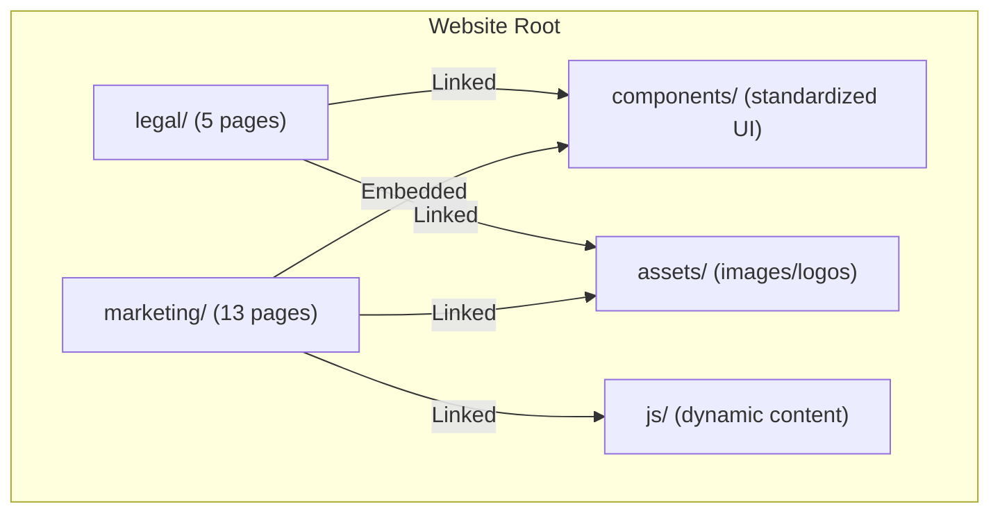
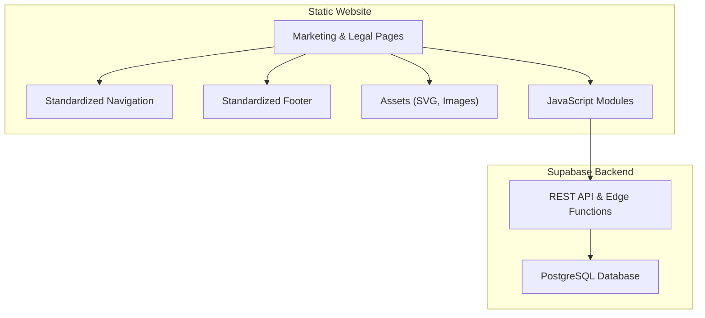
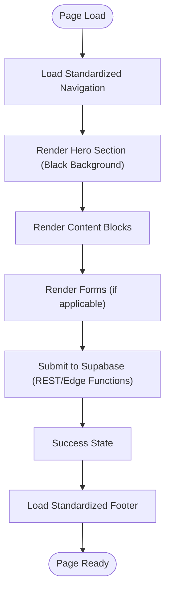
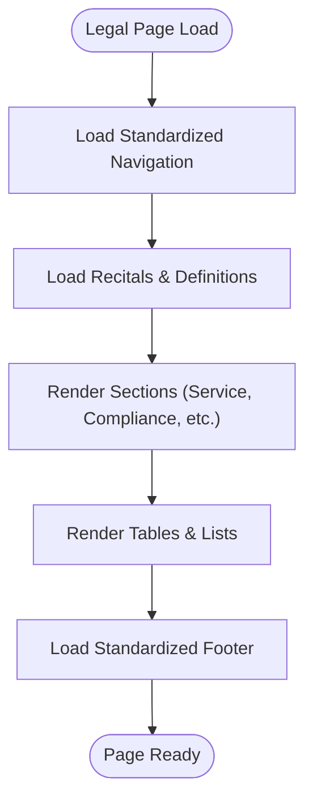
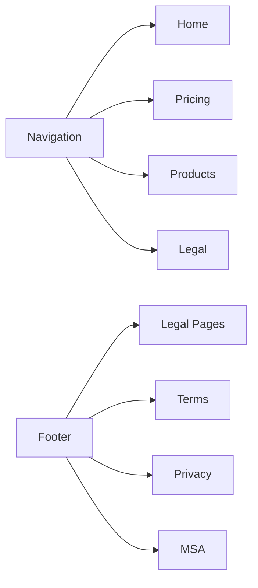
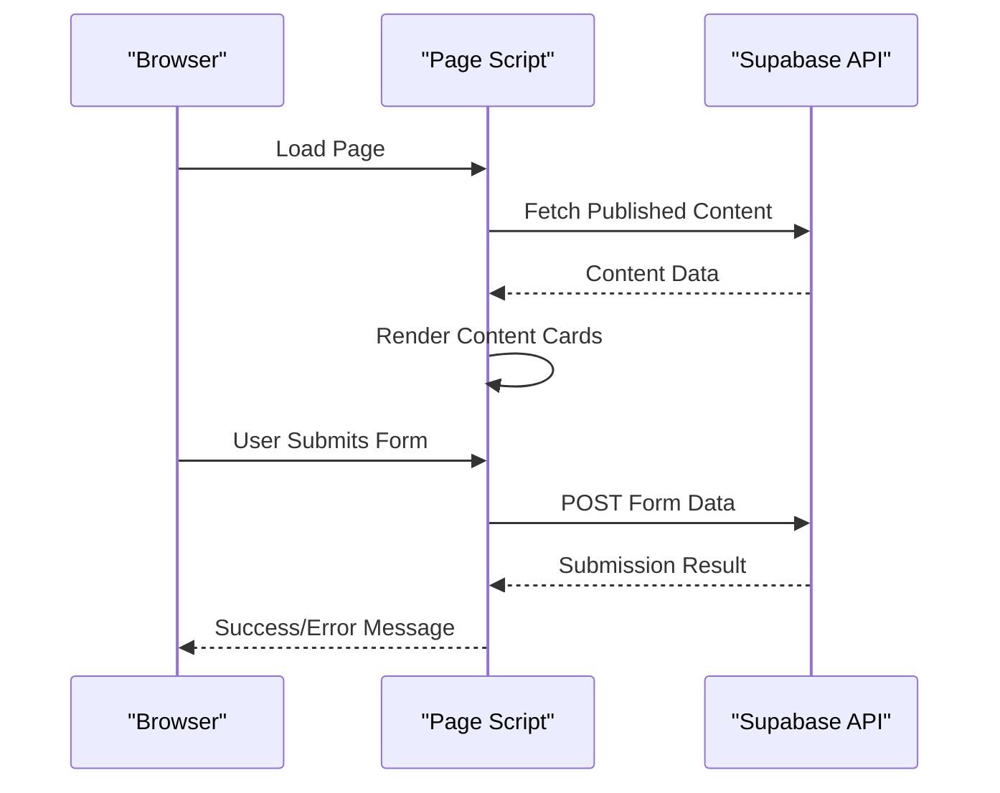
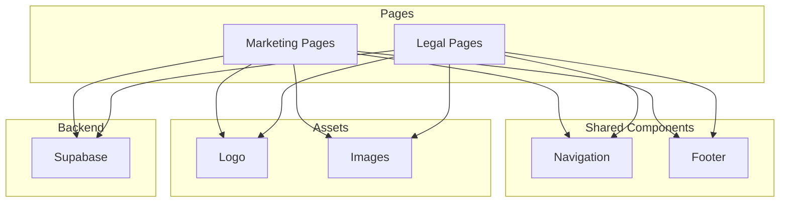

# Page Development

<cite>
**Referenced Files in This Document**
- [README.md](file://README.md)
- [DEPLOYMENT_GUIDE.txt](file://PRODUCTION_DEPLOY/DEPLOYMENT_GUIDE.txt)
- [STANDARD_NAVIGATION.html](file://components/STANDARD_NAVIGATION.html)
- [STANDARD_FOOTER.html](file://components/STANDARD_FOOTER.html)
- [index.html](file://marketing/index.html)
- [pricing.html](file://marketing/pricing.html)
- [about.html](file://marketing/about.html)
- [terms.html](file://legal/terms.html)
- [privacy.html](file://legal/privacy.html)
</cite>

## Table of Contents
1. [Introduction](#introduction)
2. [Project Structure](#project-structure)
3. [Core Components](#core-components)
4. [Architecture Overview](#architecture-overview)
5. [Detailed Component Analysis](#detailed-component-analysis)
6. [Dependency Analysis](#dependency-analysis)
7. [Performance Considerations](#performance-considerations)
8. [Troubleshooting Guide](#troubleshooting-guide)
9. [Conclusion](#conclusion)

## Introduction
This document provides comprehensive guidance for developing and maintaining the TrueVow Website, covering marketing pages (13 files) and legal pages (5 files). It explains the standardized theme implementation with black hero backgrounds and consistent navigation, the page development workflow (HTML structure, CSS styling, and JavaScript integration), SEO optimization techniques, cross-linking strategy, responsive design practices, and performance optimization. It also includes guidelines for adding new pages, maintaining consistency, and updating existing content.

## Project Structure
The website is a static HTML site with:
- Marketing pages: 13 HTML files under the marketing/ directory
- Legal pages: 5 HTML files under the legal/ directory
- Shared components: navigation and footer under components/
- Assets: logos and images under assets/
- JavaScript modules for dynamic content under js/

**Diagram sources**
- [README.md](file://README.md#L46-L121)

**Section sources**
- [README.md](file://README.md#L46-L121)

## Core Components
- Standardized Navigation: A sticky, responsive navigation bar embedded in each page with consistent links and branding.
- Standardized Footer: A comprehensive footer with product/resources/company links, legal links, and a detailed disclaimer.
- Marketing Pages: Homepage, pricing, how-it-works, blog hub, applications, partner/affiliate programs, county cap, about, careers, press, case studies, and additional landing pages.
- Legal Pages: Terms of Service, Privacy Policy, Master Services Agreement, Bar Compliance, and Sub-processors list.
- Assets: Logo and images used consistently across pages.

Implementation highlights:
- Black hero backgrounds are implemented via dedicated CSS classes and inline styles on hero sections.
- Navigation and footer are standardized and reused across pages to ensure consistency.
- Pages include embedded JavaScript for forms and dynamic content (e.g., blog hub).

**Section sources**
- [STANDARD_NAVIGATION.html](file://components/STANDARD_NAVIGATION.html#L1-L25)
- [STANDARD_FOOTER.html](file://components/STANDARD_FOOTER.html#L1-L61)
- [README.md](file://README.md#L124-L163)

## Architecture Overview
The website architecture is a static HTML site with:
- Frontend: Pure HTML/CSS/JavaScript (no build process)
- Backend: Supabase for dynamic content (blog hub) and form submissions
- Hosting: Namecheap Static Hosting

**Diagram sources**
- [README.md](file://README.md#L26-L34)
- [README.md](file://README.md#L166-L181)

**Section sources**
- [README.md](file://README.md#L26-L34)
- [README.md](file://README.md#L166-L181)

## Detailed Component Analysis

### Marketing Pages Structure
Marketing pages follow a consistent structure:
- Embedded standardized navigation
- Hero sections with black backgrounds and compelling headlines
- Feature-rich content blocks, pricing highlights, FAQs, and CTAs
- Integrated forms with client-side validation and Supabase integration
- Standardized footer

**Diagram sources**
- [index.html](file://marketing/index.html#L1-L324)
- [pricing.html](file://marketing/pricing.html#L1-L313)

**Section sources**
- [index.html](file://marketing/index.html#L1-L324)
- [pricing.html](file://marketing/pricing.html#L1-L313)

### Legal Pages Structure
Legal pages present dense, compliance-focused content with:
- Standardized navigation
- Detailed sections for definitions, corporate structure, service descriptions, and compliance frameworks
- Tables and structured lists for clarity
- Standardized footer

**Diagram sources**
- [terms.html](file://legal/terms.html#L1-L1204)
- [privacy.html](file://legal/privacy.html#L1-L1262)

**Section sources**
- [terms.html](file://legal/terms.html#L1-L1204)
- [privacy.html](file://legal/privacy.html#L1-L1262)

### Cross-Linking Strategy and Internal Linking Patterns
- Navigation links: Consistent across all pages, linking to key marketing pages and the homepage.
- Footer links: Organized into three columns (Product/Resources/Company) plus legal links.
- Legal pages: Include links to other legal documents and external resources.
- Asset paths: Relative paths ensure portability across hosting environments.

**Diagram sources**
- [STANDARD_NAVIGATION.html](file://components/STANDARD_NAVIGATION.html#L1-L25)
- [STANDARD_FOOTER.html](file://components/STANDARD_FOOTER.html#L1-L61)

**Section sources**
- [STANDARD_NAVIGATION.html](file://components/STANDARD_NAVIGATION.html#L1-L25)
- [STANDARD_FOOTER.html](file://components/STANDARD_FOOTER.html#L1-L61)

### SEO Optimization and Semantic HTML
- Meta tags: Each page includes appropriate meta charset, viewport, title, and description.
- Semantic HTML: Proper use of headings, paragraphs, lists, and tables for content hierarchy.
- Structured data: Schema.org markup is recommended for key pages (e.g., homepage, pricing) to enhance search visibility.
- Internal linking: Strategic linking within pages and across pages to improve crawlability and topical relevance.

**Section sources**
- [index.html](file://marketing/index.html#L1-L324)
- [pricing.html](file://marketing/pricing.html#L1-L313)
- [terms.html](file://legal/terms.html#L1-L1204)
- [privacy.html](file://legal/privacy.html#L1-L1262)

### JavaScript Integration and Dynamic Content
- Blog hub: Fetches published content from Supabase and renders cards dynamically.
- Forms: Client-side validation and submission to Supabase endpoints.
- Components: Reusable HTML components (navigation, footer, widgets) embedded directly in pages.

**Diagram sources**
- [README.md](file://README.md#L335-L385)

**Section sources**
- [README.md](file://README.md#L335-L385)

## Dependency Analysis
- Navigation and footer dependencies: All marketing and legal pages embed standardized components, reducing duplication and ensuring consistency.
- Asset dependencies: Pages reference assets via relative paths, ensuring portability across hosting environments.
- Supabase dependencies: Dynamic content and forms depend on Supabase REST API and Edge Functions.

**Diagram sources**
- [README.md](file://README.md#L46-L121)

**Section sources**
- [README.md](file://README.md#L46-L121)

## Performance Considerations
- Static hosting: Namecheap static hosting is suitable for this content-heavy site.
- Asset optimization: Use compressed images and vector graphics (SVG) where possible.
- Minimize JavaScript: Keep scripts lightweight and defer non-critical scripts.
- Caching: Leverage browser caching for static assets.
- Mobile-first: Ensure responsive design is optimized for mobile performance.

[No sources needed since this section provides general guidance]

## Troubleshooting Guide
Common issues and resolutions:
- Blog content not loading: Verify Supabase URL, API key, and RLS policies.
- Forms not submitting: Check Edge Function URLs, CORS settings, and browser network tab.
- Supabase connection errors: Confirm URL format, API key correctness, and API enablement.

**Section sources**
- [README.md](file://README.md#L502-L547)

## Conclusion
The TrueVow Website follows a standardized, scalable approach for marketing and legal content. By leveraging embedded components, consistent theming, and Supabase integration, the site achieves maintainability, compliance, and performance. Following the guidelines in this document ensures consistent development and updates across all pages.