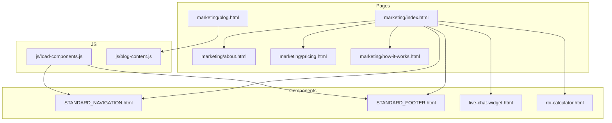
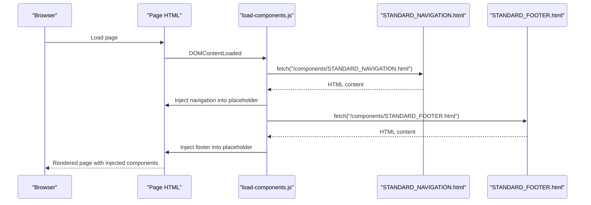
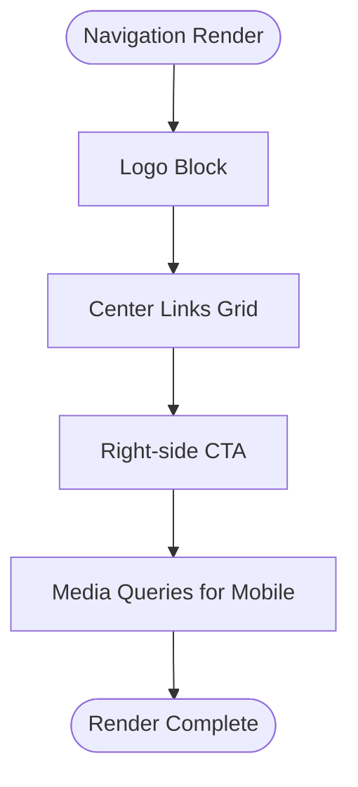
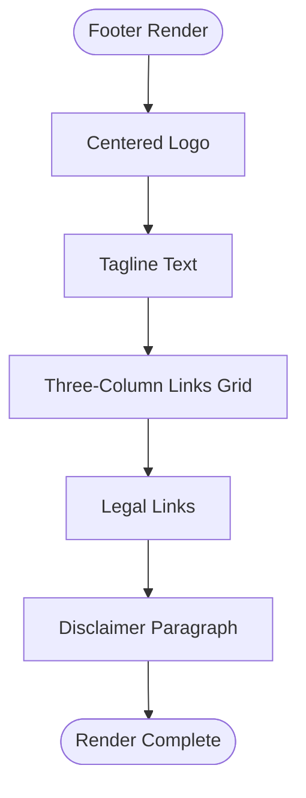
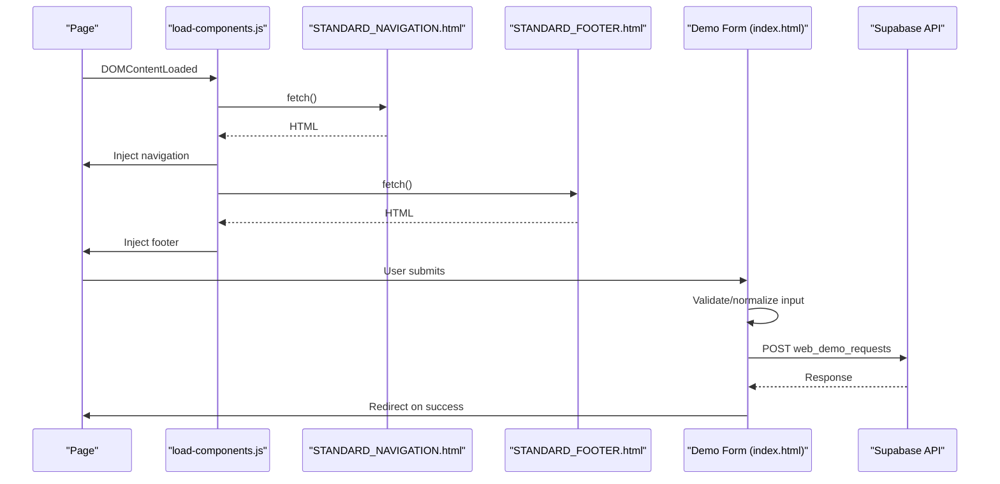
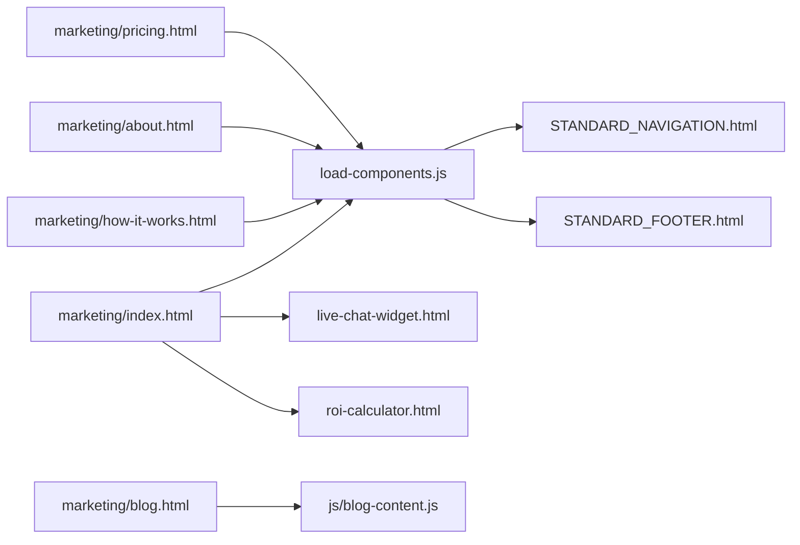

# Page Templates and Structure

<cite>
**Referenced Files in This Document**
- [STANDARD_NAVIGATION.html](file://components/STANDARD_NAVIGATION.html)
- [STANDARD_FOOTER.html](file://components/STANDARD_FOOTER.html)
- [index.html](file://marketing/index.html)
- [about.html](file://marketing/about.html)
- [pricing.html](file://marketing/pricing.html)
- [how-it-works.html](file://marketing/how-it-works.html)
- [blog.html](file://marketing/blog.html)
- [load-components.js](file://js/load-components.js)
- [live-chat-widget.html](file://components/live-chat-widget.html)
- [roi-calculator.html](file://components/roi-calculator.html)
- [blog-content.js](file://js/blog-content.js)
</cite>

## Table of Contents
1. [Introduction](#introduction)
2. [Project Structure](#project-structure)
3. [Core Components](#core-components)
4. [Architecture Overview](#architecture-overview)
5. [Detailed Component Analysis](#detailed-component-analysis)
6. [Dependency Analysis](#dependency-analysis)
7. [Performance Considerations](#performance-considerations)
8. [Troubleshooting Guide](#troubleshooting-guide)
9. [Conclusion](#conclusion)

## Introduction
This document explains the page template system and structural patterns used throughout TrueVow’s marketing website. It covers the standardized navigation and footer templates, page structure patterns (hero sections, content blocks, comparisons, forms), CSS architecture (Montserat font, spacing, typography, responsive breakpoints), and JavaScript integration (form handling, modals, interactive components). It also provides guidelines for maintaining design consistency, adding new page types, and extending the template system while preserving modularity and reusability.

## Project Structure
TrueVow organizes reusable UI components in the components directory and page-specific content in the marketing directory. A lightweight JavaScript loader injects standardized navigation and footer into pages that include placeholders. Additional interactive widgets and calculators are embedded as standalone components.

**Diagram sources**
- [STANDARD_NAVIGATION.html](file://components/STANDARD_NAVIGATION.html#L1-L25)
- [STANDARD_FOOTER.html](file://components/STANDARD_FOOTER.html#L1-L61)
- [index.html](file://marketing/index.html#L1-L324)
- [load-components.js](file://js/load-components.js#L1-L58)
- [live-chat-widget.html](file://components/live-chat-widget.html#L1-L515)
- [roi-calculator.html](file://components/roi-calculator.html#L1-L488)
- [blog.html](file://marketing/blog.html#L1-L554)
- [blog-content.js](file://js/blog-content.js#L1-L200)

**Section sources**
- [STANDARD_NAVIGATION.html](file://components/STANDARD_NAVIGATION.html#L1-L25)
- [STANDARD_FOOTER.html](file://components/STANDARD_FOOTER.html#L1-L61)
- [index.html](file://marketing/index.html#L1-L324)
- [load-components.js](file://js/load-components.js#L1-L58)

## Core Components
- Standardized Navigation Template: A sticky, responsive navigation bar with logo, centered links, and a prominent CTA. It uses inline styles for immediate rendering and includes hover effects and responsive adjustments.
- Standardized Footer Template: A three-column links grid (Product, Resources, Company), legal links, and a comprehensive disclaimer. It maintains consistent spacing and typography.
- Component Loader: A small script that fetches and injects the navigation and footer into pages containing placeholders, enabling reuse across all pages.
- Interactive Widgets: Live chat widget and ROI calculator are embedded as components with self-contained styles and JavaScript.

Key implementation references:
- Navigation: [STANDARD_NAVIGATION.html](file://components/STANDARD_NAVIGATION.html#L1-L25)
- Footer: [STANDARD_FOOTER.html](file://components/STANDARD_FOOTER.html#L1-L61)
- Component loader: [load-components.js](file://js/load-components.js#L1-L58)
- Live chat widget: [live-chat-widget.html](file://components/live-chat-widget.html#L1-L515)
- ROI calculator: [roi-calculator.html](file://components/roi-calculator.html#L1-L488)

**Section sources**
- [STANDARD_NAVIGATION.html](file://components/STANDARD_NAVIGATION.html#L1-L25)
- [STANDARD_FOOTER.html](file://components/STANDARD_FOOTER.html#L1-L61)
- [load-components.js](file://js/load-components.js#L1-L58)
- [live-chat-widget.html](file://components/live-chat-widget.html#L1-L515)
- [roi-calculator.html](file://components/roi-calculator.html#L1-L488)

## Architecture Overview
The site employs a modular template architecture:
- Shared UI: Navigation and footer are single-source-of-truth components injected via JavaScript.
- Page-specific content: Each marketing page defines its own sections (hero, content blocks, comparisons, forms).
- Interactive components: Widgets and calculators are self-contained and optionally embedded.
- Responsive design: Inline media queries and CSS variables ensure mobile-first layouts.

**Diagram sources**
- [load-components.js](file://js/load-components.js#L1-L58)
- [STANDARD_NAVIGATION.html](file://components/STANDARD_NAVIGATION.html#L1-L25)
- [STANDARD_FOOTER.html](file://components/STANDARD_FOOTER.html#L1-L61)

**Section sources**
- [load-components.js](file://js/load-components.js#L1-L58)
- [index.html](file://marketing/index.html#L1-L324)

## Detailed Component Analysis

### Standardized Navigation Template
- Structure: Left-aligned logo, center-aligned links, right-aligned CTA.
- Responsiveness: Uses media queries to hide links on small screens and adjusts CTA layout.
- Styling: Inline styles define fonts, shadows, hover transitions, and z-index stacking.
- Integration: Embedded directly in pages or injected via the component loader.

**Diagram sources**
- [STANDARD_NAVIGATION.html](file://components/STANDARD_NAVIGATION.html#L1-L25)
- [index.html](file://marketing/index.html#L8-L31)

**Section sources**
- [STANDARD_NAVIGATION.html](file://components/STANDARD_NAVIGATION.html#L1-L25)
- [index.html](file://marketing/index.html#L8-L31)

### Standardized Footer Template
- Layout: Centered logo, tagline, three-column links grid, legal links, and a long disclaimer.
- Typography: Uses consistent font sizing and letter-spacing for headings and links.
- Accessibility: Hover states improve readability; links are grouped for scanning.

**Diagram sources**
- [STANDARD_FOOTER.html](file://components/STANDARD_FOOTER.html#L1-L61)
- [index.html](file://marketing/index.html#L246-L317)

**Section sources**
- [STANDARD_FOOTER.html](file://components/STANDARD_FOOTER.html#L1-L61)
- [index.html](file://marketing/index.html#L246-L317)

### Page Structure Patterns
Common page sections observed across TrueVow pages:
- Hero Black Bar: Bold headline, supporting text, and trust indicators.
- Value Proposition Box: Highlighted benefit statement.
- Content Blocks: Text with strong emphasis and highlighted boxes.
- Comparison Tables: Feature-by-feature comparisons with emphasis on TrueVow.
- Form Sections: Lead capture forms with validation and submission handling.
- Floating/Sticky CTAs: Persistent call-to-action bars/buttons.

Examples:
- Hero and value props: [index.html](file://marketing/index.html#L1-L324)
- Pricing cards and anchors: [pricing.html](file://marketing/pricing.html#L1-L313)
- How It Works flow and call flow explorer: [how-it-works.html](file://marketing/how-it-works.html#L1-L800)
- ROI calculator component: [roi-calculator.html](file://components/roi-calculator.html#L1-L488)

**Section sources**
- [index.html](file://marketing/index.html#L1-L324)
- [pricing.html](file://marketing/pricing.html#L1-L313)
- [how-it-works.html](file://marketing/how-it-works.html#L1-L800)
- [roi-calculator.html](file://components/roi-calculator.html#L1-L488)

### CSS Architecture and Design System
- Typography: Uses Montserrat as the primary font family across components and pages.
- Spacing: Consistent padding/margins defined via inline styles; responsive adjustments via media queries.
- Color Palette: Primary blue (#0A2463), accents (gold, green), neutral backgrounds and grays.
- Breakpoints: Defined in-page media queries targeting 768px width for mobile responsiveness.
- Modularity: Inline styles ensure components render independently; shared patterns are enforced by templates.

References:
- Font loading and usage: [index.html](file://marketing/index.html#L1-L324), [pricing.html](file://marketing/pricing.html#L1-L313)
- Inline styles and media queries: [index.html](file://marketing/index.html#L1-L324), [pricing.html](file://marketing/pricing.html#L1-L313)

**Section sources**
- [index.html](file://marketing/index.html#L1-L324)
- [pricing.html](file://marketing/pricing.html#L1-L313)

### JavaScript Integration Patterns
- Component Loader: Fetches and injects navigation/footer into placeholders on DOMContentLoaded.
- Form Handling: Demo form validates phone input, normalizes digits, submits to Supabase, and redirects on success.
- Modal Systems: Legacy modal removed; success feedback handled via redirect and local storage.
- Interactive Widgets: Live chat widget and ROI calculator include self-contained JS with animations and event handlers.
- Dynamic Blog Content: Blog page loads content from Supabase via a dedicated script.

**Diagram sources**
- [load-components.js](file://js/load-components.js#L1-L58)
- [index.html](file://marketing/index.html#L71-L243)
- [STANDARD_NAVIGATION.html](file://components/STANDARD_NAVIGATION.html#L1-L25)
- [STANDARD_FOOTER.html](file://components/STANDARD_FOOTER.html#L1-L61)

**Section sources**
- [load-components.js](file://js/load-components.js#L1-L58)
- [index.html](file://marketing/index.html#L71-L243)
- [live-chat-widget.html](file://components/live-chat-widget.html#L399-L515)
- [roi-calculator.html](file://components/roi-calculator.html#L418-L488)
- [blog.html](file://marketing/blog.html#L470-L476)
- [blog-content.js](file://js/blog-content.js#L1-L200)

## Dependency Analysis
- Component Loader depends on browser fetch API and DOM readiness.
- Pages depend on component templates for navigation and footer.
- Interactive components are self-contained and optionally included.
- Blog page depends on external Supabase endpoint for dynamic content.

**Diagram sources**
- [load-components.js](file://js/load-components.js#L1-L58)
- [STANDARD_NAVIGATION.html](file://components/STANDARD_NAVIGATION.html#L1-L25)
- [STANDARD_FOOTER.html](file://components/STANDARD_FOOTER.html#L1-L61)
- [index.html](file://marketing/index.html#L1-L324)
- [pricing.html](file://marketing/pricing.html#L1-L313)
- [about.html](file://marketing/about.html#L1-L800)
- [how-it-works.html](file://marketing/how-it-works.html#L1-L800)
- [blog.html](file://marketing/blog.html#L1-L554)
- [blog-content.js](file://js/blog-content.js#L1-L200)
- [live-chat-widget.html](file://components/live-chat-widget.html#L1-L515)
- [roi-calculator.html](file://components/roi-calculator.html#L1-L488)

**Section sources**
- [load-components.js](file://js/load-components.js#L1-L58)
- [index.html](file://marketing/index.html#L1-L324)
- [blog.html](file://marketing/blog.html#L1-L554)

## Performance Considerations
- Component injection occurs once on DOM ready; minimal overhead.
- Inline styles reduce external CSS dependencies but increase HTML size; consider extracting shared styles if pages grow.
- Media queries are inlined; consolidate repeated patterns to reduce duplication.
- Interactive widgets (chat, ROI) include animations and timers; ensure they are only present where needed to minimize DOM and JS work.
- Blog content is fetched asynchronously; ensure caching and error handling are optimized.

## Troubleshooting Guide
- Navigation/Footer not appearing:
  - Verify placeholder IDs exist and the loader runs on DOMContentLoaded.
  - Check browser console for fetch errors and network tab for 404s.
  - References: [load-components.js](file://js/load-components.js#L1-L58)
- Demo form submission failures:
  - Inspect network requests to Supabase; confirm API keys and endpoint URL.
  - Validate phone normalization and required fields.
  - References: [index.html](file://marketing/index.html#L152-L243)
- Live chat widget issues:
  - Confirm click handlers and DOM element IDs.
  - Validate analytics events if used.
  - References: [live-chat-widget.html](file://components/live-chat-widget.html#L410-L515)
- ROI calculator anomalies:
  - Ensure slider values are parsed correctly and display updates.
  - References: [roi-calculator.html](file://components/roi-calculator.html#L418-L488)
- Blog content not loading:
  - Confirm Supabase URL and key in the blog content script.
  - References: [blog.html](file://marketing/blog.html#L470-L476), [blog-content.js](file://js/blog-content.js#L1-L200)

**Section sources**
- [load-components.js](file://js/load-components.js#L1-L58)
- [index.html](file://marketing/index.html#L152-L243)
- [live-chat-widget.html](file://components/live-chat-widget.html#L410-L515)
- [roi-calculator.html](file://components/roi-calculator.html#L418-L488)
- [blog.html](file://marketing/blog.html#L470-L476)
- [blog-content.js](file://js/blog-content.js#L1-L200)

## Conclusion
TrueVow’s template system emphasizes modularity and consistency through standardized navigation and footer components, a lightweight loader, and reusable interactive widgets. Pages follow consistent structural patterns (hero, content blocks, comparisons, forms) with a cohesive design system anchored by Montserrat, consistent spacing, and responsive breakpoints. The JavaScript integration supports form handling, modals, and dynamic content, enabling scalable enhancements while maintaining design integrity across all pages.