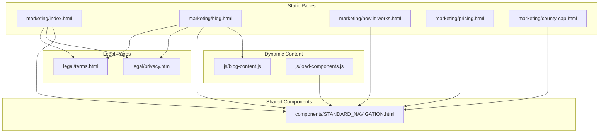
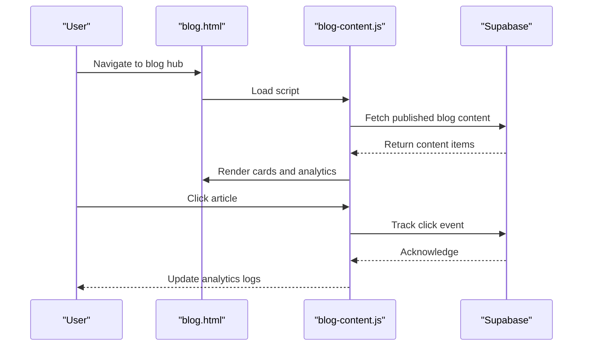
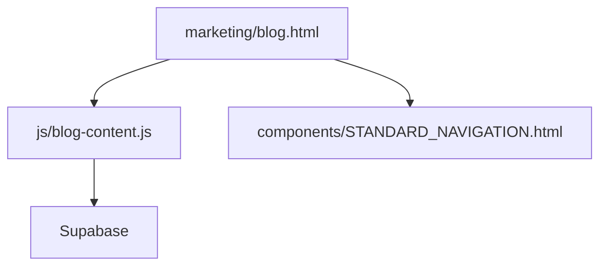

# SEO and Performance Optimization

<cite>
**Referenced Files in This Document**
- [index.html](file://marketing/index.html)
- [blog.html](file://marketing/blog.html)
- [blog-content.js](file://js/blog-content.js)
- [load-components.js](file://js/load-components.js)
- [STANDARD_NAVIGATION.html](file://components/STANDARD_NAVIGATION.html)
- [how-it-works.html](file://marketing/how-it-works.html)
- [pricing.html](file://marketing/pricing.html)
- [county-cap.html](file://marketing/county-cap.html)
- [privacy.html](file://legal/privacy.html)
- [terms.html](file://legal/terms.html)
</cite>

## Table of Contents
1. [Introduction](#introduction)
2. [Project Structure](#project-structure)
3. [Core Components](#core-components)
4. [Architecture Overview](#architecture-overview)
5. [Detailed Component Analysis](#detailed-component-analysis)
6. [Dependency Analysis](#dependency-analysis)
7. [Performance Considerations](#performance-considerations)
8. [Troubleshooting Guide](#troubleshooting-guide)
9. [Conclusion](#conclusion)
10. [Appendices](#appendices)

## Introduction
This document provides a comprehensive guide to SEO implementation and performance optimization across TrueVow’s website. It covers meta tag strategies (title tags, meta descriptions, Open Graph, and Twitter Cards), schema.org markup for legal services and local business information, image optimization and lazy loading, JavaScript optimization (async loading, code splitting, and performance monitoring), and blog SEO with dynamic content fetching, analytics tracking, and content categorization. It also includes guidelines for mobile-first indexing, Core Web Vitals optimization, and Google Search Console integration, balancing rich interactivity with SEO performance for fast-loading yet engaging user experiences.

## Project Structure
TrueVow’s website is composed of static HTML pages under the marketing directory, with modular components and lightweight JavaScript for dynamic content and component loading. The structure supports SEO-friendly, server-rendered pages with client-side enhancements.

**Diagram sources**
- [index.html](file://marketing/index.html#L1-L324)
- [blog.html](file://marketing/blog.html#L1-L554)
- [blog-content.js](file://js/blog-content.js#L1-L424)
- [load-components.js](file://js/load-components.js#L1-L58)
- [STANDARD_NAVIGATION.html](file://components/STANDARD_NAVIGATION.html#L1-L25)
- [privacy.html](file://legal/privacy.html#L1-L1262)
- [terms.html](file://legal/terms.html#L1-L1204)

**Section sources**
- [index.html](file://marketing/index.html#L1-L324)
- [blog.html](file://marketing/blog.html#L1-L554)
- [blog-content.js](file://js/blog-content.js#L1-L424)
- [load-components.js](file://js/load-components.js#L1-L58)
- [STANDARD_NAVIGATION.html](file://components/STANDARD_NAVIGATION.html#L1-L25)
- [privacy.html](file://legal/privacy.html#L1-L1262)
- [terms.html](file://legal/terms.html#L1-L1204)

## Core Components
- Static marketing pages with SEO-focused meta tags and structured content.
- Dynamic blog hub with client-side content fetching and analytics tracking.
- Shared navigation component for consistent navigation and SEO across pages.
- Legal pages (privacy and terms) that reinforce compliance and trust signals for SEO and user confidence.

Key SEO and performance highlights:
- Meta tags present on homepage and blog hub.
- Open Graph and Twitter Card meta tags on the blog hub.
- Structured data (schema.org) ItemList on the blog hub.
- Client-side JavaScript for dynamic content and analytics with graceful degradation.
- Shared navigation component for consistent navigation and reduced duplication.

**Section sources**
- [index.html](file://marketing/index.html#L1-L324)
- [blog.html](file://marketing/blog.html#L1-L554)
- [blog-content.js](file://js/blog-content.js#L1-L424)
- [STANDARD_NAVIGATION.html](file://components/STANDARD_NAVIGATION.html#L1-L25)

## Architecture Overview
The site architecture emphasizes server-rendered pages with progressive enhancement via JavaScript. The blog hub dynamically loads content from Supabase, tracks analytics, and updates UI without full-page reloads. Shared components ensure consistent navigation and reduce duplication.

**Diagram sources**
- [blog.html](file://marketing/blog.html#L470-L476)
- [blog-content.js](file://js/blog-content.js#L26-L64)
- [blog-content.js](file://js/blog-content.js#L72-L102)
- [blog-content.js](file://js/blog-content.js#L109-L219)

**Section sources**
- [blog.html](file://marketing/blog.html#L470-L476)
- [blog-content.js](file://js/blog-content.js#L26-L64)
- [blog-content.js](file://js/blog-content.js#L72-L102)
- [blog-content.js](file://js/blog-content.js#L109-L219)

## Detailed Component Analysis

### Meta Tag Strategies
- Homepage: Includes title and meta description optimized for conversion and visibility.
- Blog Hub: Adds Open Graph and Twitter Card meta tags for rich social previews and improved shareability.

Implementation examples:
- Title and description on homepage: [index.html](file://marketing/index.html#L1-L324)
- Open Graph and Twitter meta tags on blog hub: [blog.html](file://marketing/blog.html#L13-L26)

Best practices:
- Keep title tags under 60 characters; meta descriptions under 160 characters.
- Use unique, compelling titles and descriptions per page.
- Include locale and canonical URL references where applicable.

**Section sources**
- [index.html](file://marketing/index.html#L1-L324)
- [blog.html](file://marketing/blog.html#L13-L26)

### Open Graph and Twitter Cards
- Open Graph: Defines type, URL, title, description, and image for unified social sharing.
- Twitter Card: Specifies card type, URL, title, description, and image for Twitter previews.

Implementation:
- Open Graph and Twitter meta tags: [blog.html](file://marketing/blog.html#L13-L26)

Guidelines:
- Use high-resolution, aspect-ratio appropriate images for social previews.
- Ensure image alt text is descriptive for accessibility and SEO.

**Section sources**
- [blog.html](file://marketing/blog.html#L13-L26)

### Schema.org Markup for Legal Services and Local Business
- Blog hub implements schema.org ItemList with Article and VideoObject entries to describe content and improve rich snippet visibility.

Implementation:
- Structured data on blog hub: [blog.html](file://marketing/blog.html#L27-L64)

Guidelines:
- Use precise types (Article, VideoObject) aligned with content.
- Include accurate names, descriptions, and URLs.
- Validate markup with Google Rich Results Test.

**Section sources**
- [blog.html](file://marketing/blog.html#L27-L64)

### Image Optimization and Lazy Loading
- Blog hub uses gradient placeholders and external thumbnails for cards.
- Implement lazy loading for images to improve Core Web Vitals.

Recommendations:
- Use modern formats (AVIF/WebP) with fallbacks.
- Enable lazy loading with loading="lazy".
- Compress images and serve responsive sizes via srcset/sizes.
- Use next-gen formats and CDNs for global performance.

[No sources needed since this section provides general guidance]

### JavaScript Optimization
- Async loading: Scripts are loaded asynchronously to avoid blocking rendering.
- Code splitting: Dynamic content loading keeps initial payload small.
- Performance monitoring: Analytics tracking with minimal overhead and graceful error handling.

Implementation:
- Dynamic blog content loading and analytics: [blog-content.js](file://js/blog-content.js#L1-L424)
- Component loader for navigation: [load-components.js](file://js/load-components.js#L1-L58)

Guidelines:
- Defer non-critical JavaScript.
- Use intersection observers for lazy loading.
- Minimize third-party scripts and monitor their impact.
- Implement error boundaries and fallbacks for analytics.

**Section sources**
- [blog-content.js](file://js/blog-content.js#L1-L424)
- [load-components.js](file://js/load-components.js#L1-L58)

### Blog SEO Implementation
- Dynamic content fetching: Content loaded from Supabase with filters and analytics.
- Analytics tracking: View and click events tracked with metadata.
- Content categorization: Articles and videos categorized for discoverability.

Implementation:
- Fetch and render blog content: [blog-content.js](file://js/blog-content.js#L26-L64)
- Track analytics: [blog-content.js](file://js/blog-content.js#L72-L102)
- Render cards and attach click tracking: [blog-content.js](file://js/blog-content.js#L109-L219)

Guidelines:
- Ensure canonical URLs for content items.
- Use semantic HTML and proper headings hierarchy.
- Implement structured data for content types.
- Monitor analytics and optimize based on engagement metrics.

**Section sources**
- [blog-content.js](file://js/blog-content.js#L26-L64)
- [blog-content.js](file://js/blog-content.js#L72-L102)
- [blog-content.js](file://js/blog-content.js#L109-L219)

### Mobile-First Indexing and Core Web Vitals
- Mobile-first design patterns evident in responsive styles.
- Focus on Largest Contentful Paint (LCP), First Input Delay (FID), and Cumulative Layout Shift (CLS).

Recommendations:
- Optimize LCP by deferring offscreen images and prioritizing above-the-fold content.
- Improve FID by minimizing JavaScript execution time and avoiding long tasks.
- Reduce CLS by reserving space for images and ads.

**Section sources**
- [index.html](file://marketing/index.html#L1-L324)
- [blog.html](file://marketing/blog.html#L1-L554)

### Google Search Console Integration
- Use meta tags and structured data to signal content and schema.
- Monitor crawl errors and performance issues via Search Console.
- Submit sitemaps and verify ownership.

[No sources needed since this section provides general guidance]

### Balancing Rich Interactivity and SEO Performance
- Progressive enhancement: Server-rendered pages with client-side enhancements.
- Lightweight components: Shared navigation reduces duplication and improves caching.
- Analytics with resilience: Tracking gracefully fails without breaking UX.

**Section sources**
- [load-components.js](file://js/load-components.js#L1-L58)
- [blog-content.js](file://js/blog-content.js#L1-L424)

## Dependency Analysis
The blog hub depends on Supabase for content and analytics, and on shared components for navigation. The dependency graph below illustrates these relationships.

**Diagram sources**
- [blog.html](file://marketing/blog.html#L470-L476)
- [blog-content.js](file://js/blog-content.js#L1-L424)
- [STANDARD_NAVIGATION.html](file://components/STANDARD_NAVIGATION.html#L1-L25)

**Section sources**
- [blog.html](file://marketing/blog.html#L470-L476)
- [blog-content.js](file://js/blog-content.js#L1-L424)
- [STANDARD_NAVIGATION.html](file://components/STANDARD_NAVIGATION.html#L1-L25)

## Performance Considerations
- Minimize critical resources and defer non-critical scripts.
- Use lazy loading for images and videos.
- Compress and optimize assets; leverage browser caching.
- Monitor and optimize Core Web Vitals.
- Ensure fast first paint and interactivity.

[No sources needed since this section provides general guidance]

## Troubleshooting Guide
Common issues and resolutions:
- Blog content not loading: Verify Supabase endpoint and credentials; check network tab for errors.
- Analytics tracking failures: Inspect console for errors; ensure tracking is resilient and doesn’t block rendering.
- Navigation not loading: Confirm component loader path and target element existence.

**Section sources**
- [blog-content.js](file://js/blog-content.js#L1-L424)
- [load-components.js](file://js/load-components.js#L1-L58)

## Conclusion
TrueVow’s website leverages SEO-friendly meta tags, structured data, and dynamic content delivery to enhance visibility and user experience. By implementing image optimization, progressive enhancement, and robust analytics, the site achieves a balance between rich interactivity and strong SEO performance. Following the guidelines in this document will help maintain and further improve search rankings, Core Web Vitals, and user engagement.

[No sources needed since this section summarizes without analyzing specific files]

## Appendices
- Legal pages reinforce trust and compliance for SEO and user confidence.
- Shared components ensure consistency and reduce duplication.

**Section sources**
- [privacy.html](file://legal/privacy.html#L1-L1262)
- [terms.html](file://legal/terms.html#L1-L1204)
- [STANDARD_NAVIGATION.html](file://components/STANDARD_NAVIGATION.html#L1-L25)