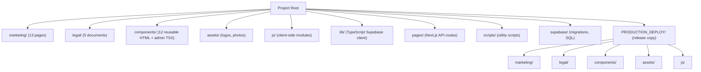
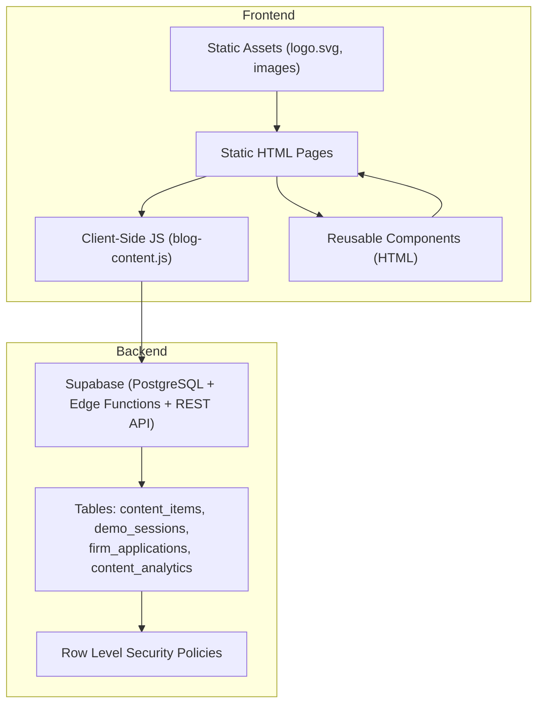
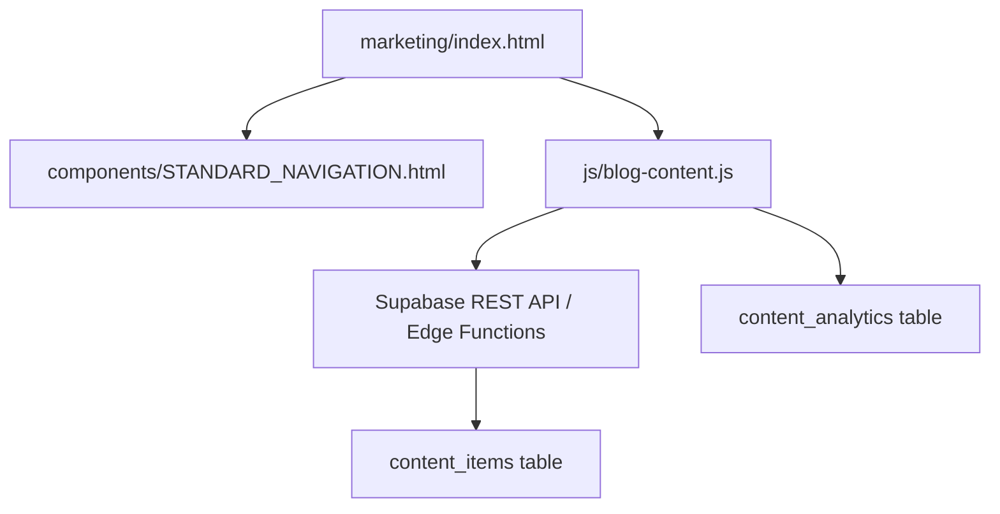

# Directory Structure Reference

<cite>
**Referenced Files in This Document**
- [README.md](file://README.md)
- [marketing/index.html](file://marketing/index.html)
- [components/STANDARD_NAVIGATION.html](file://components/STANDARD_NAVIGATION.html)
- [js/blog-content.js](file://js/blog-content.js)
- [scripts/README.md](file://scripts/README.md)
- [supabase/DATABASE_SCHEMA_README.md](file://supabase/DATABASE_SCHEMA_README.md)
- [PRODUCTION_DEPLOY/marketing/index.html](file://PRODUCTION_DEPLOY/marketing/index.html)
- [PRODUCTION_DEPLOY/components/STANDARD_NAVIGATION.html](file://PRODUCTION_DEPLOY/components/STANDARD_NAVIGATION.html)
- [PRODUCTION_DEPLOY/js/blog-content.js](file://PRODUCTION_DEPLOY/js/blog-content.js)
</cite>

## Table of Contents
1. [Introduction](#introduction)
2. [Project Structure](#project-structure)
3. [Core Components](#core-components)
4. [Architecture Overview](#architecture-overview)
5. [Detailed Component Analysis](#detailed-component-analysis)
6. [Dependency Analysis](#dependency-analysis)
7. [Performance Considerations](#performance-considerations)
8. [Troubleshooting Guide](#troubleshooting-guide)
9. [Conclusion](#conclusion)

## Introduction
This document provides a comprehensive directory structure reference for the TrueVow Website project. It explains the hierarchical organization of key folders, file naming conventions, and organizational principles. It also details the relationships between marketing pages (13 files), legal documents (5 files), reusable components (12 files), and utility scripts, and offers guidance on where to place new files, how components are structured, and how frontend and backend assets are separated.

## Project Structure
The project is organized into distinct directories that separate marketing content, legal documents, shared components, static assets, client-side JavaScript, backend integration libraries, API endpoints, utility scripts, and Supabase database artifacts. The production deployment mirrors this structure under a dedicated folder for release-ready assets.

**Diagram sources**
- [README.md](file://README.md#L46-L120)
- [PRODUCTION_DEPLOY/marketing/index.html](file://PRODUCTION_DEPLOY/marketing/index.html#L1-L50)
- [PRODUCTION_DEPLOY/components/STANDARD_NAVIGATION.html](file://PRODUCTION_DEPLOY/components/STANDARD_NAVIGATION.html#L1-L25)
- [PRODUCTION_DEPLOY/js/blog-content.js](file://PRODUCTION_DEPLOY/js/blog-content.js#L1-L50)

**Section sources**
- [README.md](file://README.md#L46-L120)

## Core Components
- Marketing pages: 13 HTML files covering homepage, pricing, product explanation, blog hub, application forms, partner/affiliate programs, strategy guides, about, careers, press, case studies, and internal/draft pages.
- Legal documents: 5 HTML files for terms of service, privacy policy, master services agreement, bar compliance, and subprocessors list.
- Reusable components: 12 standardized HTML components plus an admin React TSX form, designed for embedding across pages.
- Static assets: SVG logos and JPG images.
- Client-side JavaScript: Single module for dynamic blog content fetching and analytics tracking.
- TypeScript library: Supabase client configuration for backend connectivity.
- API endpoints: Next.js API routes for blog content and analytics.
- Utility scripts: Database connection tests and migration-related scripts.
- Supabase artifacts: Migrations, SQL scripts, and schema documentation.

**Section sources**
- [README.md](file://README.md#L124-L163)
- [README.md](file://README.md#L46-L120)

## Architecture Overview
The website is a static HTML site hosted on traditional web hosting, connecting to Supabase for backend functionality. The frontend communicates with Supabase via REST API and Edge Functions, enabling dynamic content (blog), form submissions, and analytics.

**Diagram sources**
- [README.md](file://README.md#L26-L43)
- [README.md](file://README.md#L166-L205)
- [README.md](file://README.md#L335-L385)
- [supabase/DATABASE_SCHEMA_README.md](file://supabase/DATABASE_SCHEMA_README.md#L1-L50)

## Detailed Component Analysis

### Marketing Directory
- Purpose: Contains all public-facing marketing pages.
- Organization: One HTML file per page, with a dedicated JavaScript folder for page-specific scripts.
- Typical files: index.html, pricing.html, how-it-works.html, blog.html, apply.html, partner.html, affiliate.html, county-cap.html, about.html, careers.html, press.html, case-studies.html, affiliate-apply.html, and internal/draft variants.
- Naming convention: lowercase with hyphens; page-specific JS in a nested js/ folder.

Guidance for placement:
- Add new marketing pages under marketing/ with descriptive filenames.
- Place page-specific scripts in marketing/js/.

**Section sources**
- [README.md](file://README.md#L49-L64)
- [README.md](file://README.md#L126-L143)

### Legal Directory
- Purpose: Hosts legal compliance and policy pages.
- Files: terms.html, privacy.html, msa.html, bar-compliance.html, subprocessors.html.
- Naming convention: descriptive lowercase with hyphens.

Guidance for placement:
- Add new legal documents as HTML files in legal/.
- Keep content static; ensure compliance updates are reviewed before publishing.

**Section sources**
- [README.md](file://README.md#L65-L71)
- [README.md](file://README.md#L144-L153)

### Components Directory
- Purpose: Central repository of reusable HTML components for consistent UI across pages.
- Files: STANDARD_NAVIGATION.html, STANDARD_FOOTER.html, plus interactive widgets (exit-intent-popup.html, live-chat-widget.html, phone-call-offer.html, prefill-indicator.html, roi-calculator.html, social-proof-notifications.html, trust-badges.html, urgency-timer.html, video-testimonial.html).
- Admin component: admin/AddContentForm.tsx (React TSX).
- Inline scripts: Several components embed lightweight inline JavaScript for interactivity.

Guidance for placement:
- Embed components directly into HTML pages via standard include patterns.
- Keep component HTML self-contained; avoid external dependencies when possible.
- For interactive widgets, ensure inline scripts are minimal and scoped.

**Section sources**
- [README.md](file://README.md#L72-L86)
- [components/STANDARD_NAVIGATION.html](file://components/STANDARD_NAVIGATION.html#L1-L25)

### Assets Directory
- Purpose: Static assets used across the site.
- Files: logo.svg, founder-photo.jpg, and related variants.

Guidance for placement:
- Place new images/logos in assets/ and reference via relative paths in components and pages.
- Prefer SVG for logos; optimize JPEG/PNG for photos.

**Section sources**
- [README.md](file://README.md#L87-L91)

### JavaScript Directory
- Purpose: Client-side modules for dynamic behavior.
- Files: blog-content.js (fetches blog content, renders cards, tracks analytics).
- Related loader: load-components.js (loads components into pages).

Guidance for placement:
- Add new modular scripts in js/ and import them into pages that require them.
- Keep scripts focused and single-responsibility.

**Section sources**
- [README.md](file://README.md#L92-L94)
- [js/blog-content.js](file://js/blog-content.js#L1-L50)

### Lib Directory
- Purpose: Backend integration configuration.
- File: supabaseClient.ts (TypeScript client setup for Supabase).

Guidance for placement:
- Place backend-related libraries in lib/ and import into pages or scripts that need Supabase connectivity.

**Section sources**
- [README.md](file://README.md#L95-L97)

### Pages Directory
- Purpose: Next.js API routes for serverless backend logic.
- Structure: pages/api/blog/content.ts and pages/api/blog/track.ts.

Guidance for placement:
- Add new API endpoints under pages/api/<route>/ and ensure proper routing and permissions.

**Section sources**
- [README.md](file://README.md#L98-L103)

### Scripts Directory
- Purpose: Utility scripts for database operations and testing.
- Files: test-db-connections.js/ts, auto-migrate-database.js, complete-migration.js, deploy-saas-admin-schema.js, and many state/population scripts.
- Guidance: Use README.md to understand current availability and restoration needs.

**Section sources**
- [README.md](file://README.md#L104-L110)
- [scripts/README.md](file://scripts/README.md#L1-L24)

### Supabase Directory
- Purpose: Database schema, migrations, and operational SQL.
- Files: migrations/, SQL scripts for population, verification, and maintenance, plus DATABASE_SCHEMA_README.md.

Guidance for placement:
- Place migration files under supabase/migrations/.
- Keep operational scripts under supabase/ and reference DATABASE_SCHEMA_README.md for table definitions and policies.

**Section sources**
- [README.md](file://README.md#L111-L120)
- [supabase/DATABASE_SCHEMA_README.md](file://supabase/DATABASE_SCHEMA_README.md#L1-L50)

### PRODUCTION_DEPLOY Directory
- Purpose: Release-ready copy mirroring the above structure for deployment.
- Includes assets/, components/, js/, legal/, marketing/, and widgets/truevow-chatbot/.

Guidance for placement:
- Commit finalized assets to PRODUCTION_DEPLOY before uploading to hosting.

**Section sources**
- [README.md](file://README.md#L421-L463)
- [PRODUCTION_DEPLOY/marketing/index.html](file://PRODUCTION_DEPLOY/marketing/index.html#L1-L50)
- [PRODUCTION_DEPLOY/components/STANDARD_NAVIGATION.html](file://PRODUCTION_DEPLOY/components/STANDARD_NAVIGATION.html#L1-L25)
- [PRODUCTION_DEPLOY/js/blog-content.js](file://PRODUCTION_DEPLOY/js/blog-content.js#L1-L50)

## Dependency Analysis
The frontend depends on Supabase for dynamic content and form submissions. Components are embedded into pages, and client-side scripts handle content rendering and analytics.

**Diagram sources**
- [marketing/index.html](file://marketing/index.html#L1-L50)
- [components/STANDARD_NAVIGATION.html](file://components/STANDARD_NAVIGATION.html#L1-L25)
- [js/blog-content.js](file://js/blog-content.js#L1-L50)
- [supabase/DATABASE_SCHEMA_README.md](file://supabase/DATABASE_SCHEMA_README.md#L348-L374)

**Section sources**
- [README.md](file://README.md#L208-L222)
- [README.md](file://README.md#L335-L385)

## Performance Considerations
- Static hosting reduces server overhead; ensure assets are optimized.
- Client-side rendering of blog content should leverage caching headers and efficient filtering.
- Minimize inline scripts in components to reduce DOM parsing overhead.
- Use CDN delivery for assets when possible.

## Troubleshooting Guide
Common issues and resolutions:
- Blog content not loading: Verify Supabase URL and API key configuration in js/blog-content.js, confirm RLS allows public read for published content, and ensure content_items has published rows.
- Forms failing: Confirm Edge Function URLs are correct, verify Edge Functions are deployed, and check CORS policies.
- Supabase connection errors: Validate SUPABASE_URL format and SUPABASE_ANON_KEY correctness.

**Section sources**
- [README.md](file://README.md#L502-L547)

## Conclusion
The TrueVow Website project employs a clear separation of concerns: static HTML for content, reusable components for consistency, client-side JavaScript for dynamic behavior, and Supabase for backend services. The directory structure supports scalability, maintainability, and straightforward deployment. Adhering to the naming conventions and placement guidelines outlined above ensures consistency across marketing pages, legal documents, components, and scripts.