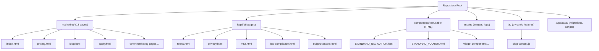
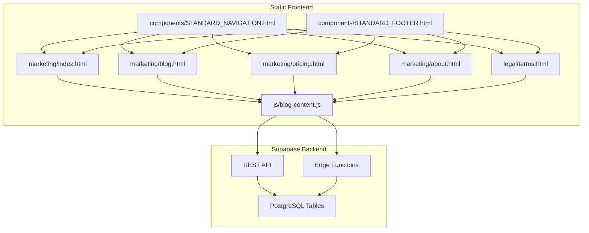
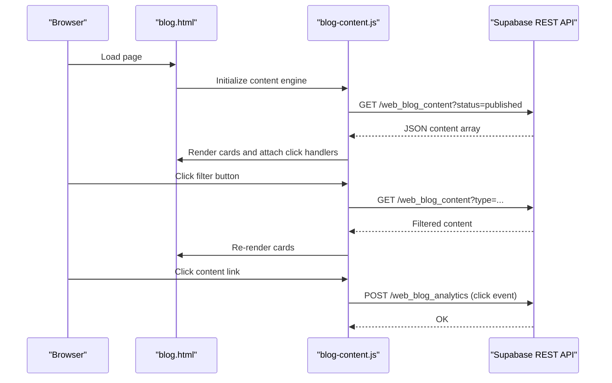
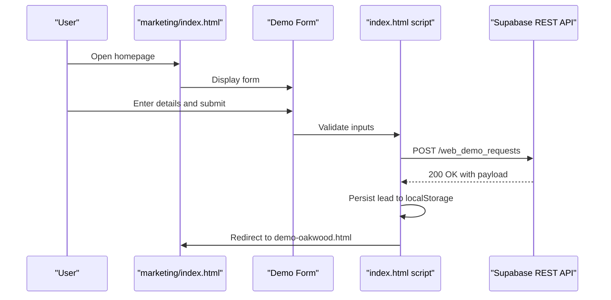
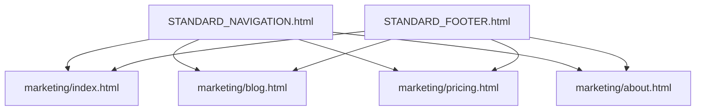
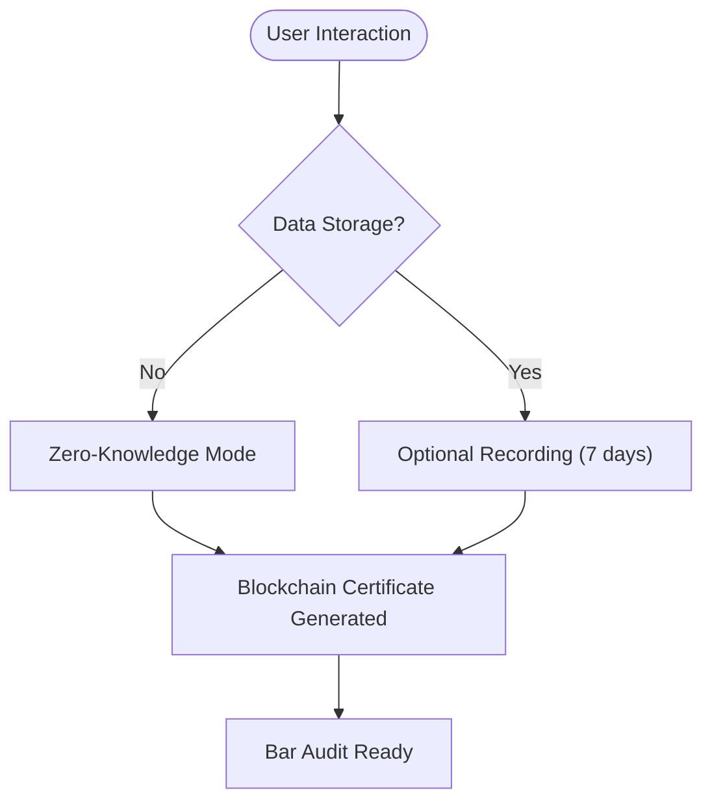
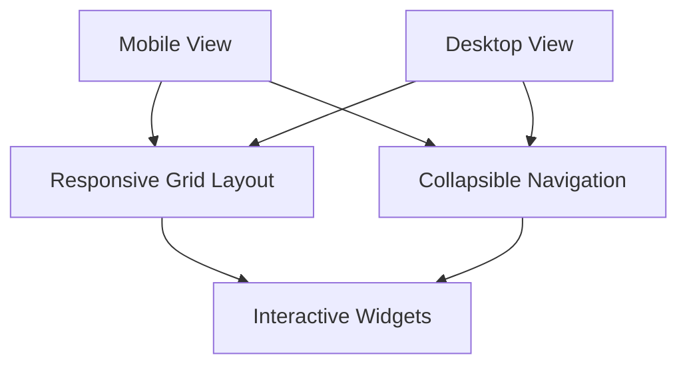
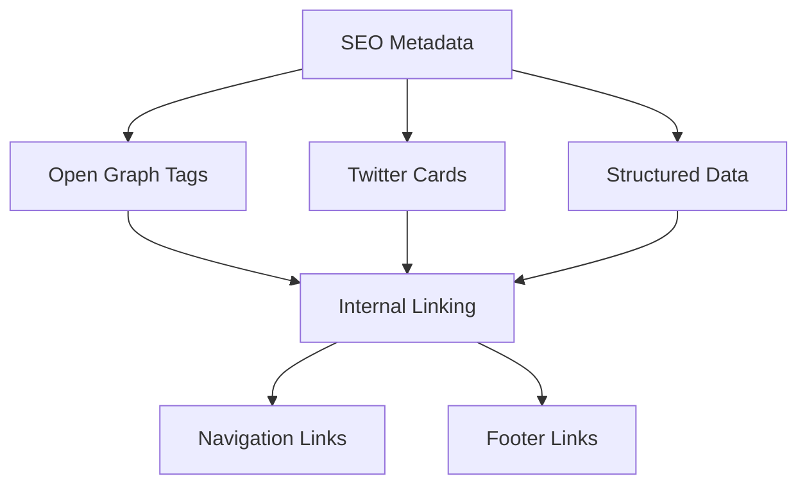
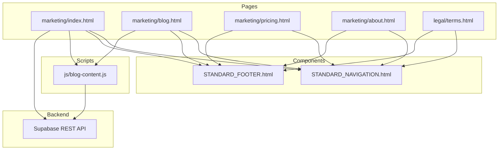

# Feature Overview

<cite>
**Referenced Files in This Document**
- [README.md](file://README.md)
- [marketing/index.html](file://marketing/index.html)
- [marketing/blog.html](file://marketing/blog.html)
- [marketing/pricing.html](file://marketing/pricing.html)
- [marketing/about.html](file://marketing/about.html)
- [legal/terms.html](file://legal/terms.html)
- [components/STANDARD_NAVIGATION.html](file://components/STANDARD_NAVIGATION.html)
- [components/STANDARD_FOOTER.html](file://components/STANDARD_FOOTER.html)
- [js/blog-content.js](file://js/blog-content.js)
</cite>

## Table of Contents
1. [Introduction](#introduction)
2. [Project Structure](#project-structure)
3. [Core Components](#core-components)
4. [Architecture Overview](#architecture-overview)
5. [Detailed Component Analysis](#detailed-component-analysis)
6. [Dependency Analysis](#dependency-analysis)
7. [Performance Considerations](#performance-considerations)
8. [Troubleshooting Guide](#troubleshooting-guide)
9. [Conclusion](#conclusion)

## Introduction
This document provides a comprehensive feature overview of the TrueVow Website, a static HTML marketing and legal portal powered by a Supabase backend. The site comprises 18 production pages: 13 marketing pages (homepage, pricing, blog, applications, about, and others) and 5 legal pages (terms, privacy, MSA, bar compliance, subprocessors). Key capabilities include:
- Automated blog hub with dynamic content fetching from Supabase
- Form submission system for demos, applications, and partnerships
- Reusable component library with interactive widgets
- Zero-knowledge architecture for compliance
- Responsive design and SEO optimization
- Internal linking strategy supporting cross-page navigation

## Project Structure
The repository is organized into marketing, legal, components, assets, js, and supabase directories. The marketing and legal folders host the 18 production HTML pages. The components directory centralizes reusable UI elements. The js directory contains client-side scripts for dynamic features like the blog content engine. Supabase-related database migrations and scripts are located under the supabase directory.

**Diagram sources**
- [README.md](file://README.md#L46-L120)

**Section sources**
- [README.md](file://README.md#L46-L120)

## Core Components
- Static HTML pages: 13 marketing and 5 legal pages form the primary content surfaces.
- Reusable components: Standardized navigation and footer reduce duplication and ensure consistent UX across pages.
- Dynamic blog hub: A client-side script fetches published content from Supabase and renders cards with filtering and analytics.
- Form submission system: Contact and application forms submit data to Supabase endpoints for processing.
- Zero-knowledge architecture: Designed to minimize data retention and storage, reducing compliance risk.
- Responsive design: Mobile-first CSS ensures usability across devices.
- SEO optimization: Meta tags, structured data, and semantic markup improve discoverability.

**Section sources**
- [README.md](file://README.md#L124-L163)
- [marketing/index.html](file://marketing/index.html#L1-L324)
- [marketing/blog.html](file://marketing/blog.html#L1-L554)
- [components/STANDARD_NAVIGATION.html](file://components/STANDARD_NAVIGATION.html#L1-L25)
- [components/STANDARD_FOOTER.html](file://components/STANDARD_FOOTER.html#L1-L61)
- [js/blog-content.js](file://js/blog-content.js#L1-L424)

## Architecture Overview
The website uses a static HTML architecture with a Supabase backend for dynamic features and data persistence. The frontend communicates with Supabase via REST API and Edge Functions to power the blog hub and form submissions.

**Diagram sources**
- [README.md](file://README.md#L166-L221)
- [marketing/index.html](file://marketing/index.html#L84-L243)
- [marketing/blog.html](file://marketing/blog.html#L469-L476)
- [js/blog-content.js](file://js/blog-content.js#L1-L13)

**Section sources**
- [README.md](file://README.md#L166-L221)

## Detailed Component Analysis

### Automated Blog Hub System
The blog hub dynamically fetches published content from Supabase and renders cards with filtering and analytics tracking. It supports article and video content types, with badges indicating platform and type. Filtering is handled client-side, and analytics events are sent to Supabase for views and clicks.

**Diagram sources**
- [marketing/blog.html](file://marketing/blog.html#L469-L476)
- [js/blog-content.js](file://js/blog-content.js#L26-L102)
- [js/blog-content.js](file://js/blog-content.js#L319-L350)
- [js/blog-content.js](file://js/blog-content.js#L386-L414)

**Section sources**
- [marketing/blog.html](file://marketing/blog.html#L1-L554)
- [js/blog-content.js](file://js/blog-content.js#L1-L424)

### Form Submission System
The homepage includes a demo request form that submits data to Supabase. The form performs client-side validation, normalizes phone numbers, and sends a POST request to the Supabase REST API. On success, it resets the form and redirects to a demo landing page. The script also persists lead data to local storage for offline resilience.

**Diagram sources**
- [marketing/index.html](file://marketing/index.html#L84-L243)

**Section sources**
- [marketing/index.html](file://marketing/index.html#L84-L243)

### Reusable Component Library
Reusable components include standardized navigation and footer templates embedded across pages. These components ensure consistent branding, navigation, and legal links. The navigation highlights the active page and includes a prominent CTA to schedule a demo.

**Diagram sources**
- [components/STANDARD_NAVIGATION.html](file://components/STANDARD_NAVIGATION.html#L1-L25)
- [components/STANDARD_FOOTER.html](file://components/STANDARD_FOOTER.html#L1-L61)

**Section sources**
- [components/STANDARD_NAVIGATION.html](file://components/STANDARD_NAVIGATION.html#L1-L25)
- [components/STANDARD_FOOTER.html](file://components/STANDARD_FOOTER.html#L1-L61)

### Zero-Knowledge Architecture for Compliance
The website emphasizes a zero-knowledge approach to minimize data retention and storage, reducing compliance risks. The Terms of Service document outlines the zero-knowledge architecture, deterministic logic, and compliance certificates. The blog hub’s analytics tracking is designed to avoid storing sensitive data.

**Diagram sources**
- [legal/terms.html](file://legal/terms.html#L1-L1204)
- [js/blog-content.js](file://js/blog-content.js#L72-L102)

**Section sources**
- [legal/terms.html](file://legal/terms.html#L1-L1204)
- [js/blog-content.js](file://js/blog-content.js#L72-L102)

### Responsive Design Implementation
The site employs a mobile-first design strategy with CSS media queries and flexible layouts. Components like the blog grid adapt to various screen sizes, and navigation adjusts for smaller viewports. The homepage includes a sticky CTA bar that appears after scrolling, improving engagement on mobile devices.

**Diagram sources**
- [marketing/blog.html](file://marketing/blog.html#L356-L383)
- [marketing/index.html](file://marketing/index.html#L71-L82)

**Section sources**
- [marketing/blog.html](file://marketing/blog.html#L356-L383)
- [marketing/index.html](file://marketing/index.html#L71-L82)

### SEO Optimization and Internal Linking Strategy
The site includes meta tags, Open Graph, and Twitter Card metadata for social sharing. Structured data is present in the blog hub for content indexing. Internal linking is standardized through reusable navigation and footer components, ensuring consistent cross-page navigation and improved crawlability.

**Diagram sources**
- [marketing/blog.html](file://marketing/blog.html#L13-L64)
- [components/STANDARD_NAVIGATION.html](file://components/STANDARD_NAVIGATION.html#L1-L25)
- [components/STANDARD_FOOTER.html](file://components/STANDARD_FOOTER.html#L1-L61)

**Section sources**
- [marketing/blog.html](file://marketing/blog.html#L13-L64)
- [components/STANDARD_NAVIGATION.html](file://components/STANDARD_NAVIGATION.html#L1-L25)
- [components/STANDARD_FOOTER.html](file://components/STANDARD_FOOTER.html#L1-L61)

## Dependency Analysis
The marketing pages depend on the reusable components and the blog content engine. The blog hub script depends on Supabase REST API for content retrieval and analytics. The homepage demo form depends on Supabase REST API for submissions. Legal pages reference standardized navigation and footer components.

**Diagram sources**
- [marketing/index.html](file://marketing/index.html#L1-L324)
- [marketing/blog.html](file://marketing/blog.html#L1-L554)
- [marketing/pricing.html](file://marketing/pricing.html#L1-L506)
- [marketing/about.html](file://marketing/about.html#L1-L966)
- [legal/terms.html](file://legal/terms.html#L1-L1204)
- [components/STANDARD_NAVIGATION.html](file://components/STANDARD_NAVIGATION.html#L1-L25)
- [components/STANDARD_FOOTER.html](file://components/STANDARD_FOOTER.html#L1-L61)
- [js/blog-content.js](file://js/blog-content.js#L1-L424)

**Section sources**
- [marketing/index.html](file://marketing/index.html#L1-L324)
- [marketing/blog.html](file://marketing/blog.html#L1-L554)
- [marketing/pricing.html](file://marketing/pricing.html#L1-L506)
- [marketing/about.html](file://marketing/about.html#L1-L966)
- [legal/terms.html](file://legal/terms.html#L1-L1204)
- [components/STANDARD_NAVIGATION.html](file://components/STANDARD_NAVIGATION.html#L1-L25)
- [components/STANDARD_FOOTER.html](file://components/STANDARD_FOOTER.html#L1-L61)
- [js/blog-content.js](file://js/blog-content.js#L1-L424)

## Performance Considerations
- Static HTML reduces server overhead and improves load times.
- Client-side filtering in the blog hub minimizes server round trips.
- Lazy loading of images and minimal JavaScript usage enhance responsiveness.
- Edge Functions can be used for form submissions to reduce origin server load.
- CDN caching of static assets (CSS, JS, images) improves global performance.

## Troubleshooting Guide
Common issues and resolutions:
- Blog content not loading: Verify Supabase URL and API key configuration, confirm table rows with published status, and ensure Row Level Security allows public read access.
- Forms not submitting: Check Edge Function URLs, verify Edge Functions deployment, and inspect browser network tab for CORS errors.
- Supabase connection errors: Confirm URL format, validate API keys, and ensure the Supabase project is active and API is enabled.

**Section sources**
- [README.md](file://README.md#L502-L547)

## Conclusion
The TrueVow Website combines a static HTML architecture with a Supabase backend to deliver a scalable, compliant, and user-friendly marketing and legal portal. The automated blog hub, form submission system, reusable components, zero-knowledge architecture, responsive design, and SEO optimizations collectively support the marketing and compliance objectives. The modular structure and standardized components facilitate maintenance and updates across the 18 production pages.