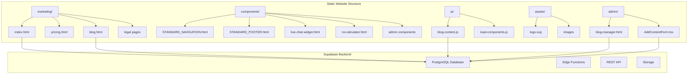
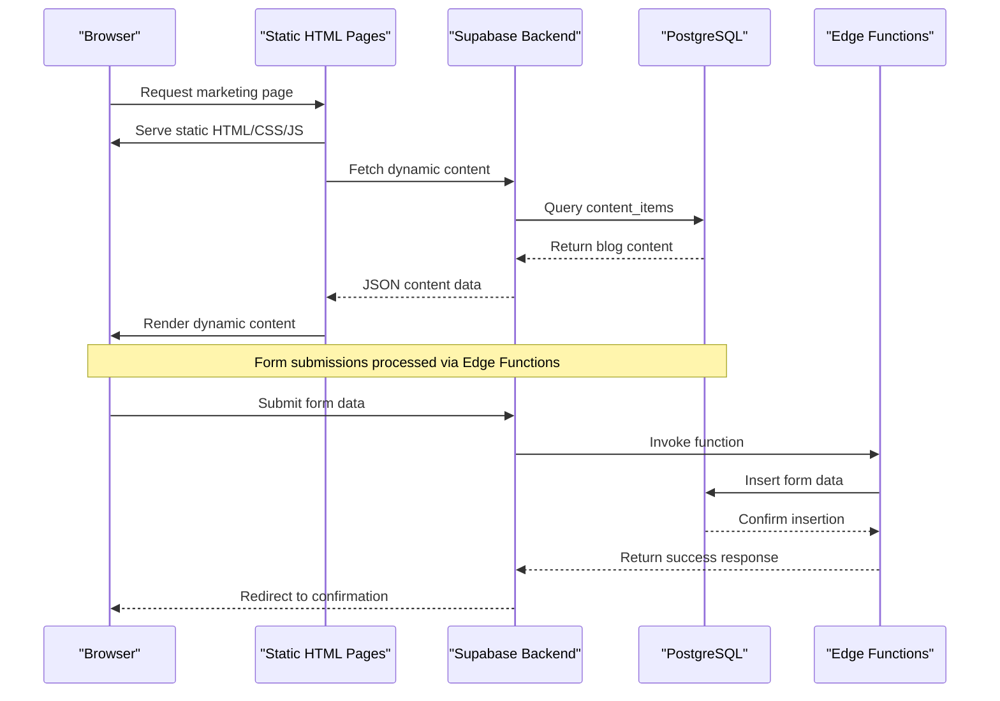
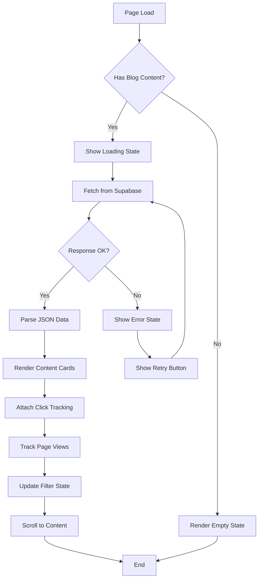
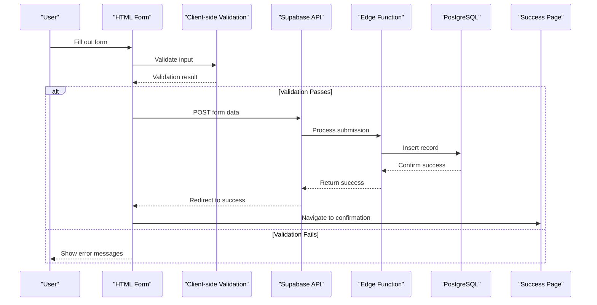
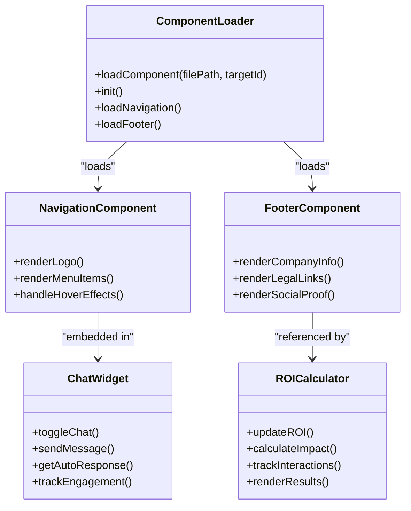
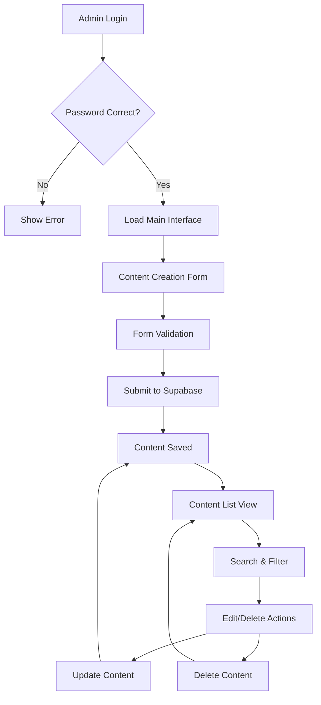

# Project Overview

<cite>
**Referenced Files in This Document**
- [README.md](file://README.md)
- [package.json](file://package.json)
- [marketing/index.html](file://marketing/index.html)
- [marketing/blog.html](file://marketing/blog.html)
- [js/load-components.js](file://js/load-components.js)
- [js/blog-content.js](file://js/blog-content.js)
- [components/STANDARD_NAVIGATION.html](file://components/STANDARD_NAVIGATION.html)
- [components/STANDARD_FOOTER.html](file://components/STANDARD_FOOTER.html)
- [components/live-chat-widget.html](file://components/live-chat-widget.html)
- [components/roi-calculator.html](file://components/roi-calculator.html)
- [components/admin/AddContentForm.tsx](file://components/admin/AddContentForm.tsx)
- [admin/blog-manager.html](file://admin/blog-manager.html)
- [marketing/pricing.html](file://marketing/pricing.html)
</cite>

## Table of Contents
1. [Introduction](#introduction)
2. [Project Structure](#project-structure)
3. [Core Components](#core-components)
4. [Architecture Overview](#architecture-overview)
5. [Detailed Component Analysis](#detailed-component-analysis)
6. [Dependency Analysis](#dependency-analysis)
7. [Performance Considerations](#performance-considerations)
8. [Troubleshooting Guide](#troubleshooting-guide)
9. [Conclusion](#conclusion)

## Introduction
TrueVow is a performance-based legal technology platform marketing website designed specifically for solo and small law firm personal injury attorneys. The platform positions itself as a zero-knowledge, deterministic intake automation system that prevents missed calls and lost revenue by capturing every qualified lead 24/7. The website serves as a public-facing marketing hub that showcases TrueVow's value proposition, compliance-focused design, and automated content delivery.

The project emphasizes practical outcomes for legal practitioners: stopping the $154K annual revenue bleed caused by missed calls, reducing compliance risks through deterministic automation, and maintaining operational simplicity with minimal technical overhead. The marketing pages are structured around emotional triggers (missed calls, compliance anxiety, revenue loss) combined with practical solutions (24/7 intake, performance-based pricing, zero-knowledge architecture).

## Project Structure
The TrueVow website employs a static HTML architecture with integrated Supabase backend functionality. The structure follows a clear separation of concerns with marketing pages, legal documentation, reusable components, and JavaScript modules.



**Diagram sources**
- [marketing/index.html](file://marketing/index.html#L1-L324)
- [marketing/blog.html](file://marketing/blog.html#L1-L554)
- [js/blog-content.js](file://js/blog-content.js#L1-L424)
- [components/STANDARD_NAVIGATION.html](file://components/STANDARD_NAVIGATION.html#L1-L25)
- [components/STANDARD_FOOTER.html](file://components/STANDARD_FOOTER.html#L1-L61)

The architecture consists of three primary layers:
- **Presentation Layer**: Pure HTML/CSS/JavaScript marketing pages with embedded components
- **Integration Layer**: JavaScript modules that connect to Supabase for dynamic content
- **Content Management Layer**: Administrative interfaces for content creation and management

**Section sources**
- [README.md](file://README.md#L46-L121)
- [marketing/index.html](file://marketing/index.html#L1-L324)
- [marketing/blog.html](file://marketing/blog.html#L1-L554)

## Core Components
The TrueVow website leverages several key components that work together to deliver a comprehensive marketing experience for legal practitioners.

### Static HTML Architecture
The website maintains a pure static HTML foundation with embedded CSS and JavaScript, avoiding modern framework dependencies. This approach ensures fast loading times, improved SEO, and reduced maintenance overhead. The architecture supports:

- **Mobile-first responsive design** with adaptive layouts
- **Embedded component system** for navigation and footer consistency
- **Dynamic content integration** through Supabase APIs
- **Form submission capabilities** for lead generation

### Supabase Backend Integration
The static website integrates with Supabase for dynamic functionality including blog content management, form submissions, and analytics tracking. The backend provides:

- **PostgreSQL database** for content storage and user data
- **Edge Functions** for serverless processing of form submissions
- **REST API** for direct content retrieval
- **Row Level Security** for controlled data access

### Reusable Components System
The website implements a component-based architecture for consistent user experience across all pages:

- **Navigation Component**: Standardized header with branding and menu
- **Footer Component**: Consistent legal links and company information
- **Live Chat Widget**: Interactive customer service with predefined responses
- **ROI Calculator**: Interactive financial impact visualization
- **Admin Components**: Content management interfaces for blog posts

**Section sources**
- [README.md](file://README.md#L24-L44)
- [components/STANDARD_NAVIGATION.html](file://components/STANDARD_NAVIGATION.html#L1-L25)
- [components/STANDARD_FOOTER.html](file://components/STANDARD_FOOTER.html#L1-L61)
- [components/live-chat-widget.html](file://components/live-chat-widget.html#L1-L515)
- [components/roi-calculator.html](file://components/roi-calculator.html#L1-L488)

## Architecture Overview
The TrueVow website follows a hybrid architecture combining static site generation with cloud-based backend services. This approach optimizes for performance, scalability, and compliance requirements.



**Diagram sources**
- [marketing/index.html](file://marketing/index.html#L84-L243)
- [js/blog-content.js](file://js/blog-content.js#L18-L64)
- [admin/blog-manager.html](file://admin/blog-manager.html#L1-L800)

The architecture emphasizes several key principles:
- **Zero-knowledge design**: Client data is never stored or processed by the system
- **Deterministic processing**: All interactions follow predefined, predictable patterns
- **Performance optimization**: Static serving with intelligent caching strategies
- **Compliance-first approach**: Built-in protections for legal and regulatory requirements

**Section sources**
- [README.md](file://README.md#L166-L206)
- [marketing/index.html](file://marketing/index.html#L84-L243)

## Detailed Component Analysis

### Blog Content Engine
The blog content engine represents the most sophisticated component, handling dynamic content retrieval, filtering, and analytics tracking.



**Diagram sources**
- [js/blog-content.js](file://js/blog-content.js#L319-L350)
- [marketing/blog.html](file://marketing/blog.html#L436-L441)

The engine implements advanced features including:
- **Client-side filtering** for article/video content types
- **Analytics tracking** for content engagement metrics
- **Error handling** with graceful degradation
- **Responsive design** with grid-based layout
- **Accessibility features** with proper semantic markup

### Form Submission System
The form submission system provides multiple entry points for lead generation while maintaining compliance and performance standards.



**Diagram sources**
- [marketing/index.html](file://marketing/index.html#L152-L238)
- [admin/blog-manager.html](file://admin/blog-manager.html#L520-L714)

The system includes comprehensive validation and error handling:
- **Real-time input validation** with immediate feedback
- **Phone number normalization** for consistent formatting
- **Local storage integration** for lead persistence
- **Cross-browser compatibility** with polyfills
- **Security measures** against common web vulnerabilities

### Reusable Components Architecture
The component system ensures consistency and maintainability across all marketing pages.



**Diagram sources**
- [js/load-components.js](file://js/load-components.js#L6-L56)
- [components/STANDARD_NAVIGATION.html](file://components/STANDARD_NAVIGATION.html#L1-L25)
- [components/STANDARD_FOOTER.html](file://components/STANDARD_FOOTER.html#L1-L61)
- [components/live-chat-widget.html](file://components/live-chat-widget.html#L410-L470)
- [components/roi-calculator.html](file://components/roi-calculator.html#L418-L486)

Each component follows consistent patterns:
- **Self-contained functionality** with minimal dependencies
- **CSS-in-JavaScript styling** for encapsulation
- **Event-driven architecture** with proper cleanup
- **Accessibility compliance** with ARIA attributes
- **Performance optimization** with lazy loading

**Section sources**
- [js/load-components.js](file://js/load-components.js#L1-L58)
- [components/live-chat-widget.html](file://components/live-chat-widget.html#L1-L515)
- [components/roi-calculator.html](file://components/roi-calculator.html#L1-L488)

### Admin Content Management
The administrative interface provides comprehensive content management capabilities for blog posts and marketing materials.



**Diagram sources**
- [admin/blog-manager.html](file://admin/blog-manager.html#L498-L773)
- [components/admin/AddContentForm.tsx](file://components/admin/AddContentForm.tsx#L62-L141)

The admin system features:
- **Role-based access control** with password protection
- **Rich text editing** with character counting
- **Media upload capabilities** with preview functionality
- **Content categorization** with tagging system
- **Real-time preview** of published content
- **Audit trail** for content modifications

**Section sources**
- [admin/blog-manager.html](file://admin/blog-manager.html#L1-L800)
- [components/admin/AddContentForm.tsx](file://components/admin/AddContentForm.tsx#L1-L357)

## Dependency Analysis
The TrueVow website maintains a lean dependency structure optimized for performance and reliability.

```mermaid
graph LR
subgraph "Frontend Dependencies"
A[Supabase JS SDK]
B[React (Admin)]
C[TypeScript (Admin)]
D[Node.js Runtime]
end
subgraph "Backend Dependencies"
E[Supabase Edge Functions]
F[PostgreSQL Database]
G[Row Level Security]
H[Storage Service]
end
subgraph "Development Tools"
I[Build Scripts]
J[Validation Tools]
K[Testing Utilities]
end
A --> E
B --> C
C --> F
D --> F
E --> F
F --> G
F --> H
```

**Diagram sources**
- [package.json](file://package.json#L24-L28)
- [README.md](file://README.md#L1-L35)

The dependency structure emphasizes:
- **Minimal frontend dependencies** to reduce bundle size
- **Serverless backend architecture** for scalability
- **Type-safe development** for admin components
- **Automated testing** through validation scripts
- **Database-first design** with Supabase ORM

**Section sources**
- [package.json](file://package.json#L1-L35)
- [README.md](file://README.md#L1-L35)

## Performance Considerations
The TrueVow website implements several performance optimization strategies tailored for legal marketing content.

### Static Asset Optimization
- **Image compression** with appropriate formats for web delivery
- **CSS bundling** with critical path extraction
- **JavaScript minification** with tree shaking
- **Font optimization** with subset loading
- **Cache headers** for long-term asset caching

### Dynamic Content Delivery
- **Progressive loading** for blog content with skeleton screens
- **Lazy loading** for interactive components
- **Content delivery networks** for global distribution
- **Database query optimization** with proper indexing
- **Edge computing** for reduced latency

### Mobile Performance
- **Touch-friendly interfaces** with appropriate sizing
- **Reduced JavaScript** on mobile devices
- **Optimized form validation** for mobile input
- **Responsive image loading** with srcset attributes
- **Battery optimization** for extended engagement

## Troubleshooting Guide
Common issues and their solutions for the TrueVow website deployment and operation.

### Blog Content Issues
**Problem**: Blog content fails to load or displays empty state
**Solutions**:
1. Verify Supabase URL and API key configuration in JavaScript
2. Check database connectivity and table permissions
3. Validate Row Level Security policies allow public access
4. Inspect browser console for JavaScript errors
5. Test Supabase API endpoints independently

### Form Submission Failures
**Problem**: Contact forms fail to submit or show error messages
**Solutions**:
1. Verify Edge Function deployment and configuration
2. Check CORS settings for cross-origin requests
3. Validate form field requirements and data types
4. Test API endpoints with curl or Postman
5. Review browser network tab for detailed error information

### Component Loading Issues
**Problem**: Navigation or footer components fail to load
**Solutions**:
1. Verify file paths in component loader configuration
2. Check server file permissions and accessibility
3. Validate HTML structure and element IDs
4. Test component loading in isolation
5. Review browser developer tools for loading errors

### Performance Issues
**Problem**: Slow page loading or poor user experience
**Solutions**:
1. Audit page load performance with Lighthouse
2. Optimize image sizes and formats
3. Implement proper caching strategies
4. Minimize third-party script loading
5. Consider CDN implementation for static assets

**Section sources**
- [README.md](file://README.md#L502-L547)
- [marketing/index.html](file://marketing/index.html#L84-L243)

## Conclusion
The TrueVow website represents a sophisticated yet pragmatic approach to legal technology marketing, combining static site performance with cloud-based backend functionality. The architecture successfully addresses the unique needs of solo and small law firm attorneys by focusing on:

- **Performance optimization** through static delivery and minimal dependencies
- **Compliance assurance** via zero-knowledge design and deterministic processing
- **User experience** with intuitive interfaces and responsive design
- **Business impact** through measurable revenue capture and ROI calculation
- **Technical excellence** with robust error handling and monitoring

The platform's strength lies in its ability to communicate complex legal technology concepts through clear, emotionally resonant messaging while maintaining technical sophistication under the hood. The modular component architecture ensures maintainability and scalability, while the Supabase integration provides the flexibility needed for content management and lead generation.

For legal practitioners, TrueVow offers a compelling solution to the persistent problem of missed calls and lost revenue, backed by concrete data and practical guarantees. The platform's zero-knowledge architecture and deterministic processing model address the compliance concerns that are paramount in legal practice, making it both effective and defensible from a professional responsibility standpoint.