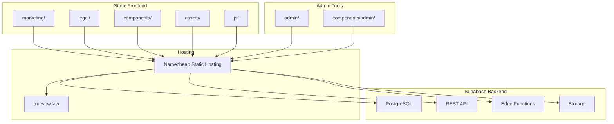
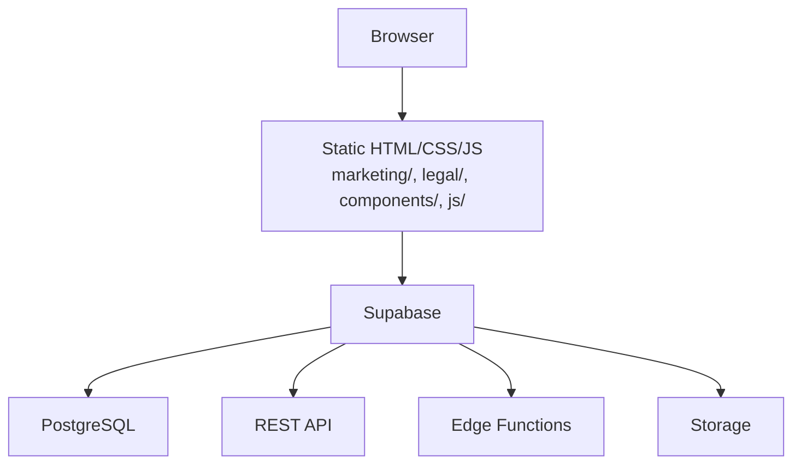
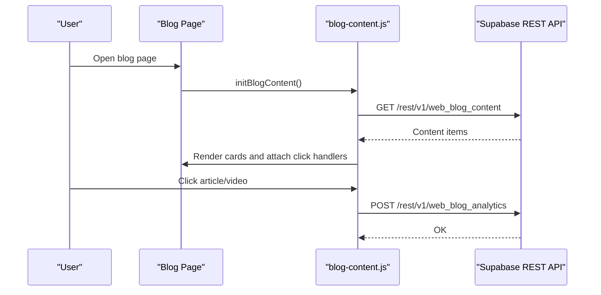
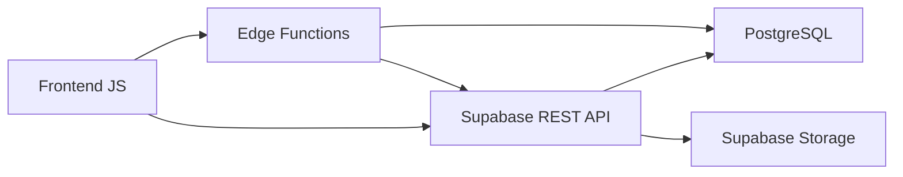
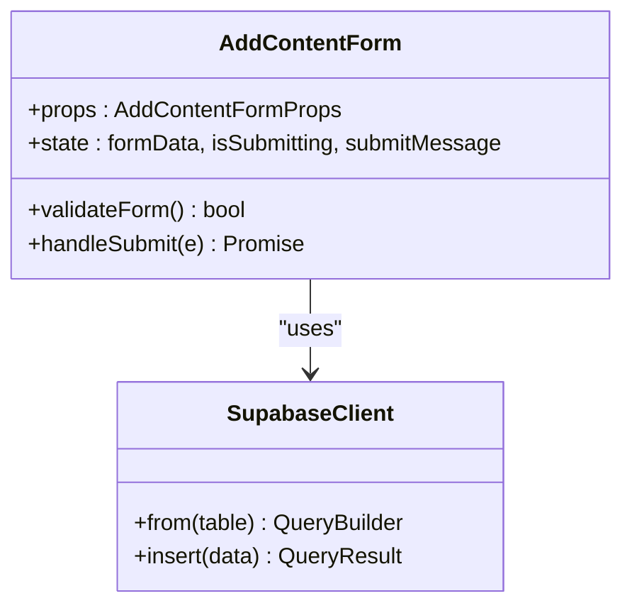
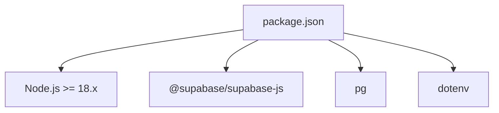

# Technology Stack

<cite>
**Referenced Files in This Document**
- [package.json](file://package.json)
- [README.md](file://README.md)
- [PRODUCTION_DEPLOY/DEPLOYMENT_GUIDE.txt](file://PRODUCTION_DEPLOY/DEPLOYMENT_GUIDE.txt)
- [js/blog-content.js](file://js/blog-content.js)
- [js/load-components.js](file://js/load-components.js)
- [marketing/js/county-cap-search.js](file://marketing/js/county-cap-search.js)
- [components/STANDARD_NAVIGATION.html](file://components/STANDARD_NAVIGATION.html)
- [components/STANDARD_FOOTER.html](file://components/STANDARD_FOOTER.html)
- [components/admin/AddContentForm.tsx](file://components/admin/AddContentForm.tsx)
- [marketing/index.html](file://marketing/index.html)
- [admin/blog-manager.html](file://admin/blog-manager.html)
</cite>

## Table of Contents
1. [Introduction](#introduction)
2. [Project Structure](#project-structure)
3. [Core Components](#core-components)
4. [Architecture Overview](#architecture-overview)
5. [Detailed Component Analysis](#detailed-component-analysis)
6. [Dependency Analysis](#dependency-analysis)
7. [Performance Considerations](#performance-considerations)
8. [Troubleshooting Guide](#troubleshooting-guide)
9. [Conclusion](#conclusion)

## Introduction
This document describes the TrueVow Website technology stack. The site is a static HTML application that integrates with Supabase for backend functionality. It uses no build process for the frontend, relies on vanilla HTML/CSS/JavaScript for dynamic behavior, and leverages Supabase’s PostgreSQL database, REST API, and Edge Functions. The backend is hosted on Namecheap static hosting with the domain truevow.law. Administrative capabilities include a React-based content management component and a lightweight HTML form for blog content management.

## Project Structure
The repository is organized into:
- Static front-end: marketing/, legal/, components/, assets/, js/
- Admin tooling: admin/, components/admin/
- Supabase schema and scripts: supabase/, scripts/
- Production deployment package: PRODUCTION_DEPLOY/

**Diagram sources**
- [README.md](file://README.md#L46-L120)
- [PRODUCTION_DEPLOY/DEPLOYMENT_GUIDE.txt](file://PRODUCTION_DEPLOY/DEPLOYMENT_GUIDE.txt#L19-L58)

**Section sources**
- [README.md](file://README.md#L46-L120)
- [PRODUCTION_DEPLOY/DEPLOYMENT_GUIDE.txt](file://PRODUCTION_DEPLOY/DEPLOYMENT_GUIDE.txt#L19-L58)

## Core Components
- Static HTML pages (marketing/, legal/) with embedded or linked CSS/JS
- Reusable HTML components (navigation, footer) loaded via a lightweight loader
- Dynamic functionality powered by vanilla JavaScript modules
- Supabase integration for blog content, forms, analytics, and availability data
- Admin React component for content management
- Production deployment package optimized for Namecheap static hosting

**Section sources**
- [README.md](file://README.md#L124-L163)
- [js/load-components.js](file://js/load-components.js#L1-L58)
- [js/blog-content.js](file://js/blog-content.js#L1-L64)
- [components/admin/AddContentForm.tsx](file://components/admin/AddContentForm.tsx#L1-L357)

## Architecture Overview
The system architecture is a static HTML site served from Namecheap, communicating with Supabase for dynamic content and form submissions. The static pages embed Supabase configuration and use JavaScript to fetch data and submit forms. Edge Functions can optionally replace direct REST API usage for enhanced security and logic.

**Diagram sources**
- [README.md](file://README.md#L166-L181)
- [README.md](file://README.md#L208-L332)

**Section sources**
- [README.md](file://README.md#L28-L34)
- [README.md](file://README.md#L166-L181)

## Detailed Component Analysis

### Static HTML Architecture
- Pages are pure HTML with embedded CSS and JavaScript for interactivity.
- Navigation and footer are standardized via reusable HTML components.
- A component loader fetches and injects these components at runtime.

Implementation highlights:
- Component injection via fetch and innerHTML
- Inline styles for branding consistency
- Minimal JavaScript for dynamic behavior

**Section sources**
- [README.md](file://README.md#L30-L33)
- [js/load-components.js](file://js/load-components.js#L14-L31)
- [components/STANDARD_NAVIGATION.html](file://components/STANDARD_NAVIGATION.html#L1-L25)
- [components/STANDARD_FOOTER.html](file://components/STANDARD_FOOTER.html#L1-L61)

### JavaScript Modules for Dynamic Functionality
- Blog content engine: fetches, renders, filters, and tracks analytics for blog content
- Component loader: injects navigation/footer into pages
- County cap search: fetches availability data and renders practice area details

**Diagram sources**
- [js/blog-content.js](file://js/blog-content.js#L26-L64)
- [js/blog-content.js](file://js/blog-content.js#L72-L102)

**Section sources**
- [js/blog-content.js](file://js/blog-content.js#L1-L424)
- [marketing/js/county-cap-search.js](file://marketing/js/county-cap-search.js#L1-L520)

### Supabase Backend Integration
- PostgreSQL database tables for content, forms, analytics, and availability
- REST API endpoints for direct reads/writes
- Edge Functions for secure, serverless logic (recommended for forms)
- Storage for assets (when used)

**Diagram sources**
- [README.md](file://README.md#L166-L181)
- [README.md](file://README.md#L208-L332)

**Section sources**
- [README.md](file://README.md#L166-L206)
- [README.md](file://README.md#L208-L332)

### TypeScript React Admin Component
- AddContentForm.tsx provides a React-based form to add blog content
- Integrates with Supabase client to insert rows into web_blog_content
- Includes validation, UTM parameter handling, and success/error messaging

**Diagram sources**
- [components/admin/AddContentForm.tsx](file://components/admin/AddContentForm.tsx#L16-L141)

**Section sources**
- [components/admin/AddContentForm.tsx](file://components/admin/AddContentForm.tsx#L1-L357)

### HTML Admin Tool (Non-React)
- blog-manager.html is a self-contained HTML form for adding blog content
- Embeds Supabase configuration and performs REST API inserts
- Provides character counting, URL validation, and success feedback

**Section sources**
- [admin/blog-manager.html](file://admin/blog-manager.html#L1-L200)

### Deployment Architecture (Namecheap Static Hosting)
- Production package uploaded to Namecheap’s public_html
- Home page configured either by moving index.html to root or via redirect
- SSL managed via Namecheap AutoSSL

**Section sources**
- [PRODUCTION_DEPLOY/DEPLOYMENT_GUIDE.txt](file://PRODUCTION_DEPLOY/DEPLOYMENT_GUIDE.txt#L60-L110)
- [PRODUCTION_DEPLOY/DEPLOYMENT_GUIDE.txt](file://PRODUCTION_DEPLOY/DEPLOYMENT_GUIDE.txt#L103-L109)

## Dependency Analysis
- Frontend dependencies: minimal; relies on vanilla JavaScript and HTML components
- Supabase client dependency for React admin component
- Node.js scripts for database operations and migrations (development only)

**Diagram sources**
- [package.json](file://package.json#L24-L32)

**Section sources**
- [package.json](file://package.json#L1-L35)

## Performance Considerations
- Static hosting reduces server overhead and improves global latency
- Client-side component loading avoids server round trips for navigation/footer
- Edge Functions can centralize form logic and reduce client-side complexity
- Minimizing DOM updates and using efficient selectors improves rendering performance
- Caching strategies for frequently accessed data (e.g., availability) can reduce API calls

## Troubleshooting Guide
Common issues and resolutions:
- Blog content not loading: verify Supabase URL/anon key, table rows with published status, and Row Level Security policies
- Forms failing: confirm Edge Function URLs, CORS configuration, and Supabase API enablement
- Component injection failures: check file paths and console errors for fetch failures
- Deployment problems: ensure correct upload paths, file permissions, and SSL certificate activation

**Section sources**
- [README.md](file://README.md#L502-L547)
- [PRODUCTION_DEPLOY/DEPLOYMENT_GUIDE.txt](file://PRODUCTION_DEPLOY/DEPLOYMENT_GUIDE.txt#L179-L196)

## Conclusion
The TrueVow Website employs a pragmatic, low-maintenance architecture: static HTML front-end with Supabase backend services. This design balances simplicity, cost-effectiveness, and scalability. The React admin component augments the static experience with a modern, type-safe content management interface, while vanilla JavaScript modules power dynamic features like the blog feed and county availability search. Deployment to Namecheap static hosting completes the solution, enabling rapid iteration and reliable delivery.