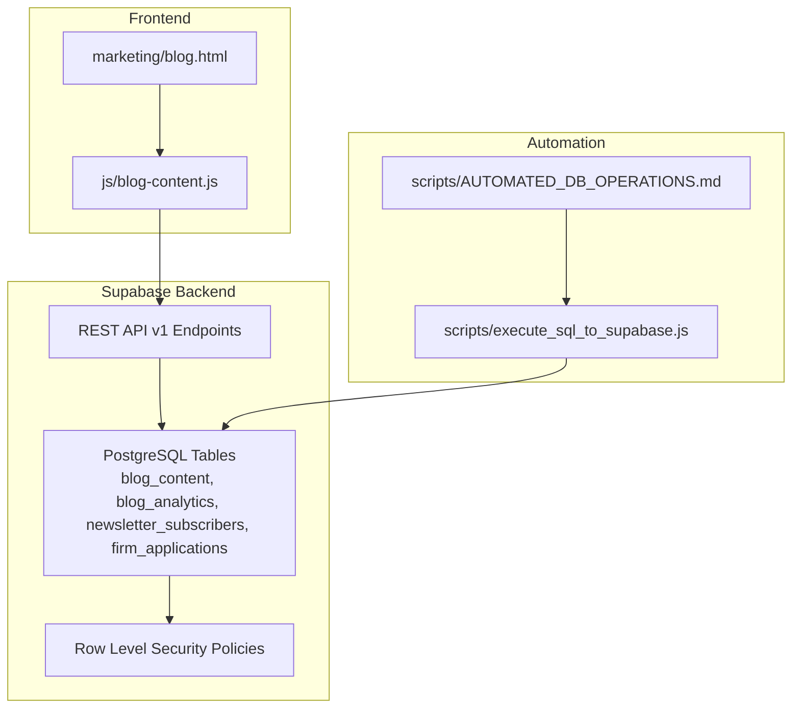
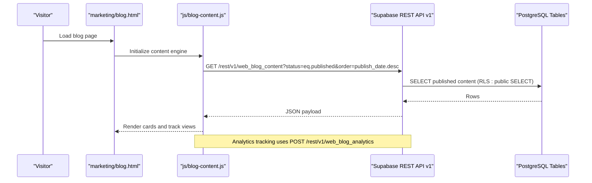
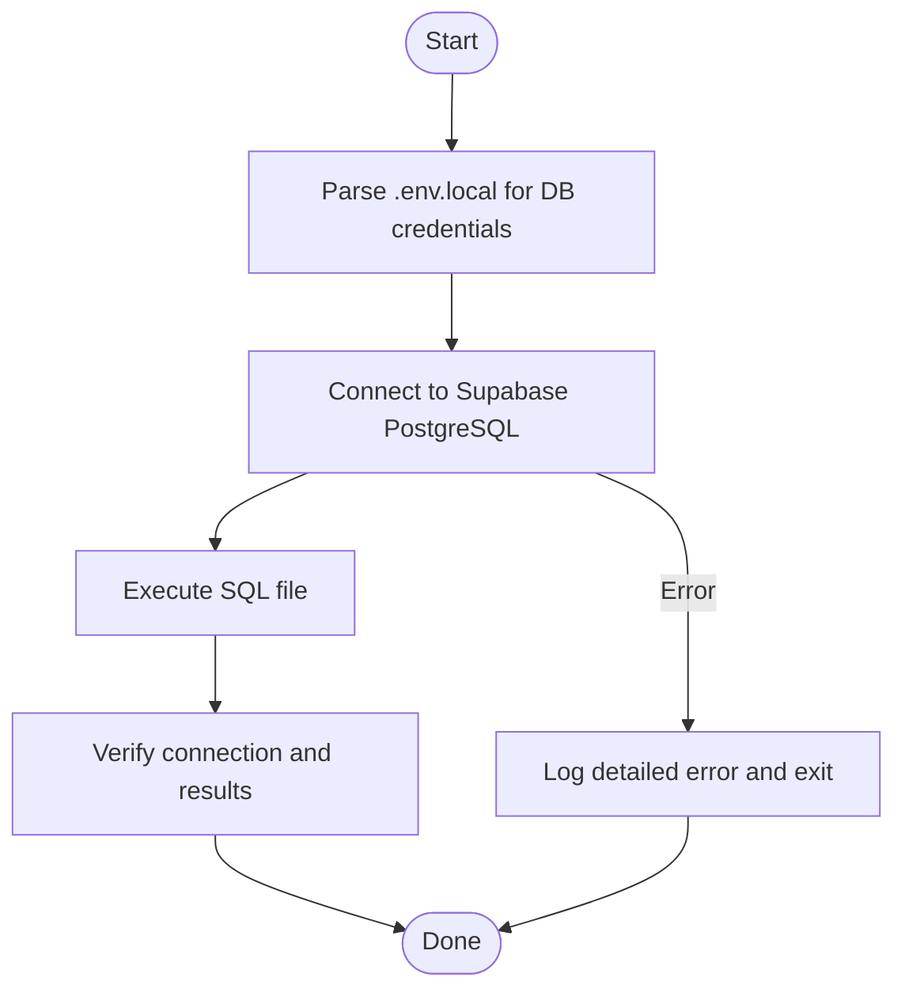
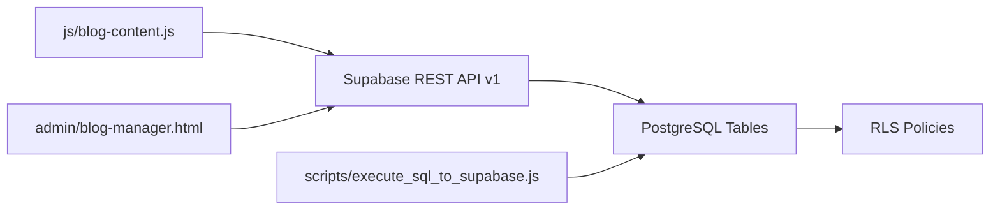

# API Endpoints and Integration

<cite>
**Referenced Files in This Document**
- [blog-content.js](file://js/blog-content.js)
- [blog.html](file://marketing/blog.html)
- [DATABASE_SCHEMA_README.md](file://supabase/DATABASE_SCHEMA_README.md)
- [rls-policies.sql](file://supabase/rls-policies.sql)
- [script-1-blog-content-policy.sql](file://supabase/script-1-blog-content-policy.sql)
- [TEST_CURL_COMMAND.md](file://supabase/TEST_CURL_COMMAND.md)
- [execute_sql_to_supabase.js](file://scripts/execute_sql_to_supabase.js)
- [AUTOMATED_DB_OPERATIONS.md](file://scripts/AUTOMATED_DB_OPERATIONS.md)
- [package.json](file://package.json)
- [blog-manager.html](file://admin/blog-manager.html)
</cite>

## Table of Contents
1. [Introduction](#introduction)
2. [Project Structure](#project-structure)
3. [Core Components](#core-components)
4. [Architecture Overview](#architecture-overview)
5. [Detailed Component Analysis](#detailed-component-analysis)
6. [Dependency Analysis](#dependency-analysis)
7. [Performance Considerations](#performance-considerations)
8. [Troubleshooting Guide](#troubleshooting-guide)
9. [Conclusion](#conclusion)
10. [Appendices](#appendices)

## Introduction
This document explains the Supabase-powered APIs and integrations used by the TrueVow marketing website. It covers:
- REST API usage for blog content retrieval, analytics tracking, newsletter subscriptions, and firm applications
- JavaScript integration using the @supabase/supabase-js client library
- Authentication mechanisms, Row Level Security (RLS) policies, and CORS configuration
- Edge Functions deployment process and API endpoint specifications
- Practical examples of API calls, error handling strategies, and response formats
- Automated migration system and database initialization procedures
- Troubleshooting guides for common API integration issues and performance optimization techniques

## Project Structure
The integration spans frontend JavaScript, backend Supabase tables and policies, and automated database scripts.

**Diagram sources**
- [blog.html](file://marketing/blog.html#L436-L440)
- [blog-content.js](file://js/blog-content.js#L26-L64)
- [DATABASE_SCHEMA_README.md](file://supabase/DATABASE_SCHEMA_README.md#L23-L187)
- [execute_sql_to_supabase.js](file://scripts/execute_sql_to_supabase.js#L1-L172)
- [AUTOMATED_DB_OPERATIONS.md](file://scripts/AUTOMATED_DB_OPERATIONS.md#L1-L83)

**Section sources**
- [blog.html](file://marketing/blog.html#L436-L440)
- [blog-content.js](file://js/blog-content.js#L1-L100)
- [DATABASE_SCHEMA_README.md](file://supabase/DATABASE_SCHEMA_README.md#L1-L100)
- [execute_sql_to_supabase.js](file://scripts/execute_sql_to_supabase.js#L1-L60)
- [AUTOMATED_DB_OPERATIONS.md](file://scripts/AUTOMATED_DB_OPERATIONS.md#L1-L40)

## Core Components
- Frontend blog hub: Dynamically loads content from Supabase REST API and tracks analytics
- Supabase tables: blog_content, blog_analytics, newsletter_subscribers, firm_applications
- RLS policies: Control who can read/write each table
- Automated migration and maintenance scripts: Execute SQL against Supabase via PostgreSQL connection
- Admin content manager: Adds and edits content entries

**Section sources**
- [blog-content.js](file://js/blog-content.js#L26-L102)
- [DATABASE_SCHEMA_README.md](file://supabase/DATABASE_SCHEMA_README.md#L23-L187)
- [rls-policies.sql](file://supabase/rls-policies.sql#L8-L95)
- [execute_sql_to_supabase.js](file://scripts/execute_sql_to_supabase.js#L1-L172)
- [blog-manager.html](file://admin/blog-manager.html#L1-L120)

## Architecture Overview
The frontend interacts with Supabase REST API v1 endpoints using an anonymous API key. RLS policies enforce access control. Admin operations are performed via the admin interface and automated scripts.

**Diagram sources**
- [blog.html](file://marketing/blog.html#L436-L440)
- [blog-content.js](file://js/blog-content.js#L26-L102)
- [DATABASE_SCHEMA_README.md](file://supabase/DATABASE_SCHEMA_README.md#L23-L135)

## Detailed Component Analysis

### REST API Endpoints

- Base URL: Supabase project URL
- API Key Header: apikey
- Authorization Header: Authorization: Bearer <apikey>
- Content-Type: application/json
- Prefer: return=minimal or return=representation

Endpoints used by the frontend and scripts:

- GET /rest/v1/web_blog_content
  - Purpose: Fetch published blog content
  - Filters: status=eq.published, order=publish_date.desc, optional type=eq.<value>, is_featured=eq.<bool>, limit=<n>
  - Select: id,title,teaser,canonical_url,publish_date,thumbnail_url,type,platform_name,read_time_minutes,watch_time_minutes,is_featured,view_count,click_count
  - RLS: public SELECT allowed for status='published'
  - Response: Array of content items

- POST /rest/v1/web_blog_analytics
  - Purpose: Insert analytics events (view, click, share)
  - Body fields: content_id, event_type, ip_addr, user_agent, referrer, utm_source, utm_medium, utm_campaign, created_at
  - RLS: public INSERT allowed
  - Response: Minimal (no body) on success

- POST /rest/v1/firm_applications
  - Purpose: Submit firm application form
  - Body fields: firm_name, contact_name, email, phone, state, practice_areas[], current_intake_method, monthly_case_volume, bar_member, bar_state, bar_number, demo_requested, demo_session_id, status, notes
  - RLS: public INSERT allowed
  - Response: Full row (return=representation)

- POST /rest/v1/newsletter_subscribers (conceptual)
  - Purpose: Subscribe to newsletter
  - Body fields: email, ip_addr, user_agent, source
  - RLS: public INSERT allowed
  - Response: Minimal (placeholder in current schema)

Notes:
- The frontend currently uses web_blog_content and web_blog_analytics. Newsletter and firm application endpoints are documented in schema and tests.
- RLS policies restrict reads/writes to authenticated users for admin operations; public access is granted for read/insert where appropriate.

**Section sources**
- [blog-content.js](file://js/blog-content.js#L26-L102)
- [DATABASE_SCHEMA_README.md](file://supabase/DATABASE_SCHEMA_README.md#L23-L187)
- [TEST_CURL_COMMAND.md](file://supabase/TEST_CURL_COMMAND.md#L1-L30)

### JavaScript Integration (@supabase/supabase-js)
- The project includes @supabase/supabase-js in dependencies.
- The frontend blog hub uses native fetch to call REST endpoints directly with apikey and Authorization headers.
- For server-side or SSR scenarios, developers can leverage @supabase/supabase-js with service_role or anon keys depending on use case.

Recommendations:
- Use @supabase/supabase-js for server-side operations to benefit from SDK features and built-in RLS handling.
- For client-side public reads, continue using REST with apikey header as implemented.

**Section sources**
- [package.json](file://package.json#L24-L28)
- [blog-content.js](file://js/blog-content.js#L11-L52)

### Authentication Mechanisms
- Anonymous API key: Used for public reads and writes in the frontend
- Headers:
  - apikey: <anon-key>
  - Authorization: Bearer <anon-key>
- Service role key: Used by serverless functions and scripts for admin operations
- RLS: Enforces row-level access control; public users can only perform permitted actions

Security best practices:
- Never expose service_role keys in client-side code
- Rotate keys regularly and store in environment variables
- Use HTTPS and secure cookies for session-based auth if adopted later

**Section sources**
- [blog-content.js](file://js/blog-content.js#L44-L51)
- [rls-policies.sql](file://supabase/rls-policies.sql#L8-L95)
- [DATABASE_SCHEMA_README.md](file://supabase/DATABASE_SCHEMA_README.md#L431-L451)

### Row Level Security (RLS) Policies
- blog_content
  - Public SELECT allowed for status='published'
  - INSERT/UPDATE/DELETE restricted to authenticated users
- blog_analytics
  - Public INSERT allowed for analytics tracking
  - SELECT restricted to authenticated users
- newsletter_subscribers
  - Public INSERT allowed for subscriptions
  - SELECT restricted to authenticated users
- firm_applications
  - Public INSERT allowed for form submissions
  - SELECT/UPDATE restricted to authenticated users

Verification:
- Policies can be verified via SQL queries and Supabase dashboard.

**Section sources**
- [rls-policies.sql](file://supabase/rls-policies.sql#L8-L95)
- [script-1-blog-content-policy.sql](file://supabase/script-1-blog-content-policy.sql#L8-L29)
- [DATABASE_SCHEMA_README.md](file://supabase/DATABASE_SCHEMA_README.md#L431-L451)

### CORS Configuration
- Supabase automatically configures CORS for REST endpoints
- Ensure Origin and Referer match configured allowed origins in Supabase project settings
- When testing locally, configure localhost domains in Supabase CORS settings

**Section sources**
- [blog-content.js](file://js/blog-content.js#L44-L51)

### Edge Functions Deployment
- Not present in the current repository snapshot
- Typical workflow:
  - Create a new Edge Function project
  - Deploy using Supabase CLI or dashboard
  - Expose HTTP endpoints mapped to internal logic
  - Secure with service_role keys and RLS
- For REST parity, mirror the headers and response patterns used by the frontend

[No sources needed since this section describes a general process not tied to specific files]

### Automated Migration System and Database Initialization
- Automated SQL execution:
  - scripts/execute_sql_to_supabase.js connects to Supabase via PostgreSQL using credentials from .env.local
  - Supports URL-encoded and plain passwords, with automatic fallback
  - Provides detailed error messages and verification
- Available scripts:
  - npm run db:execute supabase/<filename>.sql
  - npm run db:populate
  - npm run db:validate, db:calculate-all-states, etc.
- Database schema and RLS are documented in supabase/DATABASE_SCHEMA_README.md

**Diagram sources**
- [execute_sql_to_supabase.js](file://scripts/execute_sql_to_supabase.js#L11-L155)
- [AUTOMATED_DB_OPERATIONS.md](file://scripts/AUTOMATED_DB_OPERATIONS.md#L16-L83)

**Section sources**
- [execute_sql_to_supabase.js](file://scripts/execute_sql_to_supabase.js#L1-L172)
- [AUTOMATED_DB_OPERATIONS.md](file://scripts/AUTOMATED_DB_OPERATIONS.md#L1-L83)
- [DATABASE_SCHEMA_README.md](file://supabase/DATABASE_SCHEMA_README.md#L1-L100)

### Practical Examples and Error Handling

- Fetch published blog content
  - Endpoint: GET /rest/v1/web_blog_content
  - Headers: apikey, Authorization, Content-Type, Prefer: return=representation
  - Filters: status=eq.published, type=eq.article|video, is_featured=eq.true|false, limit=<n>
  - Response: Array of content items

- Track content analytics
  - Endpoint: POST /rest/v1/web_blog_analytics
  - Headers: apikey, Authorization, Content-Type, Prefer: return=minimal
  - Body: content_id, event_type, ip_addr, user_agent, referrer, utm_source, utm_medium, utm_campaign, created_at
  - Response: No content on success

- Submit firm application
  - Endpoint: POST /rest/v1/firm_applications
  - Headers: apikey, Authorization, Content-Type, Prefer: return=representation
  - Body: firm_name, contact_name, email, phone, state, practice_areas[], current_intake_method, monthly_case_volume, bar_member, bar_state, bar_number, demo_requested, demo_session_id, status, notes
  - Response: Full row on success

- Error handling strategies
  - Frontend: Catch fetch errors, log, and display user-friendly messages
  - Analytics: Silent failure to avoid breaking UX
  - Database scripts: Detailed error logging with line numbers and suggestions

**Section sources**
- [blog-content.js](file://js/blog-content.js#L26-L102)
- [TEST_CURL_COMMAND.md](file://supabase/TEST_CURL_COMMAND.md#L1-L30)
- [DATABASE_SCHEMA_README.md](file://supabase/DATABASE_SCHEMA_README.md#L191-L255)

### Admin Content Management
- Admin interface: admin/blog-manager.html
  - Requires admin password to unlock
  - Allows adding, editing, and deleting content entries
  - Integrates with Supabase RLS-restricted tables

**Section sources**
- [blog-manager.html](file://admin/blog-manager.html#L1-L120)

## Dependency Analysis
- Frontend depends on:
  - Supabase REST API v1
  - RLS policies for access control
- Backend depends on:
  - PostgreSQL tables and views
  - Automated scripts for migrations and data population
- Tooling depends on:
  - Node.js and Postgres client for SQL execution
  - Environment variables for credentials

**Diagram sources**
- [blog-content.js](file://js/blog-content.js#L26-L102)
- [DATABASE_SCHEMA_README.md](file://supabase/DATABASE_SCHEMA_README.md#L23-L187)
- [execute_sql_to_supabase.js](file://scripts/execute_sql_to_supabase.js#L1-L172)
- [blog-manager.html](file://admin/blog-manager.html#L1-L120)

**Section sources**
- [blog-content.js](file://js/blog-content.js#L1-L100)
- [DATABASE_SCHEMA_README.md](file://supabase/DATABASE_SCHEMA_README.md#L1-L100)
- [execute_sql_to_supabase.js](file://scripts/execute_sql_to_supabase.js#L1-L60)
- [blog-manager.html](file://admin/blog-manager.html#L1-L120)

## Performance Considerations
- Use selective column selection (select) to reduce payload size
- Apply filters early (status, type, date ranges) to minimize result sets
- Leverage indexes on frequently queried columns (status, publish_date, platform_name, created_at)
- Batch analytics inserts when possible to reduce network overhead
- Cache static assets and use CDN for thumbnails and media
- Monitor query performance via Supabase dashboard and optimize slow queries

[No sources needed since this section provides general guidance]

## Troubleshooting Guide

Common issues and resolutions:
- 401 Unauthorized or 42501 Row Level Security violations
  - Cause: Missing or invalid apikey/Authorization headers
  - Resolution: Verify headers and keys; confirm RLS policy allows the operation
  - Reference: [TEST_CURL_COMMAND.md](file://supabase/TEST_CURL_COMMAND.md#L21-L24)

- Connection failures to Supabase PostgreSQL
  - Cause: Incorrect credentials or URL encoding
  - Resolution: Check .env.local; script supports both encoded and plain passwords
  - Reference: [execute_sql_to_supabase.js](file://scripts/execute_sql_to_supabase.js#L36-L154)

- CORS errors
  - Cause: Origin or Referer not allowed
  - Resolution: Configure allowed origins in Supabase project settings
  - Reference: [blog-content.js](file://js/blog-content.js#L44-L51)

- Analytics tracking not recorded
  - Cause: Network errors or RLS restrictions
  - Resolution: Ensure endpoint availability and headers; analytics silently fail to avoid UX impact
  - Reference: [blog-content.js](file://js/blog-content.js#L72-L102)

- Admin interface not loading content
  - Cause: RLS or missing admin password
  - Resolution: Unlock admin with correct password; verify table permissions
  - Reference: [blog-manager.html](file://admin/blog-manager.html#L1-L120)

**Section sources**
- [TEST_CURL_COMMAND.md](file://supabase/TEST_CURL_COMMAND.md#L1-L30)
- [execute_sql_to_supabase.js](file://scripts/execute_sql_to_supabase.js#L36-L154)
- [blog-content.js](file://js/blog-content.js#L44-L102)
- [blog-manager.html](file://admin/blog-manager.html#L1-L120)

## Conclusion
The TrueVow website integrates Supabase through straightforward REST API calls for blog content, analytics, and form submissions, protected by robust RLS policies. Automated scripts streamline database operations, while the admin interface enables content management. Following the documented patterns ensures secure, maintainable, and scalable integrations.

[No sources needed since this section summarizes without analyzing specific files]

## Appendices

### API Definitions Summary
- GET /rest/v1/web_blog_content
  - Headers: apikey, Authorization, Content-Type, Prefer: return=representation
  - Filters: status, type, is_featured, limit
  - Response: Array of content items

- POST /rest/v1/web_blog_analytics
  - Headers: apikey, Authorization, Content-Type, Prefer: return=minimal
  - Body: content_id, event_type, ip_addr, user_agent, referrer, utm_source, utm_medium, utm_campaign, created_at
  - Response: Empty on success

- POST /rest/v1/firm_applications
  - Headers: apikey, Authorization, Content-Type, Prefer: return=representation
  - Body: firm_name, contact_name, email, phone, state, practice_areas[], current_intake_method, monthly_case_volume, bar_member, bar_state, bar_number, demo_requested, demo_session_id, status, notes
  - Response: Full row on success

**Section sources**
- [blog-content.js](file://js/blog-content.js#L26-L102)
- [DATABASE_SCHEMA_README.md](file://supabase/DATABASE_SCHEMA_README.md#L23-L187)
- [TEST_CURL_COMMAND.md](file://supabase/TEST_CURL_COMMAND.md#L1-L30)