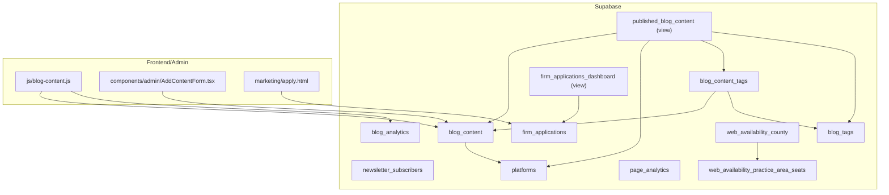
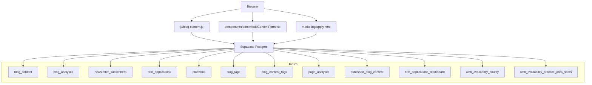
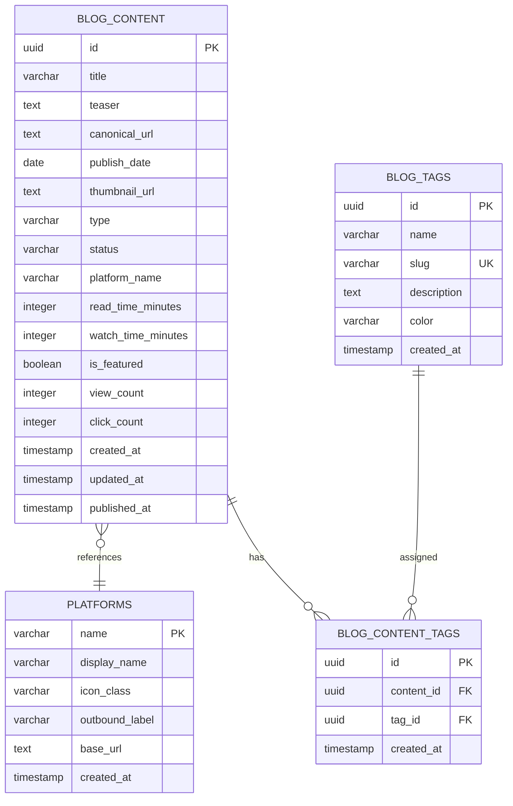
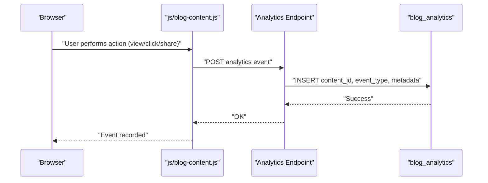
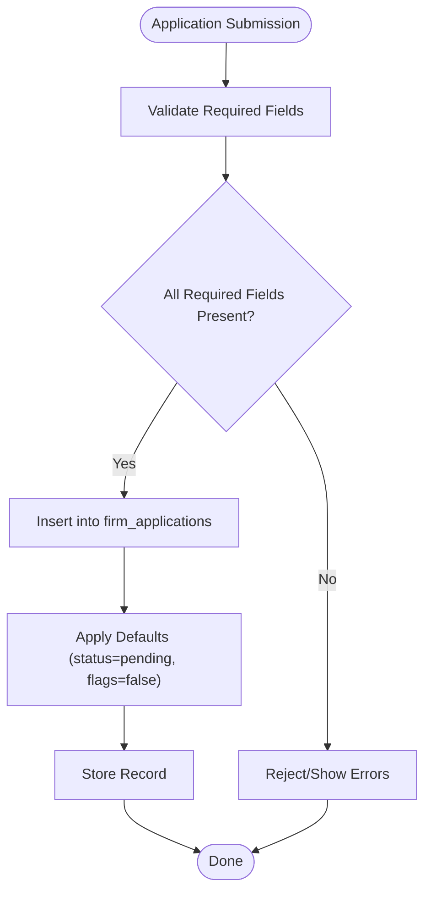
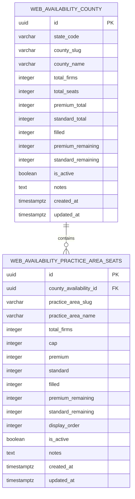
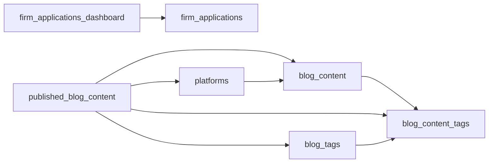

# Data Models and Relationships

<cite>
**Referenced Files in This Document**
- [DATABASE_SCHEMA_README.md](file://supabase/DATABASE_SCHEMA_README.md)
- [rls-policies.sql](file://supabase/rls-policies.sql)
- [script-1-blog-content-policy.sql](file://supabase/script-1-blog-content-policy.sql)
- [script-2-analytics-policy.sql](file://supabase/script-2-analytics-policy.sql)
- [CREATE_COUNTY_AVAILABILITY_TABLES.sql](file://supabase/CREATE_COUNTY_AVAILABILITY_TABLES.sql)
- [POPULATE_DATA_INSTRUCTIONS.md](file://supabase/POPULATE_DATA_INSTRUCTIONS.md)
- [ADD_ALL_REQUIRED_CONSTRAINTS.sql](file://supabase/ADD_ALL_REQUIRED_CONSTRAINTS.sql)
- [CHECK_ACTUAL_SCHEMA.sql](file://supabase/CHECK_ACTUAL_SCHEMA.sql)
- [FIX_ALL_COUNTIES_NOW.sql](file://supabase/FIX_ALL_COUNTIES_NOW.sql)
- [001_phase1_website_schema.sql](file://supabase/migrations/001_phase1_website_schema.sql)
- [002_phase1_tenant_app_schema.sql](file://supabase/migrations/002_phase1_tenant_app_schema.sql)
- [003_saas_admin_schema.sql](file://supabase/migrations/003_saas_admin_schema.sql)
- [AUTOMATED_MIGRATION_SCRIPT.sql](file://supabase/AUTOMATED_MIGRATION_SCRIPT.sql)
- [blog-content.js](file://js/blog-content.js)
- [AddContentForm.tsx](file://components/admin/AddContentForm.tsx)
- [apply.html](file://marketing/apply.html)
</cite>

## Table of Contents
1. [Introduction](#introduction)
2. [Project Structure](#project-structure)
3. [Core Components](#core-components)
4. [Architecture Overview](#architecture-overview)
5. [Detailed Component Analysis](#detailed-component-analysis)
6. [Dependency Analysis](#dependency-dependencies)
7. [Performance Considerations](#performance-considerations)
8. [Troubleshooting Guide](#troubleshooting-guide)
9. [Conclusion](#conclusion)
10. [Appendices](#appendices)

## Introduction
This document describes the data models and relationships powering the TrueVow marketing website and related systems. It focuses on:
- Core data entities: blog content items, analytics events, subscriber records, and firm applications
- Many-to-many relationships between content and tags
- Lookup relationships with platforms
- Data flow patterns, referential integrity constraints, and business logic enforcement
- Zero-knowledge architecture data handling principles and privacy considerations
- Data validation rules, business constraints, and data lifecycle management
- Examples of complex queries, aggregations, and reporting capabilities
- Data seeding process and initial dataset requirements

## Project Structure
The data model is primarily defined in Supabase SQL scripts and documentation. The repository organizes schema-related artifacts under the supabase directory, with additional frontend and admin components that interact with the database.

**Diagram sources**
- [DATABASE_SCHEMA_README.md](file://supabase/DATABASE_SCHEMA_README.md#L21-L429)
- [CREATE_COUNTY_AVAILABILITY_TABLES.sql](file://supabase/CREATE_COUNTY_AVAILABILITY_TABLES.sql#L12-L88)
- [blog-content.js](file://js/blog-content.js)
- [AddContentForm.tsx](file://components/admin/AddContentForm.tsx)
- [apply.html](file://marketing/apply.html)

**Section sources**
- [DATABASE_SCHEMA_README.md](file://supabase/DATABASE_SCHEMA_README.md#L10-L563)
- [001_phase1_website_schema.sql](file://supabase/migrations/001_phase1_website_schema.sql#L1-L31)
- [002_phase1_tenant_app_schema.sql](file://supabase/migrations/002_phase1_tenant_app_schema.sql#L1-L26)
- [003_saas_admin_schema.sql](file://supabase/migrations/003_saas_admin_schema.sql#L1-L26)

## Core Components
This section documents the primary tables and their roles, constraints, and relationships.

- blog_content
  - Purpose: Stores blog articles and videos for the blog hub.
  - Key attributes: identifiers, titles, teasers, canonical URLs, publication dates, thumbnails, content type, status, platform reference, metrics (read/watch times, featured flags, view/click counts), timestamps.
  - Indexes: primary key, status, publish_date, type, platform_name.
  - RLS: Public SELECT allowed for published content; INSERT/UPDATE/DELETE restricted to authenticated users.
  - Example usage: Fetch published content ordered by publish_date; used by frontend and admin components.

- blog_analytics
  - Purpose: Tracks views, clicks, and shares for blog content.
  - Key attributes: content_id, event_type, visitor metadata (IP, user agent, referrer), UTM parameters, timestamps.
  - Indexes: primary key, foreign key to blog_content, event_type, created_at.
  - RLS: Public INSERT allowed; SELECT restricted to authenticated users.
  - Example usage: Track a click event; aggregate analytics by event type.

- newsletter_subscribers
  - Purpose: Stores newsletter subscription emails.
  - Key attributes: email (unique), IP, user agent, source, timestamps, unsubscribe timestamps, active flag.
  - Indexes: primary key, unique email, is_active.
  - RLS: Public INSERT allowed; SELECT restricted to authenticated users.
  - Example usage: Subscribe with upsert behavior; fetch active subscribers.

- firm_applications
  - Purpose: Stores law firm application form submissions.
  - Key attributes: firm and contact info, jurisdiction, practice areas (array), intake method, volume estimates, bar membership details, demo linkage, status, internal notes, timestamps.
  - Indexes: primary key, email, status, created_at.
  - RLS: Public INSERT allowed; SELECT/UPDATE restricted to authenticated users.
  - Validation: Required fields enforced via NOT NULL constraints derived from the form.
  - Example usage: Submit application; filter pending applications.

- platforms
  - Purpose: Reference table for content platforms (LinkedIn, YouTube).
  - Key attributes: name (PK), display_name, icon class, outbound label, base URL, timestamps.
  - Example usage: Join with blog_content to enrich display metadata.

- blog_tags and blog_content_tags
  - Purpose: Tagging system for categorizing content.
  - blog_tags: id, name, slug (unique), description, color, created_at.
  - blog_content_tags: id, content_id (FK), tag_id (FK), created_at; unique(content_id, tag_id).
  - Example usage: Assign tags to content; aggregate tags per published content via view.

- page_analytics
  - Purpose: Tracks page views and traffic metrics.
  - Key attributes: page_path, page_title, visitor metadata, UTM parameters, session_id, viewed_at.
  - Indexes: primary key, page_path, viewed_at.
  - Example usage: Future implementation for traffic insights.

- Views
  - published_blog_content: Pre-filtered published content joined with platform and tag metadata.
  - firm_applications_dashboard: Aggregated view with status counts and recency buckets.

**Section sources**
- [DATABASE_SCHEMA_README.md](file://supabase/DATABASE_SCHEMA_README.md#L23-L429)
- [rls-policies.sql](file://supabase/rls-policies.sql#L8-L95)
- [script-1-blog-content-policy.sql](file://supabase/script-1-blog-content-policy.sql#L8-L29)
- [script-2-analytics-policy.sql](file://supabase/script-2-analytics-policy.sql#L8-L29)
- [ADD_ALL_REQUIRED_CONSTRAINTS.sql](file://supabase/ADD_ALL_REQUIRED_CONSTRAINTS.sql#L24-L34)

## Architecture Overview
The system follows a clear separation of concerns:
- Data persistence: Supabase tables and views
- Access control: Row Level Security (RLS) policies
- Frontend integration: JavaScript and React components
- Admin interface: Static admin page for content management

**Diagram sources**
- [DATABASE_SCHEMA_README.md](file://supabase/DATABASE_SCHEMA_README.md#L21-L429)
- [CREATE_COUNTY_AVAILABILITY_TABLES.sql](file://supabase/CREATE_COUNTY_AVAILABILITY_TABLES.sql#L12-L88)
- [blog-content.js](file://js/blog-content.js)
- [AddContentForm.tsx](file://components/admin/AddContentForm.tsx)
- [apply.html](file://marketing/apply.html)

## Detailed Component Analysis

### Blog Content and Tagging System
The tagging system enables flexible categorization and filtering of content.

- Many-to-many relationship: blog_content ↔ blog_tags via blog_content_tags
- Lookup relationship: blog_content.platform_name → platforms.name
- Business logic: published content is exposed to the public; tags are unique by slug; content is filtered by status and active flags in the published view.

**Diagram sources**
- [DATABASE_SCHEMA_README.md](file://supabase/DATABASE_SCHEMA_README.md#L23-L344)
- [DATABASE_SCHEMA_README.md](file://supabase/DATABASE_SCHEMA_README.md#L379-L404)

**Section sources**
- [DATABASE_SCHEMA_README.md](file://supabase/DATABASE_SCHEMA_README.md#L23-L344)
- [DATABASE_SCHEMA_README.md](file://supabase/DATABASE_SCHEMA_README.md#L379-L404)

### Analytics Data Flow
Analytics capture visitor interactions and support reporting.

- Data flow: client-side tracking → API → database insertion
- Privacy: visitor metadata (IP, user agent, referrer) is stored; consider anonymization strategies in production deployments
- Reporting: aggregate by event_type per content item; compute click-through rate

**Diagram sources**
- [DATABASE_SCHEMA_README.md](file://supabase/DATABASE_SCHEMA_README.md#L77-L135)
- [script-2-analytics-policy.sql](file://supabase/script-2-analytics-policy.sql#L8-L29)

**Section sources**
- [DATABASE_SCHEMA_README.md](file://supabase/DATABASE_SCHEMA_README.md#L77-L135)
- [script-2-analytics-policy.sql](file://supabase/script-2-analytics-policy.sql#L8-L29)

### Firm Applications and Validation
Firm applications enforce required fields and maintain status-driven workflows.

- Validation rules: NOT NULL constraints applied to key fields derived from the form
- Status lifecycle: pending → approved/rejected/onboarding
- Admin workflow: dashboard view aggregates by status and recency

**Diagram sources**
- [ADD_ALL_REQUIRED_CONSTRAINTS.sql](file://supabase/ADD_ALL_REQUIRED_CONSTRAINTS.sql#L24-L34)
- [DATABASE_SCHEMA_README.md](file://supabase/DATABASE_SCHEMA_README.md#L191-L255)
- [DATABASE_SCHEMA_README.md](file://supabase/DATABASE_SCHEMA_README.md#L407-L428)
- [apply.html](file://marketing/apply.html)

**Section sources**
- [ADD_ALL_REQUIRED_CONSTRAINTS.sql](file://supabase/ADD_ALL_REQUIRED_CONSTRAINTS.sql#L24-L34)
- [CHECK_ACTUAL_SCHEMA.sql](file://supabase/CHECK_ACTUAL_SCHEMA.sql#L6-L24)
- [DATABASE_SCHEMA_README.md](file://supabase/DATABASE_SCHEMA_README.md#L191-L255)
- [DATABASE_SCHEMA_README.md](file://supabase/DATABASE_SCHEMA_README.md#L407-L428)
- [apply.html](file://marketing/apply.html)

### Availability Data for Web (County and Practice Areas)
The web availability tables model seat allocations and remainders per county and practice area.

- Integrity: unique constraints on (state_code, county_slug) and (county_availability_id, practice_area_slug)
- RLS: Public SELECT allowed when is_active = true; authenticated users can manage
- Indexes: optimized for state, slug, activity, and ordering

**Diagram sources**
- [CREATE_COUNTY_AVAILABILITY_TABLES.sql](file://supabase/CREATE_COUNTY_AVAILABILITY_TABLES.sql#L12-L88)

**Section sources**
- [CREATE_COUNTY_AVAILABILITY_TABLES.sql](file://supabase/CREATE_COUNTY_AVAILABILITY_TABLES.sql#L12-L178)

## Dependency Analysis
This section maps dependencies among tables and views, highlighting referential integrity and join patterns.

- Referential integrity: blog_content.platform_name → platforms.name; blog_content_tags links content to tags
- Views encapsulate joins and aggregations for efficient querying
- No circular dependencies observed among core tables

**Diagram sources**
- [DATABASE_SCHEMA_README.md](file://supabase/DATABASE_SCHEMA_README.md#L258-L429)

**Section sources**
- [DATABASE_SCHEMA_README.md](file://supabase/DATABASE_SCHEMA_README.md#L258-L429)

## Performance Considerations
- Indexes: Ensure appropriate indexes exist on frequently filtered/sorted columns (status, publish_date, type, platform_name, content_id, event_type, created_at, page_path).
- Aggregations: Use materialized summaries or scheduled jobs for heavy analytics computations.
- RLS overhead: Keep policies minimal and selective; leverage indexes to reduce scan costs.
- Data growth: Partition large tables by time or usage if necessary; monitor query plans regularly.

[No sources needed since this section provides general guidance]

## Troubleshooting Guide
Common issues and remedies:
- RLS policy errors: Use diagnostic scripts to verify RLS status and correct policies.
- Missing constraints: Apply required constraints to firm_applications using the provided script.
- Schema verification: Confirm actual columns and constraints via the schema checker.
- Availability data anomalies: Use targeted fixes to correct totals and remainders.

**Section sources**
- [rls-policies.sql](file://supabase/rls-policies.sql#L83-L95)
- [ADD_ALL_REQUIRED_CONSTRAINTS.sql](file://supabase/ADD_ALL_REQUIRED_CONSTRAINTS.sql#L24-L34)
- [CHECK_ACTUAL_SCHEMA.sql](file://supabase/CHECK_ACTUAL_SCHEMA.sql#L6-L24)
- [FIX_ALL_COUNTIES_NOW.sql](file://supabase/FIX_ALL_COUNTIES_NOW.sql#L6-L108)

## Conclusion
The TrueVow data model centers on a clear set of tables supporting blog content, analytics, subscriptions, and firm applications, with robust RLS policies and tagging/lookup relationships. The views simplify common queries and reporting. The web availability tables introduce a scalable pattern for capacity and seat allocation. Adhering to validation rules, indexing strategies, and privacy-conscious data handling ensures reliable operation and future extensibility.

[No sources needed since this section summarizes without analyzing specific files]

## Appendices

### Data Seeding and Initial Dataset Requirements
- Seed initial blog content and platforms via the admin interface or SQL scripts.
- Populate availability data using the provided instructions and scripts.

**Section sources**
- [DATABASE_SCHEMA_README.md](file://supabase/DATABASE_SCHEMA_README.md#L516-L537)
- [POPULATE_DATA_INSTRUCTIONS.md](file://supabase/POPULATE_DATA_INSTRUCTIONS.md#L1-L69)

### Zero-Knowledge and Privacy Considerations
- Visitor metadata (IP, user agent, referrer) is captured in analytics; consider anonymization or retention limits.
- RLS restricts public access to sensitive data while enabling controlled admin operations.
- Review and refine policies as requirements evolve.

**Section sources**
- [DATABASE_SCHEMA_README.md](file://supabase/DATABASE_SCHEMA_README.md#L77-L135)
- [rls-policies.sql](file://supabase/rls-policies.sql#L8-L95)

### Migration and Schema Restoration Notes
- Placeholder migration files indicate missing exports; restore from Supabase dashboards.
- Use automated scripts cautiously after verifying schema and constraints.

**Section sources**
- [001_phase1_website_schema.sql](file://supabase/migrations/001_phase1_website_schema.sql#L6-L29)
- [002_phase1_tenant_app_schema.sql](file://supabase/migrations/002_phase1_tenant_app_schema.sql#L6-L25)
- [003_saas_admin_schema.sql](file://supabase/migrations/003_saas_admin_schema.sql#L6-L25)
- [AUTOMATED_MIGRATION_SCRIPT.sql](file://supabase/AUTOMATED_MIGRATION_SCRIPT.sql#L6-L15)