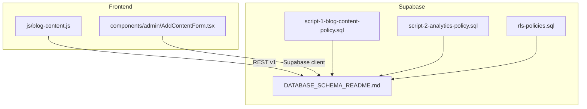
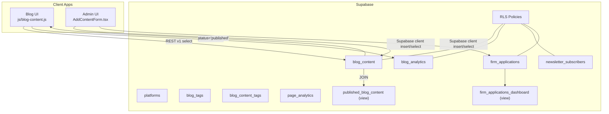
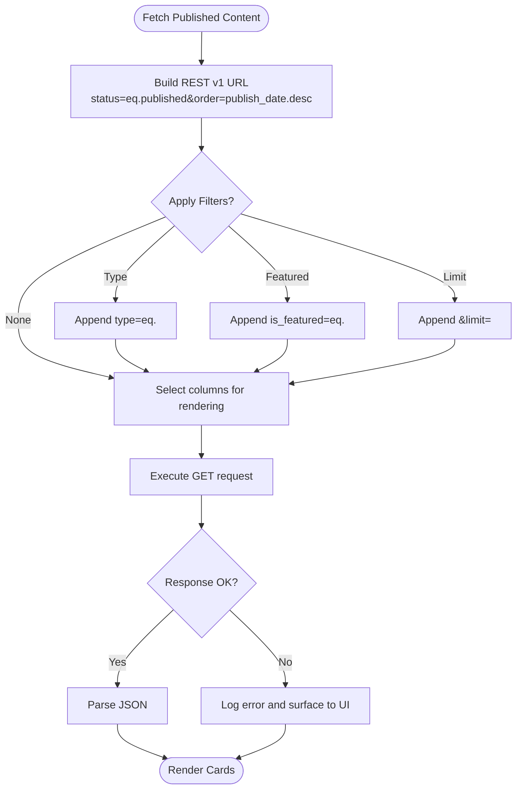
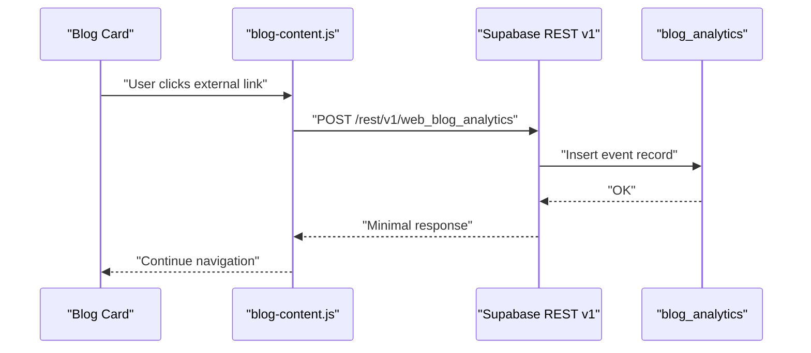
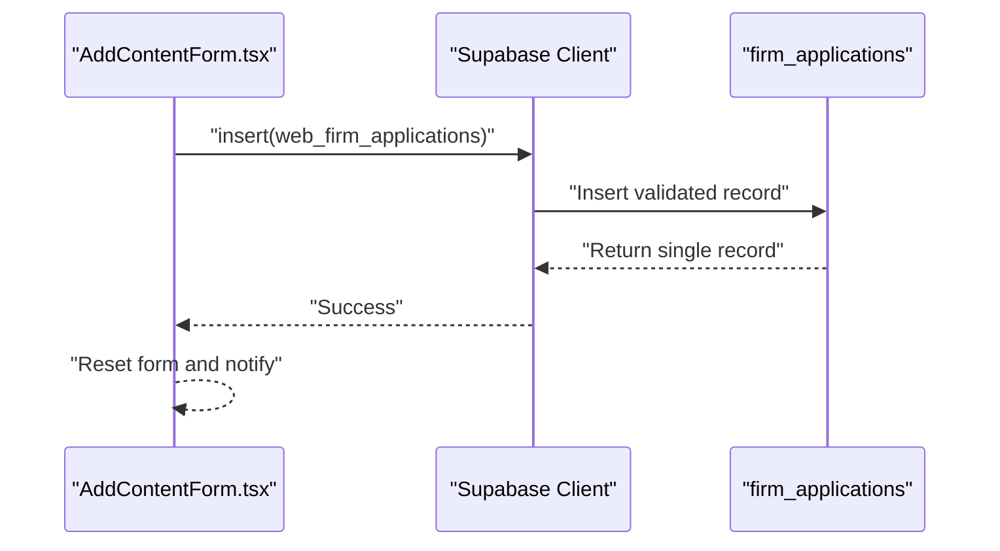
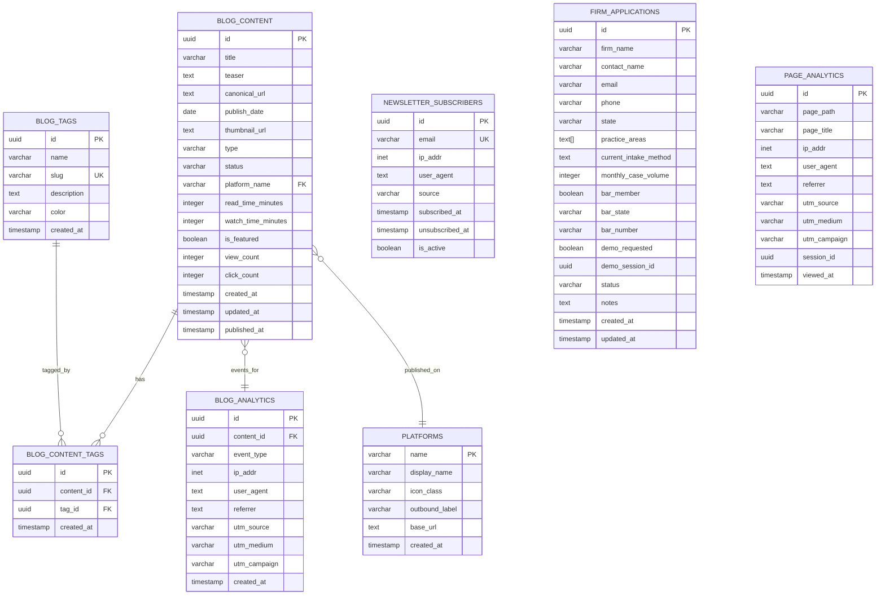

# Database Schema Design

<cite>
**Referenced Files in This Document**
- [DATABASE_SCHEMA_README.md](file://supabase/DATABASE_SCHEMA_README.md)
- [blog-content.js](file://js/blog-content.js)
- [AddContentForm.tsx](file://components/admin/AddContentForm.tsx)
- [script-1-blog-content-policy.sql](file://supabase/script-1-blog-content-policy.sql)
- [script-2-analytics-policy.sql](file://supabase/script-2-analytics-policy.sql)
- [rls-policies.sql](file://supabase/rls-policies.sql)
- [CHECK_ACTUAL_SCHEMA.sql](file://supabase/CHECK_ACTUAL_SCHEMA.sql)
- [TEST_INSERT_MANUAL.sql](file://supabase/TEST_INSERT_MANUAL.sql)
- [AUTOMATED_MIGRATION_SCRIPT.sql](file://supabase/AUTOMATED_MIGRATION_SCRIPT.sql)
</cite>

## Table of Contents
1. [Introduction](#introduction)
2. [Project Structure](#project-structure)
3. [Core Components](#core-components)
4. [Architecture Overview](#architecture-overview)
5. [Detailed Component Analysis](#detailed-component-analysis)
6. [Dependency Analysis](#dependency-analysis)
7. [Performance Considerations](#performance-considerations)
8. [Troubleshooting Guide](#troubleshooting-guide)
9. [Conclusion](#conclusion)
10. [Appendices](#appendices)

## Introduction
This document describes the Supabase database schema powering the TrueVow marketing website. It covers eight core tables, their structures, constraints, indexes, and relationships, along with two views and Row Level Security (RLS) policies. It also documents the current manual content directory system, future automation plans, and practical usage patterns derived from frontend and admin components.

## Project Structure
The schema is documented centrally in a dedicated schema readme and complemented by client-side integration code and RLS setup scripts. The primary runtime integration occurs in:
- Frontend JavaScript for blog content retrieval and analytics tracking
- Next.js admin component for content ingestion
- Supabase RLS scripts for access control

**Diagram sources**
- [blog-content.js](file://js/blog-content.js#L1-L424)
- [AddContentForm.tsx](file://components/admin/AddContentForm.tsx#L1-L357)
- [script-1-blog-content-policy.sql](file://supabase/script-1-blog-content-policy.sql#L1-L29)
- [script-2-analytics-policy.sql](file://supabase/script-2-analytics-policy.sql#L1-L29)
- [rls-policies.sql](file://supabase/rls-policies.sql#L1-L95)
- [DATABASE_SCHEMA_README.md](file://supabase/DATABASE_SCHEMA_README.md#L1-L563)

**Section sources**
- [DATABASE_SCHEMA_README.md](file://supabase/DATABASE_SCHEMA_README.md#L1-L563)
- [blog-content.js](file://js/blog-content.js#L1-L424)
- [AddContentForm.tsx](file://components/admin/AddContentForm.tsx#L1-L357)
- [rls-policies.sql](file://supabase/rls-policies.sql#L1-L95)

## Core Components
This section summarizes the eight core tables and their roles, constraints, indexes, and RLS policies as documented.

- blog_content
  - Purpose: Stores blog articles and videos.
  - Key columns: id, title, teaser, canonical_url, publish_date, thumbnail_url, type, status, platform_name, read_time_minutes, watch_time_minutes, is_featured, view_count, click_count, timestamps.
  - Constraints: Primary key on id; indexes on status, publish_date, type, platform_name.
  - RLS: Public SELECT allowed for status='published'; INSERT/UPDATE/DELETE restricted to authenticated users.

- blog_analytics
  - Purpose: Tracks views, clicks, and shares for blog content.
  - Key columns: id, content_id (FK), event_type, ip_addr, user_agent, referrer, utm_* parameters, created_at.
  - Constraints: Primary key on id; foreign key on content_id; indexes on event_type, created_at.
  - RLS: Public INSERT allowed; SELECT restricted to authenticated users.

- newsletter_subscribers
  - Purpose: Stores newsletter subscription emails.
  - Key columns: id, email (unique), ip_addr, user_agent, source, subscribed_at, unsubscribed_at, is_active.
  - Constraints: Primary key on id; unique index on email; index on is_active.
  - RLS: Public INSERT allowed; SELECT restricted to authenticated users.

- firm_applications
  - Purpose: Stores law firm application form submissions.
  - Key columns: id, firm_name, contact_name, email, phone, state, practice_areas (array), current_intake_method, monthly_case_volume, bar_member, bar_state, bar_number, demo_requested, demo_session_id, status, notes, timestamps.
  - Constraints: Primary key on id; indexes on email, status, created_at.
  - RLS: Public INSERT allowed; SELECT/UPDATE restricted to authenticated users.

- platforms
  - Purpose: Reference table for content platforms (LinkedIn, YouTube).
  - Key columns: name (PK), display_name, icon_class, outbound_label, base_url, created_at.
  - Constraints: Primary key on name.
  - Notes: Used by blog_content via platform_name.

- blog_tags
  - Purpose: Categorization tags for blog content.
  - Key columns: id, name, slug (unique), description, color, created_at.
  - Constraints: Primary key on id; unique index on slug.
  - Notes: Supports future tagging system.

- blog_content_tags
  - Purpose: Many-to-many relationship between content and tags.
  - Key columns: id, content_id (FK), tag_id (FK), created_at.
  - Constraints: Primary key on id; foreign keys to blog_content and blog_tags; unique index on (content_id, tag_id).
  - Notes: Supports future tagging system.

- page_analytics
  - Purpose: Tracks page views and traffic metrics.
  - Key columns: id, page_path, page_title, ip_addr, user_agent, referrer, utm_source, utm_medium, utm_campaign, session_id, viewed_at.
  - Constraints: Primary key on id; indexes on page_path, viewed_at.
  - Notes: Intended for website traffic tracking.

**Section sources**
- [DATABASE_SCHEMA_README.md](file://supabase/DATABASE_SCHEMA_README.md#L21-L375)

## Architecture Overview
The system integrates frontend and admin components with Supabase tables and views. Public-facing access is controlled via RLS policies, while administrative operations require authenticated users. The frontend uses REST v1 endpoints to fetch published content and track analytics events.

**Diagram sources**
- [blog-content.js](file://js/blog-content.js#L1-L424)
- [AddContentForm.tsx](file://components/admin/AddContentForm.tsx#L1-L357)
- [DATABASE_SCHEMA_README.md](file://supabase/DATABASE_SCHEMA_README.md#L377-L428)
- [rls-policies.sql](file://supabase/rls-policies.sql#L1-L95)

## Detailed Component Analysis

### blog_content
- Purpose: Central repository for published and draft content.
- Notable constraints: Primary key on id; indexes on status, publish_date, type, platform_name.
- RLS: Public SELECT allowed for status='published'; INSERT/UPDATE/DELETE require authenticated users.
- Frontend usage: REST v1 endpoint filters by status and orders by publish_date; selects curated columns for rendering.

**Diagram sources**
- [blog-content.js](file://js/blog-content.js#L26-L64)

**Section sources**
- [DATABASE_SCHEMA_README.md](file://supabase/DATABASE_SCHEMA_README.md#L23-L74)
- [blog-content.js](file://js/blog-content.js#L26-L64)

### blog_analytics
- Purpose: Captures engagement events for content items.
- Notable constraints: Primary key on id; foreign key to blog_content; indexes on event_type and created_at.
- RLS: Public INSERT allowed; SELECT requires authenticated users.
- Frontend usage: POST analytics events with content_id, event_type, and optional metadata.

**Diagram sources**
- [blog-content.js](file://js/blog-content.js#L72-L102)

**Section sources**
- [DATABASE_SCHEMA_README.md](file://supabase/DATABASE_SCHEMA_README.md#L77-L135)
- [blog-content.js](file://js/blog-content.js#L72-L102)

### newsletter_subscribers
- Purpose: Manages newsletter subscriptions with opt-in/out tracking.
- Notable constraints: Primary key on id; unique index on email; index on is_active.
- RLS: Public INSERT allowed; SELECT requires authenticated users.
- Usage pattern: Upsert-like behavior via unique email index.

**Section sources**
- [DATABASE_SCHEMA_README.md](file://supabase/DATABASE_SCHEMA_README.md#L138-L188)

### firm_applications
- Purpose: Stores law firm application submissions.
- Notable constraints: Primary key on id; indexes on email, status, created_at.
- RLS: Public INSERT allowed; SELECT/UPDATE require authenticated users.
- Frontend usage: Admin form inserts records via Supabase client; supports arrays and booleans.

**Diagram sources**
- [AddContentForm.tsx](file://components/admin/AddContentForm.tsx#L63-L141)

**Section sources**
- [DATABASE_SCHEMA_README.md](file://supabase/DATABASE_SCHEMA_README.md#L191-L255)
- [AddContentForm.tsx](file://components/admin/AddContentForm.tsx#L63-L141)

### platforms
- Purpose: Reference table for content platforms.
- Notable constraints: Primary key on name.
- Relationship: blog_content.platform_name references platforms.name.

**Section sources**
- [DATABASE_SCHEMA_README.md](file://supabase/DATABASE_SCHEMA_README.md#L258-L287)

### blog_tags and blog_content_tags
- Purpose: Support categorization and tagging of content.
- Notable constraints: blog_tags unique slug; blog_content_tags unique composite (content_id, tag_id).
- Relationships: Many-to-many via blog_content_tags.

**Section sources**
- [DATABASE_SCHEMA_README.md](file://supabase/DATABASE_SCHEMA_README.md#L289-L344)

### page_analytics
- Purpose: Tracks page-level traffic and UTM parameters.
- Notable constraints: Primary key on id; indexes on page_path and viewed_at.

**Section sources**
- [DATABASE_SCHEMA_README.md](file://supabase/DATABASE_SCHEMA_README.md#L346-L375)

### Views
- published_blog_content
  - Purpose: Pre-filtered view of published content enriched with platform metadata and aggregated tag names.
  - Joins: blog_content LEFT JOIN platforms LEFT JOIN blog_content_tags LEFT JOIN blog_tags.
  - Filters: status='published' AND is_active=true.
- firm_applications_dashboard
  - Purpose: Dashboard view with status counts and recency buckets for admin pipeline.

**Section sources**
- [DATABASE_SCHEMA_README.md](file://supabase/DATABASE_SCHEMA_README.md#L377-L428)

## Dependency Analysis
The following diagram maps core table relationships and many-to-many associations.

**Diagram sources**
- [DATABASE_SCHEMA_README.md](file://supabase/DATABASE_SCHEMA_README.md#L21-L375)

**Section sources**
- [DATABASE_SCHEMA_README.md](file://supabase/DATABASE_SCHEMA_README.md#L21-L375)

## Performance Considerations
- Indexing strategy
  - blog_content: status, publish_date, type, platform_name for filtering and sorting.
  - blog_analytics: event_type, created_at for time-series and event-type queries.
  - newsletter_subscribers: email (unique), is_active for deduplication and active filtering.
  - firm_applications: email, status, created_at for lookup and pipeline sorting.
  - page_analytics: page_path, viewed_at for path-based and temporal analytics.
- RLS overhead
  - Enabling RLS adds minimal overhead; ensure policies remain selective to avoid scans.
- Query patterns
  - Use selective column lists (as seen in frontend) to reduce payload sizes.
  - Prefer server-side ordering and filtering (status, dates) to minimize client-side work.
- Storage and cardinality
  - Consider partitioning page_analytics by viewed_at for very large datasets.
  - Monitor growth of blog_analytics and implement retention policies if needed.

[No sources needed since this section provides general guidance]

## Troubleshooting Guide
- RLS policy verification
  - Use the provided RLS scripts to confirm policies are applied and functioning.
  - Example scripts enable RLS and create policies for public access to published content and analytics inserts.
- Testing INSERT permissions
  - Use manual test scripts to simulate inserts and confirm policy behavior.
  - The test script attempts inserting into firm_applications to validate INSERT permissions.
- Schema inspection
  - Use the schema check script to enumerate actual columns and constraints for firm_applications.
- Migration restoration
  - The automated migration script is currently a placeholder; restore or recreate the migration process as needed.

**Section sources**
- [script-1-blog-content-policy.sql](file://supabase/script-1-blog-content-policy.sql#L1-L29)
- [script-2-analytics-policy.sql](file://supabase/script-2-analytics-policy.sql#L1-L29)
- [rls-policies.sql](file://supabase/rls-policies.sql#L1-L95)
- [TEST_INSERT_MANUAL.sql](file://supabase/TEST_INSERT_MANUAL.sql#L1-L67)
- [CHECK_ACTUAL_SCHEMA.sql](file://supabase/CHECK_ACTUAL_SCHEMA.sql#L1-L26)
- [AUTOMATED_MIGRATION_SCRIPT.sql](file://supabase/AUTOMATED_MIGRATION_SCRIPT.sql#L1-L16)

## Conclusion
The schema provides a clear foundation for the marketing website’s content, analytics, and application workflows. It leverages Supabase’s RLS for secure, role-based access and REST v1 endpoints for straightforward integration. The manual content directory system ensures predictable publishing while future automation can be layered on top. Proper indexing and monitoring will sustain performance as data grows.

[No sources needed since this section summarizes without analyzing specific files]

## Appendices

### Practical Examples and Data Modeling Decisions
- Publishing workflow
  - Manual content directory: publish on LinkedIn/YouTube, copy canonical URL, add via admin form, then content appears on the blog hub immediately.
  - Future automation: prompt management, LLM drafting, moderation queue, and API integrations for LinkedIn and YouTube.
- Content ingestion
  - Admin form validates required fields and inserts into web_firm_applications via Supabase client.
- Analytics tracking
  - Frontend tracks view and click events via REST v1 inserts, capturing IP, user agent, referrer, and UTM parameters.
- Tagging system
  - blog_tags and blog_content_tags support scalable categorization for future filtering and discovery.

**Section sources**
- [DATABASE_SCHEMA_README.md](file://supabase/DATABASE_SCHEMA_README.md#L540-L557)
- [AddContentForm.tsx](file://components/admin/AddContentForm.tsx#L63-L141)
- [blog-content.js](file://js/blog-content.js#L72-L102)