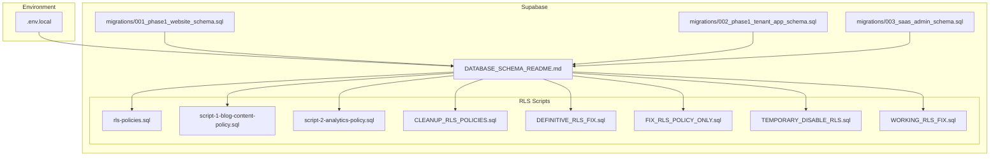
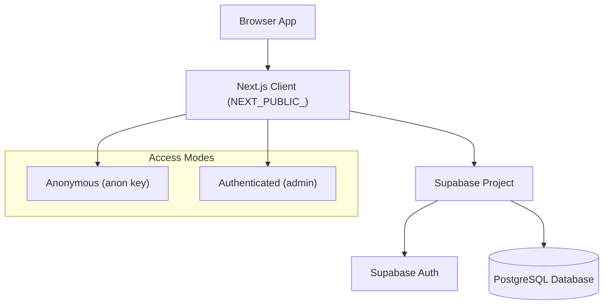
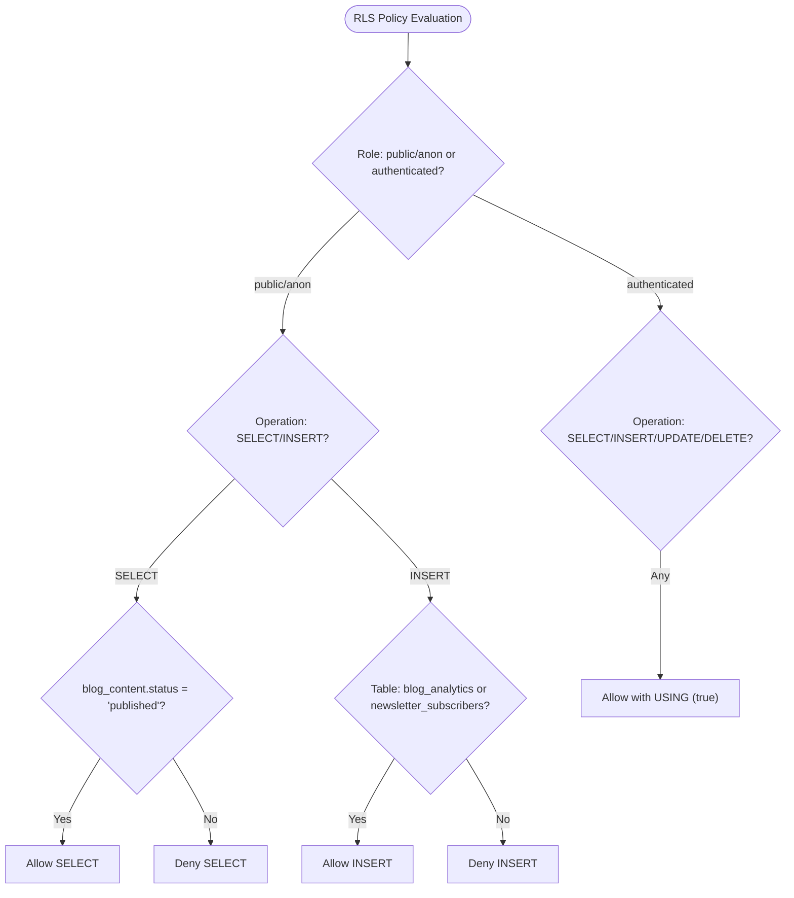
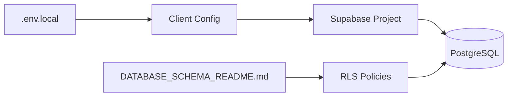
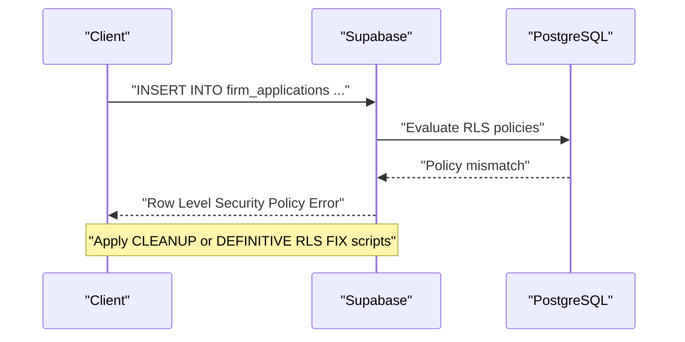

# Security and Performance

<cite>
**Referenced Files in This Document**
- [.env.local](file://.env.local)
- [DATABASE_SCHEMA_README.md](file://supabase/DATABASE_SCHEMA_README.md)
- [rls-policies.sql](file://supabase/rls-policies.sql)
- [script-1-blog-content-policy.sql](file://supabase/script-1-blog-content-policy.sql)
- [script-2-analytics-policy.sql](file://supabase/script-2-analytics-policy.sql)
- [CLEANUP_RLS_POLICIES.sql](file://supabase/CLEANUP_RLS_POLICIES.sql)
- [DEFINITIVE_RLS_FIX.sql](file://supabase/DEFINITIVE_RLS_FIX.sql)
- [FIX_RLS_POLICY_ONLY.sql](file://supabase/FIX_RLS_POLICY_ONLY.sql)
- [TEMPORARY_DISABLE_RLS.sql](file://supabase/TEMPORARY_DISABLE_RLS.sql)
- [WORKING_RLS_FIX.sql](file://supabase/WORKING_RLS_FIX.sql)
- [001_phase1_website_schema.sql](file://supabase/migrations/001_phase1_website_schema.sql)
- [002_phase1_tenant_app_schema.sql](file://supabase/migrations/002_phase1_tenant_app_schema.sql)
- [003_saas_admin_schema.sql](file://supabase/migrations/003_saas_admin_schema.sql)
</cite>

## Table of Contents
1. [Introduction](#introduction)
2. [Project Structure](#project-structure)
3. [Core Components](#core-components)
4. [Architecture Overview](#architecture-overview)
5. [Detailed Component Analysis](#detailed-component-analysis)
6. [Dependency Analysis](#dependency-analysis)
7. [Performance Considerations](#performance-considerations)
8. [Troubleshooting Guide](#troubleshooting-guide)
9. [Conclusion](#conclusion)
10. [Appendices](#appendices)

## Introduction
This document provides comprehensive guidance for security and performance considerations in the Supabase integration powering the TrueVow marketing website and related systems. It focuses on Row Level Security (RLS) policy configurations for public access versus admin access, authentication mechanisms, API key management, access control patterns, zero-knowledge privacy practices, data encryption, privacy compliance, audit logging, performance optimization strategies, monitoring and alerting, backup and disaster recovery, security audits, vulnerability assessments, and troubleshooting.

## Project Structure
The Supabase integration spans multiple migration files and dedicated RLS policy scripts. The environment configuration defines Supabase project URLs and anonymous keys used by client-side components. The schema documentation outlines tables, indexes, RLS policies, and example queries.

**Diagram sources**
- [.env.local](file://.env.local#L15-L38)
- [DATABASE_SCHEMA_README.md](file://supabase/DATABASE_SCHEMA_README.md#L1-L563)
- [rls-policies.sql](file://supabase/rls-policies.sql#L1-L95)
- [script-1-blog-content-policy.sql](file://supabase/script-1-blog-content-policy.sql#L1-L29)
- [script-2-analytics-policy.sql](file://supabase/script-2-analytics-policy.sql#L1-L29)
- [CLEANUP_RLS_POLICIES.sql](file://supabase/CLEANUP_RLS_POLICIES.sql#L1-L60)
- [DEFINITIVE_RLS_FIX.sql](file://supabase/DEFINITIVE_RLS_FIX.sql#L1-L57)
- [FIX_RLS_POLICY_ONLY.sql](file://supabase/FIX_RLS_POLICY_ONLY.sql#L1-L31)
- [TEMPORARY_DISABLE_RLS.sql](file://supabase/TEMPORARY_DISABLE_RLS.sql#L1-L25)
- [WORKING_RLS_FIX.sql](file://supabase/WORKING_RLS_FIX.sql#L1-L41)
- [001_phase1_website_schema.sql](file://supabase/migrations/001_phase1_website_schema.sql#L1-L31)
- [002_phase1_tenant_app_schema.sql](file://supabase/migrations/002_phase1_tenant_app_schema.sql#L1-L26)
- [003_saas_admin_schema.sql](file://supabase/migrations/003_saas_admin_schema.sql#L1-L26)

**Section sources**
- [.env.local](file://.env.local#L15-L38)
- [DATABASE_SCHEMA_README.md](file://supabase/DATABASE_SCHEMA_README.md#L1-L563)

## Core Components
- Supabase project URLs and anonymous keys for client-side access are configured in the environment file.
- The schema documentation enumerates tables, indexes, RLS policies, and example queries for blog content, analytics, newsletter subscribers, firm applications, platforms, tags, and related views.
- Dedicated RLS scripts provide safe, incremental updates and cleanup for policies across tables.

Key responsibilities:
- Authentication and authorization via Supabase Auth and RLS.
- Client-side access using anonymous keys for public operations.
- Admin access using authenticated sessions for privileged operations.

**Section sources**
- [.env.local](file://.env.local#L25-L28)
- [DATABASE_SCHEMA_README.md](file://supabase/DATABASE_SCHEMA_README.md#L23-L254)

## Architecture Overview
The system architecture integrates client-side components with Supabase for public-facing content retrieval, analytics tracking, and admin-managed content and applications. RLS enforces access control at the database level, while Supabase Auth manages identities and tokens.

**Diagram sources**
- [.env.local](file://.env.local#L25-L28)
- [DATABASE_SCHEMA_README.md](file://supabase/DATABASE_SCHEMA_README.md#L431-L449)

## Detailed Component Analysis

### Row Level Security (RLS) Implementation
RLS policies define granular access control for each table:
- blog_content: Public SELECT for published content; authenticated INSERT/UPDATE/DELETE for admins.
- blog_analytics: Public INSERT for analytics events; authenticated SELECT for admin-only reporting.
- newsletter_subscribers: Public INSERT for subscriptions; authenticated SELECT for admin-only subscriber management.
- firm_applications: Public INSERT for form submissions; authenticated SELECT/UPDATE for admin dashboard.

Recommended policy configuration patterns:
- Use explicit roles: public/anon for client access; authenticated for admin.
- Prefer WITH CHECK (true) for INSERT policies to allow unrestricted writes while maintaining RLS enforcement.
- Keep policies minimal and explicit to reduce risk of privilege escalation.

**Diagram sources**
- [rls-policies.sql](file://supabase/rls-policies.sql#L8-L93)
- [script-1-blog-content-policy.sql](file://supabase/script-1-blog-content-policy.sql#L8-L19)
- [script-2-analytics-policy.sql](file://supabase/script-2-analytics-policy.sql#L8-L19)
- [DATABASE_SCHEMA_README.md](file://supabase/DATABASE_SCHEMA_README.md#L56-L109)

**Section sources**
- [rls-policies.sql](file://supabase/rls-policies.sql#L8-L93)
- [script-1-blog-content-policy.sql](file://supabase/script-1-blog-content-policy.sql#L8-L27)
- [script-2-analytics-policy.sql](file://supabase/script-2-analytics-policy.sql#L8-L27)
- [DATABASE_SCHEMA_README.md](file://supabase/DATABASE_SCHEMA_README.md#L56-L109)

### Authentication Mechanisms and API Key Management
- Client-side configuration uses NEXT_PUBLIC_SUPABASE_URL and NEXT_PUBLIC_SUPABASE_ANON_KEY for anonymous access.
- Admin operations require authenticated sessions; ensure admin clients use service or admin credentials appropriately scoped.
- Anon keys are intended for public operations; restrict sensitive operations to authenticated contexts.

Best practices:
- Store secrets securely; do not commit real keys to version control.
- Rotate keys periodically and revoke compromised keys.
- Limit scopes of keys to least privilege.

**Section sources**
- [.env.local](file://.env.local#L25-L28)

### Access Control Patterns
- Public access: SELECT on published content, INSERT on analytics and newsletter tables.
- Admin access: SELECT/UPDATE on content and applications; administrative dashboards and reporting.
- Use separate roles and policies to prevent cross-contamination of permissions.

**Section sources**
- [DATABASE_SCHEMA_README.md](file://supabase/DATABASE_SCHEMA_README.md#L431-L449)

### Zero-Knowledge Privacy, Encryption, and Audit Logging
Zero-knowledge architecture implies minimizing data retention and avoiding plaintext storage of sensitive attributes. Recommended practices:
- Data minimization: collect only what is necessary for operations.
- Privacy by design: avoid storing personally identifiable information (PII) unless required; anonymize or pseudonymize where possible.
- Encryption at rest and in transit: configure database encryption and enforce TLS connections.
- Audit logging: track access to sensitive tables and admin actions; log failed RLS attempts for anomaly detection.
- Privacy compliance: align with applicable regulations (e.g., GDPR, CCPA); provide data subject rights mechanisms.

[No sources needed since this section provides general guidance]

### Performance Optimization Strategies
Indexing and query optimization:
- Ensure indexes exist on frequently filtered/sorted columns (e.g., blog_content.status, blog_content.publish_date, firm_applications.email, firm_applications.status).
- Use targeted queries with LIMIT clauses for paginated content.
- Leverage materialized or summary tables/views for analytics aggregations.

Caching approaches:
- Cache static content (e.g., published blog listings) at CDN edge for reduced latency.
- Cache recent analytics summaries to minimize repeated heavy aggregations.
- Use database-level caching controls judiciously; prefer application-level caches for dynamic content.

Monitoring and alerting:
- Track slow queries and high-RPS endpoints.
- Alert on anomalous spikes in analytics INSERT volumes or repeated RLS denials.

Backup and disaster recovery:
- Schedule automated backups; validate restore procedures regularly.
- Maintain point-in-time recovery (PITR) enabled.
- Test failover scenarios and replication lag.

[No sources needed since this section provides general guidance]

## Dependency Analysis
The client configuration depends on Supabase project URLs and anonymous keys. The schema documentation and RLS scripts define the authoritative access control model.

**Diagram sources**
- [.env.local](file://.env.local#L25-L28)
- [DATABASE_SCHEMA_README.md](file://supabase/DATABASE_SCHEMA_README.md#L431-L449)

**Section sources**
- [.env.local](file://.env.local#L25-L28)
- [DATABASE_SCHEMA_README.md](file://supabase/DATABASE_SCHEMA_README.md#L431-L449)

## Performance Considerations
- Indexes: Ensure indexes on blog_content.status, blog_content.publish_date, firm_applications.email, firm_applications.status, and analytics timestamps.
- Queries: Use selective filters and pagination; avoid wildcard scans.
- Caching: Cache published content and analytics summaries; invalidate on content updates.
- Monitoring: Track query durations and RPS; set alerts for anomalies.

[No sources needed since this section provides general guidance]

## Troubleshooting Guide

### RLS Denial Errors
Symptoms:
- INSERT failures on firm_applications despite public access expectations.
- SELECT denied on published content.

Resolution steps:
- Verify RLS is enabled on target tables.
- Confirm existence of appropriate INSERT policies for public/anon.
- Use the definitive fix scripts to drop conflicting policies and re-create clean ones.

**Diagram sources**
- [CLEANUP_RLS_POLICIES.sql](file://supabase/CLEANUP_RLS_POLICIES.sql#L16-L43)
- [DEFINITIVE_RLS_FIX.sql](file://supabase/DEFINITIVE_RLS_FIX.sql#L24-L40)

**Section sources**
- [TEMPORARY_DISABLE_RLS.sql](file://supabase/TEMPORARY_DISABLE_RLS.sql#L7-L18)
- [WORKING_RLS_FIX.sql](file://supabase/WORKING_RLS_FIX.sql#L6-L20)
- [FIX_RLS_POLICY_ONLY.sql](file://supabase/FIX_RLS_POLICY_ONLY.sql#L7-L19)
- [CLEANUP_RLS_POLICIES.sql](file://supabase/CLEANUP_RLS_POLICIES.sql#L16-L43)
- [DEFINITIVE_RLS_FIX.sql](file://supabase/DEFINITIVE_RLS_FIX.sql#L24-L40)

### Public Access vs Admin Access Validation
- Validate public SELECT on published content.
- Validate admin INSERT/UPDATE/DELETE on content and applications.
- Use the verification queries embedded in the RLS scripts to confirm policy presence and commands.

**Section sources**
- [rls-policies.sql](file://supabase/rls-policies.sql#L25-L35)
- [rls-policies.sql](file://supabase/rls-policies.sql#L54-L64)
- [rls-policies.sql](file://supabase/rls-policies.sql#L85-L93)

### API Key and Client Configuration Issues
- Ensure NEXT_PUBLIC_SUPABASE_URL and NEXT_PUBLIC_SUPABASE_ANON_KEY match the Supabase project.
- Confirm environment variables are loaded by the client runtime.
- Rotate keys if access is unexpectedly blocked.

**Section sources**
- [.env.local](file://.env.local#L25-L28)

### Database Schema Restoration
- Placeholder migration files indicate missing exports; restore them from the Supabase dashboard to ensure accurate schema and indexes.

**Section sources**
- [001_phase1_website_schema.sql](file://supabase/migrations/001_phase1_website_schema.sql#L6-L29)
- [002_phase1_tenant_app_schema.sql](file://supabase/migrations/002_phase1_tenant_app_schema.sql#L6-L25)
- [003_saas_admin_schema.sql](file://supabase/migrations/003_saas_admin_schema.sql#L6-L25)

## Conclusion
The Supabase integration employs RLS to enforce clear separation between public and admin access, with explicit policies for blog content, analytics, newsletter subscriptions, and firm applications. Secure API key management and least-privilege access patterns support a robust zero-knowledge posture. Performance can be optimized through strategic indexing, targeted queries, and caching, complemented by monitoring, backups, and disaster recovery planning. Adhering to the troubleshooting steps and best practices outlined here will help maintain a secure, reliable, and high-performing system.

[No sources needed since this section summarizes without analyzing specific files]

## Appendices

### Security Audit Guidelines
- Review RLS policies quarterly; validate against documented access patterns.
- Audit logs for failed RLS attempts and admin actions.
- Penetration test public endpoints and admin dashboards.

**Section sources**
- [DATABASE_SCHEMA_README.md](file://supabase/DATABASE_SCHEMA_README.md#L431-L449)

### Vulnerability Assessment Procedures
- Static analysis of client configuration for exposed keys.
- Dynamic scanning of Supabase endpoints for misconfigurations.
- Privilege review for service and admin roles.

**Section sources**
- [.env.local](file://.env.local#L9-L13)

### Compliance Requirements
- Align data collection with privacy frameworks; implement data subject rights.
- Encrypt data at rest and in transit; manage keys securely.
- Maintain audit trails for regulatory scrutiny.

[No sources needed since this section provides general guidance]