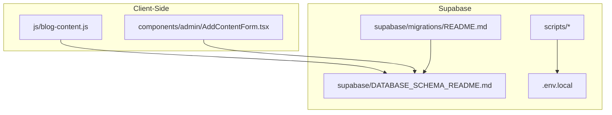
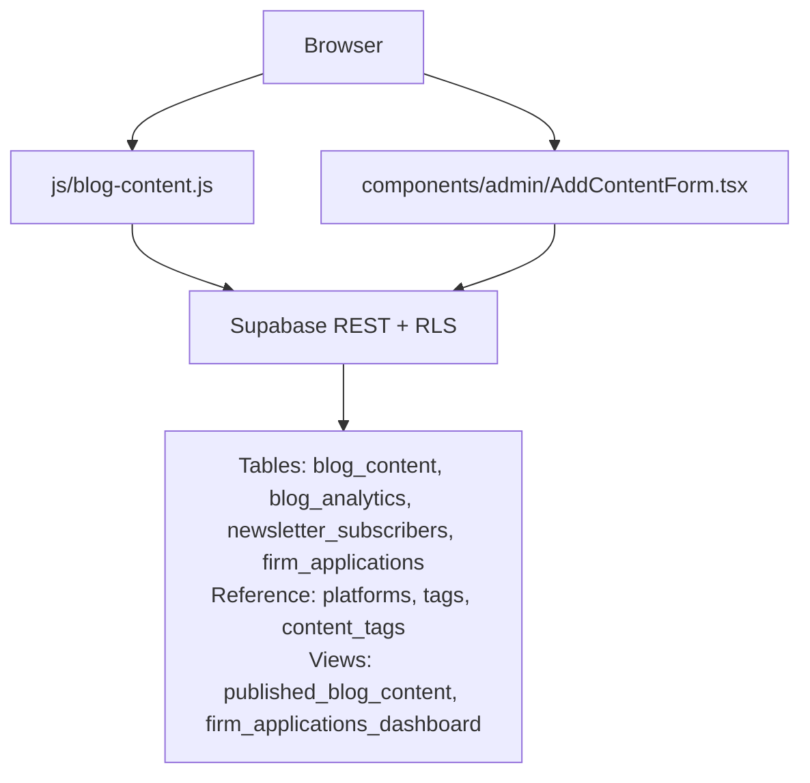
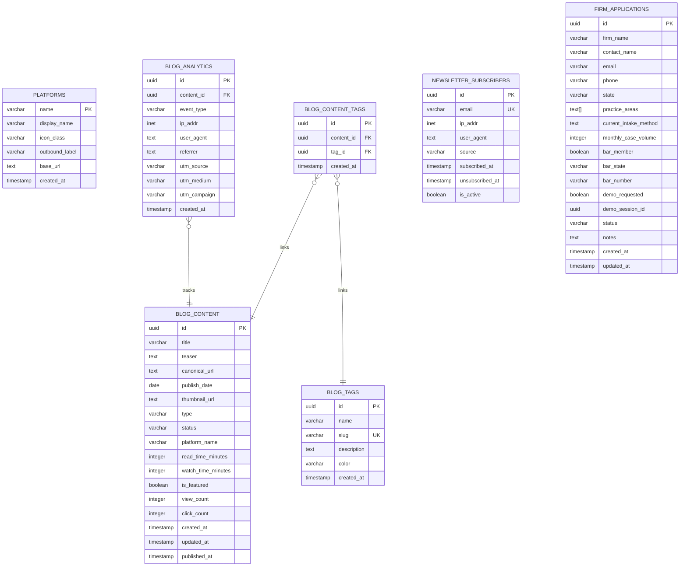
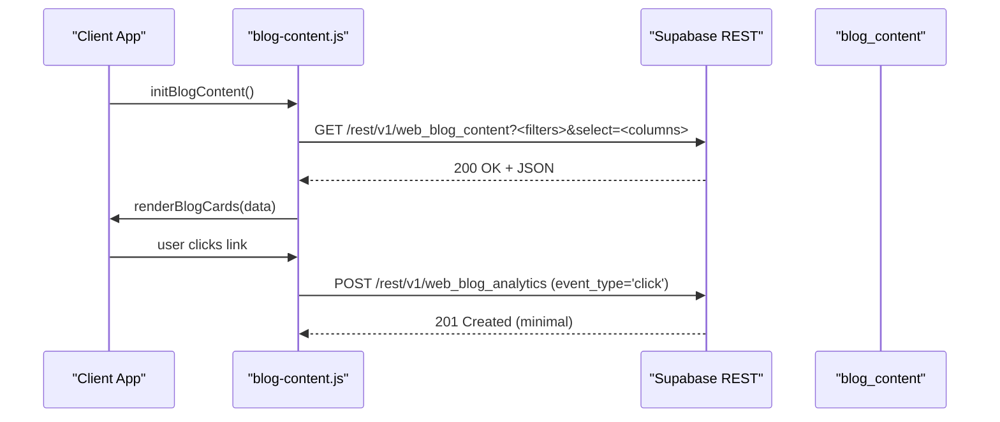
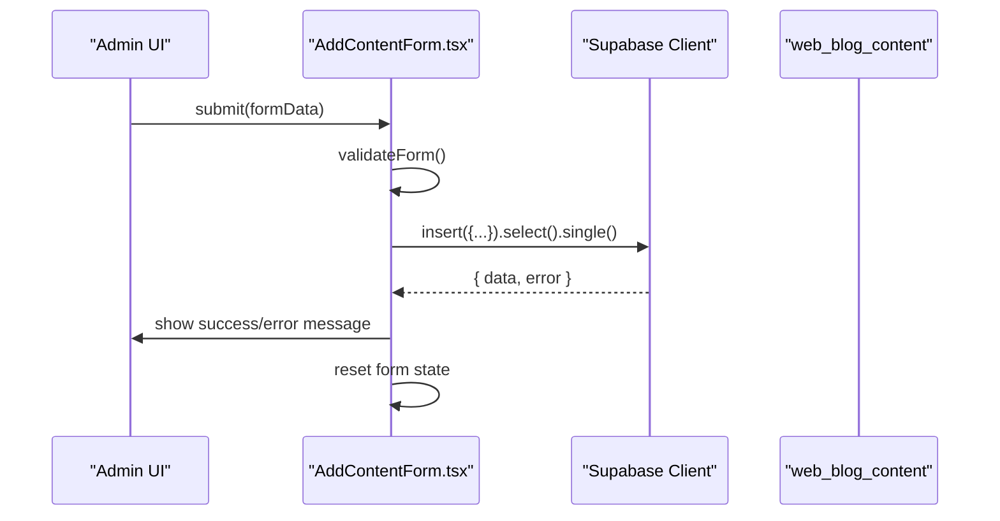
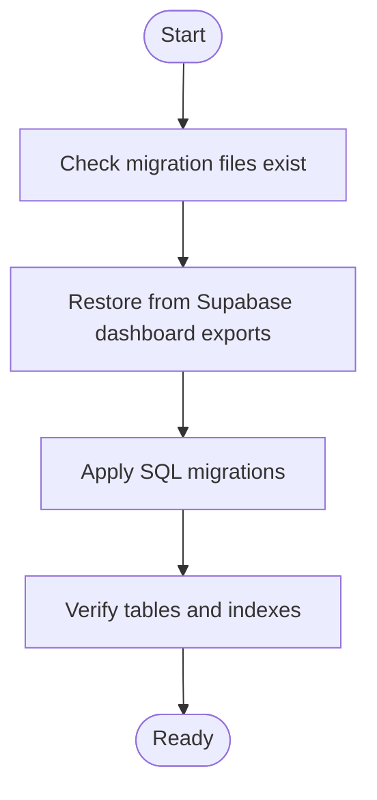
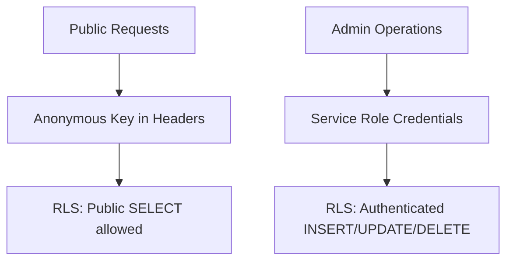
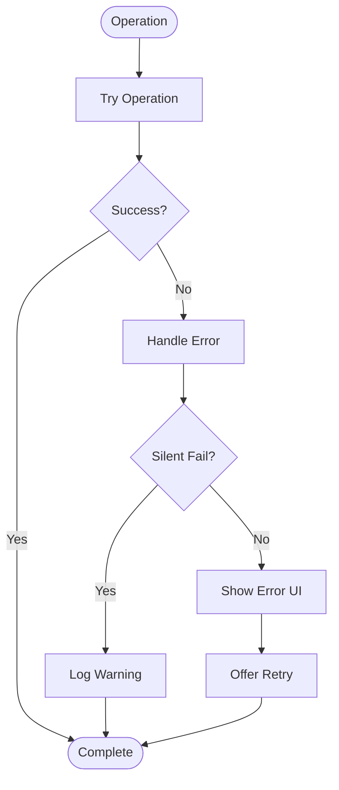
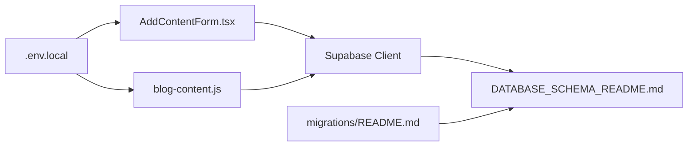

# Supabase Backend Integration

<cite>
**Referenced Files in This Document**
- [DATABASE_SCHEMA_README.md](file://supabase/DATABASE_SCHEMA_README.md)
- [README.md](file://supabase/migrations/README.md)
- [blog-content.js](file://js/blog-content.js)
- [AddContentForm.tsx](file://components/admin/AddContentForm.tsx)
- [.env.local](file://.env.local)
- [test-db-connections.js](file://scripts/test-db-connections.js)
- [auto-migrate-database.js](file://scripts/auto-migrate-database.js)
</cite>

## Table of Contents
1. [Introduction](#introduction)
2. [Project Structure](#project-structure)
3. [Core Components](#core-components)
4. [Architecture Overview](#architecture-overview)
5. [Detailed Component Analysis](#detailed-component-analysis)
6. [Dependency Analysis](#dependency-analysis)
7. [Performance Considerations](#performance-considerations)
8. [Troubleshooting Guide](#troubleshooting-guide)
9. [Conclusion](#conclusion)
10. [Appendices](#appendices)

## Introduction
This document provides comprehensive documentation for the Supabase backend integration powering the TrueVow marketing website. It covers the database schema design, table relationships, constraints, and Row Level Security (RLS) policies. It also documents the client-side REST API usage patterns for blog content retrieval and analytics tracking, the admin React component for content creation, and the migration system and database initialization process. Authentication and authorization mechanisms, error handling strategies, performance optimization techniques, connection configuration, and debugging approaches are included, along with practical examples for database operations and security best practices tailored to a zero-knowledge architecture.

## Project Structure
The Supabase integration spans several areas:
- Supabase schema documentation and migration files
- Client-side JavaScript for blog content fetching and analytics
- Admin React component for content management
- Environment configuration for database connections
- Scripts for testing connections and automated migration

**Diagram sources**
- [blog-content.js](file://js/blog-content.js#L1-L424)
- [AddContentForm.tsx](file://components/admin/AddContentForm.tsx#L1-L357)
- [DATABASE_SCHEMA_README.md](file://supabase/DATABASE_SCHEMA_README.md#L1-L563)
- [README.md](file://supabase/migrations/README.md#L1-L37)
- [.env.local](file://.env.local#L1-L38)
- [test-db-connections.js](file://scripts/test-db-connections.js#L1-L64)

**Section sources**
- [DATABASE_SCHEMA_README.md](file://supabase/DATABASE_SCHEMA_README.md#L1-L563)
- [README.md](file://supabase/migrations/README.md#L1-L37)
- [blog-content.js](file://js/blog-content.js#L1-L424)
- [AddContentForm.tsx](file://components/admin/AddContentForm.tsx#L1-L357)
- [.env.local](file://.env.local#L1-L38)
- [test-db-connections.js](file://scripts/test-db-connections.js#L1-L64)

## Core Components
- Database schema and RLS policies: The schema defines tables for blog content, analytics, newsletter subscribers, firm applications, platforms, tags, and content-tag relationships, plus views for dashboards. RLS policies govern public and authenticated access.
- Client-side REST integration: The blog content engine fetches published content and tracks analytics via Supabase REST endpoints using anonymous keys.
- Admin React component: Adds content items to the blog with validation and automatic UTM parameter injection.
- Environment configuration: Defines Supabase project URLs and anonymous keys for client-side usage.
- Connection testing and migration scripts: Validate connectivity across multiple Supabase projects and outline automated migration procedures.

**Section sources**
- [DATABASE_SCHEMA_README.md](file://supabase/DATABASE_SCHEMA_README.md#L21-L451)
- [blog-content.js](file://js/blog-content.js#L18-L102)
- [AddContentForm.tsx](file://components/admin/AddContentForm.tsx#L62-L141)
- [.env.local](file://.env.local#L25-L28)
- [test-db-connections.js](file://scripts/test-db-connections.js#L22-L50)
- [README.md](file://supabase/migrations/README.md#L7-L26)

## Architecture Overview
The system architecture integrates client-side JavaScript and a React admin component with Supabase REST and RLS-enabled tables. The client fetches published content and records analytics events, while the admin inserts content items with appropriate statuses.

**Diagram sources**
- [blog-content.js](file://js/blog-content.js#L26-L64)
- [AddContentForm.tsx](file://components/admin/AddContentForm.tsx#L96-L100)
- [DATABASE_SCHEMA_README.md](file://supabase/DATABASE_SCHEMA_README.md#L21-L428)

## Detailed Component Analysis

### Database Schema Design and RLS Policies
- Tables and relationships:
  - blog_content: primary content hub with status, type, platform, and counts.
  - blog_analytics: event tracking for views, clicks, shares linked to content.
  - newsletter_subscribers: subscription management with opt-in/out tracking.
  - firm_applications: law firm application pipeline with status tracking.
  - Reference tables: platforms, blog_tags, blog_content_tags.
  - Views: published_blog_content (pre-filtered published content), firm_applications_dashboard (pipeline aggregation).
- Constraints and indexes:
  - Primary keys, unique indexes (e.g., newsletter email), selective indexes (status, publish_date, type, platform_name, created_at).
- RLS policies:
  - blog_content: public select for published items; authenticated insert/update/delete for admins.
  - blog_analytics: public insert for tracking; authenticated select for admins.
  - newsletter_subscribers: public insert for subscriptions; authenticated select for admins.
  - firm_applications: public insert for form submissions; authenticated select/update for admins.

**Diagram sources**
- [DATABASE_SCHEMA_README.md](file://supabase/DATABASE_SCHEMA_README.md#L23-L254)

**Section sources**
- [DATABASE_SCHEMA_README.md](file://supabase/DATABASE_SCHEMA_README.md#L21-L451)

### REST API Endpoints and Usage Patterns
- Client-side content retrieval:
  - Endpoint pattern: Supabase REST v1 with filters and column selection.
  - Headers include apikey and Authorization bearer using anonymous key.
  - Filters: status=eq.published, optional type, is_featured, limit.
  - Selection: curated columns for performance.
- Analytics tracking:
  - Endpoint pattern: POST to analytics table with minimal return preference.
  - Metadata: ip_addr, user_agent, referrer, utm parameters.
  - Error handling: non-blocking analytics with warnings.

**Diagram sources**
- [blog-content.js](file://js/blog-content.js#L26-L64)
- [blog-content.js](file://js/blog-content.js#L72-L102)

**Section sources**
- [blog-content.js](file://js/blog-content.js#L18-L102)

### Admin Content Management Component
- Purpose: Add new articles/videos to the blog hub with validation and status control.
- Key behaviors:
  - Validates required fields and type-specific fields.
  - Automatically appends UTM parameters to canonical URLs.
  - Inserts into web_blog_content and selects single record.
  - Provides success/error messaging and resets form after submission.

**Diagram sources**
- [AddContentForm.tsx](file://components/admin/AddContentForm.tsx#L62-L141)

**Section sources**
- [AddContentForm.tsx](file://components/admin/AddContentForm.tsx#L16-L141)

### Migration System and Database Initialization
- Migration files: SQL migration files for initial website schema, blog hub schema, tenant application schema, and SaaS admin schema.
- Migration status: Tables are active and verified; migration files serve as restoration artifacts.
- Automated migration placeholder: A placeholder script indicates the need to restore the original automation.

**Diagram sources**
- [README.md](file://supabase/migrations/README.md#L7-L36)
- [auto-migrate-database.js](file://scripts/auto-migrate-database.js#L1-L18)

**Section sources**
- [README.md](file://supabase/migrations/README.md#L1-L37)
- [auto-migrate-database.js](file://scripts/auto-migrate-database.js#L1-L18)

### Authentication and Authorization Mechanisms
- Anonymous access for public operations:
  - Client-side requests use anonymous keys in headers for public reads and analytics tracking.
- Authenticated access for administrative operations:
  - Admin components and serverless functions should use service role credentials for write operations.
- RLS policies:
  - Enforce granular permissions per table and operation type.

**Diagram sources**
- [blog-content.js](file://js/blog-content.js#L44-L51)
- [DATABASE_SCHEMA_README.md](file://supabase/DATABASE_SCHEMA_README.md#L435-L449)

**Section sources**
- [blog-content.js](file://js/blog-content.js#L44-L51)
- [DATABASE_SCHEMA_README.md](file://supabase/DATABASE_SCHEMA_README.md#L431-L449)

### Error Handling Strategies
- Client-side analytics:
  - Non-blocking tracking with warnings on failure.
- Content loading:
  - Error boundaries with retry prompts and loading states.
- Connection testing:
  - Graceful handling of missing environment variables and errors.

**Diagram sources**
- [blog-content.js](file://js/blog-content.js#L95-L101)
- [blog-content.js](file://js/blog-content.js#L346-L350)
- [test-db-connections.js](file://scripts/test-db-connections.js#L39-L49)

**Section sources**
- [blog-content.js](file://js/blog-content.js#L95-L101)
- [blog-content.js](file://js/blog-content.js#L346-L350)
- [test-db-connections.js](file://scripts/test-db-connections.js#L22-L50)

### Performance Optimization Techniques
- Column selection: Limit returned columns to reduce payload size.
- Filtering and ordering: Use indexed columns (status, publish_date, type, platform_name) for efficient queries.
- Indexes: Leverage existing indexes on status, dates, and foreign keys.
- Analytics: Use minimal return preference for event inserts to reduce overhead.

**Section sources**
- [blog-content.js](file://js/blog-content.js#L28-L42)
- [DATABASE_SCHEMA_README.md](file://supabase/DATABASE_SCHEMA_README.md#L49-L54)
- [DATABASE_SCHEMA_README.md](file://supabase/DATABASE_SCHEMA_README.md#L100-L104)

### Connection Configuration and Debugging Approaches
- Environment variables:
  - Client-side Next.js public variables for admin Supabase project.
  - Local secrets for marketing website database connection.
- Connection testing:
  - Script validates connectivity to multiple Supabase projects using anonymous keys.
- Debugging tips:
  - Verify environment variables are loaded.
  - Confirm anonymous keys match project settings.
  - Inspect network tab for REST responses and headers.

**Section sources**
- [.env.local](file://.env.local#L25-L28)
- [test-db-connections.js](file://scripts/test-db-connections.js#L10-L21)
- [blog-content.js](file://js/blog-content.js#L11-L12)

### Practical Examples and Zero-Knowledge Security Best Practices
- Example operations:
  - Fetch published content with filters and column selection.
  - Track view and click events with metadata.
  - Insert content with validated fields and UTM parameters.
- Zero-knowledge architecture considerations:
  - Minimize sensitive data collection; rely on anonymized analytics (IP, user agent, referrer).
  - Use RLS to enforce least-privilege access.
  - Avoid embedding secrets in client-side code; prefer service role for server-side writes.
  - Prefer HTTPS endpoints and signed requests where applicable.

**Section sources**
- [blog-content.js](file://js/blog-content.js#L26-L64)
- [blog-content.js](file://js/blog-content.js#L72-L102)
- [AddContentForm.tsx](file://components/admin/AddContentForm.tsx#L62-L141)
- [DATABASE_SCHEMA_README.md](file://supabase/DATABASE_SCHEMA_README.md#L431-L449)

## Dependency Analysis
The client-side components depend on Supabase REST endpoints and RLS policies. The admin component depends on the Supabase client configured with environment variables. Migration scripts and schema documentation guide database initialization.

**Diagram sources**
- [.env.local](file://.env.local#L25-L28)
- [AddContentForm.tsx](file://components/admin/AddContentForm.tsx#L9-L9)
- [blog-content.js](file://js/blog-content.js#L11-L12)
- [DATABASE_SCHEMA_README.md](file://supabase/DATABASE_SCHEMA_README.md#L1-L563)
- [README.md](file://supabase/migrations/README.md#L1-L37)

**Section sources**
- [.env.local](file://.env.local#L25-L28)
- [AddContentForm.tsx](file://components/admin/AddContentForm.tsx#L9-L9)
- [blog-content.js](file://js/blog-content.js#L11-L12)
- [DATABASE_SCHEMA_README.md](file://supabase/DATABASE_SCHEMA_README.md#L1-L563)
- [README.md](file://supabase/migrations/README.md#L1-L37)

## Performance Considerations
- Use targeted column selection and filters on indexed columns.
- Batch analytics events when feasible and avoid synchronous blocking calls.
- Cache frequently accessed static references (e.g., platform metadata) on the client.
- Monitor query performance and adjust indexes as usage patterns evolve.

[No sources needed since this section provides general guidance]

## Troubleshooting Guide
- Connectivity issues:
  - Verify environment variables for Supabase URLs and anonymous keys.
  - Run connection test script to confirm reachability.
- Permission errors:
  - Ensure RLS policies are correctly applied and anonymous keys are used for public operations.
- Analytics failures:
  - Analytics tracking is designed to be non-blocking; inspect browser console for warnings.
- Migration problems:
  - Restore migration files from Supabase dashboard exports and re-apply.

**Section sources**
- [test-db-connections.js](file://scripts/test-db-connections.js#L22-L50)
- [DATABASE_SCHEMA_README.md](file://supabase/DATABASE_SCHEMA_README.md#L431-L449)
- [blog-content.js](file://js/blog-content.js#L95-L101)
- [README.md](file://supabase/migrations/README.md#L30-L36)

## Conclusion
The Supabase backend integration combines a well-defined schema with RLS policies, client-side REST usage for public content and analytics, and an admin component for content management. The migration system and environment configuration support robust initialization and deployment. Following the documented patterns ensures secure, performant, and maintainable operations aligned with a zero-knowledge approach.

[No sources needed since this section summarizes without analyzing specific files]

## Appendices
- Appendix A: Environment variable reference
  - NEXT_PUBLIC_ADMIN_SUPABASE_URL and NEXT_PUBLIC_ADMIN_SUPABASE_ANON_KEY for admin client usage.
  - MARKETING_DATABASE_URL, MARKETING_PROJECT_URL, MARKETING_DATABASE_ANON_KEY for optional integrations.
- Appendix B: Migration checklist
  - Confirm migration files presence.
  - Restore from Supabase dashboard exports if needed.
  - Verify table creation and indexes.
  - Test API endpoints post-migration.

**Section sources**
- [.env.local](file://.env.local#L25-L28)
- [README.md](file://supabase/migrations/README.md#L30-L36)