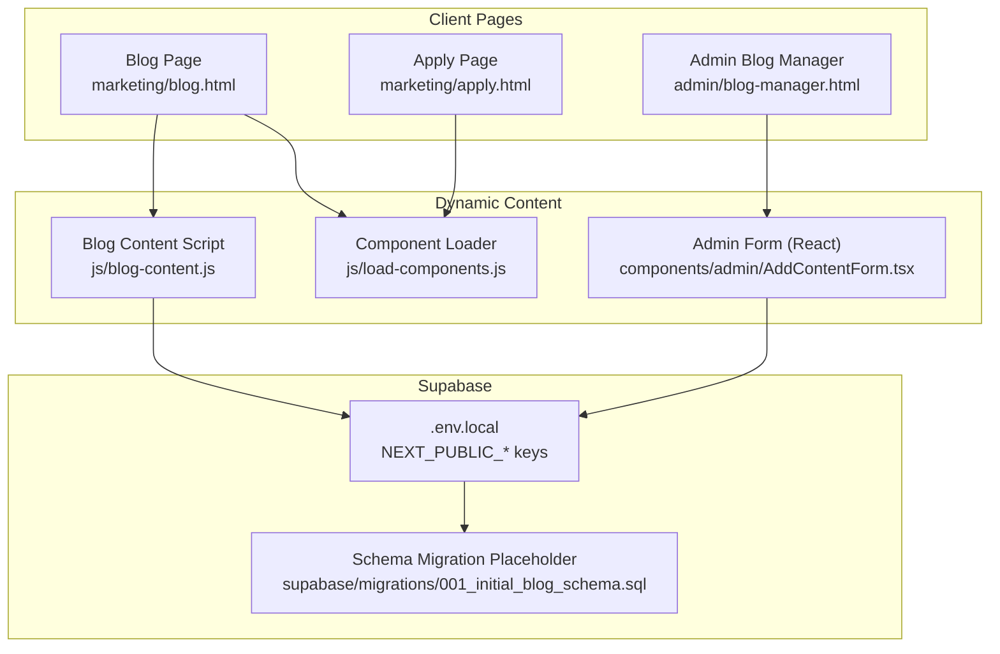
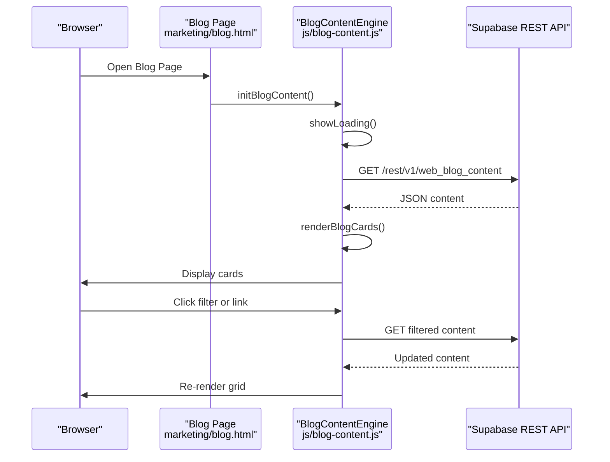
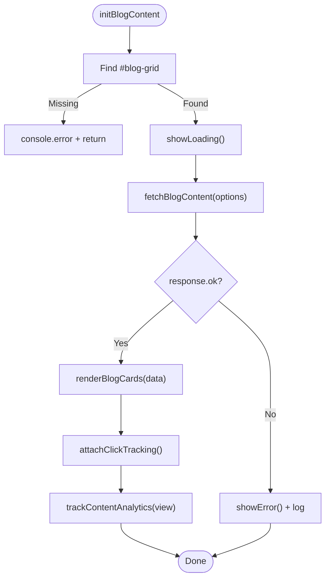
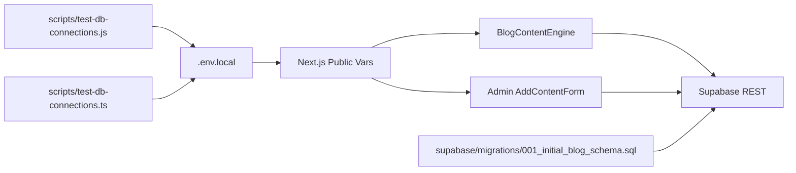

# Troubleshooting & FAQ

<cite>
**Referenced Files in This Document**
- [blog-content.js](file://js/blog-content.js)
- [blog-content.js](file://PRODUCTION_DEPLOY/js/blog-content.js)
- [load-components.js](file://js/load-components.js)
- [load-components.js](file://PRODUCTION_DEPLOY/js/load-components.js)
- [.env.local](file://.env.local)
- [test-db-connections.js](file://scripts/test-db-connections.js)
- [test-db-connections.ts](file://scripts/test-db-connections.ts)
- [001_initial_blog_schema.sql](file://supabase/migrations/001_initial_blog_schema.sql)
- [blog.html](file://marketing/blog.html)
- [blog.html](file://PRODUCTION_DEPLOY/marketing/blog.html)
- [apply.html](file://marketing/apply.html)
- [apply.html](file://PRODUCTION_DEPLOY/marketing/apply.html)
- [AddContentForm.tsx](file://components/admin/AddContentForm.tsx)
- [blog-manager.html](file://admin/blog-manager.html)
- [live-chat-widget.html](file://components/live-chat-widget.html)
- [chatbot.js](file://widgets/truevow-chatbot/chatbot.js)
</cite>

## Table of Contents
1. [Introduction](#introduction)
2. [Project Structure](#project-structure)
3. [Core Components](#core-components)
4. [Architecture Overview](#architecture-overview)
5. [Detailed Component Analysis](#detailed-component-analysis)
6. [Dependency Analysis](#dependency-analysis)
7. [Performance Considerations](#performance-considerations)
8. [Troubleshooting Guide](#troubleshooting-guide)
9. [Conclusion](#conclusion)
10. [Appendices](#appendices)

## Introduction
This document provides comprehensive troubleshooting guidance for the TrueVow Website, focusing on:
- Blog content loading problems
- Form submission failures
- Supabase connection errors
- CORS-related issues
- Browser-specific issues
- Mobile responsiveness problems
- Performance optimization tips
- Debugging techniques using browser developer tools, network inspection, and console logging
- Frequently asked questions about deployment, configuration, and maintenance
- Preventive measures and best practices
- Security-related troubleshooting and compliance verification procedures

## Project Structure
The website comprises static HTML/CSS/JS pages, client-side React admin components, and Supabase-backed dynamic content. Key areas relevant to troubleshooting:
- Dynamic blog content rendering via client-side fetch to Supabase
- Component loader for navigation/footer injection
- Admin React form for adding/updating blog content
- Static application form pages with county/ZIP validation
- Live chat and embedded chatbot widgets

**Diagram sources**
- [blog.html](file://marketing/blog.html#L470-L476)
- [apply.html](file://marketing/apply.html#L468-L494)
- [blog-content.js](file://js/blog-content.js#L1-L424)
- [load-components.js](file://js/load-components.js#L1-L58)
- [AddContentForm.tsx](file://components/admin/AddContentForm.tsx#L1-L357)
- [.env.local](file://.env.local#L27-L28)
- [001_initial_blog_schema.sql](file://supabase/migrations/001_initial_blog_schema.sql#L1-L27)

**Section sources**
- [blog.html](file://marketing/blog.html#L470-L476)
- [apply.html](file://marketing/apply.html#L468-L494)
- [blog-content.js](file://js/blog-content.js#L1-L424)
- [load-components.js](file://js/load-components.js#L1-L58)
- [AddContentForm.tsx](file://components/admin/AddContentForm.tsx#L1-L357)
- [.env.local](file://.env.local#L27-L28)
- [001_initial_blog_schema.sql](file://supabase/migrations/001_initial_blog_schema.sql#L1-L27)

## Core Components
- Blog content engine: Fetches and renders published content from Supabase, tracks analytics, and supports filtering.
- Component loader: Injects standardized navigation and footer into pages.
- Admin React form: Adds and updates blog content with validation and Supabase insertion.
- Static application form: Multi-step form with county/ZIP lookup and eligibility checks.
- Live chat widget and embedded chatbot: Engagement tools with keyword-based responses.

**Section sources**
- [blog-content.js](file://js/blog-content.js#L26-L64)
- [blog-content.js](file://js/blog-content.js#L109-L219)
- [load-components.js](file://js/load-components.js#L14-L31)
- [AddContentForm.tsx](file://components/admin/AddContentForm.tsx#L63-L141)
- [apply.html](file://marketing/apply.html#L536-L800)
- [live-chat-widget.html](file://components/live-chat-widget.html#L400-L490)
- [chatbot.js](file://widgets/truevow-chatbot/chatbot.js#L69-L95)

## Architecture Overview
High-level flow for blog content and admin operations:

**Diagram sources**
- [blog.html](file://marketing/blog.html#L470-L476)
- [blog-content.js](file://js/blog-content.js#L319-L350)
- [blog-content.js](file://js/blog-content.js#L26-L64)
- [blog-content.js](file://js/blog-content.js#L109-L219)

## Detailed Component Analysis

### Blog Content Engine
- Responsibilities: Fetch published content, render cards, track views/clicks, filter by type, show loading/error states.
- Key functions: fetchBlogContent, renderBlogCards, trackContentAnalytics, initBlogContent, updateActiveFilter.
- Supabase endpoint: Uses REST endpoint with apikey header and Prefer header.
- Error handling: Catches fetch/network errors, logs to console, displays user-friendly error message.

**Diagram sources**
- [blog-content.js](file://js/blog-content.js#L319-L350)
- [blog-content.js](file://js/blog-content.js#L26-L64)
- [blog-content.js](file://js/blog-content.js#L109-L219)

**Section sources**
- [blog-content.js](file://js/blog-content.js#L26-L64)
- [blog-content.js](file://js/blog-content.js#L109-L219)
- [blog-content.js](file://js/blog-content.js#L319-L350)
- [blog.html](file://marketing/blog.html#L436-L440)

### Component Loader
- Responsibilities: Load navigation/footer from static HTML files into placeholders.
- Behavior: On DOMContentLoaded, fetches component HTML and injects innerHTML; logs errors if target missing or fetch fails.

**Section sources**
- [load-components.js](file://js/load-components.js#L14-L31)
- [load-components.js](file://js/load-components.js#L36-L55)
- [blog.html](file://marketing/blog.html#L418-L419)
- [apply.html](file://marketing/apply.html#L470-L471)

### Admin React Form (AddContentForm)
- Responsibilities: Client-side validation, prepare canonical URL with UTM params, insert into Supabase via supabase-js.
- Validation: Ensures required fields and type-specific read/watch time.
- Submission: Handles success/error messaging and resets form.

**Section sources**
- [AddContentForm.tsx](file://components/admin/AddContentForm.tsx#L34-L60)
- [AddContentForm.tsx](file://components/admin/AddContentForm.tsx#L63-L141)

### Static Application Form
- Responsibilities: Multi-step form with county/ZIP lookup, state selection, eligibility checkboxes, and review summary.
- Features: Phone formatting/validation, ZIP-to-county lookup, capacity alerts, progress indicators.

**Section sources**
- [apply.html](file://marketing/apply.html#L536-L800)

### Live Chat Widgets
- Live Chat Widget: Keyword-based responses, typing indicators, GA event tracking.
- Embedded Chatbot: Template-driven creation with launcher and configurable options.

**Section sources**
- [live-chat-widget.html](file://components/live-chat-widget.html#L400-L490)
- [chatbot.js](file://widgets/truevow-chatbot/chatbot.js#L69-L95)

## Dependency Analysis
- Supabase client configuration:
  - Client-side Next.js public variables: NEXT_PUBLIC_ADMIN_SUPABASE_URL, NEXT_PUBLIC_ADMIN_SUPABASE_ANON_KEY.
  - Local environment file defines these variables for local development.
- Database connectivity testing:
  - Scripts test connections to multiple Supabase projects using environment variables.
- Migration schema:
  - Migration placeholder indicates expected schema presence and RLS policies.

**Diagram sources**
- [.env.local](file://.env.local#L27-L28)
- [blog-content.js](file://js/blog-content.js#L44-L51)
- [AddContentForm.tsx](file://components/admin/AddContentForm.tsx#L9)
- [test-db-connections.js](file://scripts/test-db-connections.js#L11-L21)
- [test-db-connections.ts](file://scripts/test-db-connections.ts#L12-L21)
- [001_initial_blog_schema.sql](file://supabase/migrations/001_initial_blog_schema.sql#L1-L27)

**Section sources**
- [.env.local](file://.env.local#L27-L28)
- [blog-content.js](file://js/blog-content.js#L44-L51)
- [AddContentForm.tsx](file://components/admin/AddContentForm.tsx#L9)
- [test-db-connections.js](file://scripts/test-db-connections.js#L11-L21)
- [test-db-connections.ts](file://scripts/test-db-connections.ts#L12-L21)
- [001_initial_blog_schema.sql](file://supabase/migrations/001_initial_blog_schema.sql#L1-L27)

## Performance Considerations
- Network requests:
  - Minimize payload size by selecting only needed columns in REST queries.
  - Use server-side filtering (type, featured, limit) to reduce client-side processing.
- Rendering:
  - Defer heavy DOM manipulation; batch updates to the grid.
  - Avoid unnecessary reflows by setting innerHTML once per render cycle.
- Assets:
  - Lazy-load thumbnails; use responsive image attributes.
- Caching:
  - Consider caching strategies for repeated filter operations (client-side cache or CDN).
- Bundle size:
  - Keep widget scripts minimal; avoid redundant libraries.

[No sources needed since this section provides general guidance]

## Troubleshooting Guide

### A. Blog Content Loading Problems
Symptoms:
- Blank grid or “Loading…” persists
- “Error” banner appears with retry button
- Filter buttons do nothing

Common causes and fixes:
- Missing container element:
  - Ensure the page contains a div with id blog-grid.
  - Verify the script inclusion path is correct.
- Supabase configuration mismatch:
  - Confirm SUPABASE_URL and SUPABASE_ANON_KEY match your project.
  - For client-side React admin, ensure NEXT_PUBLIC_ADMIN_SUPABASE_URL and NEXT_PUBLIC_ADMIN_SUPABASE_ANON_KEY are set.
- Network errors:
  - Use browser DevTools Network tab to inspect the REST call to Supabase.
  - Look for 401/403 (authorization), 404 (endpoint/path), or 5xx errors.
- CORS issues:
  - If cross-origin requests fail, verify Supabase project allows requests from your origin.
  - Check that apikey header is present and correct.

Diagnostic steps:
1. Open Developer Tools > Console and Network tabs.
2. Refresh the blog page and observe console errors.
3. In Network tab, find the Supabase REST request; check status and response.
4. Verify the blog-grid element exists in the DOM.
5. Confirm environment variables are loaded (for React admin, check Next.js runtime).

Resolution strategies:
- Fix configuration:
  - Update SUPABASE_URL and SUPABASE_ANON_KEY in the blog content script.
  - Set NEXT_PUBLIC_ADMIN_SUPABASE_URL and NEXT_PUBLIC_ADMIN_SUPABASE_ANON_KEY in .env.local.
- Validate endpoint:
  - Manually call the REST endpoint with curl or Postman to confirm availability.
- CORS:
  - Add your domain to Supabase Auth: Allowed Origins.
  - Ensure headers include apikey and Authorization.

**Section sources**
- [blog-content.js](file://js/blog-content.js#L319-L350)
- [blog-content.js](file://js/blog-content.js#L26-L64)
- [blog.html](file://marketing/blog.html#L436-L440)
- [.env.local](file://.env.local#L27-L28)

### B. Form Submission Failures
Symptoms:
- Admin form shows error message
- No new content appears on the blog
- React form remains stuck in submitting state

Common causes and fixes:
- Missing or invalid Supabase credentials:
  - Ensure NEXT_PUBLIC_ADMIN_SUPABASE_URL and NEXT_PUBLIC_ADMIN_SUPABASE_ANON_KEY are set.
- Validation errors:
  - Required fields missing or type-specific read/watch time not provided.
- Supabase RLS policies:
  - Insert permissions may be restricted; verify RLS policies allow inserts for anon/public roles.
- Network failures:
  - Check browser Network tab for failed XHR/fetch to Supabase.

Diagnostic steps:
1. Open Developer Tools > Console and Network.
2. Submit the form and inspect the insert request.
3. Check for validation messages and Supabase error responses.
4. Verify environment variables are present in the client bundle.

Resolution strategies:
- Set environment variables:
  - Populate .env.local with NEXT_PUBLIC_ADMIN_SUPABASE_URL and NEXT_PUBLIC_ADMIN_SUPABASE_ANON_KEY.
- Adjust RLS:
  - Review and adjust RLS policies for web_blog_content insert/select/update/delete.
- Test connectivity:
  - Run scripts/test-db-connections.js or scripts/test-db-connections.ts to validate all Supabase connections.

**Section sources**
- [AddContentForm.tsx](file://components/admin/AddContentForm.tsx#L63-L141)
- [blog-manager.html](file://admin/blog-manager.html#L1-L800)
- [.env.local](file://.env.local#L27-L28)
- [test-db-connections.js](file://scripts/test-db-connections.js#L22-L50)
- [test-db-connections.ts](file://scripts/test-db-connections.ts#L23-L51)

### C. Supabase Connection Errors
Symptoms:
- “Not configured” warnings during connection tests
- 401/403 responses when inserting/updating
- Migration placeholder indicating missing schema

Common causes and fixes:
- Missing environment variables:
  - Ensure NEXT_PUBLIC_ADMIN_SUPABASE_URL and NEXT_PUBLIC_ADMIN_SUPABASE_ANON_KEY are defined.
- Incorrect project keys:
  - Verify keys belong to the intended Supabase project.
- Migration not applied:
  - The migration placeholder indicates the schema should be restored from the Supabase dashboard.

Diagnostic steps:
1. Run scripts/test-db-connections.js or scripts/test-db-connections.ts.
2. Observe which database reports “NOT CONFIGURED” or “ERROR”.
3. Compare keys in .env.local with Supabase project settings.

Resolution strategies:
- Define environment variables:
  - Add NEXT_PUBLIC_ADMIN_SUPABASE_URL and NEXT_PUBLIC_ADMIN_SUPABASE_ANON_KEY to .env.local.
- Restore schema:
  - Export the schema from Supabase dashboard and replace the migration placeholder file with the exported SQL.
- Verify RLS:
  - Confirm RLS policies allow required operations for the anon/public roles.

**Section sources**
- [.env.local](file://.env.local#L27-L28)
- [test-db-connections.js](file://scripts/test-db-connections.js#L22-L50)
- [test-db-connections.ts](file://scripts/test-db-connections.ts#L23-L51)
- [001_initial_blog_schema.sql](file://supabase/migrations/001_initial_blog_schema.sql#L1-L27)

### D. CORS-Related Issues
Symptoms:
- Cross-Origin Request Blocked
- Preflight OPTIONS requests failing
- Mixed content warnings

Common causes and fixes:
- Origin not whitelisted:
  - Add your domain to Supabase Auth: Allowed Origins.
- Missing headers:
  - Ensure apikey header is included in requests.
- HTTPS mismatch:
  - Serve the site over HTTPS to avoid mixed content blocks.

Diagnostic steps:
1. In Network tab, inspect the failing request’s preflight and actual request.
2. Check response headers for Access-Control-Allow-Origin and apikey presence.
3. Verify the origin is listed in Supabase Allowed Origins.

Resolution strategies:
- Whitelist origins:
  - Add your production domain(s) to Supabase Allowed Origins.
- Use correct headers:
  - Ensure apikey and Authorization headers are sent with every request.
- Enforce HTTPS:
  - Redirect HTTP traffic to HTTPS in your deployment.

**Section sources**
- [blog-content.js](file://js/blog-content.js#L44-L51)
- [AddContentForm.tsx](file://components/admin/AddContentForm.tsx#L96-L100)

### E. Browser-Specific Issues
Symptoms:
- Certain features work in Chrome but not Safari/Firefox
- Polyfills missing for older browsers
- CSS Grid or Flexbox rendering differences

Common causes and fixes:
- ES6+ features:
  - Some environments may lack Promise/async-await support; add polyfills if targeting older browsers.
- CSS Grid support:
  - Ensure fallbacks for older browsers; test on target devices.
- Event handling:
  - Use standard event listeners; avoid non-standard APIs.

Diagnostic steps:
1. Test on multiple browsers and devices.
2. Check Console for unsupported API errors.
3. Validate CSS Grid/Flexbox compatibility.

Resolution strategies:
- Add polyfills for Promise/async-await if needed.
- Provide CSS fallbacks for layout features.
- Use feature detection and graceful degradation.

**Section sources**
- [blog-content.js](file://js/blog-content.js#L373-L379)
- [load-components.js](file://js/load-components.js#L51-L55)

### F. Mobile Responsiveness Problems
Symptoms:
- Overlapping elements, truncated text, or unusable buttons on small screens
- Chat widget overlays content

Common causes and fixes:
- Responsive breakpoints:
  - Ensure media queries adjust grid and typography for smaller screens.
- Fixed positioning:
  - Verify fixed-positioned widgets do not overlap critical content.

Diagnostic steps:
1. Use Device Toolbar in DevTools to simulate mobile.
2. Inspect layout shifts and overflow.
3. Test tap targets and spacing.

Resolution strategies:
- Tighten media queries and adjust grid template columns.
- Increase touch target sizes and spacing.
- Reassess fixed-positioned widgets for mobile.

**Section sources**
- [blog.html](file://marketing/blog.html#L356-L383)
- [apply.html](file://marketing/apply.html#L453-L465)
- [live-chat-widget.html](file://components/live-chat-widget.html#L325-L331)

### G. Performance Optimization Tips
- Reduce payload:
  - Select only required columns in REST queries.
- Optimize rendering:
  - Batch DOM updates; avoid frequent reflows.
- Asset delivery:
  - Compress images and leverage browser caching.
- Minimize third-party scripts:
  - Defer non-critical scripts; consolidate where possible.

**Section sources**
- [blog-content.js](file://js/blog-content.js#L42-L51)
- [blog-content.js](file://js/blog-content.js#L109-L219)

### H. Debugging Techniques
- Browser developer tools:
  - Console: Check for thrown errors and suppressed warnings.
  - Network: Inspect request/response bodies, headers, and status codes.
  - Elements: Verify DOM structure and CSS rules.
- Logging:
  - Use console.log statements around critical paths (fetch, render, analytics).
- Analytics:
  - Confirm analytics events fire and GA/other tracking is initialized.

**Section sources**
- [blog-content.js](file://js/blog-content.js#L60-L63)
- [blog-content.js](file://js/blog-content.js#L72-L102)
- [live-chat-widget.html](file://components/live-chat-widget.html#L421-L427)

### I. Frequently Asked Questions (FAQ)

Q: Where do I configure Supabase credentials?
A: For client-side usage, set NEXT_PUBLIC_ADMIN_SUPABASE_URL and NEXT_PUBLIC_ADMIN_SUPABASE_ANON_KEY in .env.local.

Q: Why does the blog not load content?
A: Check the blog-grid container, verify Supabase URL/key, and inspect the Network tab for REST errors.

Q: How do I test Supabase connectivity?
A: Run scripts/test-db-connections.js or scripts/test-db-connections.ts to validate all configured Supabase connections.

Q: The admin form shows an error. What should I check?
A: Confirm environment variables are present, validate form inputs, and inspect the Supabase insert request in the Network tab.

Q: How do I fix CORS errors?
A: Add your domain to Supabase Allowed Origins and ensure apikey headers are included.

Q: How do I restore the blog schema?
A: Export the schema from the Supabase dashboard and replace the migration placeholder file with the exported SQL.

Q: How do I verify RLS policies?
A: Review Supabase RLS policies for web_blog_content to ensure they allow required operations for anon/public roles.

Q: How do I improve mobile performance?
A: Tighten media queries, optimize images, and defer non-critical scripts.

Q: How do I troubleshoot the live chat widget?
A: Check Console for errors, verify GA initialization, and ensure keyword-based responses are triggered.

**Section sources**
- [.env.local](file://.env.local#L27-L28)
- [test-db-connections.js](file://scripts/test-db-connections.js#L52-L60)
- [test-db-connections.ts](file://scripts/test-db-connections.ts#L53-L61)
- [001_initial_blog_schema.sql](file://supabase/migrations/001_initial_blog_schema.sql#L1-L27)
- [blog-content.js](file://js/blog-content.js#L44-L51)
- [AddContentForm.tsx](file://components/admin/AddContentForm.tsx#L96-L100)
- [live-chat-widget.html](file://components/live-chat-widget.html#L421-L427)

### J. Preventive Measures and Best Practices
- Configuration hygiene:
  - Store secrets securely; never commit environment files to version control.
- Schema management:
  - Keep migrations synchronized with Supabase dashboard exports.
- Monitoring:
  - Monitor Network tab for persistent failures; set up basic alerting for critical endpoints.
- Security:
  - Enforce HTTPS, whitelist origins, and regularly audit RLS policies.
- Maintenance:
  - Periodically validate Supabase connectivity and endpoint health.

**Section sources**
- [.env.local](file://.env.local#L9-L13)
- [001_initial_blog_schema.sql](file://supabase/migrations/001_initial_blog_schema.sql#L1-L27)
- [test-db-connections.js](file://scripts/test-db-connections.js#L52-L60)
- [test-db-connections.ts](file://scripts/test-db-connections.ts#L53-L61)

### K. Security-Related Troubleshooting and Compliance
- Authentication:
  - Ensure apikey and Authorization headers are correct and not exposed in client-side code.
- Data access:
  - Verify RLS policies restrict access appropriately; test with different roles.
- Compliance:
  - External links disclaimer is present on the blog page; ensure compliance with platform terms and applicable regulations.

**Section sources**
- [blog-content.js](file://js/blog-content.js#L44-L51)
- [blog.html](file://marketing/blog.html#L442-L446)

## Conclusion
This guide consolidates actionable diagnostics and resolutions for the most common TrueVow Website issues. By validating configurations, inspecting network activity, and applying the recommended fixes, most problems can be resolved quickly. Adopting the preventive measures and best practices outlined here will help maintain reliability and performance over time.

[No sources needed since this section summarizes without analyzing specific files]

## Appendices

### A. Quick Checklist
- Verify .env.local contains NEXT_PUBLIC_ADMIN_SUPABASE_URL and NEXT_PUBLIC_ADMIN_SUPABASE_ANON_KEY
- Confirm blog-grid exists on the blog page
- Check Supabase Allowed Origins includes your domain
- Run scripts/test-db-connections.js to validate connectivity
- Inspect Network tab for REST errors and CORS failures
- Validate RLS policies for web_blog_content

**Section sources**
- [.env.local](file://.env.local#L27-L28)
- [blog.html](file://marketing/blog.html#L436-L440)
- [test-db-connections.js](file://scripts/test-db-connections.js#L52-L60)